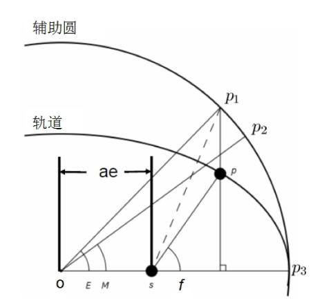

# 天体力学基础

## 绪论

### 矢量运算和场运算

参考 [矢量运算和基础场论](/blog/math/vector_field)

### 坐标系变换

- 坐标基底变换
  
  $(\hat{e}_1,\hat{e}_2)\rightarrow(\hat{e}_1',\hat{e}_2')$:
  $$
  (\hat{e}_1'\quad\hat{e}_2')=(\hat{e}_1\quad\hat{e}_2)\boldsymbol{A}
  $$

- 对应矢量坐标变换

  $\boldsymbol{\alpha}=\alpha_1\hat{e}_1+\alpha_2\hat{e}_2=\alpha_1'\hat{e}_1'+\alpha_2'\hat{e}_2'$:
  $$
  \boldsymbol{\alpha}=(\hat{e}_1\quad\hat{e}_2)\left(\begin{array}{c}\alpha_1 \\ \alpha_2\end{array}\right)=(\hat{e}_1'\quad\hat{e}_2')\left(\begin{array}{c}\alpha_1' \\ \alpha_2'\end{array}\right)=(\hat{e}_1\quad\hat{e}_2)\boldsymbol{A}^{-1}\left(\begin{array}{c}\alpha_1 \\ \alpha_2\end{array}\right)
  $$
  $$
  \Rightarrow\left(\begin{array}{c}\alpha_1' \\ \alpha_2'\end{array}\right)=\boldsymbol{A}^{-1}\left(\begin{array}{c}\alpha_1 \\ \alpha_2\end{array}\right)
  $$

- 常用的坐标变换矩阵：
  
  1. 转动
  $$
  \boldsymbol{R}_x(\theta)=\left[\begin{array}{ccc}
  1 & 0 & 0 \\
  0 & \cos\theta & \sin\theta \\
  0 & -\sin\theta & \cos\theta
  \end{array}\right]
  $$
  $$
  \boldsymbol{R}_y(\theta)=\left[\begin{array}{ccc}
  \cos\theta & 0 & -\sin\theta \\
  0 & 1 & 0 \\
  \sin\theta & 0 & \cos\theta
  \end{array}\right]
  $$
  $$
  \boldsymbol{R}_z(\theta)=\left[\begin{array}{ccc}
  \cos\theta & \sin\theta & 0 \\
  -\sin\theta & \cos\theta & 0 \\
  0 & 0 & 1
  \end{array}\right]
  $$
  2. 宇称
  $$
  \boldsymbol{P}_x=\left[\begin{array}{ccc}
  -1 & 0 & 0 \\
  0 & 1 & 0 \\
  0 & 0 & 1
  \end{array}\right]
  $$
  $$
  \boldsymbol{P}_y=\left[\begin{array}{ccc}
  1 & 0 & 0 \\
  0 & -1 & 0 \\
  0 & 0 & 1
  \end{array}\right]
  $$
  $$
  \boldsymbol{P}_y=\left[\begin{array}{ccc}
  1 & 0 & 0 \\
  0 & 1 & 0 \\
  0 & 0 & -1
  \end{array}\right]
  $$

## 二体问题

### 有心力对应的比耐公式

$$
-mh^2u^2\frac{\mathrm{d}^2u}{\mathrm{d}\theta^2}-mu^3h^2=F
$$

::: info derivation
$$
F=ma_r=m(\ddot{r}-r\dot{\theta}^2)
$$
$$
L=mh=mr^2\dot{\theta}
$$
$$
r\equiv\frac{1}{u}
$$
:::

### 二体运动方程

#### 质心系

牛顿力学给出
$$
\vec{F}_1=m_1\ddot{\vec{r}}_1=\frac{Gm_1m_2}{r^3}\vec{r}=\frac{Gm_1m_2}{r^2}\hat{r},
$$
$$
\vec{F}_2=m_2\ddot{\vec{r}}_2=-\frac{Gm_1m_2}{r^3}\vec{r}=-\frac{Gm_1m_2}{r^2}\hat{r}.
$$

在质心系中
$$
\ddot{\vec{r}}_1=\frac{Gm_2}{r^3}\vec{r}=-\frac{Gm_2^3}{(m_1+m_2)^2}\frac{\vec{r}_1}{r_1^3},
$$
$$
\ddot{\vec{r}}_2=-\frac{Gm_1}{r^3}\vec{r}=-\frac{Gm_1^3}{(m_1+m_2)^2}\frac{\vec{r}_2}{r_2^3}.
$$

#### 相对运动方程和有效单体问题

相对位移 $\vec{r}\equiv\vec{r}_2-\vec{r}_1$

$$
\frac{\mathrm{d}^2\vec{r}}{\mathrm{d}t^2}=-G(m_1+m_2)\frac{\vec{r}}{r^3}.
$$

有效单体问题 (Effective One Body problem)

#### 从非惯性系看有效单体问题

取以天体1为参考的非惯性系
$$
\begin{align}
m_2\ddot{\vec{r}}&=-\frac{Gm_1m_2}{r^3}\vec{r}-m_2\ddot{\vec{r}}_1 \\
&=-\frac{Gm_1m_2}{r^3}\vec{r}-m_2\frac{Gm_2}{r^3}\vec{r} \\
&=-Gm_2(m_1+m_2)\frac{\vec{r}}{r^3}
\end{align}
$$

### 二体运动方程求解

有效单体问题方程可简记为
$$
\ddot{\vec{r}}=-\mu\frac{\vec{r}}{r^3}
$$

#### 面积积分与角动量守恒

方程两边 $\vec{r}\times$ $\Rightarrow$ $\frac{\mathrm{d}}{\mathrm{d}t}(\vec{r}\times\dot{\vec{r}})=0$

#### 拉普拉斯积分与轨道曲线

- 拉普拉斯积分（守恒矢量 $\vec{e}$ ）
  
  $$
  \vec{h}\times\dot{\vec{r}}+\mu\frac{\vec{r}}{r}\equiv-\mu\vec{e}
  $$

  龙格楞次 (Runge-Lenz) 矢量即 $m\mu\vec{e}$

- 轨道曲线

  $\vec{r}\cdot\vec{e}=-r+\frac{h^2}{\mu}=re\cos f$ $\Rightarrow$ $r=\frac{p}{1+e\cos f}$

#### 活力积分与能量守恒

活力积分
$$
E=\frac{1}{2}\dot{\vec{r}}\cdot\dot{\vec{r}}-\frac{\mu}{r}=-\frac{\mu}{2a}
$$

#### 轨道根数

- 半长径 $a$、偏心率 $e$
- 轨道倾角 $i$、升交点赤经 $\Omega$、近心点幅角 $\omega$
- 平近点角 $M$、过近心点时刻 $\tau$

- 平近点角 $M$ (Mean Anomaly)
- 偏近点角 $E$ (Eccentric Anomaly)
- 真近点角 $f$ (True Anomaly)
$$
\cos f=\frac{\cos E-e}{1-e\cos E}
$$
$$
M=E-e\sin E
$$

### 星历表计算

#### 轨道坐标系

$$
\vec{r}=a(\cos E-e)\hat{P}+a\sqrt{1-e^2}\sin E\hat{Q}
$$
$$
\dot{\vec{r}}=\frac{na^2}{r}(-\sin E\hat{P}+\sqrt{1-e^2}\cos E\hat{Q})
$$

#### 从轨道坐标系到任意坐标系

$$
\left[\begin{array}{c}
x \\
y \\
z
\end{array}\right]=R_z(\omega)R_x(\iota)R_z(\Omega)\left[\begin{array}{c}
x' \\
y' \\
z'
\end{array}\right]
$$
$$
\left[\begin{array}{c}
x \\
y \\
z
\end{array}\right]=\left[\begin{array}{ccc}
\cos\omega\cos\Omega-\cos\iota\sin\omega\sin\Omega & \cos\iota\cos\Omega\sin\omega+\cos\omega\sin\Omega & \sin\iota\sin\omega \\
-\cos\Omega\sin\omega-\cos\iota\cos\omega\sin\Omega & \cos\iota\cos\omega\cos\Omega-\sin\omega\sin\Omega & \cos\omega\sin\iota \\
\sin\iota\sin\Omega & -\cos\Omega\sin\iota & \cos\iota
\end{array}\right]
\left[\begin{array}{c}
x' \\
y' \\
z'
\end{array}\right]
$$

#### 星历表的计算

1. $M\rightarrow E$
$$
M(t)=nt+M_0,\quad E-e\sin E=M
$$

2. 轨道坐标系 ($\hat{P},\hat{Q}$) $\rightarrow\vec{r},\dot{\vec{r}}$

3. 所需坐标下的 ($\hat{P},\hat{Q}$)
$$
\hat{P}=\left[\begin{array}{c}
\cos\omega\cos\Omega-\cos\iota\sin\omega\sin\Omega \\
\cos\omega\sin\Omega+\cos\iota\cos\Omega\sin\omega \\
\sin\iota\sin\omega
\end{array}\right]
$$
$$
\hat{Q}=\left[\begin{array}{c}
-\cos\iota\cos\omega\sin\Omega-\cos\Omega\sin\omega \\
\cos\iota\cos\omega\cos\Omega-\sin\omega\sin\Omega \\
\cos\omega\sin\iota
\end{array}\right]
$$

- 从日心黄道坐标到日心赤道坐标 $R_x(-\epsilon)$
- 从日心赤道坐标到地心赤道坐标 平移

#### 轨道计算

- 由 $\vec{r}(t_0)$ 和 $\dot{\vec{r}}(t_0)$
  
  1. 由活力积分
  $$
  a=1/\left(\frac{2}{r}-\frac{v^2}{\mu}\right)
  $$
  2. $\mu,a\rightarrow n$
  $$
  n=\sqrt{\frac{\mu}{a^3}}
  $$
  3. $r,\vec{r}\cdot\dot{\vec{r}}\rightarrow e,E$
  $$
  e=\sqrt{(1-\frac{r}{a})^2+(\frac{\vec{r}\cdot\dot{\vec{r}}}{a^2n})^2}
  $$
  $$
  \tan E=(\frac{\vec{r}\cdot\dot{\vec{r}}}{a^2n})/(1-\frac{r}{a})
  $$
  4. $E\rightarrow M$
  $$
  M=E-e\sin E
  $$
  5. $\vec{r},\dot{\vec{r}}\rightarrow\hat{P},\hat{Q}$
  $$
  \hat{P}=\frac{\cos E}{r}\vec{r}-\frac{\sin E}{an}\dot{\vec{r}}
  $$
  $$
  \hat{Q}=\frac{\sin E}{r\sqrt{1-e^2}}\vec{r}+\frac{\cos E-e}{an\sqrt{1-e^2}}\dot{\vec{r}}
  $$
  6. $\hat{n}=\hat{P}\times\hat{Q}$
  7. $\hat{n},\hat{P},\hat{Q}\rightarrow\Omega,\omega,\iota$
  $$
  \Omega=-\arctan\frac{\hat{n}_x}{\hat{n}_y}
  $$
  $$
  \omega=\arctan\frac{\hat{P}_z}{\hat{Q}_z}
  $$
  $$
  \iota=\arccos\hat{n}_z
  $$
  5'. $\vec{h}=\vec{r}\times\dot{\vec{r}}\rightarrow \iota,\Omega$
  $$
  \vec{h}=A\hat{i}+B\hat{j}+C\hat{k}
  $$
  $$
  \cos\iota=\frac{C}{h}
  $$
  $$
  \cos\Omega=-\frac{B}{h\sin\iota}
  $$
  6'. $\vec{h},\vec{e}\rightarrow\hat{n},\hat{P}\rightarrow\hat{Q}\rightarrow \omega$
  $$
  \vec{e}=-\frac{1}{\mu}\left(\vec{h}\times\dot{\vec{r}}+\mu\frac{\vec{r}}{r}\right)
  $$

- 由 $\vec{r}(t_1)$ 和 $\vec{r}(t_2)$
