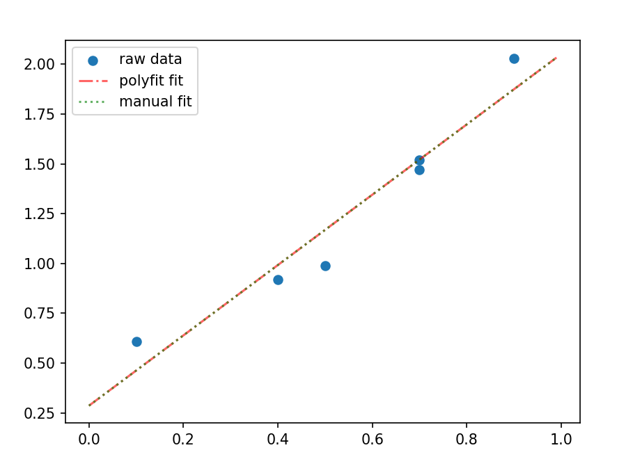

# 天文数据处理

## 时间序列处理

### 插值

对于时间间隔 $\Delta t$ 不均匀的离散时间序列，可以通过插值补充为时间间隔固定的序列。

使用 `python` 中 `scipy` 模块里的 `interpolate.interp1d` 进行插值：

[`interpolate.interp1d(x, y, kind='linear')`](https://docs.scipy.org/doc/scipy/reference/generated/scipy.interpolate.interp1d.html#scipy.interpolate.interp1d)

| 参数 `kind` | 插值方法 |
|:--:|:--:|
| `linear` | 线性插值 |
| `nearest`,`nearest_up` | 最邻近阶梯插值 |
| `zero` | 零阶样条插值 |
| `slinear` | 一阶样条插值 |
| `quadratic` | 二阶样条插值 |
| `cubic` | 三阶样条插值 |
| `previous`,`next` | 阶梯插值 |


::: details `python` 脚本
```py
import numpy as np
import matplotlib.pyplot as plt
from scipy import interpolate

t = np.array([1, 2, 4, 7, 8, 9])
y = np.array([1, 3, 5, 3, 1, 3])

t_new = np.arange(1, 9, 0.1)
kinds = ['linear', 'nearest', 'nearest-up',
         'zero', 'slinear', 'quadratic', 'cubic',
         'previous', 'next']

f = interpolate.interp1d(t, y, kind='cubic')
y_new = f(t_new)

ax1 = plt.subplot(311)
ax2 = plt.subplot(312)
ax3 = plt.subplot(313)

ax1.scatter(t, y, c='b', alpha=0.6)
for kind in kinds[:3]:
    func = interpolate.interp1d(t, y, kind=kind)
    y_new = func(t_new)
    ax1.plot(t_new, y_new, label=kind, alpha=0.6)
ax1.set_xlabel('t')
ax1.set_ylabel('y')
ax1.legend()

ax2.scatter(t, y, c='b', alpha=0.6)
for kind in kinds[3:-2]:
    func = interpolate.interp1d(t, y, kind=kind)
    y_new = func(t_new)
    ax2.plot(t_new, y_new, label=kind, alpha=0.6)
ax2.set_xlabel('t')
ax2.set_ylabel('y')
ax2.legend()

ax3.scatter(t, y, c='b', alpha=0.6)
for kind in kinds[-2:]:
    func = interpolate.interp1d(t, y, kind=kind)
    y_new = func(t_new)
    ax3.plot(t_new, y_new, label=kind, alpha=0.6)
ax3.set_xlabel('t')
ax3.set_ylabel('y')
ax3.legend()

plt.show()
```
:::

### 平滑处理

#### 理论

常用的时间序列的平滑模型有：
- 滑动平均模型
- 加权滑动平均模型
- 二次滑动平均模型
- 指数平滑模型

1. 滑动平均模型

$n$ 阶滑动平均即以每 $n$ 个连续数据的平均值代替该区域中点处的数据

$$
x'(t_j)=\frac{1}{n}\sum_{i=j-\delta}^{j+\delta}x(t_i),\quad j=\delta+1,\delta+2,...,N-\delta
$$

（ $n$ 为奇数，记 $\displaystyle\delta=\frac{n+1}{2}$ ）

2. 加权滑动平均模型

在滑动平均模型中加入权重 $\alpha_i$

$$
x'(t_j)=\frac{1}{n}\sum_{i=j-\delta}^{j+\delta}\alpha_ix(t_i),\quad j=\delta+1,\delta+2,...,N-\delta
$$

（其中加权因子满足 $\displaystyle\frac{1}{n}\sum_i\alpha_i=1$ ）

3. 二次滑动平均模型

对经过一次滑动平均的序列再进行一次滑动平均。

4. 指数平滑模型

4-1. 简单指数平滑法
$$
S_t=Ay_t+(1-A)S_{t-1}
$$

4-2. 线性指数平滑法
$$
S_t=Ay_t+(1-A)(S_{t-1}+b_{t-1})
$$
加入趋势效应
$$
b_t=B(S_t-S_{t-1})+(1-B)b_{t-1}
$$

#### 实践

使用 `python` 中 `scipy` 模块里的 `signal.savgol_filter` 进行平滑：

[`signal.savgol_filter(x, window_length, polyorder)`](https://docs.scipy.org/doc/scipy/reference/generated/scipy.signal.savgol_filter.html#scipy.signal.savgol_filter)

取 `polyorder=1` ，该函数会对数据 `x` 进行 `window_length` 阶滑动平均。


::: details `python` 脚本
```py
import numpy as np
import matplotlib.pyplot as plt
from scipy import signal

t = np.arange(0, 50, 1)
x = 5 * np.sin(t)
noise = np.random.randn(50)
y = x + noise

window_lens = [3, 5, 13]

plt.plot(y, label='raw')
for l in window_lens:
    y_new = signal.savgol_filter(y, l, 1)
    plt.plot(y_new, label=f'window len={l}')
plt.legend()
plt.show()
```
:::

### 曲线拟合

#### 理论

1. 最小二乘法

拟合函数模型 $f(t_i)=a_0+a_1t_i+a_2t_i^2+...+a_mt_i^m$

取参数使残差平方和 $\displaystyle\Delta=\sum_{i=1}^n[y(t_i)-f(t_i)]^2$ 最小

即
$$
\frac{\partial\Delta}{\partial a_i}=\frac{\partial}{\partial a_j}\sum_{i=1}^n[y(t_i)-f(t_i)]^2=0,\quad j=0,1,...,m
$$

实例：参考 [作业2](/hw/data_process/hw2#理论推导)

2. 矩阵法

对数据 $x_i=[0.1, 0.4, 0.5, 0.7, 0.7, 0.9],y_i=[0.61, 0.92, 0.99, 1.52, 1.47, 2.03]$ 做线性回归

有超定线性方程
$$
a_1x_i+a_0=y_i,\quad i=1,2,...,6
$$
写成矩阵形式
$$
XA=Y
$$
其中
$$
X=\left[\begin{array}{cc}
0.1 & 1 \\
0.4 & 1 \\
0.5 & 1 \\
0.7 & 1 \\
0.7 & 1 \\
0.9 & 1
\end{array}\right],\ A=\left[\begin{array}{c}
a_1 \\
a_0
\end{array}\right],\ Y=\left[\begin{array}{c}
0.61 \\
0.92 \\
0.99 \\
1.52 \\
1.47 \\
2.03
\end{array}\right]
$$
等式两边同时左乘矩阵 $X^{T}$
$$
X^{T}XA=X^{T}Y\Rightarrow A=(X^TX)^{-1}X^TY
$$

::: details 验证程序
```py
import numpy as np
import matplotlib.pyplot as plt

xi = np.array([0.1, 0.4, 0.5, 0.7, 0.7, 0.9])
yi = np.array([0.61, 0.92, 0.99, 1.52, 1.47, 2.03])

# using polyfit
an = np.polyfit(xi, yi, 1)
p = np.poly1d(an)
print('polyfit:', p)

# using matrix
cons = np.ones(6)
X = np.c_[xi, cons]
X_t = X.T
X_tX_inv = np.linalg.inv(X_t@X)
A = X_tX_inv@X_t@yi
print('manual:', f'{A[0]}x+{A[1]}')

x_fit = np.arange(0, 1, 0.01)
y_fit1 = p(x_fit)
y_fit2 = A[0]*x_fit + A[1]

plt.scatter(xi, yi, label='raw data')
plt.plot(x_fit, y_fit1, 'r-.', alpha=0.6, label='polyfit fit')
plt.plot(x_fit, y_fit2, 'g:', alpha=0.6, label='manual fit')
plt.legend()
plt.show()
```

:::

#### 实践

使用 `python` 中 `scipy` 模块里 `optimize.curve_fit` 进行拟合：

[`optimize.curve_fit(f, xdata, ydata)`](https://docs.scipy.org/doc/scipy/reference/generated/scipy.optimize.curve_fit.html#scipy.optimize.curve_fit)

自行编写函数模型 `f(x, params)` ，将待拟合的数据 `xdata`,`ydata` 传入函数后会返回参数数组和协方差。

实例：

使用曲线模型 $g(x)=c_1+c_2x+c_3\sin(\pi x)+c_4\sin(2\pi x)$ 对下面数据进行拟合：

$x_i=[0.1, 0.2, 0.3, 0.4, 0.5, 0.6, 0.7, 0.8, 0.9]$

$y_i=[0, 2.122, 3.0244, 3.2568, 3.1399, 2.8579, 2.514, 2.1639, 1.8358]$


::: details `python` 脚本
```py
import numpy as np
import matplotlib.pyplot as plt
from scipy.optimize import curve_fit

# raw data
xi = np.array([0.1, 0.2, 0.3, 0.4, 0.5,
               0.6, 0.7, 0.8, 0.9])
yi = np.array([0, 2.122, 3.0244, 3.2568, 3.1399,
               2.8579, 2.514, 2.1639, 1.8358])

# use g(x)=c1+c2x+c3sin(pi*x)+c4sin(2pi*x) to fit
def func(x, c1, c2, c3, c4):
    return c1 + c2*x + c3*np.sin(np.pi*x) + c4*np.sin(2*np.pi*x)

popt, pcov = curve_fit(func, xi, yi)
x_fit = np.arange(0, 1, 0.01)
y_fit = func(x_fit, popt[0], popt[1], popt[2], popt[3])

# draw
plt.scatter(xi, yi, label='raw data')
plt.plot(x_fit, y_fit, label='fit curve')
plt.xlabel('x')
plt.ylabel('y')
plt.legend()
plt.show()
```
:::

## 时域频域转换

### 傅里叶变换

#### 理论

查看 [傅里叶变换](/blog/math/fourier_transform)

#### 实践

使用 `python` 中 `scipy` 模块里的 `fftpack.fft` 进行傅里叶变换：

[`fftpack.fft(x, N)`](https://docs.scipy.org/doc/scipy/reference/generated/scipy.fftpack.fft.html#scipy.fftpack.fft)

但是该函数只是返回数据进行傅里叶变换后的复数序列，还需要转化成频谱图。

```py
def FFT(data, T):
    L = len(data)
    N = int(np.power(2, np.ceil(np.log2(L))))
    FFT_y = np.abs(fft(data, N)) / L * 2
    Fre = np.arange(int(N/2)) * L / N / T
    FFT_y = FFT_y[range(int(N/2))]
    return Fre, FFT_y
```


实例：

绘制如下两个周期信号的频谱图
```py
T = 2
fs = 5000
f1 = 404
f2 = 2000
f3 = 1234

t = np.linspace(0, T, T*fs)

base = 2
component1 = 2*np.sin(2*np.pi*f1*t)
component2 = 5*np.sin(2*np.pi*f2*t+1)
component3 = 3*np.sin(2*np.pi*f3*t+4)
noise = np.random.normal(1, 10, T*fs)
y1 = base+component1+component2+component3
y2 = component1+component2+component3+noise
```


::: details `python` 脚本
```py
import numpy as np
import matplotlib.pyplot as plt
from scipy.fftpack import fft

def FFT(data, T):
    L = len(data)
    N = int(np.power(2, np.ceil(np.log2(L))))
    FFT_y = np.abs(fft(data, N)) / L * 2
    Fre = np.arange(int(N/2)) * L / N / T
    FFT_y = FFT_y[range(int(N/2))]
    return Fre, FFT_y

T = 2
fs = 5000
f1 = 404
f2 = 2000
f3 = 1234

t = np.linspace(0, T, T*fs)

base = 2
component1 = 2*np.sin(2*np.pi*f1*t)
component2 = 5*np.sin(2*np.pi*f2*t+1)
component3 = 3*np.sin(2*np.pi*f3*t+4)
noise = np.random.normal(1, 10, T*fs)
y1 = base+component1+component2+component3
y2 = component1+component2+component3+noise

ax1 = plt.subplot(211)
ax2 = plt.subplot(212)
fre1, fft_y1 = FFT(y1, T)
fre2, fft_y2 = FFT(y2, T)
ax1.plot(fre1, fft_y1)
ax2.plot(fre2, fft_y2)
ax1.set_ylabel('A')
ax1.grid()
ax2.set_ylabel('A')
ax2.set_xlabel('f/Hz')
ax2.grid()
plt.show()
```
上面绘图结果 $2000Hz$ 处的振幅比 $5$ 小，是由于快速傅里叶变化时补充到 2 的幂次项数据较多。可以将采样时长 `T` 改为 3 秒，这样得到的结果更好。
:::

### 逆傅里叶变换

#### 理论

把信号 $\{f_j\}$ 经过 FFT 得到的复数序列 $\{c_k\}$ 通过 IFFT 变回信号 $\{f_j\}$

#### 实践

使用 `scipy.fftpack.ifft` 进行逆傅里叶变换：

[`fftpack.ifft(x, N)`](https://docs.scipy.org/doc/scipy/reference/generated/scipy.fftpack.ifft.html#scipy.fftpack.ifft)

实例：

```py
import numpy as np
import matplotlib.pyplot as plt
from scipy.fftpack import fft, ifft

# generate signal
T = 2
fs = 100
L = T * fs
t = np.linspace(0, T, L)
signal = 5 + 3 * np.cos(2 * np.pi * 7 * t) + 2 * np.sin(2 * np.pi * 10 * t)

# use fftpack.fft to fft
N = int(np.power(2, np.ceil(np.log2(L))))
fft_y = fft(signal, N)
fft_y_abs = 2 * np.abs(fft_y) / L
fre = np.arange(int(N/2)) * L / (N * T)
fft_y_abs = fft_y_abs[:int(N/2)]

# use fftpack.ifft to rebuild signal
signal_rebuild = ifft(fft_y, N)
signal_rebuild = signal_rebuild[:L]

# draw result
ax1 = plt.subplot(211)
ax2 = plt.subplot(212)
ax1.plot(fre, fft_y_abs)
ax1.set_xlabel('f/Hz')
ax1.set_ylabel('A')
ax2.plot(t, signal, label='raw signal')
ax2.plot(t, signal_rebuild, 'r--', label='rebuild signal', alpha=0.7)
ax2.set_xlabel('t/s')
ax2.set_ylabel('signal')
ax2.legend()
plt.show()
```


### 滤波

#### 理论

对原信号 FFT 变换后的复数序列中想要去除的频率部分改为 0 再逆傅里叶变换即可。

#### 实践

实例：把上一节使用的信号中 $10Hz$ 部分滤掉。
```py
import numpy as np
import matplotlib.pyplot as plt
from scipy.fftpack import fft, ifft

# generate signal
T = 2
fs = 100
L = T * fs
t = np.linspace(0, T, L)
signal = 5 + 3 * np.cos(2 * np.pi * 7 * t) + 2 * np.sin(2 * np.pi * 10 * t)
signal_rm10 = 5 + 3 * np.cos(2 * np.pi * 7 * t)

# use fftpack.fft to fft
N = int(np.power(2, np.ceil(np.log2(L))))
fft_y = fft(signal, N)
fre = np.arange(N) * L / (N * T)

# filtering on fft_y
# remove f between 9 Hz and 11 Hz
fre_remove = np.array([9, 11]) * N * T / L
fre_rm_1, fre_rm_2 = int(fre_remove[0]), int(fre_remove[1])+1
fre_rm_3, fre_rm_4 = N - fre_rm_2, N - fre_rm_1
fft_y[fre_rm_1:fre_rm_2] = 0
fft_y[fre_rm_3:fre_rm_4] = 0

# the fft_y after filtering
fft_y_abs = 2 * np.abs(fft_y) / L

# use fftpack.ifft to rebuild signal
signal_filtering = ifft(fft_y, N)
signal_filtering = signal_filtering[:L]

# draw result
ax1 = plt.subplot(211)
ax2 = plt.subplot(212)
ax1.plot(fre, fft_y_abs)
ax1.set_xlabel('f/Hz')
ax1.set_ylabel('A')
ax2.plot(t, signal_rm10, label='raw signal remove 10Hz part')
ax2.plot(t, signal_filtering, 'r--', label='signal after filtering', alpha=0.7)
ax2.set_xlabel('t/s')
ax2.set_ylabel('signal')
ax2.legend()
plt.show()
```


## 谱分析的数字化问题

### 采样定理

采样定理（奈奎斯特-香农采样定理）：为了不失真地把连续时间信号转成离散时间信号，并在后续过程能够完全恢复原信号，需要满足采样频率至少是信号中最高频率的两倍。
$$
f_s\ge 2f_{max}
$$

- 奈奎斯特频率 $f_N=\dfrac{f_s}{2}$ ，任何高于 $f_N$ 的信号成分将无法被正确采样，导致混叠。


::: details `python`脚本
```py
import numpy as np
import matplotlib.pyplot as plt

def f(x):
    f0 = 10
    return np.sin(2 * np.pi * f0 * x + 0.3)

t0 = np.arange(0, 1.001, 0.001)
y = f(t0)

dts = [0.1, 0.09, 0.08, 0.06, 0.05]
markers = ['+', 'x', '1', '2', '3']

ax1 = plt.subplot(211)
ax2 = plt.subplot(212)
ax1.plot(t0, y, label='raw signal', alpha=0.5)
ax1.set_xlabel('t/s')
ax1.set_ylabel('f(t)')
for i in range(5):
    dt = dts[i]
    ts = np.arange(0, 1, dt)
    ys = f(ts)
    ax1.scatter(ts, ys, label=f'dt={dt}', alpha=0.5, marker=markers[i])
    ax2.plot(ts, ys, label=f'dt={dt}', alpha=0.5, marker=markers[i])
ax1.legend()
ax2.set_xlabel('t/s')
plt.show()
```
:::

### 频谱泄露和窗函数

#### 频谱泄露

由于原信号是无限长的，而采集信号为有限长，在进行 FFT 时，这种截断会导致频谱泄露。

::: info e.g.
例如对于无限长正弦信号 $\sin(2\pi\cdot9t)$ ，我们进行 $2s,100Hz$ 的采样，然后进行傅里叶变换得到频谱图：
```py
import numpy as np
import matplotlib.pyplot as plt
from scipy.fftpack import fft

T = 2
fs = 100
L = T * fs
t = np.linspace(0, T, L)
signal = np.sin(2 * np.pi * 9 * t)

fft_y = fft(signal)
fft_y_abs = 2 * np.abs(fft_y) / L
fre = np.arange(L) / T

plt.plot(fre, fft_y_abs)
plt.show()
```

:::

可以发现除了主瓣（$9Hz$）外，其他频率振幅很小但不为零。

#### 窗函数

窗函数是一个有限长的函数，用于乘以原始信号的截断部分。

- 定义：窗函数 $w(t)$ 在区间 $[-T/2,T/2]$ 内变化，满足：
1. 归一化 $\displaystyle\int_{-T/2}^{T/2}w(t)\mathrm{d}t=1$
2. 非负性 $w(t)\ge 0$

- 作用：
1. 减少频谱泄露
2. 改善频谱分辨率（控制主瓣宽度）

- 常用的窗函数：
1. 矩形窗
$$
w(t)=\left\{\begin{array}{ll}\dfrac{1}{T}&|t|\le\dfrac{T}{2} \\ 0&|t|>\dfrac{T}{2}\end{array}\right.
$$
主瓣最窄：矩形窗的主瓣宽度最小，对单个频率的分辨率最高。

旁瓣最高：矩形窗的旁瓣是最高的，导致频谱泄漏最严重。

2. 汉宁窗(hanning)
$$
w(t)=\frac{1}{T}\cos^2\left(\frac{\pi}{T}t\right)
$$
主瓣较宽：主瓣宽度是矩形窗的两倍。

旁瓣较低：旁瓣高度显著降低。

3. 哈明窗(hamming)
$$
w(t)=\frac{1}{T}(0.54+0.46\cos\frac{2\pi t}{T})
$$
主瓣宽度与汉宁窗类似。

旁瓣更低：哈明窗的旁瓣低于汉宁窗。

4. 布莱克曼窗(Blackman)
$$
w(t)=0.4209-0.5109\cos\frac{2\pi t}{T}+0.0691\cos\frac{4\pi t}{T}
$$
主瓣更宽。

旁瓣非常低：布莱克曼窗的旁瓣极低，泄漏最小。

5. 凯赛窗(Kaiser)
$$
w(t)=\frac{I_0\left(\beta\sqrt{1-(\frac{t}{T})^2}\right)}{I_0(\beta)}
$$
其中 $I_0$ 是修正的 0 阶第一类 Bessel 函数，$\beta$ 是控制窗函数形状的参数。

旁瓣高度可以用过 $\beta$ 调节：$\beta$ 增大，旁瓣降低，主瓣变宽。

减小主瓣宽度和抑制旁瓣是一对矛盾，只能根据不同用途折中处理。
下面演示了各种窗函数在时域和频域上的作用：


::: details `python`脚本
```py
import numpy as np
import matplotlib.pyplot as plt
from scipy.fftpack import fft

# 生成示例信号
fs = 1000  # 采样率
T = 1      # 信号总时长
f1 = 10    # 信号频率1
f2 = 100   # 信号频率2
noise_amplitude = 0.5  # 噪声幅度

t = np.linspace(0, T, int(fs * T))
x = np.sin(2 * np.pi * f1 * t) + np.sin(2 * np.pi * f2 * t)
x += noise_amplitude * np.random.randn(len(t))

def rectangular_window(N):
    """矩形窗"""
    return np.ones(N)

def hann_window(N):
    """汉宁窗"""
    return np.hanning(N)

def hamming_window(N):
    """哈明窗"""
    return np.hamming(N)

def kaiser_window(N, beta=8.0):
    """凯塞窗"""
    return np.kaiser(N, beta)

def compute_spectrum(x, window):
    """计算信号的频谱"""
    x_windowed = x * window
    X = fft(x_windowed)
    freq = np.arange(len(X)) / T
    return freq, np.abs(X)

window_names = ['Rectangular', 'Hann', 'Hamming', 'Kaiser']
windows = [
    rectangular_window(len(x)),
    hann_window(len(x)),
    hamming_window(len(x)),
    kaiser_window(len(x))
]

fig, axes = plt.subplots(len(windows), 2, figsize=(12, 8))
plt.suptitle("Frequency Spectrum with Different Windows", y=1.05)

for idx, (window, name) in enumerate(zip(windows, window_names)):
    axes[idx, 0].plot(t, x * window)
    axes[idx, 0].set_title(f"{name} Window Applied")
    axes[idx, 0].set_xlabel("Time (s)")
    axes[idx, 0].set_ylabel("Amplitude")

    freq, spectrum = compute_spectrum(x, window)
    axes[idx, 1].plot(freq, spectrum)
    axes[idx, 1].set_title(f"Frequency Spectrum: {name}")
    axes[idx, 1].set_xlabel("Frequency (Hz)")
    axes[idx, 1].set_ylabel("Magnitude")
    axes[idx, 1].set_xlim(0, fs / 2)

plt.tight_layout()
plt.show()
```
:::

## 功率谱估计

### 定义

功率谱密度 (Power Spectral Density,PSD) 描述信号功率在频域的分布，是自相关函数的傅里叶变换（维纳-辛钦定理）
$$
S(f)=\mathcal{F}[R(\tau)]
$$
其中 $\displaystyle R(\tau)=\lim_{T\rightarrow\infty}\left[\frac{1}{T}\int_{-T/2}^{T/2}f(t)f(t-\tau)\mathrm{d}t\right]$ 是信号的自相关函数。

### 功率谱估计

1. 周期图法 (Periodogram)

直接对信号进行傅里叶变换后平方并归一化，得到功率谱估计：
$$
\hat{S}(f)=\frac{1}{N}\left|\sum_{n=0}^{N-1}x(n)e^{-j2\pi fn}\right|^2
$$
```py
import numpy as np
import matplotlib.pyplot as plt
from scipy.signal import periodogram

fs = 1000
t = np.arange(0, 1, 1/fs)
x = np.sin(2 * np.pi * 100 * t) + 0.5 * np.random.randn(len(t))

# 周期图法
f, Pxx = periodogram(x, fs)
plt.semilogy(f, Pxx)
plt.xlabel('Frequency [Hz]')
plt.ylabel('PSD [V²/Hz]')
plt.title('Periodogram')
plt.show()
```


2. 多段平均周期图法 (Bartlett)

将信号分为不重叠的K段，每段计算周期图后平均：
$$
\hat{S}(f)=\frac{1}{K}\sum_{i=1}^K \hat{S}_i(f)
$$
```py
import numpy as np
import matplotlib.pyplot as plt
from scipy.signal import periodogram

fs = 1000
t = np.arange(0, 1, 1/fs)
x = np.sin(2 * np.pi * 100 * t) + 0.5 * np.random.randn(len(t))

def bartlett_psd(x, fs, nperseg):
    K = len(x) // nperseg  # 分段数
    Pxx = 0
    for i in range(K):
        seg = x[i * nperseg : (i+1) * nperseg]
        f, Pxx_seg = periodogram(seg, fs)
        Pxx += Pxx_seg
    Pxx /= K
    return f, Pxx

# 多段平均周期图法
f, Pxx = bartlett_psd(x, fs, nperseg=256)
plt.semilogy(f, Pxx)
plt.xlabel('Frequency [Hz]')
plt.ylabel('PSD [V²/Hz]')
plt.title('Bartlett Method')
plt.show()
```


3. Welch 法

允许分段重叠并加窗，进一步减少方差和频谱泄漏：
$$
\hat{S}(f)=\frac{1}{KU}\sum_{i=1}^K |X_i(f)|^2
$$
其中 $U$ 是窗函数的功率归一化因子。
```py
import numpy as np
import matplotlib.pyplot as plt
from scipy.signal import welch

fs = 1000
t = np.arange(0, 1, 1/fs)
x = np.sin(2 * np.pi * 100 * t) + 0.5 * np.random.randn(len(t))

# Welch法（50%重叠，汉宁窗）
f, Pxx = welch(x, fs, nperseg=256, noverlap=128, window='hann')
plt.semilogy(f, Pxx)
plt.xlabel('Frequency [Hz]')
plt.ylabel('PSD [V²/Hz]')
plt.title('Welch Method')
plt.show()
```


4. 多窗口法 (Multitaper Method, MTM)

使用多个正交的Slepian窗口（DPSS序列）分别计算功率谱后平均，平衡方差和分辨率。
```py
import numpy as np
import matplotlib.pyplot as plt
from scipy.signal import windows, csd, periodogram

fs = 1000
t = np.arange(0, 1, 1/fs)
x = np.sin(2 * np.pi * 100 * t) + 0.5 * np.random.randn(len(t))

# 生成Slepian窗口
NW = 4  # 时间带宽积
Kmax = 2 * NW - 1  # 窗口数量
tapers = windows.dpss(len(x), NW, Kmax)

# 计算多窗口功率谱
Pxx = 0
for taper in tapers:
    f, Pxx_seg = periodogram(x * taper, fs)
    Pxx += Pxx_seg
Pxx /= len(tapers)

plt.semilogy(f, Pxx)
plt.xlabel('Frequency [Hz]')
plt.ylabel('PSD [V²/Hz]')
plt.title('Multitaper Method (MTM)')
plt.show()
```


