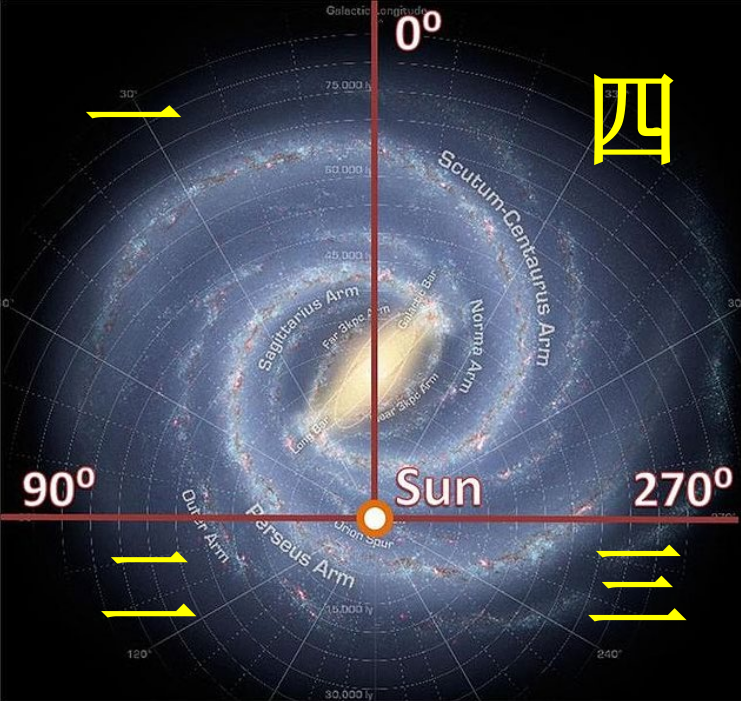
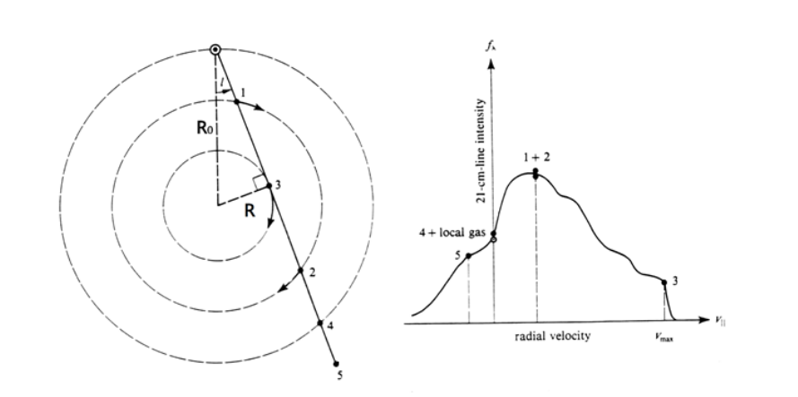

# 星系天文学

- 近代的银河系模型：

    观测：望远镜，可以分辨银河系内的恒星

    理论：构造模型需要天体的准确距离，星光的传播情况

    结论：银河系是“汇聚成群的无数恒星的集合”，呈盘状，太阳位于盘上。但是其中太阳的位置、银河系的大小存在争议。

- 宇宙岛：20 世纪初，通过成功测定河外星系的距离，确认了银河系并非整个宇宙，在银河系最遥远的恒星外，还存在无数个类似银河系的“宇宙岛”。（现代星系天文学的奠基）

    宇宙没有中心，由无数的星系构成，银河系不过是宇宙中一个普通的星系。（现代宇宙学的奠基）

> A galaxy is a massive, gravitationally bound system that consists of stars and stellar remnants, an interstellar medium of gas dust, and an important but poorly understood component tentatively dubbed dark matter.
>
>(From Wikipedia)

## 星际介质与星系际介质

<table>
    <tr>
        <td>星际介质</td>
        <td>ISM</td>
        <td>interstellar medium</td>
    </tr>
    <tr>
        <td>星系团内介质</td>
        <td>ICM</td>
        <td>intracluster medium</td>
    </tr>
    <tr>
        <td>星系际介质</td>
        <td>IGM</td>
        <td>intergalactic medium</td>
    </tr>
    <tr>
        <td>星系周介质</td>
        <td>CGM</td>
        <td>circum galactic medium</td>
    </tr>
    <tr>
        <td>行星际介质</td>
        <td>IPM</td>
        <td>interplanetary medium</td>
    </tr>
</table>

### 星际介质分类

1. 星际介质分类：
    - （组成）气体 (gas) & 尘埃 (dust)

    - （密度）星云 (nebula) & 云际介质 (intercloud medium)

        星云数密度超过 $10\text{个}/cm^{-3}$ 原子

2. 云际介质：

    - 暖 (warm) 云际气体： $10^4\sim 10^5$ K 主要是稀薄的 HI 和 HII
    - 热 (hot) 云际气体 / 云际冕气 (coronal gas) ： $10^6\sim 10^7$ K 主要是 HII

3. 星云分类：
    1. （可见光波段发光性质）

       - 亮星云： 反射星云 (Reflection nebula)，发射星云 (Emission nebula)
       - 暗星云

    ::: info 发射星云分类
    根据激发源（照明星）不同
    - 普通 HII 区（热辐射星云）：新形成高温亮恒星（O,B星），光致电离
    - 行星状星云（热辐射星云）：热晚型星（白矮星），光致电离
    - 超新星遗迹（非热辐射星云）：超新星，碰撞电离
    :::

    2. （星际消光大小 / 尘埃多少）

       - 暗星云 (dark) ：气体分子
       - 半透明星云 (translucent) ：气体分子，原子
       - 弥漫星云 (diffuse) ：
         - 电离弥漫星云 (ionized diffuse clouds) ：电离气体 HII
         - 中性弥漫星云 (neutral diffuse clouds) ：中性原子气体 HI

    3. （成分中 H 的主要状态）

       - 分子云
       - HI 云
       - HII 云

### 星际气体

<table>
  <thead>
    <tr>
      <th rowspan="2">氢的主要状态</th>
      <th rowspan="2">温度（K）</th>
      <th rowspan="2">密度（cm⁻³）</th>
      <th rowspan="2">体积百分比（%）</th>
      <th colspan="2">对应天体（或环境）</th>
    </tr>
    <tr>
      <th>对应第一节</th>
      <th>其他名称</th>
    </tr>
  </thead>

  <tbody>
    <tr>
      <td>H₂</td>
      <td>10-20</td>
      <td>10²-10⁶</td>
      <td>&lt;1</td>
      <td>暗星云</td>
      <td>分子云</td>
    </tr>
    <tr>
      <td>HI</td>
      <td>50-100</td>
      <td>20-50</td>
      <td>1-5</td>
      <td>部分反射 星云</td>
      <td>HI区/云 （中性弥漫星云）</td>
    </tr>
    <tr>
      <td>HI</td>
      <td>6000-10⁴</td>
      <td>0.2-0.5</td>
      <td>10-20</td>
      <td>暖云际气体</td>
      <td>中性云际气体</td>
    </tr>
    <tr>
      <td rowspan="2">HII</td>
      <td rowspan="2">~8000</td>
      <td>0.2-0.5</td>
      <td>20-50</td>
      <td>暖云际气体</td>
      <td>电离云际气体</td>
    </tr>
    <tr>
      <td>10²-10⁴</td>
      <td>&lt;1</td>
      <td>发射星云</td>
      <td>HII区/云 （电离弥漫星云）</td>
    </tr>
    <tr>
      <td>HII</td>
      <td>10⁶-10⁷</td>
      <td>0.0065</td>
      <td>30-70%</td>
      <td>热云际气体</td>
      <td>云际冕气</td>
    </tr>
  </tbody>
</table>

#### H₂

1. 星际分子的形成：
    - 辐射缔合 (Radiative Association)

        原子碰撞结合形成分子，释放光子（辐射）

        由于 $H_2$ 的对称性，系统电偶极矩为零，无法通过电偶极辐射释放能量，通过辐射缔合的概率极低

    - 尘埃表面的催化作用 (Grain Surface Chemistry)

::: info 早期宇宙第一代 H₂ 的形成
- 低密度环境：
  $$
  H+e^-\rightarrow H^-+h\nu
  $$
  $$
  H^-+H\rightarrow H_2+e
  $$

- 高密度环境：
  $$
  H+H+H\rightarrow H_2+H
  $$

reference: [Formation of the first stars](https://arxiv.org/abs/1807.06248)
:::

2. 破坏：
    - 光致离解：吸收光子跃迁到分子的非束缚能级
    - 离解复合：e.g. 大气电离层
        $$
        O^++H_2\rightarrow OH^++H,\ OH^++e^-\rightarrow O+H
        $$

::: info 分子光谱
1. 电子 (electronic) 能级：价电子的能量量子化，紫外和可见光
2. 振动 (vibrational) 能级：原子在化学键键长附近振动能量量子化，近红外光谱
3. 转动 (rotational) 能级：分子整体转动角动量量子化，远红外和微波
:::

3. 观测：

    星际分子谱线多为纯转动谱线，因为温度太低。

    $^{12}CO$ 的最强辐射源来自转动能级的 $J=1\rightarrow 0$ 跃迁，波长 $2.6mm$ （ CO 与 H₂ 的碰撞可以激发）

    H₂ 通常无法直接观测：对称、转动惯量小，最低转动态向基态跃迁波长 $28\mu m$，对应温度 $\sim 510K$

    示踪分子：分子云中的 $H_2$ 与 $CO,HCN,NH_3,H_2O$ 分子成协。如 $CO$ 分子辐射强度与 $H_2$ 的柱密度存在经验关系。$^{12}CO$ 丰度只有 H₂ 的 $10^{-4}\sim 10^{-5}$，却是第二丰富的成分，是研究星际分子的关键探针。

4. 分子云：

    主要特征：低温（利于分子存在），紫外和光学波段光学厚（尘埃）

    - 巨分子云 (Giant Molecular Clouds, GMC)：

        质量 $>10^4M_\odot$
        
        内部不均匀，狭长纤维状结构 (filamentary structures)

    - 博克球状体 (Bok Globules)：

      高密度暗星云，通常处于 HII 区

      >similar to insect's cocoons

      引力坍缩阶段原恒星，星际物质与恒星的过渡阶段（观测验证：红外波段观测到恒星形成的不同阶段）

::: info $H_2$ 的典型存在环境
1. 分子云 (dense molecular gas) $T\sim 10-20K,n>100cm^{-3}$
2. 拱星包层 (Stellar outflows) $T\sim 50-10^3K,n=1-10^6cm^{-3}$
3. 半透明星云 (diffuse molecular gas) $T\sim 50K,n\sim 100cm^{-3}$
:::

#### HII

1. 形成：

    - 光致电离（HII区，行星状星云）
    - 碰撞电离（超新星遗迹，云际冕气）

2. 观测：

    - 光学观测：发射线谱，允许线和禁戒线，颜色偏红 ($H\alpha\ 656.3nm$)
    - 射电观测：H，N和C等的离子复合为高激发态原子（里徳伯原子）退激发谱线

      （重要性：不受尘埃消光影响、谱线测速度距离）
      
      射电连续谱：热轫致辐射
  
3. 大小： Strömgren 半径

    斯特隆根球 (Strömgren sphere) ：O，B星周围气体云质量够大，消耗中心恒星紫外光子，形成HI区内球状HII区
    $$
    R_S=\left(\frac{3}{4\pi}\frac{S_*}{n^2\beta_2}\right)^{1/3}
    $$
    UV flux: $S_*$

    Hydrogen recombination coefficient: $\beta(T_e)\approx 2\times10^{-16}T_e^{-3/4} [m^3 s^{-1}]$

4. 云际冕气：

    红移 $z\sim 0$, 高温，稀薄

    形成：星系喷泉 (Galactic Fountain)， IGM 流入

#### HI

1. 存在环境：

    - 冷中性气体 Cool HI, HI cloud, diffuse atomic cloud
    - 暖中性气体 Warm HI, 中性云际气体
  
2. 观测：

    - HI 的 21cm 谱线： 电子与质子自旋平行与反平行跃迁，受尘埃消光影响小
    - 星际吸收线：星际冷中性气体云，窄而固定的吸收线

    星际 HI 两相可以相互靠近，观测无亮背景 HI 云出现窄线宽分量（cold HI）和宽肩分量（warm HI）
  
#### 星际气体之间与恒星的关系

- 重子循环：气体（星系际介质->星系->恒星->恒星风，超新星爆发->星系际空间）
- 星际元素贫化 interstellar elemental depletions （分子云内气体重元素丰度偏低）

### 星际尘埃

1. 可能来源：

    - 主要：恒星晚期，冷外层大气抛射
    - 次要：超新星，新星等爆发
    - 冷星际介质凝聚，行星、彗星瓦解

2. 破坏：

    热蒸发，碰撞，被天体吸附

3. 化学成分：

    1. 硅酸盐（Mg,Fe）无定型
    2. 含碳的物质颗粒（PAHs、石墨）

#### 尘埃与星云关系

- 暗星云：尘埃消光
- 分子云：尘埃利于分子形成；有效吸收和屏蔽光学和紫外辐射，保护分子
- 反射星云：尘埃散射星光
- 发射星云：尘埃红外辐射

#### 星际尘埃与电磁辐射关系

1. 尘埃辐射：红外辐射

    ::: info 尘埃的红外辐射
    分两类：
    - $\lambda\ge 60\mu m$ 约占 65%：大尺度（大于 $25$nm）尘埃，远红外黑体辐射；
    - $\lambda< 60\mu m$ 约占 35%：小尺度尘埃与单个光子碰撞加热（PAHs, polycyclic aromatic hydrocarbons）多环芳香烃，近、中红外的随机热辐射。
    :::

    实际观测星际尘埃的辐射谱：

      - 远红外连续谱：大尺度尘埃热平衡辐射，黑体谱

      - 中红外连续谱：小尺度尘埃非热平衡辐射，宽连续谱，叠加显著红外 PAHs 振动谱带

2. 尘埃吸收+散射：

    - 星际消光 interstellar extinction ：星光强度减弱

    - 星际红化 interstellar reddening ：对蓝色吸收散射比红色强，星光颜色偏红

    ::: info 尘埃消光
    - 星际消光 $A_\lambda$： $M_\lambda=m_{\lambda \text{ Int}}+5-5\lg d=m_{\lambda \text{ obs}}+5-5\lg d-A_\lambda$
    - 色余 $E(B-V)=(B-V)_{\text{obs}}-(B-V)_{\text{Int}}=(m_b-m_v)_{\text{obs}}-(M_B-M_V)=A_B-A_V$
    - 消光比率 $R$： $R_V=A_V/E(B-V)=A_V/(A_B-A_V)$
    - 消光曲线 $A(\lambda)/A_V\sim \lambda$
    :::

    - 消光曲线可以给出：尘埃颗粒的大小

        记尘埃颗粒大小为 $r$ ，入射光波长为 $\lambda$
        - $r\gg\lambda$ ，消光几乎为常数，简单挡住光（几何光学）
        - $r\ll\lambda$ ，消光几率 $\sigma\propto 1/\lambda$
        - $r\sim\lambda$ ，消光最强

    - 一些星际低密度区或稀疏星际介质中，小尘埃比例高，紫外消光强，消光曲线陡峭， $R_V$ 小

        星际高密度区或分子云，大尘埃占主导，紫外消光平缓， $R_V$ 大

3. 尘埃的偏振：

    - 星际极化/星光偏振 interstellar polarization -> 磁场

::: tip 小结：星际介质的多波段观测
- 射电波段：

    - 谱线：HI 21cm, CO 2.6mm, HII 射电复合线
    - 连续谱： HII 区热轫致谱，Supernova Remnant (SNR)、冕气中电子的同步辐射

- 红外波段：

    - 谱线：（尘埃）PAHs 发射谱带，硅酸盐吸收谱带，（HII区）氢红外复合线
    - 连续谱：（尘埃）热辐射连续谱
    
- 光学到近紫外波段：

    - 谱线：（发射星云）氢光学和紫外复合线、禁线等发射线，（HI云）星际吸收线
    - 连续谱：尘埃消光、红化以及偏振影响

- 极紫外到软 X 射线波段：

    - 谱线：冕气的 OVII, OVIII 等发射线与吸收线
    - 连续谱：冕气的热轫致辐射

- 硬 X 射线到 $\gamma$ 射电波段：

    宇宙线与星际介质相互作用形成的连续谱。
:::

### 星系际介质

#### 重子物质

- 重子物质/可视物质

#### ICM（星系团内介质）

1. 观测：

    - 直接观测：X射线热轫致辐射连续谱、X射线特征谱线（高次电离离子）
    - 间接观测：

        1. Sunyaev-Zel'dovich 效应：逆康普顿散射，CMB 黑体谱康普顿化，只与视线方向电子数密度和温度有关
        2. 快速射电暴等暂现源的色散与时间延迟现象

2. 来源：

    - 形成星系团的原初物质残留
    - 星系团内星系的抛射物、相互作用
    - 从星系团外流入的物质

#### IGM（星系际介质）

1. 来源：

    - 宇宙早期演化（原初核合成、复合）的产物
    - 星系或星系团演化时的抛射物质
    - 星系或星系团相互作用的产物

2. 成分：

    - 星系际尘埃：密度极低
    - 星系际气体：以氢为主

3. HI 等冷气体观测：

    - 类星体等天体光谱的吸收线（ Ly$\alpha$ forest ）
    - Gunn-Perterson 效应：
        
        当星系际的 HI 密度足够高，强烈吸收紫外光子，对 Ly$\alpha$ 发射线的短波端连续谱压低，形成 G-P吸收槽

4. 暖热星系际介质 (warm-hot intergalactic medium, WHIM) HII

    宇宙网 cosmic web ，节点 nodes ，细丝 filaments ，墙 walls ，空洞 voids

#### CGM（星系周介质）

- CGM：星系光学结构与IGM之间

    冕状结构 Galactic Corona

    外流 outflow ，内流 inflow

## 恒星、星团与星族

### 恒星的基本性质

1. 内禀性质 vs 非内禀性质

2. 测光与分光性质
3. 质量
4. 金属性

    金属丰度
    $$
    [Fe/H]_X=\log_{10}[\frac{(N_{Fe}/N_H)_X}{(N_{Fe}/N_H)_\odot}]
    $$

    星系金属增丰循环：恒星形成->核合成->恒星死亡将金属释放回星际介质->下一代恒星从更富金属的气体中诞生...

### 星团

| 性质 | 球状星团 | 疏散星团 |
| :--- | :--- | :--- |
| **1. 形态** | **高度球对称**，致密圆形，无明显边界感 | **不规则松散形**，形状受银河潮汐力拉扯，常有星流状拖尾 |
| **2. 恒星密度** | **核心极高**（约 100-1000 $M_\odot$/pc³） 中心常有**核心坍缩**现象 | **极低**（约 0.1-1 $M_\odot$/pc³） 成员星之间引力束缚较弱 |
| **3. 星际介质** | **近乎为零**。 早期气体早已被超新星爆发吹净或因高速穿越银晕被剥离。 | **含有少量气体尘埃**。 部分年轻星团（如昴星团）仍可见**反射星云**残余。 |
| **4. 寿命** | **与宇宙同龄**（100~130 亿年）。 动力学松弛，**蒸发时标极长**。 | **相对短暂**（数千万至数亿年）。 易被银河潮汐力瓦解或内部动力学弹射成员。 |
| **5. 分布区域** | **银晕与核球**。 轨道随机倾斜，呈球状分布，不跟随银盘旋转。 | **银盘与旋臂**。 轨道近圆，紧密跟随银河系**较差自转**。 |
| **6. 颜色** | **偏黄-红**。 主序转折点在K/G型星，**缺乏大质量蓝星**（早已死亡）。 | **偏蓝-白**。 年轻星团富含O/B型**高温亮星**，积分光谱呈蓝色。 |
| **7. 金属性** | **贫金属**（$Z \sim 0.001-0.01 Z_\odot$）。 属于**星族II**，形成于宇宙早期重元素匮乏时期。 | **富金属**（$Z \sim 0.5-1.5 Z_\odot$）。 属于**星族I**，由前代恒星增丰后的气体形成。 |
| **8. 整体运动** | **速度弥散大**（$\sigma \sim 10-20$ km/s）。 个体星间相对运动快，但整体绕银心做**长椭圆轨道**。 | **速度弥散小**（$\sigma \sim 1-3$ km/s）。 成员星以**几乎相同的空间速度**（本动速度）共移。 |

- 近红外波段 观测恒星消光小

    中远红外多为尘埃
- 蓝离散星 (Blue Stragglers) HR 图主序拐点之上的蓝色亮星
- 场星 (Field stars) 
    1. 不属于任何已知星团或星协等恒星聚集体的恒星
    2. 观测某一星团时，沿视线方向前景和背景中不属于该星团的恒星

- 区分星团成员和场星：年龄、金属性、运动特征
- 星系的恒星形成率 star formation rate (SFR)
- 星暴 starburst
- “特殊”星团：
    - 星协 stellar association: 高光度年轻恒星组成，通常引力不束缚
    - 移动星团 moving cluster: 疏散星团的“晚年”
    - 超星团 super star cluster (SSC)/ 年轻大质量星团 young massive cluster (YMC): 球状星团的前身

### 星族

stellar populations

- 星族：由年龄、金属丰度、分布地域和运动学特性都相似的恒星族群

- 星族 I：迅速绕银河系公转，银道面附近，亮O，B型星

    星族 II：绕银河系公转较慢，银道面两边，光度较低的红色和橙色巨星

    二者根本差别是年龄

    | 性质 | 星族 I | 星族 II |
    |:---:|:---:|:---:|
    | 年龄 | 年轻 | 年老 |
    | 金属丰度 | 高 | 低？ |
    | 运动 | 轨道规则，小倾角，大速度，小速度弥散，UVW速度小 | 轨道不规则，大倾角，小速度，大速度弥散，UVW速度大 |
    | 分布区域 | 盘 | 核球、晕、椭圆星系 |

- 金属元素谱线的强弱 $\neq$ 恒星金属丰度

- 星族的运动学 (kinematics) 特性：

    - 速度弥散度 velocity dispersion
        $$
        \sigma=\sqrt{\sum_i^N(v_i-\langle v\rangle)^2/N}
        $$
        星族 I 转动速度大，速度弥散小

        星族 II 转动速度小，速度弥散大
    
    - UVW 速度分量：

        U：银心指向恒星方向

        V：恒星沿着盘转动方向

        W：垂直银道面方向

        - 参考点：局部静止标准 Local standrad of rest (LSR)

            $$
            R_0=8.5 \text{kpc},V_0=220\text{km/s}
            $$

    - 能量：表征束缚程度

        角动量：表征轨道旋转特征

- 其他星族分类：

    1. 星族 III：第一代恒星，金属丰度很低

    2. 现代四分法：核球星族、厚盘星族、薄盘星族、晕星族（内晕、外晕）

    3. 子系（按照运动特征）：

        - 扁平子系：银面聚度大，速度弥散小
        - 球状子系：银面聚度小，银心聚度大，速度弥散很大
        - 中介子系

- 形成理论：

    1. ELS模型（快速坍缩模型）

        原星系气体云自引力坍缩（金斯不稳定性）

        银晕形成（星族 III）

        银盘形成（星族 I）
    
    ::: info $\alpha$ 元素
    - $\alpha$ 元素是原子核质量数为 $4$ 的倍数的元素（如 O,Ne,Mg 等），通过捕获 $\alpha$ 粒子形成
    - 星族 II 恒星的 [$\alpha$/Fe] 值较高
    - 星族 I 恒星高金属丰度，低 [$\alpha$/Fe] 值
    :::

    2. SZ模型（并合模型）

        晕的复杂形成历史，逐步合并

- 特殊子结构：

    星流 stellar stream

- 补充内容：

    - 质光关系 mass-luminosity relation
        $$
        \frac{L}{L_\odot}=\left(\frac{M}{M_\odot}\right)^\alpha
        $$
    - 质光比 mass-to-light ratio
        $$
        \Upsilon=\frac{M/L}{M_\odot/L_\odot}
        $$
        其倒数表示单位质量的物质平均发光效率。
    - 光度函数 Luminosity Function
        $$
        \Phi(L)\Delta L=\frac{\Delta N}{\Delta V}
        $$
        按光度参数空间数密度分布，通常也用绝对星等表示 $\Phi(M)$
    - 初始质量函数 Initial mass function (IMF)
        $$
        \xi(m)
        $$
        $\xi(m)\Delta m$ 代表恒星形成时，单位体积内，在 $m$ 和 $m+\Delta m$ 质量范围内（以太阳质量为单位）的恒星数。

### 专题：宇宙距离阶梯

1. 距离的定义：

    - 固有距离 proper distance / 物理距离 physical distance

    - 光度距离 luminosity distance
        $$
        d_L=\sqrt{\frac{L}{4\pi f}}
        $$
        距离模数 $\mu=m-M=-5+5\lg d_L+A(r)$ 其中 $A(r)$ 为消光

        主星序重叠法/主星序拟合法 Main Sequence Fitting

    - 角直径距离 angular-diameter distance
        $$
        d_A\propto\frac{\Delta}{\theta}
        $$
    
    - 自行距离 proper-motion distance
        $$
        d_P(pc)=\frac{1}{4.74}\frac{V_T\ (km/s)}{\mu\ (^"/year)}
        $$

        移动星团方法 the moving cluster method / 星群视差 group parallaxes
    
2. 宇宙距离阶梯：

    - 标准烛光 standard candle

        Ia 型超新星、造父变星

        光度距离
    
    - 标准直尺 standard ruler

        已知线大小的天体（面源）

        角直径距离
    
    - 标准汽笛 standard siren

        引力波信号
    
## 银河系的基本结构

- 结构：

    核球 bulge

    银盘 disk ~30kpc

    银晕 halo

- 银道坐标系：

    原点：太阳

    银经 $l:0^\circ-360^\circ$ ：从银心方向开始，沿银道面按（从北极看）逆时针方向计算

    银纬 $b:-90^\circ-90^\circ$

    四个像限
    
    

    反银心方向 anti-centre

### 银盘

#### 基本性质

1. 银盘是由恒星和星际介质组成的扁平盘

2. 太阳在银盘的位置很靠近银道面，在其以北 $25\pm 5pc$ ；靠近猎户臂（人马臂和英仙臂间的次结构）内侧边缘，距离银心 $\sim 8.2\pm0.1kpc$ ，绕银心转动速度 $238\pm 15 km/s$

3. 银盘包括恒星盘和弥散的星际气体盘

    1. 恒星盘

        薄盘 thin disk + 厚盘 thick disk

        数密度 $n(z)=n_0\exp(-z/h_0)$
    
    2. 星际气体盘

        - 观测： 盘星 （近红外）

            HI （射电 2.6mm）

            HII （射电 21cm）

    3. 银盘的翘曲 warp

4. 银盘中存在由恒星和星际介质组成的、呈对数螺旋曲线形态的悬臂结构

#### 旋臂结构

1. 旋臂示踪天体： O，B 星，HII 区，分子云

2. 旋臂通常不是固定的同一批物质臂组成

3. 密度波理论：星系盘区，有一个刚体旋转的引力势区域，旋转速度与恒星或气体的轨道速度不同

### 银晕

银晕包含 恒星晕 stellar halo ，暗物质晕 dark matter halo ，气体晕 gas halo

#### 恒星晕

1. 主要是星族 II 型恒星组成的球状星团

2. 晕星数密度与半径的关系： $n(r)\propto r^{-2.8}$

#### 暗物质晕

1. 星系旋转曲线 / 自转曲线 rotation curve:

    测定：

    1. 太阳的银心距离 $R_0$ 和太阳绕银心的转动速度 $V_0$

        $R_0=8.122\pm 0.031$ kpc

        $V_0=234.7\pm 1.7$ km/s
    
    2. 对太阳轨道内的天体，通过 HI 21cm 或 CO 2.6mm 射电谱线的轮廓，利用终端速度 terminal velocity / 切点法 tangent-point method 可以直接同时、独立得到 HI 区或分子云的距离和速度

        1. 银心距 $R=R_0\sin l$
        2. 转动速度 $V=V_r+V_0\sin l$

        
    
    3. 对太阳轨道外的天体，利用其与 HII 区，星族 I 造父变星等成协测定光度距离，然后利用银河系动力学模型导出 $V(R)$

2. Disk like rotation & Keplerian rotation

3. 暗物质晕（暗晕）：

    特征参数（总质量、边界）都不确定

    数值结果，分布：

        在星系和星系团尺度：呈近球形晕 dark matter halo

        在更大尺度：呈纤维状结构 cosmic web

