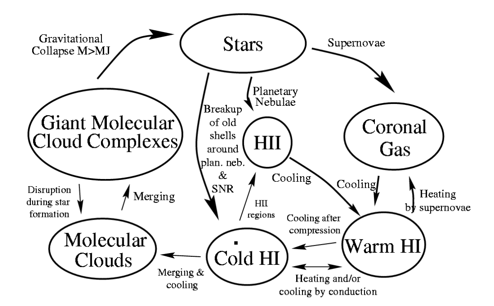

# 星系天文学

> A galaxy is a massive, gravitationally bound system that consists of stars and stellar remnants, an interstellar medium of gas dust, and an important but poorly understood component tentatively dubbed dark matter.
>
>(From Wikipedia)

## 星际介质与星系际介质

<table>
    <tr>
        <td>星际介质</td>
        <td>ISM</td>
        <td>interstellar medium</td>
    </tr>
    <tr>
        <td>星系团内介质</td>
        <td>ICM</td>
        <td>intracluster medium</td>
    </tr>
    <tr>
        <td>星系际介质</td>
        <td>IGM</td>
        <td>intergalactic medium</td>
    </tr>
    <tr>
        <td>星系周介质</td>
        <td>CGM</td>
        <td>circum galactic medium</td>
    </tr>
    <tr>
        <td>行星际介质</td>
        <td>IPM</td>
        <td>interplanetary medium</td>
    </tr>
</table>

### 星际介质分类

1. 星际介质分类：
    - 气体 (gas) & 尘埃 (dust)

    - 星云 (nebula) & 云际介质 (intercloud medium)

2. 云际介质：

    - 暖 (warm) 云际气体： $10^4\sim 10^5$ K
    - 热 (hot) 云际气体 / 云际冕气 (coronal gas) ： $10^6\sim 10^7$ K

3. 星云分类：
    1. （可见光波段发光性质）

       - 亮星云： 反射星云 (Reflection nebula)，发射星云 (Emission nebula)
       - 暗星云

    ::: info 发射星云分类
    - 普通 HII 区：新形成高温亮恒星（O,B星），光致电离
    - 行星状星云：热晚型星（白矮星），光致电离
    - 超新星遗迹：超新星，碰撞电离
    :::

    2. （星际消光大小）

       - 暗星云 (dark) ：气体分子
       - 半透明星云 (translucent) ：气体分子，原子
       - 弥漫星云 (diffuse) ：
         - 电离弥漫星云 (ionized diffuse clouds) ：电离气体 HII
         - 中性弥漫星云 (neutral diffuse clouds) ：中性原子气体 HI

    3. （成分中 H 的主要状态）

       - 分子云
       - HI 云
       - HII 云

### 星际气体

<table>
  <thead>
    <tr>
      <th rowspan="2">氢的主要状态</th>
      <th rowspan="2">温度（K）</th>
      <th rowspan="2">密度（cm⁻³）</th>
      <th rowspan="2">体积百分比（%）</th>
      <th colspan="2">对应天体（或环境）</th>
    </tr>
    <tr>
      <th>对应第一节</th>
      <th>其他名称</th>
    </tr>
  </thead>

  <tbody>
    <tr>
      <td>H₂</td>
      <td>10-20</td>
      <td>10²-10⁶</td>
      <td>&lt;1</td>
      <td>暗星云</td>
      <td>分子云</td>
    </tr>
    <tr>
      <td>HI</td>
      <td>50-100</td>
      <td>20-50</td>
      <td>1-5</td>
      <td>部分反射 星云</td>
      <td>HI区/云 （中性弥漫星云）</td>
    </tr>
    <tr>
      <td>HI</td>
      <td>6000-10⁴</td>
      <td>0.2-0.5</td>
      <td>10-20</td>
      <td>暖云际气体</td>
      <td>中性云际气体</td>
    </tr>
    <tr>
      <td rowspan="2">HII</td>
      <td rowspan="2">~8000</td>
      <td>0.2-0.5</td>
      <td>20-50</td>
      <td>暖云际气体</td>
      <td>电离云际气体</td>
    </tr>
    <tr>
      <td>10²-10⁴</td>
      <td>&lt;1</td>
      <td>发射星云</td>
      <td>HII区/云 （电离弥漫星云）</td>
    </tr>
    <tr>
      <td>HII</td>
      <td>10⁶-10⁷</td>
      <td>0.0065</td>
      <td>30-70%</td>
      <td>热云际气体</td>
      <td>云际冕气</td>
    </tr>
  </tbody>
</table>

#### H₂

1. 星际分子的形成：
    - 辐射缔合 (Radiative Association)
    - 尘埃表面的催化作用 (Grain Surface Chemistry)

::: info 早期宇宙第一代 H₂ 的形成
- 低密度环境：
  $$
  H+e^-\rightarrow H^-+h\nu
  $$
  $$
  H^-+H\rightarrow H_2+e
  $$

- 高密度环境：
  $$
  H+H+H\rightarrow H_2+H
  $$

reference: [Formation of the first stars](https://arxiv.org/abs/1807.06248)
:::

2. 破坏：
    - 光致离解
    - 离解复合：e.g. 大气电离层
        $$
        O^++H_2\rightarrow OH^++H,\ OH^++e^-\rightarrow O+H
        $$

::: info 分子光谱
1. 电子 (electronic) 能级：价电子的能量量子化
2. 振动 (vibrational) 能级：原子在化学键键长附近振动能量量子化
3. 转动 (rotational) 能级：分子整体转动角动量量子化
:::

3. 观测：

    星际分子谱线多为纯转动谱线，因为温度太低。

    $^{12}CO$ 的最强辐射源来自转动能级的 $J=1\rightarrow 0$ 跃迁，波长 $2.6mm$

    H₂通常无法直接观测：对称、转动惯量小，最低转动态向基态跃迁波长 $28\mu m$，对应温度 $\sim 510K$

    示踪分子：分子云中的 $H_2$ 与 $CO,HCN,NH_3,H_2O$ 分子成协。如 $CO$ 分子辐射强度与 $H_2$ 的柱密度存在经验关系。

4. 分子云：

    主要特征：低温（利于分子存在），紫外和光学波段光学厚（尘埃）

    - 巨分子云：狭长纤维状结构 (filamentary structures)

    - 博克球状体 (Bok Globules)：

      高密度暗星云，通常处于 HII 区

      >similar to insect's cocoons

      引力坍缩阶段原恒星，星际物质与恒星的过渡阶段（观测验证：红外波段观测到恒星形成的不同阶段）

::: info $H_2$ 的典型存在环境
1. 分子云 (dense molecular gas) $T\sim 10-20K,n>100cm^{-3}$
2. 拱星包层 (Stellar outflows) $T\sim 50-10^3K,n=1-10^6cm^{-3}$
3. 半透明星云 (diffuse molecular gas) $T\sim 50K,n\sim 100cm^{-3}$
:::

#### HII

1. 形成：

    - 光致电离（HII区，行星状星云）
    - 碰撞电离（超新星遗迹，云际冕气）

2. 观测：

    - 光学观测：发射线谱，允许线和禁戒线，颜色偏红 ($H\alpha\ 656.3nm$)
    - 射电观测：H，N和C等的离子复合为高激发态原子（里徳伯原子）退激发谱线
      
      射电连续谱：热轫致辐射
  
3. 大小： Strömgren 半径

    斯特隆根球 (Strömgren sphere) ：O，B星周围气体云质量够大，消耗中心恒星紫外光子，形成HI区内球状HII区

4. 云际冕气：

    形成：星系喷泉 (Galactic Fountain)

#### HI

1. 存在环境：

    - 冷中性气体 Cool HI, HI cloud, diffuse atomic cloud
    - 暖中性气体 Warm HI, 中性云际气体
  
2. 观测：

    - HI 的 21cm 谱线： 电子与质子自旋平行与反平行跃迁，受尘埃影响小
    - 星际吸收线：窄而固定的吸收线

    星际 HI 两相可以相互靠近，观测无亮背景 HI 云出现窄线宽分量（cold HI）和宽肩分量（warm HI）
  
#### 星际气体之间与恒星的关系

- 重子循环：气体（星系际介质->星系->恒星->恒星风，超新星爆发->星系际空间）
- 星际元素贫化 interstellar elemental depletions

### 星际尘埃

1. 可能来源：

    - 主要：恒星晚期，冷外层大气抛射
    - 次要：超新星，新星等爆发
    - 冷星际介质凝聚，行星、彗星瓦解

2. 破坏：

    热蒸发，碰撞，被天体吸附

3. 化学成分：

    1. 硅酸盐（Mg,Fe）无定型
    2. 含碳的物质颗粒（PAHs、石墨）

#### 尘埃与星云关系

- 暗星云：尘埃消光
- 分子云：尘埃利于分子形成，保护分子
- 反射星云：尘埃散射星光
- 发射星云：尘埃红外辐射

#### 星际尘埃与电磁辐射关系

1. 尘埃辐射：红外辐射

    ::: info 尘埃的红外辐射
    分两类：
    - $\lambda\ge 60\mu m$ 约占 65%：大尺度尘埃，远红外黑体辐射；
    - $\lambda< 60\mu m$ 约占 35%：小尺度（PAHs, polycyclic aromatic hydrocarbons）多环芳香烃，近、中红外的随机热辐射。
    :::

    实际观测星际尘埃的辐射谱：

      - 远红外连续谱：大尺度尘埃热平衡辐射，黑体谱

      - 中红外连续谱：小尺度尘埃非平衡辐射，宽连续谱，叠加显著红外 PAHs 振动谱带

2. 尘埃吸收和散射：

    - 星际消光 interstellar extinction ：星光强度减弱

    - 星际红化 interstellar reddening ：对蓝色吸收散射比红色强，星光颜色偏红

    ::: info 尘埃消光
    - 星际消光 $A_\lambda$： $M_\lambda=m_{\lambda \text{ Int}}+5-5\lg d=m_{\lambda \text{ obs}}+5-5\lg d-A_\lambda$
    - 色余 $E(B-V)=(B-V)_{\text{obs}}-(B-V)_{\text{Int}}=(m_b-m_v)_{\text{obs}}-(M_B-M_V)=A_B-A_V$
    - 消光比率 $R$： $R_V=A_V/E(B-V)=A_V/(A_B-A_V)$
    - 消光曲线 $A(\lambda)/A_V\sim \lambda$
    :::

3. 尘埃的偏振：

    - 星际极化/星光偏振 interstellar polarization -> 磁场

::: info 小结：星际介质的多波段观测
- 射电波段：

    - 谱线：HI 21cm, CO 2.6mm, HII 射电复合线
    - 连续谱： HII 区热轫致谱，Supernova Remnant (SNR)、冕气中电子的同步辐射

- 红外波段：

    PAHs 发射谱带，硅酸盐吸收谱带，尘埃热辐射连续谱
- 光学到近紫外波段：

    HI 星际吸收线，发射星云发射线（H的复合线，e.g. $H\alpha,H\beta$ 巴耳末线系），尘埃的星际消光、红化和偏振
- 极紫外到软 X 射线波段：

    热等离子体辐射（冕气）
- $\gamma$ 射电波段：

    高能宇宙线粒子与星际介质和星际辐射场相互作用形成的连续谱背景，如轫致辐射、逆康普顿散射、$\pi$ 介子衰变等
:::
