# 高能天体物理

reference: *High Energy Astrophysics* (3ed) by Longair M.S.

## 高能辐射机制

### 相关物理量

- 普朗克常数 $h=6.625\times10^{-27} \text{erg s}$

    波尔兹曼常数 $k=1.3\times10^{-16} \text{erg/K}$

- 流量 Flux
    $$
    F=\frac{\mathrm{d}E}{\mathrm{d}A\,\mathrm{d}t}
    $$

- 单色能流量 monochromatic energy flux
    $$
    F_\nu=\frac{\mathrm{d}E}{\mathrm{d}A\,\mathrm{d}t\,\mathrm{d}\nu}
    $$

- 能流 Fluence
    $$
    \mathcal{F}=\frac{\mathrm{d}E}{\mathrm{d}A}
    $$

- 方向亮度 specific intensity
    $$
    I_\nu=\frac{\mathrm{d}E}{(\,\cos\theta\,\mathrm{d}A\,)\,\mathrm{d}t\,\mathrm{d}\Omega\,\mathrm{d}\nu}
    $$

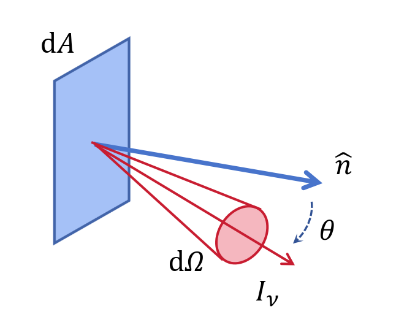

- 净流量 Net flux (in direction $\hat{n}$)
    $$
    F_\nu=\int\mathrm{d}F_\nu=\int I_\nu\cos\theta\,\mathrm{d}\Omega
    $$

- 净动量流量 Net momentum flux (in direction $\hat{n}$)
    $$
    p_\nu=\frac{1}{c}\int I_\nu\cos^2\theta\,\mathrm{d}\Omega
    $$

    ::: info derivation
    光子动量
    $$
    p=\frac{h}{\lambda}=\frac{h\nu}{c}=\frac{E}{c}
    $$
    :::

- 辐射能量密度 radiative energy density
    $$
    u_\nu=\frac{1}{c}\int I_\nu\,\mathrm{d}\Omega=\frac{4\pi}{c}J_\nu
    $$
    平均强度 $J_\nu=\frac{1}{4\pi}\int I_\nu\,\mathrm{d}\Omega$

### 辐射转移

- 自发辐射系数 $\varepsilon_\nu$: $\mathrm{d}I_\nu=\varepsilon_\nu\mathrm{d}x$
- 吸收系数 $\alpha_\nu$: $\mathrm{d}I_\nu=-\alpha_\nu I_\nu \mathrm{d}x$

    - 物质中粒子吸收截面 $\sigma_\nu$ ，粒子数密度 $n$，吸收系数 $\alpha_\nu=n\sigma_\nu$
- 辐射转移方程
    $$
    \frac{\mathrm{d}I_\nu}{\mathrm{d}x}=-\alpha_\nu I_\nu+\varepsilon_\nu
    $$
- 光深 $\tau_\nu$: $\mathrm{d}\tau_\nu=\alpha_\nu\mathrm{d}x$, $\tau_\nu=\int_0^x\alpha_\nu(x')\mathrm{d}x'$

    - $\tau_\nu>1$ 光学厚，对辐射不透明
    - $\tau_\nu<1$ 光学薄，对辐射透明
    - 平均自由程 Mean free path $l_\nu=\frac{1}{n\sigma_\nu}$

- 源函数
    
    $$
    S_\nu\equiv\frac{\varepsilon_\nu}{\alpha_\nu}
    $$
    若源函数为常数，辐射强度会趋于源函数
    $$
    I_\nu(\tau_\nu)=S_\nu+e^{-\tau_\nu}[I_\nu(0)-S_\nu]
    $$
    ::: info derivation
    $$
    \frac{\mathrm{d}I_\nu}{\mathrm{d}x}=-\alpha_\nu I_\nu+\varepsilon_\nu
    $$
    $$
    \Rightarrow \frac{\mathrm{d}I_\nu}{\mathrm{d}\tau_\nu}=-I_\nu+\frac{\varepsilon_\nu}{\alpha_\nu}=S_\nu-I_\nu
    $$
    $$
    \Rightarrow \left(\frac{\mathrm{d}I_\nu}{\mathrm{d}\tau_\nu}+I_\nu\right)e^{\tau_\nu}=e^{\tau_\nu}S_\nu
    $$
    $$
    \Rightarrow I_\nu(\tau_\nu)=I_\nu(0)e^{-\tau_\nu}+e^{-\tau_\nu}\int_0^{\tau_\nu}e^{\tau_\nu'}S(\tau_\nu')\,\mathrm{d}\tau_\nu'
    $$
    $$
    \Rightarrow I_\nu(\tau_\nu)=S_\nu+e^{-\tau_\nu}[I_\nu(0)-S_\nu]
    $$
    :::

### 黑体辐射

热平衡、光学厚、完全吸收（吸收=发射）

详见[光学-热辐射](/blog/physics/optics#热辐射)

- 亮温度 Brightness temperature
    $$
    I_\nu=B_\nu(T_b)
    $$
- 色温度 Color temperature
    $$
    h\nu_{\text{max}}=2.82kT_c
    $$
- 有效温度 Effective temperature
    $$
    F=\sigma T_{\text{eff}}^4
    $$

### 轫致辐射

#### 加速带电粒子电磁辐射

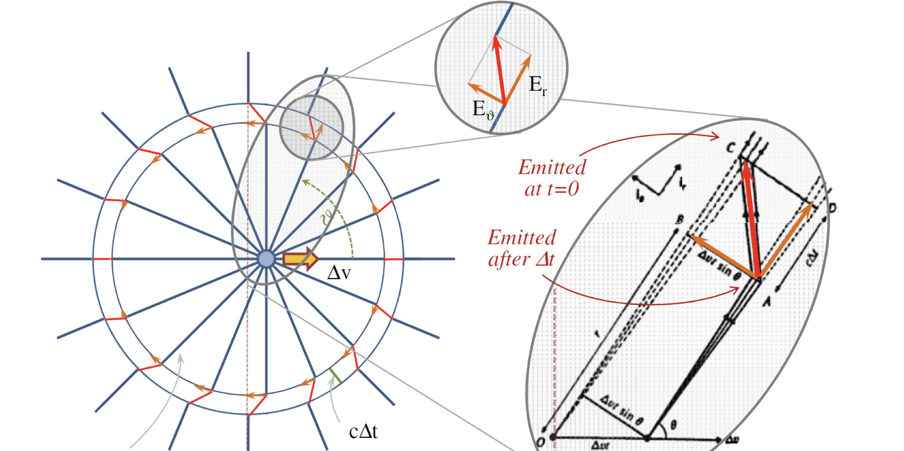

- Energy flux, Poynting vector
    $$
    -\left(\frac{\mathrm{d}E}{\mathrm{d}A\,\mathrm{d}t}\right)=S=\frac{|\ddot{p}|^2\sin^2\theta}{16\pi^2\varepsilon_0 c^3r^2}
    $$

- Energy loss per solid angle
    $$
    -\left(\frac{\mathrm{d}E}{\mathrm{d}t\,\mathrm{d}\Omega}\right)=\frac{|\ddot{p}|^2\sin^2\theta}{16\pi^2\varepsilon_0 c^3}\quad \left(\text{using  } \mathrm{d}\Omega=\frac{\mathrm{d}A}{r^2}\right)
    $$

- 拉莫方程
    $$
    -\left(\frac{\mathrm{d}E}{\mathrm{d}t}\right)=\frac{|\ddot{p}|^2}{6\pi \varepsilon_0 c^3}
    $$

::: info derivation
$E_r$ 不变，由几何关系导出 $E_\theta$
$$
E_\theta=\frac{qa\sin\theta}{4\pi\varepsilon_0 c^2 r}=\frac{|\ddot{p}|\sin\theta}{4\pi\varepsilon_0 c^2 r}
$$
Poynting vector
$$
|\vec{S}|=|\vec{E}\times\vec{H}|=EH=E\frac{B}{\mu_0}=\frac{E^2}{c\mu_0}
$$
当 $r\gg1$ 时，$E\sim E_\theta$
$$
S=\frac{1}{c\mu_0}\frac{|\ddot{p}|^2\sin^2\theta}{16\pi^2 \varepsilon_0^2 c^4 r^2}=\frac{|\ddot{p}|^2\sin^2\theta}{16\pi^2\varepsilon_0c^3r^2}
$$
:::

::: tip 注
只能在电子共动系中使用，注意坐标系转换
:::

::: info Parseval’s theorem
$\dot{\vec{v}}(t)\rightarrow\dot{\vec{v}}(\omega)$
$$
\begin{align}
\int_{-\infty}^\infty -\left(\frac{\mathrm{d}E}{\mathrm{d}t}\right)\mathrm{d}t&=\int_{-\infty}^\infty\frac{e^2}{6\pi\varepsilon_0c^3}|\dot{\vec{v}}(t)|^2\mathrm{d}t \\
&=\int_{-\infty}^\infty \frac{e^2}{6\pi\varepsilon_0 c^3}|\dot{\vec{v}}(\omega)|^2\mathrm{d}\omega
\end{align}
$$
total emitted radiation
$$
\int_0^\infty I(\omega)\mathrm{d}\omega=\int_0^\infty\frac{e^2}{3\pi\varepsilon_0c^3}|\dot{\vec{v}}(\omega)|^2\mathrm{d}\omega
$$
Parseval's theorem
$$
I(\omega)=\frac{e^2}{3\pi\varepsilon_0c^3}|\dot{\vec{v}}(\omega)|^2
$$
:::

#### 单电子轫致辐射

- 轫致辐射 Bremsstrahlung radiation

    刹车辐射 braking radiation

    自由-自由辐射 free-free radiation

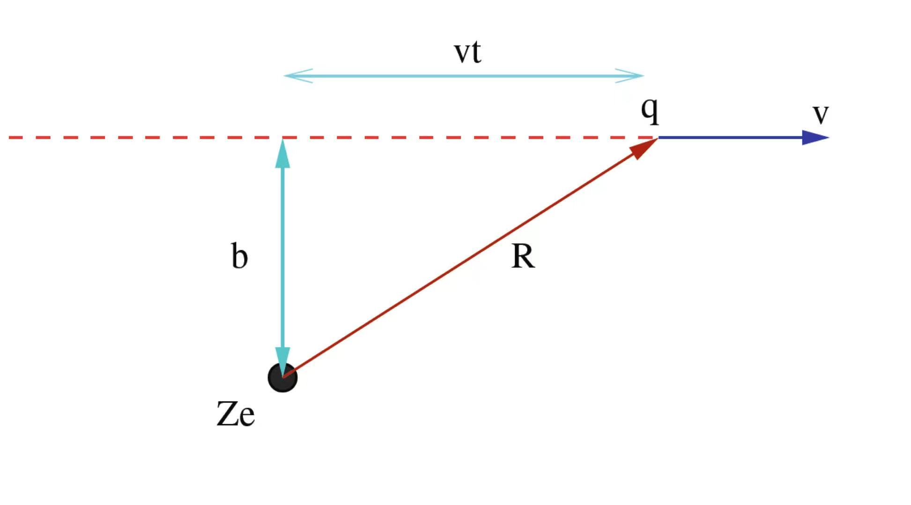

- 辐射能谱
    
    $$
    \begin{align}
    I(\omega)&=\frac{e^2}{3\pi\varepsilon_0 c^3}\left[|a_\parallel(\omega)|^2+|a_\perp(\omega)|^2\right] \\
    &=\frac{Z^2e^6}{24\pi^4\varepsilon_0^3c^3m_e^2v^2}\frac{\omega^2}{\gamma^2v^2}\left[\frac{1}{\gamma^2}K_0^2\left(\frac{\omega b}{\gamma v}\right)+K_1^2\left(\frac{\omega b}{\gamma v}\right)\right] \\
    &=\left\{\begin{array}{ll}
        \dfrac{Z^2e^6}{48\pi^3\varepsilon_0^3c^3m_e^2v^2}\dfrac{\omega}{\gamma vb}\left[\dfrac{1}{\gamma^2}+1\right]\exp\left(-\dfrac{2\omega b}{\gamma v}\right) & \text{if  } \omega\gg\dfrac{\gamma v}{b} \\
        \dfrac{Z^2e^6}{24\pi^4\varepsilon_0^3c^3m_e^2v^2}\dfrac{1}{b^2}\left[1+\dfrac{1}{\gamma^2}\left(\dfrac{\omega b}{\gamma v}\right)^2\ln^2\left(\dfrac{\omega b}{\gamma v}\right)\right] & \text{if  } \omega\ll\dfrac{\gamma v}{b}
    \end{array}\right.
    \end{align}
    $$
    where $K_0$ and $K_1$ are modified Bessel functions of order zero and one.

    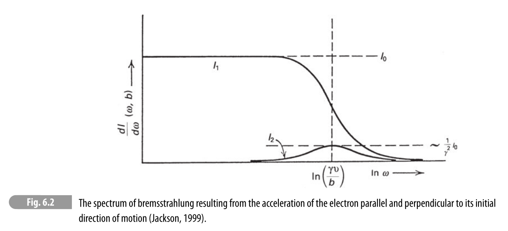

::: info derivation
$a_\parallel=\dot{v}_x,a_\perp=\dot{v}_z$ 傅里叶变换后代入 Parseval's theorem.
:::

#### 热轫致辐射

- 热等离子体：完全电离、热平衡、光学薄、非相对论性

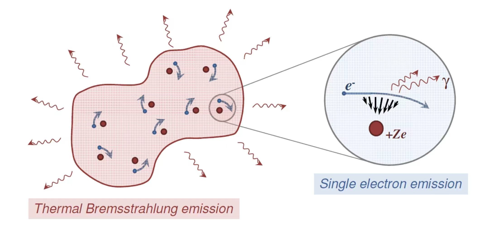

- 将单电子轫致辐射能谱积分
    $$
    \begin{align}
    I&=\int N_e(T,\nu)I_e(\omega)\mathrm{d}\nu\mathrm{d}b \\
    &\propto\frac{Z^2 NN_e}{\sqrt{T}}\exp\left(-\frac{\hbar\omega}{kT}\right)g(\omega,T)
    \end{align}
    $$
    $N_e(T,\nu)$ ：热平衡下电子的 Maxwell 速度分布；

    $I_e(\omega)$ ：单个电子的轫致辐射能谱

    $\mathrm{d}b$ ：对作用距离积分

    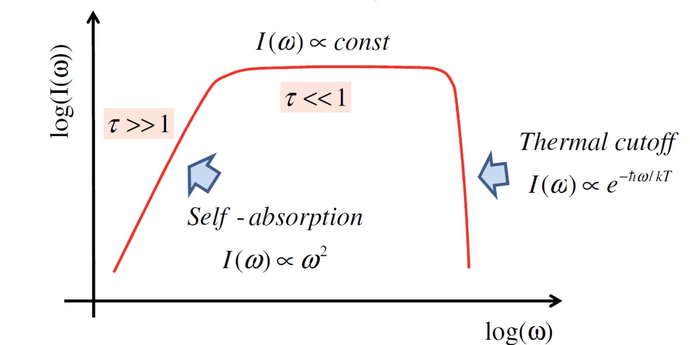

#### 非热轫致辐射

- 等离子体外电子
- 极端相对论电子，幂率分布

### 同步辐射

#### 电子在磁场中运动

- 电子在洛伦兹力下动量变化
    $$
    \frac{\mathrm{d}\vec{p}}{\mathrm{d}t}=\gamma m_e\frac{\mathrm{d}\vec{v}}{\mathrm{d}t}=-e\left(\vec{E}+\vec{v}\times\vec{B}\right)
    $$

- 回旋频率
    $$
    \omega_g=\frac{eB}{\gamma m_e}=2\pi\nu_g
    $$

- 能量损失率
    $$
    -\frac{\mathrm{d}E}{\mathrm{d}t}=2\sigma_T cU_B\beta^2\gamma^2\sin^2\theta
    $$
    Thomson 散射截面 $\sigma_T=\dfrac{q^4}{6\pi\varepsilon_0^2 c^4m_e^2}$

    磁场能量密度 $U_B=\dfrac{B^2}{2\mu_0}$

    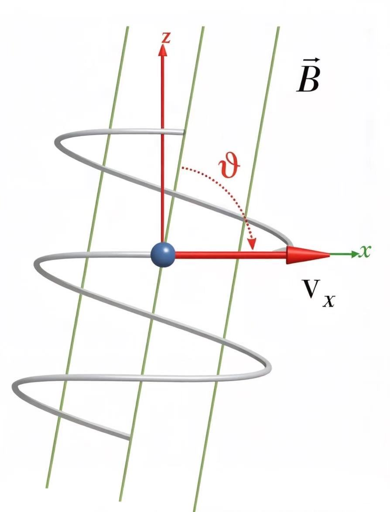

    ::: info derivation
    观测系电磁场，洛伦兹变化到电子系，再用拉莫方程可得。
    :::

- 电子冷却时间
    $$
    \tau=\frac{E}{|\mathrm{d}E/\mathrm{d}t|}\propto\frac{1}{B^2\beta^2\gamma}
    $$

#### 回旋辐射

- 低速条件下 $v\ll c,\gamma=1$

- 相当一个电偶极辐射

- 辐射率
    $$
    -\frac{\mathrm{d}E}{\mathrm{d}t}=\frac{2\sigma_T}{c}U_B v^2\sin^2\theta
    $$

#### 中等相对论电子

- 相对论集束效应
- 相对论多普勒效应
- 周期性脉冲形式

#### 单电子同步辐射

- 集束效应：辐射集中在张角 $1/\gamma$ 锥内

    ::: info derivation
    电子系速度经过洛伦兹变化到观测系，得到观测系张角
    $$
    \tan\theta=\frac{u_y}{u_x}=\frac{u'\sin\theta'}{\gamma(u'\cos\theta'+v)}=\frac{\sin\theta'}{\gamma(\cos\theta'+\beta)}
    $$
    取 $\theta'=\pi/2$ 得到观测系的辐射张角
    $$
    \tan\theta=\frac{1}{\gamma\beta}
    $$
    $$
    \theta\sim\tan\theta=\frac{1}{\gamma}
    $$
    :::

- 多普勒效应：脉冲宽度

    $$
    \Delta t\approx\frac{1}{\gamma^3\omega_g}=\frac{1}{\gamma^2\omega_{cycl}}
    $$

    ::: info derivation
    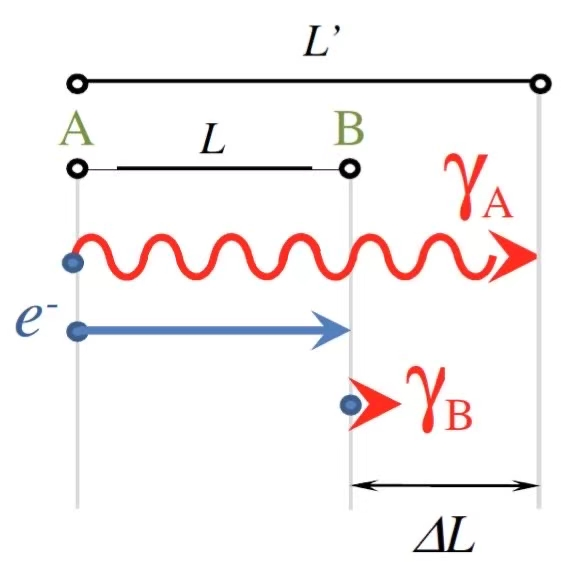
    $$
    \Delta t=\frac{\Delta L}{c}=\frac{L'-L}{c}=\frac{L}{v}-\frac{L}{c}=\frac{L}{v}(1-\beta)
    $$
    $$
    \frac{L}{v}=\frac{\theta}{\omega_g}=\frac{2}{\gamma\omega_g}=\frac{2}{\omega_{cycl}}
    $$
    $$
    1-\beta=\frac{1-\beta^2}{1+\beta}=\frac{1}{\gamma^2}\frac{1}{1+\beta}\approx\frac{1}{2\gamma^2}
    $$
    :::

- 单电子同步辐射能谱

    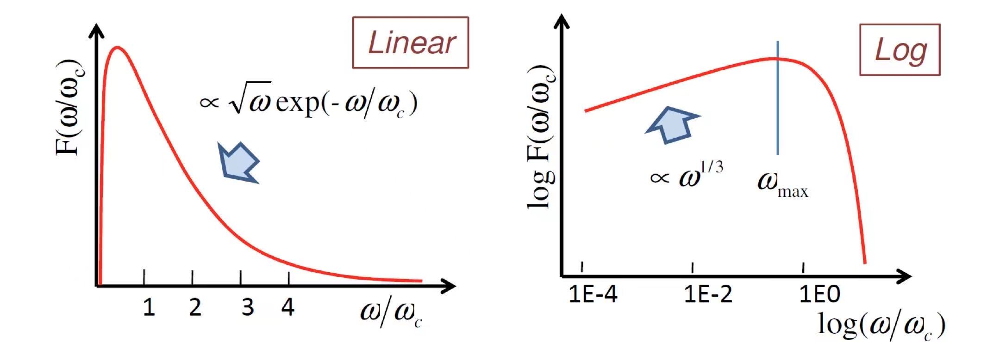

- 截断频率
    $$
    \nu_c\approx\frac{1}{\Delta t}\approx \gamma^2\nu_{cycl}\approx\gamma^3\nu_g
    $$

#### 非热同步辐射

- 电子数幂律分布
    $$
    N(E)\mathrm{d}E\propto E^{-p}\mathrm{d}E
    $$

- 辐射谱也幂律分布
    $$
    J(\omega)\propto\omega^{-\frac{p-1}{2}}=\omega^{-\alpha}
    $$

    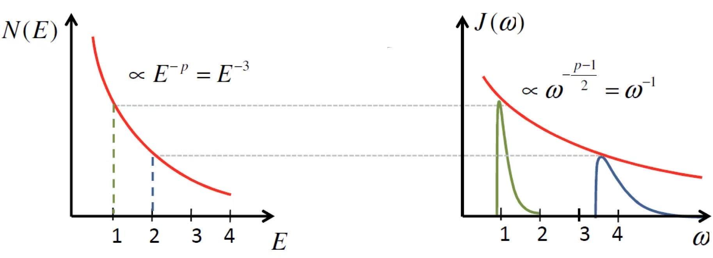

    ::: info derivation
    $$
    \omega\propto E^2,\quad N\propto E^{-p}
    $$
    $$
    J\sim N\cdot E=E^{-(p-1)}=\omega^{-\frac{p-1}{2}}
    $$
    :::

#### 同步辐射自吸收

- 低能端，等离子体光学厚，R-J近似
    $$
    I_\nu=\frac{2kT_e}{c^2}\nu^2\propto\nu^{5/2}
    $$
    电子温度 $kT_e=E=\gamma mc^2$ ，吸收光子 $\nu\approx\nu_c\propto\gamma^2\propto T_e^2$

- 能谱

    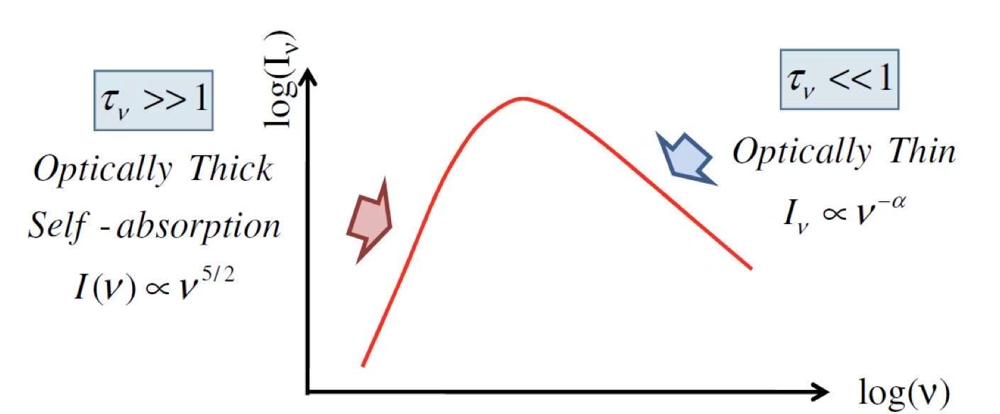

#### 同步辐射的偏振

- 平均的同步辐射在观测面上呈现线偏振，方向跟磁场在观测面上的投影垂直。

    $$
    \vec{E}\parallel\vec{a}\propto -(\vec{v}\times\vec{B})
    $$

### 逆康普顿散射

#### 汤姆孙散射

- 低能光子+低能电子，光子能量不变，弹性散射

- 电子产生总辐射强度
    $$
    -\left(\frac{\mathrm{d}E}{\mathrm{d}t\mathrm{d}\Omega}\right)_{\text{tot}}=\frac{e^4}{16\pi^2 m_e^2\varepsilon_0^2c^4}(1+\cos^2\alpha)\frac{S}{2}
    $$
    $\alpha$ 是光子的散射角（散射方向与入射方向夹角）
    ::: info derivation
    $$
    -\left(\frac{\mathrm{d}E}{\mathrm{d}t\mathrm{d}\Omega}\right)_y=\frac{e^4|E_y|^2\sin^2\theta}{16\pi^2m_e^2\varepsilon_0 c^3}=\frac{e^4 S_y}{16\pi^2 m_e^2\varepsilon_0^2c^4}
    $$
    $$
    -\left(\frac{\mathrm{d}E}{\mathrm{d}t\mathrm{d}\Omega}\right)_x=\frac{e^4|E_x|^2\sin^2\theta}{16\pi^2m_e^2\varepsilon_0 c^3}=\frac{e^4 S_x\cos^2\alpha}{16\pi^2 m_e^2\varepsilon_0^2c^4}
    $$
    $$
    -\left(\frac{\mathrm{d}E}{\mathrm{d}t\mathrm{d}\Omega}\right)_{\text{tot}}=-\left(\frac{\mathrm{d}E}{\mathrm{d}t\mathrm{d}\Omega}\right)_x-\left(\frac{\mathrm{d}E}{\mathrm{d}t\mathrm{d}\Omega}\right)_y
    $$
    :::

- 汤姆孙散射截面
    $$
    \frac{\mathrm{d}\sigma_T}{\mathrm{d}\Omega}=-\left(\frac{\mathrm{d}E}{\mathrm{d}t\mathrm{d}\Omega}\right)\frac{1}{S}=\frac{r_e^2}{2}(1+\cos^2\alpha),\quad r_e=\frac{e^2}{4\pi m_e\varepsilon_0 c^2}
    $$
    $$
    \sigma_T=\frac{8\pi}{3}r_e^2
    $$

- 偏振（x，y分量）

#### 康普顿散射

- 高能光子+低能电子，能量：光子->电子

- 光子波长
    $$
    \Delta\lambda=\lambda_C(1-\cos\theta)
    $$
    $$
    \lambda_C=\frac{h}{m_e c}=2.43\times 10^{-12}m
    $$

#### 逆康普顿散射

- 光子+高能电子，能量：电子动能->光子

- 电子能量损失率
    $$
    -\left(\frac{\mathrm{d}E}{\mathrm{d}t}\right)_{IC}=\frac{4}{3}\sigma_T cU_{rad}\beta^2\gamma^2
    $$
    $U_{rad}$ 为辐射场能量密度。

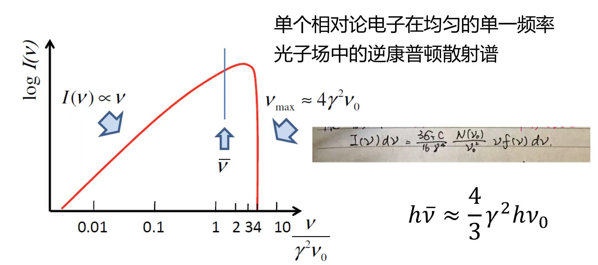

#### 康普顿化

- 热轫致辐射的康普顿化

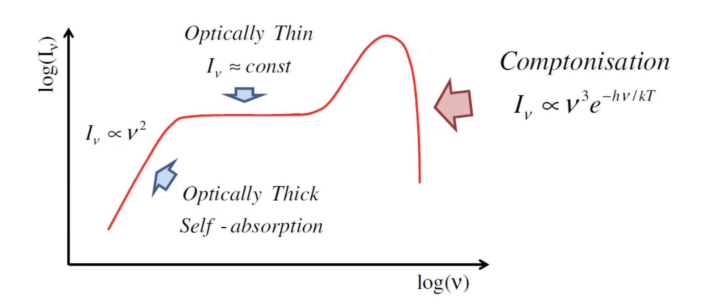

- 黑体辐射的康普顿化 Sunyaev-Zel'dovich effect （用于测量星系团距离、尺度）

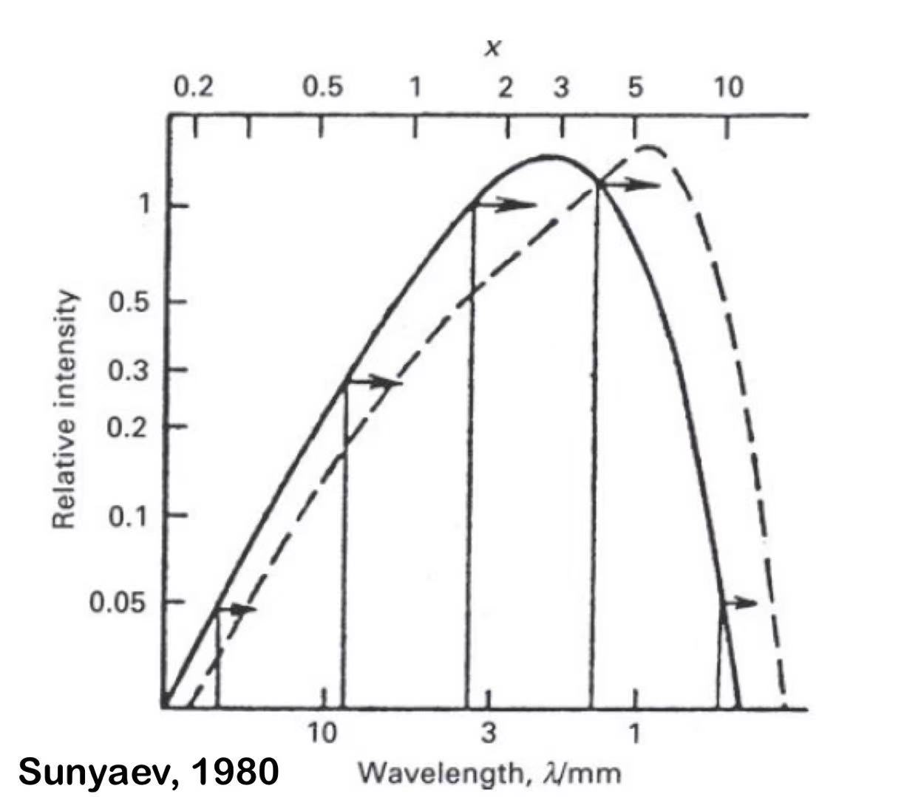

- 同步自康普顿散射

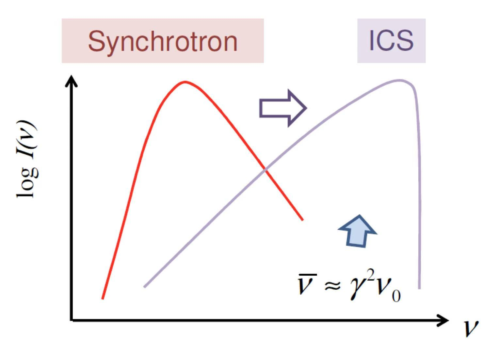

## 银河系内的高能天体物理

### 星际介质

#### 星际介质对X射线的吸收

- 吸收
    $$
    I_{\text{obs}}(E)=e^{-\sigma_{\text{ISM}}(E)N_H}I_{\text{src}}(E)
    $$
    $N_H$ 氢柱密度 ($\text{atom cm}^{-2}$)

- 吸收截面 $\sigma_{\text{ISM}}=\sigma_{\text{gas}}+\sigma_{\text{grains}}+\sigma_{\text{molecules}}$

    - $\displaystyle \sigma_{\text{gas}}=\sum_{Z,i}A_Z\times a_{Z,i}\times(1-\beta_{Z,i})\times \sigma_{bf}(Z,i)$

        $A_Z=N(Z)/N(H)$ 元素 $Z$ 的相对丰度

        $a_{Z,i}=N(Z,i)/N(Z)$ 原子处于电离态 $i$ 的几率

        $1-\beta_{Z,i}$ 尘埃消耗系数，多少元素分布在气体中

        $\sigma_{bf}(Z,i)$ 光电吸收截面 $\sigma\propto E^{-3.5}$

    - $\sigma_{\text{grains}}$ 考虑尘埃颗粒尺寸分布、形状、自遮挡等

    - $\sigma_{\text{molecules}}=A_{H_2}\times\sigma_{bf}(H_2)\sim 2.85\sigma_H$ 仅考虑氢分子

#### 星际尘埃对X射线的散射

- 微分散射截面
    $$
    \frac{\mathrm{d}\sigma_{sca}(a,E,\theta_{sca})}{\mathrm{d}\Omega}\sim e^{-0.46E^2a^2\theta_{sca}^2}
    $$

    总散射截面
    $$
    \sigma_{sca}\sim E^{-2}
    $$

    对于能量为 $E$ 的光子，典型散射角为
    $$
    \theta_{sca}\sim\frac{1}{Ea}\propto E^{-1}
    $$

- 散射时间延迟测距
    $$
    \Delta t=\frac{D}{c}\frac{x\theta\theta_{sca}}{1-x}
    $$
    ::: info derivation
    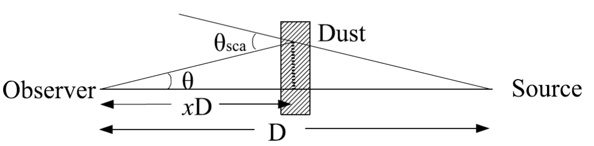
    小角近似
    $$
    \theta\approx\theta_{sca}(1-x)
    $$
    $$
    t_1=D/c
    $$
    $$
    t_2=(D+xD\theta\theta_{sca})/c
    $$
    :::

### 恒星

- 太阳（GKM晚型星）：

    - 日冕：等离子体 热轫致辐射+发射线
    - 耀斑：磁重联 非热轫致辐射

- 早型星（O/B）：

    - 星风、激波

### 超新星和超新星遗迹

Supernovae (SNe)

Supernova Remnants (SNRs)

## Appendix 2: Distances in astronomy

- Parallaxes
- The relation between the pulsation periods of Cepheid variables and their intrinsic luminosities
- Velocity-distance relation for galaxies (Hubble)
- Baade-Wesselink method: obtain angular size $\Delta\theta$ using the Stefan-Boltzmann law and physical size $(d_2-d_1)$ using the expansion of the shell $v$, then distance $r=d/\Delta\theta$
- Gravitational lenses
