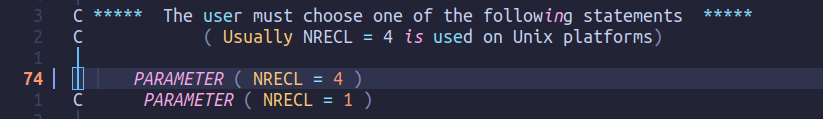
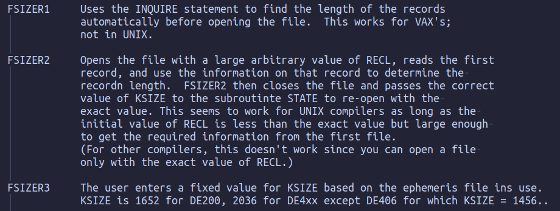
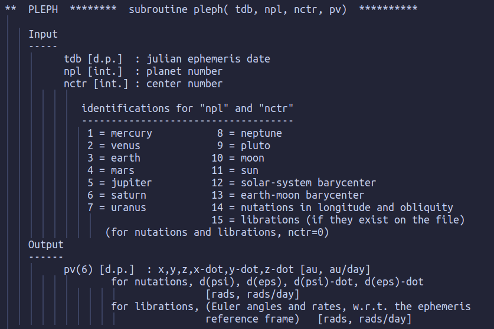

# JPL星表

以DE405为例介绍JPL星表的结构以及使用。

## DE405结构

根据创建时间不同JPL星表有多个版本，这里采用DE405是在1997年创建的，包含了从1599年到2201年太阳系八大行星，冥王星和月球的位置。

DE405文件夹包含头文件 `header.405` 和系数文件 `ascp****.405` ， `****` 代表系数文件的起始时间，每个系数文件包含20年天体位置切比雪夫插值系数，例如从2000年到2020年的系数包含在文件 `ascp2000.405` 中。

详见[天文学基础（JPL星历）](https://sirlis.cn/posts/astronomy-basic-JPL-ephemeris/)

## DE405下载并使用(fortran)

::: warning 注意
下面是在 `Ubuntu22.04` 操作系统下完成的操作，如果你使用的是其他的操作系统（windows,macos）请自行按照步骤修改具体操作。
:::

### 下载

通过 `ftp` 连接 `ssd.jpl.nasa.gov` 并下载目录 `/pub/eph/planets/ascii/de405` 和 `/pub/eph/planets/fortran`

::: info 网络问题无法连接
可以使用我在github上的备份[jpl-fortran](https://github.com/jingliangwei/jpl-fortran)

通过命令直接下载
```sh
git clone git@github.com:jingliangwei/jpl-fortran.git
```
:::

### 制作历表

1. 终端进入文件夹 `de405`
```sh
cd de405
```
2. 合并2000年到2040年数据
```sh
cat header.405 ascp2000.405 ascp2020.405 > jpleph00-40
```
3. 配置文件 `fortran/asc2eph.f` 生成历表制作程序 `asc2eph` ：
- 查看文件 `asc2eph.f` 的第74、75行，设置 `NRECL` 值（取消注释即可）

- 编译生成程序
```sh
gfortran fortran/asc2eph.f -o asc2eph
```
4. 运行程序 `asc2eph`
```sh
./asc2eph < de405/jpleph00-40
```
::: details 输出结果
```sh
  JPL ASCII-TO-DIRECT-I/O program.  Last modified 15-Aug-2013.

KSIZE =  2036

JPL Planetary Ephemeris DE405/DE405                                                 
Start Epoch: JED=  2305424.5 1599 DEC 09 00:00:00                                   
Final Epoch: JED=  2525008.5 2201 FEB 20 00:00:00                                   

  DENUM   0.4050000000000000D+03  LENUM   0.4050000000000000D+03
  TDATEF  0.0000000000000000D+00  TDATEB  0.1199705251947230D+17
  CENTER  0.0000000000000000D+00  CLIGHT  0.2997924580000000D+06
  AU      0.1495978706910000D+09  EMRAT   0.8130056000000000D+02
  GM1     0.4912547451450812D-10  GM2     0.7243452486162703D-09
  GMB     0.8997011346712499D-09  GM4     0.9549535105779258D-10
  GM5     0.2825345909524226D-06  GM6     0.8459715185680659D-07
  GM7     0.1292024916781969D-07  GM8     0.1524358900784276D-07
  GM9     0.2188699765425970D-11  GMS     0.2959122082855911D-03
  RAD1    0.2439760000000000D+04  RAD2    0.6052300000000000D+04
  RAD4    0.3397515000000000D+04  JDEPOC  0.2440400500000000D+07
  X1      0.3617627146035093D+00  Y1     -0.9078196772958605D-01
  Z1     -0.8571498318176335D-01  XD1     0.3367493913984140D-02
  YD1     0.2489452046764887D-01  ZD1     0.1294630068865036D-01
  X2      0.6127519413418380D+00  Y2     -0.3483653684949682D+00
  Z2     -0.1952782889802299D+00  XD2     0.1095206836169919D-01
  YD2     0.1561768436526205D-01  ZD2     0.6331105553601057D-02
  XB      0.1205174172954004D+00  YB     -0.9258384789394528D+00
  ZB     -0.4015402208018110D+00  XDB     0.1681126830399264D-01
  YDB     0.1748309313381616D-02  ZDB     0.7582028689905378D-03
  X4     -0.1101860742828588D+00  Y4     -0.1327599456132556D+01
  Z4     -0.6058891326142037D+00  XD4     0.1448165305973510D-01
  YD4     0.2424631177602962D-03  ZD4    -0.2815207342480053D-03
  X5     -0.5379706898835912D+01  Y5     -0.8304805814601515D+00
  Z5     -0.2248287002283728D+00  XD5     0.1092011543008852D-02
  YD5    -0.6518116565792683D-02  ZD5    -0.2820783165365047D-02
  X6      0.7894392441979052D+01  Y6      0.4596477801626945D+01
  Z6      0.1558697573530267D+01  XD6    -0.3217555239303309D-02
  YD6     0.4335809858955276D-02  ZD6     0.1928646565653845D-02
  X7     -0.1826539830682203D+02  Y7     -0.1161944505518115D+01
  Z7     -0.2501034839373779D+00  XD7     0.2211884174177654D-03
  YD7    -0.3762475932846577D-02  ZD7    -0.1651014703068002D-02
  X8     -0.1605504258376823D+02  Y8     -0.2394218121617857D+02
  Z8     -0.9400156723548831D+01  XD8     0.2642771043366916D-02
  YD8    -0.1498314455359210D-02  ZD8    -0.6790419030179561D-03
  X9     -0.3048331960399932D+02  Y9     -0.8724783554957969D+00
  Z9      0.8911563040989932D+01  XD9     0.3222104477235880D-03
  YD9    -0.3143570302152020D-02  ZD9    -0.1077948829739304D-02
  XM     -0.8081773279114842D-03  YM     -0.1994630001620399D-02
  ZM     -0.1087262660838102D-02  XDM     0.6010848166591299D-03
  YDM    -0.1674454606151515D-03  ZDM    -0.8556214497398616D-04
  XS      0.4502508156233894D-02  YS      0.7670747009323788D-03
  ZS      0.2660568051770271D-03  XDS    -0.3517482096451887D-06
  YDS     0.5177625399584830D-05  ZDS     0.2229101854391665D-05
  BETA    0.1000000000000000D+01  GAMMA   0.1000000000000000D+01
  J2SUN   0.2000000000000000D-06  GDOT    0.0000000000000000D+00
  MA0001  0.1390787378942278D-12  MA0002  0.2959122082855911D-13
  MA0004  0.3846858707712684D-13  MAD1    0.1800000000000000D+01
  MAD2    0.2400000000000000D+01  MAD3    0.5000000000000000D+01
  RE      0.6378137000000000D+04  ASUN    0.6960000000000000D+06
  PHI     0.5129959705158125D-02  THT     0.3823906558768601D+00
  PSI     0.1294142224110279D+01  OMEGAX  0.4524704499022800D-04
  OMEGAY -0.2230927631987430D-05  OMEGAZ  0.2299448587013670D+00
  AM      0.1738000000000000D+04  J2M     0.2043120066546529D-03
  J3M     0.8785469507793110D-05  J4M    -0.1453830070720000D-06
  C22M    0.2251782439166225D-04  C31M    0.3080380978342937D-04
  C32M    0.4879807362755130D-05  C33M    0.1770176462434814D-05
  S31M    0.4259328630030294D-05  S32M    0.1695516268000369D-05
  S33M   -0.2709700966566918D-06  C41M   -0.7177801498060000D-05
  C42M   -0.1439518383850000D-05  C43M   -0.8547881548190000D-07
  C44M   -0.1549038931300000D-06  S41M    0.2947433749140000D-05
  S42M   -0.2884372127200000D-05  S43M   -0.7889673128390000D-06
  S44M    0.5640415557200000D-07  LBET    0.6316121342194731D-03
  LGAM    0.2278583139977560D-03  K2M     0.2992211665970535D-01
  TAUM    0.1667165558492845D+00  AE      0.6378137000000000D+04
  J2E     0.1082626000000000D-02  J3E    -0.2533000000000000D-05
  J4E    -0.1616000000000000D-05  K2E0    0.3400000000000000D+00
  K2E1    0.3000000000000000D+00  K2E2    0.3000000000000000D+00
  TAUE0   0.0000000000000000D+00  TAUE1   0.1290895939156023D-01
  TAUE2   0.6941785584052303D-02  DROTEX  0.2440000000000000D-03
  DROTEY -0.1193000000000000D-02  GMAST1  0.6466825433842555D-13
  GMAST2  0.1277481189104146D-13  GMAST3  0.3334058772960295D-14
  KVC     0.0000000000000000D+00  IFAC    0.3000000000000000D-03
  PHIC   -0.4259518300000000D-02  THTC    0.4088443000000000D+00
  PSIC   -0.1714509000000000D+01  OMGCX   0.0000000000000000D+00
  OMGCY  -0.1581670700000000D-05  OMGCZ   0.2298880000000000D+00
  PSIDOT  0.0000000000000000D+00  MGMIS   0.1000000000000000D+01
  ROTEX   0.0000000000000000D+00  ROTEY   0.0000000000000000D+00


    3  171  231  309  342  366  387  405  423  441  753  819  899    0    0
   14   10   13   11    8    7    6    6    6   13   11   10   10    0    0
    4    2    2    1    1    1    1    1    1    8    2    4    4    0    0
     1 EPHEMERIS RECORDS WRITTEN.  LAST JED =   2451568.50
   101 EPHEMERIS RECORDS WRITTEN.  LAST JED =   2454768.50
   201 EPHEMERIS RECORDS WRITTEN.  LAST JED =   2457968.50
   301 EPHEMERIS RECORDS WRITTEN.  LAST JED =   2461168.50
   401 EPHEMERIS RECORDS WRITTEN.  LAST JED =   2464368.50
   457 EPHEMERIS RECORDS WRITTEN.  LAST JED =   2466160.50
STOP  OK
```
:::
工作目录下生成星表文件 `JPLEPH` （二进制文件）

### 历表测试

使用 `fortran/testeph.f` 进行测试

1. 配置 `testeph.f` ：
- 填写251、316、388行处的 `NRECL` 参数（推荐与前面 `asc2eph.f` 保持一致）
- 417行处根据不同星表填写参数（对于DE405填写2036）
- 在939-941行选择调用子程序（Linux使用2，windows使用3）
::: info 程序说明
可以在 `userguide.txt` 查看各个子程序的说明。

:::
2. 把 `testeph.f` 主程序后的所有子程序单独拆出来另存为 `jplsubs.f`
- 将原 `testeph.f` 第219行之后的所有代码剪切保存到新文件 `jplsubs.f`
3. 编译生成测试程序 `test`：
```sh
gfortran fortran/testeph.f fortran/jplsubs.f -o test
```
4. 运行测试程序：
```sh
./test < de405/testpo.405
```
::: details 输出结果
```sh
  JPL TEST-EPHEMERIS program.  Last modified March 2013.

    2451536.50    2466160.50         32.00
  DENUM   0.4050000000000000D+03
  LENUM   0.4050000000000000D+03
  TDATEF  0.0000000000000000D+00
  TDATEB  0.1199705251947230D+17
  CENTER  0.0000000000000000D+00
  CLIGHT  0.2997924580000000D+06
  AU      0.1495978706910000D+09
  EMRAT   0.8130056000000000D+02
  GM1     0.4912547451450812D-10
  GM2     0.7243452486162703D-09
  GMB     0.8997011346712499D-09
  GM4     0.9549535105779258D-10
  GM5     0.2825345909524226D-06
  GM6     0.8459715185680659D-07
  GM7     0.1292024916781969D-07
  GM8     0.1524358900784276D-07
  GM9     0.2188699765425970D-11
  GMS     0.2959122082855911D-03
  RAD1    0.2439760000000000D+04
  RAD2    0.6052300000000000D+04
  RAD4    0.3397515000000000D+04
  JDEPOC  0.2440400500000000D+07
  X1      0.3617627146035093D+00
  Y1     -0.9078196772958605D-01
  Z1     -0.8571498318176335D-01
  XD1     0.3367493913984140D-02
  YD1     0.2489452046764887D-01
  ZD1     0.1294630068865036D-01
  X2      0.6127519413418380D+00
  Y2     -0.3483653684949682D+00
  Z2     -0.1952782889802299D+00
  XD2     0.1095206836169919D-01
  YD2     0.1561768436526205D-01
  ZD2     0.6331105553601057D-02
  XB      0.1205174172954004D+00
  YB     -0.9258384789394528D+00
  ZB     -0.4015402208018110D+00
  XDB     0.1681126830399264D-01
  YDB     0.1748309313381616D-02
  ZDB     0.7582028689905378D-03
  X4     -0.1101860742828588D+00
  Y4     -0.1327599456132556D+01
  Z4     -0.6058891326142037D+00
  XD4     0.1448165305973510D-01
  YD4     0.2424631177602962D-03
  ZD4    -0.2815207342480053D-03
  X5     -0.5379706898835912D+01
  Y5     -0.8304805814601515D+00
  Z5     -0.2248287002283728D+00
  XD5     0.1092011543008852D-02
  YD5    -0.6518116565792683D-02
  ZD5    -0.2820783165365047D-02
  X6      0.7894392441979052D+01
  Y6      0.4596477801626945D+01
  Z6      0.1558697573530267D+01
  XD6    -0.3217555239303309D-02
  YD6     0.4335809858955276D-02
  ZD6     0.1928646565653845D-02
  X7     -0.1826539830682203D+02
  Y7     -0.1161944505518115D+01
  Z7     -0.2501034839373779D+00
  XD7     0.2211884174177654D-03
  YD7    -0.3762475932846577D-02
  ZD7    -0.1651014703068002D-02
  X8     -0.1605504258376823D+02
  Y8     -0.2394218121617857D+02
  Z8     -0.9400156723548831D+01
  XD8     0.2642771043366916D-02
  YD8    -0.1498314455359210D-02
  ZD8    -0.6790419030179561D-03
  X9     -0.3048331960399932D+02
  Y9     -0.8724783554957969D+00
  Z9      0.8911563040989932D+01
  XD9     0.3222104477235880D-03
  YD9    -0.3143570302152020D-02
  ZD9    -0.1077948829739304D-02
  XM     -0.8081773279114842D-03
  YM     -0.1994630001620399D-02
  ZM     -0.1087262660838102D-02
  XDM     0.6010848166591299D-03
  YDM    -0.1674454606151515D-03
  ZDM    -0.8556214497398616D-04
  XS      0.4502508156233894D-02
  YS      0.7670747009323788D-03
  ZS      0.2660568051770271D-03
  XDS    -0.3517482096451887D-06
  YDS     0.5177625399584830D-05
  ZDS     0.2229101854391665D-05
  BETA    0.1000000000000000D+01
  GAMMA   0.1000000000000000D+01
  J2SUN   0.2000000000000000D-06
  GDOT    0.0000000000000000D+00
  MA0001  0.1390787378942278D-12
  MA0002  0.2959122082855911D-13
  MA0004  0.3846858707712684D-13
  MAD1    0.1800000000000000D+01
  MAD2    0.2400000000000000D+01
  MAD3    0.5000000000000000D+01
  RE      0.6378137000000000D+04
  ASUN    0.6960000000000000D+06
  PHI     0.5129959705158125D-02
  THT     0.3823906558768601D+00
  PSI     0.1294142224110279D+01
  OMEGAX  0.4524704499022800D-04
  OMEGAY -0.2230927631987430D-05
  OMEGAZ  0.2299448587013670D+00
  AM      0.1738000000000000D+04
  J2M     0.2043120066546529D-03
  J3M     0.8785469507793110D-05
  J4M    -0.1453830070720000D-06
  C22M    0.2251782439166225D-04
  C31M    0.3080380978342937D-04
  C32M    0.4879807362755130D-05
  C33M    0.1770176462434814D-05
  S31M    0.4259328630030294D-05
  S32M    0.1695516268000369D-05
  S33M   -0.2709700966566918D-06
  C41M   -0.7177801498060000D-05
  C42M   -0.1439518383850000D-05
  C43M   -0.8547881548190000D-07
  C44M   -0.1549038931300000D-06
  S41M    0.2947433749140000D-05
  S42M   -0.2884372127200000D-05
  S43M   -0.7889673128390000D-06
  S44M    0.5640415557200000D-07
  LBET    0.6316121342194731D-03
  LGAM    0.2278583139977560D-03
  K2M     0.2992211665970535D-01
  TAUM    0.1667165558492845D+00
  AE      0.6378137000000000D+04
  J2E     0.1082626000000000D-02
  J3E    -0.2533000000000000D-05
  J4E    -0.1616000000000000D-05
  K2E0    0.3400000000000000D+00
  K2E1    0.3000000000000000D+00
  K2E2    0.3000000000000000D+00
  TAUE0   0.0000000000000000D+00
  TAUE1   0.1290895939156023D-01
  TAUE2   0.6941785584052303D-02
  DROTEX  0.2440000000000000D-03
  DROTEY -0.1193000000000000D-02
  GMAST1  0.6466825433842555D-13
  GMAST2  0.1277481189104146D-13
  GMAST3  0.3334058772960295D-14
  KVC     0.0000000000000000D+00
  IFAC    0.3000000000000000D-03
  PHIC   -0.4259518300000000D-02
  THTC    0.4088443000000000D+00
  PSIC   -0.1714509000000000D+01
  OMGCX   0.0000000000000000D+00
  OMGCY  -0.1581670700000000D-05
  OMGCZ   0.2298880000000000D+00
  PSIDOT  0.0000000000000000D+00
  MGMIS   0.1000000000000000D+01
  ROTEX   0.0000000000000000D+00
  ROTEY   0.0000000000000000D+00
   line -- jed --   t#   c#   x#   --- jpl value ---   --- user value --    -- difference --

   100 2454557.5    4    6    3         -1.2415306782328         -1.2415306782328  0.99920E-14
   200 2457601.5    9    1    5          0.0193728097011          0.0193728097011  0.32103E-13
   300 2460645.5    1    5    4         -0.0172500365114         -0.0172500365114  0.36828E-13
   400 2463688.5    3   13    4          0.0000034501143          0.0000034501143  0.32088E-13
Note: The following floating-point exceptions are signalling: IEEE_UNDERFLOW_FLAG IEEE_DENORMAL
```
:::

### 调用子程序获取天体信息

由 `fortran/userguide.txt` 中对子程序 `PLEPH` 的描述：

可以自行编写程序调用，新建文件 `fortran/usage.f90` 如下：
```f90
program usage
  double precision ET
  double precision R(6)

  ET = 2451546.25

  call PLEPH(ET,11,3,R)

  write(*,*) R

end program
```
编译运行
```sh:no-line-numbers
$ gfortran fortran/usage.f90 fortran/jplsubs.f -o usage
$ ./usage
```

