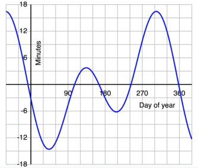

# 天文测量基础

## 球面几何

常用的球面三角公式

- 正弦定理

$$
\frac{\sin a}{\sin A}=\frac{\sin b}{\sin B}=\frac{\sin c}{\sin C}
$$

- 余弦定理（边）

$$
\left\{
\begin{array}{l}
\cos a=\cos b\cos c+\sin b\sin c\cos A \\
\cos b=\cos a\cos c+\sin a\sin c\cos B \\
\cos c=\cos a\cos b+\sin a\sin b\cos C
\end{array}
\right.
$$

- 第一五元素公式

$$
\left\{
\begin{array}{l}
\sin a\cos B=\cos b\sin c-\sin b\cos c\cos A \\
\sin a\cos C=\cos c\sin b-\sin c\cos b\cos A \\
\sin b\cos A=\cos a\sin c-\sin a\cos c\cos B \\
\sin b\cos C=\cos c\sin a-\sin c\cos a\cos B \\
\sin c\cos A=\cos a\sin b-\sin a\cos b\cos C \\
\sin c\cos B=\cos b\sin a-\sin b\cos a\cos C \\
\end{array}
\right.
$$

## 时间历法

确定时间需要两个量：
1. 时间间隔 $\Delta T$
2. 起算时刻 $T_0$

### 时间尺度

- 恒星时：春分点的时角 $S=t_\Upsilon$
- 真太阳时：真太阳周日视运动 $m_\odot=t_\odot+12^h$
- 平太阳时：平太阳周日视运动 $m=t_m+12^h$
- 时差：真太阳和平太阳的时角差 $\eta=t_\odot-t_m$

$1$ 回归年 $= 365.2422$ 平太阳日 $= 366.2422$ 恒星日

- 地方时 $(s,m_\odot,m)$
- 世界时 $(S,M_\odot,M)$

### 时间系统

| 符号 | 秒长 | 时刻 | 用途 |
|:---:|:---:|:---:|:----:|
| $GMST$ |平春分点连续两次上中天时间间隔的 $86400$ 分之一|平春分点的格林尼治时角|瞬时天球坐标系和瞬时地球坐标系间的坐标旋转参数|
| $UT_1$ |赤道平太阳连续两次下中天时间间隔的 $86400$ 分之一|赤道平太阳的格林尼治时角加 $12$ 小时|和$GMST$成比例，为民用时刻提供一个长期参考。1960年以前曾作为时间基准|
| $ET$ |1900年1月0日12时整瞬间回归年长度的 $1/31556925.9747$ | 1900年初太阳几何平黄经等于 $279^\circ 41'48''.04$ 瞬间为$ET$的1900年1月0日12时整|太阳系天体地心历表中的时间变量，1960年起作为时间尺度基准|
| $TAI$ |大地水准面上铯原子$C_S^{135}$基态的两个超细能级零磁场跃迁辐射振荡$9192631770$周的持续时间|1958年1月0日世界时$0^h$，$UT-TAI=0^s.0039$ $ET-TAI=32^s.184$ |1967年起用来定义时间尺度（秒长）|
| $UTC$ |同于$TAI$|和世界时时刻的差异不超过 $\pm0^s.9$|提供民用时时刻|
| $TDT$ $=TT$ |地球大地水准面上秒长等于$SI$秒|$TT-TAI=32^s.184$|通过$TAI$尺度实现$TT$的概念，于1984年起取代$ET$|
| $TCG$ |在平直空间其秒长等于$SI$秒|$TCG-TT=L_G\times$ $(JD-2443144.5)$ $\times 86400$|地心系中的天体运动方程的时间变量|
| $TDB$ |秒长和$TT$相同|$TDB=TT+$ $0^s.001657\sin g$ $+0^s.000014\sin 2g$ $+\cdots$|太阳系质心坐标系中天体运动方程中的时间变量|
| $TCB$ |在平直空间其秒长等于$SI$秒|$TCB-TCG=L_C\times$ $(JD-2443144.5)$ $\times86400+\dfrac{\vec{v}_E}{c^2}(\vec{x}-\vec{x}_E)+P$ $TCB-TDB=(L_C+L_G)$ $\times(JD-2443144.5)$ $\times86400$|目前在质心天体运动方程中仍未正式采用|

### 儒略日

- 儒略日 $JD$ ：用于天文观测的时间记录。以公元前4713年（天文上记为-4712年）1月1日格林尼治平时12h为起算点，连续不断地计数。
- 简化儒略日 $MJD$ ：以1858年11月17日世界时0h起算，对应儒略日为 $2400000.5$ 日，即
$$
MJD=JD-2400000.5
$$
- 儒略历元 (Julian Epoch) J2000.0 对应2000年1月1.5日TDB，此时的 $JD=2451545.0$ ；
J1989.0 对应1989年1月0.75日TDB
- 贝塞尔历元 (Besselian Epoch) B1984.0 对应光行差改正后由平春分点起算的平太阳赤经等于 $18^h40^m$ 的瞬间。

::: info 儒略日和公历
详见[儒略日和公历](/blog/astronomy/jd)
:::

## 参考系

- 参考系 (reference system) (R.S.) : a theoretical concept
- 参考架 (reference frame) (R.F.) : a practical realization of a R.S.

### 恒星参考系

恒星参考系：以恒星作为基准点，通过岁差的绝对旋转运动可以过渡到惯性参考系

- 旧恒星参考系（基于FK5星表）：以太阳系质心为中心，J2000.0的平赤道和平春分点为基准的天球平赤道坐标系。包含 $l1535$ 颗均匀分布在天空中的目视星等亮于 $7.5$ 等的恒星（基本星）。
- 新恒星参考系（基于依巴谷星表）

### 动力学参考系/架

太阳系历表（数值历表）：

- DE 美国 DE40X,DE42X,DE42X
- EPM 俄罗斯 EPM2008,EPM2010
- INPOP 法国 06,08,10a

::: info DE405星表的使用
具体查看[JPL历表](/blog/astronomy/jpl)
:::

半解析历表：

- VSOP (VSOP87,VSOP2000,VSOP2010)

### 协议准惯性参考系

协议准惯性参考系 CCRS(conventional celestial reference system) ：

- 原点位于太阳系质心
- 轴向相对遥远的河外射电源固定
- 主平面尽可能靠近J2000.0的平赤道
- 主平面原点尽可能靠近J2000.0的动力学分点

实现：
1. 天球基本参考系：FK5，依巴谷
2. 动力学参考系（太阳系天体）：JPL历表 DE405/LE405和DE421/LE421行星月球历表
3. 射电参考系（河外射电源）VLBI：ICRF

### 天球参考系

1. 国际天球参考系 ICRS(international celestial reference system) ：基于ICRF实现

- 与J2000.0动力学参考系相差在 $0.02arcsec$ 内，二者可以通过一个常矩阵 $\mathbf{B}$ 来相互转换。

- J2000.0动力学参考系即J2000.0时的赤道坐标系。

2. 太阳系质心天球参考系 BCRS(barycentric celestial reference system)
3. 地球质心天球参考系 GCRS(geocentric celestial reference system)

### 地球参考系

1. 国际地球参考系 ITRS(international terrestrial reference system) ：基于ITRF实现
- 默认以笛卡尔坐标表示 $(x,y,z)$

2. 地固坐标系：
- 参心地固坐标系
- 地心地固坐标系

3. WGS-84大地坐标系 （以地球质心为原点的地固坐标系）
- 坐标参数：测地经纬度 $L,B$ 和大地高 $H$

::: info 维度
- 地心维度 $\varphi'$ ：M点与地心连线和赤道的夹角
- 测地维度 $\varphi$ ：参考椭球在M点的法线和赤道的夹角
- 天文维度：通过台站的铅垂线和赤道的夹角
- 垂线偏差：M点处天文维度与测地维度之差（最大$3''$）

:::

