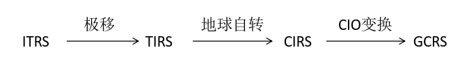

# 天体测量基础

## 球面几何

常用的球面三角公式

- 正弦定理

$$
\frac{\sin a}{\sin A}=\frac{\sin b}{\sin B}=\frac{\sin c}{\sin C}
$$

- 余弦定理（边）

$$
\left\{
\begin{array}{l}
\cos a=\cos b\cos c+\sin b\sin c\cos A \\
\cos b=\cos a\cos c+\sin a\sin c\cos B \\
\cos c=\cos a\cos b+\sin a\sin b\cos C
\end{array}
\right.
$$

- 第一五元素公式

$$
\left\{
\begin{array}{l}
\sin a\cos B=\cos b\sin c-\sin b\cos c\cos A \\
\sin a\cos C=\cos c\sin b-\sin c\cos b\cos A \\
\sin b\cos A=\cos a\sin c-\sin a\cos c\cos B \\
\sin b\cos C=\cos c\sin a-\sin c\cos a\cos B \\
\sin c\cos A=\cos a\sin b-\sin a\cos b\cos C \\
\sin c\cos B=\cos b\sin a-\sin b\cos a\cos C \\
\end{array}
\right.
$$

## 时标

确定时间需要两个量：
1. 时间间隔 $\Delta T$
2. 起算时刻 $T_0$

### 坐标时

在太阳系内有两个重要的惯性参考系：
- 质心天球参考系 (barycentric celestial reference system, BCRS)
- 地心天球参考系 (geocentric celestial reference system, GCRS)

分别对应两个时间系统（快慢与局部引力场有关）：
- 质心坐标时 (barycentric coordinate time, TCB)
- 地心坐标时 (geocentric coordinate time, TCG)

二者的变换是四维变换（《IERS规范2010》）：
$$
\mathrm{TCB}-\mathrm{TCG}=\frac{L_C(\mathrm{TT}-T_0)+P(\mathrm{TT})-P(T_0)}{1-L_B}+\frac{1}{c^2}\boldsymbol{v}_e\cdot(\boldsymbol{x}-\boldsymbol{x}_e)
$$
式中，$\boldsymbol{x}_e$和$\boldsymbol{v}_e$ 是地球质心关于质心参考系的位置和速度，定义常数：
$$
\begin{array}{l}
L_B=1.550519768\times10^{-8} \\
L_C=1.48082686741\times10^{-8} \\
T_0=2443144.5003725
\end{array}
$$
$P(\mathrm{TT})-P(T_0)$ 由 IERS 以文件 TE405 的形式提供。

### 质心力学时、地球时和原子时

天球参考系中用于历表和动力学方程的时间自变量基准为（《IERS规范2010》）：
- 质心力学时 (barycentric dynamical time, TDB)
$$
x_{\mathrm{TDB}}=x_{\mathrm{TCB}}\times(1-L_B)
$$
$$
\mathrm{TDB}=\mathrm{TCB}-L_B\times(\mathrm{JD}_{\mathrm{TCB}}-T_0)\times86400 s+\mathrm{TDB}_0
$$
其中 $\mathrm{TDB}_0=-6.55\times10^{-5}s$
- 地球时 (terrestrial time, TT)
$$
x_{\mathrm{TT}}=x_{\mathrm{TCG}}\times(1-L_G)
$$
$$
L_G=6.969290134\times10^{-10}
$$
$$
\mathrm{TCG}-\mathrm{TT}=\left(\frac{L_G}{1-L_G}\right)\times(\mathrm{JD}_{\mathrm{TT}}-T_0)\times86400s
$$

TDB 和 TT 分别是质心天球参考系和地心天球参考系中历表和动力学方程的时间变量，二者的转换有如下近似公式：
$$
\mathrm{TDB}\approx\mathrm{TT}+0.001657^s\sin g+0.000022^s\sin(L-L_J)
$$
式中，
$$
\begin{array}{l}
g=357.53^s+0.98560028^s(t-\mathrm{J}2000.0) \\
L-L_J=246.00^s+0.90251792^s(t-\mathrm{J}2000.0)
\end{array}
$$
分别为地球平近点角，以及太阳平黄经与木星平黄经之差。

TDB 和 TT 时标的前身是历书时 ET ，1952年为 IAU 采用，1970年由 TDB 和 TT 取代。

- 国际原子时 (TAI) ：以国际制秒为单位，1958年1月1日世界时0时为原点的连续计时系统。
$$
\mathrm{TT}=\mathrm{TAI}+32^s.184
$$

### 世界时

- 世界时 (universal time, UT) ：根据地球自转速度变换调节日的长度。以格林尼治平太阳时作为标准时间。
- UT0 ：根据各天文台恒星中天观测直接确定
- UT1 ：消除极移影响
- UT2 ：消除地球自转速度季节变化的影响
- 协调世界时 (UTC) ：通过闰秒保持与 TAI 的秒差为整数，与 UT1 的秒差在 $0.9s$ 内。

### 时间系统

| 符号 | 秒长 | 时刻 | 用途 |
|:---:|:---:|:---:|:----:|
| $GMST$ |平春分点连续两次上中天时间间隔的 $86400$ 分之一|平春分点的格林尼治时角|瞬时天球坐标系和瞬时地球坐标系间的坐标旋转参数|
| $UT_1$ |赤道平太阳连续两次下中天时间间隔的 $86400$ 分之一|赤道平太阳的格林尼治时角加 $12$ 小时|和$GMST$成比例，为民用时刻提供一个长期参考。1960年以前曾作为时间基准|
| $ET$ |1900年1月0日12时整瞬间回归年长度的 $1/31556925.9747$ | 1900年初太阳几何平黄经等于 $279^\circ 41'48''.04$ 瞬间为$ET$的1900年1月0日12时整|太阳系天体地心历表中的时间变量，1960年起作为时间尺度基准|
| $TAI$ |大地水准面上铯原子$C_S^{135}$基态的两个超细能级零磁场跃迁辐射振荡$9192631770$周的持续时间|1958年1月0日世界时$0^h$，$UT-TAI=0^s.0039$ $ET-TAI=32^s.184$ |1967年起用来定义时间尺度（秒长）|
| $UTC$ |同于$TAI$|和世界时时刻的差异不超过 $\pm0^s.9$|提供民用时时刻|
| $TDT$ $=TT$ |地球大地水准面上秒长等于$SI$秒|$TT-TAI=32^s.184$|通过$TAI$尺度实现$TT$的概念，于1984年起取代$ET$|
| $TCG$ |在平直空间其秒长等于$SI$秒|$TCG-TT=L_G\times$ $(JD-2443144.5)$ $\times 86400$|地心系中的天体运动方程的时间变量|
| $TDB$ |秒长和$TT$相同|$TDB=TT+$ $0^s.001657\sin g$ $+0^s.000014\sin 2g$ $+\cdots$|太阳系质心坐标系中天体运动方程中的时间变量|
| $TCB$ |在平直空间其秒长等于$SI$秒|$TCB-TCG=L_C\times$ $(JD-2443144.5)$ $\times86400+\dfrac{\vec{v}_E}{c^2}(\vec{x}-\vec{x}_E)+P$ $TCB-TDB=(L_C+L_G)$ $\times(JD-2443144.5)$ $\times86400$|目前在质心天体运动方程中仍未正式采用|

### 儒略日

- 儒略日 $JD$ ：用于天文观测的时间记录。以公元前4713年（天文上记为-4712年）1月1日格林尼治平时12h为起算点，连续不断地计数。
- 简化儒略日 $MJD$ ：以1858年11月17日世界时0h起算，对应儒略日为 $2400000.5$ 日，即
$$
MJD=JD-2400000.5
$$
- 儒略历元 (Julian Epoch) J2000.0 对应2000年1月1.5日TDB，此时的 $JD=2451545.0$ ；
J1989.0 对应1989年1月0.75日TDB
- 贝塞尔历元 (Besselian Epoch) B1984.0 对应光行差改正后由平春分点起算的平太阳赤经等于 $18^h40^m$ 的瞬间。

::: info 儒略日和公历
详见[儒略日和公历](/blog/astronomy/jd)
:::

## 参考系

- 参考系 (reference system) (R.S.) : a theoretical concept
- 参考架 (reference frame) (R.F.) : a practical realization of a R.S.

确定一个三维空间参考系需要三个要素：
1. 原点
2. 基本平面（$xy$平面）
3. 基本方向（$x$方向）

### 中间参考系

由于地球进动，地球自转轴在天球参考系 CRS 中具有瞬时性，天极和天赤道也一样。《IERS规范2003》称具有瞬时性的天极和天赤道为：
- 中间赤道
- 天球中间极 (celestial intermediate pole, CIP)

- 天球中间零点 (celestial intermediate origin, CIO) ：相对天球参考系没有转动
- 地球中间零点 (terrestrial intermediate origin, TIO) ：相对地球参考系没有转动

在天球参考系中观察，中间赤道与 CIO 固结，称为天球中间赤道，TIO 沿着赤道逆时针方向运动，周期为一恒星日。反之，在地球参考系中观察时，中间赤道与 TIO 固结，称为地球中间赤道，CIO 以同样周期沿赤道顺时针方向运动。
- 地球自转角 (earth rotating angle, ERA) ：CIO 和 TIO 之间的夹角。
- 格林尼治恒星时 (Greenwich sidereal time, GST) ：春分点和 TIO 之间的夹角。

- 真赤道系： 以真春分点为基本方向，与之一同转动的赤道就是真赤道
- 天球中间参考系 (celestial intermediate reference system, CIRS) ：以 CIO 为基本方向
- 地球中间参考系 (terrestrial intermediate reference system, TIRS) ：以 TIO 为基本方向
- 平赤道系： 只考虑岁差不考虑章动的情况，相当于真赤道坐标系在一段时期内的平均位置，相应的基本平面和基本点为平赤道和平春分点

### 天球参考系

1. 国际天球参考系 ICRS(international celestial reference system) ：基于ICRF实现

- 与J2000.0动力学参考系相差在 $0.02arcsec$ 内，二者可以通过一个常矩阵 $\boldsymbol{B}$ 来相互转换（历元偏置变换）。

- J2000.0动力学参考系即J2000.0时的平赤道坐标系。

2. 太阳系质心天球参考系 BCRS(barycentric celestial reference system)
3. 地球质心天球参考系 GCRS(geocentric celestial reference system) ：把坐标原点平移到地球质心（在广义相对论下要考虑测地岁差的微小转动）

### 地球参考系

1. 国际地球参考系 ITRS(international terrestrial reference system) ：基于ITRF实现
- 默认以笛卡尔坐标表示 $(x,y,z)$

2. 地固坐标系：
- 参心地固坐标系
- 地心地固坐标系

3. WGS-84大地坐标系 （以地球质心为原点的地固坐标系）
- 坐标参数：测地经纬度 $L,B$ 和大地高 $H$

::: info 纬度
- 地心纬度 $\varphi'$ ：M点与地心连线和赤道的夹角
- 测地纬度 $\varphi$ ：参考椭球在M点的法线和赤道的夹角
- 天文纬度：通过台站的铅垂线和赤道的夹角
- 垂线偏差：M点处天文纬度与测地纬度之差（最大$3''$）

:::

## 从GCRS到ITRS

### 岁差和章动

- 岁差：周期 $25800$ 年，天极 $P$ 绕黄极周期性顺时针转动，造成春分点每年西移 $50.2564''$ ，但是黄赤交角并不因此改变（在理想情况下）。

- 章动：由于月球并不在黄道上，黄白交角为 $5^\circ09'$，太阳和月亮不停在赤道南北运动，造成天极在绕黄极运动基础上又有摆动。摆动最大振幅为 $9.20''$ ，周期为 $18.6$ 年。

- 总岁差：在日月岁差，行星岁差综合作用下，春分点的运动

$\Upsilon_0$ 沿黄道西移 $\psi'$ 到 $\Upsilon'$ ，再沿赤道东移 $\lambda'$ 到 $\Upsilon$

### 两个坐标系

### 利用春分点进行转换

$$
[\mathrm{GCRS}]=\boldsymbol{Q}_e(t)\boldsymbol{R}_z(-GST)\boldsymbol{W}(t)[\mathrm{ITRS}]
$$

其中 $\boldsymbol{W}(t)$ 为极移矩阵

$\boldsymbol{R}_z(-GST)$ 为地球自转矩阵

$\boldsymbol{Q}_e(t)=\boldsymbol{B}\boldsymbol{P}(t)\boldsymbol{N}(t)$ 由历元偏置矩阵 $\boldsymbol{B}$ ，岁差矩阵 $\boldsymbol{P}(t)$ 和章动矩阵 $\boldsymbol{N}(t)$ 组成。

### 利用 CIO 变换

$$
[\mathrm{GCRS}]=\boldsymbol{Q}(t)\boldsymbol{R}_z(-ERA)\boldsymbol{W}(t)[\mathrm{ITRS}]
$$

其中 $\boldsymbol{W}(t)$ 为极移矩阵

$\boldsymbol{R}_z(-ERA)$ 为地球自转矩阵

$\boldsymbol{Q}(t)$ 为天球中间系-天球参考系(CIRS-GCRS)变换。

::: info 更详细的介绍
查看[利用 CIO 进行 ITRS-GCRS 变换](/lecture/cio)
:::

