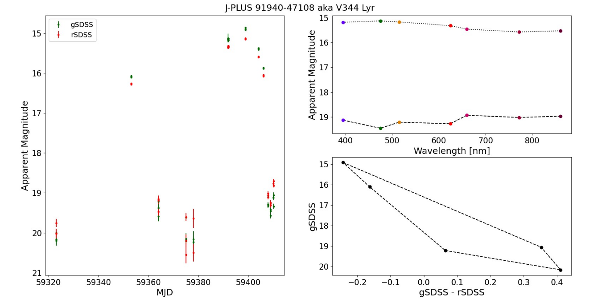

# Observational Astronomy Course

There is notes of lectures in CEFCA

## lecture 1: basics

The basics of Observational Astronomy

[slide 1](/blog/astronomy/observational_astro/BNU_CLASS_1_BASICS.pdf)

### The celestial sphere, coordinates and planning observations

- great circle: whose diameter is alse a diameter of the sphere.

- Equator: the great circle **perpendicular** to the axis of Earth's rotation

- latitude (angle): positive towards the North, and negative towards the South

- the circle of latitude: the small circle **parallel** to the Equator

- longitude (angle): positive towards the East, and negative towards the West

- meridian: any great circle **perpendicular** to the Equator

- prime meridian: the meridian passing through the Royal Greenwich Observatory in the UK

#### celestial sphere

- celestial sphere

- celestial equator

- the North and South celestial poles

#### coordinates

- Equatorial Coordinates: **declination** and **right ascension**

- Declination ( $\mathbf{Dec}$ or $\delta$): extension of latitude

- ecliptic: the plane of the Earth's orbit around the Sun

- equinox points: ecliptic & celestial equator
  
  Vernal/Spring equinox: March (the start point for measuring right ascension)

  Autumn equinox: September

- Right Ascension ( $\mathbf{RA}$ or $\alpha$): extension of longitude
  
  only positive; given in **hours (0-24)** or **degrees ($0^\circ$ - $360^\circ$)**

- zenith: the top of observers on the celestial sphere

- Horizontal coordinates

  **Azimuth** (Az) and **Altitude** (Alt)

- Azimuth (N-E-S-W)

- Altitude: runs from $0^\circ$ at the horizon to $90^\circ$ at the zenith

#### planning observations

the staralt tool: [https://astro.ing.iac.es/staralt/](https://astro.ing.iac.es/staralt/)

- Local Sidereal Time (LST): the right ascension of the local zenith

- considerations:
  1. what is my desired altitude (Dec)
  2. how long do I want to observe (RA and Dec)

### Telescopes and Mounts

#### telescopes

two types of telescopes:
- Refractors (use lenses)
- Reflectors (use mirrors)
  - Newtonian (one mirror with optical power)
  - Compact (two mirror with optical power)

basic definitions for optics:
- Focus/focal point
- focal length ($F$)

$$
\text{pixel scale}=206.265\times\frac{\text{pixelsize}[\mu m]}{F[mm]}\quad\left[\frac{\text{arcsec}}{\text{pixel}}\right]
$$

#### mounts

- Equatorial (follow RA and Dec)

- Altazimuthal (follow Az and Alt)

### The GT80 - other parts of the telescope

- the mount point of CCD:
  - Nasmyth focal points
  - Cassegrain focal points
  - prime focus points

- Field rotation: rotating the CCD counter clock-wise when looking East

## lecture 2: CCDs

CCDs: Charge Coupled Devices

[slide 2](/blog/astronomy/observational_astro/BNU_CLASS_2_CCDS.pdf)

### The basics of CCDs

- Silicon ( $^{14}\text{Si}$ ): a **semiconductor**

- energy level band: the energy level overlap when number of atom gets large.

- insulator & semiconductor & conductor

- valence band: the last occupied energy band

- conduction band: the energy bands above the valence band, where electrons can move freely.

- Photoelectric effect: incoming photon can interact with an electron and transfer its energy.

  if $E_{\text{ph}}>E_{\text{gap}}$, the electron can jump to the conduction band.

  for silicon, $E_{\text{ph}}>1.2\text{eV}$ or equivalently $\lambda_{\text{ph}}<1.1\mu m$

  for optical wavelengths, not for NIR(Near infrared)

- Quantum Efficiency: the ability of a CCD to "convert" an incoming photon into a (photo)electron.

- photoelectrons: the electron interacted with photon

- pixel: acts as a **MOS capacitor**

  Metal - Oxide - Semiconductor

  polysilicon - $\text{SiO}_2$ - $\text{Si}$

- the potential well: trap the photoelectrons

- Full Well Capacity: the maximum number of electrons that can be stored in the potential well

- Blooming: the net effect of well capacity saturation on an astronomical image

  only occurs in only one direction

- the structure of CCD pixels:

  the electrode triplet defines the pixel in one direction (here: vertical)

  the other direction (here: horizontal) the pixels are delineated with insulator strips called **channel stops**

- CCD linearity: during an exposure of time $t_{\text{exp}}$ a pixel gathers a total number of $N_e$ photoelectrons, and we have

  $$
  t_{\text{exp}}\sim N_e\rightarrow nt_{\text{exp}}\sim nN_e
  $$

- Readout:
  1. charge transfer
  2. charge measurement: measure **voltage** difference
  3. charge digitisation: the final output value for a pixel is a **digital integer** value, called **Analog-to-Digital Unit**, or **ADU**
     
     **Analog-to-Digital Converter** or **ADC**
    
     the CCD **gain** is a quantity that defines "how many electrons are required to obtain one ADU"

- Digital saturation: the ADC cannot represent the ADU counts exceed the value of $65535$ ( $2^{16}$ ) for a standard 16-bit astronomical CCD.

### Calibration frames

- Bias: to avoid the digitise negative ADU values, a fixed **bias** voltage, $V_B$ , is added when $\Delta V'=(V_S-V_R)+V_B$, ensuring that $\Delta V'>0$

- bias frames: a zero-time "integration"

- Thermal electrons: some electrons can jump to the conduction band spontaneously due to their thermal energy. And they are indistinguishable from photoelectrons.

- dark current: the amount of thermal electrons present in the CCD chip

  cool it down to avoid it.

  the dark current is described by a constant $C_D(T)$ that depends on the material and the temperature of the CCD, given in units of $[e/(\text{pix}\cdot s)]$. The amount of dark current increases with the exposure time $C_D(T)\cdot t_{\text{exp}}$

- dark frames: an integration without exposing the chip to light. (notice that the dark frames includes the bias)

- flat frames:

  in order to correct:
  1. imperfections in the optical path (e.g. vignetting, dust motes etc)
  2. differences in pixel sensitivity over the whole chip

  to obtain flat frames, simply points the telescope at the dusk or dawn twilight sky.

## lecture 3: science

Doing science with our data

[slide 3](/blog/astronomy/observational_astro/BNU_CLASS_3_SCIENCE.pdf)

### Basic definitions

- Luminosity: the total amount of radiant energy emitted over all wavelengths per unit time in all directions, with the unit Watt $[W]$

  for a star, its luminosity is
  $$
  L=4\pi R^2\sigma T^4_{\text{eff}}
  $$
  where

  $R$ the radius $[m]$

  $T_{\text{eff}}$ the effective temperature $[K]$

  $\sigma$ the Stefan-Boltzmann constant $\sim 5.67\times 10^{-8}[W\cdot m^{-2}\cdot K^{-4}]$

- Brightness: how bright an object appears to be, as seen from Earth

- Flux: for a star at distance $d$ from the Earth, its flux is given by:

  $$
  F=\frac{L}{4\pi d^2}
  $$

- Magnitude: just a number refer to the object's brightness. (**apparent** magnitude)

  the large number means faint, while the small number means bright.

  Define that "a star of magnitude 6 should be precisely 100 times fainter than a star of magnitude 1"

  $$
  \frac{F_1}{F_2}=100^{-\frac{m_1-m_2}{5}}
  $$

  the magnitude equation:
  $$
  m_1-m_2=-2.5\log_{10}\left(\frac{F_1}{F_2}\right)
  $$

- Vega-magnitude scale: define the magnitude of **Vega** is zero ( $m_{\text{Vega}}=0$ )

  $$
  m_{\text{star}}=-2.5\log_{10}\left(\frac{F_{\text{star}}}{F_{\text{Vega}}}\right)
  $$

> Vega is the 5th brightest star in the sky.

- AB-magnitude scale: AB means "absolute"
  $$
  m_{\text{AB}}=-2.5\log_{10}f_\nu-48.6
  $$
  where $f_\nu$ is the spectral flux density in a frequency interval $(\nu_1,\nu_2)$: $f_\nu=\int_{\nu_1}^{\nu_2}F_\nu(\nu)\mathrm{d}\nu$

  the magnitude in the V-band and the constant number, 48.6, ensures that $mag_{\text{AB,Vega}}=mag_{V,Vega}=0$

- parallax: 

  An object with parallax of 1 arcsec is defined to be at a distance of 1 **parsec** (parallax second). ( $1pc\sim3.26\text{ light years}$ )
  $$
  d[pc]=\frac{1}{\omega[arcsec]}=\frac{1000}{\omega[mas]}
  $$
  $mas=\text{milli-arcsecond}=10^{-3}arcsec$

- absolute magnitude: the apparent magnitude a star would have if located at a distance of 10 parsec

  the equation of apparent magnitude $m$ and absolute magnitude $M$:
  $$
  m-M=5\log_{10}(d)-5
  $$

### Introducing some Physics

- Planck's Law: the emit radiation of black bodies:
  $$
  B_\nu(\nu,T)=\frac{2h\nu^3}{c^2}\frac{1}{\mathrm{e}^{\left(\frac{h\nu}{k_BT}\right)}-1}
  $$

  the hot star looks blue, while the cool star looks red.

- spectral lines:
  $$
  \Delta E=E_{n+1}-E_n=h\cdot\nu=\frac{hc}{\lambda}
  $$
  e.g. the Hydrogen Balmer series

- Spectral Classes:

  7 spectral classes or types: O,B,A,F,G,K,M

  each class is further sub-divided in 10 sub-classes from 0 to 9. Our Sun is a G2 star.

- Spectral Energy Distrubtion (SED)

- Filter

- the Johnson UBVRI system

- the SDSS ugriz system

- Color index:

  $m_V$ for apparent magnitude in Johnson V

  $M_g$ for absolute magnitude in SDSS g

  $B=15$ for a star of magnitude 15 in the Johnson B-filter

  $r=19$ for a star of magnitude 19 in the SDSS r-filter

  $B\text{-}V=m_B-m_V$

  $g\text{-}r=m_g-m_r$

- Interstellar extinction and reddening

- color excess: $E(g\text{-}r)=(g\text{-}r)-(g_0\text{-}r_0)$

- the J-PLUS filter system

- the J-PAS filter system

### Doing Science

- The Hertzsprung-Russell diagram (H-R)

- The Main Sequence (MS): most time of stars' lives, steady nuclear fusion reactions in their cores, i.e. converting *Hydrogen* into *Helium*

- giant branch:

  - Red Giant Branch (RGB)
  - Horizontal Branch (HB)
  - Asymptotic Giant Branch (AGB)

- white dwarf (WD)

- constructing an H-R diagram:
  1. observed magnitude - observed color
  2. absolute magnitude - observed color
  3. absolute magnitude - intrinsic color

- Anatomy of the Milky way

- Clusters:
  - Globular Clusters
  - Open Clusters

- Modelling the H-R diagrams of clusters: plot the isochrone

## lecture 4: photometry

Data Reduction and Photometry

[slide 4](/blog/astronomy/observational_astro/BNU_CLASS_4_PHOTOMETRY.pdf)

### the basics of Data Reduction

- data reduction: remove unwanted signals and correct imperfections on the data using *bias*, *dark* and *flat* frames.

- master frames: combine a series of frames, i.e. masterbias, masterdark, masterflat frames.

- Combining Frames: average/mean or median

  median is robust facing outliers. (take odd number frames)

- Scaled Dark frames:

  obtain dark frames in one $t_{\text{exp,dark}}$ and subtract the masterbias from each of these dark frames, combine them into a masterdark, and then **normalise** the masterdark, i.e. divide it by $t_{\text{exp,dark}}$. This is a representation of pure dark signal (as we removed the bias) in 1 second.

  then we can **scale** this normalised masterdark to each of our science exposure times: $\text{MDARK}_{\text{science}}=t_{\text{exp,science}}\cdot\text{MDARK}_{\text{norm}}$

- Flat:

  normalisting each flat frame by dividing its mode value(the number appears most), and then combine.

  each flat frame has its own reference value.

- the whole process:

### the basics of Photometry

- photometry: measure the **total** amount of ADU counts of the celestial object we are observing. (represent the amount of light)

#### get the ADU counts

- Aperture photometry:

  aperture:
  1. Object aperture: around our actual object of interest
  2. Inner sky annulus
  3. Outer sky annulus
  
  the two annuli define a ring, where we can estimate the contribution of the sky background.

  how to define the apertures? plot in radial

  this can be draw by software AstroImageJ

- The Airy disc: point source turn to disc due to diffraction

  the radius of the Airy disc
  $$
  a=1.22\frac{\lambda}{D}[rad]
  $$

- Astronomical seeing: due to the turbulence of atmosphere

- Aperture Photometry process:
  1. Raw object flux, $F_{\text{raw}}$
  2. Sky flux, $F_{\text{sky}}[\text{pix}^{-1}]$
  3. Final object flux, $F_{\text{obj}}$
     $$
     F_{\text{obj}}=F_{\text{raw}}-N_{\text{pix}}\cdot F_{\text{sky}}
     $$
     where $N_{\text{pix}}$ is the number of pixels contained in the object aperture

- Signal to Noise Ratio:
  $$
  \text{SNR}=\frac{\text{Signal}}{\text{Noise}}
  $$

#### from counts to magnitudes

- instrumental magnitude, $m_{\text{inst}}$
  $$
  m_{\text{inst}}=-2.5\log_{10}\left(\frac{F_{\text{obj}}}{t_{\text{exp}}}\right)
  $$

- zeropoint magnitude, $m_{\text{zp}}$

  $m_{\text{zp}}$ is the apparent magnitude of a star that, when observed with our CCD, gives **1 ADU/sec**.
  
  the apparent magnitude of a star that, when observed with our CCD, has instrumental magnitude $m_{\text{inst}}=0$

  <!-- $m_{\text{inst}}=0$ means its apparent magnitude $m_{\text{zp}}=25$ -->

- the equation convert instrumental magnitude to apparent magnitude:
  $$
  m_{\text{obj}}=m_{\text{inst}}+m_{\text{zp}}
  $$

- Measuring the zeropoint (using standard stars)

  - the atmosphere extinction

    under atmosphere plane parallel approximation

    $m_0$ the magnitude outside of the atmosphere

    $m_{\text{obs}}$ the observed magnitude

    $X=\sec(z)=\dfrac{1}{\cos(z)}$ airmass

    $z$ the zenith distance (or $90^\circ-$ altitude)

    $k$ atmosphere extinction

    $$
    m_{\text{obs}}=m_0+kX
    $$

  - standard stars (also called photometric or spectrophotometric standard stars, SPS stars)

    the process:

    1. observe at different airmass
    2. perform photometry, obtain instrumental magnitudes
    3. plot airmass versus instrumental magnitudes and fit a straight line ( $m_{\text{inst,obs}}=m_{\text{inst,0}}+kX$ )

    so we get the $m_{\text{inst,0}}$ and for standard stars, its apparent magnitude $m_{\text{obj,0}}$ is known, and the zero point
    $$
    m_{\text{zp}}=m_{\text{obj,0}}-m_{\text{inst,0}}
    $$

- estimating the zeropoint (using external catalogues)

  use catalogues to calibrate our own photometry, the steps:

  1. use a **arbitrary** value for $m_{\text{zp}}$ to obtain apparent magnitudes $m_{\text{GT80}}$
  2. crossmatch and obtain their calibrated apparent magnitudes, $m_{\text{CAT}}$
  3. calculate the difference $\Delta mag=m_{\text{GT80}}-m_{\text{CAT}}$
  4. repeat and obtain average (or median) $\langle\Delta mag\rangle$

  finally we have $m_{\text{GT80,calib}}=m_{\text{GT80,org}}-\langle\Delta mag\rangle$

- gaiaxpy

## lecture 5: time-domain

Time-domain Astronomy

[slide 5](/blog/astronomy/observational_astro/BNU_CLASS_5_TDOMAIN.pdf)

### Light curve

- timestamp
- light curve: magnitudes-time or magnitudes-phase

- variable star types:

  1. Intrinsic Variables: change in *Luminosity* due to a change in $R$ and/or $T_{\text{eff}}$, e.g. pulsating stars like delta-Scuti, RR-Lyrae and Cepheids

  2. Extrinsic Variables: change in *Brightness* due to "outside" influence e.g. eclipsing binaries.

  3. Transients: basically things like Super Novae, Classical Novae, Cataclysmic Variables, flare stars etc...

- Why study Variable Stars?

  - Cepheid Variables: period-luminosity relation, standard candles for distance measurements ($d=10^{(m-M+5)/5}$)
  - Plusating Stars: asteroseismology (the earthquake on star), study of stellar interior structure
  - Eclipsing systems: model-independent measurements of stellar masses and radii
  - Flare Stars: stellar spots, magnetic field activity
  - Cataclysmic Variables: study of accretion processes

- Differential photometry:

  use the light curve of one star to correct the light curve of another by plotting the difference of the magnitudes.

- Ensemble differential photometry:
 
  use multiple comparison stars.

  normalise them first (subtract the median)

### The J-VAR survey

## practice 1

light curve of variables

### basic

- .fit(s)
- header (file-header in SAOImageDS9)

- SIMBAD: the database to search variables

  the website: [https://simbad.cds.unistra.fr/simbad/](https://simbad.cds.unistra.fr/simbad/)

- Otype: the name with the * means a variable

### data reduction using AstroImageJ

[guide 1](/blog/astronomy/observational_astro/Guide_1_AstroImageJ_DataReduction.pdf)

click the Data Processor button DP (obtain the "CCD Data Processor" window)

- create the masterbias frame:
  
  set up the directory of bias frames and the filename pattern "*.fit"

  set up the directory of output masterbias frame and the filename like "mbias.fit"

  click the "start" button after finishing set up

- create the masterdark frame:

  the similar set up directory above

  "Enable" the Bias Subtraction, and select the "deBias" option

- create the masterflat frame:

  remember to contain the filter information in the output filename.

- reducing the science images:

  make sure that the selected flat frame matches the filter of the science images

### aperture photometry

[guide 2](/blog/astronomy/observational_astro/Guide_2_AstroImageJ_Photometry_Prep.pdf)

- decide the size of aperture using radial profile

### light curve

[guide 3](/blog/astronomy/observational_astro/Guide_3_AstroImageJ_Photometry_Variable.pdf)

- "File" -> "Import" -> "Image Sequence"

- multi-apertures: 

  choose the reference star: 
  - const star
  - no saturation
  - no too faint
  - different reference star for different filters

above we just get the flux(ADU counts), we need to get magnitude-phase next.

[extra tips slide](/blog/astronomy/observational_astro/BNU_EXTRA_1_LIGHTCURVES.pdf)

- turn time-domain to phase-domain:

  Ephemeris:
  $$
  E=\frac{T_{\text{obs}}-T_0}{P}
  $$
  and then you can get the phase $E-int(E)$

- convert ADU flux to magnitude:
  $$
  \text{mag}_T=\frac{\displaystyle -\ln\left(\sum_i 2.512^{-\text{mag}_{Ci}}\right)}{\ln(2.512)}-2.5\log(\text{ref\_flux\_T})
  $$
  where $\text{mag}_{Ci}$ is the catalogue magnitude of the i-th comparison star.

  the catalogue that can search the magnitude is on: [https://catalogs.mast.stsci.edu/panstarrs/](https://catalogs.mast.stsci.edu/panstarrs/)

- getting the magnitude error
  $$
  \text{Mag\_Err}_T=2.5\log\left(1+\sqrt{\frac{\text{Source\_Error\_T1}^2}{\text{Source-Sky\_T1}^2}+\frac{\displaystyle\sum_i\text{Source\_Err\_C}_1^2}{\displaystyle\left(\sum_i\text{Source-Sky\_C}_i\right)^2}}\right)
  $$

- normalize the light curve by dividing the average/mean

## practice 2

### open clusters

- usual reduction

- using AstroImageJ:

  select target stars (no comparsion stars)

  get only data at a fixed time (no time domain)

- the gaints saturate, the solution:

  take different picture with different exposure times

- the color in H-R diagram(from blue to red):

  g-r, g-i, r-i

- usually, we take g vs g-r, g vs g-i, r vs r-i as coordinate

### error propagation

[extra error propagation slide](/blog/astronomy/observational_astro/BNU_EXTRA_2_ERROR_PROPAGATION.pdf)

- error propagation: the process to correctly calculate the error while convert counts to instrumental magnitudes.

- the general formula:

  for single variable,
  $$
  \sigma_y=\sqrt{\left(\frac{\mathrm{d}y}{\mathrm{d}x}\right)^2\sigma_x^2}
  $$

  - for the instrumental magnitude:

    $$
    m_{\text{inst}}=-2.5\log\left(\frac{C}{t_{\text{exp}}}\right)
    $$
    $$
    \sigma_{m_{\text{inst}}}=\sqrt{\left(\frac{-2.5}{\ln 10}\right)^2\left(\frac{\sigma_C}{C}\right)^2}
    $$

  for multiple variables,
  $$
  \sigma_y=\sqrt{\sum_{i=1}^N\left(\frac{\partial y}{\partial x}\right)^2\sigma_{x_i}^2}
  $$

  - for the colour index g-r,
    
    $$
    \sigma_{g\text{-}r}=\sqrt{\sigma_{gmag}^2+\sigma_{rmag}^2}
    $$
