# 实测天体物理

Observational Astrophysics

- 分光学、光度学、照相术

## 天体的信息

- 天体信息5种载体：电磁辐射、物质采样、宇宙射线、中微子和引力波

## 地球大气影响和天文台选址

- 视宁度 (Seeing)：天顶方向的像斑的半峰全宽 (FWHM)，单位是角秒 (arcsec)

## 天文光学望远镜

- 完整的现代天文光学观测仪器系统：

  望远镜 + 辐射分析仪 + 辐射探测器 + 计算机

### 望远镜光学性能物理参量

1. 口径 ( $D$ )：

   光通量 $\propto D^2$

2. 相对口径/光力 ( $A$ )：

   $A=D/F$ 是焦比的倒数

   - 大光力（快焦）观测视面天体
     
     小光力（慢焦）观测恒星

::: info 参量
流量密度增益 ( $G$ )

$$
G=\frac{\eta D^2}{(\delta F)^2}
$$
其中 $\eta$ 为通光（反射，透射）效率， $D$ 为口径， $F$ 为物镜焦距， $\delta$ 为视宁度 (Seeing) 直径
:::

3. 放大率与底片（焦面）比例尺：

   - 放大率 $M=F_o/F_e$

   - 底片比例尺 $\alpha=\omega/l=1/F(/mm)=206265/F(''/mm)$

4. 视场 ( $\omega$ )：

   - 目视望远镜 $\omega=\omega'/M$ ，$\omega'$ 为目镜对应角直径（目镜视场）
   - 照相望远镜视场就是物镜视场

5. 极限星等：
   
   $m=2.1+5\log D(mm)$

6. 分辨本领：

   $\delta=1.22\lambda/D$

7. 光能集中度：

   通常用 $80%$ 或 $90%$ 的光能集中在直径多少毫秒来衡量

::: info 性能总评价
品质因子 $Q$
$$
Q=G\omega^2\Delta\lambda
$$
:::

### 实际光学系统的像差

1. 球差
   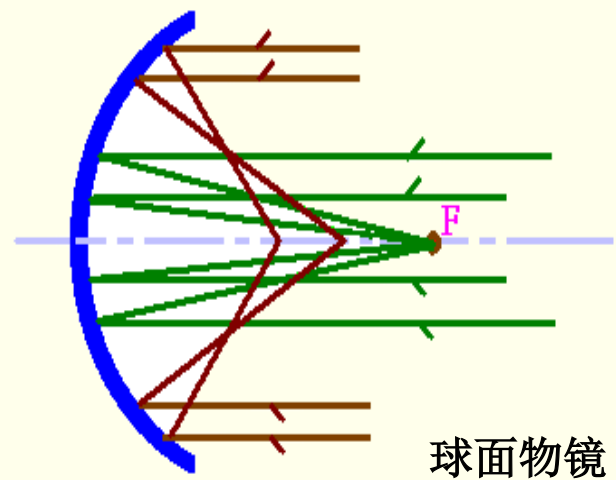
2. 彗差 (COMA)
   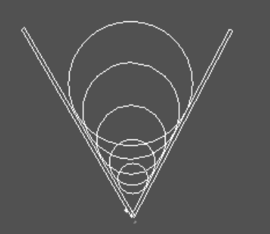
3. 像散 (Astigmatism)
   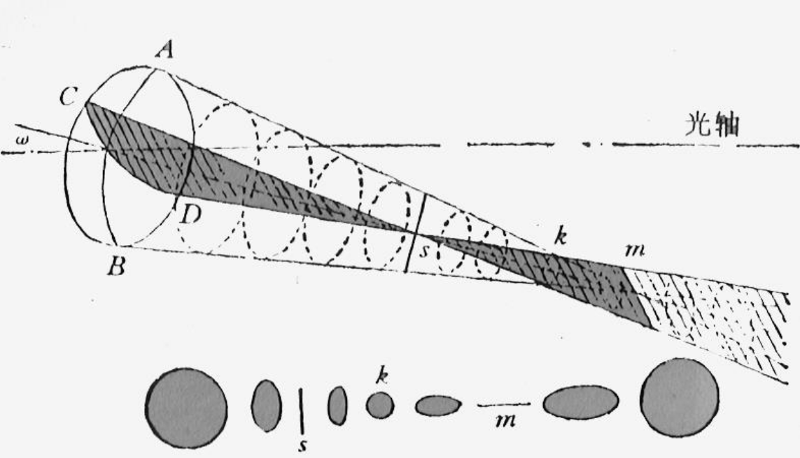
4. 场曲 (Field curvature)
   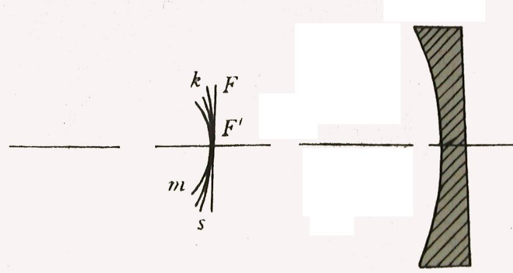
5. 畸变 (Image distortio)
   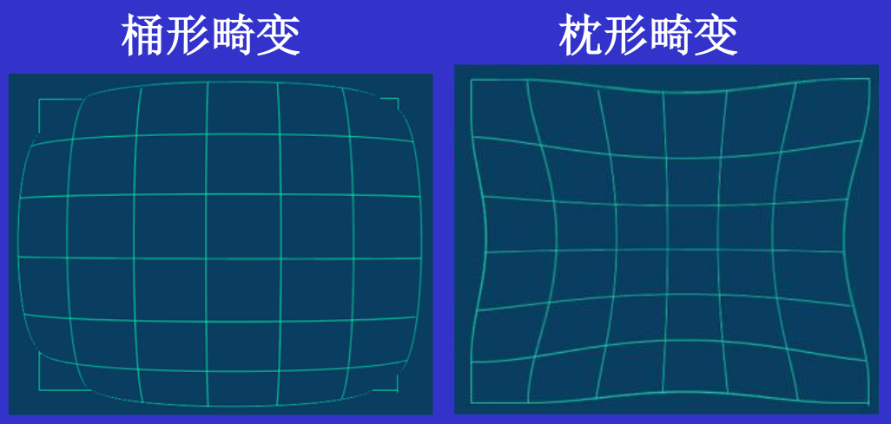
6. 色（像）差：位置色差、倍率色差
   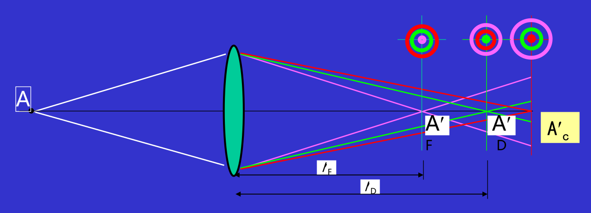
   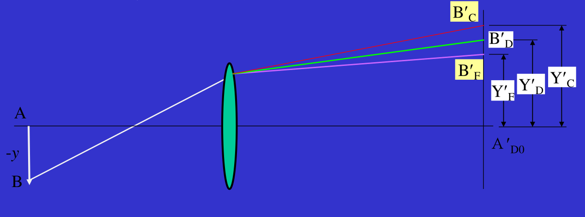

### 光学望远镜类别

- 反射望远镜的焦点系统：
  
  1. 主焦点系统
     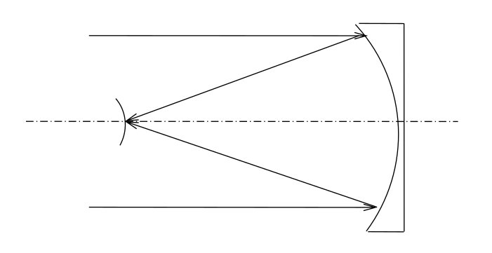
  2. 牛顿焦点系统
     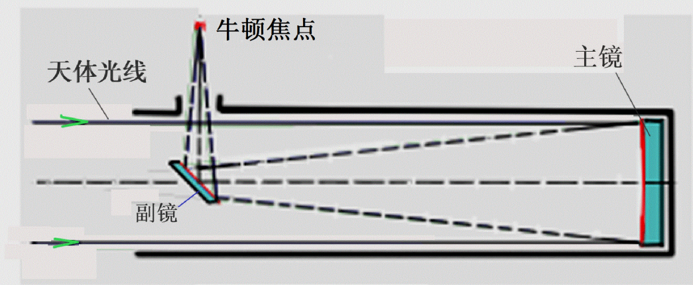
  3. 卡塞格林焦点系统
     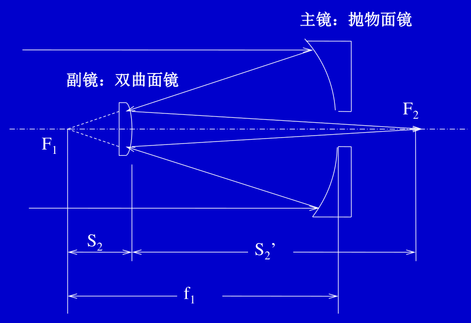
  4. R-C 系统
     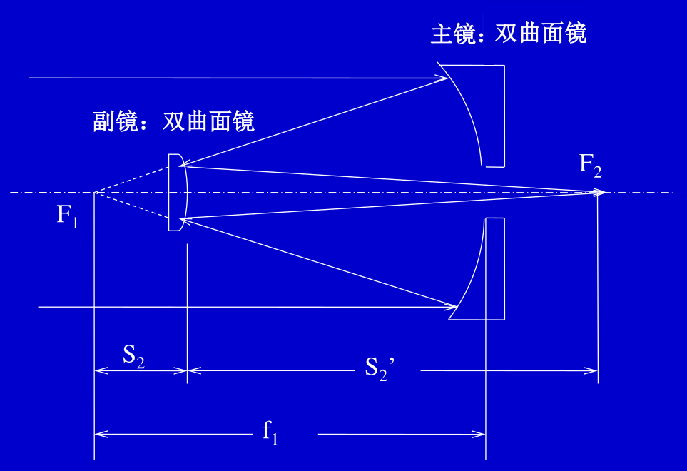
  5. 耐氏 (Nasmyth) 焦点系统
     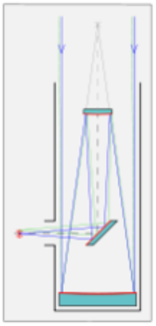
  6. 折轴 (Coude) 焦点系统
     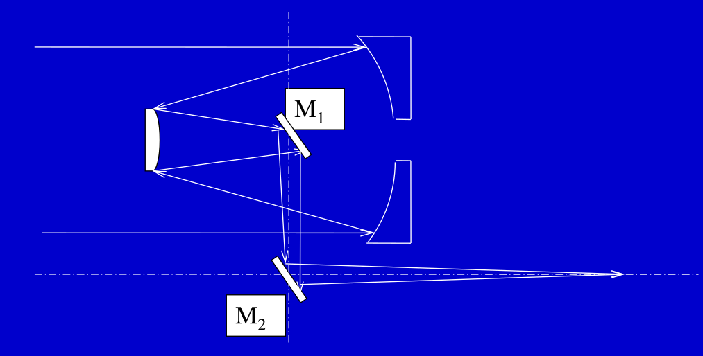

