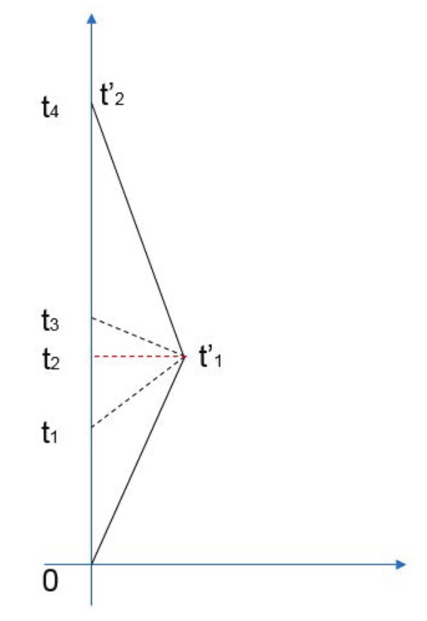

# 相对论天体物理

## 从时间、空间到时空

### 用时空图画出洛伦兹变换

- 洛伦兹变换
  
  $$
  \begin{align}
  t'&=\gamma\left(t-\frac{vx}{c^2}\right), \\
  x'&=\gamma(x-vt), \\
  \gamma&\equiv\frac{1}{\sqrt{1-v^2/c^2}}.
  \end{align}
  $$

### 动钟变慢

### 双生子佯谬

### 闵氏几何

时空几何（闵氏几何）线元
$$
ds^2=-dt^2+dx^2+dy^2+dz^2
$$

## 从矢量到张量

### 相对论速度变换

$$
\begin{align}
u'^x&=\frac{u^x-v}{1-vu^x}, \\
u'^y&=\frac{u^y}{\gamma(1-vu^x)}, \\
u'^z&=\frac{u^z}{\gamma(1-vu^x)}.
\end{align}
$$

### 切失与偏导

坐标基底的变换关系
$$
\left(\frac{\partial}{\partial \tilde{x}^\mu}\right)^a=\left(\frac{\partial}{\partial x^\nu}\right)^a\frac{\partial x^\nu}{\partial\tilde{x}^\mu}
$$

### 坐标微分与对偶坐标基底

$$
(d\tilde{x}^\mu)_a=\frac{\partial\tilde{x}^\mu}{\partial x^\nu}(dx^\nu)_a
$$
