# 恒星结构与演化

## Star Formation

1. The detailed process of star formation:
    - giant molecular clouds
    - dense core: fragmentation and collapse, rotating disk (accretion disk)
    - protostar
    - ignition: the Main Sequence

2. Brown dwarfs: if the initial mass of the protostar is too low, the process fails.

## The Observed Properties of Stars

1. Distance:
    
    - parallax
    - Cepheid variables (Period-luminosity relation)
    - Hubble's law

2. Mass:

    - astrometric binaries
    - visual binaries
    - spectroscopic binaries
    - eclipsing binaries （食双星）

3. Radii:

    - angular diameter (difficult)
    - interferometry and eclipsing binaries

4. Magnitude:

    - colour-magnitude: 
        $$
        \text{B-V}=-2.5\log\left(\frac{\text{flux in B}}{\text{flux in V}}\right)
        $$
        the colour relation: $\text{B-V}=f(T_e)$

        the observed $(\text{B-V})$ should be corrected for interstellar extinction to $(\text{B-V})_0$

    - absolute magnitude, apparent magnitude:
        $$
        m-M=5\log d \text{ (pc)}-5
        $$

    - bolometric magnitude （热星等）:
        $$
        M_{\text{bol}}-M_{\text{bol}\odot}=-2.5\log \frac{L}{L_\odot}
        $$

5. Stellar spectral types, effective temperature: OBAFGKM

6. The Hertzsprung-Russell diagram
    
    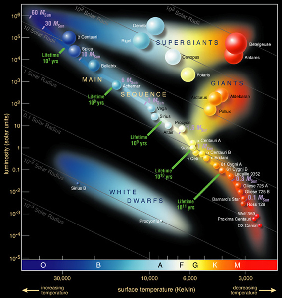

7. Mass-luminosity relation
8. Age: isochrones of star clusters
9. Metallicity: line spectrum

::: info star clusters
- stars all at same distance
- dynamically bound
- same age
- same initial chemical composition
:::

::: info Open cluster & Globular cluster

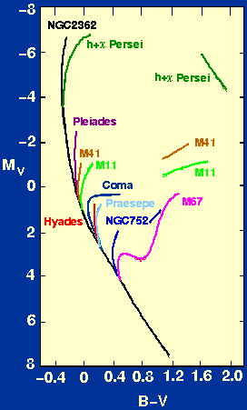

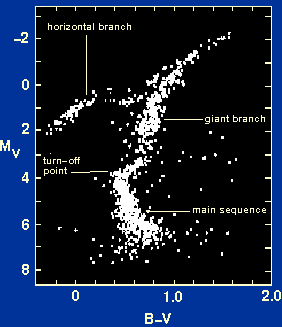

| Open cluster | Globular cluster |
|:---|:---|
| MS turn-off point varies massively | MS turn-off points in similar position |
| Very massive and bright stars (in MS) | Horizontal branch |
| The Hertzsprung gap between the MS and the giant branch | Variable RR Lyrae stars (in Horizontal branch) |
:::

## The Equations of Stellar Structure

4 equations: momentum transport (hydrostatic equilibrium), mass conservation, energy conservation, energy transport.

- Stars: gravity v.s. internal thermal pressure

- Assumptions: isolated, static, spherically symmetric, and inital homogeneous

    ::: info conditions
    - sphere (rotating, magnetic field)
    :::

- 3 supplements:

    Equation of state

    Opacity

    Core nuclear energy generation rate

1. **Equation of hydrostatic equilibrium**:

    $$
    \frac{\mathrm{d}P(r)}{\mathrm{d}r}=-\frac{GM(r)\rho(r)}{r^2}
    $$

    ::: info derivation
    consider a mass of element
    $$
    \delta m=\rho(r)\delta s\delta r
    $$
    outward force: pressure exerted by stellar material on the lower face
    $$
    P(r)\delta s
    $$
    inward force: pressure on the upper face, and gravitational attraction of all stellar material lying within $r$:
    $$
    P(r+\delta r)\delta s+\frac{GM(r)}{r^2}\delta m=P(r+\delta r)\delta s+\frac{GM(r)}{r^2}\rho(r)\delta s\delta r
    $$
    In hydrostatic equilibrium
    $$
    \frac{\mathrm{d}P(r)}{\mathrm{d}r}=-\frac{GM(r)\rho(r)}{r^2}
    $$
    :::

    ::: info accuracy of hydrostatic assumption
    - suppose there is a resultant force on the element
        $$
        \rho(r)a=\rho(r)g\beta
        $$
        hence there is an inward acceleration
        $$
        a=\beta g
        $$
        the spatial displacement $d$ after a time $t$ is
        $$
        d=\frac{1}{2}\beta gt^2
        $$
        The Sun is unlikely to have changed its properties significantly over the last $10^9$ years ( $3\times 10^{16}s$ ), which gives a upper limit for $\beta$
        
        ( $r=7\times10^{10}$ cm, $g=GM/r^2=2.5\times10^{4}$ cm s$^{-2}$ )
        $$
        d=\frac{1}{2}\beta gt^2\ll r\Rightarrow \beta\ll 6\times10^{-27}
        $$
    - The dynamical timescale

        allow the star to collapse, i.e., set $d=r$
        $$
        t_d=\frac{1}{\sqrt{\beta}}\sqrt{\frac{2r^3}{GM}}\sim\sqrt{\frac{2r^3}{GM}}
        $$
        for the Sun, $t_d\sim 2000$ s.
    :::
    ::: info accuracy of spherical symmetry assumption
    The centripetal force is given by $m\omega^2 r$

    There will be no departure from spherical symmetry provided that
    $$
    m\omega^2 r\ll\frac{GMm}{r^2}\Rightarrow\omega^2\ll\frac{GM}{r^3}=\frac{2}{t_d^2}
    $$
    for the Sun, $\omega=2\pi/P$, where rotation period $P\sim 1$ month $\sim 2\times 10^6$ s, while $t_d\sim2000$ s.
    :::

2. **Equation of mass conservation**:

    $$
    \frac{\mathrm{d}M(r)}{\mathrm{d}r}=4\pi r^2\rho(r)
    $$
    ::: info derivation
    the mass in a shell $\delta r$ at $r$ is
    $$
    \delta M=\rho(r)4\pi r^2\delta r
    $$
    :::

::: info applications
1. Minimun values for central pressure of a star:

    $$
    \left\{\begin{array}{l}
        \dfrac{\mathrm{d}P}{\mathrm{d}r}=-\dfrac{GM\rho}{r^2} \\
        \dfrac{\mathrm{d}M}{\mathrm{d}r}=4\pi r^2\rho
    \end{array}\right.
    $$
    $$
    \Rightarrow \frac{\mathrm{d}P}{\mathrm{d}M}=-\frac{GM}{4\pi r^4}
    $$
    $$
    P_c-P_s=\int_0^{M_s}\frac{GM}{4\pi r^4}\mathrm{d}M>\int_0^{M_s}\frac{GM}{4\pi r_s^4}\mathrm{d}M=\frac{GM_s^2}{8\pi r_s^4}
    $$
    for the Sun: $r=7\times10^8$ m; $G=6.67\times 10^{-11}$ N m$^2$ kg$^{-2}$; $M_\odot=1.99\times10^{30}$ kg

    $P_{c\odot}>4.5\times 10^{13}$ N m$^{-2}$ $=4.5\times 10^8$ atmospheres.

2. The Virial theorem:

    $$
    \left\{\begin{array}{l}
        \dfrac{\mathrm{d}P}{\mathrm{d}r}=-\dfrac{GM\rho}{r^2} \\
        \dfrac{\mathrm{d}M}{\mathrm{d}r}=4\pi r^2\rho
    \end{array}\right.
    $$
    $$
    \Rightarrow \frac{\mathrm{d}P}{\mathrm{d}M}=-\frac{GM}{4\pi r^4}
    $$
    $$
    \Rightarrow 4\pi r^3\mathrm{d}P=-\frac{GM}{r}\mathrm{d}M
    $$
    $$
    \Rightarrow 3\int_{P_c}^{P_s}V\mathrm{d}P=-\int_0^{M_s}\frac{GM}{r}\mathrm{d}M
    $$
    $$
    \Rightarrow 3[PV]|_c^s-3\int_{V_c}^{V_s}P\mathrm{d}V=-\int_0^{M_s}\frac{GM}{r}\mathrm{d}M
    $$
    $$
    \Rightarrow 3\int_0^{V_s}P\mathrm{d}V+\Omega=0
    $$
    where $\Omega$ is the total gravitational potential energy of the star.

3. Minimun mean temperature of a star:

    $$
    -\Omega=3\int_0^{V_s}P\mathrm{d}V=3\int_0^{M_s}\frac{P}{\rho}\mathrm{d}M
    $$
    for ideal gas $P=nkT=k\rho T/m$,

    ( $n$ is the number of particles per m$^3$, $m$ is the average mass of particles )
    $$
    3\int_0^{M_s}\frac{kT}{m}\mathrm{d}M=-\Omega=\int_0^{M_s}\frac{GM}{r}\mathrm{d}M>\int_0^{M_s}\frac{GM}{r_s}\mathrm{d}M=\frac{GM_s^2}{2r_s}
    $$
    $$
    \overline{T}=\frac{\int_0^{M_s}T\mathrm{d}M}{M_s}>\frac{GM_sm}{6kr_s}
    $$

    for the Sun: $k=1.38\times10^{-23}$ J K$^{-1}$; $m=\dfrac{1}{2}m_H=\dfrac{1}{2}\times1.67\times10^{-27}$ kg

    $\overline{T}_\odot>2\times10^6$ K

4. Physical state of stellar material: plasma (highly ionized gas)

    the mean density of the Sun is
    $$
    \rho_\text{av}=\frac{3M_\odot}{4\pi r_\odot^3}=1.4\times10^3\text{ kg m}^{-3}
    $$

5. the radiation

    $$
    P_{rad}=\frac{aT^4}{3}
    $$
    
    radiation v.s. gas pressure
    $$
    \frac{P_r}{P_g}=\frac{aT^4/3}{kT\rho/m}\approx\frac{ma\overline{T}_\odot^3}{3k\rho_\text{av}}\sim 10^{-4}
    $$
    hence radiation pressure appears to be negligible for the Sun.

    But $P_r$ becomes significant in higher mass stars
    $$
    \frac{P_r}{P_g}=\frac{aT^4/3}{kT\rho/m}\approx\frac{amT^3}{3k\left(\dfrac{3M_s}{4\pi r_s^3}\right)}=\frac{4\pi amr_s^3T^3}{9kM_s}
    $$
    from the Virial theorem $\overline{T}\propto\dfrac{M_s}{r_s}$ $\Rightarrow\dfrac{P_r}{P_g}\propto M_s^2$.

6. Gravitational instability:

    using the Virial theorem $3\int_0^{V_s}P\mathrm{d}V+\Omega=0$

    $$
    \text{gas pressure}=3\int_0^{V_s}nkT\mathrm{d}V=3\int_0^{V_s}\frac{\rho_0}{\mu m_H}kT\mathrm{d}V=3\frac{\rho_0}{\mu m_H}kT\frac{4\pi}{3}r_s^3=\frac{3M_s kT}{\mu m_H}
    $$
    $$
    \text{gravitation}=\int_0^{M_s}\frac{GM}{r}\mathrm{d}M=\int_0^{r_s}\frac{G\dfrac{4\pi}{3}\rho_0r^3}{r}4\pi r^2\rho_0\mathrm{d}r=\frac{3}{5}\frac{GM_s^2}{r_s}
    $$

    Jeans criterions ( gas pressure < gravitation ):
    $$
    M_s>\left(\frac{5kT}{G\mu m_H}\right)^{3/2}\left(\frac{3}{4\pi\rho_0}\right)^{1/2}\equiv M_J
    $$
    $$
    r_J>\left(\frac{15kT}{4\pi G\mu m_H\rho_0}\right)^{1/2}\equiv r_J
    $$
:::

- Source of energy generation:

    - Cooling or Contraction

        the thermal timescale
        $$
        t_\text{th}\sim\frac{GM_s^2}{L_sr_s}
        $$

    - Chemical Reactions

        chemical reactions such as the combustion of fossil fuels release $\sim5\times10^{-10}$ of the rest mass energy of the fuel

    - Nuclear Reactions (Fission / Fusion)

3. **Equation of energy production**:
    $$
    \frac{\mathrm{d}L(r)}{\mathrm{d}r}=4\pi r^2\rho(r)\varepsilon
    $$

    ::: info derivation
    $$
    L(r+\delta r)=L(r)+4\pi r^2\rho(r)\delta r\ \varepsilon
    $$
    where $\varepsilon$ is the energy release per unit mass per unit time.
    :::

- Method of energy transport:

    - Conduction: by collisions of gas particles
    - Radiation: by photons

        for the Sun: $P_g/P_r\sim10^4$
        $$
        \left\{\begin{array}{l}
        P_g=nkT \\
        P_r=\dfrac{1}{3}aT^4
        \end{array}\right.\quad
        \left\{\begin{array}{l}
        \rho u_g=\dfrac{3}{2}nkT \\
        \rho u_r=aT^4
        \end{array}\right.
        $$
        $$
        \Rightarrow \frac{\rho u_g}{\rho u_r}\sim 5\times 10^3
        $$
        this imply that conduction is more important than radiation for the Sun.

        However, the mean free path of a photon $\sim10^{-2}$ m; while the mean free path of a particle $\sim10^{-10}$ m. Photons can move across temperature gradients more easily, hence larger transport of energy. So conduction is negligible, radiation transport in dominant.

    - Convection: by mass motions of the gas

        condition for occurrence of convection (Schwarzschild criterion):
        $$
        \frac{\mathrm{d}T}{\mathrm{d}r}>\frac{\gamma-1}{\gamma}\frac{T}{P}\frac{\mathrm{d}P}{\mathrm{d}r}=\left(\frac{\mathrm{d}T}{\mathrm{d}r}\right)_{\text{adia}}
        $$
        can be satisfied in two ways: (1) the ratio of specific heats $\gamma$ is close to unity or (2) the temperature gradient is very steep.
        ::: info derivation
        The density of the convective element ( $\delta$ ) should be lower than the surroundings ( $\Delta$ )
        $$
        \rho-\delta\rho<\rho-\Delta\rho
        $$
        Assuming adiabatical and sub sound speed ( hence $\delta P=\Delta P$ )
        $$
        PV^\gamma=\text{const}\Rightarrow\frac{P}{\rho^\gamma}=\text{const}
        $$
        $$
        \frac{\delta P}{P}-\gamma\frac{\delta \rho}{\rho}=0\Rightarrow\delta \rho\approx\frac{\rho}{\gamma P}\delta P
        $$
        $$
        \delta\rho>\Delta\rho\Rightarrow \frac{\rho}{\gamma P}\frac{\mathrm{d}P}{\mathrm{d}r}>\frac{\mathrm{d}\rho}{\mathrm{d}r}\Rightarrow\frac{1}{\gamma}>\frac{P}{\rho}\frac{\mathrm{d}\rho}{\mathrm{d}P}=\frac{\mathrm{d}\ln\rho}{\mathrm{d}\ln P}
        $$
        using
        $$
        P=\frac{\rho kT}{m}\Rightarrow\frac{\mathrm{d}P}{P}=\frac{\mathrm{d}\rho}{\rho}+\frac{\mathrm{d}T}{T} \Rightarrow 1=\frac{P}{\rho}\frac{\mathrm{d}\rho}{\mathrm{d}P}+\frac{P}{T}\frac{\mathrm{d}T}{\mathrm{d}P}
        $$
        the Schwarzschild criterion
        $$
        \frac{1}{\gamma}>1-\frac{P}{T}\frac{\mathrm{d}T}{\mathrm{d}P}\Rightarrow\frac{P}{T}\frac{\mathrm{d}T}{\mathrm{d}P}>\frac{\gamma-1}{\gamma}
        $$
        $$
        \frac{\mathrm{d}T}{\mathrm{d}r}>\frac{\gamma-1}{\gamma}\frac{T}{P}\frac{\mathrm{d}P}{\mathrm{d}r}=\left(\frac{\mathrm{d}T}{\mathrm{d}r}\right)_\text{adia}
        $$
        :::

- The characteristic timescales

    - The dynamical timescale (Newtonian timescale)

        time for matter of a star of $M$ to fall freely
        $$
        t_d=\sqrt{\frac{2r^3}{GM}}
        $$
        for the Sun $t_d\sim 2000$ s.

    - The thermal timescale (Kelvin-Helmholtz timescale)

        time for a star to emit its entire reserve of thermal energy upon contraction provided it maintains constant luminosity
        $$
        t_\text{th}=\frac{GM^2}{Lr}
        $$
        for the Sun $t_\text{th}\sim 30$ Myrs.

    - The nuclear timescale (Einstein timescale)

        time for a star to consume all its available nuclear energy
        $$
        t_\text{nuc}\sim\frac{\eta Mc^2}{L}
        $$
        for the Sun $t_\text{nuc}\sim3.29\times10^{18}$ s $\sim10^{11}$ yrs for H fusion of $\eta\sim 0.7\%$.

4. **Equation of radiative transport**:
    $$
    \frac{\mathrm{d}T(r)}{\mathrm{d}r}=-\frac{3\rho \kappa}{16\pi acr^2T^3}L(r)
    $$
    ::: info derivation
    Only considering the radiation
    $$
    E=aT^4,\quad p_R=\frac{1}{3}aT^4
    $$
    $$
    -\mathrm{d}p_R=F\kappa\rho\mathrm{d}x/c
    $$
    $$
    F=-\frac{4acT^3}{3\kappa\rho}\frac{\mathrm{d}T}{\mathrm{d}r}
    $$
    $$
    L=4\pi r^2F
    $$
    :::

::: info summary
Four equation:
$$
\left\{\begin{array}{l}
    \displaystyle \frac{\mathrm{d}P(r)}{\mathrm{d}r}=-\frac{GM(r)\rho(r)}{r^2} \\
    \displaystyle \frac{\mathrm{d}M(r)}{\mathrm{d}r}=4\pi r^2\rho(r) \\
    \displaystyle \frac{\mathrm{d}L(r)}{\mathrm{d}r}=4\pi r^2\rho(r)\varepsilon \\
    \displaystyle \frac{\mathrm{d}T(r)}{\mathrm{d}r}=-\frac{3\rho \kappa}{16\pi acr^2T^3}L(r)
\end{array}\right.
$$
with 7 variablies $M(r),\rho(r),P(r),L(r),\varepsilon(r),T(r),\kappa(r)$.

Solvable with 3 supplements:
- Equation of state: $P$
- Equation of Opacity: $\kappa$
- Equation of nuclear reactions: $\varepsilon$
:::

- Use of mass as the independent variable
    $$
    \begin{align}
    \frac{\mathrm{d}r}{\mathrm{d}M}&=\frac{1}{4\pi r^2\rho} \\
    \frac{\mathrm{d}P}{\mathrm{d}M}&=-\frac{GM}{4\pi r^4} \\
    \frac{\mathrm{d}L}{\mathrm{d}M}&=\varepsilon \\
    \frac{\mathrm{d}T}{\mathrm{d}M}&=-\frac{3\kappa L}{64\pi^2acr^4T^3}
    \end{align}
    $$
    with boundary conditions:
    $$
    r=0,\ L=0\text{ at } M=0
    $$
    $$
    \rho=0,\ T=0\text{ at } M=M_S
    $$

- Influence of convection
    $$
    L_{conv}=4\pi r^2\alpha\rho v\frac{5k\delta T}{2m}=\frac{10\pi r^2\alpha\rho vk\delta T}{m}
    $$
    ::: info derivation
    Assuming a fraction $\alpha(\le 1)$ of the material is in the rising and falling columns and moving at speed $v$ (m s$^{-1}$).

    Hence the excess energy carried across radius is $L_{conv}=$ surface area $\times$ rate of mass transport across unit area $\times$ excess energy per unit mass
    :::

    ::: info how to deal with the convection region?
    - solve the four differential equations
    $$
    \begin{align}
    \frac{\mathrm{d}r}{\mathrm{d}M}&=\frac{1}{4\pi r^2\rho} \\
    \frac{\mathrm{d}P}{\mathrm{d}M}&=-\frac{GM}{4\pi r^4} \\
    \frac{\mathrm{d}L}{\mathrm{d}M}&=\varepsilon \\
    \frac{P}{T}\frac{\mathrm{d}T}{\mathrm{d}P}&=\frac{\gamma-1}{\gamma}
    \end{align}
    $$
    - calculate the $L_\text{rad}$ by
    $$
    \frac{\mathrm{d}T}{\mathrm{d}M}=-\frac{3\kappa L_\text{rad}}{64\pi^2acr^4T^3}
    $$
    so $L_\text{conv}=L-L_\text{rad}$ must be positive if convection is occuring, otherwise convection will not occur.
    :::

- Stellar evolution

    In the case of no bulk motions in the interior of the star, the rate of change of abundances of the different chemical elements
    $$
    \frac{\partial (C_{X,Y,Z})_M}{\partial t}=f(\rho,T,C_{X,Y,Z})
    $$
    $C_{X,Y,Z}$ is the chemical composition of stellar material in terms of mass fractions of hydrogen ( $X$ ), helium ( $Y$ ) and metals ( $Z$ ).

## The physics of stellar interiors

### Equation of state

1. Equation of state of an ideal gas
    $$
    P=\frac{\mathfrak{R}\rho T}{\mu}+\frac{aT^4}{3}
    $$
    ::: info derivation
    The gas pressure
    $$
    P=nkT=\frac{\rho kT}{\mu m_H}=\frac{\mathfrak{R}\rho T}{\mu}
    $$
    $n$ is the number of particles per unit volume m$^3$

    $\mu=$ mean molecular weight $=$ mean mass of particles in terms of H-atom ( $m_H$ )

    $\mathfrak{R}=k/m_H$ is the gas constant $=8.26\times 10^3$ J K$^{-1}$ kg$^{-1}$.
    :::
    $$
    \begin{align}
    P&=\frac{\mathfrak{R}\rho T}{\mu_e}+\frac{\mathfrak{R}\rho T}{\mu_i}+\frac{aT^4}{3} \\
    &\equiv P_e+P_i+P_r
    \end{align}
    $$

2. Mean molecular weight $\mu=\dfrac{\rho}{n}\dfrac{1}{m_H}$
    $$
    n=\frac{2X\rho}{m_H}+\frac{3Y\rho}{4m_H}+\frac{Z\rho}{2m_H}=\frac{\rho}{4m_H}(6X+Y+2)
    $$
    $$
    \mu=\frac{4}{6X+Y+2}
    $$
    ::: info derivation
    H gives $2$ particles per $m_H$

    He gives $3/4$ particles per $m_H$ ( $1$ $\alpha$ particle + 2 electrons )

    Heavier elements give $\sim 1/2$ particles per $m_H$

    ( $^{12}$C has 1 nucleus + 6 electrons $=7/12$; $^{16}$O has 1 nucleus + 8 electrons $=9/16$ )
    :::

3. Equation of state of a degenerate gas

    - Non-relativistic degenerate gas
        $$
        P=\frac{1}{20}\left(\frac{3}{\pi}\right)^{2/3}\frac{h^2n_e^{5/3}}{m_e}
        $$
        $$
        P=\frac{h^2}{20m_e}\left(\frac{3}{\pi}\right)^{2/3}\left(\frac{1+X}{2m_H}\right)^{5/3}\rho^{5/3}
        $$
    - Relativistic degenerate gas
        $$
        P=\frac{1}{8}\left(\frac{3}{\pi}\right)^{1/3}hcn_e^{4/3}
        $$
        $$
        P=\frac{hc}{8}\left(\frac{3}{\pi}\right)^{1/3}\left(\frac{1+X}{2m_H}\right)^{4/3}\rho^{4/3}
        $$
    
    They are independent of temperature.
    ::: info derivation 1
    1. the volume of phase space
    $$
    V_\text{ph}=4\pi p^2V\delta p
    $$
    the number of states in $V_\text{ph}$
    $$
    N_p=\left\{\begin{array}{ll}
    \dfrac{8\pi p^2V}{h^3} & p\le p_0 \\
    0 & p>p_0
    \end{array}\right.
    $$
    the number of particles per unit volume is
    $$
    n_e=\frac{\int_0^{p_0}N_p\mathrm{d}p}{V}=\frac{8\pi p_0^3}{3h^3}
    $$
    $$
    p_0=\frac{h}{2}\left(\frac{3n_e}{\pi}\right)^{1/3}
    $$
    2. the pressure
    $$
    \begin{aligned}
    P&=\dfrac{1}{3}\int_0^\infty\dfrac{N_p}{V}pv_p\mathrm{d}p=\dfrac{1}{3}\int_0^{p_0}\dfrac{8\pi p^2}{h^3}\dfrac{p}{m_e}\left(1+\dfrac{p^2}{m_e^2c^2}\right)^{-1/2}p\mathrm{d}p \\
    &=\dfrac{8\pi}{3h^3m_e}\int_0^{p_0}p^4\left(1+\dfrac{p^2}{m_e^2c^2}\right)^{-1/2}\mathrm{d}p
    \end{aligned}
    $$
    for non-relativistic, $p\ll m_ec$
    $$
    P=\frac{8\pi}{3h^3m_e}\int_0^{p_0}p^4\mathrm{d}p=\frac{8\pi p_0^5}{15h^3m_e}=\frac{1}{20}\left(\frac{3}{\pi}\right)^{2/3}\frac{h^2}{m_e}n_e^{5/3}
    $$
    for relativistic, $v_p\approx c$
    $$
    P=\frac{1}{3}\int_0^\infty\dfrac{N_p}{V}cp\mathrm{d}p=\frac{8\pi}{3h^3}\int_0^{p_0}cp^3\mathrm{d}p=\frac{2\pi cp_0^4}{3h^3}=\frac{1}{8}\left(\frac{3}{\pi}\right)^{1/3}hcn_e^{4/3}
    $$
    3. convert $n_e$ to mass density $\rho$

        for each $m_H$ of H there is one electron; for He and heavier elements there is approximately $1/2$ electrons for each $m_H$
        $$
        n_e=\frac{\rho X}{m_H}+\frac{\rho(1-X)}{2m_H}=\frac{\rho(1+X)}{2m_H}
        $$
    $$
    P=\left\{\begin{array}{ll}
    \dfrac{h^2}{20m_e}\left(\dfrac{3}{\pi}\right)^{2/3}\left(\dfrac{1+X}{2m_H}\right)^{5/3}\rho^{5/3} & \text{non-relativistic} \\
    \dfrac{hc}{8}\left(\dfrac{3}{\pi}\right)^{1/3}\left(\dfrac{1+X}{2m_H}\right)^{4/3}\rho^{4/3} & \text{relativistic}
    \end{array}\right.
    $$
    :::
    ::: info derivation 2
    1. energy-momentum relation $\varepsilon(p)$
    $$
    \varepsilon=
    \left\{\begin{array}{ll}
    p^2/2m_e & \text{non-relativistic} \\
    pc & \text{relativistic}
    \end{array}\right.
    $$
    the density of states $D(\varepsilon)$
    $$
    D(\varepsilon)\mathrm{d}\varepsilon=\left\{\begin{array}{ll}
    \mathrm{d}\left[2V\dfrac{\frac{4}{3}\pi(2m_e\varepsilon)^{3/2}}{h^3}\right]=\dfrac{4\pi V}{h^3}(2m_e)^{3/2}\varepsilon^{1/2}\mathrm{d}\varepsilon & \text{non-relativistic} \\
    \mathrm{d}\left[2V\dfrac{\frac{4}{3}\pi(\varepsilon/c)^3}{h^3}\right]=\dfrac{8\pi V}{h^3c^3}\varepsilon^2\mathrm{d}\varepsilon & \text{relativistic}
    \end{array}\right.
    $$
    2. completely degenerate gas:
    $$
    f=\left\{\begin{array}{ll}
    1 & \varepsilon\le\varepsilon_F \\
    0 & \varepsilon>\varepsilon_F
    \end{array}\right.
    $$
    the total number of particles
    $$
    N=\int_0^{\varepsilon_F}D(\varepsilon)\mathrm{d}\varepsilon=\left\{\begin{array}{ll}
    \dfrac{4\pi V}{h^3}(2m_e)^{3/2}\dfrac{2}{3}\varepsilon_F^{3/2}=\dfrac{8\pi V}{3h^3}(2m_e)^{3/2}\varepsilon_F^{3/2} & \text{non-relativistic} \\
    \dfrac{8\pi V}{h^3c^3}\varepsilon_F^3/3=\dfrac{8\pi V}{3h^3c^3}\varepsilon_F^3 & \text{relativistic}
    \end{array}\right.
    $$
    the Fermi energy
    $$
    \varepsilon_F=\left\{\begin{array}{ll}
    \left(\dfrac{3h^3N}{8\pi V}\right)^{2/3}\dfrac{1}{2m_e}=\dfrac{h^2}{2m_e}\left(\dfrac{3}{8\pi}n_e\right)^{2/3} & \text{non-relativistic} \\
    \left(\dfrac{3h^3c^3 N}{8\pi V}\right)^{1/3}=hc\left(\dfrac{3}{8\pi}n_e\right)^{1/3} & \text{relativistic}
    \end{array}\right.
    $$
    the total energy
    $$
    \begin{aligned}
    U&=\int_0^{\varepsilon_F}\varepsilon D(\varepsilon)\mathrm{d}\varepsilon=\left\{\begin{array}{ll}
    \dfrac{4\pi V}{h^3}(2m_e)^{3/2}\dfrac{2}{5}\varepsilon_F^{5/2}=\dfrac{8\pi V}{5h^3}(2m_e)^{3/2}\varepsilon_F^{5/2} & \text{non-relativistic} \\
    \dfrac{8\pi V}{h^3c^3}\varepsilon_F^4/4=\dfrac{2\pi V}{h^3c^3}\varepsilon_F^4 & \text{relativistic}
    \end{array}\right. \\
    &=\left\{\begin{array}{ll}
    \dfrac{8\pi V}{5h^3}(2m_e)^{3/2}\dfrac{h^5}{(2m_e)^{5/2}}\left(\dfrac{3}{8\pi}n_e\right)^{5/3}=\dfrac{3h^2V}{10m_e}\left(\dfrac{3}{8\pi}\right)^{2/3}n_e^{5/3} & \text{non-relativistic} \\
    \dfrac{2\pi V}{h^3c^3}h^4c^4\left(\dfrac{3}{8\pi}n_e\right)^{4/3}=\dfrac{3hcV}{4}\left(\dfrac{3}{8\pi}\right)^{1/3}n_e^{4/3} & \text{relativistic}
    \end{array}\right.
    \end{aligned}
    $$
    3. the pressure
    $$
    P=\left\{\begin{array}{ll}
    \dfrac{2}{3}\dfrac{U}{V}=\dfrac{h^2}{20m_e}\left(\dfrac{3}{\pi}\right)^{2/3}n_e^{5/3} & \text{non-relativistic} \\
    \dfrac{1}{3}\dfrac{U}{V}=\dfrac{hc}{8}\left(\dfrac{3}{\pi}\right)^{1/3}n_e^{4/3} & \text{relativistic}
    \end{array}\right.
    $$
    4. convert $n_e$ to mass density $\rho$

        for each $m_H$ of H there is one electron; for He and heavier elements there is approximately $1/2$ electrons for each $m_H$
        $$
        n_e=\frac{\rho X}{m_H}+\frac{\rho(1-X)}{2m_H}=\frac{\rho(1+X)}{2m_H}
        $$
    $$
    P=\left\{\begin{array}{ll}
    \dfrac{h^2}{20m_e}\left(\dfrac{3}{\pi}\right)^{2/3}\left(\dfrac{1+X}{2m_H}\right)^{5/3}\rho^{5/3} & \text{non-relativistic} \\
    \dfrac{hc}{8}\left(\dfrac{3}{\pi}\right)^{1/3}\left(\dfrac{1+X}{2m_H}\right)^{4/3}\rho^{4/3} & \text{relativistic}
    \end{array}\right.
    $$
    :::

### Opacity

4. Opacity

    - Three mechanisms:
        1. Emission
        2. Scattering
        3. Absorption
    - Four processes: 
        1. Bound-bound absorption
        2. Bound-free absorption
        3. Free-free absorption
        4. Scattering
    
    - Approximate form
        $$
        \kappa=\kappa_0\rho^\alpha T^\beta
        $$
    
    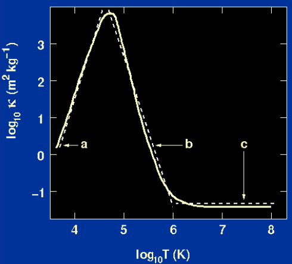

    - At high $T$: most atoms fully ionized, dominant mechanism is electron scattering
        $$
        \kappa=\kappa_0\quad\text{(curve c)}
        $$
    - At low $T$: most atons are not ionized, main mechaisms are bound-bound absorption and bound-free absorption
        $$
        \kappa=\kappa_0\rho^{1/2}T^4\quad\text{(curve a)}
        $$
    - At intermediate $T$: $\kappa$ peaks, Kramers opacity law
        $$
        \kappa=\kappa_0\rho T^{-3.5}\quad\text{(curve b)}
        $$

### Nuclear reactions

5. The binding energy of the atomic nucleus:
    $$
    Q(Z,N)\equiv[Zm_p+Nm_n-m(Z,N)]c^2
    $$
    total binding energy per nucleon
    $$
    \frac{Q(Z,N)}{Z+N}\equiv\frac{Q(Z,N)}{A}
    $$
    where $A$ is the baryon number.

    fusion v.s. fission

    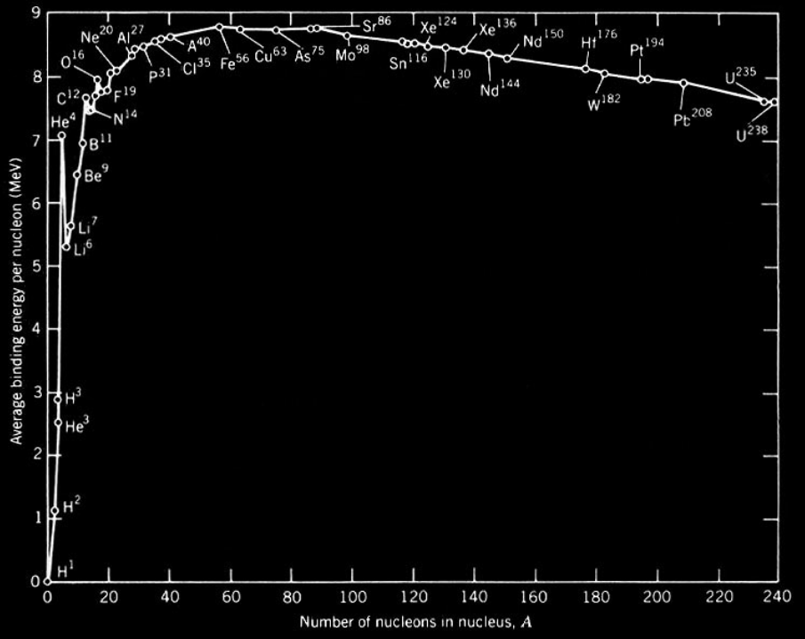

6. The occurrence of fusion reactions

    overcome Coulomb barrier by Quantum Tunnelling
    $$
    P_{\text{fusion}}\propto \exp\left(\frac{-\pi Z_1Z_2e^2}{h\varepsilon_0 v}\right)\exp\left(-\frac{mv^2}{2k_B T}\right)
    $$

    the Gamow peak (Maxwell distribution + tunnelling probability)
    
    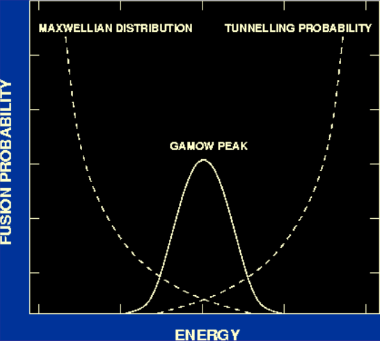

7. Hydrogen burning:

    - p-p chain:

        1. PPI chain ( $1.3\times10^7K$ ):
            $$
            p+p\rightarrow D+e^++\nu_e
            $$
            $$
            D+p\rightarrow ^3\!\!He+\gamma
            $$
            $$
            ^3He+^3\!\!He\rightarrow ^4\!\!He+2p
            $$
        2. PPII chain ( $2.0\times10^7K$ ):
            $$
            ^3He+^4\!\!He\rightarrow^7\!\!Be+\gamma
            $$
            $$
            ^7Be+e^-\rightarrow^7\!\!Li+\nu_e
            $$
            $$
            ^7Li+p\rightarrow^4\!\!He+^4\!\!He
            $$
        3. PPIII chain ( $3\times10^7K$ ):
            $$
            ^7Be+p\rightarrow^8\!\!B+\gamma
            $$
            $$
            ^8B\rightarrow^8\!\!Be+e^++\nu_e
            $$
            $$
            ^8Be\rightarrow 2\ ^4He
            $$
        
        Energy production
        $$
        Q_{\text{p-p}}=[4M(p)-M(^4He)]c^2=26.7\text{ MeV}
        $$

        Neutrino emission:
        - Electron neutrino $\nu_e$
        - Muon neutrino $\nu_\mu$
        - Tau neutrino $\mu_\tau$

        The mean free path of a neutrino $\sim$ many light years, takes $\sim 2$ s from core to surface;

        The mean free path of a photon $\sim10^{-2}$ m, takes $\sim 10^{5}-10^7$ years from core to surface;

        The mean free path of a particle $\sim 10^{-10}$ m.
    
    - CNO cycle

        carbon, nitrogen, oxygen

        $$
        ^{12}C+p\rightarrow^{13}\!\!N+\gamma
        $$
        $$
        ^{13}N\rightarrow^{13}\!\!C+e^++\nu_e
        $$
        $$
        ^{13}C+p\rightarrow^{14}\!\!N+\gamma
        $$
        $$
        ^{14}N+p\rightarrow^{15}\!\!O+\gamma
        $$
        $$
        ^{15}O\rightarrow^{15}\!\!N+e^++\nu_e
        $$
        $$
        ^{15}N+p\rightarrow^{12}\!\!C+^{4}\!\!He
        $$

    the rate of energy production of each
    $$
    \varepsilon_{\text{p-p}}\propto \rho T^4
    $$
    $$
    \varepsilon_{\text{CNO}}\propto \rho T^{16}
    $$

8. Helium burning

    - the triple-$\alpha$ reaction
        $$
        ^4He+^4\!\!He\rightarrow^8\!\!Be
        $$
        $$
        ^8Be+^4\!\!He\rightarrow^{12}\!\!C+\gamma
        $$
    
    the energy released
    $$
    Q_{3\alpha}=[3M(^4He)-M(^{12}C)]c^2=7.275\text{ MeV}
    $$
    the rate of energy production
    $$
    \varepsilon_{3\alpha}\propto \rho^2 T^{40}
    $$

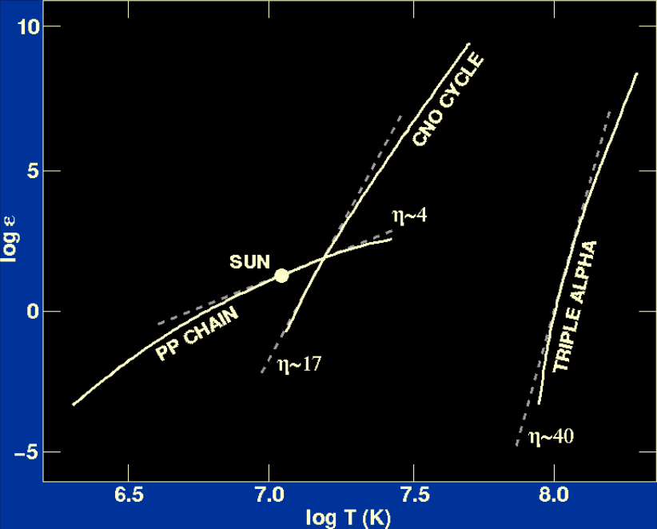

9. Carbon burning ( $5\times10^8K$ )

    Oxygen burning ( $10^9K$ )

    Silicon burning ( $3\times10^9K$ )

::: info Major nuclear burning processes
| Nuclear Fuel | Process | $T_{\text{threshold}}\quad (10^6K)$ | Products | Energy per nucleon (MeV) |
|:---:|:---:|:---:|:---:|:---:|
| H | PP | ~4 | He | 6.55 |
| H | CNO | 15 | He | 6.25 |
| He | 3$\alpha$ | 100 | C,O | 0.61 |
| C | C+C | 600 | O,Ne,Na,Mg | 0.54 |
| O | O+O | 1000 | Mg,S,P,Si | ~0.3 |
| Si | Nuc eq. | 3000 | Co,Fe,Ni | <0.18 |
:::

$$
\varepsilon=\varepsilon_0\rho T^\eta
$$

10. Origin of the elements heavier than Fe:

    the s-process and r-process: the neutron capture reactions proceeds more slowly or rapidly than the competing $\beta$ decays.

    - $\beta$ decay: $n^0\rightarrow p^++e^-+\nu_e$

    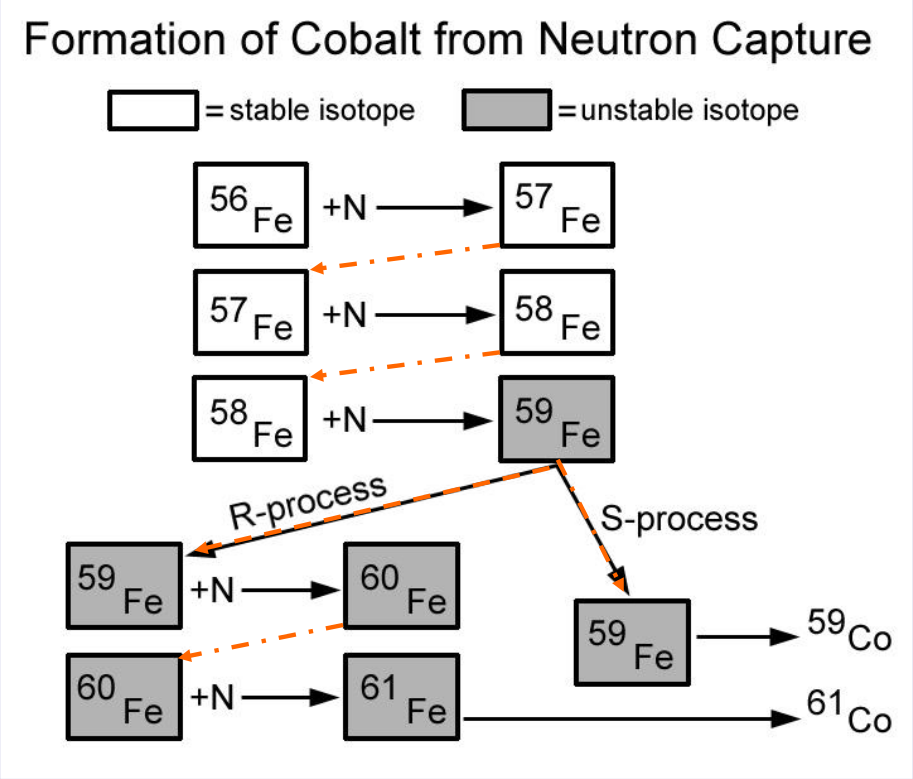

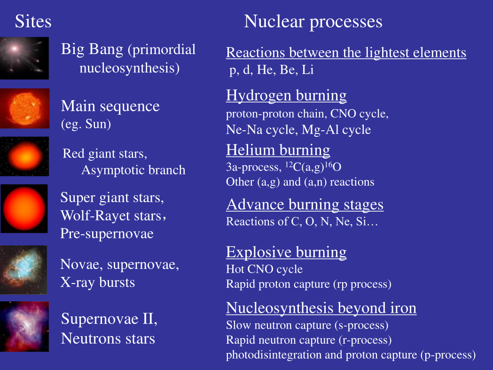

11. Abundances of nuclei:

    percentage of (total number of atoms / total mass (X,Y,Z used above))

## The structure of main-sequence stars

Four stellar structure equations:
$$
    \begin{align}
    \frac{\mathrm{d}r}{\mathrm{d}M}&=\frac{1}{4\pi r^2\rho} \\
    \frac{\mathrm{d}P}{\mathrm{d}M}&=-\frac{GM}{4\pi r^4} \\
    \frac{\mathrm{d}L}{\mathrm{d}M}&=\varepsilon \\
    \frac{\mathrm{d}T}{\mathrm{d}M}&=-\frac{3\kappa L_\text{rad}}{64\pi^2acr^4T^3}
    \end{align}
$$
Three supplements:
$$
\begin{aligned}
P&=\frac{\mathfrak{R}\rho T}{\mu} \\
\kappa &=\kappa_0 \rho^\alpha T^\beta \\
\varepsilon &= \varepsilon_0\rho T^\eta
\end{aligned}
$$

### homologous stellar model

- model:
    $$
    \begin{aligned}
    r&=M_s^{a_1}r^*(m) \\
    \rho&=M_s^{a_2}\rho^*(m) \\
    L&=M_s^{a_3}L^*(m) \\
    T&=M_s^{a_4}T^*(m) \\
    P&=M_s^{a_5}P^*(m)
    \end{aligned}
    $$

    substitute into the four stellar structure equation and the equation of state, and we have
    $$
    \begin{aligned}
    4a_1+a_5&=2 \\
    3a_1+a_2&=1 \\
    a_3&=\eta a_4+a_2+1 \\
    4a_1+(4-\beta)a_4&=\alpha a_2+a_3+1 \\
    a_5&=a_2+a_4
    \end{aligned}
    $$

- $M-L$ and $L-T_e$ relations:

    $$
    L_s\propto M_s^{a_3}
    $$
    $$
    L_s\propto T_s^{4a_3/(a_3-2a_1)}
    $$
    ::: info derivation
    Using
    $$
    \left\{\begin{array}{l}
    r_s\propto M_s^{a_1} \\
    L_s\propto M_s^{a_3}
    \end{array}\right.
    \Rightarrow
    \left\{\begin{array}{l}
    r_s^{1/a_1}\propto M_s \\
    L_s^{1/a_3}\propto M_s
    \end{array}\right.
    \Rightarrow
    r_s\propto L_s^{a_1/a_3}
    $$
    from luminosity - effective temperature relation
    $$
    L_s=4\pi r_s^2\sigma T^4
    $$
    $$
    \Rightarrow L_s^{1-2a_1/a_3}\propto T^4\Rightarrow L_s\propto T^{4a_3/(a_3-2a_1)}
    $$
    :::

### polytropes model

- model:
    $$
    \left\{\begin{array}{l}
    \dfrac{\mathrm{d}P(r)}{\mathrm{d}r}=-\dfrac{GM(r)\rho(r)}{r^2} \\
    P=K\rho^\gamma=K\rho^{(n+1)/n}
    \end{array}\right.
    $$
    $$
    \Rightarrow \frac{1}{\xi^2}\frac{\mathrm{d}}{\mathrm{d}\xi}\left(\xi^2\frac{\mathrm{d}\theta}{\mathrm{d}\xi}\right)=-\theta^n
    $$
    where
    $$
    \xi\equiv \frac{r}{\alpha},\theta^n\equiv\frac{\rho}{\rho_c},\alpha\equiv\sqrt{\frac{(n+1)K}{4\pi G\rho_c^{(n-1)/n}}}
    $$
    This is Lane-Emden equation.
    ::: info derivation
    $$
    \frac{\mathrm{d}P(r)}{\mathrm{d}r}=-\frac{GM(r)\rho(r)}{r^2}
    $$
    $$
    \Rightarrow \frac{\mathrm{d}}{\mathrm{d}r}\left(\frac{r^2}{\rho}\frac{\mathrm{d}P}{\mathrm{d}r}\right)=-G\frac{\mathrm{d}M}{\mathrm{d}r}
    $$
    $$
    \Rightarrow \frac{1}{r^2}\frac{\mathrm{d}}{\mathrm{d}r}\left(\frac{r^2}{\rho}\frac{\mathrm{d}P}{\mathrm{d}r}\right)=-4\pi G\rho
    $$
    using
    $$
    P=K\rho^\gamma=K\rho^{(n+1)/n}
    $$
    $$
    \frac{(n+1)K}{4\pi nG}\frac{1}{r^2}\frac{\mathrm{d}}{\mathrm{d}r}\left(\frac{r^2}{\rho^{(n-1)/n}}\frac{\mathrm{d}\rho}{\mathrm{d}r}\right)=-\rho
    $$
    define two dimensionless variables
    $$
    \xi\equiv\frac{r}{\alpha},\quad\theta^n\equiv\frac{\rho}{\rho_c}
    $$
    $$
    \frac{(n+1)K}{4\pi nG}\frac{1}{\alpha^2\xi^2}\frac{\mathrm{d}}{\mathrm{d}\alpha\xi}\left(\frac{\alpha^2\xi^2}{\rho_c^{(n-1)/n}\theta^{n-1}}\frac{\mathrm{d}\rho_c\theta^n}{\mathrm{d}\alpha\xi}\right)=-\rho_c\theta^n
    $$
    $$
    \Rightarrow \frac{(n+1)K}{4\pi G\rho_c^{(n-1)/n}}\frac{1}{\alpha^2\xi^2}\frac{\mathrm{d}}{\mathrm{d}\xi}\left(\xi^2\frac{\mathrm{d}\theta}{\mathrm{d}\xi}\right)=-\theta^n
    $$
    let
    $$
    \alpha=\sqrt{\frac{(n+1)K}{4\pi G\rho_c^{(n-1)/n}}}
    $$
    $$
    \Rightarrow \frac{1}{\xi^2}\frac{\mathrm{d}}{\mathrm{d}\xi}\left(\xi^2\frac{\mathrm{d}\theta}{\mathrm{d}\xi}\right)=-\theta^n
    $$
    :::
    ::: info analytical solution
    - $n=0$:
    $$
    \theta=1-\frac{\xi^2}{6}
    $$
    - $n=1$:
    $$
    \theta=\frac{\sin\xi}{\xi}
    $$
    - $n=5$:
    $$
    \theta=\frac{1}{\sqrt{1+\xi^2/3}}
    $$
    :::
    ::: info numerical solution
    Lane-Emden equation can be written as
    $$
    \frac{\mathrm{d}^2\theta}{\mathrm{d}\xi^2}=-\frac{2}{\xi}\frac{\mathrm{d}\theta}{\mathrm{d}\xi}-\theta^n
    $$
    step outwards in radius from the centre of the star
    $$
    \left\{\begin{array}{l}
    \theta_{i+1}=\theta_i+\dfrac{\mathrm{d}\theta}{\mathrm{d}\xi}\Delta\xi \\
    \left(\dfrac{\mathrm{d}\theta}{\mathrm{d}\xi}\right)_{i+1}=\left(\dfrac{\mathrm{d}\theta}{\mathrm{d}\xi}\right)_i+\dfrac{\mathrm{d}^2\theta}{\mathrm{d}\xi^2}\Delta\xi=\left(\dfrac{\mathrm{d}\theta}{\mathrm{d}\xi}\right)_i-\left(\dfrac{2}{\xi}\dfrac{\mathrm{d}\theta}{\mathrm{d}\xi}-\theta^n\right)\Delta\xi
    \end{array}\right.
    $$
    $$
    \frac{\mathrm{d}\theta}{\mathrm{d}\xi}=0,\theta=1\quad\text{at }\xi=0
    $$
    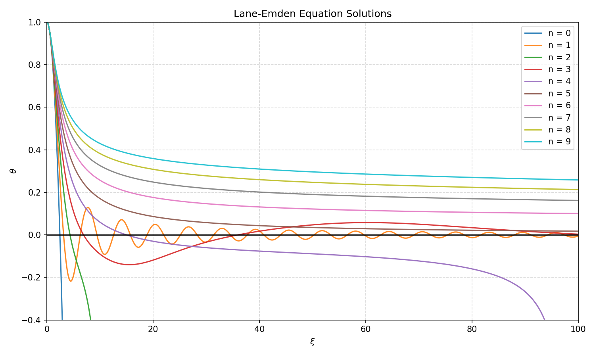
    ::: details python script
    `python` script
    ```py
    import numpy as np
    import matplotlib.pyplot as plt

    def lane_emden_solve(n, xi_max=100.0, dxi=0.001, xi_start=1e-6):
        """
        Solve Lane-Emden equation
        """
        # initial values
        theta = 1.0 - xi_start**2 / 6.0
        phi = -xi_start / 3.0

        xi_list = [xi_start]
        theta_list = [theta]

        # solve by steps
        xi = xi_start
        while xi < xi_max:
            if abs(theta) > 1e100:
                break

            theta_new = theta + phi * dxi

            try:
                power = theta ** n
            except OverflowError:
                break

            phi_new = phi + (- (2.0 / xi) * phi - power) * dxi

            xi += dxi
            theta, phi = theta_new, phi_new

            xi_list.append(xi)
            theta_list.append(theta)

        return np.array(xi_list), np.array(theta_list)

    # solve with n=0,1,2,...,9
    n_values = list(range(10))
    solutions = {}
    for n in n_values:
        xi, theta = lane_emden_solve(n)
        solutions[n] = (xi, theta)

    # plot the results
    fig, ax = plt.subplots(figsize=(10, 6))

    for n in n_values:
        xi, theta = solutions[n]
        ax.plot(xi, theta, label=f'n = {n}', alpha=0.9)

    ax.set_xlim(0, 100)
    ax.set_ylim(-0.4, 1.0)
    ax.set_xlabel(r'$\xi$')
    ax.set_ylabel(r'$\theta$')
    ax.set_title(r"Lane-Emden Equation Solutions")
    ax.legend(loc='upper right')
    ax.axhline(0, linestyle='-', color='black', alpha=0.9)
    ax.grid(True, linestyle='--', alpha=0.5)

    plt.tight_layout()
    plt.savefig('lane_emden.png', dpi=150)
    plt.show()
    ```
    the initial value:
    $$
    \frac{\mathrm{d}^2\theta}{\mathrm{d}\xi^2}+\frac{2}{\xi}\frac{\mathrm{d}\theta}{\mathrm{d}\xi}=-\theta^n
    $$
    as $\xi\rightarrow 0$
    $$
    \theta''(0)+2\theta''(0)=-1
    $$
    $$
    \Rightarrow \theta''(0)=-\frac{1}{3}
    $$
    therefore
    $$
    \theta(\xi)\approx \theta(0)+\theta'(0)\xi+\frac{\theta''(0)}{2!}\xi^2+\cdots\approx 1-\frac{1}{6}\xi^2+\cdots
    $$
    $$
    \theta'(\xi)\approx \theta'(0)+\theta''(0)\xi+\cdots\approx-\frac{1}{3}\xi+\cdots
    $$
    :::

- For $n=1.5$, in the case of non-relativistic degeneracy $P=K_1\rho^{5/3}$
    $$
    M_sR^3=\text{const}
    $$
    For $n=3$, in the case of relativistic degeneracy $P=K_2\rho^{4/3}$ (called the Eddington Standard Model)
    $$
    M_s=5.83\mu_e^{-2}M_\odot
    $$

- Minimum and maximum masses for stars:

    - Clayton's model:
        $$
        \frac{\mathrm{d}P}{\mathrm{d}r}=-\frac{4\pi}{3}G\rho_c^2 r\exp\left(-\frac{r^2}{a^2}\right)
        $$
        $$
        \Rightarrow P(r)=\frac{2\pi}{3}G\rho_c^2 a^2\left[\exp\left(-\frac{r^2}{a^2}\right)-\exp\left(-\frac{R^2}{a^2}\right)\right]
        $$
        $$
        P_c\approx\left[\frac{\pi}{36}\right]^{1/3}GM_s^{2/3}\rho_c^{4/3}
        $$
    - Minimum mass of a main sequence star:
        
        The maximum temperature at the center of a contracting gas cloud reaches the ignition temperature for the thermonuclear fusion of H.
        $$
        M_\text{min}\approx\left(\frac{36}{\pi}\right)^{1/2}\left(\frac{4K_{NR}}{G^2m_H^{8/3}}\right)^{3/4}(kT_{ign})^{3/4}
        $$
        where $K_{NR}$ meaning the non-relativistic $P=K_{NR}n_e^{5/3}$

        $M_\text{min}\sim 0.08 M_\odot$

    - Maximum mass of a main sequence star:

        If radiation becomes the dominant source of the pressure, the star could be easily disrupted.
        $$
        P_g=\frac{\rho_c}{m}kT_c
        $$
        $$
        P_r=\frac{1}{3}aT_c^4
        $$
        denoting the parameter $\beta$:
        $$
        P_g\equiv\beta P_c,\quad P_r\equiv(1-\beta)P_c
        $$
        $$
        P_c=\left(\frac{3}{a}\frac{1-\beta}{\beta^4}\right)^{1/3}\left(\frac{k\rho_c}{m}\right)^{4/3}
        $$
        $$
        \left[\frac{\pi}{36}\right]^{1/3}GM_s^{2/3}=\left(\frac{3}{a}\frac{1-\beta}{\beta^4}\right)^{1/3}\left(\frac{k}{m}\right)^{4/3}
        $$

        the maximum mass of a main sequence star is $\sim 100M_\odot$ by requiring $(1-\beta)$ to be less than $0.5$.

### detailed stellar models

- The model of the Sun:
    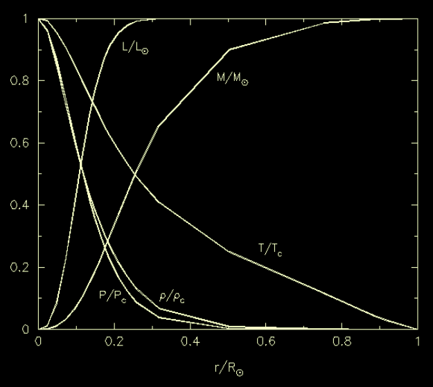
    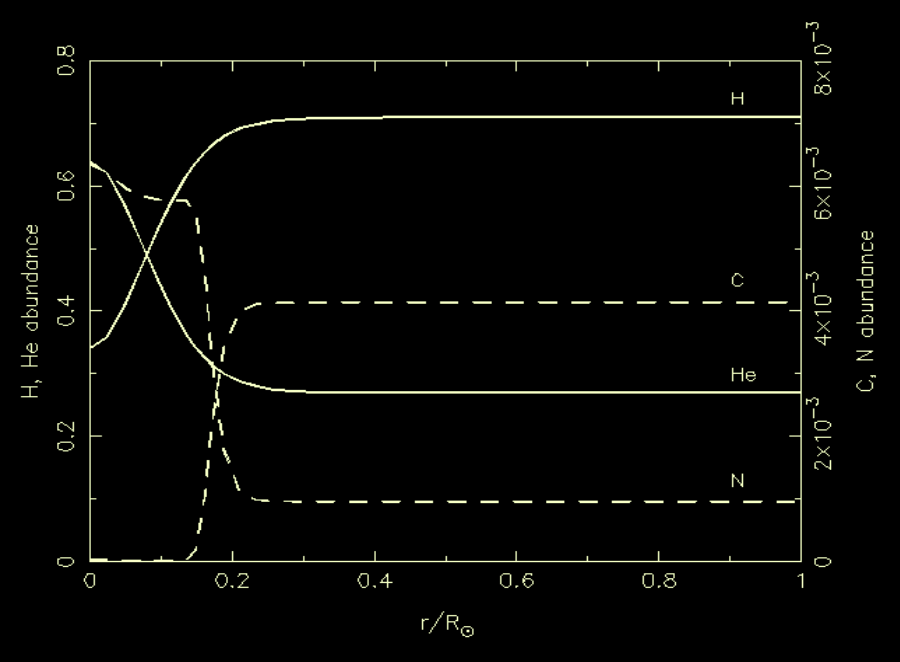

    For different masses: the convective regions
    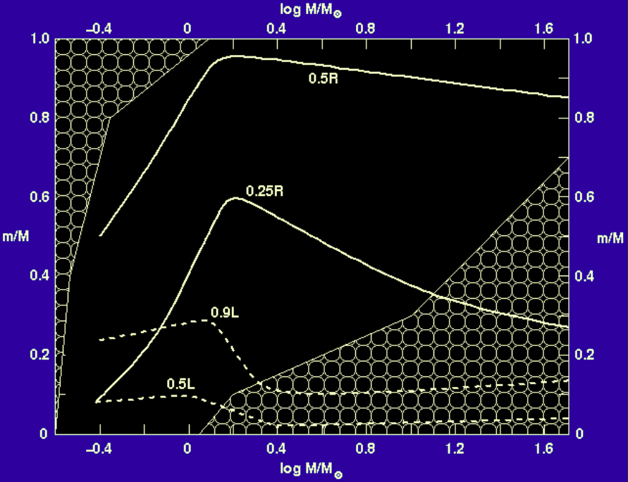

- The five sections on Main-sequence:
    - Brown dwarfs (and planets): $\le0.08M_\odot$ or $\le80M_\text{Jup}$ cannot ignite H.
    - Red dwarfs: $\le0.7M_\odot$ MS lifetime exceeds the present age of the Universe.
    - Low-mass stars: $0.7M_\odot\le M\le 2M_\odot$
    - Intermediate mass stars: $2M_\odot\le M\le 8-10M_\odot$
    - High mass (or massive) stars: $M>8-10M_\odot$

- Geneva models:
    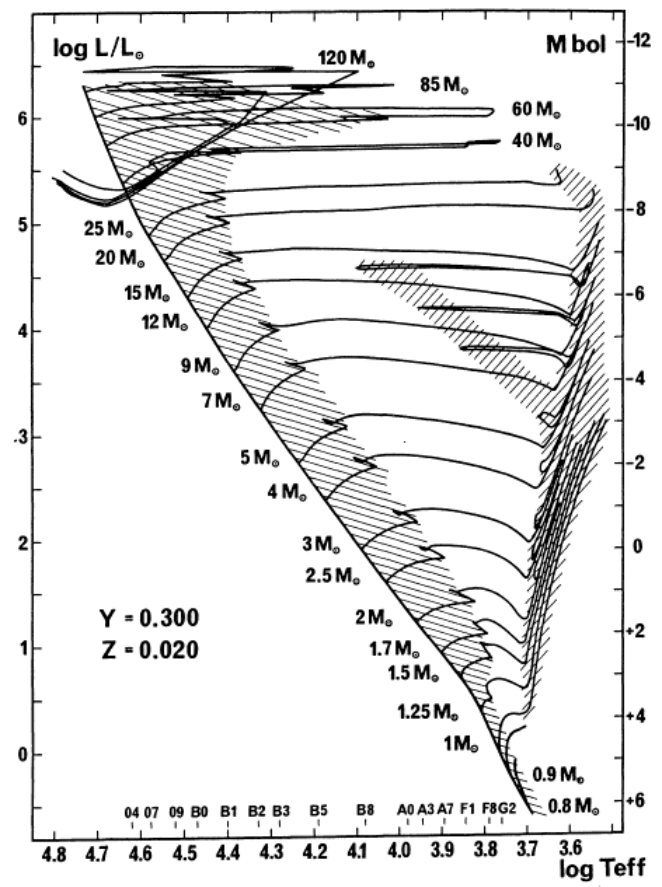

- Convection processes:

    Mixing length theory of convection: mixing length $l$

    $\alpha=\frac{l}{H_p}$ for the Sun $\alpha=1.6$

    Convective overshooting

- Modelling star clusters:

    Isochrones

## The evolution of stars

The general rules of stellar evolution:
1. The Russell-Vogt Theorem: the stellar evolution is mainly determined by the initial stellar mass and the initial chemical composition.
2. The higher the mass, the shorter the lifetime of the star will be.
3. The lower the mass, the higher will be the central density and the lower the central temperature in a given evolutionary phase.
4. The higher the metallicity (keeping the initial He abundance fixed) the lower the luminosity and $T_\text{eff}$ will be, and the longer the evolutionary phases.

### For $1M_\odot$ mass stars

- The main-sequence phase

    H-burning (pp chain)

    the core of the star is radiative

    H-exhaustion, the H-burning continues in a shell around the core, H envelope expands.

- The red-giant phase

    the outer layers reach $5000K$ and the envelopes become fully convective.

    approaches the Hayashi line

    shell H burning

- The He-flash and core He-burning

    He-flash: when the star reaches the tip of RGB.

- The horizontal branch

    Core He burning and shell H burning

- The AGB and thermal pulses

    Asymptotic giant branch: CO-core + shell H/He source -> expansion of the envelop

    When the star moves to the tip of AGB, shell He flash -> stellar pulsation (thermal pulses) -> throw out the envelope of AGB -> planetary nebulae + very hot electron degeneracy CO core

- Planetary nebula

- White dwarf:

    CO core collapsed as a white drawf

### For massive stars

1. For high-mass stars ($M>\sim 8M\odot$):

    - Main sequence: core hydrogen burning with a well-mixed convective core
    - Post-Main sequence: core hydrogen exhaustion -> overall stellar contraction (causing a "hook" to the left in the HR diagram) -> ignition of a hydrogen-burning shell -> envelope expansion -> star becomes a red supergiant (RSG)
    - Advenced burning: the non-degenerate core undergoes successive nuclear fusion stages: Helium -> Carbon -> Neon -> Oxygen -> Silicon burning, building an "onion-skin" structure
    - Final Fate: Formation of an iron core. Once the core exceeds the Chandrasekhar limit ($\sim 1.4M_\odot$), it collapses, leading to a Type II supernova explosion. The remnant is a neutron star (if core mass $<\sim 3M_\odot$) or a black hole (if core mass $>\sim 3M_\odot$)

2. Differences for stars of moderate mass ($\sim 1.5-6M_\odot$)

    - the Schönberg-Chandrasekhar limit: when the isothermal helium core reaches $\sim10-15\%$ of the star's mass, it can no longer support itself, triggering a rapid core contraction and envelope expansion.
    - the Hertzsprung gap

3. Differences for super-massive stars ($15M_\odot-25M_\odot$)

    - the electrons in their cores do not become degenrate until the final burning stages, when iron core is reached
    - mass-loss: stellar wind
    - the luminosity remains approximately constant in spite of internal changes
    - Wolf-Rayet stars ($>20M_\odot$): O main-sequence star -> blue supergiant -> red supergiant -> WR star

- Eddington luminosity:

    the theoretical limit at which the radiation pressure exceed the body's gravitational attraction, i.e., a body emitting radiation at greater than the Eddington luminosity would break up from its own photon pressure.

    the radiation pressure
    $$
    P_\text{rad}=\frac{1}{3}aT^4
    $$
    $$
    \mathrm{d}P_\text{rad}=\frac{4}{3}aT^3\mathrm{d}T=\frac{4}{3}aT^3\left(-\frac{3\kappa L}{64\pi^2acr^4T^3}\mathrm{d}M\right)
    $$

    the gravitational pressure
    $$
    \mathrm{d}P=-\frac{GM}{4\pi r^4}\mathrm{d}M
    $$

    the Eddington limit
    $$
    \frac{\mathrm{d}P_\text{rad}}{\mathrm{d}P}=\frac{\kappa L}{4\pi cGM}<1
    $$
    $$
    \Rightarrow L<\frac{4\pi cGM}{\kappa}
    $$
    $$
    L_\text{Edd}=\frac{4\pi cGM}{\kappa}=3.2\times 10^4\left(\frac{M}{M_\odot}\right)\left(\frac{\kappa_\text{es}}{\kappa}\right)L_\odot
    $$

- The initial mass function

    - the number of stars formed at a given time, volume, with masses in the range $(m,m+\mathrm{d}m)$ as a function solely of $m$.
        $$
        \mathrm{d}n=\Phi(m)\mathrm{d}m
        $$
        $$
        \Phi(m)\propto m^{-2.35}
        $$
    
    - amount of mass locked up in stars with masses in the interval $(m,m+\mathrm{d}m)$
        $$
        m\mathrm{d}n=\zeta(m)\mathrm{d}m
        $$
        $$
        \zeta(m)\propto m^{-1.35}
        $$

### White dwarfs, neutron stars and black holes

1. white dwarfs

    - luminosity & spectra: intrinsically faint, hot stars
    - structure: isothemal degenerate C/O core + thin non-degenerate surface layer of H or He
    - The Chandrasekhar mass
    - Observed mass-radius relation
