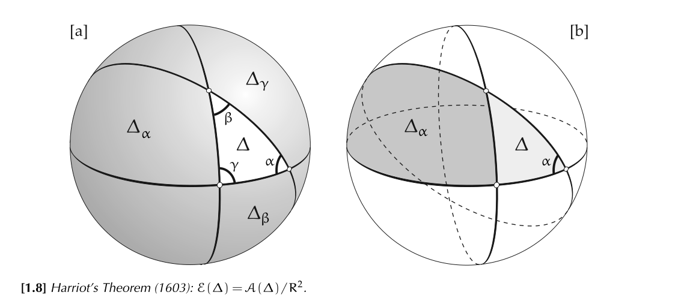
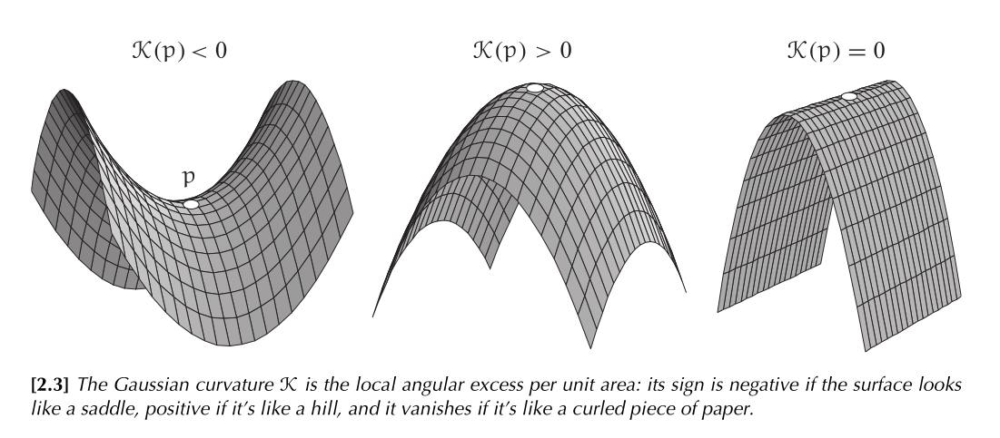
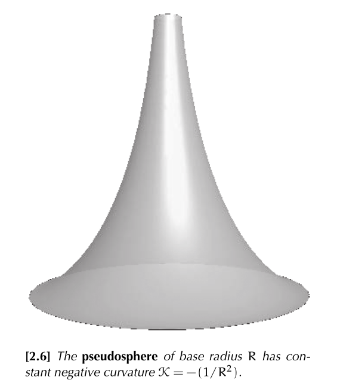
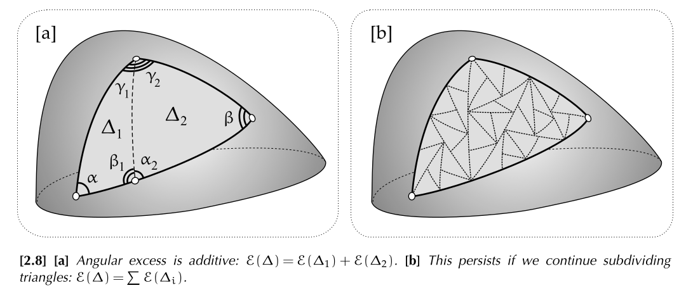
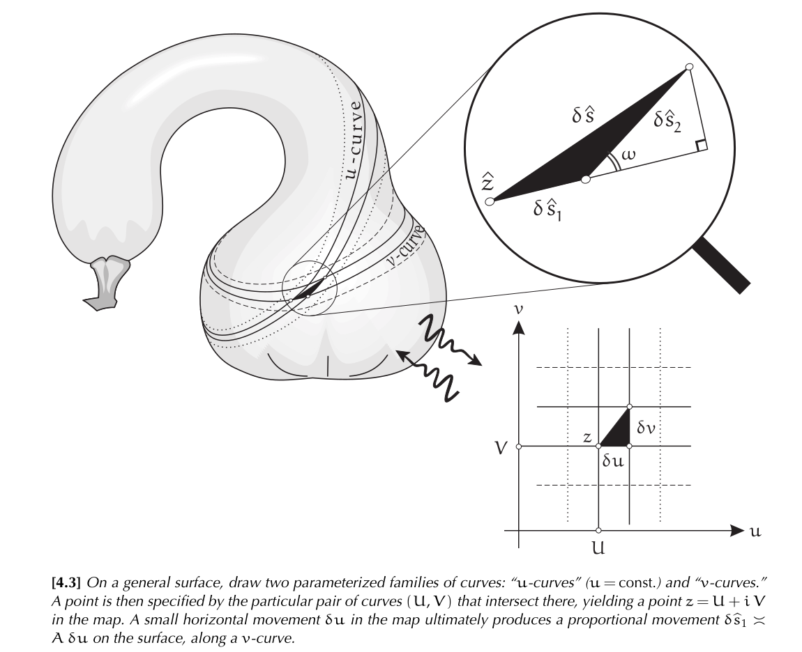

# 微分几何

主要参考 Visual Differential Geometry and Forms (A mathematical drama in five acts)

## The Nature of Space

### Euclidean and Non-Euclidean Geometry

- (Euclidean Geometry) Parallel Axiom:

  Through any point $p$ not on the line $L$ there exists precisely one line $P$ that is parallel to $L$.

- (Hyperbolic Geometry) Hyperbolic Axiom:

  There are at least two parallel lines through $p$ that do not meet $L$.

- (Spherical Geometry) Spherical Axiom:

  There are no lines through $p$ that are parallel to $L$: every line meets $L$.

- Angular Excess: $\mathcal{E}=$ (angular sum of triangle) $-\pi$

- Intrinsic v.s. Extrinsic geometry

- Geodesic: (1) the shortest route between two points that are not too far apart; (2) the "straightest" route.

  To construct a geodesic on a surface, emanating from a point $p$ in direction $\vec{v}$, stick one end of a length of narrow sticky tape down at $p$ and unroll it onto the surface, starting in the direction $\vec{v}$.

- $$
  \mathcal{E}(\Delta)=\mathcal{K}\mathcal{A}(\Delta)
  $$
  $\mathcal{K}=+(1/R^2)$ in Spherical Geometry;

  $\mathcal{K}=-(1/R^2)$ in Hyperbolic Geometry.

### Gaussian Curvature

- $$
  \mathcal{K}(p)=\lim_{\Delta_p\rightarrow p}\frac{\mathcal{E}(\Delta_p)}{\mathcal{A}(\Delta_p)}
  $$

- $$
  \mathcal{K}\asymp\frac{3}{\pi}\left[\frac{2\pi r-\mathcal{C}(r)}{r^3}\right]
  $$
  $$
  \mathcal{K}\asymp\frac{12}{\pi}\left[\frac{\pi r^2-\mathcal{A}(r)}{r^4}\right]
  $$

- pseudospherical (constant negative curvature)

  pseudosphere

  

- Local Gauss-Bonnet Theorem:
  $$
  \mathcal{E}(\Delta)=\alpha+\beta+\gamma-\pi=\iint_\Delta \mathcal{K}\mathrm{d}\mathcal{A}
  $$

  

## The Metric

### Mapping Surfaces: The Metric

- Metric: the rule giving $\delta\hat{s}$ in terms of $\delta z$
  $$
  \mathrm{d}\hat{s}=\Lambda(z,\gamma)\mathrm{d}s
  $$

- The general metric formula for a general surface is
  $$
  \mathrm{d}\hat{s}^2=\mathcal{A}^2\mathrm{d}u^2+\mathcal{B}^2\mathrm{d}v^2+2\mathcal{A}\mathcal{B}\cos\omega\,\mathrm{d}u\mathrm{d}v
  $$
  $$
  \mathcal{A}\equiv\left(\frac{\partial\hat{s}_1}{\partial u}\right),\quad 
  \mathcal{B}\equiv\left(\frac{\partial\hat{s}_2}{\partial v}\right)
  $$

- $$
  \mathcal{K}=-\frac{1}{\mathcal{A}\mathcal{B}}\left(\partial_v\left[\frac{\partial_v\mathcal{A}}{\mathcal{B}}\right]+\partial_u\left[\frac{\partial_u\mathcal{B}}{\mathcal{A}}\right]\right)
  $$

- Conformal: preserves the magnitude and sense (anticlockwise or clockwise) of angles

  Anticonformal: preserves the magnitude but reverses the sense

- Conformal map $\Leftrightarrow\mathrm{d}\hat{s}=\Lambda(z)\mathrm{d}s$

- Conformal / Isothermal coordinates: $\mathcal{A}=\mathcal{B}=\Lambda$
