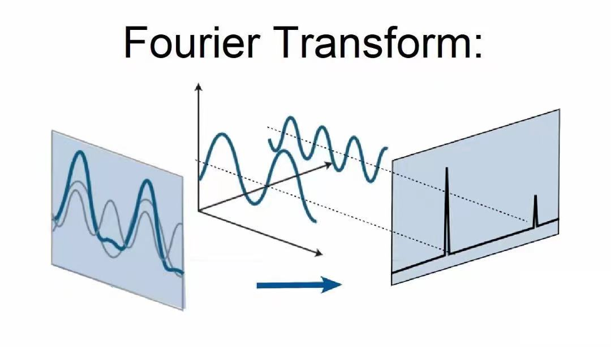
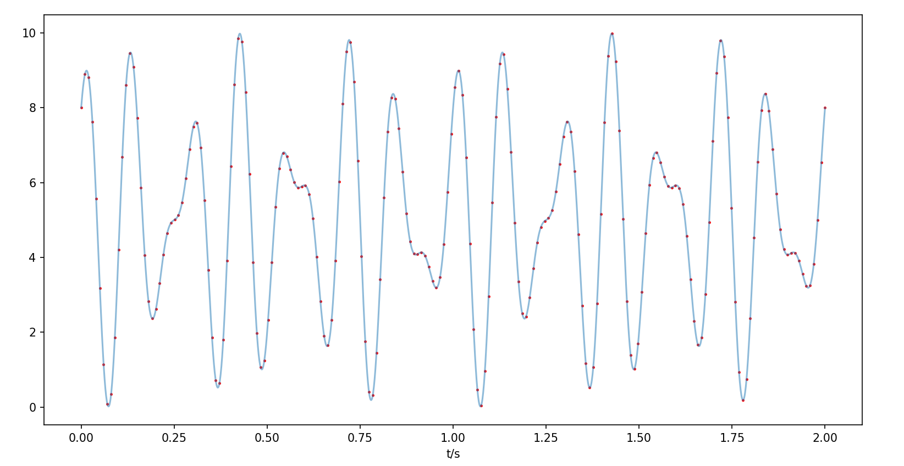
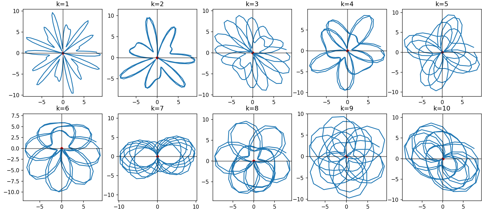
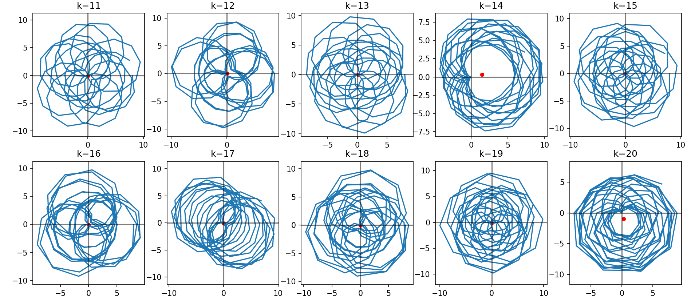
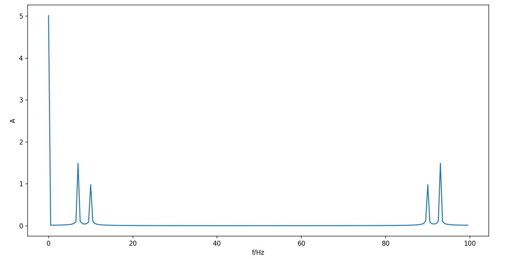

# 傅里叶变换

## 傅里叶变换

### 定义

对于函数 $f(t)$ ，定义其傅里叶变换（FT）为

$$
F(k)=\mathcal{F}[f(t)]=\int_{-\infty}^\infty f(t)e^{-ikt}\mathrm{d}t
$$

逆傅里叶变换为

$$
f(t)=\mathcal{F}^{-1}[F(k)]=\frac{1}{2\pi}\int_{-\infty}^\infty F(k)e^{ikt}\mathrm{d}k
$$

::: info why?
由傅里叶级数：
$$
f(x)=\frac{a_0}{2}+\sum_{n=1}^\infty\left(a_n\cos(\frac{n\pi}{l}x)+b_n\sin(\frac{n\pi}{l}x)\right)
$$
$$
a_n=\frac{1}{l}\int_{-l}^l f(x)\cos(\frac{n\pi}{l}x)\mathrm{d}x, \quad n=0,1,2,...
$$
$$
b_n=\frac{1}{l}\int_{-l}^l f(x)\sin(\frac{n\pi}{l}x)\mathrm{d}x, \quad n=1,2,3,...
$$
转成复数形式：
$$
f(x)=\sum_{n=-\infty}^\infty c_ne^{i\frac{n\pi}{l}x}
$$
$$
c_n=\left\{\begin{array}{ll}
\dfrac{a_n}{2}-\dfrac{b_n}{2i} & n<0 \\
\dfrac{a_0}{2} & n=0 \\
\dfrac{a_n}{2}+\dfrac{b_n}{2i} & n>0
\end{array}\right. \quad= \frac{1}{2l}\int_{-l}^l f(x)e^{-i\frac{n\pi}{l}x}\mathrm{d}x
$$
当 $l\rightarrow\infty$ 时，上式化为
$$
f(x)=\frac{1}{2\pi}\int_{-\infty}^\infty\left[\int_{-\infty}^\infty f(x)e^{-ikx}\mathrm{d}x\right]e^{ikx}\mathrm{d}k
$$
:::

### 物理意义

由上面可以看出傅里叶变换的物理意义：把时域的信号 $f(t)$ 转为频域的频谱 $F(k)$ 。

- 振幅谱 $|F(k)|=\sqrt{\mathrm{Re}^2(k)+\mathrm{Im}^2(k)}$
- 相位谱 $\varphi(k)=\arctan\dfrac{\mathrm{Im}(k)}{\mathrm{Re}(k)}$



### 性质

$$
f(t)\leftrightarrow F(\omega)
$$

1. 线性叠加定理：
$$
\sum_{k}a_kf_k(t)\leftrightarrow\sum_{k}a_kF_k(\omega)
$$

2. 对称定理：
$$
F(-t)\leftrightarrow 2\pi f(\omega)
$$

3. 时延定理：
$$
f(t-t_0)\leftrightarrow e^{-i\omega t_0}F(\omega)
$$

4. 频移定理：
$$
F(\omega\pm\omega_0)\leftrightarrow f(t)e^{\mp i\omega_0 t}
$$

5. 标度定理：
$$
f(at)\leftrightarrow\frac{1}{|a|}F(\frac{\omega}{a})
$$

6. 微分定理：
$$
\frac{\mathrm{d}^nf(t)}{\mathrm{d}t^n}\leftrightarrow(i\omega)^nF(\omega)
$$
$$
\frac{\mathrm{d}^nF(\omega)}{\mathrm{d}\omega^n}\leftrightarrow(-it)^nf(t)
$$

## 离散傅里叶变换

### 定义

对于一组离散的数据 $(x_j,f_j)$ 其中 $\left\{x_j=\dfrac{2\pi}{N}j,\ j=0,1,2,...,N-1\right\}$

则离散傅里叶变换（DFT）为
$$
c_k=\frac{1}{N}\sum_{j=0}^{N-1}f_je^{-ik\frac{2\pi}{N}j},\quad k=0,1,2,...,N-1
$$

反变换为
$$
f_j=\sum_{k=0}^{N-1}c_ke^{ik\frac{2\pi}{N}j},\quad j=0,1,2,...,N-1
$$

### 理解

我们以信号 $f(t)=5+3\cos(2\pi\cdot 7t)+2\sin(2\pi\cdot 10t)$ （采样时长 $L=2s$ ，采样频率 $fs=100Hz$）为例：



::: details `python`脚本
```py
import numpy as np
import matplotlib.pyplot as plt

L = 2
fs = 100
t = np.linspace(0, L, L*fs)
f = 5 + 3 * np.cos(2 * np.pi * 7 * t) + 2 * np.sin(2 * np.pi * 10 * t)

x = np.arange(0, L+0.001, 0.001)
y = 5 + 3 * np.cos(2 * np.pi * 7 * x) + 2 * np.sin(2 * np.pi * 10 * x)

plt.plot(x, y, alpha=0.5)
plt.scatter(t, f, c='r', s=2, alpha=0.9)
plt.xlabel('t/s')
plt.show()
```
:::

先把采样时间 $t_j\in[0s,2s]$ 映射到区间 $x_j\in[0,2\pi]$ ，即 $\left\{x_j=\dfrac{2\pi}{N}j,\ j=0,1,2,...,N-1\right\}$ （其中 $N=L\cdot fs$ 为采样数）

复数序列 $f(x_j)e^{-ikx_j},\ k=0,1,2,...,N-1$ 在复平面是一个绕原点顺时针旋转的向量，向量终端到原点的距离为 $f(x_j)$ ，在经过时间 $L$ 后向量绕原点转了 $k$ 圈（向量的旋转频率 $\omega=k/L$ ）。

绘制出 $k=1,2,...,20$ 的图像（蓝色线为复数向量终端在复平面经过的路径，红色点为蓝色线的质心即 $c_k$）




::: details `python`脚本
```py
import numpy as np
import matplotlib.pyplot as plt

L = 2
fs = 100
t = np.linspace(0, L, L*fs)
N = L * fs
x = 2 * np.pi * np.arange(0, N, 1) / N
y = 2 * np.sin(2 * np.pi * 10 * t) + 3 * np.cos(2 * np.pi * 7 * t) + 5
k = np.arange(1, 11, 1)
# k = np.arange(11, 21, 1)
ax1 = plt.subplot(251)
ax2 = plt.subplot(252)
ax3 = plt.subplot(253)
ax4 = plt.subplot(254)
ax5 = plt.subplot(255)
ax6 = plt.subplot(256)
ax7 = plt.subplot(257)
ax8 = plt.subplot(258)
ax9 = plt.subplot(259)
ax10 = plt.subplot(2,5,10)
axs = [ax1, ax2, ax3, ax4, ax5, ax6, ax7, ax8, ax9, ax10]

for i in range(10):
    y_complex = y * np.exp(-1j*k[i]*x)
    axs[i].plot(y_complex.real, y_complex.imag)
    axs[i].scatter(y_complex.real.mean(), y_complex.imag.mean(), s=20, c='r')
    axs[i].axvline(0, color='black', alpha=0.5)
    axs[i].axhline(0, color='black', alpha=0.5)
    axs[i].axis('equal')
    axs[i].set_title(f'k={k[i]}')

plt.show()
```
:::

可以发现，只有当向量旋转频率 $\omega=k/L$ 与信号的本征频率 $f=7,10$ 相等时，质心才偏离原点，且偏离距离与该频率分量的振幅成正比。即我们可以用复数 $c_k=\frac{1}{N}\sum_{j=0}^{N-1}f_je^{-ik\frac{2\pi}{N}j},$ $k=0,1,2,...,N-1$ 的模长来代表原信号里 $\omega=k/L$ 频率成分的振幅。

所以我们绘制出 $|c_k|-\omega$ 的图像：


::: details `python`脚本
```py
import numpy as np
import matplotlib.pyplot as plt

L = 2
fs = 100
t = np.linspace(0, L, L*fs)
f = 5 + 3 * np.cos(2 * np.pi * 7 * t) + 2 * np.sin(2 * np.pi * 10 * t)
N = L * fs
x = 2 * np.pi * np.arange(0, N, 1) / N
fft_y = []
fre = []

for k in range(N):
    ck = 0
    for i in range(N):
        ck += f[i]*np.exp(-1j*k*x[i])
    ck = ck / N
    fft_y.append(np.abs(ck))
    fre.append(k / L)

plt.plot(fre, fft_y)
plt.xlabel('f/Hz')
plt.ylabel('A')
plt.show()
```
:::

其中 $\omega=0$ 代表原信号里的直流部分，并且所有本征频率 $\omega$ 的振幅平分给了对称的两个频率 $\omega,fs-\omega$

::: info 参考
3Blue1Brown 的 B站视频 [【【官方双语】形象展示傅里叶变换】](https://www.bilibili.com/video/BV1pW411J7s8/?share_source=copy_web&vd_source=ede02f78f47ab0bc6f94ed4bd2c49ece)
:::

## 快速傅里叶变换

离散傅里叶变换（DFT）输入数据 $\{x_k\}_0^{N-1}$ 输出复数序列 $\{c_j\}_0^{N-1}$ 
$$
c_j=\sum_{k=0}^{N-1}x_k\omega_N^{kj},\quad j=0,1,2,...,N-1
$$
其中
$$
\omega_N=e^{i\frac{2\pi}{N}}=\cos\frac{2\pi}{N}+i\sin\frac{2\pi}{N}
$$

该算法的时间复杂度为 $O(N^2)$ ，当数据量 $N$ 增大时，计算量迅速增加。直到 1965 年产生了快速算法 FFT ，大大提高计算速度，才使 DFT 得到更广泛的应用。

### FFT算法

当 $N=2^p$ 时， $\omega_N^{jk}$ 只有 $N/2$ 个不同的值。
$$
c_j=\sum_{k=0}^{N/2-1}x_k\omega_N^{jk}+\sum_{k=0}^{N/2-1}x_{N/2+k}\omega_N^{j(N/2+k)}=\sum_{k=0}^{N/2-1}\left[x_k+(-1)^jx_{N/2+k}\right]\omega_N^{jk}
$$
依下标奇偶分别考察，有
$$
c_{2j}=\sum_{k=0}^{N/2-1}(x_k+x_{N/2+k})\omega_{N/2}^{jk}
$$
$$
c_{2j+1}=\sum_{k=0}^{N/2-1}(x_k-x_{N/2+k})\omega_N^k\omega_{N/2}^{jk}
$$
令
$$
y_k=x_k+x_{N/2+k},\quad y_{N/2+k}=(x_k-x_{N/2+k})\omega_N^k
$$
则可将 $N$ 点 DFT 二分为两个 $N/2$ 点 DFT：
$$
\left\{\begin{array}{l}
c_{2j}=\sum_{k=0}^{N/2-1}y_k\omega_{N/2}^{jk}, \\
c_{2j+1}=\sum_{k=0}^{N/2-1}y_{N/2+k}\omega_{N/2}^{jk},
\end{array}\right.\quad j=0,1,2,...,N/2-1
$$
该算法的时间复杂度为 $O(N\log N)$

### 实例

下面以 $N=2^3$ 为例，说明 FFT 算法。

$k,j=0,1,2,...,7$ ，将 $\omega_N=\omega_8$ 记为 $\omega$ ，于是
$$
c_j=\sum_{k=0}^7x_k\omega^{jk}, \quad j=0,1,2,...,7
$$
将 $k,j$ 用二进制表示为
$$
k=k_22^2+k_12^1+k_02^0=(k_2k_1k_0)
$$
$$
j=j_22^2+j_12^1+j_02^0=(j_2j_1j_0)
$$
有
$$
c_j=c(j_2j_1j_0),\quad x_k=x(k_2k_1k_0)
$$
故
$$
\begin{align}
c(j_2j_1j_0)&=\sum_{k_0=0}^1\sum_{k_1=0}^1\sum_{k_2=0}^1x(k_2k_1k_0)\omega^{(k_2k_1k_0)(j_22^2+j_12^1+j_02^0)} \\
&=\sum_{k_0=0}^1\left\{\sum_{k_1=0}^1\left[\sum_{k_2=0}^1x(k_2k_1k_0)\omega^{j_0(k_2k_1k_0)}\right]\omega^{j_1(k_1k_00)}\right\}\omega^{j_2(k_000)}
\end{align}
$$
引入记号
$$
\left.\begin{array}{l}
A_0(k_2k_1k_0)=x(k_2k_1k_0), \\
A_1(k_1k_0j_0)=\sum_{k_2=0}^1A_0(k_2k_1k_0)\omega^{j_0(k_2k_1k_0)}, \\
A_2(k_0j_1j_0)=\sum_{k_1=0}^1A_1(k_1k_0j_0)\omega^{j_1(k_1k_00)}, \\
A_3(j_2j_1j_0)=\sum_{k_0=0}^1A_2(k_0j_1j_0)\omega^{j_2(k_000)},
\end{array}\right\}
$$
进一步得到他们的递推关系如下表：

|单元码号|$\begin{array}{c}0\\000\end{array}$|$\begin{array}{c}1\\001\end{array}$|$\begin{array}{c}2\\010\end{array}$|$\begin{array}{c}3\\011\end{array}$|$\begin{array}{c}4\\100\end{array}$|$\begin{array}{c}5\\101\end{array}$|$\begin{array}{c}6\\110\end{array}$|$\begin{array}{c}7\\111\end{array}$|
|:--:|:--:|:--:|:--:|:--:|:--:|:--:|:--:|:--:|
| | | | | |$\omega^0=1$|$\omega^1$|$\omega^2$|$\omega^3$|
|$x_k=A_0(k)$|$A_0(0)$|$A_0(1)$|$A_0(2)$|$A_0(3)$|$A_0(4)$|$A_0(5)$|$A_0(6)$|$A_0(7)$|
|$A_1$|$A_0(0)+$$A_0(4)$|$[A_0(0)-$$A_0(4)]\omega^0$|$A_0(1)+$$A_0(5)$|$[A_0(1)-$$A_0(5)]\omega^1$|$A_0(2)+$$A_0(6)$|$[A_0(2)-$$A_0(6)]\omega^2$|$A_0(3)+$$A_0(7)$|$[A_0(3)-$$A_0(7)]\omega^3$|
|$A_2$|$A_1(0)+$$A_1(4)$|$A_1(1)+$$A_1(5)$|$[A_1(0)-$$A_1(4)]\omega^0$|$[A_1(1)-$$A_1(5)]\omega^0$|$A_1(2)+$$A_1(6)$|$A_1(3)+$$A_1(7)$|$[A_1(2)-$$A_1(6)]\omega^2$|$[A_1(3)-$$A_1(7)]\omega^2$|
|$c_j=A_3(j)$|$(0)+(4)$|$(1)+(5)$|$(2)+(6)$|$(3)+(7)$|$(0)-(4)$|$(1)-(5)$|$(2)-(6)$|$(3)-(7)$|

从上表可见，计算全部 $8$ 个 $c_j$ 只用 $8$ 次乘法和 $24$ 次加法运算。

### 改进的FFT算法

推广到 $N=2^p$ 的情形，一般的 FFT 计算公式如下：
$$
\left\{\begin{array}{l}
A_q(k2^q+j)=A_{q-1}(k2^{q-1}+j)+A_{q-1}(k2^{q-1}+j+2^{p-1}), \\
A_q(k2^q+j+2^{q-1})=[A_{q-1}(k2^{q-1}+j)-A_{q-1}(k2^{q-1}+j+2^{p-1})]\omega^{k2^{q-1}},
\end{array}\right.
$$

该公式总共要算 $(p-1)N/2$ 次复数乘法，比一般的 FFT 的计算量（ $pN$ 次乘法）也快一倍。

