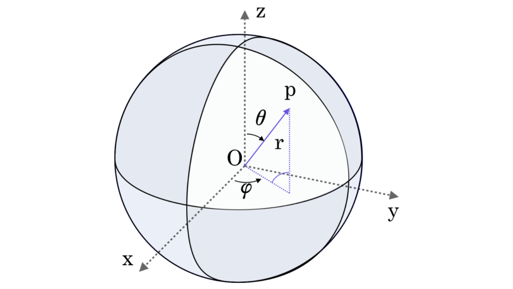

# 向量微分算符在柱坐标和球坐标下的公式

利用度规简单推导出向量微分算符(Nabla算符)
$$\nabla = \left( \frac{\partial}{\partial x} \quad \frac{\partial}{\partial y} \quad \frac{\partial}{\partial z} \right)$$
在极坐标和球坐标下的公式。

## 柱坐标下的向量微分算符

柱坐标变换

$$
\left\{
\begin{align}
x&=r\cos\theta \\
y&=r\sin\theta \\
z&=z
\end{align}
\right.
$$

在极坐标$(r,\theta)$下，微元

$$
\begin{align}
(ds)^2&= (dx)^2+(dy)^2+(dz)^2 \\
&= (\cos\theta dr+r\sin\theta d\theta)^2+(\sin\theta dr-r\cos\theta d\theta)^2+(dz)^2 \\
&=(dr)^2+r^2(d\theta)^2+(dz)^2
\end{align}
$$

故度规张量在极坐标下的矩阵形式为
$$
G=\left[
\begin{array}{ccc}
1 & 0 & 0\\
0 & r^2 & 0\\
0 & 0 & 1
\end{array}
\right]
$$

于是向量微分算符
$$
\nabla = \sum_i \frac{1}{\sqrt{g_{ii}}} \frac{\partial}{\partial e_i} \hat{e_i} = \frac{\partial}{\partial r} \hat{r} + \frac{1}{r} \frac{\partial}{\partial \theta} \hat{\theta} + \frac{\partial}{\partial z} \hat{z}
$$

::: warning
注意在其他坐标系下求散度(div)不是简单地将 $\nabla$ 和矢量 $\vec{V}$ 进行点乘。

具体求法见[正交曲面坐标系](/blog/math/metric)的微分算符部分。
:::

度规系数
$$
h_1=1,\quad h_2=r,\quad h_3=1
$$

微分算符表达式
$$
\nabla\psi=\frac{\partial\psi}{\partial r}\hat{r}+\frac{1}{r}\frac{\partial\psi}{\partial\theta}\hat{\theta}+\frac{\partial\psi}{\partial z}\hat{z}
$$
$$
\nabla\cdot\vec{f}=\frac{1}{r}\frac{\partial}{\partial r}(rf_r)+\frac{1}{r}\frac{\partial f_\psi}{\partial\theta}+\frac{\partial f_z}{\partial z}
$$
$$
\nabla\times\vec{f}=\frac{1}{r} \left|
    \begin{array}{ccc}
    \hat{r} & r\hat{\theta} & \hat{z} \\
    \frac{\partial}{\partial r} & \frac{\partial}{\partial \theta} & \frac{\partial}{\partial z} \\
    f_r & rf_\theta & f_z
    \end{array} \right|
$$
$$
\nabla^2\psi=\frac{1}{r}\frac{\partial}{\partial r}\left(r\frac{\partial\psi}{\partial r}\right)+\frac{1}{r^2}\frac{\partial^2\psi}{\partial\theta^2}+\frac{\partial^2\psi}{\partial z^2}
$$

## 球坐标下的向量微分算符

同上易得度规张量在球坐标$(r,\theta,\varphi)$下的矩阵形式，
各个坐标如下：

$$
G=\left[
\begin{array}{ccc}
1 & 0 & 0\\
0 & r^2 & 0\\
0 & 0 & r^2\sin^2\theta
\end{array}
\right]
$$

微分向量算符
$$
\nabla = \sum_i\frac{1}{\sqrt{g_{ii}}}\frac{\partial}{\partial e_i}\hat{e_i} = \frac{\partial}{\partial r} \hat{r}+\frac{1}{r}\frac{\partial}{\partial \theta} \hat{\theta}+\frac{1}{r\sin\theta}\frac{\partial}{\partial \varphi} \hat{\varphi}
$$

度规系数
$$
h_1=1,\quad h_2=r,\quad h_3=r\sin\theta
$$

微分算符表达式
$$
\nabla\psi=\frac{\partial\psi}{\partial r}\hat{r}+\frac{1}{r}\frac{\partial\psi}{\partial\theta}\hat{\theta}+\frac{1}{r\sin\theta}\frac{\partial\psi}{\partial\phi}\hat{\phi}
$$
$$
\nabla\cdot\vec{f}=\frac{1}{r^2}\frac{\partial}{\partial r}(r^2f_r)+\frac{1}{r\sin\theta}\frac{\partial}{\partial\theta}(\sin\theta f_\theta)+\frac{1}{r\sin\theta}\frac{\partial f_\phi}{\partial\phi}
$$
$$
\nabla\times\vec{f}=\frac{1}{r^2\sin\theta}\left|
    \begin{array}{ccc}
    \hat{r} & r\hat{\theta} & r\sin\theta\hat{\phi} \\
    \frac{\partial}{\partial r} & \frac{\partial}{\partial\theta} & \frac{\partial}{\partial\phi} \\
    f_r & rf_\theta & r\sin\theta f_\phi
    \end{array}\right|
$$
$$
\nabla^2\psi=\frac{1}{r^2}\frac{\partial}{\partial r}\left(r^2\frac{\partial\psi}{\partial r}\right)+\frac{1}{r^2\sin\theta}\frac{\partial}{\partial\theta}\left(\sin\theta\frac{\partial\psi}{\partial\theta}\right)+\frac{1}{r^2\sin^2\theta}\frac{\partial^2\psi}{\partial\phi^2}
$$
