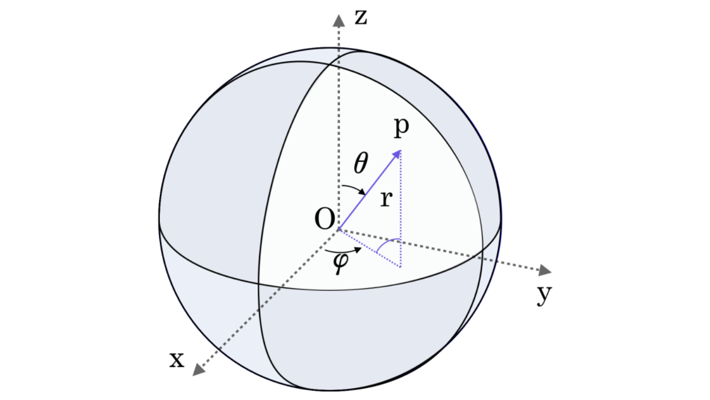

# 向量微分算符在极坐标和球坐标下的表达式

利用度规简单推导出向量微分算符(Nabla算符)
$$\nabla = \left( \frac{\partial}{\partial x} \quad \frac{\partial}{\partial y} \right)$$
在极坐标和球坐标下的表达式。

## 极坐标下的向量微分算符

极坐标变换

$$
\left\{
\begin{align}
x&=\rho\cos\theta \\
y&=\rho\sin\theta
\end{align}
\right.
$$

在极坐标$(\rho,\theta)$下，微元

$$
\begin{align}
(ds)^2&= (dx)^2+(dy)^2 \\
&= (\cos\theta d\rho+\rho\sin\theta d\theta)^2+(\sin\theta d\rho-\rho\cos\theta d\theta)^2 \\
&=(d\rho)^2+\rho^2(d\theta)^2
\end{align}
$$

故度规张量在极坐标下的矩阵形式为
$$
G=\left[
\begin{array}{cc}
1 & 0 \\
0 & \rho^2
\end{array}
\right]
$$

于是向量微分算符
$$
\nabla = \sum_i \frac{1}{\sqrt{g_{ii}}} \frac{\partial}{\partial e_i} \hat{e_i} = \frac{\partial}{\partial \rho} \hat{\rho} + \frac{1}{\rho} \frac{\partial}{\partial \theta} \hat{\theta}
$$

::: warning
注意在其他坐标系下求散度(div)不是简单地将 $\nabla$ 和矢量 $\vec{V}$ 进行点乘。

具体求法见[这里](/blog/math/metric)
:::

## 球坐标下的向量微分算符

同上易得度规张量在球坐标$(r,\theta,\varphi)$下的矩阵形式，
各个坐标如下：

$$
G=\left[
\begin{array}{ccc}
1 & 0 & 0\\
0 & r^2 & 0\\
0 & 0 & r^2\sin^2\theta
\end{array}
\right]
$$

微分向量算符
$$
\nabla = \sum_i\frac{1}{\sqrt{g_{ii}}}\frac{\partial}{\partial e_i}\hat{e_i} = \frac{\partial}{\partial r} \hat{r}+\frac{1}{r}\frac{\partial}{\partial \theta} \hat{\theta}+\frac{1}{r\sin\theta}\frac{\partial}{\partial \varphi} \hat{\varphi}
$$
