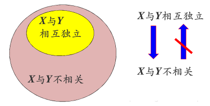

# 概统相关结论以及推导

## 变量分布

### 各种分布
离散：

| 分布 | 概率 | 记号 |
|:-------:|:---:|:---:|
|二项分布| $P(X=k)=C_n^kp^k(1-p)^{n-k}$ | $X\sim B(n, p)$ |
|几何分布| $P(X=k)=p(1-p)^{k-1}$ | $X\sim G(p)$ |
|超几何分布| $P(X=k)=\dfrac{C_M^k C_{N-M}^{n-k}}{C_N^n}$ | $X\sim H(n,M,N)$ |
|泊松分布| $P(X=k)=\dfrac{\lambda^k}{k!}e^{-\lambda}$ | $X\sim \pi(\lambda)$ |

连续：

| 分布 | 概率 | 记号 |
|:-------:|:---:|:---:|
|均匀分布| $f(x)=\begin{cases}\dfrac{1}{b-a} & a\leq x\leq b \\ 0 & other \end{cases}$ | $X\sim U(a,b)$ |
|指数分布| $\begin{array}{c} f(x)=\begin{cases}\lambda e^{-\lambda x} & x>0 \\ 0 & x\leq0 \end{cases} \\ f(x)=\begin{cases}\dfrac{1}{\theta} e^{-\frac{1}{\theta} x} & x>0 \\ 0 & x\leq0 \end{cases} \end{array}$ | $\begin{array}{c} X\sim Exp(\lambda) \\ X\sim Exp(\theta) \end{array}$ |
|正态分布| $f(x)=\dfrac{1}{\sqrt{2\pi}\sigma}e^{-\dfrac{(x-\mu)^2}{2\sigma^2}}$ | $X\sim N(\mu,\sigma^2)$ |

### 一般与标准正态分布的转换
1. 称 $N(0,1)$ 为标准正态分布，当随机变量 $X\sim N(\mu,\sigma^2)$ ，则
$\dfrac{X-\mu}{\sigma}\sim N(0,1)$ ；

2. 记标准正态分布的分布函数为 $\displaystyle\Phi(x):=\int_{-\infty}^x \dfrac{1}{\sqrt{2\pi}}e^{-\frac{x^2}{2}}\mathrm{d}x$ ，则变量 $X$ 的分布函数 $F(x)=\Phi(\dfrac{x-\mu}{\sigma})$

::: details 推导
1. 由 $X\sim N(\mu,\sigma^2)$ 知在 $X=x$ 处概率为 $f(x)\mathrm{d}x = \dfrac{1}{\sqrt{2\pi}\sigma}e^{-\dfrac{(x-\mu)^2}{2\sigma^2}}\mathrm{d}x = \dfrac{1}{\sqrt{2\pi}}e^{-\dfrac{(x-\mu)^2}{2\sigma^2}}\mathrm{d}\left(\dfrac{x-\mu}{\sigma}\right) = \dfrac{1}{\sqrt{2\pi}}e^{-\dfrac{t^2}{2}}\mathrm{d}t$ ，
所以变量 $t=\dfrac{X-\mu}{\sigma}\sim N(0,1)$ ；

2. 
$$
\begin{array}{rl}
F(x)&=\int_{-\infty}^x \dfrac{1}{\sqrt{2\pi}\sigma}e^{-\dfrac{(x-\mu)^2}{2\sigma^2}}\mathrm{d}x=\int_{-\infty}^x\dfrac{1}{\sqrt{2\pi}}e^{-\dfrac{1}{2}\left(\dfrac{x-\mu}{\sigma}\right)^2}\mathrm{d}\left(\dfrac{x-\mu}{\sigma}\right) \\
&=\int_{-\infty}^x \dfrac{1}{\sqrt{2\pi}}e^{-\frac{t^2}{2}}\mathrm{d}t = \Phi(\dfrac{x-\mu}{\sigma})
\end{array}
$$
:::

### 二维分布

1. 二维均匀分布
$$
f(x,y)=\begin{cases}
\dfrac{1}{S} & (x,y)\in D \\
0 & other
\end{cases}
$$

2. 二维正态分布
$$
f(x,y)=\dfrac{1}{2\pi\sigma_1\sigma_2\sqrt{1-\rho^2}}e^{-\dfrac{1}{2(1-\rho^2)}\left[\dfrac{(x-\mu_1)^2}{\sigma_1^2}-\dfrac{2\rho(x-\mu_1)(x-\mu_2)}{\sigma_1\sigma_2}+\dfrac{(x-\mu_2)^2}{\sigma_2^2}\right]}
$$
可记为 $(X,Y)\sim N(\mu_1,\mu_2,\sigma_1,\sigma_2,\rho)$

### 随机变量函数的分布

变量 $(X,Y)$ 的联合分布概率密度函数为 $f(x,y)$ ，分布函数为 $F(x,y)$ 。

1. 变量和 $Z=X+Y$ 的分布：
$$
\begin{align}
f_Z(z)&=\int_{-\infty}^\infty f(x,z-x)\mathrm{d}x=\int_{-\infty}^\infty f(z-y,y)\mathrm{d}y \\
&=\int_{-\infty}^\infty f_X(x)f_Y(z-x)\mathrm{d}x=\int_{-\infty}^\infty f_X(z-y)f_Y(y)\mathrm{d}y
\end{align}
$$

::: details 推导
$$
\begin{align}
F_Z(z)&=P(Z\leq z)=P(X+Y\leq z)=\int_{-\infty}^\infty \int_{-\infty}^{z-x} f(x,y)\mathrm{d}x\mathrm{d}y \\
&=\int_{-\infty}^\infty\mathrm{d}x \int_{-\infty}^z f(x,u-x)\mathrm{d}u \quad (u=x+y)
\end{align}
$$
故
$$
f_Z(z)=\dfrac{\mathrm{d}F_Z(z)}{\mathrm{d}z}=\int_{-\infty}^\infty f(x,z-x)\mathrm{d}x
$$
同理可得
$$
f_Z(z)=\int_{-\infty}^\infty f(z-y,y)\mathrm{d}y
$$
:::

2. 变量商 $Z=\dfrac{X}{Y}$ 的分布：
$$
\begin{align}
f_Z(z) &= \int_{-\infty}^\infty |y|f(yz,y)\mathrm{d}y \\
&= \int_{-\infty}^\infty |y|f_X(yz)f_Y(y)\mathrm{d}y
\end{align}
$$

::: details 推导
$$
\begin{align}
F_Z(z) &= P(\dfrac{X}{Y}\leq z)=P(X\leq zY,Y>0)+P(X\geq zY,Y<0) \\
&= \int_0^\infty\mathrm{d}y\int_{-\infty}^{zy}f(x,y)\mathrm{d}x+\int_{-\infty}^0\mathrm{d}y\int_{zy}^\infty f(x,y)\mathrm{d}x \\
\end{align}
$$
$$
\begin{align}
f_Z(z)&=\dfrac{\mathrm{d}F_Z(z)}{\mathrm{d}z}=\int_0^\infty yf(yz,y)\mathrm{d}y+\int_{-\infty}^0 -yf(yz,y)\mathrm{d}y \\
&=\int_{-\infty}^\infty |y|f(yz,y)\mathrm{d}y
\end{align}
$$
:::

3. 变量极值 $Z=max(X,Y),Z=min(X,Y)$ 的分布
$$
\begin{align}
F_{max}(z)&=F_X(z)F_Y(z) \\
F_{min}(z)&=1-[1-F_X(z)][1-F_Y(z)]
\end{align}
$$

::: details 推导
$$
\begin{align}
F_{max}(z)&=P(max(X,Y)\leq z)=P((X\leq z)\cap(Y\leq z)) \\
&=P(X\leq z)P(Y\leq z)=F_X(z)F_Y(z)
\end{align}
$$
$$
\begin{align}
F_{min}(z)&=P(min(X,Y)\leq z)=P((X\leq z)\cup(Y\leq z)) \\
&=1-P((X\geq z)\cap(Y\geq z))=1-P(X\geq z)P(Y\geq z) \\
&=1-[1-F_X(z)][1-F_Y(z)]
\end{align}
$$
:::

4. 多个正态分布的线性组合的分布：

若变量 $X_k\sim N(\mu_k,\sigma_k^2)$ ，$Z=\sum_{k=1}^n a_kX_k$ ，
则 
$$
Z\sim N(\sum_{k=1}^n a_k\mu_k, \sum_{k=1}^n a_k^2\sigma_k^2)
$$

::: details 推导
利用[特征函数](/blog/math/characteristic_function)进行推导。
:::

## 统计量

| 统计量 | 记号 |
|:-----:|:---:|
|期望|$E(X)$|
|方差|$D(X)=E[(X-E(X))^2]=E(X^2)-E^2(X)$|
|协方差|$Cov(X,Y)=E[(X-E(X))(Y-E(Y))]=E(XY)-E(X)E(Y)$|
|相关系数|$\rho_{XY}=\dfrac{Cov(X,Y)}{\sqrt{D(X)D(Y)}}$|

### 切比雪夫不等式

若随机变量 $X$ 已知 $E(X)=\mu$ 和 $D(X)=\sigma^2>0$ ，则
$$
P\{|X-\mu|\geq\varepsilon\}\leq\dfrac{\sigma^2}{\varepsilon^2}
$$

::: details 推导
$$
\begin{align}
P\{|X-\mu|\geq\varepsilon\} &= \int_{|x-\mu|\geq\varepsilon}f(x)\mathrm{d}x \\
&\leq \int_{|x-\mu|\geq\varepsilon}\dfrac{(x-\mu)^2}{\varepsilon^2}f(x)\mathrm{d}x \\
&= \dfrac{D(X)}{\varepsilon^2} = \dfrac{\sigma^2}{\varepsilon^2}
\end{align}
$$
:::

### 常用分布的期望和方差

| 分布 | 参数 | $E(X)$ | $D(X)$ |
|:---:|:----:|:------:|:------:|
| 0-1分布 | $p$ | $p$ | $p(1-p)$ |
| 二项分布 | $B(n,p)$ | $np$ | $np(1-p)$ |
| 几何分布 | $G(p)$ | $\dfrac{1}{p}$ | $\dfrac{1-p}{p^2}$ |
| 泊松分布 | $\pi(\lambda)$ | $\lambda$ | $\lambda$ |
| 超几何分布 | $H(n,M,N)$ | $n\dfrac{M}{N}$ | $n\dfrac{M}{N}\dfrac{N-M}{N}\dfrac{N-n}{N-1}$ |
| | | | |
| 均匀分布 | $U(a,b)$ | $\dfrac{a+b}{2}$ | $\dfrac{(b-a)^2}{12}$ |
| 指数分布 | $\begin{array}{c} Exp(\lambda) \\ Exp(\theta) \end{array}$ | $\begin{array}{c} \dfrac{1}{\lambda} \\ \theta\end{array}$ | $\begin{array}{c} \dfrac{1}{\lambda^2} \\ \theta^2\end{array}$ |
| 正态分布 | $N(\mu, \sigma^2)$ | $\mu$ | $\sigma^2$ |

::: details 推导
1. 0-1分布：

| $X$ | $0$ | $1$ |
|:---:|:---:|:---:|
|$P(X=x_i)$|$1-p$|$p$|

$
E(X)=0\times(1-p)+1\times p=p
$

$
D(X)=(0-p)^2\times(1-p)+(1-p)^2\times p=p(1-p)
$

2. 二项分布：
$
X\sim B(n,p)\quad P(X=k)=C_n^kp^k(1-p)^{n-k}
$
$$
\begin{align}
E(X) &= \sum_{i=0}^n iC_n^ip^i(1-p)^{n-i} \\
&= \sum_{i=1}^n nC_{n-1}^{i-1}p^{i-1+1}(1-p)^{n-1-(i-1)} \\
&= np\sum_{k=0}^{n-1} C_{n-1}^k p^k(1-p)^{n-(k+1)} \quad (k=i-1) \\
&= np (p+(1-p))^{n-1} = np
\end{align}
$$
$$
\begin{align}
E(X^2) &= E[X(X-1)]+E(X) = \sum_{k=0}^n k(k-1)C_n^kp^k(1-p)^{n-k}+np \\
&= \sum_{k=2}^n n(n-1)C_{n-2}^{k-2}p^{k-2+2}(1-p)^{n-2-(k-2)}+np \\
&= n(n-1)p^2\sum_{i=0}^{n-2}C_{n-2}^i p^i(1-p)^{n-2-1}+np = n(n-1)p^2+np
\end{align}
$$
$$
D(X)=E(X^2)-E^2(X)=np(1-p)
$$

3. 几何分布：
$X\sim G(p) \quad P(X=k)=p(1-p)^{k-1}$
(记 $q=1-p$ )
$$
\begin{align}
E(X)&=\sum_{k=0}^\infty kpq^{k-1} = p\dfrac{\mathrm{d}}{\mathrm{d}q}\sum_{k=0}^\infty q^{k} \\
&= p \dfrac{\mathrm{d}}{\mathrm{d}q}\dfrac{1}{1-q} = p\dfrac{1}{(1-q)^2} \\
&= \dfrac{1}{p}
\end{align}
$$
$$
\begin{align}
E(X^2)&=\sum_{k=1}^\infty k^2pq^{k-1} \\
&=p[\sum_{k=2}^\infty k(k-1)q^{k-1}+\sum_{k=1}^\infty kq^{k-1}] \\
&=qp\dfrac{\mathrm{d^2}}{\mathrm{d}q^2}\sum_{k=2}^\infty q^k + E(X) \\
&=qp\dfrac{\mathrm{d^2}}{\mathrm{d}q^2}\dfrac{q}{1-q}+\dfrac{1}{p} \\
&=\dfrac{2pq}{(1-q)^3}+\dfrac{1}{p}=\dfrac{2-p}{p^2}
\end{align}
$$
$$
D(X)=E(X^2)-E^2(X)=\dfrac{1-p}{p^2}
$$

4. 泊松分布： $X\sim \pi(\lambda)\quad P(X=k)=\dfrac{\lambda^ke^{-\lambda}}{k!}$
$$
E(X)=\sum_{k=0}^\infty k\dfrac{\lambda^ke^{-\lambda}}{k!}=\lambda e^{-\lambda}\sum_{k=1}^\infty \dfrac{\lambda^{k-1}}{(k-1)!}=\lambda
$$
$$
\begin{align}
E(X^2)&=E[X(X-1)]+E(X)=\sum_{k=0}^\infty k(k-1)\dfrac{\lambda^k}{k!}e^{-\lambda}+\lambda \\
&= \lambda^2 e^{-\lambda}\sum_{k=2}^\infty\dfrac{\lambda^{k-2}}{(k-2)!}+\lambda=\lambda^2+\lambda
\end{align}
$$
$$
D(X)=E(X^2)-E^2(X)=\lambda
$$

5. 超几何分布： $X\sim H(n,M,N)\quad P(X=k)=\dfrac{C_M^kC_{N-M}^{n-k}}{C_N^n}$
$$
\begin{align}
E(X)&=\sum_{k=0}^n k\dfrac{C_M^kC_{N-M}^{n-k}}{C_N^n}=\dfrac{nM}{N}\sum_{k=1}^n \dfrac{C_{M-1}^{k-1}C_{N-M}^{n-k}}{C_{N-1}^{n-1}} \\
&= \dfrac{nM}{N}\sum_{k=1}^n \dfrac{C_{M-1}^{k-1}C_{N-M}^{n-1-(k-1)}}{C_{N-1}^{n-1}}=\dfrac{nM}{N}
\end{align}
$$
$$
\begin{align}
E(X^2)&=E[X(X-1)]+E(X)=\sum_{k=2}^n k(k-1)\dfrac{C_M^kC_{N-M}^{n-k}}{C_N^n}+E(X) \\
&=\sum_{k=2}^n\dfrac{C_M^{k-2}C_{N-M}^{n-k}}{C_N^n}+E(X) \\
&=\dfrac{n(n-1)M(M-1)}{N(N-1)}\sum_{k=2}^n\dfrac{C_{M-2}^{k-2}C_{N-M}^{n-2-(k-2)}}{C_{N-2}^{n-2}}+E(X) \\
&= \dfrac{nM}{N}\left(\dfrac{N(N-n)+MN(n-1)}{N-1}\right)
\end{align}
$$
$$
D(X)=E(X^2)-E^2(X)=\dfrac{nM}{N}\dfrac{N-M}{N}\dfrac{N-n}{N-1}
$$

6. 均匀分布： $X\sim U(a,b)\quad$
$f(x)=\begin{cases}\dfrac{1}{b-a} & a\leq x\leq b \\ 0 & other \end{cases}$
$$
E(X)=\int_a^b xf(x)\mathrm{d}x=\dfrac{1}{b-a} \left[\dfrac{x^2}{2}\right]_{x=a}^{x=b}=\dfrac{a+b}{2}
$$
$$
E(X^2)=\int_a^b x^2f(x)\mathrm{d}x=\dfrac{1}{b-a}\left[\dfrac{x^3}{3}\right]_{x=a}^{x=b}=\dfrac{a^2+ab+b^2}{3}
$$
$$
D(X)=E(X^2)-E^2(X)=\dfrac{(b-a)^2}{12}
$$

7. 指数分布： $X\sim Exp(\lambda)\quad$
$f(x)=\begin{cases}\lambda e^{-\lambda x} & x>0 \\ 0 & x\leq0 \end{cases}$
$$
\begin{align}
E(X)&=\int_0^\infty x\lambda e^{-\lambda x}\mathrm{d}x=-\int_0^\infty x\mathrm{d}e^{-\lambda x} \\
&=-xe^{-\lambda x}|_{x=0}^{x=\infty}+\int_0^\infty e^{-\lambda x}\mathrm{d}x =-\dfrac{1}{\lambda}e^{-\lambda x}|_{x=0}^{x=\infty} \\
&=\dfrac{1}{\lambda}
\end{align}
$$
$$
\begin{align}
E(X^2)&=\int_0^\infty x^2\lambda e^{-\lambda x}\mathrm{d}x=-\int_0^\infty x^2\mathrm{d}e^{-\lambda x} \\
&=-x^2e^{-\lambda x}|_{x=0}^{x=\infty}+\int_0^\infty e^{-\lambda x}\mathrm{d}x^2 \\
&=2\int_0^\infty xe^{-\lambda x}\mathrm{d}x=-\dfrac{2}{\lambda}\int_0^\infty x\mathrm{d}e^{-\lambda x} \\
&=-\dfrac{2}{\lambda}xe^{-\lambda x}|_{x=0}^{x=\infty}+\dfrac{2}{\lambda}\int_0^\infty e^{-\lambda x}\mathrm{d}x \\
&=-\dfrac{2}{\lambda^2}e^{-\lambda x}|_{x=0}^{x=\infty}=\dfrac{2}{\lambda^2}
\end{align}
$$
$$
D(X)=E(X^2)-E^2(X)=\dfrac{1}{\lambda^2}
$$

8. 正态分布： $X\sim N(\mu, \sigma^2)\quad f(x)=\dfrac{1}{\sqrt{2\pi}\sigma}e^{-\dfrac{(x-\mu)^2}{2\sigma^2}}$

先求出标准正态分布的期望和方差：
$Z=\dfrac{X-\mu}{\sigma}\sim N(0,1)\quad \varphi(x)=\dfrac{1}{\sqrt{2\pi}}e^{-x^2/2}$
$$
E(Z)=\int_{-\infty}^\infty x\varphi(x)\mathrm{d}x=0
$$
$$
E(Z^2)=\int_{-\infty}^\infty x^2\varphi(x)=\dfrac{1}{\sqrt{2\pi}}\int_{-\infty}^\infty x^2\exp(-x^2/2)\mathrm{d}x=1
$$
$$
D(Z)=E(Z^2)-E^2(Z)=1
$$
从而一般正态分布的期望和方差为：
$$
E(X)=E(\sigma Z+\mu)=\sigma E(Z)+E(\mu)=\mu 
$$
$$
D(X)=D(\sigma Z+\mu)=\sigma^2 D(Z)+D(\mu)=\sigma^2
$$
:::

## 独立性和相关性

|   |   |
|:---:|:---:|
|事件AB相互独立| $P(AB)=P(A)P(B)$ |
|离散变量XY互相独立| $P(X=x_i,Y=y_i)=P(X=x_i)P(Y=y_i)$ |
|连续变量XY互相独立| $f(x,y)=f_X(x)f_Y(y)$ |

若 $Cov(X,Y)=0$ 则称变量 $X,Y$ 不相关。

::: info 二者关系

实际上不相关性是独立性的一种特殊情况，即只排除了线性关系，
而独立性则排除了所有关系。
:::

::: details 二维正态分布
变量 $(X,Y)\sim N(\mu_1,\mu_2,\sigma_1,\sigma_2,\rho)$ ，
其中 $\rho$ 为变量 $X,Y$ 的相关系数，当 $\rho=0$ 有 $X,Y$ 相互独立。

::: details 推导
容易验证当 $\rho=0$ 时，有 $f(x,y)=f_X(x)f_Y(y)$ 。
:::

## 大数定律和中心极限定理

### 大数定律

设 $X_1,X_2,...$ 是独立同分布的随机变量，且 $E(X_i)=\mu,i=1,2,...$ ，
则对于任意的 $\varepsilon>0$ 有
$$
\lim_{n\rightarrow\infty}P\left(\left|\dfrac{1}{n}\sum_{i=1}^n X_i-\mu\right|\geq\varepsilon\right)=0
$$
即 $\frac{1}{n}\sum_{i=1}^n X_i \xrightarrow{p} \mu$

### 中心极限定理

设 $X_1,X_2,...$ 是独立同分布的随机变量，且 $E(X_i)=\mu,D(X_i)=\sigma^2,i=1,2,...$ ，则
$$
\lim_{n\rightarrow\infty}P\left(\dfrac{\displaystyle\sum_{i=1}^n X_i-n\mu}{\sqrt{n}\sigma}\leq x\right)=\int_{-\infty}^x\dfrac{1}{\sqrt{2\pi}}e^{-t^2/2}\mathrm{d}t=\Phi(x)
$$
即当 $n\rightarrow\infty$ 时，
$$
Y_n=\dfrac{\sum_{i=1}^n X_i-n\mu}{\sqrt{n}\sigma}\sim N(0,1)
$$
$$
\sum_{i=1}^n X_i\sim N(n\mu,n\sigma^2)
$$
$$
\overline{X}=\dfrac{\sum_{i=1}^n X_i}{n}\sim N(\mu,\dfrac{\sigma^2}{n})
$$

## 抽样分布

### 常用统计量

| 统计量 | 记号 |
|:-----:|:---:|
|样本均值| $\overline{X}=\dfrac{1}{n}\sum_{i=1}^nX_i$ |
|样本方差| $S^2=\dfrac{1}{n-1}\sum_{i=1}^n(X_i-\overline{X})^2=\dfrac{1}{n-1}\left(\sum_{i=1}^nX_i^2-n\overline{X}^2\right)$ |
|样本$k$阶原点矩| $A_k=\dfrac{1}{n}\sum_{i=1}^nX_i^k$ |
|样本$k$阶中心矩| $B_k=\dfrac{1}{n}\sum_{i=1}^n(X_i-\overline{X})^k$ |

::: details 为什么样本方差分母上是 $n-1$ ？
因为计算样本方差是为了估计总体方差，而 $S^2=\dfrac{1}{n-1}\sum_{i=1}^n(X_i-\overline{X})^2$ 是总体方差 $\sigma^2$ 的无偏估计量。
$$
\begin{align}
E(S^2)&=E\left(\dfrac{1}{n-1}\sum_{i=1}^n(X_i-\overline{X})^2\right)=\dfrac{1}{n-1}E\left(\sum_{i=1}^nX_i^2-n\overline{X}^2\right) \\
&=\dfrac{1}{n-1}\left[\sum_{i=1}^n(D(X_i)+E^2(X_i))-n(D(\overline{X})+E^2(\overline{X}))\right] \\
&=\dfrac{1}{n-1}\left[\sum_{i=1}^n(\sigma^2+\mu^2)-n(\dfrac{\sigma^2}{n}+\mu^2)\right]=\dfrac{(n-1)\sigma^2}{n-1}=\sigma^2
\end{align}
$$
:::

### 常用抽样分布

1. $\chi^2$ 分布

::: info 定义
设 $X_1,...,X_n$ 是来自总体 $N(0,1)$ 的样本，则称统计量
$$
\chi^2=X_1^2+X_2^2+\cdots+X_n^2
$$
服从自由度为 $n$ 的 $\chi^2$ 分布，记为 $\chi^2\sim\chi^2(n)$ ，其中 $n$ 表示统计量中独立随机变量的个数。
:::

::: info 性质
1. 设 $X_1,...,X_n$ 相互独立，都服从正态分布 $N(\mu,\sigma^2)$ ，则
$$
\dfrac{1}{\sigma^2}\sum_{i=1}^n (X_i-\mu)^2\sim\chi^2(n)
$$

2. 设 $X_1\sim\chi^2(n_1)$ ， $X_2\sim\chi^2(n_2)$ 且 $X_1$ 和 $X_2$ 相互独立，则
$$
X_1+X_2\sim\chi^2(n_1+n_2)
$$

3. 设 $X\sim\chi^2(n)$ ，则 $E(X)=n,D(X)=2n$
:::

::: details 推导
1. 有 $\dfrac{X_i-\mu}{\sigma}\sim N(0,1)$ ，故
$$
\dfrac{1}{\sigma^2}\sum_{i=1}^n (X_i-\mu)^2=\sum_{i=1}^n\left(\dfrac{X_i-\mu}{\sigma}\right)^2\sim\chi^2(n)
$$

2. 记 $X_1=U_1^2+U_2^2+\cdots+U_{n_1}^2$ ， $X_2=V_1^2+V_2^2+\cdots+V_{n_2}^2$
$$
X_1+X_2=U_1^2+U_2^2+\cdots+U_{n_1}^2+V_1^2+V_2^2+\cdots+V_{n_2}^2\sim\chi^2(n_1+n_2)
$$

3. 由 $X_i\sim N(0,1)$ 有 $E(X_i)=0,D(X_i)=1$ ，所以
$$
E(X_i^2)=D(X_i)+E^2(X_i)=1
$$
故
$$
E(X)=E(X_1^2)+E(X_2^2)+\cdots+E(X_n^2)=n
$$
$$
E(X_i^4)=\int_{-\infty}^\infty x^4e^{-x^2/2}\mathrm{d}x/\sqrt{2\pi}=3\int_{-\infty}^\infty x^2e^{-x^2/2}\mathrm{d}x/\sqrt{2\pi}=3E(X_i^2)=3
$$
$$
D(X_i^2)=E(X_i^4)-E^2(X_i^2)=3-1=2
$$
故
$$
D(X)=D(X_1^2)+D(X_2^2)+\cdots+D(X_n^2)=2n
$$
:::

2. $t$ 分布

::: info 定义
设 $X\sim N(0,1),Y\sim\chi^2(n)$ ，且 $X$ 和 $Y$ 互相独立，则
$$
t=\dfrac{X}{\sqrt{Y/n}}
$$
服从自由度为 $n$ 的 $t$ 分布，记为 $t\sim t(n)$
:::
::: info 性质
1. $t$ 分布的概率密度函数 $f(x)$ 是偶函数，且
$$
\lim_{|x|\rightarrow\infty}f(x)=0
$$
当 $n\rightarrow\infty$ 时， $t$ 分布近似标准正态分布，即
$$
\lim_{n\rightarrow\infty}f(x)=\dfrac{1}{\sqrt{2\pi}}e^{-x^2/2}
$$

2. 设 $X\sim t(n)$，$E(X)=0,n>1;\quad D(X)=\dfrac{n}{n-2},n>2$
:::
::: details 推导
2. 当 $n=1$ 时，$t$ 分布就是柯西分布，数学期望不存在，
当 $n>1$ 时，$t$ 分布沿 $y$ 轴对称， $E(X)=0$ 。

记 $X=\dfrac{Z}{\sqrt{Y/n}}$ ，变量 $Z\sim N(0,1)\quad Y\sim\chi^2(n)$
$$
\begin{align}
D(X) &= D(Z/\sqrt{Y/n}) = E[(Z/\sqrt{Y/n})^2]-E^2(Z/\sqrt{Y/n}) \\
&= E(Z^2)E(1/(Y/n))-E^2(Z)E^2(1/\sqrt{Y/n})=nE(Z^2)E(1/Y) \\
&= \dfrac{n}{n-2}
\end{align}
$$
这里 $1/Y$ 为逆 $\chi^2$ 分布，其期望为 $\dfrac{1}{n-2}, \quad n>2$
:::

