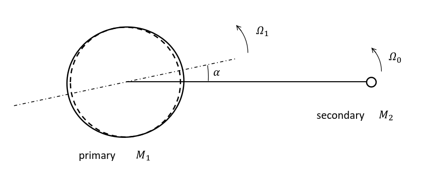
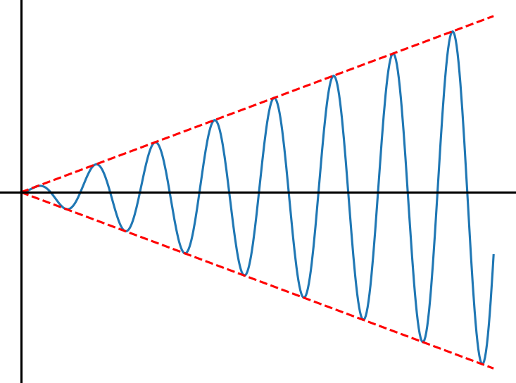
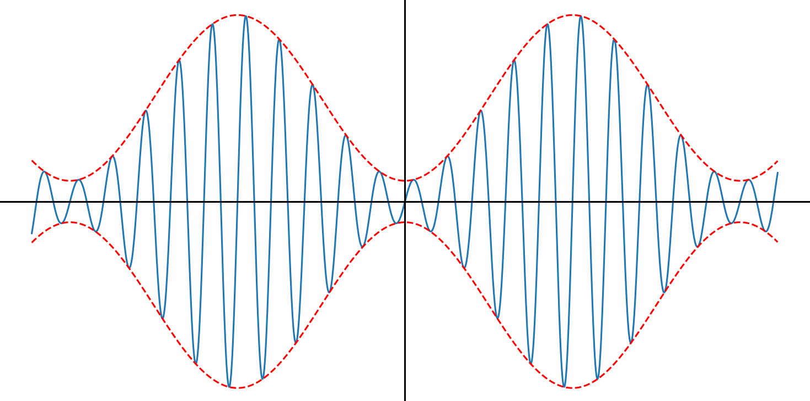
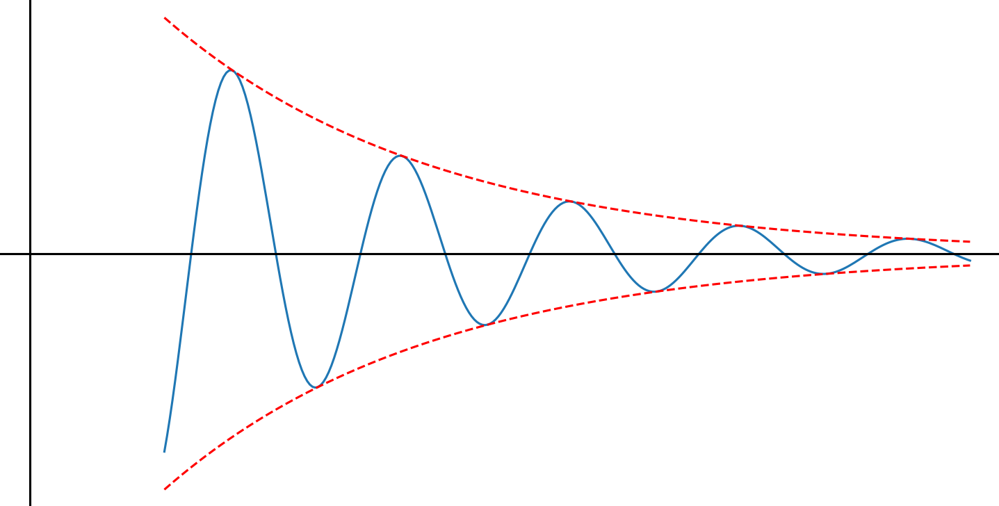

# 理论力学

## 运动方程

### 最小作用量原理

对于一个系统，记其拉格朗日量为 $L(q_1,...,q_s,\dot{q}_1,...\dot{q}_s,t)$ 或 $L(q,\dot{q},t)$

作用量 (action) $S=\int_{t_1}^{t_2} L\mathrm{d}t$

最小作用量原理 (principle of least action) $\delta S=0$

可以推出拉格朗日方程

$$
\frac{\partial L}{\partial q} - \frac{\mathrm{d}}{\mathrm{d}t}\frac{\partial L}{\partial \dot{q}} = 0
$$

### 拉格朗日量的形式

将拉格朗日方程 $\dfrac{\partial L}{\partial q} = \dfrac{\mathrm{d}}{\mathrm{d}t}\dfrac{\partial L}{\partial \dot{q}}$ 与牛顿第二定律 $\vec{F} = \dfrac{\mathrm{d}}{\mathrm{d}t} \vec{p}$

可以发现：广义力 $\dfrac{\partial L}{\partial q}$ ，广义动量 $\dfrac{\partial L}{\partial \dot{q}}$

系统的拉格朗日量 $L=T-U$ （其中 $T$ 为动能，$U$ 为势能）

## 守恒律

### 能量守恒

当空间具有时间平移对称性 $\dfrac{\partial L}{\partial t}=0$

则 
$$
\frac{\mathrm{d}}{\mathrm{d}t}\left( \frac{\partial L}{\partial \dot{q}}\dot{q}-L \right) = 0
$$

能量 $E = \dfrac{\partial L}{\partial \dot{q}}\dot{q}-L$ 守恒

### 动量守恒

当空间具有空间平移对称性 $\dfrac{\partial L}{\partial \vec{r}} = 0$

则
$$
\frac{\mathrm{d}}{\mathrm{d}t}\left(\frac{\partial L}{\partial \dot{q}}\right)=0
$$

动量 $\vec{p} = \dfrac{\partial L}{\partial \dot{q}}$ 守恒

### 角动量守恒

当空间具有空间旋转对称性 (旋转 $\delta\varphi\Rightarrow\delta L=0$)

则
$$
\frac{\mathrm{d}}{\mathrm{d}t}(\vec{r}\times\vec{p})=0
$$

角动量 $\vec{r}\times\vec{p}$ 守恒

### 参考系

质心 $\displaystyle\vec{R}=\frac{1}{M}\sum_\alpha m_\alpha \vec{r}_\alpha$

质心系中系统动量 $\vec{p}'=0$

从参考系 $K$ 到参考系 $K'$ 有关系
$$
\left\{
\begin{array}{l}
\vec{p}=\vec{p}'+M\vec{V} \\
E=E'+\vec{V}\cdot\vec{p}'+\dfrac{1}{2}MV^2 \\
\vec{J}=\vec{J}'+M\vec{R}\times\vec{V}
\end{array}
\right.
$$

特别地，当 $K'$ 为质心参考系时
$$
\left\{
\begin{array}{l}
\vec{p}=M\vec{V} \\
E=E'+\dfrac{1}{2}MV^2 \\
\vec{J}=\vec{J}'+\vec{R}\times\vec{p}
\end{array}
\right.
$$

### 相似性

对于一个系统， $T\propto v^2,U\propto r^k$

当系统的位矢 $\vec{r}\rightarrow a\vec{r}$ ，时间 $t\rightarrow bt$

可以由拉格朗日方程性质得到： $b=a^{1-k/2}$ 

即

$$
\frac{t'}{t}=\left(\frac{l'}{l}\right)^{1-k/2}
$$

::: info example
| k值 | 实例 |
|:---:|:---:|
|$U\propto r^{-1}\Rightarrow t'/t=(l'/l)^{3/2}$|开普勒第三定律|
|$U\propto r\Rightarrow t'/t=(l'/l)^{1/2}$|自由落体 $h=\dfrac{1}{2}gt^2$|
|$U\propto x^2\Rightarrow t'/t=(l'/l)^0$|弹簧振子周期独立于振幅|
:::

### 位力定理

记系统的动能 $T\propto v^2$ 势能 $U\propto r^k$

有 $2\langle T\rangle=kU$

其中按时间平均 $\displaystyle\langle f\rangle=\lim_{\tau\rightarrow\infty}\frac{1}{\tau}\int_0^\tau f\mathrm{d}t$

## 中心力场

### 一维运动

对于一维运动 $L=\dfrac{1}{2}m\dot{x}^2-U(x)$

其轨迹（path）$\displaystyle t=\sqrt{\frac{m}{2}}\int\frac{\mathrm{d}x}{\sqrt{E-U}}$

对于有界运动，有
$$
T=\sqrt{2m}\int_{x_1}^{x_2}\frac{\mathrm{d}x}{\sqrt{E-U}}
$$
$$
U(x)=E \Rightarrow x_1(E),x_2(E)
$$

### 约化质量

对于两体问题 $L=\dfrac{1}{2}m_1\left|\dot{\vec{r}}_1\right|^2+\dfrac{1}{2}m_1\left|\dot{\vec{r}}_2\right|^2-U(\left|\vec{r}_1-\vec{r}_2\right|)$

$$
L=\frac{1}{2}\frac{m_1m_2}{m_1+m_2}\left|\dot{\vec{r}}\right|^2-U(r)
$$

约化质量（reduced mass） $m=\dfrac{m_1m_2}{m_1+m_2}$

::: info [example1](#example1)
对于一个质量 $m_s$ 的恒星和 $n$ 个相同质量 $m_p$ 的行星 $(\alpha=1,...,n)$ ，求 $L(\vec{R}_\alpha,\dot{\vec{R}}_\alpha)$
:::

### 中心力场的运动

对于中心力场 $L=\dfrac{1}{2}m(\dot{r}^2+r^2\dot{\varphi}^2)-U(r)$

::: info 注：
上式中 $m=\dfrac{m_1m_2}{m_1+m_2}$ 为约化质量，位矢 $\vec{r}=(r,\varphi)$ 的坐标原点是中心天体中心，而非二者的质心。
:::

- 角动量守恒 $M=mr^2\dot{\varphi}=const$
- $E=\dfrac{1}{2}m\dot{r}^2+\dfrac{M^2}{2mr^2}+U(r),E=const$
- 轨迹（path） $\displaystyle t=\int\left(\frac{2}{m}(E-U)-\frac{M^2}{m^2r^2}\right)^{-1/2}\mathrm{d}r$
- 轨迹的形状（shape） $\displaystyle \varphi=\int\frac{M}{mr^2}\left(\frac{2}{m}(E-U)-\frac{M^2}{m^2r^2}\right)^{-1/2}\mathrm{d}r$
- 有效势能 $U_{eff}=U+\dfrac{M^2}{2mr^2}$ ，离心能 $\dfrac{M^2}{2mr^2}$
- 转折点 $\dot{r}=0,\dot{\varphi}\neq 0\Leftrightarrow E=U_{eff}$
- 闭合轨道
$$
\Delta\varphi=2\int_{r_{min}}^{r_{max}}\frac{M}{r^2}\left(2m(E-U)-\frac{M^2}{r^2}\right)^{-1/2}\mathrm{d}r
$$
如果轨道封闭，有
$$
\Delta\varphi=2\pi\frac{n_1}{n_2}\ (n_1,n_2\in\mathbb{Z})
$$
Bertrand定理：仅当 $U\propto r^{-1}$ 或 $U\propto r^2$ 时轨道闭合

::: info [example2](#example2) 水星进动 precession
考虑相对论修正后，势能项 $U=-k/r+\delta U$ 其中 $\delta U=\alpha/r^3$

求 $\Delta\varphi$ 从 $r_{min}$ 到 $r_{max}$ 再回到 $r_{min}$ 的变化 $\delta(\Delta\varphi)$
:::

### 开普勒问题

对于引力 $U=-\dfrac{k}{r}\ (k>0)$
$$
U_{eff}=-\frac{k}{r}+\frac{M^2}{2mr^2}
$$

轨迹的形状
$$
r(\varphi)=\frac{M^2}{mk}\left(\sqrt{1+\frac{2mEM^2}{m^2k^2}}\cos\varphi+1\right)^{-1}
$$

偏心率（eccentricity） $\displaystyle e=\sqrt{1+\frac{2EM^2}{mk^2}}$

半通径（lootus rectum） $p=\dfrac{M^2}{mk}$

有
$$
r(\varphi)=\frac{p}{1+e\cos\varphi}
$$

#### 椭圆

半长轴 $a=\dfrac{p}{1-e^2}=-\dfrac{k}{2E}$

半短轴 $b=\dfrac{p}{\sqrt{1-e^2}}=\dfrac{M}{\sqrt{-2mE}}$

::: info 轨道能量，角动量
$E=-\dfrac{k}{2a}=-\dfrac{Gm_1m_2}{2a}$

$M=m\sqrt{G(m_1+m_2)a(1-e^2)}$
:::

周期 $T^2=4\pi^2\dfrac{m}{k}a^3=\dfrac{4\pi^2}{G(m_1+m_2)}a^3$

从 $\varphi_1$ 对 $\varphi_2$ 的时间间隔 $\displaystyle\Delta t=\dfrac{2m}{M}\Delta A=\dfrac{2m}{M}\int_{\varphi_1}^{\varphi_2}\dfrac{1}{2}\left(\dfrac{p}{1+e\cos\theta}\right)^2\mathrm{d}\varphi$

轨迹 $\displaystyle t(r)=\sqrt{\frac{ma^3}{k}}(\theta-e\cos\theta),\quad r=a(1-e\cos\theta)$

#### 双曲线

半长轴 $a=\dfrac{p}{e^2-1}=\dfrac{k}{2E}$

半短轴 $b=\dfrac{p}{\sqrt{e^2-1}}=\dfrac{M}{2mE}$

轨迹 $\displaystyle t(r)=\sqrt{\frac{ma^3}{k}}(e\sinh\xi-\xi),\quad r=a(e\cosh\xi-1)$

#### 抛物线

轨迹 $\displaystyle t(r)=\sqrt{\frac{mp^3}{k}}\frac{1}{2}\eta(1+\frac{1}{3}\eta^3),\quad \sqrt{2r-p}=\eta\sqrt{p}$

### 比内公式

之前通过运动积分推导出开普勒问题的轨迹形状，现在用拉格朗日运动方程导出：

拉格朗日量 $L=\dfrac{1}{2}m(\dot{r}^2+r^2\dot{\varphi}^2)-U(r)$

$$
\frac{\mathrm{d}}{\mathrm{d}t}\left(\frac{\partial L}{\partial\dot{r}}\right)=\frac{\partial L}{\partial r}\Leftrightarrow m(\ddot{r}-r\dot{\varphi}^2)=-\frac{\mathrm{d}U}{\mathrm{d}r}=-\frac{k}{r^2}
$$

该方程为非线性方程，做变换 $w=\dfrac{1}{r}$ ，有

$$
\frac{\mathrm{d}^2w}{\mathrm{d}\varphi^2}+w=\frac{mk}{M^2}
$$

现在方程为线性常微分方程，称为比内公式。

可解出 $w=C\cos(\varphi+\varphi_0)+\dfrac{mk}{M^2}$ 即
$$
r=\frac{\frac{M^2}{mk}}{1+\sqrt{1+\frac{2EM^2}{mk^2}}\cos(\varphi+\varphi_0)}
$$

### 第三个守恒量

拉普拉斯-楞次-龙格守恒量（Laplace-Lentz-Runge）$\vec{B}=\vec{v}\times\vec{M}-\dfrac{k\vec{r}}{r}$

$\vec{B}$ 位于轨道平面，在近日点算得 $\vec{B}=ke\hat{e}_r$ ，$\vec{B}$ 是和偏心率有关的守恒量。

### 圆轨道的稳定性

1. 能量法（有效势能 $U_{eff}$ ）

2. 微扰法

有心立场的运动方程
$$
\left\{
\begin{array}{l}
\displaystyle m(\ddot{r}-r\dot{\varphi}^2)=-\frac{\mathrm{d}U}{\mathrm{d}r}=-\frac{k}{r^2} \\
mr^2\dot{\varphi}=M
\end{array}
\right.
$$
对于圆轨道 $r=r_0,\dot{\varphi}=\dot{\varphi}_0$
有
$$
\left\{
\begin{array}{l}
\displaystyle -mr_0\dot{\varphi}_0^2=-\frac{k}{r_0^2} \\
mr_0^2\dot{\varphi}_0=M
\end{array}
\right.
$$
取微扰 $r=r_0+\delta r\ (|\delta r|\ll r_0),\dot{\varphi}=\dot{\varphi}_0+\delta\dot{\varphi}\ (|\delta\dot{\varphi}|\ll \dot{\varphi}_0)$

代回上面方程可得：
$$
\delta\ddot{r}+\left(3\dot{\varphi}_0^2-\frac{2k}{mr_0^3}\right)\delta r=0
$$
由于 $\displaystyle 3\dot{\varphi}_0^2-\frac{2k}{mr_0^3}=\frac{k}{mr_0^3}>0$ 故圆轨道稳定。

- 扰动频率(kepler frequency) $\displaystyle\omega=\sqrt{\frac{k}{mr_0^3}}$

### 潮汐 tidal

1. phase lag & tidal force

- tidal phase lag: $\alpha$ (the tidal friction in primary)
- tidal force: $f\simeq\dfrac{GM_2R_1}{a^3}$ (difference of gravitational forces)
- Roche limit: $a\simeq\left(\dfrac{M_2}{M_1}\right)^{1/3}R_1$
- Hill radius: $R_1\simeq\left(\dfrac{M_1}{M_2}\right)^{1/3}a$

2. tidal evolution

- total energy: $E=E_0+E_1+E_2=-\dfrac{GM_1M_2}{2a}+\dfrac{1}{2}I_1\Omega_1^2+\dfrac{1}{2}I_2\Omega_2^2$
- total angular momentum: $h=h_0+h_1+h_2=\mu\sqrt{GMa(1-e^2)}\hat{\Omega}_0+I_1\vec{\Omega}_1+I_2\vec{\Omega}_2$
$$
\mu=\frac{M_1M_2}{M_1+M_2},\quad M=M_1+M_2
$$

- tidal evolution: h conserves but E reduce.

- final state: E minimum
$$
\Rightarrow e=0,\ i=0,\ \Omega_0=\Omega_1=\Omega_2
$$

e.g. pluto-charon

3. Earth-Moon

- tidal evolution equation:
$$
\left\{\begin{array}{l}
\dot{h}_0=\Gamma,\ \dot{h}_1=-\Gamma,\\
\dot{E}_0=\Omega_0\Gamma,\ \dot{E}_1=-\Omega_1\Gamma\\
\end{array}\right.
$$

- for Earth-Moon:
$$
\begin{array}{l}
M_1\simeq6\times10^{27}g,\ M_2\simeq7.4\times10^{25}g,\ a=3.8\times10^{10}cm \\
\Omega_0=(GM/a^3)^{1/2}\simeq2.7\times10^{-6}s^{-1},\ e\simeq0,\ \Omega_1\simeq7.3\times10^{-5}s^{-1} \\
\dot{a}=3.8cm/yr \Rightarrow
\end{array}
$$
$$
\begin{array}{l}
\dot{E}_0=-\dfrac{\dot{a}}{a}E_0=\dfrac{GM_1M_2\dot{a}}{2a}\simeq1.2\times10^{18}erg/s \\
\Gamma=\dfrac{\dot{E}_0}{\Omega_0}\simeq4.5\times10^{23}erg \\
\dot{E}_1=-\Omega_1\Gamma\simeq-3.2\times10^{19}erg/s \\
\dot{E}_0+\dot{E}_1\simeq-3\times10^{19}erg/s
\end{array}
$$

4. equilibrium tide

let $\xi$ be the equilibrium tide.

- hydrostotic balance $p_1\simeq\rho\Psi$
- $p_1\simeq\rho g\xi\Rightarrow \xi\simeq\Psi/g$
- $\Psi\simeq\dfrac{GM_2R_1^2}{a^3},\ g\simeq\dfrac{GM_1}{R_1^2}$

so we have
$$
\xi\simeq\frac{M_2}{M_1}\frac{R_1^4}{a^3} \quad\text{or}\quad \xi/R_1\simeq\frac{M_2}{M_1}\frac{R_1^3}{a^3}
$$

::: info e.g.
for a Sun-like star and a Jupiter-like planet, $a=0.04AU\simeq10R_\odot\simeq10^2R_J$

on star $\xi/R_1\simeq10^{-6}$

on planet $\xi/R_1\simeq10^{-3}$
:::

5. tidal friction

- stored energy in tidal deformation
$$
E_t=M_1f\xi\simeq\frac{GM_1M_2R_1}{a^3}\left(\frac{M_2}{M_1}\right)\left(\frac{R_1^4}{a^3}\right)\simeq\frac{GM_2^2R_1^5}{a^6}
$$

- tidal dissipation rate
$$
D=|\dot{E}_0+\dot{E}_1|=\omega E_t/Q\simeq\frac{GM_2^2R_1^5}{a^6}\omega\frac{1}{Q}
$$
here $\omega=|\Omega_0-\Omega_1|$ is called tidal frequency, and $Q$ is called tidal quality factor.

- tidal torque
$$
\Gamma=M_1f\xi\sin\alpha\simeq\frac{GM_2^2R_1^5}{a^6}\frac{1}{Q}
$$

Given $Q$, we can calculate orbital evolution 
::: info ref [Goldreich and Soter 1966 Icarus 5:375](https://www.sciencedirect.com/science/article/abs/pii/0019103566900510)
Earth $Q\simeq 12$ , Jupiter $Q\simeq10^5$
:::

now we calculate the tidal dissipation rate directly from primary star.
$$
\begin{array}{rl}
D & =\mu\left(\dfrac{U}{R_1}\right)^2V_1=\rho_1\nu\left(\dfrac{\xi\omega}{R_1}\right)^2V_1 \\
& =\nu\dfrac{M_2^2}{M_1}\left(\dfrac{R_1}{a}\right)^6\omega^2
\end{array}
$$

so we have
$$
Q=\omega E_t/D=\frac{1}{\nu\omega}\frac{GM_1}{R_1}=\tau_\nu\omega_d^2\omega^{-1}
$$
here $\omega_d=(GM_1/R_1^3)^{1/2}$ is called dynamical frequency, and $\tau_\nu=R_1^2/\nu$
$$
\frac{1}{Q}=\tau\omega
$$

- tidal lag time: $\tau=\tau_\nu^{-1}\omega_d^{-2}$ only depends on internal structure of primary star.

finally, 
$$
1/Q\simeq\alpha\simeq\tau\omega
$$

## 微振动

### 一维自由振动

对于一个质量为 $m$ ，弹簧弹性系数为 $k$ 的弹簧振子，由拉格朗日方程有
$$
\ddot{x}+\omega^2x=0
$$

- 本征频率 $\omega=\sqrt{k/m}$

$$
x=a\cos(\omega t+\alpha)
$$

- 振幅(amplitude) $a$
- 相位(phase) $\omega t+\alpha$
- 初相位 $\alpha$
- 简谐振动(harmonic oscillation)
- 能量 $\displaystyle E=\frac{1}{2}ma^2\omega^2$

$$
x=a\cos(\omega t+\alpha)=\mathrm{Re}(Ae^{i\omega t})
$$

- 复振幅(complex amplitude) $A=ae^{i\alpha}$

### 受迫振动

受外力 $F(t)$ 的弹簧振子，由拉格朗日方程有
$$
\ddot{x}+\omega^2x=\frac{F(t)}{m}
$$

#### 周期外力

当 $F(t)=f\cos(\gamma t+\beta)$ 时

$$
x=a\cos(\omega t+\alpha)+\frac{f}{m(\omega^2-\gamma^2)}\cos(\gamma t+\beta)
$$

1. 共振(resonance)

当 $\gamma=\omega$ 时，有
$$
x=a'\cos(\omega t+\alpha)+\frac{f}{2m\omega}t\sin(\omega t+\beta)
$$

共振时，振幅随时间线性增长，直到小扰动条件失效，引入非线性项。

2. 共振附近

当 $\gamma\approx\omega$ 时，记 $\gamma=\omega+\varepsilon$ 有
$$
x=(A+Be^{i\varepsilon t})e^{i\omega t}
$$

#### 一般情况

对任意的 $F(t)$ 记

$$
\xi=\left(\int_0^t\frac{F(s)}{m}e^{-i\omega s}\mathrm{d}s+A_0\right)e^{i\omega t}
$$
$$
x=\frac{\mathrm{Im}(\xi)}{\omega}
$$

### 阻尼振动

阻力 $-\alpha\dot{x}$ $(\alpha>0)$ ，由拉格朗日方程有
$$
\ddot{x}+2\mu\dot{x}+\omega^2 x=0
$$

- 阻尼频率 $\displaystyle\mu=\frac{\alpha}{2m}$

1. 阻尼大 $\mu>\omega$

$$
x=c_1e^{\lambda_1 t}+c_2e^{\lambda_2 t}
$$
$$
\lambda_{1,2}=-\mu\pm\sqrt{\mu^2-\omega^2}
$$

2. 阻尼小 $\mu<\omega$

$$
x=Ce^{-\mu t}\cos(\sqrt{\omega^2-\mu^2}t+\varphi)
$$

3. 临界阻尼 $\mu=\omega$

$$
x=(c_1+c_2t)e^{-\mu t}
$$

### 受迫阻尼振动

受外力 $F(t)$ 和阻尼的弹簧振子，由拉格朗日方程有

$$
\ddot{x}+2\mu\dot{x}+\omega^2 x=\frac{F}{m}
$$

当 $F=f\cos(\gamma t+\beta)$ 时其解为

$$
x=Ce^{-\mu t}\cos(\sqrt{\omega^2-\mu^2}t+\varphi)+b\cos(\gamma t+\beta+\delta)
$$
其中
$$
b=\frac{f/m}{\sqrt{(\omega^2-\gamma^2)^2+4\mu^2\gamma^2}}
$$

1. 当 $\gamma=\sqrt{\omega^2-2\mu^2}$ 时，$b_{max}=\dfrac{f/m}{2\mu\sqrt{\omega^2-\mu^2}}$

2. 当 $\gamma=\omega$ 时，$b=\dfrac{f/m}{2\mu\gamma}\neq+\infty$

3. 当 $\gamma\approx\omega$ 时，记 $\gamma=\omega+\varepsilon(\varepsilon\ll\omega)$ ，$b=\dfrac{f/m}{2\omega\sqrt{\mu^2+\varepsilon^2}}$

### 快速变化力场中的运动

质点在势场 $U(x)$ 中做平缓运动，受到一个变化快的外力 $F(x,t)$

当外力 $F(x,t)=f(x)\cos(\gamma t)$ ，由拉格朗日方程有

$$
m\ddot{x}=-\frac{\mathrm{d}U}{\mathrm{d}x}+f(x)\cos(\gamma t)
$$

把质点的运动分解为平缓项和快速项 $x(t)=X(t)+\xi(t)$

解得
$$
\xi=-\frac{f(x)}{m\gamma^2}\cos\gamma t
$$
$$
m\ddot{X}=-\frac{\mathrm{d}U_{eff}}{\mathrm{d}X}
$$
其中 $U_{eff}=U+\langle\frac{1}{2}m\dot{\xi}^2\rangle$

## 刚体运动

### 基本概念

运动速度分解：质心平动+相对质心转动
$$
\vec{v}=\vec{V}+\vec{\Omega}\times\vec{r}
$$

### 角动量和转动惯量

- 角动量 $\displaystyle\vec{M}=\int \vec{r}\times(\rho\mathrm{d}V\cdot\vec{v}) = [\boldsymbol{I}]\vec{\Omega}$

- 转动惯量 $\displaystyle[\boldsymbol{I}]=I_{ij}=\int\rho(r^2\delta_{ij}-x_ix_j)\mathrm{d}V=\int\rho\left[\begin{array}{ccc}y^2+z^2&-xy&-xz \\ -xy&x^2+z^2&-yz \\ -xz&-yz&x^2+y^2 \end{array}\right]\mathrm{d}V$

---

## 习题

### example1

::: info example1
对于一个质量 $m_s$ 的恒星和 $n$ 个相同质量 $m_p$ 的行星 $(\alpha=1,...,n)$ ，求 $L(\vec{R}_\alpha,\dot{\vec{R}}_\alpha)$
:::

::: details solve
$$
\left\{\begin{array}{l}
\displaystyle m_s\vec{r}_s+\sum_\alpha m_p\vec{r}_\alpha=0 \\
\displaystyle \vec{R}_\alpha=\vec{r}_\alpha-\vec{r}_s
\end{array}\right.
$$
$$
\left\{\begin{array}{l}
\displaystyle \vec{r}_s=-\frac{m_p}{\mu}\sum_\alpha\vec{R}_\alpha \\
\displaystyle \vec{r}_\alpha=\vec{R}_\alpha-\frac{m_p}{\mu}\sum_\alpha\vec{R}_\alpha
\end{array}\right.\quad, \mu=m_s+nm_p
$$
$$
\begin{array}{rcl}
L & = & \displaystyle \frac{1}{2}m_s|\dot{\vec{r}}_s|^2+\frac{1}{2}m_p\sum_\alpha|\dot{\vec{r}}_\alpha|^2-U \\
& = & \displaystyle \frac{1}{2}m_s(-\frac{m_p}{\mu}\sum_\alpha\vec{R}_\alpha)\cdot(-\frac{m_p}{\mu}\sum_\alpha\vec{R}_\alpha) \\
& & \displaystyle +\frac{1}{2}m_p\sum_\alpha\left[(\vec{R}_\alpha-\frac{m_p}{\mu}\sum_\alpha\vec{R}_\alpha)\cdot(\vec{R}_\alpha-\frac{m_p}{\mu}\sum_\alpha\vec{R}_\alpha)\right]-U \\
& = & \displaystyle \frac{1}{2}m_s\frac{m_p^2}{\mu^2}\left|\sum_\alpha\dot{\vec{R}}_\alpha\right|^2+\frac{1}{2}m_p\sum_\alpha\left|\dot{\vec{R}}_\alpha\right|^2 \\
& & \displaystyle -\frac{m_p^2}{\mu}\left|\sum_\alpha\dot{\vec{R}}_\alpha\right|^2+\frac{1}{2}\frac{m_p^2}{\mu^2}(\mu-m_s)\left|\sum_\alpha\dot{\vec{R}}_\alpha\right|^2-U \\
& = & \displaystyle \frac{1}{2}m_p\sum_\alpha\left|\dot{\vec{R}}_\alpha\right|^2-\frac{1}{2}\frac{m_p^2}{\mu}\left|\sum_\alpha\dot{\vec{R}}_\alpha\right|^2-U
\end{array}
$$
:::

### example2

::: info example2 水星进动 precession
考虑相对论修正后，势能项 $U=-k/r+\delta U$ 其中 $\delta U=\alpha/r^3$

求 $\Delta\varphi$ 从 $r_{min}$ 到 $r_{max}$ 再回到 $r_{min}$ 的变化 $\delta(\Delta\varphi)$
:::

::: details solve
$$
\Delta\varphi=2\int_{r_{min}}^{r_{max}}\frac{M}{r^2}\left[2m(E-U)-\frac{M^2}{r^2}\right]^{-1/2}\mathrm{d}r
$$
在 $r_{min}$ 和 $r_{max}$ ， $E=U_{eff}$ 分母为零，有奇性。做变换
$$
\Delta\varphi=-2\frac{\partial}{\partial M}\int_{r_{min}}^{r_{max}}\left[2m(E-U)-\frac{M^2}{r^2}\right]^{1/2}\mathrm{d}r
$$
$$
U=-k/r+\delta U=U_0+\delta U=U_0\left(1+\frac{\delta U}{U_0}\right)
$$
对 $\delta U/U_0$ 做 Taylor 展开
$$
\delta(\Delta\varphi)=\frac{\partial}{\partial M}\int_{r_{min}}^{r_{max}}\left[2m(E-U_0)-\frac{M^2}{r^2}\right]^{-1/2}2m\delta U\mathrm{d}r
$$
由有心力场的轨迹形状
$$
\mathrm{d}\varphi=\frac{M}{r^2}\left[2m(E-U_0)-\frac{M^2}{r^2}\right]^{-1/2}\mathrm{d}r
$$
则
$$
\delta(\Delta\varphi)=\frac{\partial}{\partial M}\left(\int_0^\pi\frac{2mr^2}{M}\delta U\mathrm{d}\varphi\right)
$$
由势能的相对论修正
$$
\delta U=\alpha/r^3
$$
有
$$
\begin{align}
\delta(\Delta\varphi)&=2m\alpha\frac{\partial}{\partial M}\left(\frac{1}{M}\int_0^\pi\frac{1}{r}\mathrm{d}r\right) \\
&=2m\alpha\frac{\partial}{\partial M}\left(\frac{1}{M}\int_0^\pi\frac{1+e\cos\varphi}{p}\mathrm{d}\varphi\right) \\
&=2m\alpha\pi\frac{\partial}{\partial M}\left(\frac{1}{Mp}\right)
\end{align}
$$
由半通径与角动量关系
$$
p=\frac{M^2}{G\mu m^2},\quad \mu=m_1+m_2
$$
故
$$
\delta(\Delta\varphi)=2m\alpha\pi\frac{\partial}{\partial M}\left(\frac{G\mu m^2}{M^3}\right)=-6\pi G\alpha\mu m^3M^{-4}
$$
:::

