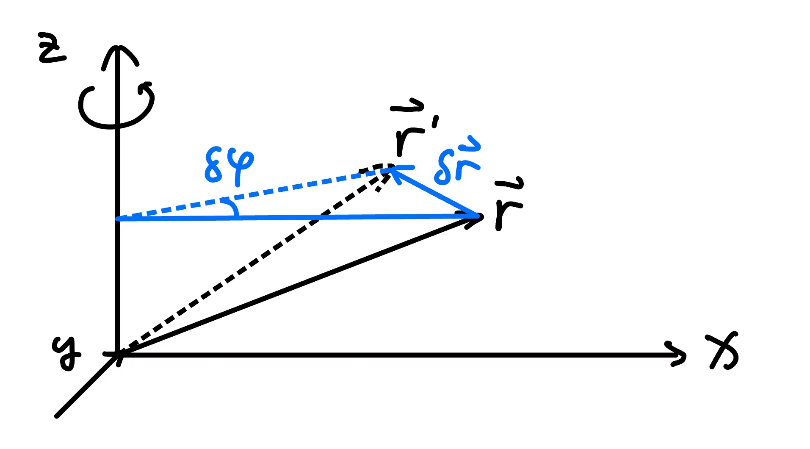
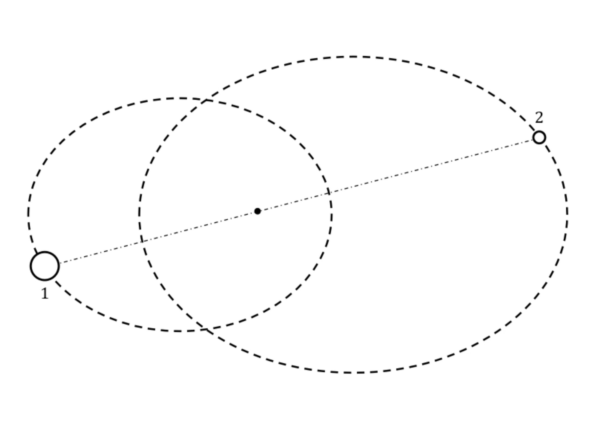
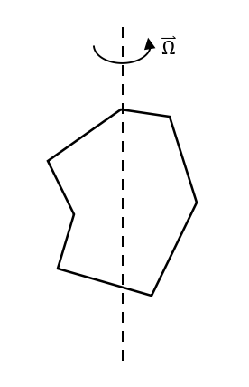
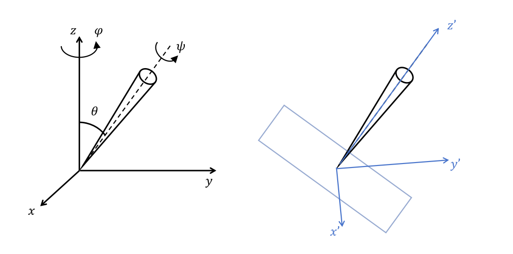
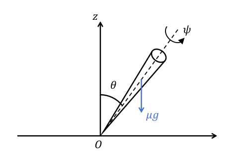
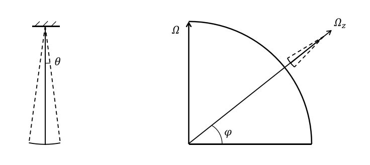

# 理论力学

## 运动方程

### 最小作用量原理

对于一个系统，记其拉格朗日量为 $L(q_1,...,q_s,\dot{q}_1,...\dot{q}_s,t)$ 或 $L(q,\dot{q},t)$

作用量 (action) $S=\int_{t_1}^{t_2} L\mathrm{d}t$

最小作用量原理 (principle of least action) $\delta S=0$

可以推出拉格朗日方程

$$
\frac{\partial L}{\partial q} - \frac{\mathrm{d}}{\mathrm{d}t}\frac{\partial L}{\partial \dot{q}} = 0
$$

::: details 最小作用量原理推导拉格朗日方程
$$
\begin{align}
\delta S & =\int_{t_1}^{t_2}\delta L\mathrm{d}t \\
& =\int_{t_1}^{t_2}\left(\frac{\partial L}{\partial q}\delta q+\frac{\partial L}{\partial \dot{q}}\delta\dot{q}\right)\mathrm{d}t \\
& =\int_{t_1}^{t_2}\left(\frac{\partial L}{\partial q}\delta q\mathrm{d}t+\frac{\partial L}{\partial\dot{q}}\mathrm{d}(\delta q)\right) \\
& =\int_{t_1}^{t_2}\frac{\partial L}{\partial q}\delta q\mathrm{d}t+\underbrace{\left[\frac{\partial L}{\partial \dot{q}}\delta q\right]_{t_1}^{t_2}}_{=0}-\int_{t_1}^{t_2}\delta q\mathrm{d}\left(\frac{\partial L}{\partial\dot{q}}\right) \\
& =\int_{t_1}^{t_2}\left(\frac{\partial L}{\partial q}\delta q\mathrm{d}t-\delta q\frac{\mathrm{d}}{\mathrm{d}t}\left(\frac{\partial L}{\partial\dot{q}}\right)\mathrm{d}t\right) \\
& =\int_{t_1}^{t_2}\left(\frac{\partial L}{\partial q}-\frac{\mathrm{d}}{\mathrm{d}t}\left(\frac{\partial L}{\partial\dot{q}}\right)\right)\delta q\mathrm{d}t =0
\end{align}
$$
$$
\Rightarrow \frac{\partial L}{\partial q}-\frac{\mathrm{d}}{\mathrm{d}t}\frac{\partial L}{\partial \dot{q}}=0
$$
:::

### 拉格朗日量的性质

1. $L\rightarrow cL$ $(c=\mathrm{const})$ 单位制
2. $L\rightarrow L+\dfrac{\mathrm{d}}{\mathrm{d}t}f(q,t)$ 规范变换

::: details 验证
1. 显然满足方程 $\dfrac{\partial L}{\partial q}-\dfrac{\mathrm{d}}{\mathrm{d}t}\dfrac{\partial L}{\partial \dot{q}}=0$
2. 记
   $$
   \begin{align}
   S_2&=\int_{t_1}^{t_2}L_2\mathrm{d}t=S_1+\int_{t_1}^{t_2}\frac{\mathrm{d}}{\mathrm{d}t}f(q,t)\mathrm{d}t \\
   &=S_1+f|_{t_1}^{t_2}
   \end{align}
   $$
   $$
   \begin{align}
   \delta S_2&=\delta S_1+\delta f|_{t_1}^{t_2} \\
   &=\delta S_1+\frac{\partial f}{\partial q}\delta q|_{t_1}^{t_2}=\delta S_1
   \end{align}
   $$
:::

### 拉格朗日量的形式

将拉格朗日方程 $\dfrac{\partial L}{\partial q} = \dfrac{\mathrm{d}}{\mathrm{d}t}\dfrac{\partial L}{\partial \dot{q}}$ 与牛顿第二定律 $\vec{F} = \dfrac{\mathrm{d}}{\mathrm{d}t} \vec{p}$

可以发现：广义力 $\dfrac{\partial L}{\partial q}$ ，广义动量 $\dfrac{\partial L}{\partial \dot{q}}$

系统的拉格朗日量 $L=T-U$ （其中 $T$ 为动能，$U$ 为势能）

::: details 猜测拉格朗日的形式
以一维自由落日运动为例，取 $z$ 轴正方向竖直向上，有

|牛顿力学|拉格朗日力学|
|:---:|:---:|
| $F=\dfrac{\mathrm{d}}{\mathrm{d}t}p$ | $\displaystyle\frac{\partial L}{\partial z}=\frac{\mathrm{d}}{\mathrm{d}t}\frac{\partial L}{\partial \dot{z}}$ |
| 力 $F=-mg$ | $\dfrac{\partial L}{\partial z}=-mg\Rightarrow L=-mgz+C=-U+C$ $(C=\mathrm{const})$ |
| 动量 $p=m\dot{z}$ | $\dfrac{\partial L}{\partial \dot{z}}=m\dot{z}\Rightarrow L=\dfrac{1}{2}m\dot{z}^2+C=T+C$ $(C=\mathrm{const})$ |

所以我们得到拉格朗日量为 $L=T-U$ （其中常数 $C$ 可以通过选取合适的零势能面去掉）
:::

## 守恒律

### 能量守恒

当空间具有时间平移对称性 $\dfrac{\partial L}{\partial t}=0$

则 
$$
\frac{\mathrm{d}}{\mathrm{d}t}\left( \frac{\partial L}{\partial \dot{q}}\dot{q}-L \right) = 0
$$

能量 $E = \dfrac{\partial L}{\partial \dot{q}}\dot{q}-L$ 守恒（勒让德变换）

::: details 推导能量守恒
由于 $\dfrac{\partial L}{\partial t}=0$ ，记 $L(q,\dot{q})$
$$
\begin{align}
\frac{\mathrm{d}L}{\mathrm{d}t}&=\frac{\partial L}{\partial q}\dot{q}+\frac{\partial L}{\partial\dot{q}}\ddot{q} \\
&=\frac{\mathrm{d}}{\mathrm{d}t}\left(\frac{\partial L}{\partial \dot{q}}\right)\dot{q}+\frac{\partial L}{\partial\dot{q}}\ddot{q} \\
&=\frac{\mathrm{d}}{\mathrm{d}t}\left(\frac{\partial L}{\partial\dot{q}}\dot{q}\right)
\end{align}
$$
:::

### 动量守恒

当空间具有空间平移对称性 $\dfrac{\partial L}{\partial \vec{r}} = 0$

则
$$
\frac{\mathrm{d}}{\mathrm{d}t}\left(\frac{\partial L}{\partial \dot{q}}\right)=0
$$

动量 $\vec{p} = \dfrac{\partial L}{\partial \dot{q}}$ 守恒

::: details 推导动量守恒
由拉格朗日方程直接得到。
:::

### 角动量守恒

当空间具有空间旋转对称性 (旋转 $\delta\varphi\Rightarrow\delta L=0$)

则
$$
\frac{\mathrm{d}}{\mathrm{d}t}(\vec{r}\times\vec{p})=0
$$

角动量 $\vec{r}\times\vec{p}$ 守恒

::: details 推导角动量守恒

从图中可见有
$$
\delta\boldsymbol{r}=\delta\boldsymbol{\varphi}\times\boldsymbol{r}
$$
$$
\delta\dot{\boldsymbol{r}}=\delta\boldsymbol{\varphi}\times\dot{\boldsymbol{r}}
$$
$$
\begin{align}
\delta L&=\frac{\partial L}{\partial \boldsymbol{r}}\delta\boldsymbol{r}+\frac{\partial L}{\partial \dot{\boldsymbol{r}}}\delta\dot{\boldsymbol{r}} \\
&=\dot{\boldsymbol{p}}\cdot\delta\boldsymbol{r}+\boldsymbol{p}\cdot\delta\dot{\boldsymbol{r}} \\
&=\dot{\boldsymbol{p}}\cdot(\delta\boldsymbol{\varphi}\times\boldsymbol{r})+\boldsymbol{p}\cdot(\delta\boldsymbol{\varphi}\times\dot{\boldsymbol{r}}) \\
&=\delta\boldsymbol{\varphi}\cdot(\boldsymbol{r}\times\dot{\boldsymbol{p}})+\delta\boldsymbol{\varphi}\cdot(\dot{\boldsymbol{r}}\times\boldsymbol{p}) \\
&=\delta\boldsymbol{\varphi}\cdot(\boldsymbol{r}\times\dot{\boldsymbol{p}}+\dot{\boldsymbol{r}}\times\boldsymbol{p}) \\
&=\delta\boldsymbol{\varphi}\cdot\frac{\mathrm{d}}{\mathrm{d}t}(\boldsymbol{r}\times\boldsymbol{p})
\end{align}
$$
$$
\delta L=0\Rightarrow\frac{\mathrm{d}}{\mathrm{d}t}(\boldsymbol{r}\times\boldsymbol{p})=0
$$
:::

### 参考系

质心 $\displaystyle\vec{R}=\frac{1}{M}\sum_\alpha m_\alpha \vec{r}_\alpha$ $(\displaystyle M=\sum_{\alpha} m_\alpha)$

质心系中系统动量 $\vec{p}'=0$

::: details 推导质心系中系统动量为零
$$
\begin{align}
\vec{p}'&=\sum_\alpha m_\alpha(\dot{\vec{r}}_\alpha-\dot{\vec{R}}) \\
&=\sum_\alpha m_\alpha\dot{\vec{r}}_\alpha-M\dot{\vec{R}} \\
&=\sum_\alpha m_\alpha\dot{\vec{r}}_\alpha-M\frac{1}{M}\sum_\alpha m_\alpha\dot{\vec{r}}_\alpha \\
&=0
\end{align}
$$
:::

从参考系 $K$ 到参考系 $K'$ 有关系
$$
\left\{
\begin{array}{l}
\vec{p}=\vec{p}'+M\vec{V} \\
E=E'+\vec{V}\cdot\vec{p}'+\dfrac{1}{2}MV^2 \\
\vec{J}=\vec{J}'+M\vec{R}\times\vec{V}
\end{array}
\right.
$$

特别地，当 $K'$ 为质心参考系时
$$
\left\{
\begin{array}{l}
\vec{p}=M\vec{V} \\
E=E'+\dfrac{1}{2}MV^2 \\
\vec{J}=\vec{J}'+\vec{R}\times\vec{p}
\end{array}
\right.
$$

::: details 推导
我们记参考系 $K'$ 相对参考系 $K$ 的运动速度为 $\vec{V}$ ，则
$$
\vec{r}=\vec{r}'+\vec{V}t
$$
$$
\Rightarrow \vec{v}=\vec{v}'+\vec{V}
$$
动量
$$
\Rightarrow \vec{p}=\vec{p}'+M\vec{V}
$$
动能
$$
\begin{align}
E&=\frac{1}{2}\sum_\alpha m_\alpha \vec{v}_\alpha^2 \\
&=\frac{1}{2}\sum_\alpha m_\alpha (\vec{v}_\alpha'+\vec{V})^2 \\
&=\frac{1}{2}\sum_\alpha m_\alpha \vec{v}_\alpha'^2+\sum_\alpha m_\alpha\vec{v}_\alpha'\vec{V}+\frac{1}{2}\sum_\alpha m_\alpha\vec{V}^2 \\
&=E'+\vec{V}\cdot\vec{p}'+\frac{1}{2}M\vec{V}^2
\end{align}
$$
角动量
$$
\begin{align}
\vec{J}&=\sum_\alpha m_\alpha\vec{r}_\alpha\times\vec{v}_\alpha \\
&=\sum_\alpha m_\alpha\vec{r}_\alpha\times(\vec{v}'_\alpha+\vec{V}) \\
&=\sum_\alpha m_\alpha\vec{r}\times\vec{v}'+\sum_\alpha m_\alpha\vec{r}_\alpha\times\vec{V} \\
&=\vec{J}'+M\vec{R}\times\vec{V}
\end{align}
$$
:::

### 相似性

对于一个系统， $T\propto v^2,U\propto r^k$

当系统的位矢 $\vec{r}\rightarrow a\vec{r}$ ，时间 $t\rightarrow bt$

可以由拉格朗日量性质得到： $b=a^{1-k/2}$ 

即

$$
\frac{t'}{t}=\left(\frac{l'}{l}\right)^{1-k/2}
$$

::: details 推导
由于拉格朗日量可以放缩倍数而保持拉格朗日方程成立，当
$$
q\rightarrow aq,\quad t\rightarrow bt
$$
$$
\dot{q}=\frac{\mathrm{d}q}{\mathrm{d}t}\rightarrow \frac{a}{b}\dot{q}
$$
拉格朗日量
$$
L=T(\dot{q}^2)-U(q^k)\rightarrow \left(\frac{a}{b}\right)^2T-a^k U
$$
$$
\Rightarrow \left(\frac{a}{b}\right)^2=a^k\Rightarrow b=a^{1-k/2}
$$
:::

::: info e.g.
| k值 | 实例 |
|:---:|:---:|
|$U\propto r^{-1}\Rightarrow t'/t=(l'/l)^{3/2}$|开普勒第三定律|
|$U\propto r\Rightarrow t'/t=(l'/l)^{1/2}$|自由落体 $h=\dfrac{1}{2}gt^2$|
|$U\propto x^2\Rightarrow t'/t=(l'/l)^0$|弹簧振子周期独立于振幅|
:::

### 位力定理

记系统的动能 $T\propto v^2$ 势能 $U\propto r^k$

有 $2\langle T\rangle=kU$

其中按时间平均 $\displaystyle\langle f\rangle=\lim_{\tau\rightarrow\infty}\frac{1}{\tau}\int_0^\tau f\mathrm{d}t$

::: details 推导位力定理
$$
\begin{align}
2T&=\sum_\alpha\vec{v}_\alpha\frac{\partial T}{\partial \vec{v}_\alpha} \\
&=\frac{\mathrm{d}}{\mathrm{d}t}\left(\sum_\alpha\vec{r}_\alpha\cdot{\vec{p}}_\alpha\right)-\sum_\alpha\vec{r}_\alpha\cdot\dot{\vec{p}}_\alpha \\
&=\frac{\mathrm{d}}{\mathrm{d}t}\left(\sum_\alpha\vec{r}_\alpha\cdot{\vec{p}}_\alpha\right)-\sum_\alpha\vec{r}_\alpha\cdot\frac{\partial L}{\partial \vec{r}_\alpha} \\
&=\frac{\mathrm{d}}{\mathrm{d}t}\left(\sum_\alpha\vec{r}_\alpha\cdot{\vec{p}}_\alpha\right)+\sum_\alpha\vec{r}_\alpha\cdot\frac{\partial U}{\partial \vec{r}_\alpha}
\end{align}
$$
上式对时间取平均，由于 $\sum_\alpha \vec{r}_\alpha\cdot\vec{p}_\alpha$ 有界（当 $\tau\rightarrow\infty$ ）
$$
2\langle T\rangle=\underbrace{\langle\frac{\mathrm{d}}{\mathrm{d}t}\left(\sum_\alpha\vec{r}_\alpha\cdot\vec{p}_\alpha\right)\rangle}_{=0}+\sum_\alpha\vec{r}_\alpha\cdot\frac{\partial U}{\partial \vec{r}_\alpha}
$$
当 $U\propto r_\alpha^k$ 有
$$
2\langle T\rangle=kU
$$
:::

## 中心力场

### 一维运动

对于一维运动 $L=\dfrac{1}{2}m\dot{x}^2-U(x)$

其轨迹（path）$\displaystyle t=\sqrt{\frac{m}{2}}\int\frac{\mathrm{d}x}{\sqrt{E-U}}$

::: details 推导
记系统总能量为 $E$ ，有
$$
\frac{1}{2}m\left(\frac{\mathrm{d}x}{\mathrm{d}t}\right)^2+U=E
$$
$$
\Rightarrow \mathrm{d}t=\sqrt{\frac{m}{2}}\frac{\mathrm{d}x}{\sqrt{E-U}}
$$
:::

对于有界运动，有
$$
T=\sqrt{2m}\int_{x_1}^{x_2}\frac{\mathrm{d}x}{\sqrt{E-U}}
$$
$$
U(x)=E \Rightarrow x_1(E),x_2(E)
$$

### 约化质量

对于两体问题 $L=\dfrac{1}{2}m_1\left|\dot{\vec{r}}_1\right|^2+\dfrac{1}{2}m_2\left|\dot{\vec{r}}_2\right|^2-U(\left|\vec{r}_1-\vec{r}_2\right|)$

$$
L=\frac{1}{2}\frac{m_1m_2}{m_1+m_2}\left|\dot{\vec{r}}\right|^2-U(r)
$$

约化质量（reduced mass） $m=\dfrac{m_1m_2}{m_1+m_2}$

::: details 推导
在质心系中，记 $\vec{r}=\vec{r}_1-\vec{r}_2$, $m_1\vec{r}_1+m_2\vec{r}_2=0$ 有
$$
\vec{r}_1=\frac{m_2\vec{r}}{m_1+m_2},\quad\vec{r}_2=\frac{-m_1\vec{r}}{m_1+m_2}
$$
$$
\begin{align}
L&=\frac{1}{2}m_1\left(\frac{m_2}{m_1+m_2}\left|\dot{\vec{r}}\right|\right)^2+\frac{1}{2}m_2\left(\frac{m_1}{m_1+m_2}\left|\dot{\vec{r}}\right|\right)^2-U(r) \\
&=\frac{1}{2}\frac{m_1m_2}{m_1+m_2}\left|\dot{\vec{r}}\right|^2-U(r)
\end{align}
$$
:::

::: info [example1](#example1)
对于一个质量 $m_s$ 的恒星和 $n$ 个相同质量 $m_p$ 的行星 $(\alpha=1,...,n)$ ，求 $L(\vec{R}_\alpha,\dot{\vec{R}}_\alpha)$
:::

### 中心力场的运动

对于中心力场 $L=\dfrac{1}{2}m(\dot{r}^2+r^2\dot{\varphi}^2)-U(r)$

::: info 注：
上式中 $m=\dfrac{m_1m_2}{m_1+m_2}$ 为约化质量，位矢 $\vec{r}=(r,\varphi)$ 的坐标原点是中心天体中心，而非二者的质心。
:::

- 角动量守恒 $M=mr^2\dot{\varphi}=const$
::: details 为什么角动量是 $mr^2\dot{\varphi}$ 而非 $m_2r^2\dot{\varphi}$?
如图

天体1和天体2都有角动量，总角动量
$$
\begin{align}
M&=m_1r_1v_1+m_2r_2v_2 \\
&=m_1r_1^2\dot{\varphi}+m_2r_2^2\dot{\varphi} \\
&=m_1\left(\frac{m_2}{m_1+m_2}r\right)^2\dot{\varphi}+m_2\left(\frac{m_1}{m_1+m_2}r\right)^2\dot{\varphi} \\
&=\frac{m_1m_2}{m_1+m_2}r^2\dot{\varphi}
\end{align}
$$
:::
- $E=\dfrac{1}{2}m\dot{r}^2+\dfrac{M^2}{2mr^2}+U(r),E=const$
- 轨迹（path） $\displaystyle t=\int\left(\frac{2}{m}(E-U)-\frac{M^2}{m^2r^2}\right)^{-1/2}\mathrm{d}r$
- 轨迹的形状（shape） $\displaystyle \varphi=\int\frac{M}{mr^2}\left(\frac{2}{m}(E-U)-\frac{M^2}{m^2r^2}\right)^{-1/2}\mathrm{d}r$
- 有效势能 $U_{eff}=U+\dfrac{M^2}{2mr^2}$ ，离心能 $\dfrac{M^2}{2mr^2}$
- 转折点 $\dot{r}=0,\dot{\varphi}\neq 0\Leftrightarrow E=U_{eff}$
- 闭合轨道
$$
\Delta\varphi=2\int_{r_{min}}^{r_{max}}\frac{M}{r^2}\left(2m(E-U)-\frac{M^2}{r^2}\right)^{-1/2}\mathrm{d}r
$$
如果轨道封闭，有
$$
\Delta\varphi=2\pi\frac{n_1}{n_2}\ (n_1,n_2\in\mathbb{Z})
$$
Bertrand定理：仅当 $U\propto r^{-1}$ 或 $U\propto r^2$ 时轨道闭合

::: info [example2](#example2) 水星进动 precession
考虑相对论修正后，势能项 $U=-k/r+\delta U$ 其中 $\delta U=\alpha/r^3$

求 $\Delta\varphi$ 从 $r_{min}$ 到 $r_{max}$ 再回到 $r_{min}$ 的变化 $\delta(\Delta\varphi)$
:::

### 开普勒问题

对于引力 $U=-\dfrac{k}{r}\ (k>0)$
$$
U_{eff}=-\frac{k}{r}+\frac{M^2}{2mr^2}
$$

轨迹的形状
$$
r(\varphi)=\frac{M^2}{mk}\left(\sqrt{1+\frac{2EM^2}{mk^2}}\cos\varphi+1\right)^{-1}
$$

偏心率（eccentricity） $\displaystyle e=\sqrt{1+\frac{2EM^2}{mk^2}}$

半通径（lootus rectum） $p=\dfrac{M^2}{mk}$

有
$$
r(\varphi)=\frac{p}{1+e\cos\varphi}
$$

::: details 推导
从轨迹的形状方程出发
$$
\varphi=\int\frac{M}{mr^2}\left[\frac{2E}{m}+\frac{k^2}{M^2}-\left(\frac{k}{M}-\frac{M}{mr}\right)^2\right]^{-1/2}\mathrm{d}r
$$ 
作三角换元 $\displaystyle\frac{k}{M}-\frac{M}{mr}=\sqrt{\frac{2E}{m}+\frac{k^2}{M^2}}\cos\theta$
$$
\frac{M}{mr^2}\mathrm{d}r=-\sqrt{\frac{2E}{m}+\frac{k^2}{M^2}}\sin\theta\mathrm{d}\theta
$$
则
$$
\varphi=\int-\mathrm{d}\theta=-\theta+C
$$
选择合适的初值条件使常数 $C=0$
$$
\varphi=-\arccos\frac{\frac{k}{M}-\frac{M}{mr}}{\sqrt{\frac{2E}{m}+\frac{k^2}{M^2}}}
$$
$$
\Rightarrow r=\frac{M^2}{mk}\left(\sqrt{1+\frac{2EM^2}{mk^2}}\cos\varphi+1\right)^{-1}
$$
:::

#### 椭圆

半长轴 $a=\dfrac{p}{1-e^2}=-\dfrac{k}{2E}$

半短轴 $b=\dfrac{p}{\sqrt{1-e^2}}=\dfrac{M}{\sqrt{-2mE}}$

::: info 轨道能量，角动量
$E=-\dfrac{k}{2a}=-\dfrac{Gm_1m_2}{2a}$

$M=m\sqrt{G(m_1+m_2)a(1-e^2)}$
:::

周期 $T^2=4\pi^2\dfrac{m}{k}a^3=\dfrac{4\pi^2}{G(m_1+m_2)}a^3$

从 $\varphi_1$ 对 $\varphi_2$ 的时间间隔 $\displaystyle\Delta t=\dfrac{2m}{M}\Delta A=\dfrac{2m}{M}\int_{\varphi_1}^{\varphi_2}\dfrac{1}{2}\left(\dfrac{p}{1+e\cos\theta}\right)^2\mathrm{d}\varphi$

轨迹 $\displaystyle t(r)=\sqrt{\frac{ma^3}{k}}(\theta-e\cos\theta),\quad r=a(1-e\cos\theta)$

#### 双曲线

半长轴 $a=\dfrac{p}{e^2-1}=\dfrac{k}{2E}$

半短轴 $b=\dfrac{p}{\sqrt{e^2-1}}=\dfrac{M}{2mE}$

轨迹 $\displaystyle t(r)=\sqrt{\frac{ma^3}{k}}(e\sinh\xi-\xi),\quad r=a(e\cosh\xi-1)$

#### 抛物线

轨迹 $\displaystyle t(r)=\sqrt{\frac{mp^3}{k}}\frac{1}{2}\eta(1+\frac{1}{3}\eta^3),\quad \sqrt{2r-p}=\eta\sqrt{p}$

### 比内公式

之前通过运动积分推导出开普勒问题的轨迹形状，现在用拉格朗日运动方程导出：

拉格朗日量 $L=\dfrac{1}{2}m(\dot{r}^2+r^2\dot{\varphi}^2)-U(r)$

$$
\frac{\mathrm{d}}{\mathrm{d}t}\left(\frac{\partial L}{\partial\dot{r}}\right)=\frac{\partial L}{\partial r}\Leftrightarrow m(\ddot{r}-r\dot{\varphi}^2)=-\frac{\mathrm{d}U}{\mathrm{d}r}=-\frac{k}{r^2}
$$

该方程为非线性方程，做变换 $w=\dfrac{1}{r}$ ，有

$$
\frac{\mathrm{d}^2w}{\mathrm{d}\varphi^2}+w=\frac{mk}{M^2}
$$

::: details 推导
令 $w=1/r$ ， $r=1/w$ ， $w=w(\varphi)$
$$
\dot{r}=\frac{\mathrm{d}r}{\mathrm{d}w}\frac{\mathrm{d}w}{\mathrm{d}\varphi}\dot{\varphi}=-\frac{1}{w^2}\frac{\mathrm{d}w}{\mathrm{d}\varphi}\dot{\varphi}=-r^2\dot{\varphi}\frac{\mathrm{d}w}{\mathrm{d}\varphi}
$$
由于 $M=mr^2\dot{\varphi}$ ，有 $\dot{r}=-\dfrac{M}{m}\dfrac{\mathrm{d}w}{\mathrm{d}\varphi}$
$$
\begin{align}
\ddot{r}&=-\frac{M}{m}\frac{\mathrm{d}}{\mathrm{d}t}\left(\frac{\mathrm{d}w}{\mathrm{d}\varphi}\right)=-\frac{M}{m}\frac{\mathrm{d}^2w}{\mathrm{d}\varphi^2}\dot{\varphi} \\
&=-\frac{M}{m}\frac{\mathrm{d}^2w}{\mathrm{d}\varphi^2}\frac{M}{mr^2}=-\frac{M^2}{m^2r^2}\frac{\mathrm{d}^2w}{\mathrm{d}\varphi^2} \\
&=-\frac{M^2}{m^2}w^2\frac{\mathrm{d}^2w}{\mathrm{d}\varphi^2}
\end{align}
$$
$$
r\dot{\varphi}^2=\frac{r^4\dot{\varphi}^2}{r^3}=\frac{M^2}{m^2}w^3
$$
$$
\frac{\mathrm{d}U}{\mathrm{d}r}=\frac{\mathrm{d}U}{\mathrm{d}w}\frac{\mathrm{d}w}{\mathrm{d}r}=-w^2\frac{\mathrm{d}U}{\mathrm{d}w}
$$
其中 $U=-k/r=-kw$ $\Rightarrow\dfrac{\mathrm{d}U}{\mathrm{d}w}=-k$
$$
\frac{\mathrm{d}U}{\mathrm{d}r}=kw^2
$$
所以原方程
$$
m(\ddot{r}-r\dot{\varphi}^2)=-\frac{\mathrm{d}U}{\mathrm{d}r}
$$
$$
\Rightarrow -\frac{M^2}{m}w^2\frac{\mathrm{d}^2w}{\mathrm{d}\varphi^2}-\frac{M^2}{m}w^3=-kw^2
$$
$$
\Rightarrow\frac{\mathrm{d}^2w}{\mathrm{d}\varphi^2}+w=\frac{mk}{M^2}
$$
:::

现在方程为线性常微分方程，称为比内 (Binet) 公式。

可解出 $w=C\cos(\varphi+\varphi_0)+\dfrac{mk}{M^2}$ 即
$$
r=\frac{\frac{M^2}{mk}}{1+\sqrt{1+\frac{2EM^2}{mk^2}}\cos(\varphi+\varphi_0)}
$$

### 第三个守恒量

拉普拉斯-楞次-龙格守恒量（Laplace-Lentz-Runge）$\vec{B}=\vec{v}\times\vec{M}-\dfrac{k\vec{r}}{r}$

::: details 推导
由角动量守恒 $\dfrac{\mathrm{d}\vec{M}}{\mathrm{d}t}=0$
$$
\begin{align}
\frac{\mathrm{d}}{\mathrm{d}t}(\vec{v}\times\vec{M})&=\frac{\mathrm{d}\vec{v}}{\mathrm{d}t}\times\vec{M}+\vec{v}\times\frac{\mathrm{d}\vec{M}}{\mathrm{d}t} \\
&=\frac{\mathrm{d}\vec{v}}{\mathrm{d}t}\times\vec{M} \\
&=-\frac{1}{m}\frac{\mathrm{d}U}{\mathrm{d}\vec{r}}\times\vec{M} \\
&=-\frac{1}{m}\frac{\mathrm{d}U}{\mathrm{d}r}\hat{e}_r\times\vec{M} \\
&=-\frac{1}{m}\frac{\mathrm{d}U}{\mathrm{d}r}\hat{e}_r\times(\vec{r}\times\vec{p}) \\
&=-\frac{1}{m}\frac{\mathrm{d}U}{\mathrm{d}r}((\hat{e}_r\cdot\vec{p})\vec{r}-(\hat{e}_r\cdot\vec{r})\vec{p}) \\
&=-\frac{\mathrm{d}U}{\mathrm{d}r}(v_r\vec{r}-r\vec{v}) \\
&=-\frac{\mathrm{d}U}{\mathrm{d}r}(\frac{\mathrm{d}r}{\mathrm{d}t}\vec{r}-r\frac{\mathrm{d}\vec{r}}{\mathrm{d}t})
\end{align}
$$
我们有
$$
\begin{align}
\frac{\mathrm{d}}{\mathrm{d}t}\left(\frac{\vec{r}}{r}\right)&=\frac{\mathrm{d}\vec{r}}{\mathrm{d}t}\frac{1}{r}+\vec{r}\left(-\frac{1}{r^2}\right)\frac{\mathrm{d}r}{\mathrm{d}t} \\
&=-\frac{1}{r^2}\left(\frac{\mathrm{d}r}{\mathrm{d}t}\vec{r}-r\frac{\mathrm{d}\vec{r}}{\mathrm{d}t}\right)
\end{align}
$$
$$
\frac{\mathrm{d}}{\mathrm{d}t}(\vec{v}\times\vec{M})=-\frac{\mathrm{d}U}{\mathrm{d}r}(-r^2)\frac{\mathrm{d}}{\mathrm{d}t}\left(\frac{\vec{r}}{r}\right)
$$
当 $U=-k/r$ 时，有 $\dfrac{\mathrm{d}}{\mathrm{d}t}(\vec{v}\times\vec{M})=k\dfrac{\mathrm{d}}{\mathrm{d}t}\left(\dfrac{\vec{r}}{r}\right)$ 即
$$
\frac{\mathrm{d}}{\mathrm{d}t}(\vec{v}\times\vec{M}-k\frac{\vec{r}}{r})=0
$$
:::

$\vec{B}$ 位于轨道平面，在近日点算得 $\vec{B}=ke\hat{e}_r$ ，$\vec{B}$ 是和偏心率有关的守恒量。

### 圆轨道的稳定性

1. 能量法（有效势能 $U_{eff}$ ）

2. 微扰法

有心立场的运动方程
$$
\left\{
\begin{array}{l}
\displaystyle m(\ddot{r}-r\dot{\varphi}^2)=-\frac{\mathrm{d}U}{\mathrm{d}r}=-\frac{k}{r^2} \\
mr^2\dot{\varphi}=M
\end{array}
\right.
$$
对于圆轨道 $r=r_0,\dot{\varphi}=\dot{\varphi}_0$
有
$$
\left\{
\begin{array}{l}
\displaystyle -mr_0\dot{\varphi}_0^2=-\frac{k}{r_0^2} \\
mr_0^2\dot{\varphi}_0=M
\end{array}
\right.
$$
取微扰 $r=r_0+\delta r\ (|\delta r|\ll r_0),\dot{\varphi}=\dot{\varphi}_0+\delta\dot{\varphi}\ (|\delta\dot{\varphi}|\ll \dot{\varphi}_0)$

代回上面方程可得：
$$
\delta\ddot{r}+\left(3\dot{\varphi}_0^2-\frac{2k}{mr_0^3}\right)\delta r=0
$$

::: details 具体计算过程
将 $-\dfrac{k}{r^2}$ 项泰勒展开
$$
\left\{\begin{array}{l}
\displaystyle m(\delta\ddot{r}-(r_0+\delta r)(\dot{\varphi}_0+\delta\dot{\varphi})^2)=-\frac{k}{r_0^2}+\frac{2k}{r_0^3}\delta r+O(\delta r) \\
\displaystyle m(r_0+\delta r)^2(\dot{\varphi}_0+\delta\dot{\varphi})=M
\end{array}\right.
$$
忽略二阶小量，并把圆轨道满足关系式代入
$$
\left\{\begin{array}{lr}
\displaystyle m\delta\ddot{r}-mr_02\dot{\varphi}_0\delta\dot{\varphi}-m\delta r\dot{\varphi}_0^2=\frac{2k}{r_0^3}\delta r & (1) \\
\displaystyle mr_0^2\delta\dot{\varphi}+m2r_0\delta r\dot{\varphi}_0=0 & (2)
\end{array}\right.
$$
由 $(2)$ 式有
$$
\delta\dot{\varphi}=-\frac{2\delta r\dot{\varphi}_0}{r_0}
$$
再代回 $(1)$ 式即可。
:::

由于 $\displaystyle 3\dot{\varphi}_0^2-\frac{2k}{mr_0^3}=\frac{k}{mr_0^3}>0$ 故圆轨道稳定。

- 扰动频率(kepler frequency) $\displaystyle\omega=\sqrt{\frac{k}{mr_0^3}}$

### 潮汐 tidal

1. phase lag & tidal force

- tidal phase lag: $\alpha$ (the tidal friction in primary)
- tidal force: $f\simeq\dfrac{GM_2R_1}{a^3}$ (difference of gravitational forces)
- Roche limit: $a\simeq\left(\dfrac{M_2}{M_1}\right)^{1/3}R_1$
- Hill radius: $R_1\simeq\left(\dfrac{M_1}{M_2}\right)^{1/3}a$

2. tidal evolution

- total energy: $E=E_0+E_1+E_2=-\dfrac{GM_1M_2}{2a}+\dfrac{1}{2}I_1\Omega_1^2+\dfrac{1}{2}I_2\Omega_2^2$
- total angular momentum: $h=h_0+h_1+h_2=\mu\sqrt{GMa(1-e^2)}\hat{\Omega}_0+I_1\vec{\Omega}_1+I_2\vec{\Omega}_2$
$$
\mu=\frac{M_1M_2}{M_1+M_2},\quad M=M_1+M_2
$$

- tidal evolution: h conserves but E reduce.

- final state: E minimum
$$
\Rightarrow e=0,\ i=0,\ \Omega_0=\Omega_1=\Omega_2
$$

e.g. pluto-charon

3. Earth-Moon

- tidal evolution equation:
$$
\left\{\begin{array}{l}
\dot{h}_0=\Gamma,\ \dot{h}_1=-\Gamma,\\
\dot{E}_0=\Omega_0\Gamma,\ \dot{E}_1=-\Omega_1\Gamma\\
\end{array}\right.
$$

- for Earth-Moon:
$$
\begin{array}{l}
M_1\simeq6\times10^{27}g,\ M_2\simeq7.4\times10^{25}g,\ a=3.8\times10^{10}cm \\
\Omega_0=(GM/a^3)^{1/2}\simeq2.7\times10^{-6}s^{-1},\ e\simeq0,\ \Omega_1\simeq7.3\times10^{-5}s^{-1} \\
\dot{a}=3.8cm/yr \Rightarrow
\end{array}
$$
$$
\begin{array}{l}
\dot{E}_0=-\dfrac{\dot{a}}{a}E_0=\dfrac{GM_1M_2\dot{a}}{2a}\simeq1.2\times10^{18}erg/s \\
\Gamma=\dfrac{\dot{E}_0}{\Omega_0}\simeq4.5\times10^{23}erg \\
\dot{E}_1=-\Omega_1\Gamma\simeq-3.2\times10^{19}erg/s \\
\dot{E}_0+\dot{E}_1\simeq-3\times10^{19}erg/s
\end{array}
$$

4. equilibrium tide

let $\xi$ be the equilibrium tide.

- hydrostotic balance $p_1\simeq\rho\Psi$
- $p_1\simeq\rho g\xi\Rightarrow \xi\simeq\Psi/g$
- $\Psi\simeq\dfrac{GM_2R_1^2}{a^3},\ g\simeq\dfrac{GM_1}{R_1^2}$

so we have
$$
\xi\simeq\frac{M_2}{M_1}\frac{R_1^4}{a^3} \quad\text{or}\quad \xi/R_1\simeq\frac{M_2}{M_1}\frac{R_1^3}{a^3}
$$

::: info e.g.
for a Sun-like star and a Jupiter-like planet, $a=0.04AU\simeq10R_\odot\simeq10^2R_J$

on star $\xi/R_1\simeq10^{-6}$

on planet $\xi/R_1\simeq10^{-3}$
:::

5. tidal friction

- stored energy in tidal deformation
$$
E_t=M_1f\xi\simeq\frac{GM_1M_2R_1}{a^3}\left(\frac{M_2}{M_1}\right)\left(\frac{R_1^4}{a^3}\right)\simeq\frac{GM_2^2R_1^5}{a^6}
$$

- tidal dissipation rate
$$
D=|\dot{E}_0+\dot{E}_1|=\omega E_t/Q\simeq\frac{GM_2^2R_1^5}{a^6}\omega\frac{1}{Q}
$$
here $\omega=|\Omega_0-\Omega_1|$ is called tidal frequency, and $Q$ is called tidal quality factor.

- tidal torque
$$
\Gamma=M_1f\xi\sin\alpha\simeq\frac{GM_2^2R_1^5}{a^6}\frac{1}{Q}
$$

Given $Q$, we can calculate orbital evolution 
::: info ref [Goldreich and Soter 1966 Icarus 5:375](https://www.sciencedirect.com/science/article/abs/pii/0019103566900510)
Earth $Q\simeq 12$ , Jupiter $Q\simeq10^5$
:::

now we calculate the tidal dissipation rate directly from primary star.
$$
\begin{array}{rl}
D & =\mu\left(\dfrac{U}{R_1}\right)^2V_1=\rho_1\nu\left(\dfrac{\xi\omega}{R_1}\right)^2V_1 \\
& =\nu\dfrac{M_2^2}{M_1}\left(\dfrac{R_1}{a}\right)^6\omega^2
\end{array}
$$

so we have
$$
Q=\omega E_t/D=\frac{1}{\nu\omega}\frac{GM_1}{R_1}=\tau_\nu\omega_d^2\omega^{-1}
$$
here $\omega_d=(GM_1/R_1^3)^{1/2}$ is called dynamical frequency, and $\tau_\nu=R_1^2/\nu$
$$
\frac{1}{Q}=\tau\omega
$$

- tidal lag time: $\tau=\tau_\nu^{-1}\omega_d^{-2}$ only depends on internal structure of primary star.

finally, 
$$
1/Q\simeq\alpha\simeq\tau\omega
$$

## 微振动

### 一维自由振动

对于一个质量为 $m$ ，弹簧弹性系数为 $k$ 的弹簧振子，由拉格朗日方程有
$$
\ddot{x}+\omega^2x=0
$$

- 本征频率 $\omega=\sqrt{k/m}$

$$
x=a\cos(\omega t+\alpha)
$$

- 振幅(amplitude) $a$
- 相位(phase) $\omega t+\alpha$
- 初相位 $\alpha$
- 简谐振动(harmonic oscillation)
- 能量 $\displaystyle E=\frac{1}{2}ma^2\omega^2$

$$
x=a\cos(\omega t+\alpha)=\mathrm{Re}(Ae^{i\omega t})
$$

- 复振幅(complex amplitude) $A=ae^{i\alpha}$

### 受迫振动

受外力 $F(t)$ 的弹簧振子，由拉格朗日方程有
$$
\ddot{x}+\omega^2x=\frac{F(t)}{m}
$$

#### 周期外力

当 $F(t)=f\cos(\gamma t+\beta)$ 时

$$
x=a\cos(\omega t+\alpha)+\frac{f}{m(\omega^2-\gamma^2)}\cos(\gamma t+\beta)
$$

::: details 求解
对于非齐次方程，其解的结构为对应齐次方程的解加上一个特解，假定 $x=x_0+x_1$ ，其中 $x_0$ 为自由振动解
$$
x_0=a\cos(\omega t+\alpha)
$$
假定特解 $x_1=b\cos(\gamma t+\beta)$ 代入方程有
$$
-\gamma^2b\cos(\gamma t+\beta)+\omega^2b\cos(\gamma t+\beta)=\frac{f\cos(\gamma t+\beta)}{m}
$$
$$
\Rightarrow b=\frac{f}{m(\omega^2-\gamma^2)}
$$
:::

1. 共振(resonance)

当 $\gamma=\omega$ 时，有
$$
x=a'\cos(\omega t+\alpha)+\frac{f}{2m\omega}t\sin(\omega t+\beta)
$$

::: details 求解
假定通解为
$$
x=a'\cos(\omega t+\alpha)+\frac{f}{m(\omega^2-\gamma^2)}[\cos(\gamma t+\beta)-\cos(\omega t+\beta)]
$$
其中第二项
$$
\begin{align}
&\lim_{\gamma\rightarrow\omega}\frac{f}{m(\omega^2-\gamma^2)}[\cos(\gamma t+\beta)-\cos(\omega t+\beta)] \\
=&\lim_{\gamma\rightarrow\omega}\frac{f}{m(\omega^2-\gamma^2)}[-\sin(\omega t+\beta)(\gamma-\omega)t] \\
=&\frac{f}{m(-2\omega)}[-\sin(\omega t+\beta)t] \\
=&\frac{ft}{2m\omega}\sin(\omega t+\beta)
\end{align}
$$
:::

共振时，振幅随时间线性增长，直到小扰动条件失效，引入非线性项。

2. 共振附近

当 $\gamma\approx\omega$ 时，记 $\gamma=\omega+\varepsilon$ 有
$$
x=(A+Be^{i\varepsilon t})e^{i\omega t}
$$

::: details 求解
记 $\gamma=\omega+\varepsilon$
$$
\begin{align}
x&=a\cos(\omega t+\alpha)+\frac{f}{m(\omega^2-\gamma^2)}\cos(\gamma t+\beta) \\
&=\mathrm{Re}(A\mathrm{e}^{i\omega t})+\mathrm{Re}(B\mathrm{e}^{i\gamma t}) \\
&=A\mathrm{e}^{i\omega t}+B\mathrm{e}^{i\gamma t}
\end{align}
$$
$$
A=a\mathrm{e}^{i\alpha},\quad B=b\mathrm{e}^{i\beta},\quad b=\frac{f}{m(\omega^2-\gamma^2)}
$$
$$
\begin{align}
x&=A\mathrm{e}^{i\omega t}+B\mathrm{e}^{i(\omega+\varepsilon)t} \\
&=(A+B\mathrm{e}^{i\varepsilon t})\mathrm{e}^{i\omega t}
\end{align}
$$
:::

#### 一般情况

对任意的 $F(t)$ 记

$$
\xi=\left(\int_0^t\frac{F(s)}{m}e^{-i\omega s}\mathrm{d}s+A_0\right)e^{i\omega t}
$$
$$
x=\frac{\mathrm{Im}(\xi)}{\omega}
$$

::: details 求解
将方程降阶
$$
\ddot{x}+\omega^2 x=\frac{F(t)}{m}
$$
$$
\Leftrightarrow\frac{\mathrm{d}}{\mathrm{d}t}(\dot{x}+i\omega x)-i\omega(\dot{x}+i\omega x)=\frac{F}{m}
$$
令 $\xi=\dot{x}+i\omega x$
$$
\frac{\mathrm{d}\xi}{\mathrm{d}t}-i\omega \xi=\frac{F}{m}
$$
使用常数变易法，假定 $\xi=A(t)\mathrm{e}^{i\omega t}$ 代入方程有
$$
\frac{\mathrm{d}A}{\mathrm{d}t}=\frac{F}{m}\mathrm{e}^{-i\omega t}
$$
$$
\Rightarrow A=\int_0^t\frac{F(s)}{m}\mathrm{e}^{-i\omega s}\mathrm{d}s+A_0
$$
故
$$
\xi=\left(\int_0^t\frac{F(s)}{m}\mathrm{e}^{-i\omega s}\mathrm{d}s+A_0\right)\mathrm{e}^{i\omega t}
$$
其中常数 $A_0$ 由初值条件确定，原方程的解
$$
x=\frac{\mathrm{Im}(\xi)}{\omega}
$$
:::

### 阻尼振动

阻力 $-\alpha\dot{x}$ $(\alpha>0)$ ，由拉格朗日方程有
$$
\ddot{x}+2\mu\dot{x}+\omega^2 x=0
$$

- 阻尼频率 $\displaystyle\mu=\frac{\alpha}{2m}$

1. 阻尼大 $\mu>\omega$

$$
x=c_1e^{\lambda_1 t}+c_2e^{\lambda_2 t}
$$
$$
\lambda_{1,2}=-\mu\pm\sqrt{\mu^2-\omega^2}
$$

2. 阻尼小 $\mu<\omega$

$$
x=Ce^{-\mu t}\cos(\sqrt{\omega^2-\mu^2}t+\varphi)
$$

3. 临界阻尼 $\mu=\omega$

$$
x=(c_1+c_2t)e^{-\mu t}
$$

### 受迫阻尼振动

受外力 $F(t)$ 和阻尼的弹簧振子，由拉格朗日方程有

$$
\ddot{x}+2\mu\dot{x}+\omega^2 x=\frac{F}{m}
$$

当 $F=f\cos(\gamma t+\beta)$ 时其解为

$$
x=Ce^{-\mu t}\cos(\sqrt{\omega^2-\mu^2}t+\varphi)+b\cos(\gamma t+\beta+\delta)
$$
其中
$$
b=\frac{f/m}{\sqrt{(\omega^2-\gamma^2)^2+4\mu^2\gamma^2}}
$$

::: details 求解
同前面受迫振动，通过齐次方程解加特解得到。

猜测特解的形式与外力保持一致，代入方程求出振幅即可。
:::

1. 当 $\gamma=\sqrt{\omega^2-2\mu^2}$ 时，$b_{max}=\dfrac{f/m}{2\mu\sqrt{\omega^2-\mu^2}}$

2. 当 $\gamma=\omega$ 时，$b=\dfrac{f/m}{2\mu\gamma}\neq+\infty$

3. 当 $\gamma\approx\omega$ 时，记 $\gamma=\omega+\varepsilon(\varepsilon\ll\omega)$ ，$b=\dfrac{f/m}{2\omega\sqrt{\mu^2+\varepsilon^2}}$

### 快速变化力场中的运动

质点在势场 $U(x)$ 中做平缓运动，受到一个变化快的外力 $F(x,t)$

当外力 $F(x,t)=f(x)\cos(\gamma t)$ ，由拉格朗日方程有

$$
m\ddot{x}=-\frac{\mathrm{d}U}{\mathrm{d}x}+f(x)\cos(\gamma t)
$$

把质点的运动分解为平缓项和快速项 $x(t)=X(t)+\xi(t)$

解得
$$
\xi=-\frac{f(x)}{m\gamma^2}\cos\gamma t
$$
$$
m\ddot{X}=-\frac{\mathrm{d}U_{eff}}{\mathrm{d}X}
$$
其中 $U_{eff}=U+\langle\frac{1}{2}m\dot{\xi}^2\rangle$

::: details 求解
将运动分解为平缓项和快速项 $x=X+\xi$

势能
$$
U(x)=U(X+\xi)\Rightarrow\frac{\mathrm{d}U}{\mathrm{d}x}=\frac{\mathrm{d}U}{\mathrm{d}X}+\left(\frac{\mathrm{d}^2U}{\mathrm{d}X^2}\right)\xi
$$

外力
$$
F(x,t)=F(X+\xi,t)=F(X,t)+\frac{\partial F}{\partial X}\xi
$$

原方程拆解为
$$
\left\{\begin{array}{lr}
m\ddot{\xi}=F(X,t) & (1) \\
\displaystyle m\ddot{X}=-\frac{\mathrm{d}U}{\mathrm{d}X}-\xi\frac{\mathrm{d}^2U}{\mathrm{d}X^2}+\xi\frac{\partial F}{\partial X} & (2)
\end{array}\right.
$$

方程 $(1)$ 的解为
$$
\xi=-\frac{f(x)}{m\gamma^2}\cos\gamma t
$$

记取平均操作 $\langle y\rangle=\dfrac{1}{T}\int_0^T y\mathrm{d}t\quad(T=\dfrac{2\pi}{\gamma})$
$$
\langle\xi\frac{\mathrm{d}^2U}{\mathrm{d}X^2}\rangle=\langle\xi\rangle\frac{\mathrm{d}^2U}{\mathrm{d}X^2}=0
$$
$$
\langle\xi\frac{\partial F}{\partial X}\rangle=\langle-\frac{f}{m\gamma^2}\cos\gamma t\frac{\mathrm{d}f}{\mathrm{d}X}\cos\gamma t\rangle=-\frac{1}{2}\frac{1}{m\gamma^2}f\frac{\mathrm{d}f}{\mathrm{d}X}
$$
对方程 $(2)$ 取时间平均
$$
\begin{align}
m\ddot{X}&=-\frac{\mathrm{d}U}{\mathrm{d}X}-\frac{1}{2m\gamma^2}f\frac{\mathrm{d}f}{\mathrm{d}X} \\
&=-\frac{\mathrm{d}}{\mathrm{d}X}(U+\frac{1}{4m\gamma^2}f^2)
\end{align}
$$
由于
$$
\begin{align}
\langle\dot{\xi}^2\rangle&=\langle\left(-\frac{f}{m\gamma^2}(-\sin\gamma t)\gamma\right)^2\rangle \\
&=\langle\frac{f^2}{m^2\gamma^2}\sin^2\gamma t\rangle \\
&=\frac{f^2}{2m^2\gamma^2}
\end{align}
$$
有
$$
m\ddot{X}=-\frac{\mathrm{d}}{\mathrm{d}X}(U+\langle\frac{1}{2}m\dot{\xi}^2\rangle)
$$
:::

## 刚体运动

### 基本概念

运动速度分解：质心平动+相对质心转动
$$
\vec{v}=\vec{V}+\vec{\Omega}\times\vec{r}
$$

### 角动量和转动惯量

- 角动量 $\displaystyle\vec{M}=\int \vec{r}\times(\rho\mathrm{d}V\cdot\vec{v}) = [\boldsymbol{I}]\vec{\Omega}$

- 转动惯量 $\displaystyle[\boldsymbol{I}]=I_{ij}=\int\rho(r^2\delta_{ij}-x_ix_j)\mathrm{d}V=\int\rho\left[\begin{array}{ccc}y^2+z^2&-xy&-xz \\ -xy&x^2+z^2&-yz \\ -xz&-yz&x^2+y^2 \end{array}\right]\mathrm{d}V$

::: details 转动惯量推导
$$
\begin{align}
\vec{M}&=\int\vec{r}\times(\rho\mathrm{d}V\vec{v}) \\
&=\int\rho\vec{r}\times(\vec{\Omega}\times\vec{r})\mathrm{d}V \\
&=\int\rho(r^2\vec{\Omega}-(\vec{r}\cdot\vec{\Omega})\vec{r})\mathrm{d}V \\
&\equiv\int\rho\boldsymbol{A}\vec{\Omega}\mathrm{d}V=\boldsymbol{I}\vec{\Omega}
\end{align}
$$
先在分量形式下猜测张量 $\boldsymbol{A}$ 的各分量
$$
r^2\vec{\Omega}-(\vec{r}\cdot\vec{\Omega})\vec{r}=\boldsymbol{A}\vec{\Omega}
$$
$$
\left[\begin{array}{c}
(x^2+y^2+z^2)\Omega_x-(x\Omega_x+y\Omega_y+z\Omega_z)x \\
(x^2+y^2+z^2)\Omega_y-(x\Omega_x+y\Omega_y+z\Omega_z)y \\
(x^2+y^2+z^2)\Omega_z-(x\Omega_x+y\Omega_y+z\Omega_z)z
\end{array}\right]=\left[\begin{array}{ccc}
y^2+z^2 & -xy & -xz \\
-xy & x^2+z^2 & -yz \\
-xz & -yz & x^2+y^2
\end{array}\right]\left[\begin{array}{c}
\Omega_x \\
\Omega_y \\
\Omega_z
\end{array}\right]
$$
可见张量
$$
\boldsymbol{A}=\left[\begin{array}{ccc}
y^2+z^2 & -xy & -xz \\
-xy & x^2+z^2 & -yz \\
-xz & -yz & x^2+y^2
\end{array}\right]=[r^2\delta_{ij}-x_ix_j]
$$
故转动惯量
$$
\boldsymbol{I}_{ij}=\int\rho(r^2\delta_{ij}-x_ix_j)\mathrm{d}V
$$
:::

### 动能和转动惯量

- 动能 (刚体质量 $\mu$、平动速度 $\vec{V}$、转动角速度 $\vec{\Omega}$、转动惯量 $\boldsymbol{I}$)
$$
\begin{align}
T&=\frac{1}{2}\mu|\vec{V}|^2+\frac{1}{2}\vec{\Omega}\cdot[\boldsymbol{I}]\cdot\vec{\Omega} \\
&=\frac{1}{2}\mu|\vec{V}|^2+\frac{1}{2}\sum_{i}\sum_{j}I_{ij}\Omega_i\Omega_j
\end{align}
$$

::: details 动能推导
固定坐标系中，动能
$$
\begin{align}
T&=\int\frac{1}{2}\rho\left|\vec{V}+\vec{\Omega}\times\vec{r}\right|^2\mathrm{d}V \\
&=\int\frac{1}{2}\rho(|\vec{V}|^2+2\vec{V}\cdot(\vec{\Omega}\times\vec{r})+|\vec{\Omega}\times\vec{r}|^2)\mathrm{d}V \\
&=\underbrace{\int\frac{1}{2}\rho|\vec{V}|^2\mathrm{d}V}_{①}+\underbrace{\int\rho\vec{V}\cdot(\vec{\Omega}\times\vec{r})\mathrm{d}V}_{②}+\underbrace{\int\frac{1}{2}\rho|\vec{\Omega}\times\vec{r}|^2\mathrm{d}V}_{③}
\end{align}
$$
$$
①=\frac{1}{2}\mu|\vec{V}|^2
$$
$$
②=\int\rho\vec{r}\cdot(\vec{V}\times\vec{\Omega})\mathrm{d}V=(\vec{V}\times\vec{\Omega})\cdot\int\rho\vec{r}\mathrm{d}V=0
$$
对于 $③$
$$
\begin{align}
|\vec{\Omega}\times\vec{r}|^2&=(\Omega r\sin\theta)^2 \\
&=\Omega^2r^2(1-\cos^2\theta) \\
&=\Omega^2r^2-(\vec{\Omega}\cdot\vec{r})^2
\end{align}
$$
$$
r^2\vec{\Omega}-(\vec{r}\cdot\vec{\Omega})\vec{r}=\boldsymbol{A}\vec{\Omega}
$$
$$
\Rightarrow|\vec{\Omega}\times\vec{r}|^2=\vec{\Omega}\boldsymbol{A}\vec{\Omega}
$$
$$
\begin{align}
③&=\frac{1}{2}\int\rho|\vec{\Omega}\times\vec{r}|^2\mathrm{d}V \\
&=\frac{1}{2}\int\rho\vec{\Omega}\boldsymbol{A}\vec{\Omega}\mathrm{d}V \\
&=\frac{1}{2}\vec{\Omega}\boldsymbol{I}\vec{\Omega}
\end{align}
$$
故动能
$$
\begin{align}
T&=\overbrace{\frac{1}{2}\mu|\vec{V}|^2}^{\text{平动动能}}+\overbrace{\frac{1}{2}\vec{\Omega}\boldsymbol{I}\vec{\Omega}}^{\text{转动动能}} \\
&=\frac{1}{2}\mu|\vec{V}|^2+\frac{1}{2}\sum_i\sum_j\boldsymbol{I}_{ij}\Omega_i\Omega_j
\end{align}
$$
:::

### 惯量主轴和主转动惯量

将转动惯量 $\boldsymbol{I}$ 对角化，其三个特征值 $I_1,I_2,I_3$ 及其对应的特征向量 $\boldsymbol{X}_1,\boldsymbol{X}_2,\boldsymbol{X}_3$

- 惯量主轴 $\boldsymbol{X}_1,\boldsymbol{X}_2,\boldsymbol{X}_3$
- 主转动惯量 $I_1,I_2,I_3$

刚体角动量 $\vec{M}=[\boldsymbol{I}]\vec{\Omega}=\left[\begin{array}{c}I_1\Omega_1 \\I_2\Omega_2 \\I_3\Omega_3\end{array}\right]$
只有在 $I_1=I_2=I_3$ 或者 $\vec{\Omega}$ 在主轴上时， $\vec{M}$ 与 $\vec{\Omega}$ 平行。

记质心 $O$ 对应转动惯量 $\boldsymbol{I}$ ，在质心外一点 $O'$ ($\overrightarrow{OO'}=\vec{a}$) 对应转动惯量 $\boldsymbol{I}'$
$$
I_{ij}'=I_{ij}+\mu(a^2\delta_{ij}-a_ia_j)
$$

::: details 推导
记 $\overrightarrow{OO'}=\vec{a}$ ，则 $\vec{r}=\vec{r}'+\vec{a},$ $x_i=x_i'+a_i\ (i=1,2,3)$
$$
\begin{align}
\boldsymbol{I}'_{ij}&=\int\rho(r'^2\delta_{ij}-x_i'x_j')\mathrm{d}V \\
&=\int\rho\left[((x_1-a_1)^2+(x_2-a_2)^2+(x_3-a_3)^2)\delta_{ij}-(x_i-a_i)(x_j-a_j)\right]\mathrm{d}V \\
&=\int\rho\left[(x_1^2+x_2^2+x_3^2)\delta_{ij}-x_ix_j\right]\mathrm{d}V \\
&+\int\rho\left[(-2a_1x_1-2a_2x_2-2a_3x_3+a_1^2+a_2^2+a_3^2)\delta_{ij}+a_ix_j+a_jx_i-a_ia_j\right]\mathrm{d}V \\
&=\boldsymbol{I}_{ij}+\int\rho(a^2\delta_{ij}-a_ia_j)\mathrm{d}V \\
&=\boldsymbol{I}_{ij}+\mu(a^2\delta_{ij}-a_ia_j)
\end{align}
$$
:::

### 刚体运动方程

刚体拉格朗日量 $\displaystyle L=\frac{1}{2}\mu|\vec{V}|^2+\frac{1}{2}\sum_i\sum_jI_{ij}\Omega_i\Omega_j-U$

势能 $U=U(\vec{R},\vec{\varphi})$

平动方程：
$$
\frac{\partial L}{\partial \vec{V}}=\vec{p}
$$
$$
\frac{\partial U}{\partial \vec{R}}=-\vec{F}
$$
$$
\dot{\vec{p}}=\vec{F}
$$
转动方程：
$$
\frac{\partial L}{\partial \vec{\Omega}}=\vec{M}
$$
$$
\frac{\partial U}{\partial \vec{\varphi}}=-\vec{K}\quad (torque)
$$
$$
\dot{\vec{M}}=\vec{K}
$$

### 刚体运动欧拉方程

在刚体系中，取惯量主轴为坐标轴，有欧拉方程：
$$
\begin{array}{l}
\left\{\begin{array}{l}
\displaystyle\mu\left(\frac{\mathrm{d}V_1}{\mathrm{d}t}+\Omega_2V_3-\Omega_3V_2\right)=F_1 \\
\displaystyle\mu\left(\frac{\mathrm{d}V_2}{\mathrm{d}t}+\Omega_3V_1-\Omega_1V_3\right)=F_2 \\
\displaystyle\mu\left(\frac{\mathrm{d}V_3}{\mathrm{d}t}+\Omega_1V_2-\Omega_2V_1\right)=F_3
\end{array}\right. \\
\left\{\begin{array}{l}
\displaystyle I_1\frac{\mathrm{d}\Omega_1}{\mathrm{d}t}+(I_3-I_2)\Omega_2\Omega_3=K_1 \\
\displaystyle I_2\frac{\mathrm{d}\Omega_2}{\mathrm{d}t}+(I_1-I_3)\Omega_1\Omega_3=K_2 \\
\displaystyle I_3\frac{\mathrm{d}\Omega_3}{\mathrm{d}t}+(I_2-I_1)\Omega_1\Omega_2=K_3 \\
\end{array}\right.
\end{array}
$$

::: details 推导
取随刚体转动的转动惯量主轴为坐标系，对于任意向量 $\vec{A}$ 由于旋转产生的增量
$$
\mathrm{d}\vec{A}=\mathrm{d}\vec{\varphi}\times\vec{A}
$$
$$
\Rightarrow\frac{\mathrm{d}\vec{A}}{\mathrm{d}t}=\vec{\Omega}\times\vec{A}
$$
考虑向量 $\vec{A}$ 在刚体系中本身随时间变化 $\mathrm{d}'\vec{A}$
$$
\frac{\mathrm{d}\vec{A}}{\mathrm{d}t}=\frac{\mathrm{d}'\vec{A}}{\mathrm{d}t}+\vec{\Omega}\times\vec{A}
$$
故刚体运动方程在惯量主轴坐标系中为
$$
\frac{\mathrm{d}'\vec{p}}{\mathrm{d}t}+\vec{\Omega}\times\vec{p}=\vec{F}
$$
$$
\frac{\mathrm{d}'\vec{M}}{\mathrm{d}t}+\vec{\Omega}\times\vec{M}=\vec{K}
$$
:::

### 定轴/定点转动、欧拉角

1. 定轴转动

$$
\frac{\mathrm{d}}{\mathrm{d}t}(I\vec{\Omega})=\vec{K}
$$

2. 定点转动

等价于 3 次定轴转动
$$
\left\{\begin{array}{cc}
\varphi & \text{进动角} \\
\theta & \text{章动角} \\
\psi & \text{自转角}
\end{array}\right.
$$

在刚体系中 $\vec{\Omega}=(\Omega_1,\Omega_2,\Omega_3)$
$$
\left\{\begin{array}{l}
\Omega_1=\dot{\varphi}\sin\theta\sin\psi+\dot{\theta}\cos\psi \\
\Omega_2=\dot{\varphi}\sin\theta\cos\psi-\dot{\theta}\sin\psi \\
\Omega_3=\dot{\varphi}\cos\theta+\dot{\psi}
\end{array}\right.
$$

动能
$$
\begin{align}
\displaystyle T&=\frac{1}{2}I_1\Omega_1^2+\frac{1}{2}I_2\Omega_2^2+\frac{1}{2}I_3\Omega_3^2 \\
&=\frac{1}{2}I_1(\dot{\varphi}^2\sin^2\theta+\dot{\theta}^2)+\frac{1}{2}I_3(\dot{\varphi}\cos\theta+\dot{\psi})^2
\end{align}
$$

3. 陀螺进动

陀螺角动量的 $z$ 向分量 $M_z=I_3\dot{\psi}\cos\theta$

由于重力矩作用，章动角 $\theta\rightarrow(\theta+\mathrm{d}\theta)$ ，角动量分量 $\mathrm{d}M_z=-I_3\dot{\psi}\sin\theta\mathrm{d}\theta$

由于 $z$ 向角动量守恒，需要陀螺整体绕 $z$ 轴转动提供 $I_3\dot{\psi}\sin\theta\mathrm{d}\theta$ 的角动量。

### 非惯性系中的运动

1. 平动

记非惯性系 $(x',y',z')$ 相对惯性系 $(x,y,z)$ 有平动速度 $\vec{V}(t)$

$$
m\frac{\mathrm{d}\vec{v}'}{\mathrm{d}t}=-m\frac{\mathrm{d}\vec{V}}{\mathrm{d}t}-\frac{\partial U}{\partial \vec{r}'}
$$

其中 $\displaystyle -m\frac{\mathrm{d}\vec{V}}{\mathrm{d}t}$ 为惯性力。

::: details 推导
$\vec{v}=\vec{v}'+\vec{V}(t)$
非惯性系中拉格朗日量为
$$
\begin{align}
L'&=\frac{1}{2}m|\vec{v}|^2-U \\
&=\frac{1}{2}m|\vec{v}'+\vec{V}|^2-U \\
&=\frac{1}{2}m|\vec{v}'|^2+\frac{1}{2}m|\vec{V}|^2+m\vec{v}'\cdot\vec{V}-U
\end{align}
$$
其中 $\dfrac{1}{2}m|\vec{V}|^2$ 是时间的函数，
$$
m\vec{v}'\cdot\vec{V}=m\frac{\mathrm{d}\vec{r}'}{\mathrm{d}t}\cdot\vec{V}=\frac{\mathrm{d}}{\mathrm{d}t}(m\vec{r}'\cdot\vec{V})-m\vec{r}'\cdot\frac{\mathrm{d}\vec{V}}{\mathrm{d}t}
$$
其中 $\dfrac{\mathrm{d}}{\mathrm{d}t}(m\vec{r}'\cdot\vec{V})$ 是时间的全微分。
$$
L'=\frac{1}{2}m|\vec{v}'|^2-m\vec{r}'\cdot\frac{\mathrm{d}\vec{V}}{\mathrm{d}t}-U
$$
其拉格朗日方程
$$
\frac{\mathrm{d}}{\mathrm{d}t}\frac{\partial L'}{\partial\vec{v}'}=\frac{\partial L'}{\partial \vec{r}'}\Rightarrow
$$
$$
m\frac{\mathrm{d}\vec{v}'}{\mathrm{d}t}=-m\frac{\mathrm{d}\vec{V}}{\mathrm{d}t}-\frac{\partial U}{\partial \vec{r}'}
$$
:::

2. 转动

记非惯性系 $(x',y',z')$ 相对惯性系 $(x,y,z)$ 有转动速度 $\vec{\Omega}$

$$
m\frac{\mathrm{d}\vec{v}'}{\mathrm{d}t}=m\vec{r}'\times\dot{\vec{\Omega}}+2m\vec{v}'\times\vec{\Omega}+m(\vec{\Omega}\times\vec{r}')\times\vec{\Omega}-\frac{\partial U}{\partial\vec{r}'}
$$

其中惯性力有 3 项：
- $\displaystyle m\vec{r}'\times\dot{\vec{\Omega}}$ 庞加莱力
- $\displaystyle 2m\vec{r}'\times\vec{\Omega}$ 科里奥利力
- $\displaystyle m(\vec{\Omega}\times\vec{r}')\times\vec{\Omega}$ 离心力

::: details 推导
$\vec{v}=\vec{v}'+\vec{\Omega}\times\vec{r}'$
$$
\begin{align}
L'&=\frac{1}{2}m|\vec{v}'+\vec{\Omega}\times\vec{r}'|^2-U \\
&=\frac{1}{2}m\left(v'^2+|\vec{\Omega}\times\vec{r}'|^2+2\vec{v}'\cdot(\vec{\Omega}\times\vec{r}')\right)-U
\end{align}
$$
$$
\begin{align}
\mathrm{d}L'&=m\vec{v}'\cdot\mathrm{d}\vec{v}'+m(\vec{\Omega}\times\vec{r}')\cdot(\vec{\Omega}\times\mathrm{d}\vec{r}') \\
&+m\mathrm{d}\vec{v}'\cdot(\vec{\Omega}\times\vec{r}')+m\vec{v}'\cdot(\vec{\Omega}\times\mathrm{d}\vec{r}') \\
&-\frac{\partial U}{\partial \vec{r}'}\cdot\mathrm{d}\vec{r}'
\end{align}
$$
$$
\frac{\partial L'}{\partial \vec{v}'}=m\vec{v}'+m\vec{\Omega}\times\vec{r}'
$$
$$
\frac{\partial L'}{\partial \vec{r}'}=m(\vec{\Omega}\times\vec{r}')\times\vec{\Omega}+m\vec{v}'\times\vec{\Omega}-\frac{\partial U}{\partial \vec{r}'}
$$
由拉格朗日方程
$$
\frac{\mathrm{d}}{\mathrm{d}t}\frac{\partial L'}{\partial \vec{v}'}=\frac{\partial L'}{\partial\vec{r}'}\Rightarrow
$$
$$
m\frac{\mathrm{d}\vec{v}'}{\mathrm{d}t}+m\left(\frac{\mathrm{d}\vec{\Omega}}{\mathrm{d}t}\times\vec{r}'+\vec{\Omega}\times\vec{v}'\right)=m(\vec{\Omega}\times\vec{r}')\times\vec{\Omega}+m\vec{v}'\times\vec{\Omega}-\frac{\partial U}{\partial \vec{r}'}
$$
$$
\Leftrightarrow m\frac{\mathrm{d}\vec{v}'}{\mathrm{d}t}=m\vec{r}'\times\dot{\vec{\Omega}}+2m\vec{v}'\times\vec{\Omega}+m(\vec{\Omega}\times\vec{r}')\times\vec{\Omega}-\frac{\partial U}{\partial\vec{r}'}
$$
:::

3. 既有平动又有转动

$$
m\frac{\mathrm{d}\vec{v}'}{\mathrm{d}t}=-m\frac{\mathrm{d}\vec{V}}{\mathrm{d}t}+m\vec{r}'\times\dot{\vec{\Omega}}+2m\vec{v}'\times\vec{\Omega}+m(\vec{\Omega}\times\vec{r}')\times\vec{\Omega}-\frac{\partial U}{\partial\vec{r}'}
$$

4. 特殊情况：无平动，均匀转动

$$
m\frac{\mathrm{d}\vec{v}'}{\mathrm{d}t}=2m\vec{v}'\times\vec{\Omega}+m(\vec{\Omega}\times\vec{r}')\times\vec{\Omega}-\frac{\partial U}{\partial\vec{r}'}
$$

记惯性系下动量 $\vec{p}$ 、角动量 $\vec{M}$ 、能量 $E$ ，非惯性系下动量 $\vec{p}'$ 、角动量 $\vec{M}'$ 、能量 $E'$

有
$$
\vec{p}=\vec{p}',\quad\vec{M}=\vec{M}',\quad E-E'=\vec{M}\cdot\vec{\Omega}
$$

::: details 推导
非惯性系下拉格朗日量
$$
L'=\frac{1}{2}mv'^2+\frac{1}{2}m|\vec{\Omega}\times\vec{r}'|^2+m\vec{v}\cdot(\vec{\Omega}\times\vec{r}')-U
$$
$$
\vec{p}'=\frac{\partial L'}{\partial \vec{v}'}=m\vec{v}'+m\vec{\Omega}\times\vec{r}'
$$
非惯性系能量
$$
E'=\vec{v}\cdot\vec{p}'-L'=\frac{1}{2}mv'^2+U-\frac{1}{2}m|\vec{\Omega}\times\vec{r}'|^2
$$
惯性系能量
$$
E=\frac{1}{2}mv^2+U
$$
$$
\begin{align}
E-E'&=m|\vec{\Omega}\times\vec{r}|^2+m\vec{v}'\cdot(\vec{\Omega}\times\vec{r}) \\
&=m(\vec{\Omega}\times\vec{r})\cdot\vec{v}=(\vec{r}\times m\vec{v})\cdot\vec{\Omega} \\
&=\vec{M}\cdot\vec{\Omega}
\end{align}
$$
:::

5. 傅科摆

我们不考虑离心力，不考虑 $z$ 方向 ($\theta\ll1$)，只考虑 $xy$ 平面时有
$$
m\frac{\mathrm{d}\vec{v}}{\mathrm{d}t}=2m\vec{v}\times\vec{\Omega}_z-\frac{\partial U}{\partial \vec{r}}
$$

其中 $\Omega_z=\Omega\sin\varphi$ ，$U=mgz\approx\dfrac{1}{2}mgl\theta^2\approx\dfrac{1}{2}mgl\sin^2\theta=\dfrac{1}{2}mgl\dfrac{x^2+y^2}{l^2}$

进而有
$$
\left\{\begin{array}{l}
\ddot{x}+\omega^2x=2\Omega_z\dot{y} \\
\ddot{y}+\omega^2y=-2\Omega_z\dot{x}
\end{array}\right.\quad(\omega^2=\frac{g}{l})
$$

记 $\xi=x+iy$ 有 $\ddot{\xi}+2i\Omega_z\dot{\xi}+\omega^2\xi=0$ 解得

$$
x+iy=\xi=e^{-i\Omega_zt}(x_0+iy_0)
$$

## 哈密顿力学

### 哈密顿方程

- 哈密顿量 (Hamiltonian) $H(\boldsymbol{p},\boldsymbol{q},t)=E$
- 哈密顿方程 (Hamilton's equations) / 正则方程 (canonical equations)
$$
\frac{\partial H}{\partial p_i}=\dot{q}_i,\quad\frac{\partial H}{\partial q_i}=-\dot{p}_i\quad(i=1,...,s)
$$

::: details 推导
由能量的勒让德变换 $E=p\dot{q}-L$
$$
\begin{align}
\mathrm{d}L&=\frac{\partial L}{\partial q}\mathrm{d}q+\frac{\partial L}{\partial\dot{q}}\mathrm{d}\dot{q}+\frac{\partial L}{\partial t}\mathrm{d}t \\
&=\dot{p}\mathrm{d}q+p\mathrm{d}\dot{q}+\frac{\partial L}{\partial t}\mathrm{d}t \\
&=\dot{p}\mathrm{d}q+\mathrm{d}(p\dot{q})-\dot{q}\mathrm{d}p+\frac{\partial L}{\partial t}\mathrm{d}t
\end{align}
$$
$$
\Rightarrow \mathrm{d}(p\dot{q}-L)=\dot{q}\mathrm{d}p-\dot{p}\mathrm{d}q-\frac{\partial L}{\partial t}\mathrm{d}t
$$
$$
\Rightarrow\mathrm{d}H=\dot{q}\mathrm{d}p-\dot{p}\mathrm{d}q-\frac{\partial L}{\partial t}\mathrm{d}t
$$
故
$$
\frac{\partial H}{\partial p}=\dot{q},\quad\frac{\partial H}{\partial q}=-\dot{p}
$$
:::

### 泊松括号

记泊松括号 (Poisson bracket)
$$
[f,g]=\sum_i\left(\frac{\partial f}{\partial p_i}\frac{\partial g}{\partial q_i}-\frac{\partial f}{\partial q_i}\frac{\partial g}{\partial p_i}\right)
$$

对于函数 $f(\boldsymbol{p},\boldsymbol{q},t)$ 有 $\displaystyle\frac{\mathrm{d}f}{\mathrm{d}t}=\frac{\partial f}{\partial t}+[H,f]$

性质：
1. $[f,g]=-[g,f]$
2. $[f,C]=0$
3. $[f_1+f_2,g]=[f_1,g]+[f_2,g]$
4. $\displaystyle\frac{\partial}{\partial t}[f,g]=[\frac{\partial f}{\partial t},g]+[f,\frac{\partial g}{\partial t}]$

- 泊松定理：两个运动积分的泊松括号仍是运动积分
- 哈密顿方程： $\dot{q}_i=[H,q_i],\ \dot{p}_i=[H,p_i]$

### 关于作用量

- $\dfrac{\partial S}{\partial q_i}=p_i$
- $\dfrac{\partial S}{\partial t}=-H$
- $\mathrm{d}S=\sum_ip_i\mathrm{d}q_i-H\mathrm{d}t$

::: details 推导
$$
S=\int L\mathrm{d}t=\int(p\dot{q}-H)\mathrm{d}t=\int(p\mathrm{d}q-H\mathrm{d}t)
$$
:::

### 正则变换

- 正则变换 (canonical transformation) ：

$(p,q)\rightarrow(p',q')$ , $H(p,q,t)\rightarrow H'(p',q',t)$
$$
\left\{\begin{array}{l}
\dfrac{\partial H}{\partial p}=\dot{q} \\
\dfrac{\partial H}{\partial q}=-\dot{p}
\end{array}\right.\rightarrow\left\{\begin{array}{l}
\dfrac{\partial H'}{\partial p'}=\dot{q'} \\
\dfrac{\partial H'}{\partial q'}=-\dot{p'}
\end{array}\right.
$$
哈密顿方程的形式不变。

- 生成函数 (generating function) ：

第一类生成函数 $F(q,q',t)$
$$
\frac{\partial F}{\partial q}=p,\ \frac{\partial F}{\partial q'}=-p',\ \frac{\partial F}{\partial t}=H'-H
$$

::: info e.g.
例如有生成函数 $F(q,q',t)=qq'$

有 $\dfrac{\partial F}{\partial t}=0\Rightarrow H'=H$
$$
\left.\begin{array}{lcl}
\dfrac{\partial F}{\partial q}=p & \Rightarrow & q'=p \\
\dfrac{\partial F}{\partial q'}=-p' & \Rightarrow & q=-p'
\end{array}\right\}\Rightarrow (p,q)\rightarrow(-q,p)=(p',q')
$$

假设 $H=p^2+q$ 则 $H'=q'^2-p'$

比较两组正则方程
$$
\left\{\begin{array}{l}
\dfrac{\partial H}{\partial p}=2p=\dot{q} \\
\dfrac{\partial H}{\partial q}=1=-\dot{p}
\end{array}\right.\quad\left\{\begin{array}{l}
\dfrac{\partial H'}{\partial p'}=-1=\dot{q}'\\
\dfrac{\partial H'}{\partial q'}=2q'=-\dot{p}'
\end{array}\right.
$$

两组正则方程一致，说明 $p$ 和 $q$ 地位对等，称为共轭量。
:::

除了第一类生成函数 $F(q,q',t)$ 还有第二类生成函数 $\Phi(q,p',t)$
$$
\frac{\partial \Phi}{\partial q}=p,\ \frac{\partial \Phi}{\partial p'}=q',\ \frac{\partial\Phi}{\partial t}=H'-H
$$

4类生成函数：
$$
\begin{array}{c}
F(q,q',t),\Phi(q,p',t) \\
G(p,q',t),\Psi(p,p',t)
\end{array}
$$

- 运动过程可以看成一系列正则变换，其生成函数 $F=-S$

### 刘维尔定理

- 相空间 (phase space) ： $(p,q)$ 2s个变量

- 刘维尔定理：正则变换下/运动过程中，相空间体积守恒
$$
\int\mathrm{d}q_1\cdots\mathrm{d}q_s\mathrm{d}p_1\cdots\mathrm{d}p_s=\int\mathrm{d}q'_1\cdots\mathrm{d}q'_s\mathrm{d}p'_1\cdots\mathrm{d}p'_s
$$

### 哈密顿-雅可比方程

- 哈密顿-雅可比方程 (Hamilton-Jacobi)
$$
\frac{\partial S}{\partial t}+H(q,\frac{\partial S}{\partial q},t)=0
$$

解的形式 $S=f(q_1,\cdots,q_s,\alpha_1,\cdots,\alpha_s,t)+A$

将解 $f$ 看作第二类生成函数，做正则变换
$$
\begin{array}{|c|c|}
\hline
\Phi(q,p',t) & f(q_i,\alpha_i,t) \\
\hline
\dfrac{\partial\Phi}{\partial q}=p & \dfrac{\partial f}{\partial q_i}=p_i \\
\dfrac{\partial\Phi}{\partial p'}=q' & \dfrac{\partial f}{\partial\alpha_i}=q_i'=\beta_i \\
\dfrac{\partial\Phi}{\partial t}=H'-H & \dfrac{\partial f}{\partial t}=H'-H \\
\hline
\end{array}
$$

$$
\frac{\partial f}{\partial t}+H=0\Rightarrow H'=0
$$

由 $\dot{\alpha}_i=-\dfrac{\partial H'}{\partial q_i'},\ \dot{\beta}_i=\dfrac{\partial H'}{\partial p_i'}$

$\alpha_i,\beta_i$ 是守恒量。

H-J方程的解是正则变换 $H'=0$ 的第二类生成函数，新动量、新坐标都是运动积分。

::: info e.g. 用 Hamilton-Jacobi 方程计算自由落体
哈密顿量 $H=\dfrac{p^2}{2m}+mgz$

H-J方程 $\dfrac{\partial S}{\partial t}+H=\dfrac{\partial S}{\partial t}+\dfrac{1}{2m}\left(\dfrac{\partial S}{\partial z}\right)^2+mgz=0$

由于 $\dfrac{\partial H}{\partial t}=0$ 猜 $S=S_0(z)-Et+A$ （引入参数 $E,A$ ）

解得 $S=\int\sqrt{2m(E-mgz)}\mathrm{d}z-Et+A$

将 $S(z,E,t)$ 看作第二类生成函数，即 $E$ 是正则变换的新动量， $\dfrac{\partial S}{\partial E}$ 是新坐标，是运动积分。

$$
\begin{align}
\displaystyle\frac{\partial S}{\partial E}=e&\Rightarrow\int\frac{m\mathrm{d}z}{\sqrt{2m(E-mgz)}}-t=e \\
\displaystyle&\Rightarrow-\frac{1}{mg}\sqrt{2m(E-mgz)}=t+e \\
\displaystyle&\Rightarrow z(t)=\frac{E}{mg}-\frac{1}{2}g(t+e)^2
\end{align}
$$

参数 $E$ 是能量，$e$ 是初始时刻。
:::

---

## 习题

### example1

::: info example1
对于一个质量 $m_s$ 的恒星和 $n$ 个相同质量 $m_p$ 的行星 $(\alpha=1,...,n)$ ，求 $L(\vec{R}_\alpha,\dot{\vec{R}}_\alpha)$
:::

::: details solve
$$
\left\{\begin{array}{l}
\displaystyle m_s\vec{r}_s+\sum_\alpha m_p\vec{r}_\alpha=0 \\
\displaystyle \vec{R}_\alpha=\vec{r}_\alpha-\vec{r}_s
\end{array}\right.
$$
$$
\left\{\begin{array}{l}
\displaystyle \vec{r}_s=-\frac{m_p}{\mu}\sum_\alpha\vec{R}_\alpha \\
\displaystyle \vec{r}_\alpha=\vec{R}_\alpha-\frac{m_p}{\mu}\sum_\alpha\vec{R}_\alpha
\end{array}\right.\quad, \mu=m_s+nm_p
$$
$$
\begin{array}{rcl}
L & = & \displaystyle \frac{1}{2}m_s|\dot{\vec{r}}_s|^2+\frac{1}{2}m_p\sum_\alpha|\dot{\vec{r}}_\alpha|^2-U \\
& = & \displaystyle \frac{1}{2}m_s(-\frac{m_p}{\mu}\sum_\alpha\vec{R}_\alpha)\cdot(-\frac{m_p}{\mu}\sum_\alpha\vec{R}_\alpha) \\
& & \displaystyle +\frac{1}{2}m_p\sum_\alpha\left[(\vec{R}_\alpha-\frac{m_p}{\mu}\sum_\alpha\vec{R}_\alpha)\cdot(\vec{R}_\alpha-\frac{m_p}{\mu}\sum_\alpha\vec{R}_\alpha)\right]-U \\
& = & \displaystyle \frac{1}{2}m_s\frac{m_p^2}{\mu^2}\left|\sum_\alpha\dot{\vec{R}}_\alpha\right|^2+\frac{1}{2}m_p\sum_\alpha\left|\dot{\vec{R}}_\alpha\right|^2 \\
& & \displaystyle -\frac{m_p^2}{\mu}\left|\sum_\alpha\dot{\vec{R}}_\alpha\right|^2+\frac{1}{2}\frac{m_p^2}{\mu^2}(\mu-m_s)\left|\sum_\alpha\dot{\vec{R}}_\alpha\right|^2-U \\
& = & \displaystyle \frac{1}{2}m_p\sum_\alpha\left|\dot{\vec{R}}_\alpha\right|^2-\frac{1}{2}\frac{m_p^2}{\mu}\left|\sum_\alpha\dot{\vec{R}}_\alpha\right|^2-U
\end{array}
$$
:::

### example2

::: info example2 水星进动 precession
考虑相对论修正后，势能项 $U=-k/r+\delta U$ 其中 $\delta U=\alpha/r^3$

求 $\Delta\varphi$ 从 $r_{min}$ 到 $r_{max}$ 再回到 $r_{min}$ 的变化 $\delta(\Delta\varphi)$
:::

::: details solve
$$
\Delta\varphi=2\int_{r_{min}}^{r_{max}}\frac{M}{r^2}\left[2m(E-U)-\frac{M^2}{r^2}\right]^{-1/2}\mathrm{d}r
$$
在 $r_{min}$ 和 $r_{max}$ ， $E=U_{eff}$ 分母为零，有奇性。做变换
$$
\Delta\varphi=-2\frac{\partial}{\partial M}\int_{r_{min}}^{r_{max}}\left[2m(E-U)-\frac{M^2}{r^2}\right]^{1/2}\mathrm{d}r
$$
$$
U=-k/r+\delta U=U_0+\delta U=U_0\left(1+\frac{\delta U}{U_0}\right)
$$
对 $\delta U/U_0$ 做 Taylor 展开
$$
\delta(\Delta\varphi)=\frac{\partial}{\partial M}\int_{r_{min}}^{r_{max}}\left[2m(E-U_0)-\frac{M^2}{r^2}\right]^{-1/2}2m\delta U\mathrm{d}r
$$
由有心力场的轨迹形状
$$
\mathrm{d}\varphi=\frac{M}{r^2}\left[2m(E-U_0)-\frac{M^2}{r^2}\right]^{-1/2}\mathrm{d}r
$$
则
$$
\delta(\Delta\varphi)=\frac{\partial}{\partial M}\left(\int_0^\pi\frac{2mr^2}{M}\delta U\mathrm{d}\varphi\right)
$$
由势能的相对论修正
$$
\delta U=\alpha/r^3
$$
有
$$
\begin{align}
\delta(\Delta\varphi)&=2m\alpha\frac{\partial}{\partial M}\left(\frac{1}{M}\int_0^\pi\frac{1}{r}\mathrm{d}r\right) \\
&=2m\alpha\frac{\partial}{\partial M}\left(\frac{1}{M}\int_0^\pi\frac{1+e\cos\varphi}{p}\mathrm{d}\varphi\right) \\
&=2m\alpha\pi\frac{\partial}{\partial M}\left(\frac{1}{Mp}\right)
\end{align}
$$
由半通径与角动量关系
$$
p=\frac{M^2}{G\mu m^2},\quad \mu=m_1+m_2
$$
故
$$
\delta(\Delta\varphi)=2m\alpha\pi\frac{\partial}{\partial M}\left(\frac{G\mu m^2}{M^3}\right)=-6\pi G\alpha\mu m^3M^{-4}
$$
:::

