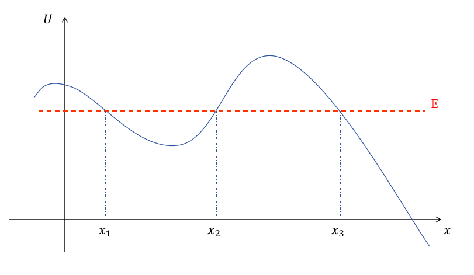
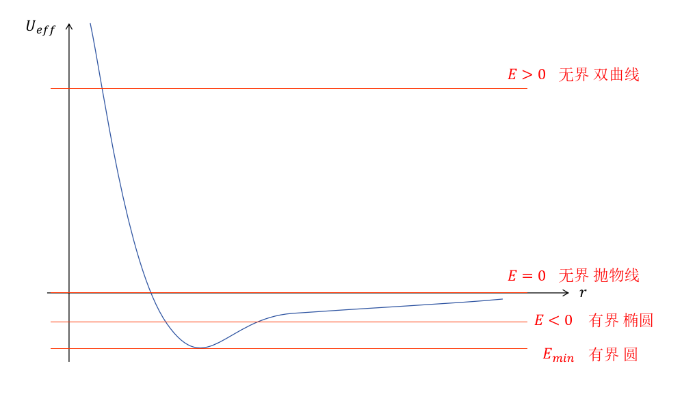

# 理论力学

## 运动方程

### 最小作用量原理

对于一个系统，记其拉格朗日量为 $L(q_1,...,q_s,\dot{q}_1,...\dot{q}_s,t)$ 或 $L(q,\dot{q},t)$

作用量 (action) $S=\int_{t_1}^{t_2} L\mathrm{d}t$

最小作用量原理 (principle of least action) $\delta S=0$

可以推出拉格朗日方程

$$
\frac{\partial L}{\partial q} - \frac{\mathrm{d}}{\mathrm{d}t}\frac{\partial L}{\partial \dot{q}} = 0
$$

### 拉格朗日量的形式

将拉格朗日方程 $\dfrac{\partial L}{\partial q} = \dfrac{\mathrm{d}}{\mathrm{d}t}\dfrac{\partial L}{\partial \dot{q}}$ 与牛顿第二定律 $\vec{F} = \dfrac{\mathrm{d}}{\mathrm{d}t} \vec{p}$

可以发现：广义力 $\dfrac{\partial L}{\partial q}$ ，广义动量 $\dfrac{\partial L}{\partial \dot{q}}$

系统的拉格朗日量 $L=T-U$ （其中 $T$ 为动能，$U$ 为势能）

## 守恒律

### 能量守恒

当空间具有时间平移对称性 $\dfrac{\partial L}{\partial t}=0$

则 
$$
\frac{\mathrm{d}}{\mathrm{d}t}\left( \frac{\partial L}{\partial \dot{q}}\dot{q}-L \right) = 0
$$

能量 $E = \dfrac{\partial L}{\partial \dot{q}}\dot{q}-L$ 守恒

### 动量守恒

当空间具有空间平移对称性 $\dfrac{\partial L}{\partial \vec{r}} = 0$

则
$$
\frac{\mathrm{d}}{\mathrm{d}t}\left(\frac{\partial L}{\partial \dot{q}}\right)=0
$$

动量 $\vec{p} = \dfrac{\partial L}{\partial \dot{q}}$ 守恒

### 角动量守恒

当空间具有空间旋转对称性 (旋转 $\delta\varphi\Rightarrow\delta L=0$)

则
$$
\frac{\mathrm{d}}{\mathrm{d}t}(\vec{r}\times\vec{p})=0
$$

角动量 $\vec{r}\times\vec{p}$ 守恒

### 参考系

质心 $\displaystyle\vec{R}=\frac{1}{M}\sum_\alpha m_\alpha \vec{r}_\alpha$

质心系中系统动量 $\vec{p}'=0$

从参考系 $K$ 到参考系 $K'$ 有关系
$$
\left\{
\begin{array}{l}
\vec{p}=\vec{p}'+M\vec{V} \\
E=E'+\vec{V}\cdot\vec{p}'+\dfrac{1}{2}MV^2 \\
\vec{J}=\vec{J}'+M\vec{R}\times\vec{V}
\end{array}
\right.
$$

特别地，当 $K'$ 为质心参考系时
$$
\left\{
\begin{array}{l}
\vec{p}=M\vec{V} \\
E=E'+\dfrac{1}{2}MV^2 \\
\vec{J}=\vec{J}'+\vec{R}\times\vec{p}
\end{array}
\right.
$$

### 相似性

对于一个系统， $T\propto v^2,U\propto r^k$

当系统的位矢 $\vec{r}\rightarrow a\vec{r}$ ，时间 $t\rightarrow bt$

可以由拉格朗日方程性质得到： $b=a^{1-k/2}$ 

即

$$
\frac{t'}{t}=\left(\frac{l'}{l}\right)^{1-k/2}
$$

::: info example
| k值 | 实例 |
|:---:|:---:|
|$U\propto r^{-1}\Rightarrow t'/t=(l'/l)^{3/2}$|开普勒第三定律|
|$U\propto r\Rightarrow t'/t=(l'/l)^{1/2}$|自由落体 $h=\dfrac{1}{2}gt^2$|
|$U\propto x^2\Rightarrow t'/t=(l'/l)^0$|弹簧振子周期独立于振幅|
:::

### 位力定理

记系统的动能 $T\propto v^2$ 势能 $U\propto r^k$

有 $2\langle T\rangle=kU$

其中按时间平均 $\displaystyle\langle f\rangle=\lim_{\tau\rightarrow\infty}\frac{1}{\tau}\int_0^\tau f\mathrm{d}t$

## 中心力场

### 一维运动

对于一维运动 $L=\dfrac{1}{2}m\dot{x}^2-U(x)$

其轨迹（path）$\displaystyle t=\sqrt{\frac{m}{2}}\int\frac{\mathrm{d}x}{\sqrt{E-U}}$

对于有界运动，有
$$
T=\sqrt{2m}\int_{x_1}^{x_2}\frac{\mathrm{d}x}{\sqrt{E-U}}
$$
$$
U(x)=E \Rightarrow x_1(E),x_2(E)
$$

### 约化质量

对于两体问题 $L=\dfrac{1}{2}m_1\left|\dot{\vec{r}}_1\right|^2+\dfrac{1}{2}m_1\left|\dot{\vec{r}}_2\right|^2-U(\left|\vec{r}_1-\vec{r}_2\right|)$

$$
L=\frac{1}{2}\frac{m_1m_2}{m_1+m_2}\left|\dot{\vec{r}}\right|^2-U(r)
$$

约化质量（reduced mass） $m=\dfrac{m_1m_2}{m_1+m_2}$

### 中心力场的运动

对于中心力场 $L=\dfrac{1}{2}m(\dot{r}^2+r^2\dot{\varphi}^2)-U(r)$

::: info 注：
上式中 $m$ 是约化质量，位矢 $\vec{r}=(r,\varphi)$ 的坐标原点是中心天体中心，而非二者的质心。
:::

- 角动量守恒 $M=mr^2\dot{\varphi}=const$
- $E=\dfrac{1}{2}m\dot{r}^2+\dfrac{M^2}{2mr^2}+U(r),E=const$
- 轨迹（path） $\displaystyle t=\int\left(\frac{2}{m}(E-U)-\frac{M^2}{m^2r^2}\right)^{-1/2}\mathrm{d}r$
- 轨迹的形状（shape） $\displaystyle \varphi=\int\frac{M}{mr^2}\left(\frac{2}{m}(E-U)-\frac{M^2}{m^2r^2}\right)^{-1/2}\mathrm{d}r$
- 有效势能 $U_{eff}=U+\dfrac{M^2}{2mr^2}$ ，离心能 $\dfrac{M^2}{2mr^2}$
- 转折点 $\dot{r}=0,\dot{\varphi}\neq 0\Leftrightarrow E=U_{eff}$
- 闭合轨道
$$
\Delta\varphi=2\int_{r_{min}}^{r_{max}}\frac{M}{r^2}\left(2m(E-U)-\frac{M^2}{r^2}\right)^{-1/2}\mathrm{d}r
$$
如果轨道封闭，有
$$
\Delta\varphi=2\pi\frac{n_1}{n_2}\ (n_1,n_2\in\mathbb{Z})
$$
Bertrand定理：仅当 $U\propto r^{-1}$ 或 $U\propto r^2$ 时轨道闭合

### 开普勒问题

对于引力 $U=-\dfrac{k}{r}\ (k>0)$
$$
U_{eff}=-\frac{k}{r}+\frac{M^2}{2mr^2}
$$

轨迹的形状
$$
r(\varphi)=\frac{M^2}{mk}\left(\sqrt{1+\frac{2mEM^2}{m^2k^2}}\cos\varphi+1\right)^{-1}
$$

偏心率（eccentricity） $\displaystyle e=\sqrt{1+\frac{2EM^2}{mk^2}}$

半通径（lootus rectum） $p=\dfrac{M^2}{mk}$

有
$$
r(\varphi)=\frac{p}{1+e\cos\varphi}
$$

#### 椭圆

半长轴 $a=\dfrac{p}{1-e^2}=-\dfrac{k}{2E}$

半短轴 $b=\dfrac{p}{\sqrt{1-e^2}}=\dfrac{M}{\sqrt{-2mE}}$

周期 $T^2=4\pi^2\dfrac{m}{k}a^3=\dfrac{4\pi^2}{G(m_1+m_2)}a^3$

从 $\varphi_1$ 对 $\varphi_2$ 的时间间隔 $\displaystyle\Delta t=\dfrac{2m}{M}\Delta A=\dfrac{2m}{M}\int_{\varphi_1}^{\varphi_2}\dfrac{1}{2}\left(\dfrac{p}{1+e\cos\theta}\right)^2\mathrm{d}\varphi$

轨迹 $\displaystyle t(r)=\sqrt{\frac{ma^3}{k}}(\theta-e\cos\theta),\quad r=a(1-e\cos\theta)$

#### 双曲线

半长轴 $a=\dfrac{p}{e^2-1}=\dfrac{k}{2E}$

半短轴 $b=\dfrac{p}{\sqrt{e^2-1}}=\dfrac{M}{2mE}$

轨迹 $\displaystyle t(r)=\sqrt{\frac{ma^3}{k}}(e\sinh\xi-\xi),\quad r=a(e\cosh\xi-1)$

#### 抛物线

轨迹 $\displaystyle t(r)=\sqrt{\frac{mp^3}{k}}\frac{1}{2}\eta(1+\frac{1}{3}\eta^3),\quad \sqrt{2r-p}=\eta\sqrt{p}$

### 比内公式

之前通过运动积分推导出开普勒问题的轨迹形状，现在用拉格朗日运动方程导出：

拉格朗日量 $L=\dfrac{1}{2}m(\dot{r}^2+r^2\dot{\varphi}^2)-U(r)$

$$
\frac{\mathrm{d}}{\mathrm{d}t}\left(\frac{\partial L}{\partial\dot{r}}\right)=\frac{\partial L}{\partial r}\Leftrightarrow m(\ddot{r}-r\dot{\varphi}^2)=-\frac{\mathrm{d}U}{\mathrm{d}r}=-\frac{k}{r^2}
$$

该方程为非线性方程，做变换 $w=\dfrac{1}{r}$ ，有

$$
\frac{\mathrm{d}^2w}{\mathrm{d}\varphi^2}+w=\frac{mk}{M^2}
$$

现在方程为线性常微分方程，称为比内公式。

可解出 $w=C\cos(\varphi+\varphi_0)+\dfrac{mk}{M^2}$ 即
$$
r=\frac{\frac{M^2}{mk}}{1+\sqrt{1+\frac{2EM^2}{mk^2}}\cos(\varphi+\varphi_0)}
$$

### 第三个守恒量

拉普拉斯-楞次-龙格守恒量（Laplace-Lentz-Runge）$\vec{B}=\vec{v}\times\vec{M}-\dfrac{k\vec{r}}{r}$

$\vec{B}$ 位于轨道平面，在近日点算得 $\vec{B}=ke\hat{e}_r$ ，$\vec{B}$ 是和偏心率有关的守恒量。

### 圆轨道的稳定性

1. 能量法（有效势能 $U_{eff}$ ）

2. 微扰法

有心立场的运动方程
$$
\left\{
\begin{array}{l}
\displaystyle m(\ddot{r}-r\dot{\varphi}^2)=-\frac{\mathrm{d}U}{\mathrm{d}r}=-\frac{k}{r^2} \\
mr^2\dot{\varphi}=M
\end{array}
\right.
$$
对于圆轨道 $r=r_0,\dot{\varphi}=\dot{\varphi}_0$
有
$$
\left\{
\begin{array}{l}
\displaystyle -mr_0\dot{\varphi}_0^2=-\frac{k}{r_0^2} \\
mr_0^2\dot{\varphi}_0=M
\end{array}
\right.
$$
取微扰 $r=r_0+\delta r\ (|\delta r|\ll r_0),\dot{\varphi}=\dot{\varphi}_0+\delta\dot{\varphi}\ (|\delta\dot{\varphi}|\ll \dot{\varphi}_0)$

代回上面方程可得：
$$
\delta\ddot{r}+\left(3\dot{\varphi}_0^2-\frac{2k}{mr_0^3}\right)\delta r=0
$$
由于 $\displaystyle 3\dot{\varphi}_0^2-\frac{2k}{mr_0^3}=\frac{k}{mr_0^3}>0$ 故圆轨道稳定。

- 扰动频率(kepler frequency) $\displaystyle\omega=\sqrt{\frac{k}{mr_0^3}}$

