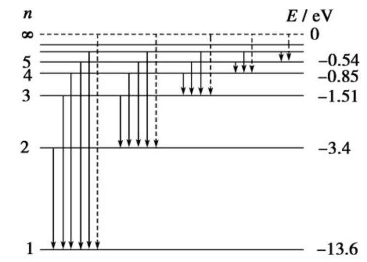
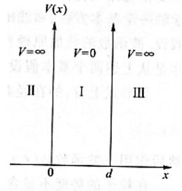
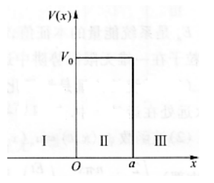
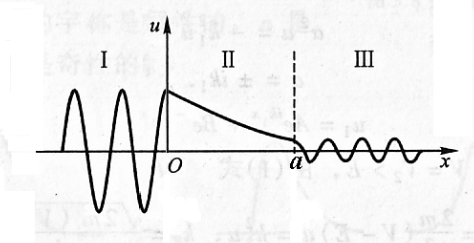
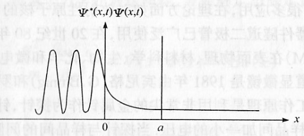
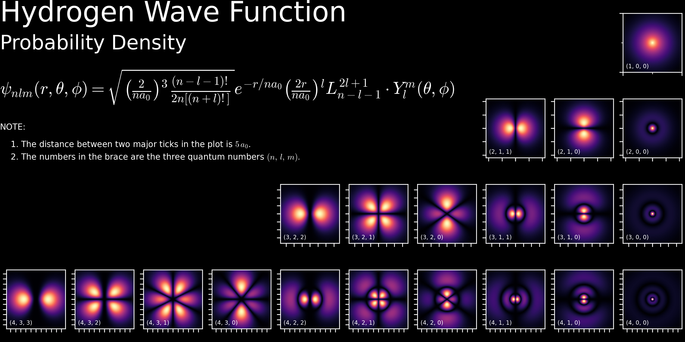
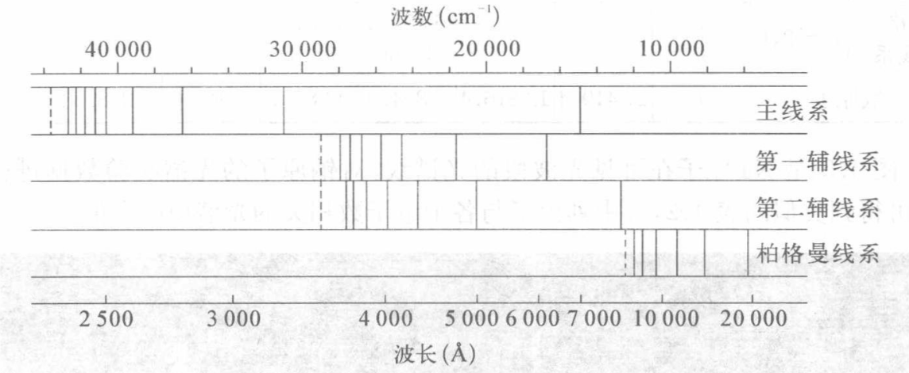
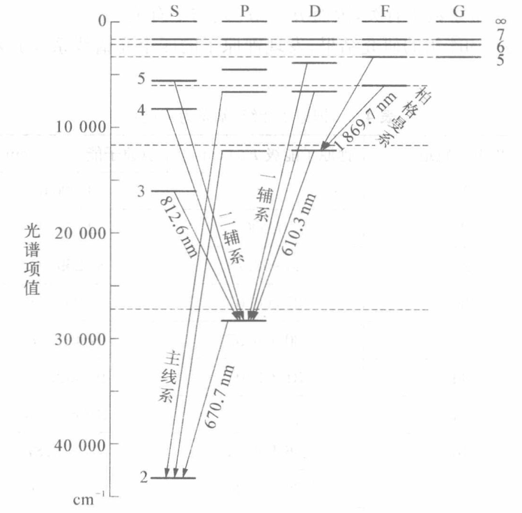
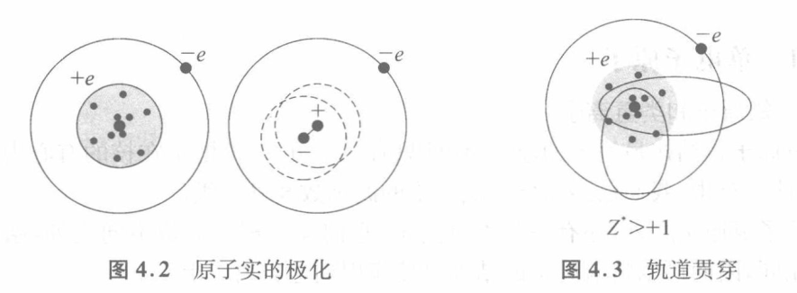
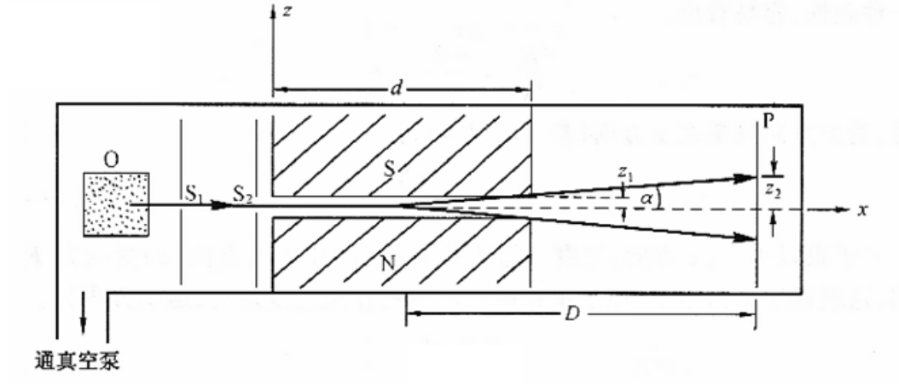

# 原子物理

## 玻尔模型

### 里德伯公式

氢原子的谱线有经验公式
$$
\tilde{\nu}=R_H(\frac{1}{m^2}-\frac{1}{n^2})
$$

其中里德伯常数 $R_H=1.097\times10^7m^{-1}$ ，
波数 $\tilde{\nu}=\dfrac{1}{\lambda}$

各线系如下表：

| 线系名字   |     |
|:---------------:|:---------------:|
| 赖曼系   | $m=1$ |
| 巴尔末系   | $m=2$ |
| 帕邢系   | $m=3$ |
| 布喇开系   | $m=4$ |
| 普丰德系   | $m=5$ |

### 玻尔模型基本假设

1. 定态假设
2. 频率条件（辐射条件或玻尔准则）：
电子跃迁释放光子 $h\nu=|E_n-E_m|$

3. 角动量量子化

### 玻尔模型

1. 氢原子能量：

- 经典 $E=-\dfrac{1}{2}\dfrac{Ze^2}{4\pi\varepsilon_0r}\quad(Z=1)$
- 量子 $E_n=-\dfrac{R_Hhc}{n^2}$

2. 电子轨道半径
$$
r_n=\frac{1}{4\pi\varepsilon_0}\frac{n^2e^2}{2hcR_H}
$$

3. $R_H$ 理论值

从光子(电磁辐射)频率导出电子轨道的另一表达式

- 经典 $\nu=\dfrac{e}{2\pi}\sqrt{\dfrac{Z}{4\pi\varepsilon_0m_er^3}}\quad(Z=1)$
- 量子 $\nu=c\tilde{\nu}=\dfrac{2R_Hc}{n^3}\quad(m\rightarrow\infty,n=m+1)$

得到 $r=r_n=n^2\sqrt[3]{\dfrac{1}{4\pi\varepsilon_0}\dfrac{e^2}{16\pi^2R_H^2c^2m_e}}$

进而有 $R_H=\dfrac{2\pi^2e^4m_e}{(4\pi\varepsilon_0)^2h^3c}$

::: info 误差
理论值 $R_H=\dfrac{2\pi^2e^4m_e}{(4\pi\varepsilon_0)^2h^3c}=1.09737\times10^7m^{-1}$

实测值 $R_H=1.9677\times10^7m^{-1}$
:::

4. more:
- 玻尔半径 $a_B=r_1\approx0.53\times10^{-10}m$
- 精细结构常数 $\alpha=\dfrac{e^2}{4\pi\varepsilon_0\hbar c}$
- 电子轨道速度量子化 $v_n=\dfrac{e^2}{4\pi\varepsilon_0\hbar}\dfrac{1}{n}=\dfrac{\alpha}{n}c$

### 玻尔理论的修正

1. 对原子核运动的修正

原子核不是静止的，考虑氢核和电子相对质心的运动，
所有出现电子质量 $m_e$ 处需替换为折合质量（约化质量） $\mu=\dfrac{m_eM}{m_e+M}$

故里德伯常量 $R_H=\dfrac{2\pi^2e^4m_e}{(4\pi\varepsilon_0)^2h^3c}=1.09737\times10^7m^{-1}$ 
应改写为
$$
R_H=\dfrac{2\pi^2e^4\mu}{(4\pi\varepsilon_0)^2h^3c}=1.0967758\times10^7m^{-1}
$$
这与实验测量值
$R_H=1.9677\times10^7m^{-1}$ 符合的很好

记 $R_\infty=\dfrac{2\pi^2e^4m_e}{(4\pi\varepsilon_0)^2h^3c}=1.09737\times10^7m^{-1}$

### 玻尔模型的结论

对于电子与微观粒子核两体绕转问题，记核为 $X$ ，核电荷数为 $Z$

该系统的里德伯常数 $R_X=R_\infty\dfrac{1}{1+m_e/M_X}$ （仅修正了质量，应用时还要修正电荷数）

1. 电子轨道半径
$$
r_n=\frac{1}{4\pi\varepsilon_0}\frac{n^2e^2}{2hcZR_X}=\frac{4\pi\varepsilon_0\hbar^2}{\mu Ze^2}n^2
$$

2. 原子能量
$$
E_n=-\frac{Z^2R_Xhc}{n^2}=-\frac{Z^2e^4\mu}{2(4\pi\varepsilon_0)^2\hbar^2}\frac{1}{n^2}
$$

::: info 常用的组合常数
$$
\hbar c=197.3eV\cdot nm=197.3MeV\cdot fm
$$
$$
hc=1240MeV\cdot fm=1240eV\cdot nm
$$
$$
m_ec^2=0.511MeV
$$
$$
m_pc^2=938.3MeV
$$
:::

### 玻尔理论的实验验证

1. 类氢体系的光谱

- 氢的同位素
- 类氢离子 $(\mathrm{HeII},\mathrm{LiIII},\mathrm{BeIV})$ ：核电荷数 $Z\neq1$ ，将 $e^2$ 替换为 $Ze^2$
- 里德伯原子 （一个外层电子+一个带 $+e$ 电荷的原子实）
- 类氢奇特原子 $(\mathrm{p},\mathrm{\mu}^+,\mathrm{e}^+,...)+(\mathrm{e}^-,\mathrm{\mu}^-,\bar{\mathrm{p}},\mathrm{\pi}^-,...)$

应用玻尔理论时做如下修正：
$$
\mu=\frac{Mm}{M+m},\ e^2=Z_1eZ_2e
$$

2. 弗兰克-赫兹实验

证实原子具有分立的能量。

- 汞原子第一激发电势

实验装置如下图：

控制 $KG$ 间电压使从 $K$ 处释放的自由电子加速到 $G$ ，然后在 $GA$ 减速，通过电流表观察能够到达 $A$ 的电子数。
控制汞蒸汽的温度压强使其平均自由程 $\bar{\lambda}$ 满足 $D_{GA}<\bar\lambda<D_{KG}$ ，则自由电子只在 $KG$ 段
会与汞原子发生碰撞。
实验结果如下：

::: info 解释
- 在 $U\in[0V,4.9V]$ 时，电子与汞原子发生弹性碰撞，随着电压增大，到达阳极的电子增多且更快，电流 $I$ 增大
- 在 $U$ 达到 $4.9V$ 时，电子与汞原子发生完全非弹性碰撞，汞原子正好吸收 $4.9eV$ 能量激发，电子能量损失，电流 $I$ 减小
- 电压 $U$ 继续增大，电子被吸收 $4.9eV$ 能量后的剩余能量不断增大，到达阳极的电子增多且更快，电流 $I$ 增大
:::

实验说明汞原子从基态到第一激发态的第一激发电势为 $4.9V$

::: info 注
由于电子在 $GA$ 边加速边与汞原子碰撞，能量一达到 $4.9V$ 便被基态汞原子吸收了，所以该实验只能测到汞原子的第一激发电势。
:::

- 检验汞原子的其他能态

改进实验装置如下：

## 量子力学初步

### 波粒二象性

#### 光的波粒二象性

康普顿散射实验

- 康普顿效应：被散射后的X射线，除了与入射X射线相同波长的成分，还多出了波长增大的成分，而且波长增加的大小随散射角的变化而不同。

- 实验现象

1. 新谱线相对原谱线的波长改变量 $\Delta\lambda$ 与且仅与散射角 $\theta$ 有关： $\Delta\lambda$ 随 $\theta$ 增大而增大； $\Delta\lambda$ 与入射波长 $\lambda$ 及散射物的性质无关。
2. 在同一散射角 $\theta$ 的情况下，用不同元素的物质作散射物，发现散射谱中原谱线强度随散射物的原子序数的增加而增强，新谱线正相反。

- 定性解释

1. 当入射的高能光子与 $Z$ 小原子中的电子或 $Z$ 大原子的外层电子作用时，由于电子束缚能小，相当于与自由电子碰撞，二者交换能量，自由电子获得动能，光子能量减小，形成波长增大的谱线（称为“变线”）。
2. 当入射的高能光子与 $Z$ 大原子内层的束缚电子作用时，由于其束缚能大，相当于与整个原子发生了弹性碰撞，二者不交换能量。光子按照原能量相干散射，形成波长不变的谱线（称为“不变线”）。

- 定量解释

入射光子与自由电子发生弹性碰撞

可以得到

$$
\Delta\lambda=\lambda_C (1-\cos\theta)
$$

其中 $\lambda_C=\dfrac{h}{m_0c}=0.0242621\overset{\circ}{\mathrm{A}}$ 称为康普顿波长，对应于静止电子的波长。

::: info 相对论中粒子的能量和动量
粒子的总能量
$$
\begin{align}
E=mc^2=m_0c^2+E_k \\
=m_0c^2/\sqrt{1-v^2/c^2}
\end{align}
$$
质能动关系
$$
E=\sqrt{p^2c^2+m_0^2c^4}
$$
动能动量关系
$$
p=\sqrt{E_k^2/c^2+2m_0E_k}
$$
$$
E_k=E-m_0c^2=\sqrt{p^2c^2+m_0^2c^4}-m_0c^2
$$
:::

#### 实物粒子波动性

1. 德布罗意假设

- 我们可以观察到的宇宙是由光和实物组成的；
- 既然光具有波粒二象性，实物也可能具有这种波粒二象性；
- 德布罗意关系式：每一个具有静质量 $m_0$ 和速度 $v$ 的物质粒子，必然由一个实在的波与之关联，以如下方程的形式与动量相关
$$
\lambda=\frac{h}{p}=\frac{h}{mv}=\frac{h}{m_0v}\sqrt{1-v^2/c^2}
$$
写成与动能的关系
$$
\lambda=\frac{h}{\sqrt{2m_0E_k}}\frac{1}{\sqrt{1+E_k/(2m_0c^2)}}
$$
- 德布罗意波（物质波，实物波）：一个具有确定能量 $E$ 、动量 $p$ 的自由粒子，总是和一列单色平面波（具有确定的频率和波长）相联系的，这个平面波的运动方程为
$$
\Psi(\vec{r},t)=Ae^{-i(\omega t-\vec{k}\cdot\vec{r})}=Ae^{-i(Et-\vec{p}\cdot\vec{r})/\hbar}
$$

2. 电子的晶体衍射实验

- 戴维孙-革末实验

- 汤姆逊实验

### 量子力学第一假设

#### 波函数及物理意义

$$
\Psi(\vec{r},t)=Ae^{-i(\omega t-\vec{k}\cdot\vec{r})}=Ae^{-i(Et-\vec{p}\cdot\vec{r})/\hbar}
$$

微观粒子的波动性反映了其运动的统计规律： $|\Psi|^2$ 代表概率（量子力学第一假设）

#### 波函数性质

1. 标准条件： $\Psi$ 必须有限、单值和连续
2. 归一化条件： $\displaystyle \iiint_{-\infty}^{+\infty}|\Psi(\vec{r}, t)|^2\mathrm{d}V=1$
3. 常数因子不定： $\Psi$ 和 $c\Psi$ 描述的概率波完全一致， $c$ 为非零常数
4. 相干叠加性：若 $\Psi_1(\vec{r}, t)$ 和 $\Psi_2(\vec{r}, t)$ 是系统可能的量子态，
那么它们的线性叠加态
$$
\Psi(\vec{r}, t)=c_1\Psi_1(\vec{r}, t)+c_2\Psi_2(\vec{r}, t)\quad c_1,c_2\neq 0
$$
也是这个系统的一个可能的量子态。

（波函数的态叠加原理，量子力学第一原理）

### 量子力学第二假设

#### 薛定谔方程

对于一个静质量为 $m$ ，动量为 $p$ ，能量为 $E$ 的粒子在势场 $V(\vec{r},t)$ 中的三维非相对论运动，有
$$
i\hbar\frac{\partial\Psi(\vec{r},t)}{\partial t}=-\frac{\hbar^2}{2m}\nabla^2\Psi(\vec{r},t)+V(\vec{r},t)\Psi(\vec{r},t)
$$
称为薛定谔方程。

#### 定态薛定谔方程

当势场与时间无关，即 $V=V(\vec{r})$ ，有

- 定态波函数 $\Psi(\vec{r},t)=u(\vec{r})e^{-iEt/\hbar}$
- 定态的薛定谔方程 
$$
-\frac{\hbar^2}{2m}\nabla^2 u(\vec{r})+V(\vec{r})u(\vec{r})=Eu(\vec{r})
$$

### 量子力学第三假设

#### 可观测量的平均值

$$
<\vec{r}>=\iiint_{-\infty}^{+\infty}\Psi^*(\vec{r},t)\cdot\vec{r}\cdot\Psi(\vec{r},t)\mathrm{d}\tau
$$
$$
<V(\vec{r})>=\iiint_{-\infty}^{+\infty}\Psi^*(\vec{r},t)\cdot V(\vec{r})\cdot\Psi(\vec{r},t)\mathrm{d}\tau
$$
$$
<\vec{p}>=\iiint_{-\infty}^{+\infty}\Psi^*(\vec{r},t)\cdot(-i\hbar\nabla)\cdot\Psi(\vec{r},t)\mathrm{d}\tau
$$
$$
<E_k>=\iiint_{-\infty}^{+\infty}\Psi^*(\vec{r},t)\cdot(-\frac{\hbar^2}{2m}\nabla^2)\cdot\Psi(\vec{r},t)\mathrm{d}\tau
$$
$$
<E>=\iiint_{-\infty}^{+\infty}\Psi^*(\vec{r},t)\cdot[-\frac{\hbar^2}{2m}\nabla^2+V(\vec{r})]\cdot\Psi(\vec{r},t)\mathrm{d}\tau
$$

#### 可观测量算符表示

对任何一个可观测量 $A$ 的平均值
$$
<A>=\iiint_{-\infty}^{+\infty}\Psi^*(\vec{r},t)\cdot[\hat{A}\cdot\Psi(\vec{r},t)]\mathrm{d}\tau
$$
其中 $\mathrm{d}\tau=\mathrm{d}x\mathrm{d}y\mathrm{d}z$ ，$\hat{A}$ 称为可观测量 $A$ 的算符。

- 量子力学第三假设：量子力学系统每个可观测量都对应着一个算符，可观测量可由相应的算符表示。

- 常见算符：
1. $\widehat{\vec{r}}=\vec{r}$
2. $\widehat{V(\vec{r})}=V(\vec{r})$
3. $\widehat{\vec{p}}=-i\hbar\nabla$
4. $\widehat{E_k}=-\dfrac{\hbar^2}{2m}\nabla^2$
5. $\widehat{H}=-\dfrac{\hbar^2}{2m}\nabla^2+V(\vec{r})$ 定态能量（哈密顿算符）
6. $\widehat{\vec{L}}=-i\hbar(\vec{r}\times\nabla)$ 角动量算符

- 本征方程：

定态薛定谔方程

$$
-\frac{\hbar^2}{2m}\nabla^2 u(\vec{r})+V(\vec{r})u(\vec{r})=Eu(\vec{r})
$$

是哈密顿算符 $\hat{H}$ 的本征方程。

### 量子力学第四假设

#### 算符的对易关系

- 量子力学第四假设：表示微观体系力学量的算符之间有确定的对易关系。（量子条件）

$$
\begin{array}{l}
\left[\widehat{x_i},\widehat{p_j}\right]=i\hbar\delta_{ij} \\
\left[\widehat{L_x},\widehat{L_y}\right]=i\hbar\widehat{L_z} \\
\left[\widehat{L^2},\widehat{L_z}\right]=0
\end{array}
$$

- 广义不确定关系：
若两个力学量 $p$ 与 $q$ 不对易，则 $p$ 与 $q$ 不能同时具有确定的值。
设 $p$ 与 $q$ 的不确定度（标准差或均方根）为 $\Delta p$ 与 $\Delta q$ ，则它们满足
$$
\Delta p\cdot\Delta q\ge\frac{1}{2}|<[\hat{p},\hat{q}]>|
$$

#### 位置动量不确定关系

- 微观粒子的同一方向的位置和动量的不确定度的乘积有下限，称为位置和动量的不确定关系（海森伯不确定关系）。

直角坐标系
$$
\left\{
\begin{array}{l}
\Delta p_x\Delta x\ge\hbar/2 \\
\Delta p_y\Delta y\ge\hbar/2 \\
\Delta p_z\Delta z\ge\hbar/2
\end{array}
\right.
$$
极坐标系
$$
\left\{
\begin{array}{l}
\Delta p_r\Delta r\ge\hbar/2 \\
\Delta p_\theta\Delta \theta\ge\hbar/2 \\
\Delta p_\varphi\Delta \varphi\ge\hbar/2
\end{array}
\right.
$$

#### 能量时间不确定关系

$$\Delta E\cdot\Delta t\ge\hbar/2$$

这里 $\Delta t$ 是特征时间尺度，而非测量时间的标准差，对应的 $\Delta E$ 代表在 $\Delta t$ 这段时间内，体系能量的确定程度。

### 典型一维定态问题

#### 一维无限深势阱

通过定态薛定谔方程求出波函数
$$
\Psi(x, t)=\left\{
\begin{array}{ll}
0 & x\in (-\infty,0)\cup(d,\infty) \\
\displaystyle \sqrt{\frac{2}{d}}\sin(\frac{n\pi x}{d})e^{-iE_nt/\hbar} & x\in [0,d]
\end{array}
\right.
$$
其中 $\displaystyle E_n=\frac{\pi^2\hbar^2}{2md^2}n^2\quad(n=1,2,3...)$

#### 势垒和势垒贯穿

当 $E<V_0$ 时，解出定态薛定谔方程的解为
$$
u(x)=\left\{
\begin{array}{ll}
A_1e^{ik_1x}+B_1e^{-ik_1x} & x<0 \\
A_2e^{k_2x}+B_2e^{-k_2x} & 0<x<a \\
A_3e^{ik_1x}+B_3e^{-ik_1x} & x>a
\end{array}
\right.
$$
其中 $\displaystyle k_1=\sqrt{\frac{2mE}{\hbar^2}},k_2=\sqrt{\frac{2m(V_0-E)}{\hbar^2}}$

- 势垒贯穿： $E<V_0$ 的粒子有一定概率穿过势垒到达 $\mathrm{III}$ 区，这种现象称为势垒贯穿，也叫量子隧道效应。
- 透射系数：
$$
T=\frac{|A_3|^2}{|A_1|^2}=\frac{16k_1^2k_2^2}{(k_1^2+k_2^2)^2(e^{-k_2a}-e^{k_2a})^2+16k_1^2k_2^2}
$$
当 $k_2a\gg 1$ 时（即势垒足够高足够厚时），有
$$
T\approx16(\frac{k_1k_2}{k_1^2+k_2^2})^2e^{-2k_2a}=\frac{16E(V_0-E)}{V_0^2}e^{\textstyle -\frac{2a}{\hbar}\sqrt{2m(V_0-E)}}
$$

## 氢原子与碱金属原子

### 氢原子

#### 波函数

- 求解波函数

核：电荷 $+Ze$ （以适用整个类氢体系），质量 $M$

电子：电荷 $-e$ ，质量 $m_e$

势函数： $\displaystyle V(r)=-\frac{Ze^2}{4\pi\varepsilon_0 r}$

质心系下氢原子的定态薛定谔方程为
$$
(-\frac{\hbar^2}{2\mu}\nabla^2-\frac{Ze^2}{4\pi\varepsilon_0 r})u(r,\theta,\varphi)=Eu(r,\theta,\varphi)
$$

分离变量进行求解得：
$$
u(r,\theta,\varphi)=R(r)\Theta(\theta)\Phi(\varphi)
$$
$$
\begin{array}{l}
\displaystyle\Phi(\varphi)=\Phi_{m_l}(\varphi)=\frac{1}{\sqrt{2\pi}}e^{im_l\varphi} \\
\displaystyle\Theta(\theta)=\Theta_{l,m_l}(\theta)=BP_l^{m_l}(\cos\theta) \\
\displaystyle R(r)=R_{n,l}(r)=C\rho^le^{-\rho/2}L_{n+1}^{2l+1}(\rho),\quad \rho=\frac{2Z}{na_B}r
\end{array}
$$
$$
n=1,2,3...;\quad l=0,1,2,...,n-1;\quad m_l=0,\pm1,\pm2,...,\pm l
$$

其中主量子数 $\displaystyle n=\frac{Ze^2}{4\pi\varepsilon_0\hbar}\sqrt{\frac{\mu}{2|E|}}$

故 $\displaystyle E_n=-\frac{1}{n^2}\frac{\mu}{2}(\frac{Ze^2}{4\pi\varepsilon_0\hbar})^2$

| $n$ | $l$ | $m_l$ | $u_{n,l,m_l}(r,\theta,\varphi)$ |
|:--:|:--:|:--:|:--:|
| $1$ | $0$ | $0$ | $\displaystyle\frac{1}{\sqrt{\pi}}\left(\frac{Z}{a_0}\right)^{3/2}\exp\left(-\frac{Zr}{a_0}\right)$ |
| $2$ | $0$ | $0$ | $\displaystyle\frac{1}{4\sqrt{2\pi}}\left(\frac{Z}{a_0}\right)^{3/2}\left(2-\frac{Zr}{a_0}\right)\exp\left(-\frac{Zr}{2a_0}\right)$ |
| $2$ | $1$ | $0$ | $\displaystyle\frac{1}{4\sqrt{2\pi}}\left(\frac{Z}{a_0}\right)^{3/2}\frac{Zr}{a_0}\cos\theta\exp\left(-\frac{Zr}{2a_0}\right)$ |
| $2$ | $1$ | $\pm1$ | $\displaystyle\frac{1}{8\sqrt{\pi}}\left(\frac{Z}{a_0}\right)^{3/2}\frac{Zr}{a_0}\sin\theta\exp\left(-\frac{Zr}{2a_0}\right)e^{\pm i\varphi}$ |
| $3$ | $0$ | $0$ | $\displaystyle\frac{1}{81\sqrt{3\pi}}\left(\frac{Z}{a_0}\right)^{3/2}\left(27-18\frac{Zr}{a_0}+2\frac{Z^2r^2}{a_o^2}\right)\exp\left(-\frac{Zr}{3a_0}\right)$ |
| $3$ | $1$ | $0$ | $\displaystyle\frac{\sqrt{2}}{81\sqrt{\pi}}\left(\frac{Z}{a_0}\right)^{3/2}\left(6-\frac{Zr}{a_0}\right)\frac{Zr}{a_0}\cos\theta\exp\left(-\frac{Zr}{3a_0}\right)$ |
| $3$ | $1$ | $\pm1$ | $\displaystyle\frac{1}{81\sqrt{\pi}}\left(\frac{Z}{a_0}\right)^{3/2}\left(6-\frac{Zr}{a_0}\right)\frac{Zr}{a_0}\sin\theta\exp\left(-\frac{Zr}{3a_0}\right)e^{\pm i\varphi}$ |
| $3$ | $2$ | $0$ | $\displaystyle\frac{1}{81\sqrt{6\pi}}\left(\frac{Z}{a_0}\right)^{3/2}\left(\frac{Zr}{a_0}\right)^2(3\cos^2\theta-1)\exp\left(-\frac{Zr}{3a_0}\right)$ |
| $3$ | $2$ | $\pm1$ | $\displaystyle\frac{1}{81\sqrt{\pi}}\left(\frac{Z}{a_0}\right)^{3/2}\left(\frac{Zr}{a_0}\right)^2\sin\theta\cos\theta\exp\left(-\frac{Zr}{3a_0}\right)e^{\pm i\varphi}$ |
| $3$ | $2$ | $\pm2$ | $\displaystyle\frac{1}{162\sqrt{\pi}}\left(\frac{Z}{a_0}\right)^{3/2}\left(\frac{Zr}{a_0}\right)^2\sin^2\theta\exp\left(-\frac{Zr}{3a_0}\right)e^{\pm 2i\varphi}$ |

#### 概率密度

1. $(\varphi,\varphi+\mathrm{d}\varphi)$ 区间：
$$
P(\varphi)\mathrm{d}\varphi=\frac{1}{2\pi}\mathrm{d}\varphi
$$

2. $(\theta,\theta+\mathrm{d}\theta)$ 区间：
$$
P_{l,m_l}(\theta)\mathrm{d}\theta=|\Theta_{l,m_l}(\theta)|^2\sin\theta\mathrm{d}\theta
$$

3. 角向分布：
$$
P_{l,m_l}(\theta,\varphi)\mathrm{d}\Omega=|Y_l^{m_l}(\theta,\varphi)|^2\mathrm{d}\Omega,\quad\mathrm{d}\Omega=\sin\theta\mathrm{d}\theta\mathrm{d}\varphi
$$

4. 径向分布 $(r,r+\mathrm{d}r)$ 区间：
$$
P_{n,l}(r)\mathrm{d}r=|R_{n,l}(r)|^2r^2\mathrm{d}r
$$

- 玻尔理论中的轨道半径 $r_n=n^2a_B$ 对应 $l=n-1$ 时，电子径向概率分布最大的半径（最概然半径，最可几半径，电子云密度最大处半径）
- $\displaystyle<r>=<r_{n,l}>=\int_0^\infty R^*(r)rR(r)r^2\mathrm{d}r=\frac{1}{2}[3n^2-l(l+1)]a_B$

5. 电子云图 $|\Psi|^2$

#### 角动量

1. 轨道角动量大小

角动量平方算符 $\widehat{L^2}$ 满足本征方程
$$
\widehat{L^2}Y_l^{m_l}(\theta,\varphi)=l(l+1)\hbar^2Y_l^{m_l}(\theta,\varphi)
$$
本征值 $\widehat{L^2}=l(l+1)\hbar^2$

则角动量大小 $L_l=\sqrt{l(l+1)}\hbar$

（ $l$ 称为轨道角动量量子数，简称轨道角量子数）

2. 轨道角动量方向

- 角动量 $z$ 向分量： $L_{lz}=m_l\hbar$
- 轨道磁量子数： $m_l$
- $x,y$ 向分量： $<L_{lx}>=0,<L_{ly}>=0$
$$
\left\{\begin{array}{l}
[\widehat{L}_{lx},\widehat{L}_{ly}]=ih\widehat{L}_z\neq0 \\
[\widehat{L}_{ly},\widehat{L}_{lz}]\neq0 \\
[\widehat{L}_{lx},\widehat{L}_{lz}]\neq0
\end{array}\right.
$$

3. 角动量定义：

若一个算符包含三个分量
$$
\hat{j}=(\hat{j}_x,\hat{j}_y,\hat{j}_z)
$$
且它的三个分量满足如下基本对易关系
$$
\begin{array}{l}
[\hat{j}_x,\hat{j}_y]=i\hbar\hat{j}_z \\
[\hat{j}_y,\hat{j}_z]=i\hbar\hat{j}_x \\
[\hat{j}_z,\hat{j}_x]=i\hbar\hat{j}_y
\end{array}
$$
无论其物理意义如何，均可称为角动量算符。

4. 角动量守恒：

在量子力学中，设力学量 $F$ 对应算符 $\widehat{F}$ ，若
$$
\frac{\mathrm{d}\widehat{F}}{\mathrm{d}t}=0
$$
则该力学量守恒。

#### 量子数

1. 轨道角量子数 $l$
- $L_l=\sqrt{l(l+1)}\hbar,\quad l=0,1,2,...,n-1$
- 其值习惯上用光谱学标记表示，$l=0,1,2,3,4,5,6,7...$ 分别对应小写字母：s,p,d,f,g,h,i,k...

2. 轨道磁量子数 $m_l$
- $L_{lz}=m_l\hbar,\quad m_l=-l,-l+1,...,l$

3. 主量子数 $n$
- $\displaystyle E_n=-\frac{1}{n^2}\cdot\frac{1}{2}\mu\left(\frac{Ze^2}{4\pi\varepsilon_0\hbar}\right)^2$

4. 简并（degeneracy）：不同的本征函数对应相同的本征值

能级 $E_n$ 是 $n^2$ 重简并的。

::: info 简并的本质是系统的对称性
1. “球对称” 能量大小与 $z$ 轴取向无关（对应磁量子数 $m_l$）
2. “势函数 $V$ 与 $r$ 简单成反比” 能量对 $l$ 简并
:::

### 原子的辐射跃迁与选择定则

#### 辐射跃迁

- 辐射跃迁：光子形式传递能量
- 碰撞跃迁：动能形式传递能量

- 谱线强弱因素：
1. 相应能量的光子数
2. 相应能级的跃迁原子数目
3. 能级 $E_i$ 的原子布居数（atom population，即单位体积内的原子数）和跃迁概率

#### 跃迁的选择定则

- 选择定则：电偶极跃迁概率 $\displaystyle\lambda_{21}=\frac{16\pi^3\nu_{21}^3}{3\varepsilon_0hc^3}|D_{21}|^2$ 不为零。
即
$$
\left\{\begin{array}{l}
\Delta n \text{任意} \\
\Delta l=l_2-l_1=\pm1 \\
\Delta m_l=m_{l2}-m_{l1}=0,\pm1
\end{array}\right.
$$

1.
- 允许跃迁（容许跃迁，allowed transition）
- 稳态（stable state）
- 允许线

2.
- 禁戒跃迁（forbidden transition）
- 亚稳态（metastable state）
- 禁线（forbidden line），半禁线（semi-forbidden line）

3. 宇称（parity）：对波函数作空间反演
$$
\widehat{P}u(\vec{r})=u(-\vec{r})=\pm u(\vec{r})
$$
- 偶宇称：本征值 $\eta=+1$ （当 $l$ 为偶数）
- 奇宇称：本征值 $\eta=-1$ （当 $l$ 为奇数）

### 碱金属原子

#### 光谱特点

锂原子的光谱：

- 主线系：波长范围最宽，第一条在可见光的红光区，其余均位于紫外；
- 第一辅线系：位于可见光区域，也叫漫线系，边缘模糊；
- 第二辅线系：位于可见光和红外区域，第一辅线系和第二辅线系的线系限相同，也叫锐线系，边缘清晰；
- 柏格曼系：位于红外区域，也叫基线系，频率最低。

#### 能级结构和允许跃迁

- 主线系：np->2s (principal 主)
- 一辅系：nd->2p (diffuse 漫)
- 二辅系：ns->2p (sharp 锐)
- 柏格曼系：nf->3d (fundamental 基)

#### 光谱的理论解释

1. 能级公式：

$$
E_{n,l}=-Z^{*2}\frac{Rhc}{n^2}
$$

其中 $Z^{*}\neq 1$ 为原子实的有效电荷数。

- 原子实极化 & 贯穿效应

$$
\begin{align}
E_{n,l}&=-Z^{*2}\frac{Rhc}{n^2}=-\frac{Rhc}{(n/Z^*)^2}=-\frac{Rhc}{n^{*2}} \\
&=-\frac{Rhc}{(n-\Delta_{n,l})^2}=-\frac{(Z-\sigma)^2Rhc}{n^2}
\end{align}
$$

- 有效主量子数 $n^*=n/Z^*$
- 量子数亏损（量子数修正） $\Delta_{n,l}=n-n^*$
- 屏蔽常数 $\sigma=Z-Z^*$

2. 波数公式

$\tilde{\nu}=T_m-T_n$

- 固定光谱项 $T_m$
- 跑动光谱项 $T_n$
- 碱金属光谱项 $\displaystyle T_{n,l}=-\frac{E_{n,l}}{hc}=\frac{Z^{*2}R}{n^2}=\frac{R}{(n-\Delta_{n,l})^2}$
- 线系限： $n=\infty$ 时，即各线系的最短波长
- 共振线： np->ns 的光谱线

则锂原子的波数公式如下：

- 主线系 $\displaystyle \tilde{\nu}=\frac{R}{(2-\Delta_{2s})^2}-\frac{R}{(n-\Delta_{np})^2},\ n=2,3,4,...$
- 第一辅线系 $\displaystyle \tilde{\nu}=\frac{R}{(2-\Delta_{2p})^2}-\frac{R}{(n-\Delta_{nd})^2},\ n=3,4,5,...$
- 第二辅线系 $\displaystyle \tilde{\nu}=\frac{R}{(2-\Delta_{2p})^2}-\frac{R}{(n-\Delta_{ns})^2},\ n=3,4,5,...$
- 柏格曼系 $\displaystyle \tilde{\nu}=\frac{R}{(2-\Delta_{3d})^2}-\frac{R}{(n-\Delta_{nf})^2},\ n=4,5,6,...$

### 电子的磁矩

#### 电子的轨道磁矩

- 电子轨道磁矩 $\displaystyle \vec{\mu}=-\frac{e}{2m_e}\vec{p}_l$ 与轨道角动量 $\vec{p}_l$ 反向
- 旋磁比(gyromagnetic ratio，或磁旋比 magnetogyric ratio) $\displaystyle \gamma=\frac{|\vec\mu|}{|\vec p_l|}=\frac{e}{2m_e}$

$$
\mu_l=-\frac{e}{2m_e}\sqrt{l(l+1)}\hbar\triangleq-\sqrt{l(l+1)}\mu_B
$$

- 电子的玻尔磁子 $\displaystyle \mu_B=\frac{e\hbar}{2m_e}=9.273\times10^{-24}J/T=0.5788\times10^{-4}eV/T$

$$
\mu_{lz}=-\frac{e}{2m_e}p_{lz}=-m_l\mu_B,\ (m_l=l,l-1,...,-l)
$$

#### 磁场中的电子轨道磁矩

1. 磁矩与磁场的相互作用使系统具有磁势能 $\Delta E$
$$
\Delta E=m_l\mu_BB,\quad m_l=0,\pm1,\pm2,...,\pm l
$$
原子能量对磁量子数 $m_l$ 不再简并，进一步分裂。

2. 在匀强磁场中，电子轨道磁矩 $\mu_l$ 以角速度 $\omega$ 绕 $\vec B$ 做拉莫尔进动。
$$
\vec{\omega}=\gamma\vec{B}
$$

3. 非匀强磁场中，一束原子垂直磁场方向入射，当 $l$ 相同，$m_l$ 不同，原子受到的平移力 $F_z$ 将有 $(2l+1)$ 各不同大小，相应的原子束会分裂成 $(2l+1)$ 束。

#### 施特恩-格拉赫实验

