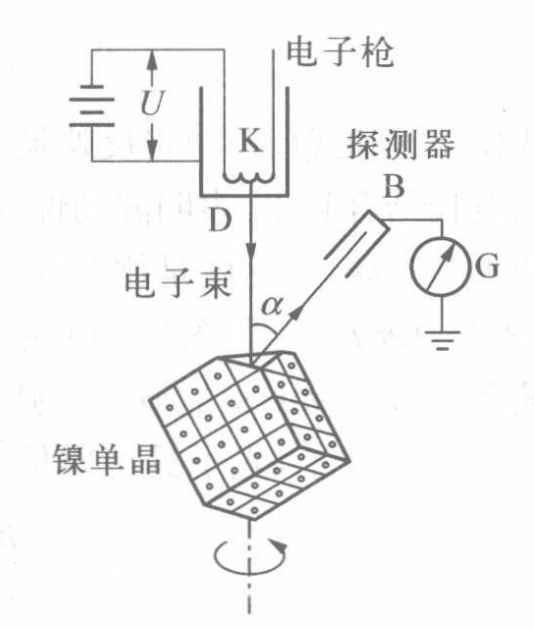

# 原子物理

## 玻尔模型

### 里德伯公式

氢原子的谱线有经验公式
$$
\tilde{\nu}=R_H(\frac{1}{m^2}-\frac{1}{n^2})
$$

其中里德伯常数 $R_H=1.097\times10^7m^{-1}$ ，
波数 $\tilde{\nu}=\dfrac{1}{\lambda}$

各线系如下表：

| 线系名字   |     |
|:---------------:|:---------------:|
| 赖曼系   | $m=1$ |
| 巴尔末系   | $m=2$ |
| 帕邢系   | $m=3$ |
| 布喇开系   | $m=4$ |
| 普丰德系   | $m=5$ |

### 玻尔模型基本假设

1. 定态假设
2. 频率条件（辐射条件或玻尔准则）：
电子跃迁释放光子 $h\nu=|E_n-E_m|$
3. 角动量量子化

### 玻尔模型

1. 氢原子能量：

- 经典 $E=-\dfrac{1}{2}\dfrac{Ze^2}{4\pi\varepsilon_0r}\quad(Z=1)$
- 量子 $E_n=-\dfrac{R_Hhc}{n^2}$

2. 电子轨道半径
$$
r_n=\frac{1}{4\pi\varepsilon_0}\frac{n^2e^2}{2hcR_H}
$$

3. $R_H$ 理论值

从光子(电磁辐射)频率导出电子轨道的另一表达式

- 经典 $\nu=\dfrac{e}{2\pi}\sqrt{\dfrac{Z}{4\pi\varepsilon_0m_er^3}}\quad(Z=1)$
- 量子 $\nu=c\tilde{\nu}=\dfrac{2R_Hc}{n^3}\quad(m\rightarrow\infty,n=m+1)$

得到 $r=r_n=n^2\sqrt[3]{\dfrac{1}{4\pi\varepsilon_0}\dfrac{e^2}{16\pi^2R_H^2c^2m_e}}$

进而有 $R_H=\dfrac{2\pi^2e^4m_e}{(4\pi\varepsilon_0)^2h^3c}$

::: info 误差
理论值 $R_H=\dfrac{2\pi^2e^4m_e}{(4\pi\varepsilon_0)^2h^3c}=1.09737\times10^7m^{-1}$

实测值 $R_H=1.9677\times10^7m^{-1}$
:::

4. more:
- 玻尔半径 $a_B=r_1$
- 精细结构常数 $\alpha=\dfrac{e^2}{4\pi\varepsilon_0\hbar c}$
- 电子轨道速度量子化 $v_n=\dfrac{e^2}{4\pi\varepsilon_0\hbar}\dfrac{1}{n}=\dfrac{\alpha}{n}c$

### 玻尔理论的修正

1. 对原子核运动的修正

原子核不是静止的，考虑氢核和电子相对质心的运动，
所有出现电子质量 $m_e$ 处需替换为折合质量（约化质量） $\mu=\dfrac{m_eM}{m_e+M}$

故里德伯常量 $R_H=\dfrac{2\pi^2e^4m_e}{(4\pi\varepsilon_0)^2h^3c}=1.09737\times10^7m^{-1}$ 
应改写为
$$
R_H=\dfrac{2\pi^2e^4\mu}{(4\pi\varepsilon_0)^2h^3c}=1.0967758\times10^7m^{-1}
$$
这与实验测量值
$R_H=1.9677\times10^7m^{-1}$ 符合的很好

记 $R_\infty=\dfrac{2\pi^2e^4m_e}{(4\pi\varepsilon_0)^2h^3c}=1.09737\times10^7m^{-1}$

### 玻尔模型的结论

对于电子与微观粒子核两体绕转问题，记核为 $X$ ，核电荷数为 $Z$

该系统的里德伯常数 $R_X=R_\infty\dfrac{1}{1+m_e/M_X}$

1. 电子轨道半径
$$
r_n=\frac{1}{4\pi\varepsilon_0}\frac{n^2e^2}{2hcZR_X}=\frac{4\pi\varepsilon_0\hbar^2}{\mu Ze^2}n^2
$$

2. 原子能量
$$
E_n=-\frac{Z^2R_Xhc}{n^2}=-\frac{Z^2e^4\mu}{2(4\pi\varepsilon_0)^2\hbar^2}\frac{1}{n^2}
$$

### 玻尔理论的实验验证

1. 类氢体系的光谱

- 氢的同位素
- 类氢离子 $(\mathrm{HeII},\mathrm{LiIII},\mathrm{BeIV})$ ：核电荷数 $Z\neq1$ ，将 $e^2$ 替换为 $Ze^2$
- 里德伯原子 （一个外层电子+一个带 $+e$ 电荷的原子实）
- 类氢奇特原子 $(\mathrm{p},\mathrm{\mu}^+,\mathrm{e}^+,...)+(\mathrm{e}^-,\mathrm{\mu}^-,\bar{\mathrm{p}},\mathrm{\pi}^-,...)$

应用玻尔理论时做如下修正：
$$
\mu=\frac{Mm}{M+m},\ e^2=Z_1eZ_2e
$$

2. 弗兰克-赫兹实验

证实原子具有分立的能量。

- 汞原子第一激发电势

实验装置如下图：

控制 $KG$ 间电压使从 $K$ 处释放的自由电子加速到 $G$ ，然后在 $GA$ 减速，通过电流表观察能够到达 $A$ 的电子数。
控制汞蒸汽的温度压强使其平均自由程 $\bar{\lambda}$ 满足 $D_{GA}<\bar\lambda<D_{AK}$ ，则自由电子只在 $GA$ 段
会与汞原子发生碰撞。
实验结果如下：

::: info 解释
- 在 $U\in[0V,4.9V]$ 时，电子与汞原子发生弹性碰撞，随着电压增大，到达阳极的电子增多且更快，电流 $I$ 增大
- 在 $U$ 达到 $4.9V$ 时，电子与汞原子发生完全非弹性碰撞，汞原子正好吸收 $4.9eV$ 能量激发，电子能量损失，电流 $I$ 减小
- 电压 $U$ 继续增大，电子被吸收 $4.9eV$ 能量后的剩余能量不断增大，到达阳极的电子增多且更快，电流 $I$ 增大
:::

实验说明汞原子从基态到第一激发态的第一激发电势为 $4.9V$

::: info 注
由于电子在 $GA$ 边加速边与汞原子碰撞，能量一达到 $4.9V$ 便被基态汞原子吸收了，所以该实验只能测到汞原子的第一激发电势。
:::

- 检验汞原子的其他能态

改进实验装置如下：

## 量子力学初步

### 波粒二象性

#### 光的波粒二象性

康普顿散射实验

- 康普顿效应：被散射后的X射线，除了与入射X射线相同波长的成分，还多出了波长增大的成分，而且波长增加的大小随散射角的变化而不同。

- 实验现象

1. 新谱线相对原谱线的波长改变量 $\Delta\lambda$ 与且仅与散射角 $\theta$ 有关： $\Delta\lambda$ 随 $\theta$ 增大而增大； $\Delta\lambda$ 与入射波长 $\lambda$ 及散射物的性质无关。
2. 在同一散射角 $\theta$ 的情况下，用不同元素的物质作散射物，发现散射谱中原谱线强度随散射物的原子序数的增加而增强，新谱线正相反。

- 定性解释

1. 当入射的高能光子与 $Z$ 小原子中的电子或 $Z$ 大原子的外层电子作用时，由于电子束缚能小，相当于与自由电子碰撞，二者交换能量，自由电子获得动能，光子能量减小，形成波长增大的谱线（称为“变线”）。
2. 当入射的高能光子与 $Z$ 大原子内层的束缚电子作用时，由于其束缚能大，相当于与整个原子发生了弹性碰撞，二者不交换能量。光子按照原能量相干散射，形成波长不变的谱线（称为“不变线”）。

- 定量解释

入射光子与自由电子发生弹性碰撞

可以得到

$$
\Delta\lambda=\lambda_C (1-\cos\theta)
$$

其中 $\lambda_C=\dfrac{h}{m_0c}=0.0242621\overset{\circ}{\mathrm{A}}$ 称为康普顿波长，对应于静止电子的波长。

::: info 相对论中粒子的能量和动量
粒子的总能量
$$
\begin{align}
E=mc^2=m_0c^2+E_k \\
=m_0c^2/\sqrt{1-v^2/c^2}
\end{align}
$$
质能动关系
$$
E=\sqrt{p^2c^2+m_0^2c^4}
$$
:::

#### 实物粒子波动性

1. 德布罗意假设

- 我们可以观察到的宇宙是由光和实物组成的；
- 既然光具有波粒二象性，实物也可能具有这种波粒二象性；
- 德布罗意关系式：每一个具有质量 $m$ 和速度 $v$ 的物质粒子，必然由一个实在的波与之关联，以如下方程的形式与动量相关
$$
\lambda=\frac{h}{p}=\frac{h}{mv}=\frac{h}{m_0v}\sqrt{1-v^2/c^2}
$$
- 德布罗意波（物质波，实物波）：一个具有确定能量 $E$ 、动量 $p$ 的自由粒子，总是和一列单色平面波（具有确定的频率和波长）相联系的，这个平面波的运动方程为
$$
\Psi(\vec{r},t)=Ae^{-i(\omega t-\vec{k}\cdot\vec{r})}=Ae^{-i(Et-\vec{p}\cdot\vec{r})/\hbar}
$$

2. 电子的晶体衍射实验

- 戴维孙-革末实验

- 汤姆逊实验

