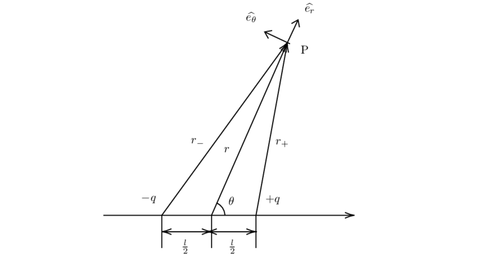

# 电偶极子和磁偶极子

## 电偶极子的电场分布

各个物理量如上图所示，
电偶极距 $p_e=ql$，
当场点 $P$ 与电偶极子的中心距离 $r$ 满足
$r\gg l$ 时，其电场强度
$$
\vec{E}(r,\theta)=\frac{p_e}{4\pi\varepsilon_0 r^3}(2\cos\theta\hat{e_r}+\sin\theta\hat{e_\theta})
$$

推导如下：

空间中电势分布
$$
\varphi = \frac{1}{4\pi\varepsilon_0}\left( \frac{q}{r_+}-\frac{q}{r_-} \right)
$$
$$
r_\pm=\sqrt{r^2+\frac{l^2}{4}\mp rl\cos\theta}
$$
空间的电场分布
$$
\vec{E}(r,\theta)=-\nabla \varphi=-\frac{\partial\varphi}{\partial r}\hat{e_r}-\frac{1}{r}\frac{\partial\varphi}{\partial\theta}\hat{e_\theta}
$$

其中
$$
\begin{align}
\frac{\partial\varphi}{\partial r}&=\frac{q}{4\pi\varepsilon_0}\cdot-\frac{1}{2}\left( \frac{2r-l\cos\theta}{(r^2+\frac{l^2}{4}-rl\cos\theta)^{3/2}}-\frac{2r+l\cos\theta}{(r^2+\frac{l^2}{4}+rl\cos\theta)^{3/2}} \right) \\
&=-\frac{1}{2}\frac{q}{4\pi\varepsilon_0r^2}\left( \frac{2-\frac{l\cos\theta}{r}}{(1+\frac{l^2}{4r^2}-\frac{l\cos\theta}{r})^{3/2}}-\frac{2+\frac{l\cos\theta}{r}}{(1+\frac{l^2}{4r^2}+\frac{l\cos\theta}{r})^{3/2}} \right) \\
&=-\frac{1}{2}\frac{q}{4\pi\varepsilon_0r^2}\left( (2-\frac{l\cos\theta}{r})(1+\frac{3l\cos\theta}{2r})-(2+\frac{l\cos\theta}{r})(1-\frac{3l\cos\theta}{2r}) \right) \\
&=-\frac{p_e}{4\pi\varepsilon_0r^3}2\cos\theta
\end{align}
$$

$$
\begin{align}
\frac{1}{r}\frac{\partial\varphi}{\partial\theta}&=\frac{q}{4\pi\varepsilon_0r}\cdot-\frac{1}{2}\left( \frac{rl\sin\theta}{(r^2+\frac{l^2}{4}-rl\cos\theta)^{3/2}}-\frac{-rl\sin\theta}{(r^2+\frac{l^2}{4}+rl\cos\theta)^{3/2}} \right) \\
&=-\frac{1}{2}\frac{ql\sin\theta}{4\pi\varepsilon_0r^3}\left( \frac{1}{(1+\frac{l^2}{4r^2}-\frac{l\cos\theta}{r})^{3/2}}+\frac{1}{(1+\frac{l^2}{4r^2}+\frac{l\cos\theta}{r})^{3/2}} \right) \\
&=-\frac{1}{2}\frac{ql\sin\theta}{4\pi\varepsilon_0r^3}\left( (1+\frac{3l\cos\theta}{2r})+(1-\frac{3l\cos\theta}{2r}) \right) \\
&=-\frac{p_e}{4\pi\varepsilon_0r^3}\sin\theta
\end{align}
$$
