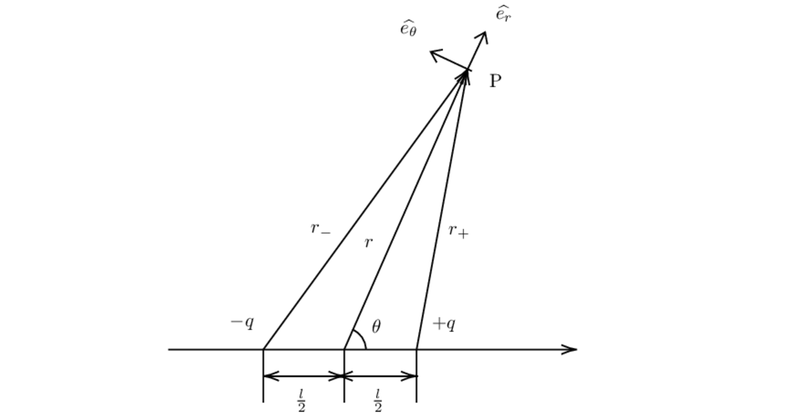

# 电偶极子和磁偶极子

## 电偶极子的电场分布

各个物理量如上图所示，
电偶极距 $p_e=ql$，
当场点 $P$ 与电偶极子的中心距离 $r$ 满足
$r\gg l$ 时，其电场强度
$$
\vec{E}(r,\theta)=\frac{p_e}{4\pi\varepsilon_0 r^3}(2\cos\theta\hat{e}_r+\sin\theta\hat{e}_\theta)
$$

推导如下：

空间中电势分布
$$
\varphi = \frac{1}{4\pi\varepsilon_0}\left( \frac{q}{r_+}-\frac{q}{r_-} \right)
$$
$$
r_\pm=\sqrt{r^2+\frac{l^2}{4}\mp rl\cos\theta}
$$

$$
\begin{align}
\varphi&= \frac{q}{4\pi \varepsilon_0}\frac{1}{r}\left( \frac{1}{\sqrt{1+\frac{l^2}{4r^2}-\frac{l\cos\theta}{r}}} - \frac{1}{\sqrt{1+\frac{l^2}{4r^2}+\frac{l\cos\theta}{r}}} \right) \\
&= \frac{q}{4\pi \varepsilon_0 r}\left( 1+\frac{l\cos\theta}{2r}-(1-\frac{l\cos\theta}{2r}) \right) \\
&= \frac{p_e\cos\theta}{4\pi\varepsilon_0 r^2} = \frac{\vec{p}_e\cdot\vec{r}}{4\pi \varepsilon_0 r^3}
\end{align}
$$

空间的电场分布

$$
\begin{align}
\vec{E}(r,\theta)&=-\nabla \varphi=-\frac{\partial\varphi}{\partial r}\hat{e}_r-\frac{1}{r}\frac{\partial\varphi}{\partial\theta}\hat{e}_\theta \\
&= -\frac{p_e\cos\theta}{4\pi\varepsilon_0}\frac{\partial}{\partial r}\left(\frac{1}{r^2}\right)\hat{e}_r - \frac{p_e}{4\pi\varepsilon_0r^3}\frac{\partial}{\partial\theta}\left(\cos\theta\right)\hat{e}_\theta \\
&= \frac{p_e\cdot2\cos\theta}{4\pi\varepsilon_0r^3}\hat{e}_r+\frac{p_e\sin\theta}{4\pi\varepsilon_0r^3}\hat{e}_\theta
\end{align}
$$

:::details
也可以绕过电势的计算直接计算电场，不过计算量比较大。

$$
\vec{E}(r,\theta)=-\nabla \varphi=-\frac{\partial\varphi}{\partial r}\hat{e}_r-\frac{1}{r}\frac{\partial\varphi}{\partial\theta}\hat{e}_\theta
$$

其中
$$
\begin{align}
\frac{\partial\varphi}{\partial r}&=\frac{q}{4\pi\varepsilon_0}\cdot-\frac{1}{2}\left( \frac{2r-l\cos\theta}{(r^2+\frac{l^2}{4}-rl\cos\theta)^{3/2}}-\frac{2r+l\cos\theta}{(r^2+\frac{l^2}{4}+rl\cos\theta)^{3/2}} \right) \\
&=-\frac{1}{2}\frac{q}{4\pi\varepsilon_0r^2}\left( \frac{2-\frac{l\cos\theta}{r}}{(1+\frac{l^2}{4r^2}-\frac{l\cos\theta}{r})^{3/2}}-\frac{2+\frac{l\cos\theta}{r}}{(1+\frac{l^2}{4r^2}+\frac{l\cos\theta}{r})^{3/2}} \right) \\
&=-\frac{1}{2}\frac{q}{4\pi\varepsilon_0r^2}\left( (2-\frac{l\cos\theta}{r})(1+\frac{3l\cos\theta}{2r})-(2+\frac{l\cos\theta}{r})(1-\frac{3l\cos\theta}{2r}) \right) \\
&=-\frac{p_e}{4\pi\varepsilon_0r^3}2\cos\theta
\end{align}
$$

$$
\begin{align}
\frac{1}{r}\frac{\partial\varphi}{\partial\theta}&=\frac{q}{4\pi\varepsilon_0r}\cdot-\frac{1}{2}\left( \frac{rl\sin\theta}{(r^2+\frac{l^2}{4}-rl\cos\theta)^{3/2}}-\frac{-rl\sin\theta}{(r^2+\frac{l^2}{4}+rl\cos\theta)^{3/2}} \right) \\
&=-\frac{1}{2}\frac{ql\sin\theta}{4\pi\varepsilon_0r^3}\left( \frac{1}{(1+\frac{l^2}{4r^2}-\frac{l\cos\theta}{r})^{3/2}}+\frac{1}{(1+\frac{l^2}{4r^2}+\frac{l\cos\theta}{r})^{3/2}} \right) \\
&=-\frac{1}{2}\frac{ql\sin\theta}{4\pi\varepsilon_0r^3}\left( (1+\frac{3l\cos\theta}{2r})+(1-\frac{3l\cos\theta}{2r}) \right) \\
&=-\frac{p_e}{4\pi\varepsilon_0r^3}\sin\theta
\end{align}
$$
:::

## 电偶极子在外场的受力

记外电场为 $\vec{E}$ ，电偶极矩为 $\vec{p}_e$ ，则受力
$$
\vec{F} = (\vec{p}_e\cdot\nabla)\vec{E}
$$

推导如下：

将坐标原点取在偶极子分布处，
把外电场在原点处按位矢展开
$$
\vec{E}=\vec{E}|_{\vec{x}=0} + (\vec{x}\cdot\nabla)\vec{E}|_{\vec{x}=0} + ...
$$
则电偶极子受力
$$
\begin{align}
\vec{F} &= \int_V \rho(\vec{x})\vec{E}d\vec{x} \\
&= Q\vec{E}|_{\vec{x}=0} + \int_V (\rho(\vec{x})\vec{x}\cdot\nabla)\vec{E}|_{\vec{x}=0} d\vec{x} \\
&= 0 + (\vec{p}_e\cdot\nabla)\vec{E}|_{\vec{x}=0} \\
&= (\vec{p}_e\cdot\nabla)\vec{E}
\end{align}
$$

## 磁偶极子的磁场分布

条形磁铁可以视为一个磁偶极子，
而磁偶极子的磁场又可视为一个电流环激发的磁场，
各物理量如下图所示。

其磁矩 $p_m=IS=\pi R^2I$，当 $r\gg R$ 时，
空间一点 $P$ 处的磁感应强度为

$$
\vec{B}(r,\theta)=\frac{\mu_0p_m}{4\pi r^3}(2\cos\theta\hat{e}_r+\sin\theta\hat{e}_\theta)
$$

推导如下：

由毕奥萨伐尔定律
$$
d\vec{B}=\frac{\mu_0}{4\pi}\frac{Id\vec{l}\times\vec{r_i}}{r_i^3}
$$

记 $P$ 点坐标 $(x, y, z)$ ，
电流元坐标 $(R\cos\varphi, R\sin\varphi, 0)$，有
$$
\vec{r_i}=(x-R\cos\varphi)\hat{e}_x+(y-R\sin\varphi)\hat{e}_y+z\hat{e}_z
$$

$$
d\vec{l}=Rd\varphi(-\sin\varphi\hat{e}_x+\cos\varphi\hat{e}_y)
$$

$$
d\vec{l}\times\vec{r_i}=Rd\varphi[z\cos\varphi\hat{e}_x+z\sin\varphi\hat{e}_y+(R-x\cos\varphi-y\sin\varphi)\hat{e}_z]
$$

$$
\begin{align}
r_i^3&=\left[(x-R\cos\varphi)^2+(y-R\sin\varphi)^2+z^2\right]^{3/2} \\
&=\left(x^2+y^2+z^2-2xR\cos\varphi-2yR\sin\varphi\right)^{3/2} \\
&=\left(r^2-2xR\cos\varphi-2yR\sin\varphi\right)^{3/2} \\
&=r^3\left(1-\frac{2xR}{r^2}\cos\varphi-\frac{2yR}{r^2}\sin\varphi\right)^{3/2}
\end{align}
$$

由 $r\gg R$ ，有
$$
r_i^{-3}\approx r^{-3}\left(1+\frac{3xR}{r^2}\cos\varphi+\frac{3yR}{r^2}\sin\varphi\right)
$$

$$
\begin{align}
\frac{d\vec{l}\times\vec{r_i}}{r_i^3}\approx&\frac{R}{r^3}[z\cos\varphi\hat{e}_x+z\sin\varphi\hat{e}_y+(R-x\cos\varphi-y\sin\varphi)\hat{e}_z]\cdot \\
& \left(1+\frac{3xR}{r^2}\cos\varphi+\frac{3yR}{r^2}\sin\varphi\right)d\varphi
\end{align}
$$

对 $\varphi$ 从 $0$ 到 $2\pi$ 进行积分，并利用三角函数系的正交性有

$$
\begin{align}
\vec{B}&=\frac{\mu_0IR}{4\pi r^3}\left[\frac{3zxR}{r^2}\int_0^{2\pi}\cos^2\varphi d\varphi\cdot\hat{e}_x+\frac{3zyR}{r^2}\int_0^{2\pi}\sin^2\varphi d\varphi\cdot\hat{e}_y+\int_0^{2\pi}(R-\frac{3x^2R}{r^2}\cos^2\varphi-\frac{3y^2R}{r^2}\sin^2\varphi)d\varphi\cdot\hat{e}_z\right] \\
&=\frac{\mu_0I\pi R^2}{4\pi r^3}\left[\frac{3zx}{r^2}\hat{e}_x+\frac{3zy}{r^2}\hat{e}_y+(2-\frac{3x^2}{r^2}-\frac{3y^2}{r^2})\hat{e}_z\right] \\
&=\frac{\mu_0p_m}{4\pi r^3}\left[\frac{3zx}{r^2}\hat{e}_x+\frac{3zy}{r^2}\hat{e}_y+(2-\frac{3x^2}{r^2}-\frac{3y^2}{r^2})\hat{e}_z\right] \\
&=\frac{\mu_0p_m}{4\pi r^3}\left\{\left[\frac{2z}{r}(\frac{x}{r}\hat{e}_x+\frac{y}{r}\hat{e}_y+\frac{z}{r}\hat{e}_z)\right]+\left[\frac{z}{r}(\frac{x}{r}\hat{e}_x+\frac{y}{r}\hat{e}_y+\frac{z}{r}\hat{e}_z)-\hat{e}_z\right]\right\} \\
&=\frac{\mu_0p_m}{4\pi r^3}(2\cos\theta\cdot\hat{e}_r+\sin\theta\cdot\hat{e}_\theta)
\end{align}
$$

## 磁偶极子在外场中受力

### 磁矩与磁场方向一致

在研究铁磁质在磁场中的受力时（例如两个条形磁铁之间的相互作用），
可以把铁磁质视为磁偶极子进行受力分析。
如下图，当磁偶极子的磁矩 $p_m=\pi r^2I$ ，
在外场 $B$ 中受力为
$$
\vec{F}=\vec{p}_m\frac{\partial B}{\partial z}
$$

推导如下：

取电流环上的微元 $dl$ ，微元所在位置外磁场为 $B$ ，
可以分解为平行磁矩和垂直磁矩的两个分量 $B_z,B_r$ 。
其中平行磁矩分量 $B_z$ 产生的安培力与电流环的平面平行，
当实际问题中待分析的物体视为刚体，则电流环为刚体，该分量可以忽略。
垂直磁矩方向的外磁场分量 $B_r$ 产生的安培力：
$$
d\vec{F}_i=Id\vec{l}_i\times\vec{B}_r
$$
记径向磁场 $B_r$ 在方向向外时为正值，则当磁矩沿 $z$ 轴正向时
$$
dF_i=-Ird\theta B_r(\theta)
$$
当磁矩沿 $z$ 轴负向时
$$
dF_i=Ird\theta B_r(\theta)
$$
可以统一写成
$$
dF_i=-Ird\theta B_r(\theta) \hat{p}_m
$$
对 $\theta$ 从 $0$ 到 $2\pi$ 积分，得到电流环在 $z$ 向上受到的合力
$$
F=\int_0^{2\pi}dF_i=-Ir\hat{p}_m\int_0^{2\pi}B_r(\theta)d\theta 
$$

取如上图中高斯面，由磁场的高斯定理有：
$$
\pi r^2[B_z(z+\Delta z)-B_z(z)]+\int_0^{2\pi}B_r(\theta)rd\theta \Delta z=0
$$
$$
\pi r^2 \frac{\partial B}{\partial z}\Delta z+\int_0^{2\pi}B_r(\theta)rd\theta \Delta z=0
$$
故有
$$
\int_0^{2\pi} B_r(\theta)d\theta=-\pi r\frac{\partial B}{\partial z}
$$

带入上面得到的合力有
$$
F=I\pi r^2\frac{\partial B}{\partial z}\hat{p}_m
$$
即
$$
\vec{F}=\vec{p}_m\frac{\partial B}{\partial z}
$$

