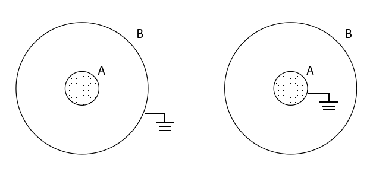

# 关于接地的问题

在下面两种情况中，为什么导体B接地后其外侧的电荷全部流失为零，而导体A接地后却残留有电荷不为零。

## 分析

::: tip 注意
接地的过程是把导体上的电荷转移到大地直到导体的电势为零，因为当导体接地后，可以把导体和大地视为一个导体，导体是一个等势体，电荷只分布在导体表面。并不是简单地说哪里接地，哪里的电荷就会全部流失。
:::

::: info 情况一
当导体B接地，其外表面处于导体内部，故电荷为零，然后内表面电荷会迁移到大地使得导体B的电势为零（后面通过定量计算得到需要迁移的电荷量刚好为零）。
:::

::: info 情况二
当导体A接地，应该视为把导体A内部接地，即球心处对应着大地无穷远点，而原导体A的外表面为导体的近端（可以假想对空间做了一个 $t=\dfrac{1}{x}$ 的变换），作为导体的表面是有电荷分布的，但是会迁移一部分电荷使导体A的电势为零。
:::

## 定量计算

记导体球A的半径为$R_A$，带电量$Q_A$，导体球壳B的半径为$R_B$，带电量$Q_B$。

在未接地时，导体球A的电荷全部均匀分布在球面，导体球壳B内表面感生$-Q_A$的电荷，则B外表面均匀分布电荷量为$Q_A+Q_B$。

::: info 情况一
将B的外表面接地，外表面成为导体内部，故外表面的电荷量为$0$，设内表面的电荷变为$q$后使导体球壳B电势为零，有
$$
V_B=k\frac{Q_A}{R_B}+k\frac{q}{R_B}=0\Rightarrow q=-Q_A
$$
故B内表面的电荷仍然为$-Q_A$。
:::

::: info 情况二
将A接地，设A表面的电荷量为$q$可使得导体A的电势为零，有
$$
V_A=k\frac{q}{R_A}+k\frac{Q_B}{R_B}=0\Rightarrow q=-Q_B\frac{R_A}{R_B}
$$
:::
