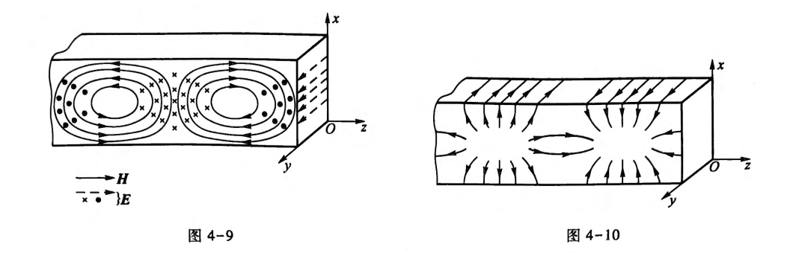

# 电动力学

## 电磁现象的普遍规律

- 电磁力 $F\propto r^{-2}$ 是麦克斯韦方程组的库伦解。电磁波 $\vec{E}=\vec{E}_0 e^{i(\omega t-\vec{k}\cdot\vec{x})}$ 是其行波解。

### 1.1 电荷 & 电场

- Gauss 定理：
$$
\oint\vec{E}\mathrm{d}\vec{S}=\frac{1}{\varepsilon_0}\sum_i Q_i
$$
$$
\nabla\cdot\vec{E}=\frac{\rho}{\varepsilon_0}
$$

- 静电场的旋度：
$$
\nabla\times\vec{E}=0
$$

### 1.2 电流 & 磁场

- 电荷守恒：
$$
\oint_S\boldsymbol{J}\cdot\mathrm{d}\boldsymbol{S}=-\int_V\frac{\partial\rho}{\partial t}\mathrm{d}V
$$
$$
\nabla\cdot\boldsymbol{J}+\frac{\partial\rho}{\partial t}=0
$$

- 毕奥-萨伐尔定律：
$$
\boldsymbol{B}(\boldsymbol{x})=\frac{\mu_0}{4\pi}\int\frac{\boldsymbol{J}(\boldsymbol{x'})\times\boldsymbol{r}}{r^3}\mathrm{d}V'
$$

- 安培环路定理：
$$
\oint_L\boldsymbol{B}\cdot\mathrm{d}\boldsymbol{l}=\mu_0\int_S\boldsymbol{J}\cdot\mathrm{d}\boldsymbol{S}
$$
$$
\nabla\times\boldsymbol{B}=\mu_0\boldsymbol{J}
$$

- 磁场的散度：
$$
\oint_S\boldsymbol{B}\cdot\mathrm{d}\boldsymbol{S}=0
$$
$$
\nabla\cdot\boldsymbol{B}=0
$$

### 1.3 Maxwell Equations

变化电磁场，新增规律：
1. 变化磁场激发电场（法拉第电磁感应定律）
2. 变化电场激发磁场（麦克斯韦位移电流 (displacement current) 假设）:
$$
\boldsymbol{J}_D=\varepsilon_0\frac{\partial\boldsymbol{E}}{\partial t}
$$

- maxwell equations:
$$
\nabla\times\boldsymbol{E}=-\frac{\partial \boldsymbol{B}}{\partial t},
$$
$$
\nabla\times\boldsymbol{B}=\mu_0\boldsymbol{J}+\mu_0\varepsilon_0\frac{\partial\boldsymbol{E}}{\partial t},
$$
$$
\nabla\cdot\boldsymbol{E}=\frac{\rho}{\varepsilon_0},
$$
$$
\nabla\cdot\boldsymbol{B}=0.
$$

### 1.4 介质的电磁性质

#### 极化

- 介质电极化强度：
$$
\boldsymbol{P}=\frac{\sum\boldsymbol{p}_i}{\Delta V}
$$

- 介质极化荷体密度：
$$
\int_V\rho_P\mathrm{d}V=-\oint_S\boldsymbol{P}\cdot\mathrm{d}\boldsymbol{S}
$$
$$
\rho_P=-\nabla\cdot\boldsymbol{P}
$$

- 极化电荷面密度
$$
\sigma_P=(\boldsymbol{P}_1-\boldsymbol{P}_2)\cdot\hat{e}_{12}
$$

- 电位移
$$
\boldsymbol{D}=\varepsilon_0\boldsymbol{E}+\boldsymbol{P}
$$

$$
\nabla\cdot\boldsymbol{D}=\rho_f
$$

::: tip 电场和电位移
$$
\nabla\cdot\boldsymbol{D}=\rho_f
$$
$$
\nabla\cdot\boldsymbol{E}=\frac{\rho_f+\rho_P}{\varepsilon_0}
$$
$$
\nabla\cdot\boldsymbol{P}=-\rho_P
$$
:::

- 极化率 $\chi_e$:
$$
\boldsymbol{P}=\chi_e\varepsilon_0\boldsymbol{E}
$$
- 介质电容率 $\varepsilon$, 相对电容率 $\varepsilon_r$:
$$
\boldsymbol{D}=\varepsilon\boldsymbol{E}
$$
$$
\varepsilon=\varepsilon_r\varepsilon_0,\quad\varepsilon_r=1+\chi_e
$$

#### 磁化

- 磁化强度
$$
\boldsymbol{M}=\frac{\sum\boldsymbol{m}_i}{\Delta V},\quad\boldsymbol{m}=i\boldsymbol{a}.
$$

- 磁化电流体密度
$$
\int_S\boldsymbol{J}_M\cdot\mathrm{d}\boldsymbol{S}=\oint_L\boldsymbol{M}\cdot\mathrm{d}\boldsymbol{l}
$$
$$
\boldsymbol{J}_M=\nabla\times\boldsymbol{M}
$$
- 磁化电流面密度
$$
\alpha_M=(\boldsymbol{M}_1-\boldsymbol{M}_2)\times\hat{e}_{12}
$$
- 极化电流
$$
\boldsymbol{J}_P=\frac{\partial \boldsymbol{P}}{\partial t}
$$

- 磁场强度
$$
\boldsymbol{H}=\frac{\boldsymbol{B}}{\mu_0}-\boldsymbol{M}
$$

$$
\nabla\times\boldsymbol{H}=\boldsymbol{J}_f+\frac{\partial\boldsymbol{D}}{\partial t}
$$

- 磁化率 $\chi_M$
$$
\boldsymbol{M}=\chi_M\boldsymbol{H}
$$

- 磁导率 $\mu$，相对磁导率 $\mu_r$
$$
\mu=\mu_r\mu_0,\quad\mu_r=1+\chi_M
$$

#### 介质中的麦克斯韦方程组

$$
\begin{align}
\nabla\times\boldsymbol{E}&=-\frac{\partial\boldsymbol{B}}{\partial t}, \\
\nabla\times\boldsymbol{H}&=\boldsymbol{J}+\frac{\partial\boldsymbol{D}}{\partial t}, \\
\nabla\cdot\boldsymbol{D}&=\rho, \\
\nabla\cdot\boldsymbol{B}&=0.
\end{align}
$$

$$
\boldsymbol{D}=\varepsilon\boldsymbol{E},
$$
$$
\boldsymbol{B}=\mu\boldsymbol{H},
$$
$$
\boldsymbol{J}=\sigma\boldsymbol{E}.
$$

### 1.5 电磁场的边值关系

$$
\begin{array}{l}
\boldsymbol{n}\times(\boldsymbol{E}_2-\boldsymbol{E}_1)=0, \\
\boldsymbol{n}\times(\boldsymbol{H}_2-\boldsymbol{H}_1)=\boldsymbol{\alpha}, \\
\boldsymbol{n}\cdot(\boldsymbol{D}_2-\boldsymbol{D}_1)=\sigma, \\
\boldsymbol{n}\cdot(\boldsymbol{B}_2-\boldsymbol{B}_1)=0.
\end{array}
$$

::: details derivation

:::

### 1.6 电磁场的能量和能流

- 能流密度（坡印亭 Poynting 矢量）
$$
\boldsymbol{S}=\boldsymbol{E}\times\boldsymbol{H}
$$
- 能量密度变化率
$$
\frac{\partial w}{\partial t}=\boldsymbol{E}\cdot\frac{\partial\boldsymbol{D}}{\partial t}+\boldsymbol{H}\cdot\frac{\partial\boldsymbol{B}}{\partial t}
$$

- 能量密度
  - 真空
  $$
  w=\frac{1}{2}\left(\varepsilon_0 E^2+\frac{1}{\mu_0}B^2\right)
  $$
  - 介质
  $$
  \delta w=\boldsymbol{E}\cdot\delta\boldsymbol{D}+\boldsymbol{H}\cdot\delta\boldsymbol{B}
  $$

## 静电场

### 2.1 静电场的标势 & 微分方程

电标势
$$
\boldsymbol{E}=-\nabla\varphi
$$

::: tip e.g.
单位正点电荷的电场
$$
\boldsymbol{E}=\frac{1}{4\pi\varepsilon_0}\frac{e}{r^2}\hat{e}_r
$$
电势
$$
\varphi=\frac{1}{4\pi\varepsilon_0}\frac{e}{r}
$$
有
$$
\boldsymbol{E}=-\nabla\varphi=-\frac{\partial\varphi}{\partial r}\hat{e}_r
$$
:::

- 泊松 Poisson 方程
$$
\nabla^2\varphi=-\frac{\rho}{\varepsilon}
$$

- 界面边值关系
$$
\varphi_1=\varphi_2
$$
$$
\varepsilon_2\frac{\partial\varphi_2}{\partial n_{12}}-\varepsilon_1\frac{\partial\varphi_1}{\partial n_{12}}=-\sigma
$$
(对于导体)
$$
\varepsilon\frac{\partial \varphi}{\partial n}=-\sigma
$$

### 2.2 唯一性定理

### 2.3 Laplace equation & 分离变量法

Laplace equation
$$
\nabla^2\varphi=0
$$

通解
$$
\begin{align}
\varphi(R,\theta,\phi)=&\sum_{n,m}\left(a_{nm}R^n+\frac{b_{nm}}{R^{n+1}}\right)P^m_n(\cos\theta)\cos m\phi \\
&+\sum_{n,m}\left(c_{nm}R^n+\frac{d_{nm}}{R^{n+1}}\right)P_n^m(\cos\theta)\sin m\phi
\end{align}
$$
$$
\varphi(R,\theta)=\sum_n\left(a_nR^n+\frac{b_n}{R^{n+1}}\right)P_n(\cos\theta)
$$

其中勒让德多项式 Legendre polynomials

### 2.4 镜像法

### 2.5 Green Function

1. 点电荷密度的 $\delta$ 函数表示

2. Green function

   $$
   \nabla^2G(\boldsymbol{x},\boldsymbol{x}')=-\frac{1}{\varepsilon_0}\delta(\boldsymbol{x}-\boldsymbol{x}')
   $$

   1. 无界自由空间
      $$
      G(\boldsymbol{x},\boldsymbol{x}')=\frac{1}{4\pi\varepsilon_0}\frac{1}{|\boldsymbol{x}-\boldsymbol{x}'|}
      $$
      对于二维空间 $G\propto\ln(r)$
   2. 上半空间
   3. 球外空间

3. 第一类边值问题
   $$
   \varphi(\boldsymbol{x})=\int_VG(\boldsymbol{x'},\boldsymbol{x})\rho(\boldsymbol{x}')\mathrm{d}V'-\varepsilon_0\oint_S\varphi(\boldsymbol{x}')\frac{\partial}{\partial n'}G(\boldsymbol{x}',\boldsymbol{x})\mathrm{d}S'
   $$
   第二类边值问题
   $$
   \varphi(\boldsymbol{x})=\int_VG(\boldsymbol{x}',\boldsymbol{x})\rho(\boldsymbol{x}')\mathrm{d}V'+\varepsilon_0\oint_SG(\boldsymbol{x}',\boldsymbol{x})\frac{\partial\varphi(\boldsymbol{x}')}{\partial n'}\mathrm{d}S'+\langle\varphi\rangle _S
   $$

### 2.6 Multiples

1. 电势的多极展开
   $$
   \varphi(\boldsymbol{x})=\int_V\frac{\rho(\boldsymbol{x}')\mathrm{d}V'}{4\pi\varepsilon_0 r}
   $$
   - 单极矩
     $$
     Q=\int_V\rho(\boldsymbol{x}')\mathrm{d}V'
     $$
   - 偶极矩
     $$
     \boldsymbol{p}=\int_V\rho(\boldsymbol{x}')\boldsymbol{x}'\mathrm{d}V'
     $$
   - 四极矩
     $$
     \mathscr{D}_{ij}=\int_V3x'_ix'_j\rho(\boldsymbol{x}')\mathrm{d}V'
     $$
   $$
   \varphi(\boldsymbol{x})=\frac{1}{4\pi\varepsilon_0}\left[\frac{Q}{R}-\boldsymbol{p}\cdot\nabla\frac{1}{R}+\frac{1}{6}\sum_{ij}\mathscr{D}_{ij}\frac{\partial^2}{\partial x_i\partial x_j}\frac{1}{R}+\dots\right]
   $$

## 静磁场

### 3.1 矢势 & 微分方程

- 矢势
$$
\boldsymbol{B}=\nabla\times\boldsymbol{A}
$$
附加要求
$$
\nabla\cdot\boldsymbol{A}=0
$$

- 微分方程
$$
\nabla^2\boldsymbol{A}=-\mu\boldsymbol{J}
$$
特解
$$
\boldsymbol{A}(\boldsymbol{x})=\frac{\mu}{4\pi}\int_V\frac{\boldsymbol{J}(\boldsymbol{x}')\,\mathrm{d}V}{r}
$$
$$
\boldsymbol{B}=\frac{\mu}{4\pi}\int_V\frac{\boldsymbol{J}\times\boldsymbol{r}}{r^3}\mathrm{d}V'=\frac{\mu}{4\pi}\oint_L\frac{I\mathrm{d}\boldsymbol{l}\times\boldsymbol{r}}{r^3}
$$

- 边界条件
$$
\boldsymbol{A}_1=\boldsymbol{A}_2
$$

- 静磁场能量
$$
W=\frac{1}{2}\int\boldsymbol{A}\cdot\boldsymbol{J}\,\mathrm{d}V
$$

### 3.2 磁标势

- 磁标势 $\varphi_m$
$$
\boldsymbol{H}=-\nabla\varphi_m
$$

### 3.3 磁多极矩

- 矢势的多极展开

  第一项 $\boldsymbol{A}^{(0)}=0$ 不含磁单极项

  第二项
  $$
  \boldsymbol{A}^{(1)}=\frac{\mu_0}{4\pi}\frac{\boldsymbol{m}\times\boldsymbol{R}}{R^3}
  $$
  磁矩
  $$
  \begin{align}
  \boldsymbol{m}&=\frac{I}{2}\oint_L\boldsymbol{x}'\times\mathrm{d}\boldsymbol{l}' \\
  &=\frac{1}{2}\int_V\boldsymbol{x}'\times\boldsymbol{J}(\boldsymbol{x}')\,\mathrm{d}V'
  \end{align}
  $$

- 磁偶极子磁场、磁标势
$$
\boldsymbol{B}^{(1)}=-\frac{\mu_0}{4\pi}(\boldsymbol{m}\cdot\nabla)\frac{\boldsymbol{R}}{R^3}
$$
$$
\varphi_m^{(1)}=\frac{\boldsymbol{m}\cdot\boldsymbol{R}}{4\pi R^3}
$$

- 磁偶极子势能、受力、力矩
$$
U=-\boldsymbol{m}\cdot\boldsymbol{B}_e
$$
$$
\boldsymbol{F}=\boldsymbol{m}\cdot\nabla\boldsymbol{B}_e
$$
$$
\boldsymbol{L}=\boldsymbol{m}\times\boldsymbol{B}_e
$$

## 电磁波的传播

### 4.1 平面电磁波

- 波动方程
$$
\nabla^2\boldsymbol{E}-\frac{1}{c^2}\frac{\partial^2\boldsymbol{E}}{\partial t^2}=0
$$
$$
\nabla^2\boldsymbol{B}-\frac{1}{c^2}\frac{\partial^2\boldsymbol{B}}{\partial t^2}=0
$$

- 介质色散
$$
\boldsymbol{D}(\omega)=\varepsilon(\omega)\boldsymbol{E}(\omega)
$$
$$
\boldsymbol{B}(\omega)=\mu(\omega)\boldsymbol{H}(\omega)
$$

- 时谐电磁波 (单色波)

$$
\boldsymbol{E}(\boldsymbol{x},t)=\boldsymbol{E}(\boldsymbol{x})e^{-i\omega t}
$$
$$
\boldsymbol{B}(\boldsymbol{x},t)=\boldsymbol{B}(\boldsymbol{x})e^{-i\omega t}
$$
满足亥姆霍兹 (Helmholtz) 方程
$$
\nabla^2\boldsymbol{E}+k^2\boldsymbol{E}=0,\quad k=\omega\sqrt{\mu\varepsilon}
$$
$$
\nabla\cdot\boldsymbol{E}=0,
$$
$$
\boldsymbol{B}=-\frac{i}{\omega}\nabla\times\boldsymbol{E}
$$

- 平面电磁波
$$
\boldsymbol{E}(\boldsymbol{x},t)=\boldsymbol{E}_0e^{i(\boldsymbol{k}\cdot\boldsymbol{x}-\omega t)}
$$
相速度
$$
v=\frac{\omega}{k}=\frac{1}{\sqrt{\mu\varepsilon}}
$$
磁场
$$
\boldsymbol{B}=\sqrt{\mu\varepsilon}\boldsymbol{e}_k\times\boldsymbol{E}
$$

- 能量密度和能流密度平均值
$$
\overline{w}=\frac{1}{2}\varepsilon E_0^2=\frac{1}{2\mu}B_0^2
$$
$$
\overline{\boldsymbol{S}}=\frac{1}{2}\sqrt{\frac{\varepsilon}{\mu}}E_0^2\boldsymbol{e}_k
$$

### 4.2 电磁波的反射和折射

- 反射和折射定律
- 菲涅耳公式
- 全反射

### 4.3 有导体存在时电磁波的传播

1. 导体内自由电荷分布

   良导体 $\sigma\gg\varepsilon\omega$

2. 导体内电磁波

   复电容率
   $$
   \varepsilon'=\varepsilon+i\frac{\sigma}{\omega}
   $$
   $$
   \boldsymbol{E}(\boldsymbol{x})=\boldsymbol{E}_0 e^{i\boldsymbol{k}\cdot\boldsymbol{x}}
   $$
   $$
   \boldsymbol{k}=\boldsymbol{\beta}+i\boldsymbol{\alpha},\ k=\omega\sqrt{\mu\varepsilon'}
   $$

3. 趋肤效应和穿透深度

   穿透深度
   $$
   \delta=\sqrt{\frac{2}{\omega\mu\sigma}}
   $$

4. 导体表面上的反射

### 4.4 谐振腔

1. 有界空间中的电磁波

   波导是中空的金属管

2. 理想导体边界条件

$$
\boldsymbol{e}_n\times\boldsymbol{E}=0
$$
$$
\boldsymbol{e}_n\times\boldsymbol{H}=\boldsymbol{\alpha}
$$
$$
\boldsymbol{e}_n\cdot\boldsymbol{D}=\sigma
$$
$$
\boldsymbol{e}_n\cdot\boldsymbol{B}=0
$$

3. 谐振腔

   本征频率
$$
\omega_{mnp}=\frac{\pi}{\sqrt{\mu\varepsilon}}\sqrt{\left(\frac{m}{L_1}\right)^2+\left(\frac{n}{L_2}\right)^2+\left(\frac{p}{L_3}\right)^2}
$$

### 4.5 波导

1. 高频电磁能量的传输

2. 矩形波导中的电磁波

   $$
   k_x=\frac{m\pi}{a},\ k_y=\frac{n\pi}{b}\ (m,n=0,1,2,...)
   $$

   $$
   \boldsymbol{H}=-\frac{i}{\omega\mu}\nabla\times\boldsymbol{E}
   $$

   横电波 (TE$_{mn}$)

   横磁波 (TM$_{mn}$)

3. 截止频率

$$
\omega_{c,mn}=\frac{\pi}{\sqrt{\mu\varepsilon}}\sqrt{\left(\frac{m}{a}\right)^2+\left(\frac{n}{b}\right)^2}
$$

4. TE$_{10}$波的电磁场和管壁电流

### 5.7 等离子体

1. 等离子体的准电中性和屏蔽库伦场
   $$
   \varphi(\boldsymbol{x})=\frac{q}{4\pi\varepsilon_0 r}e^{-r/\lambda}
   $$
   $$
   \lambda^2=\frac{kT\varepsilon_0}{n_{e0}e^2}
   $$

2. 等离子体振荡
   
   等离子体频率（热平衡下）
   $$
   \omega_p=\sqrt{\frac{n_0 e^2}{m\varepsilon_0}}
   $$

3. 电磁波在等离子体中的传播

   等离子体的折射率
   $$
   n=\sqrt{1-\frac{\omega_p^2}{\omega^2}}
   $$
