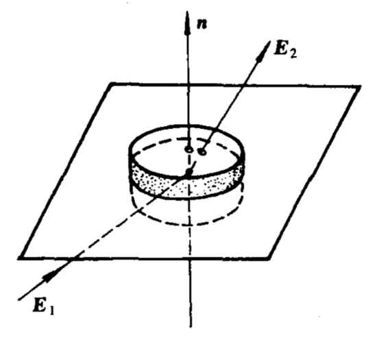
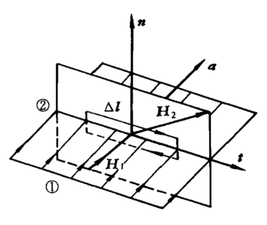
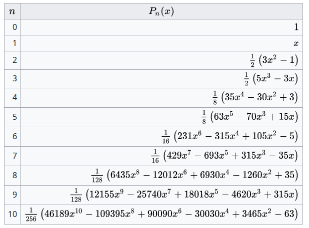

# 电动力学

## 电磁现象的普遍规律

- 电磁力 $F\propto r^{-2}$ 是麦克斯韦方程组的库伦解。电磁波 $\vec{E}=\vec{E}_0 e^{i(\omega t-\vec{k}\cdot\vec{x})}$ 是其行波解。

### 1.1 电荷 & 电场

- Gauss 定理：
$$
\oint\vec{E}\mathrm{d}\vec{S}=\frac{1}{\varepsilon_0}\sum_i Q_i
$$
$$
\nabla\cdot\vec{E}=\frac{\rho}{\varepsilon_0}
$$

- 静电场的旋度：
$$
\nabla\times\vec{E}=0
$$

### 1.2 电流 & 磁场

- 电荷守恒：
$$
\oint_S\boldsymbol{J}\cdot\mathrm{d}\boldsymbol{S}=-\int_V\frac{\partial\rho}{\partial t}\mathrm{d}V
$$
$$
\nabla\cdot\boldsymbol{J}+\frac{\partial\rho}{\partial t}=0
$$

- 毕奥-萨伐尔定律：
$$
\boldsymbol{B}(\boldsymbol{x})=\frac{\mu_0}{4\pi}\int\frac{\boldsymbol{J}(\boldsymbol{x'})\times\boldsymbol{r}}{r^3}\mathrm{d}V'
$$

- 安培环路定理：
$$
\oint_L\boldsymbol{B}\cdot\mathrm{d}\boldsymbol{l}=\mu_0\int_S\boldsymbol{J}\cdot\mathrm{d}\boldsymbol{S}
$$
$$
\nabla\times\boldsymbol{B}=\mu_0\boldsymbol{J}
$$

- 磁场的散度：
$$
\oint_S\boldsymbol{B}\cdot\mathrm{d}\boldsymbol{S}=0
$$
$$
\nabla\cdot\boldsymbol{B}=0
$$

### 1.3 Maxwell Equations

变化电磁场，新增规律：
1. 变化磁场激发电场（法拉第电磁感应定律）
2. 变化电场激发磁场（麦克斯韦位移电流 (displacement current) 假设）:
$$
\boldsymbol{J}_D=\varepsilon_0\frac{\partial\boldsymbol{E}}{\partial t}
$$

- maxwell equations:
$$
\nabla\times\boldsymbol{E}=-\frac{\partial \boldsymbol{B}}{\partial t},
$$
$$
\nabla\times\boldsymbol{B}=\mu_0\boldsymbol{J}+\mu_0\varepsilon_0\frac{\partial\boldsymbol{E}}{\partial t},
$$
$$
\nabla\cdot\boldsymbol{E}=\frac{\rho}{\varepsilon_0},
$$
$$
\nabla\cdot\boldsymbol{B}=0.
$$

### 1.4 介质的电磁性质

#### 极化

- 介质电极化强度：
$$
\boldsymbol{P}=\frac{\sum\boldsymbol{p}_i}{\Delta V}
$$

- 介质极化荷体密度：
$$
\int_V\rho_P\mathrm{d}V=-\oint_S\boldsymbol{P}\cdot\mathrm{d}\boldsymbol{S}
$$
$$
\rho_P=-\nabla\cdot\boldsymbol{P}
$$

- 极化电荷面密度
$$
\sigma_P=(\boldsymbol{P}_1-\boldsymbol{P}_2)\cdot\hat{e}_{12}
$$

- 电位移
$$
\boldsymbol{D}=\varepsilon_0\boldsymbol{E}+\boldsymbol{P}
$$

$$
\nabla\cdot\boldsymbol{D}=\rho_f
$$

::: info 电场和电位移
$$
\rho_f\rightarrow\boldsymbol{D}
$$
$$
\rho_f+\rho_P\rightarrow\boldsymbol{E}
$$
:::

- 极化率 $\chi_e$:
$$
\boldsymbol{P}=\chi_e\varepsilon_0\boldsymbol{E}
$$
- 介质电容率 $\varepsilon$, 相对电容率 $\varepsilon_r$:
$$
\boldsymbol{D}=\varepsilon\boldsymbol{E}
$$
$$
\varepsilon=\varepsilon_r\varepsilon_0,\quad\varepsilon_r=1+\chi_e
$$

#### 磁化

- 磁化强度
$$
\boldsymbol{M}=\frac{\sum\boldsymbol{m}_i}{\Delta V},\quad\boldsymbol{m}=i\boldsymbol{a}.
$$

- 磁化电流体密度
$$
\int_S\boldsymbol{J}_M\cdot\mathrm{d}\boldsymbol{S}=\oint_L\boldsymbol{M}\cdot\mathrm{d}\boldsymbol{l}
$$
$$
\boldsymbol{J}_M=\nabla\times\boldsymbol{M}
$$
- 磁化电流面密度
$$
\alpha_M=(\boldsymbol{M}_1-\boldsymbol{M}_2)\times\hat{e}_{12}
$$
- 极化电流
$$
\boldsymbol{J}_P=\frac{\partial \boldsymbol{P}}{\partial t}
$$

- 磁场强度
$$
\boldsymbol{H}=\frac{\boldsymbol{B}}{\mu_0}-\boldsymbol{M}
$$

$$
\nabla\times\boldsymbol{H}=\boldsymbol{J}_f+\frac{\partial\boldsymbol{D}}{\partial t}
$$

- 磁化率 $\chi_M$
$$
\boldsymbol{M}=\chi_M\boldsymbol{H}
$$

- 磁导率 $\mu$，相对磁导率 $\mu_r$
$$
\mu=\mu_r\mu_0,\quad\mu_r=1+\chi_M
$$

#### 介质中的麦克斯韦方程组

$$
\begin{align}
\nabla\times\boldsymbol{E}&=-\frac{\partial\boldsymbol{B}}{\partial t}, \\
\nabla\times\boldsymbol{H}&=\boldsymbol{J}+\frac{\partial\boldsymbol{D}}{\partial t}, \\
\nabla\cdot\boldsymbol{D}&=\rho, \\
\nabla\cdot\boldsymbol{B}&=0.
\end{align}
$$

$$
\boldsymbol{D}=\varepsilon\boldsymbol{E},
$$
$$
\boldsymbol{B}=\mu\boldsymbol{H},
$$
$$
\boldsymbol{J}=\sigma\boldsymbol{E}.
$$

### 1.5 电磁场的边值关系

$$
\begin{array}
\boldsymbol{n}\times(\boldsymbol{E}_2-\boldsymbol{E}_1)=0, \\
\boldsymbol{n}\times(\boldsymbol{H}_2-\boldsymbol{H}_1)=\boldsymbol{\alpha}, \\
\boldsymbol{n}\cdot(\boldsymbol{D}_2-\boldsymbol{D}_1)=\sigma, \\
\boldsymbol{n}\cdot(\boldsymbol{B}_2-\boldsymbol{B}_1)=0.
\end{array}
$$

::: details derivation

:::

### 1.6 电磁场的能量和能流

- 能流密度（坡印亭 Poynting 矢量）
$$
\boldsymbol{S}=\boldsymbol{E}\times\boldsymbol{H}
$$
- 能量密度变化率
$$
\frac{\partial w}{\partial t}=\boldsymbol{E}\cdot\frac{\partial\boldsymbol{D}}{\partial t}+\boldsymbol{H}\cdot\frac{\partial\boldsymbol{B}}{\partial t}
$$

- 能量密度
  - 真空
  $$
  w=\frac{1}{2}\left(\varepsilon_0 E^2+\frac{1}{\mu_0}B^2\right)
  $$
  - 介质
  $$
  \delta w=\boldsymbol{E}\cdot\delta\boldsymbol{D}+\boldsymbol{H}\cdot\delta\boldsymbol{B}
  $$

## 静电场

### 2.1 静电场的标势 & 微分方程

电标势
$$
\boldsymbol{E}=-\nabla\varphi
$$

泊松 Poisson 方程
$$
\nabla^2\varphi=-\frac{\rho}{\varepsilon}
$$

### 2.2 唯一性定理

### 2.3 Laplace equation & 分离变量法

Laplace equation
$$
\nabla^2\varphi=0
$$

通解
$$
\begin{align}
\varphi(R,\theta,\phi)=&\sum_{n,m}\left(a_{nm}R^n+\frac{b_{nm}}{R^{n+1}}\right)P^m_n(\cos\theta)\cos m\phi \\
&+\sum_{n,m}\left(c_{nm}R^n+\frac{d_{nm}}{R^{n+1}}\right)P_n^m(\cos\theta)\sin m\phi
\end{align}
$$
$$
\varphi(R,\theta)=\sum_n\left(a_nR^n+\frac{b_n}{R^{n+1}}\right)P_n(\cos\theta)
$$

其中勒让德多项式 Legendre polynomials

### 2.4 镜像法

### 2.5 Green Function

1. 点电荷密度的 $\delta$ 函数表示

2. Green function

   $$
   \nabla^2G(\boldsymbol{x},\boldsymbol{x}')=-\frac{1}{\varepsilon_0}\delta(\boldsymbol{x}-\boldsymbol{x}')
   $$

   1. 无界自由空间
      $$
      G(\boldsymbol{x},\boldsymbol{x}')=\frac{1}{4\pi\varepsilon_0}\frac{1}{|\boldsymbol{x}-\boldsymbol{x}'|}
      $$
      对于二维空间 $G\propto\ln(r)$
   2. 上半空间
   3. 球外空间

3. 第一类边值问题
   $$
   \varphi(\boldsymbol{x})=\int_VG(\boldsymbol{x'},\boldsymbol{x})\rho(\boldsymbol{x}')\mathrm{d}V'-\varepsilon_0\oint_S\varphi(\boldsymbol{x}')\frac{\partial}{\partial n'}G(\boldsymbol{x}',\boldsymbol{x})\mathrm{d}S'
   $$
   第二类边值问题
   $$
   \varphi(\boldsymbol{x})=\int_VG(\boldsymbol{x}',\boldsymbol{x})\rho(\boldsymbol{x}')\mathrm{d}V'+\varepsilon_0\oint_SG(\boldsymbol{x}',\boldsymbol{x})\frac{\partial\varphi(\boldsymbol{x}')}{\partial n'}\mathrm{d}S'+\langle\varphi\rangle _S
   $$

### 2.6 Multiples

1. 电势的多极展开
   $$
   \varphi(\boldsymbol{x})=\int_V\frac{\rho(\boldsymbol{x}')\mathrm{d}V'}{4\pi\varepsilon_0 r}
   $$
   - 单极矩
     $$
     Q=\int_V\rho(\boldsymbol{x}')\mathrm{d}V'
     $$
   - 偶极矩
     $$
     \boldsymbol{p}=\int_V\rho(\boldsymbol{x}')\boldsymbol{x}'\mathrm{d}V'
     $$
   - 四极矩
     $$
     \mathscr{D}_{ij}=\int_V3x'_ix'_j\rho(\boldsymbol{x}')\mathrm{d}V'
     $$
   $$
   \varphi(\boldsymbol{x})=\frac{1}{4\pi\varepsilon_0}\left[\frac{Q}{R}-\boldsymbol{p}\cdot\nabla\frac{1}{R}+\frac{1}{6}\sum_{ij}\mathscr{D}_{ij}\frac{\partial^2}{\partial x_i\partial x_j}\frac{1}{R}+\dots\right]
   $$
