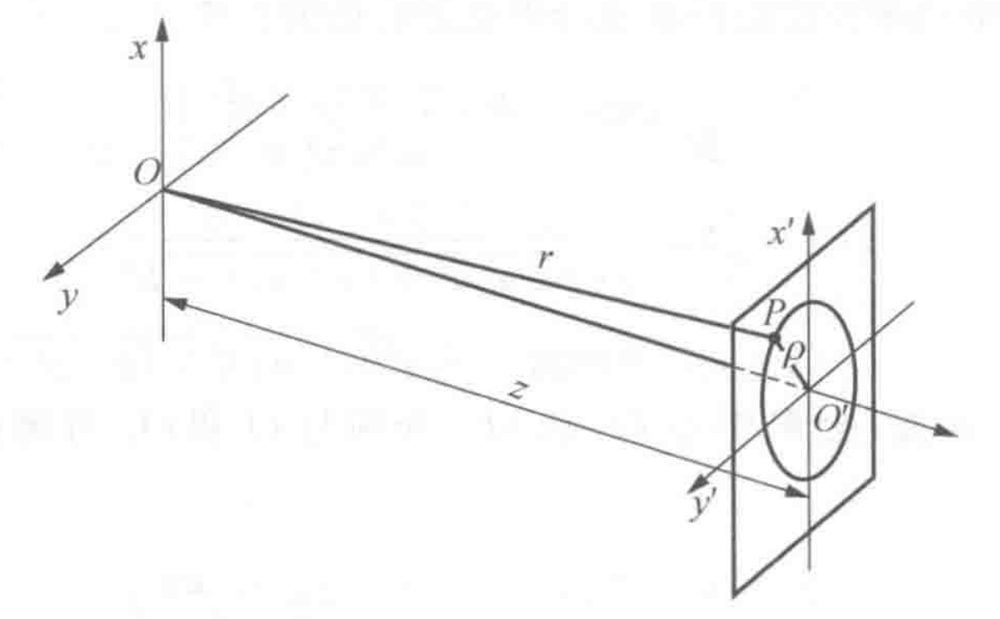

# 光学

## 光学矩阵

### 概念

在几何光学中，
对于任何光学元件，
我们都可以用一个矩阵来描述其对傍轴光线的改变，
称为光学矩阵。

如下模型图所示：

可以用光线与光学元件交点与光轴的偏移 $x$ 和光线的倾角 $\theta$ 来唯一表示光线，
即入射光线为

$$
[r_1]=\left(
  \begin{array}{c}
    x_1 \\
    \theta_1
  \end{array}
\right)
$$

出射光线为

$$
[r_2]=\left(
  \begin{array}{c}
    x_2 \\
    \theta_2
  \end{array}
\right)
$$

且有关系

$$
[r_2]=[M][r_1]
$$
$$
\left(
  \begin{array}{c}
    x_2 \\
    \theta_2
  \end{array}
\right) =
\left(
  \begin{array}{cc}
    A & B \\
    C & D
  \end{array}
\right)
\left(
  \begin{array}{c}
    x_2 \\
    \theta_2
  \end{array}
\right)
$$

其中 $[M]=\left(\begin{array}{cc}A & B \\C & D\end{array}\right)$ 称为该光学元件的光学矩阵。

### 例子

- 自由空间传播距离 $L$

有关系式

$$
\left\{
  \begin{array}{l}
    x_2 = x_1 + L \tan\theta_1 \approx x_1 + L \theta_1 \\
    \theta_2 = \theta_1
  \end{array}
\right.
$$

即

$$
\left(\begin{array}{c} x_2 \\ \theta_2 \end{array}\right) =
\left(\begin{array}{cc} 1 & L \\ 0 & 1 \end{array}\right)
\left(\begin{array}{c} x_1 \\ \theta_1 \end{array}\right)
$$

故长度为 $L$ 自由空间的光学矩阵为

$$
[M]=\left(\begin{array}{cc} 1 & L \\ 0 & 1 \end{array}\right)
$$

- 平面界面上的折射

$$
\left\{
  \begin{array}{l}
    x_2 = x_1 \\
    n_2 \theta_2 \approx n_2 \sin\theta_2 = n_1 \sin\theta_1 \approx n_1 \theta_1
  \end{array}
\right.
$$

$$
\left(\begin{array}{c} x_2 \\ \theta_2 \end{array}\right) =
\left(\begin{array}{cc} 1 & 0 \\ 0 & n_1/n_2 \end{array}\right)
\left(\begin{array}{c} x_1 \\ \theta_1 \end{array}\right)
$$

- 薄透镜

$$
\left\{
  \begin{array}{l}
    x_2 = x_1 \\
    x_1 = f\theta_1 + (-f\theta_2) \Rightarrow \theta_2 = -x_1/f + \theta_1
  \end{array}
\right.
$$

$$
\left(\begin{array}{c} x_2 \\ \theta_2 \end{array}\right) =
\left(\begin{array}{cc} 1 & 0 \\ -1/f & 1 \end{array}\right)
\left(\begin{array}{c} x_1 \\ \theta_1 \end{array}\right)
$$

- 球面界面上的折射

在球心 $O$ 做半径分别为 $\dfrac{n_1}{n_2}R,\dfrac{n_2}{n_1}R$ 的球面，
记光线入射点 $A$ ，入射光线延长线与外球面交于点 $B$ ，
连接 $OB$ 交内球面于点 $C$ 。
则由 $\triangle OAB$ 与 $\triangle OCA$ 相似及正弦定理可知出射光线 $AC$ 满足折射定律：
$$
n_1\sin i = n_2 \sin i'
$$

可近似为 $n_1 i = n_2 i'$ ，又由
$$
\angle OAB = i = \theta_1 - \theta_2 + i'
$$
得到
$$
i = \dfrac{\theta_1-\theta_2}{1-\dfrac{n_1}{n_2}} = \dfrac{\theta_1-\theta_2}{n_2-n_1}n_2
$$
由 $x_1 = -R \sin (i-\theta_1)$ 可得
$$
\theta_2 = \frac{n_2-n_1}{n_2R}x_1 + \frac{n_1}{n_2}\theta_1
$$
则
$$
\left(\begin{array}{c} x_2 \\ \theta_2 \end{array}\right) =
\left(\begin{array}{cc} 1 & 0 \\ \dfrac{n_2-n_1}{n_2R} & \dfrac{n_1}{n_2} \end{array}\right)
\left(\begin{array}{c} x_1 \\ \theta_1 \end{array}\right)
$$

## 波动光学

### 定态光波和复振幅描述

- 定态光波 $U(P,t)=A(P)\cos[\omega t-\varphi(P)]$

1. 平面波
- $A(P)=const$
- $\varphi(P)=\vec{k}\cdot\vec{r}+\varphi_0$
2. 球面波
- $A(P)=\dfrac{a}{r}$
- $\varphi(P)=kr+\varphi_0$

- 复振幅描述 $\widetilde U(P,t)=A(P)e^{i\varphi(P)}$
- 光强 $I=\widetilde U\widetilde U^*$

### 波前

- 波面：相位相等曲面
- 波前：光波场中任意曲面
- 共轭波：复振幅共轭的波

- $\widetilde U(x',y')=\dfrac{a}{z(1+\rho^2/2z^2)}exp[ik(z+\dfrac{\rho^2}{2z})]$
- 傍轴条件（振幅） $\dfrac{\rho^2}{z^2}\ll 1\Leftrightarrow z^2\gg\rho^2$
- 远场条件（相位） $\dfrac{1}{2}k\dfrac{\rho^2}{z}\ll\pi\Leftrightarrow z\gg\dfrac{\rho^2}{\lambda}$

### 波的叠加和干涉

- 波的干涉 $I(P)=I_1(P)+I_2(P)+2\sqrt{I_1(P)I_2(P)}\cos\delta(P)$
- 相干条件：
1. 频率相同
2. 存在相互平行的振动分量
3. 相位差稳定
- 干涉条纹的反衬度 $\gamma=\dfrac{I_{max}-I_{min}}{I_{max}+I_{min}}$
- 双光干涉光强分布
$$
\begin{align}
I=A_1^2+A_2^2+2A_1A_2\cos\delta \\
=(A_1^2+A_2^2)(1+\gamma\cos\delta)
\end{align}
$$

### 两个点源的干涉

1. 两列球面波的干涉

杨氏双缝干涉实验

2. 两列平面波的干涉

### 衍射和惠更斯-菲涅耳原理

- 惠更斯-菲涅耳原理：波前 $\Sigma$ 上的每个面元 $\mathrm{d}\Sigma$ 都可以看成是新的振动中心，它们发出次波，在空间某一点 $P$ 的振动是所有这些次波在该点的相干叠加。

- 菲涅耳-基尔霍夫衍射公式：
$$
\widetilde U(P)=\frac{-i}{2\lambda}\iint_{\Sigma_0}(\cos\theta_0+\cos\theta)\widetilde U_0(Q)\frac{e^{ikr}}{r}\mathrm{d}\Sigma
$$

- 巴比涅原理：互补屏造成的衍射场中复振幅之和等于自由波场的复振幅。
- 衍射分类：

### 菲涅耳圆孔/圆屏衍射

- 现象：

- 解释：(只能解释轴上光强)
1. 半波带法
2. 矢量图法

- 菲涅耳波带片

### 夫琅和费单缝/矩孔衍射

- 现象：

- 单缝衍射强度公式：
$$
I_\theta=I_0\left(\frac{\sin\alpha}{\alpha}\right)^2,\quad \alpha=\frac{\pi a\sin\theta}{\lambda}
$$

- 矩孔衍射强度公式：
$$
I_\theta=I_0\left(\frac{\sin\alpha}{\alpha}\right)^2\left(\frac{\sin\beta}{\beta}\right)^2,\quad \alpha=\frac{\pi a\sin\theta_1}{\lambda},\beta=\frac{\pi b\sin\theta_2}{\lambda}
$$

- 单缝衍射因子特点：

1. 主极强——零级衍射斑 $\alpha=0$
2. 次极强——高级衍射斑 $\dfrac{\mathrm{d}}{\mathrm{d}\alpha}\left(\dfrac{\sin\alpha}{\alpha}\right)=0$
3. 暗斑 $\sin\alpha=0$
4. 半角宽度 $\Delta\theta=\dfrac{\lambda}{a}$

### 光学仪器的像分辨本领

- 夫琅和费圆孔衍射光强分布：
$$
I(\theta)=I_0\left(\frac{2J_1(x)}{x}\right)^2,\quad x=\frac{2\pi a}{\lambda}\sin\theta
$$
其中 $a$ 是圆孔的半径，$\theta$ 是衍射角，$J_1(x)$是一阶贝塞尔函数。

下图演示圆孔衍射因子和衍射图样

- 艾里斑：第一暗环的角半径 $\Delta\theta$
$$
\Delta\theta=0.61\frac{\lambda}{a}=1.22\frac{\lambda}{D}
$$

- 望远镜的最小分辨角：$\delta\theta_m=1.22\dfrac{\lambda}{D}$

### 光的横波性和偏振态

- 光的横波性：以电矢量作为光波中振动矢量的代表

- 五种偏振态：
1. 自然光
2. 线偏振光
- 马吕斯定律
3. 部分偏振光
- 偏振度 $P=\dfrac{I_{max}-I_{min}}{I_{max}+I_{min}}$
4. 圆偏振光
5. 椭圆偏振光

### 菲涅耳公式

- 菲涅耳反射折射公式

$$
\left\{
\begin{array}{l}
E_{1p}'=\dfrac{n_2\cos i_1-n_1\cos i_2}{n_2\cos i_1+n_1\cos i_2}E_{1p}=\dfrac{\tan(i_1-i_2)}{\tan(i_1+i_2)}E_{1p} \\
E_{2p}=\dfrac{2n_1\cos i_1}{n_2\cos i_1+n_1\cos i_2}E_{1p} \\
E_{1s}'=\dfrac{n_1\cos i_1-n_2\cos i_2}{n_1\cos i_1+n_2\cos i_2}E_{1s}=\dfrac{\sin(i_2-i_1)}{\sin(i_2+i_1)}E_{1s} \\
E_{2s}=\dfrac{2n_1\cos i_1}{n_1\cos i_1+n_2\cos i_2}E_{1s}=\dfrac{2\cos i_1\sin i_2}{\sin(i_2+i_1)}E_{1s}
\end{array}
\right.
$$

- 反射率和透射率

| | p分量 | s分量 |
|:--:|:--:|:--:|
|振幅反射率| $r_p=\dfrac{E_{1p}'}{E_{1p}}$ | $r_s=\dfrac{E_{1s}'}{E_{1s}}$ |
|光强反射率| $R_p=\dfrac{I_{1p}'}{I_{1p}}=\|r_p\|^2$ | $R_s=\dfrac{I_{1s}'}{I_{1s}}=\|r_s\|^2$ |
|能流反射率| $\mathcal{R}_p=\dfrac{W_{1p}'}{W_{1p}}=R_p$ | $\mathcal{R}_s=\dfrac{W_{1s}'}{W_{1s}}=R_s$ |
|振幅反射率| $t_p=\dfrac{E_{2p}}{E_{1p}}$ | $t_s=\dfrac{E_{2s}}{E_{1s}}$ |
|光强反射率| $T_p=\dfrac{I_{2p}}{I_{1p}}=\dfrac{n_2}{n_1}\|t_p\|^2$ | $T_s=\dfrac{I_{2s}}{I_{1s}}=\dfrac{n_2}{n_1}\|t_s\|^2$ |
|能流反射率| $\mathcal{T}_p=\dfrac{W_{2p}}{W_{1p}}=\dfrac{\cos i_2}{\cos i_1}T_p$ | $\mathcal{T}_s=\dfrac{W_{2s}}{W_{1s}}=\dfrac{\cos i_2}{\cos i_1}T_s$ |

将菲涅耳公式带入有：
$$
\left\{
\begin{array}{l}
r_p=\dfrac{n_2\cos i_1-n_1\cos i_2}{n_2\cos i_1+n_1\cos i_2}=\dfrac{\tan(i_1-i_2)}{\tan(i_1+i_2)} \\
r_s=\dfrac{n_1\cos i_1-n_2\cos i_2}{n_1\cos i_1+n_2\cos i_2}=\dfrac{\sin(i_2-i_1)}{\sin(i_2+i_1)}
\end{array}
\right.
$$
$$
\left\{
\begin{array}{l}
t_p=\dfrac{2n_1\cos i_1}{n_2\cos i_1+n_1\cos i_2} \\
t_s=\dfrac{2n_1\cos i_1}{n_1\cos i_1+n_2\cos i_2}
\end{array}
\right.
$$

- 斯托克斯倒逆关系

$$
\left\{
\begin{array}{l}
r^2+tt'=1 \\
r'=-r
\end{array}
\right.
$$

- 相位关系和半波损

