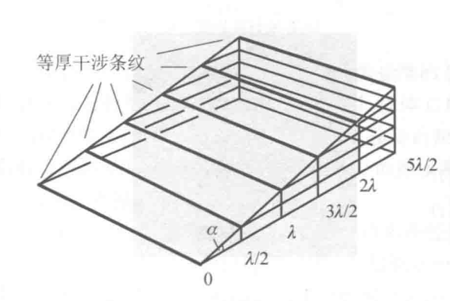
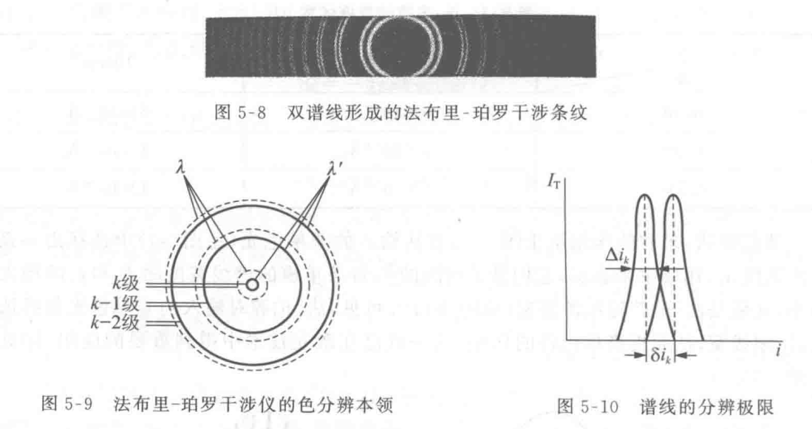
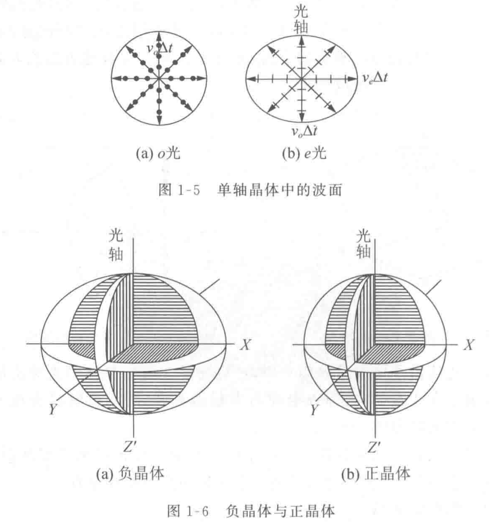
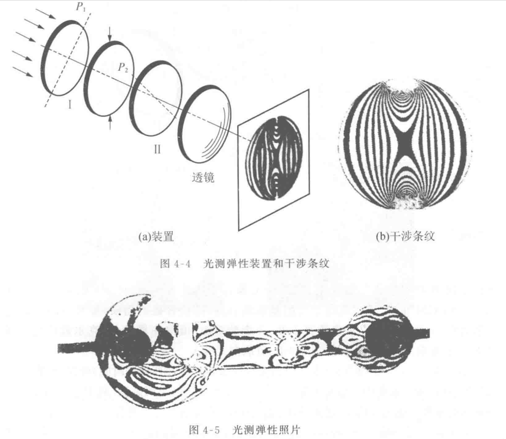

# 光学

## 光学矩阵

### 概念

在几何光学中，
对于任何光学元件，
我们都可以用一个矩阵来描述其对傍轴光线的改变，
称为光学矩阵。

如下模型图所示：

可以用光线与光学元件交点与光轴的偏移 $x$ 和光线的倾角 $\theta$ 来唯一表示光线，
即入射光线为

$$
[r_1]=\left(
  \begin{array}{c}
    x_1 \\
    \theta_1
  \end{array}
\right)
$$

出射光线为

$$
[r_2]=\left(
  \begin{array}{c}
    x_2 \\
    \theta_2
  \end{array}
\right)
$$

且有关系

$$
[r_2]=[M][r_1]
$$
$$
\left(
  \begin{array}{c}
    x_2 \\
    \theta_2
  \end{array}
\right) =
\left(
  \begin{array}{cc}
    A & B \\
    C & D
  \end{array}
\right)
\left(
  \begin{array}{c}
    x_1 \\
    \theta_1
  \end{array}
\right)
$$

其中 $[M]=\left(\begin{array}{cc}A & B \\C & D\end{array}\right)$ 称为该光学元件的光学矩阵。

### 例子

- 自由空间传播距离 $L$

有关系式

$$
\left\{
  \begin{array}{l}
    x_2 = x_1 + L \tan\theta_1 \approx x_1 + L \theta_1 \\
    \theta_2 = \theta_1
  \end{array}
\right.
$$

即

$$
\left(\begin{array}{c} x_2 \\ \theta_2 \end{array}\right) =
\left(\begin{array}{cc} 1 & L \\ 0 & 1 \end{array}\right)
\left(\begin{array}{c} x_1 \\ \theta_1 \end{array}\right)
$$

故长度为 $L$ 自由空间的光学矩阵为

$$
[M]=\left(\begin{array}{cc} 1 & L \\ 0 & 1 \end{array}\right)
$$

- 平面界面上的折射

$$
\left\{
  \begin{array}{l}
    x_2 = x_1 \\
    n_2 \theta_2 \approx n_2 \sin\theta_2 = n_1 \sin\theta_1 \approx n_1 \theta_1
  \end{array}
\right.
$$

$$
\left(\begin{array}{c} x_2 \\ \theta_2 \end{array}\right) =
\left(\begin{array}{cc} 1 & 0 \\ 0 & n_1/n_2 \end{array}\right)
\left(\begin{array}{c} x_1 \\ \theta_1 \end{array}\right)
$$

- 薄透镜

$$
\left\{
  \begin{array}{l}
    x_2 = x_1 \\
    x_1 = f\theta_1 + (-f\theta_2) \Rightarrow \theta_2 = -x_1/f + \theta_1
  \end{array}
\right.
$$

$$
\left(\begin{array}{c} x_2 \\ \theta_2 \end{array}\right) =
\left(\begin{array}{cc} 1 & 0 \\ -1/f & 1 \end{array}\right)
\left(\begin{array}{c} x_1 \\ \theta_1 \end{array}\right)
$$

- 球面界面上的折射

在球心 $O$ 做半径分别为 $\dfrac{n_1}{n_2}R,\dfrac{n_2}{n_1}R$ 的球面，
记光线入射点 $A$ ，入射光线延长线与外球面交于点 $B$ ，
连接 $OB$ 交内球面于点 $C$ 。
则由 $\triangle OAB$ 与 $\triangle OCA$ 相似及正弦定理可知出射光线 $AC$ 满足折射定律：
$$
n_1\sin i = n_2 \sin i'
$$

可近似为 $n_1 i = n_2 i'$ ，又由
$$
\angle OAB = i = \theta_1 - \theta_2 + i'
$$
得到
$$
i = \dfrac{\theta_1-\theta_2}{1-\dfrac{n_1}{n_2}} = \dfrac{\theta_1-\theta_2}{n_2-n_1}n_2
$$
由 $x_1 = -R \sin (i-\theta_1)$ 可得
$$
\theta_2 = \frac{n_2-n_1}{n_2R}x_1 + \frac{n_1}{n_2}\theta_1
$$
则
$$
\left(\begin{array}{c} x_2 \\ \theta_2 \end{array}\right) =
\left(\begin{array}{cc} 1 & 0 \\ \dfrac{n_2-n_1}{n_2R} & \dfrac{n_1}{n_2} \end{array}\right)
\left(\begin{array}{c} x_1 \\ \theta_1 \end{array}\right)
$$

## 波动光学

### 定态光波和复振幅描述

- 定态光波 $U(P,t)=A(P)\cos[\omega t-\varphi(P)]$

1. 平面波
- $A(P)=const$
- $\varphi(P)=\vec{k}\cdot\vec{r}+\varphi_0$
2. 球面波
- $A(P)=\dfrac{a}{r}$
- $\varphi(P)=kr+\varphi_0$

- 复振幅描述 $\widetilde U(P,t)=A(P)e^{i\varphi(P)}$
- 光强 $I=\widetilde U\widetilde U^*$

### 波前

- 波面：相位相等曲面
- 波前：光波场中任意曲面
- 共轭波：复振幅共轭的波

- $\widetilde U(x',y')=\dfrac{a}{z(1+\rho^2/2z^2)}exp[ik(z+\dfrac{\rho^2}{2z})]$
- 傍轴条件（振幅） $\dfrac{\rho^2}{z^2}\ll 1\Leftrightarrow z^2\gg\rho^2$
- 远场条件（相位） $\dfrac{1}{2}k\dfrac{\rho^2}{z}\ll\pi\Leftrightarrow z\gg\dfrac{\rho^2}{\lambda}$

### 波的叠加和干涉

- 波的干涉 $I(P)=I_1(P)+I_2(P)+2\sqrt{I_1(P)I_2(P)}\cos\delta(P)$
- 相干条件：
1. 频率相同
2. 存在相互平行的振动分量
3. 相位差稳定
- 干涉条纹的反衬度 $\gamma=\dfrac{I_{max}-I_{min}}{I_{max}+I_{min}}$
- 双光干涉光强分布
$$
\begin{align}
I=A_1^2+A_2^2+2A_1A_2\cos\delta \\
=(A_1^2+A_2^2)(1+\gamma\cos\delta)
\end{align}
$$

### 两个点源的干涉

1. 两列球面波的干涉

杨氏双缝干涉实验

2. 两列平面波的干涉

### 衍射和惠更斯-菲涅耳原理

- 惠更斯-菲涅耳原理：波前 $\Sigma$ 上的每个面元 $\mathrm{d}\Sigma$ 都可以看成是新的振动中心，它们发出次波，在空间某一点 $P$ 的振动是所有这些次波在该点的相干叠加。

- 菲涅耳-基尔霍夫衍射公式：
$$
\widetilde U(P)=\frac{-i}{2\lambda}\iint_{\Sigma_0}(\cos\theta_0+\cos\theta)\widetilde U_0(Q)\frac{e^{ikr}}{r}\mathrm{d}\Sigma
$$

- 巴比涅原理：互补屏造成的衍射场中复振幅之和等于自由波场的复振幅。
- 衍射分类：

### 菲涅耳圆孔/圆屏衍射

- 现象：

- 解释：(只能解释轴上光强)
1. 半波带法
2. 矢量图法

- 菲涅耳波带片

### 夫琅和费单缝/矩孔衍射

- 现象：

- 单缝衍射强度公式：
$$
I_\theta=I_0\left(\frac{\sin\alpha}{\alpha}\right)^2,\quad \alpha=\frac{\pi a\sin\theta}{\lambda}
$$

- 矩孔衍射强度公式：
$$
I_\theta=I_0\left(\frac{\sin\alpha}{\alpha}\right)^2\left(\frac{\sin\beta}{\beta}\right)^2,\quad \alpha=\frac{\pi a\sin\theta_1}{\lambda},\beta=\frac{\pi b\sin\theta_2}{\lambda}
$$

- 单缝衍射因子特点：

1. 主极强——零级衍射斑 $\alpha=0$
2. 次极强——高级衍射斑 $\dfrac{\mathrm{d}}{\mathrm{d}\alpha}\left(\dfrac{\sin\alpha}{\alpha}\right)=0$
3. 暗斑 $\sin\alpha=0$
4. 半角宽度 $\Delta\theta=\dfrac{\lambda}{a}$

### 光学仪器的像分辨本领

- 夫琅和费圆孔衍射光强分布：
$$
I(\theta)=I_0\left(\frac{2J_1(x)}{x}\right)^2,\quad x=\frac{2\pi a}{\lambda}\sin\theta
$$
其中 $a$ 是圆孔的半径，$\theta$ 是衍射角，$J_1(x)$是一阶贝塞尔函数。

下图演示圆孔衍射因子和衍射图样

- 艾里斑：第一暗环的角半径 $\Delta\theta$
$$
\Delta\theta=0.61\frac{\lambda}{a}=1.22\frac{\lambda}{D}
$$

- 望远镜的最小分辨角：$\delta\theta_m=1.22\dfrac{\lambda}{D}$

### 光的横波性和偏振态

- 光的横波性：以电矢量作为光波中振动矢量的代表

- 五种偏振态：
1. 自然光
2. 线偏振光
- 马吕斯定律
3. 部分偏振光
- 偏振度 $P=\dfrac{I_{max}-I_{min}}{I_{max}+I_{min}}$
4. 圆偏振光
5. 椭圆偏振光

### 菲涅耳公式

- 菲涅耳反射折射公式

$$
\left\{
\begin{array}{l}
E_{1p}'=\dfrac{n_2\cos i_1-n_1\cos i_2}{n_2\cos i_1+n_1\cos i_2}E_{1p}=\dfrac{\tan(i_1-i_2)}{\tan(i_1+i_2)}E_{1p} \\
E_{2p}=\dfrac{2n_1\cos i_1}{n_2\cos i_1+n_1\cos i_2}E_{1p} \\
E_{1s}'=\dfrac{n_1\cos i_1-n_2\cos i_2}{n_1\cos i_1+n_2\cos i_2}E_{1s}=\dfrac{\sin(i_2-i_1)}{\sin(i_2+i_1)}E_{1s} \\
E_{2s}=\dfrac{2n_1\cos i_1}{n_1\cos i_1+n_2\cos i_2}E_{1s}=\dfrac{2\cos i_1\sin i_2}{\sin(i_2+i_1)}E_{1s}
\end{array}
\right.
$$

- 反射率和透射率

| | p分量 | s分量 |
|:--:|:--:|:--:|
|振幅反射率| $r_p=\dfrac{E_{1p}'}{E_{1p}}$ | $r_s=\dfrac{E_{1s}'}{E_{1s}}$ |
|光强反射率| $R_p=\dfrac{I_{1p}'}{I_{1p}}=\|r_p\|^2$ | $R_s=\dfrac{I_{1s}'}{I_{1s}}=\|r_s\|^2$ |
|能流反射率| $\mathcal{R}_p=\dfrac{W_{1p}'}{W_{1p}}=R_p$ | $\mathcal{R}_s=\dfrac{W_{1s}'}{W_{1s}}=R_s$ |
|振幅透射率| $t_p=\dfrac{E_{2p}}{E_{1p}}$ | $t_s=\dfrac{E_{2s}}{E_{1s}}$ |
|光强透射率| $T_p=\dfrac{I_{2p}}{I_{1p}}=\dfrac{n_2}{n_1}\|t_p\|^2$ | $T_s=\dfrac{I_{2s}}{I_{1s}}=\dfrac{n_2}{n_1}\|t_s\|^2$ |
|能流透射率| $\mathcal{T}_p=\dfrac{W_{2p}}{W_{1p}}=\dfrac{\cos i_2}{\cos i_1}T_p$ | $\mathcal{T}_s=\dfrac{W_{2s}}{W_{1s}}=\dfrac{\cos i_2}{\cos i_1}T_s$ |

将菲涅耳公式带入有：
$$
\left\{
\begin{array}{l}
r_p=\dfrac{n_2\cos i_1-n_1\cos i_2}{n_2\cos i_1+n_1\cos i_2}=\dfrac{\tan(i_1-i_2)}{\tan(i_1+i_2)} \\
r_s=\dfrac{n_1\cos i_1-n_2\cos i_2}{n_1\cos i_1+n_2\cos i_2}=\dfrac{\sin(i_2-i_1)}{\sin(i_2+i_1)}
\end{array}
\right.
$$
$$
\left\{
\begin{array}{l}
t_p=\dfrac{2n_1\cos i_1}{n_2\cos i_1+n_1\cos i_2} \\
t_s=\dfrac{2n_1\cos i_1}{n_1\cos i_1+n_2\cos i_2}
\end{array}
\right.
$$

- 斯托克斯倒逆关系

$$
\left\{
\begin{array}{l}
r^2+tt'=1 \\
r'=-r
\end{array}
\right.
$$

- 相位关系和半波损

## 干涉装置 光场时空相干性

### 分波前干涉装置

1. 分波前干涉装置

- 菲涅耳双面镜

- 菲涅耳双棱镜

- 劳埃德镜

2. 条纹形状与间距

$$
\Delta x=\frac{D\lambda}{d}
$$

其中 $D$ 是 $S_1,S_2$ 所在平面到幕的距离， $d$ 是 $S_1,S_2$ 之间的距离。

3. 光源宽度对干涉条纹衬比度的影响

$$
b=\frac{R}{d}\lambda
$$

4. 光场的空间相干性

相干范围的孔径角 $\Delta\theta_0$ 有
$$
b\Delta\theta_0=\lambda
$$

### 薄膜干涉-等厚条纹

1. 楔形薄膜的等厚条纹

$$
\Delta x=\frac{\lambda}{2\alpha}
$$

2. 牛顿圈

$$
R=\frac{r_{k+m}^2-r_k^2}{m\lambda}
$$

### 薄膜干涉-等倾条纹

1. 无穷远的等倾干涉条纹

$$
\Delta L=2nh\cos i
$$

### 迈克尔孙干涉仪

1. 迈克尔孙干涉仪结构

2. 干涉条纹

3. 精密测长

4. 时间相干性

相干长度 $L_0$ ，相干时间 $\tau_0$ 与谱线宽度 $\Delta \lambda$ 成反比

$$
L_0\frac{\Delta\lambda}{\lambda}\approx\lambda,\quad \tau_0\Delta\nu\approx 1
$$

### 多光束干涉

1. 多光束干涉

透射光强
$$
I_T=\frac{I_0}{1+\dfrac{4R\sin^2(\delta/2)}{(1-R)^2}}
$$
反射光强
$$
I_R=I_0-I_R=\frac{I_0}{1+\dfrac{(1-R)^2}{4R\sin^2(\delta/2)}}
$$
其中 $\delta=\dfrac{2\pi}{\lambda}\Delta L=\dfrac{4\pi nh\cos i}{\lambda}$ ，$R=r^2$ 为光强反射率。

2. 干涉条纹的半值宽度

$$
\varepsilon=\frac{2(1-R)}{\sqrt{R}}
$$
单色光第 $k$ 级亮纹角宽度
$$
\Delta i_k=\frac{\lambda\varepsilon}{4\pi nh\sin i_k}=\frac{\lambda}{2\pi nh\sin i_k}\frac{1-R}{\sqrt{R}}
$$

3. 法布里-珀罗干涉仪

法-珀腔 $h$ 作用：

4. 光谱的精细结构

对于双谱线 $\lambda$ 和 $\lambda+\delta\lambda$

可分辨最小波长间距
$$
\delta\lambda=\frac{\lambda}{\pi k}\frac{1-R}{\sqrt{R}}
$$

其中 $k=\dfrac{2h}{\lambda}$ 为中央区域干涉级。

## 衍射光栅

光栅：有周期性的空间结构或光学性能的衍射屏。

### 多缝夫琅和费衍射

1. 实验装置和现象

2. $N$ 缝衍射的光强分布

$$
I_\theta=a_0^2\left(\frac{\sin\alpha}{\alpha}\right)^2\left(\frac{\sin N\beta}{\sin\beta}\right)^2,\quad\alpha=\frac{\pi a}{\lambda}\sin\theta,\beta=\frac{\pi d}{\lambda}\sin\theta
$$

- 单缝衍射因子 $\sin\alpha/\alpha$
- 缝间干涉因子 $\sin N\beta/\sin\beta$

3. 缝间干涉因子

- 主极强

$$
\sin\theta=k\frac{\lambda}{d}
$$

- 零点位置

$$
\sin\theta=\left(k+\frac{m}{N}\right)\frac{\lambda}{d}
$$
其中，$k=0,\pm1,\pm2,...;m=1,...,N-1$

- 主极强半角宽度

$$
\Delta\theta=\frac{\lambda}{Nd\cdot\cos\theta_k}
$$

4. 单缝衍射因子

### 光栅光谱仪

1. 分光原理

光栅公式： $\sin\theta=k\dfrac{\lambda}{d}$

2. 光栅的色散本领和色分辨本领

- 色散本领：

角色散本领 $D_\theta\equiv\dfrac{\delta\theta}{\delta\lambda}$

线色散本领 $D_l\equiv\dfrac{\delta l}{\delta\lambda}$

记光栅后凸透镜的焦距为 $f$ ，则有关系 $D_l=fD_\theta$

对于光栅常数 $d$ 的光栅有：
$$
D_\theta=\frac{k}{d\cdot\cos\theta_k},\quad D_l=\frac{kf}{d\cdot\cos\theta_k}
$$

- 色分辨本领：

瑞利判据 $\Delta\theta=\delta\theta$

色分辨本领 $R\equiv\dfrac{\lambda}{\delta\lambda}=kN$

3. 量程与自由光谱范围

量程 $\lambda_{max}<d$

自由光谱范围 $\lambda_{min}>\lambda_{max}/2$ （对一级光谱来说）

4. 闪耀光栅

闪耀角 $\theta_b=<\boldsymbol{n},\boldsymbol{N}>$

取 1 级闪耀波长 $\lambda_{1b}=2d\sin\theta_b$ 有：

同样的，取 2 级闪耀波长 $2\lambda_{2b}=2d\sin\theta_b$

## 光在晶体中的传播

### 双折射

1. 概念
- o光：寻常光(ordinary)
- e光：非常光(extraordinary)
- 光轴：o光和e光不分开的方向
- 主截面：界面法线和光轴所成平面

2. 单轴晶体中的波面

3. 惠更斯作图法

### 晶体光学器件

1. 晶体偏振器

2. 波晶片——相位延迟片

o光相位相对e光延迟了
$$
\Delta=\frac{2\pi}{\lambda}(n_o-n_e)d
$$

- 四分之一波长片（ $\lambda/4$ 片） $\Delta=\pm\pi/2$
- 二分之一波长片（ $\lambda/2$ 片） $\Delta=\pm\pi$
- 全波片 $\Delta=2\pi$

### (椭)圆偏振光的获得和检验

1. 振动合成

$$
\left\{\begin{array}{l}
E_x=A_x\cos\omega t \\
E_y=A_y\cos(\omega t+\delta)
\end{array}\right.
$$

2. (椭)圆偏振光的获得

3. 偏振光的检验

### 偏振光干涉及其应用

1. 偏振光干涉

2. 光测弹性

3. 克尔效应与泡克尔斯效应
- 克尔效应（二次电光效应） $\Delta n\propto E^2$
- 泡克尔斯效应（线性电光效应） $\Delta n\propto E$

### 旋光

1. 石英的旋光效应

振动面旋转角度 $\psi$ 与石英晶片的厚度 $d$ 成正比：
$$
\psi=\alpha d
$$
比例系数 $\alpha$ 称为石英的旋光率。

2. 磁致旋光——法拉第旋转

- 对于给定的介质，振动面的转角 $\psi$ 与样品的长度 $l$ 和磁感应强度 $B$ 成正比
$$
\psi=VlB
$$
比例系数 $V$ 称为维尔德 (Verdet) 常数。

- 自然旋光与磁致旋光

## 光的吸收、色散和散射

### 光的吸收

光在介质传播会被吸收或消耗。分为真吸收和散射，前者把光能转换成热能，后者只是向各个方向散射。

1. 吸收的线性规律
$$
-\mathrm{d}I=\alpha I\mathrm{d}x
$$
$$
I=I_0e^{-\alpha l}
$$

其中 $\alpha$ 为吸收系数。

2. 复数折射率

对于平面波 $E(z, t)=A\exp[i(kz-\omega t)]$

引入复数折射率 $\tilde{n}=n_r+in_i$ ，波矢 $k=\dfrac{2\pi(n_r+in_i)}{\lambda}$ ，光强 $I\propto|E|^2=I_0e^{-\alpha z}$

吸收系数 $\alpha=\dfrac{4\pi n_i}{\lambda}$

3. 
- 普遍吸收：吸收系数 $\alpha$ 与波长 $\lambda$ 无关。
- 选择吸收

### 光的色散

色散：光的传播速度 $v$ （折射率 $n=c/v$ ）随波长 $\lambda$ 而异。

1. 正常色散

柯西公式 $n=A+\dfrac{B}{\lambda^2}+\dfrac{C}{\lambda^4}$

2. 反常色散

### 群速

两列波
$$
\left\{\begin{array}{l}
U_1(x, t)=A\cos(\omega_1t-k_1x), \\
U_2(x, t)=A\cos(\omega_2t-k_2x), 
\end{array}\right.
$$
令
$$
\begin{array}{l}
\Delta\omega=(\omega_1-\omega_2)/2,\ \omega_0=(\omega_1+\omega_2)/2;\\
\Delta k=(k_1-k_2)/2,\ k_0=(k_1+k_2)/2.
\end{array}
$$
设 $|\Delta\omega|\ll\omega_0,|\Delta k|\ll k_0$

合成波列
$$
\begin{align}
U(x, t)&=U_1(x,t)+U_2(x,t) \\
&=2A\cos(\Delta\omega t-\Delta kx)\cos(\omega_0 t-k_0x)
\end{align}
$$

- 群速 $v_g=\dfrac{\mathrm{d}\omega}{\mathrm{d}k}$
- 相速 $v_p=\dfrac{\omega_0}{k_0}$

### 光的散射

1. 瑞利散射定律： $\lambda^4$ 反比律

以无量纲物理量 $ka=2\pi a/\lambda$ 来划分散射种类：
- $ka<0.3$ 瑞利散射 ($\omega^4$)
- $ka>1$ 米氏散射 ($\omega^2$)
- $ka>10$ 非选择性散射
- $ka>100$ 光学区域，折反定律

2. 拉曼散射：非弹性散射现象，散射光频率相对入射光偏移。

## 光的量子性 激光

### 热辐射

- 辐射场的描述：
  
  辐射能的分布函数 $f(\nu,\hat{\boldsymbol{s}},\boldsymbol{r},t)$

  分布在以 $\nu$ 为中心的频段 $\mathrm{d}\nu$ 内以 $\hat{\boldsymbol{s}}$ 方向为轴的立体角元 $\mathrm{d}\Omega$ 内的能量为 $f(\nu,\hat{\boldsymbol{s}},\boldsymbol{r},t)\mathrm{d}\nu\mathrm{d}\Omega$

- 基尔霍夫热辐射定律：

  热平衡状态下物体的辐射本领与吸收本领成正比，比值只与 $T,\nu$ 有关。

- 绝对黑体：在任何温度下都把照射在其上任何频率的辐射能完全吸收。
- 斯特藩-波尔兹曼定律：
  黑体辐射的辐射本领 $R_T=\int r_0(\lambda,T)\mathrm{d}\lambda$ 与绝对温度 $T$ 的四次方成正比，即
  $$
  R_T=\sigma T^4
  $$
  比例常数 $\sigma=5.67\times10^{-12}\mathrm{W/cm^2\cdot K^4}$ 称为斯特藩-波尔兹曼常数。
- 维恩位移定律：在任何温度下 $r_0(\lambda,T)-\lambda$ 曲线都有一最大值，对应波长为 $\lambda_M$ ，有
  $$
  \lambda_M T=b
  $$
  其中普适常数 $b=0.288\mathrm{cm\cdot K}$

- 普朗克公式：
  $$
  r_0(\nu,T)=\frac{2\pi h}{c^2}\frac{\nu^3}{\mathrm{e}^{h\nu/kT}-1}
  $$
  $$
  r_0(\lambda,T)=\frac{2\pi hc^2}{\lambda^5}\frac{1}{\mathrm{e}^{hc/kT\lambda}-1}
  $$

- 普朗克能量子假说：频率为 $\nu$ 的谐振子，其能量取值为 $\varepsilon_0=h\nu$ 的整数倍， $\varepsilon_0=h\nu$ 称为能量子。

<!-- 把 $r_0(\nu,T)$ 利用关系 $\nu=\dfrac{c}{\lambda}$ 代入得到
$$
r_0(\lambda,T)=\frac{2\pi h}{c^2}\frac{(c/\lambda)^3}{\mathrm{e}^{hc/kT\lambda}-1}=\frac{2\pi hc}{\lambda^3}\frac{1}{\mathrm{e}^{hc/kT\lambda}-1}
$$
跟
$$
r_0(\lambda,T)=\frac{2\pi hc^2}{\lambda^5}\frac{1}{\mathrm{e}^{hc/kT\lambda}-1}
$$
不一致，这怎么解释？ -->

### 光的粒子性和波粒二象性

- 光电效应：
  
  
  1. 饱和电流：饱和电流与光强成正比，单位时间内从阴极发出的光电子数与光强成正比
  2. 遏止电压：遏止电压 $V_0$ 与光强无关
  3. 截止频率（红限）：$V_0$ 与 $\nu$ 成正比
  4. 弛豫时间

- 爱因斯坦光子假说
  1. 光子能量 $E=h\nu$
  2. $h\nu=\dfrac{1}{2}mv_0^2+A=eV_0+A$ 其中 $A$ 为金属的脱出功（功函数）

- [康普顿效应](/blog/physics/atom.html#光的波粒二象性)

### 波尔原子模型与爱因斯坦辐射理论

- [波尔原子模型](/blog/physics/atom.html#玻尔模型)
- 爱因斯坦辐射理论
  1. 自发辐射、受激辐射、受激吸收
  
  2. 爱因斯坦系数
  $$
  \left(\frac{\mathrm{d}N_{21}}{\mathrm{d}t}\right)_{\text{受激}}=B_{21}u(\nu)N_2
  $$
  $$
  \left(\frac{\mathrm{d}N_{12}}{\mathrm{d}t}\right)_{\text{吸收}}=B_{12}u(\nu)N_1
  $$
  $$
  \left(\frac{\mathrm{d}N_{21}}{\mathrm{d}t}\right)_{\text{自发}}=A_{21}N_2
  $$
  系数 $B_{21},B_{12},A_{21}$ 满足
  $$
  \frac{A_{21}}{B_{12}}=\frac{A_{21}}{B_{21}}=\frac{8\pi h\nu^3}{c^3}
  $$

### 激光的产生

- 激活介质中反转分布的实现
  

- 谐振腔的作用
  
  阈值增益
  $$
  G_m=-\frac{1}{2L}\ln(R_1R_2)
  $$

- 激光 (laser,Light Amplification by Stimulated Emission of Radiation)
- 激光器 (受激辐射光振荡器)

### 激光器对频率的选择

每个谐振频率称为一个振荡纵模
- 纵模间隔 $\Delta\nu_m=\dfrac{c}{2nL}$
- 单模线宽 $\Delta\nu_c=\dfrac{c(1-R)}{2\pi nL\sqrt{R}}$
- 激活介质自身谱线的半值宽度 $\Delta \nu$ ，主要影响因素：自然线宽、碰撞展宽、多普勒展宽

### 激光的特征及应用

- 激光光束特征：
1. 方向性好
2. 单色性好
3. 高亮度
4. 相干性好

- 应用：
  激光测距、激光加工、医学、激光核聚变
