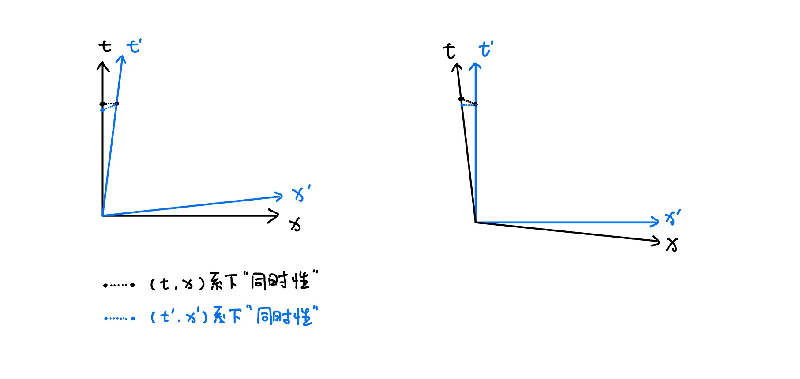

# 相对论

这是学习狭义相对论和广义相对论的学习指引，主要侧重于知识的逻辑体系，有些计算细节会被忽略。主要参考书是 P.A.M. Dirac 的《狄拉克讲广义相对论》和 Steven Weinberg 的《引力和宇宙学——广义相对论的原理和应用》。

## 非欧几何的简史

由于广义相对论是把 Riemann 几何应用于物理时空，这一理论与几何学有深入的联系，所以简单了解非欧几何的理论发展为学习广义相对论提供了一个可供类比的对象。

Euclid 在《几何原本》中提出了几何学可以从若干定义、公理、公设中演绎出来。但是其中的 Euclid 第五公设并不像其他假设那样明显，即
> “若一直线与二直线相交，其同侧二内角之和小于二直角，则当此二直线无限延长时，必相交于二内角和小于二直角之一侧。”

两千年来，几何学家试图证明第五公设是其他公设的逻辑结果，现在我们知道这是不可能的。为证明第五公设所作的努力导致了现代非欧几何的诞生。

### 新的几何

Gauss，Bolyai 和 Lobachevski 各自独立发现了现代术语所称的 二维负常曲率空间 。它描述的无限二维空间中，所有的 Euclid 假设（除了第五公设之外）全部满足。

但是，Euclid 第五公设可否由其他公设导出依然悬而未决。“证明”一个数学公设体系“自洽”的通常方法，就是从一致性（暂时）不成问题的其他体系中构造出一个满足这些公设的模型。对于 Euclid 几何和非欧几何来说，这“模型”都是由实数理论提供的。Descartes 的解析几何表明，若一点对应于一对实数 $(x_1,x_2)$ ，而 $(x_1,x_2)$ 与 $(X_1,X_2)$ 两点之间的距离等于 $\sqrt{(x_1-X_1)^2+(x_2-X_2)^2}$ ，则所有的 Euclid 公设都可以作为关于实数的定理而得到证明。在1870年， Felix Klein 为 Gauss, Bolyai 和 Lobachevski 几何构造了一种类似的解析几何——一点表示为一对实数 $(x_1,x_2)$ ，且
$$
x_1^2+x_2^2<1
$$
$x,X$ 两点之间的距离 $d(x,X)$ 定义为
$$
\cosh\left[\frac{d(x,X)}{a}\right]=\frac{1-x_1X_1-x_2X_2}{\sqrt{1-x_1^2-x_2^2}\sqrt{1-X_1^2-X_2^2}}
$$
这个模型满足除了 Euclid 第五公设外的所有公设，并且事实上服从 Gauss，Bolyai 和 Lobachevski 发现的几何。于是 Euclid 第五公设的逻辑独立性得到了确认。

### 度规

Gauss 在《关于曲面的一般研究》首次区分了曲面的 内在 性质（即生活在曲面内的小扁虫所体验到的几何）和它的 外在 性质（即它在较高维空间中的嵌入）两者的不同，任一曲面的基本的内在性质是度规函数 $d(x,X)$ ，它决定 $x$ 和 $X$ 在曲面上沿着它们之间的最短路径的距离。

Gauss 挑选出了一类特殊的度规空间，它广泛到既包含 Gauss，Bolyai 和 Lobachevski 空间，也包含通常的曲面，但又狭窄到还能称为几何学。Gauss 假定：在空间任一足够小的区域内都能找到一局部 Euclid 坐标系 $(\xi_1,\xi_2)$ 使得在坐标为 $(\xi_1,\xi_2)$ 与 $(\xi_1+\mathrm{d}\xi_1,\xi_2+\mathrm{d}\xi_2)$ 的两点之间距离满足勾股定理：
$$
\mathrm{d}s^2=\mathrm{d}\xi_1^2+\mathrm{d}\xi_2^2
$$
如果曲面是非 Euclid 的，那么用满足勾股定理的 Euclid 坐标系 $(\xi_1,\xi_2)$ 就不能覆盖它的任何有限部分。假定另一种能够覆盖全空间的坐标系 $(x_1,x_2)$ ，容易得到 $(x_1,x_2)$ 到 $(x_1+\mathrm{d}x_1,x_2+\mathrm{d}x_2)$ 两点之间距离
$$
\mathrm{d}s^2=g_{11}\mathrm{d}x_1^2+2g_{12}\mathrm{d}x_1\mathrm{d}x_2+g_{22}\mathrm{d}x_2^2
$$
$$
\begin{align}
g_{11}&=\left(\frac{\partial \xi_1}{\partial x_1}\right)^2+\left(\frac{\partial \xi_2}{\partial x_1}\right)^2 \\
g_{12}&=\left(\frac{\partial \xi_1}{\partial x_1}\right)\left(\frac{\partial \xi_1}{\partial x_2}\right)+\left(\frac{\partial \xi_2}{\partial x_1}\right)\left(\frac{\partial \xi_2}{\partial x_2}\right) \\
g_{22}&=\left(\frac{\partial \xi_1}{\partial x_2}\right)^2+\left(\frac{\partial \xi_2}{\partial x_2}\right)^2 \\
\end{align}
$$
$\mathrm{d}s^2$ 的这种形式是 度量 空间的标志。

::: info e.g.
对于半径为 $a$ 的球，取球坐标 $(\theta,\phi)$ ，度规函数
$$
g_{\theta\theta}=a^2,\quad g_{\theta\phi}=0,\quad g_{\phi\phi}=a^2\sin^2\theta \tag{a}
$$
对于 Gauss，Bolyai 和 Lobachevski 几何，用 Klein 模型坐标 $(x_1,x_2)$ ，度规函数
$$
\begin{align}
g_{11}&=\frac{a^2(1-x_2^2)}{(1-x_1^2-x_2^2)^2} \\
g_{12}&=\frac{a^2x_1x_2}{(1-x_1^2-x_2^2)^2} \\
g_{22}&=\frac{a^2(1-x_1^2)}{(1-x_1^2-x_2^2)^2}
\end{align}\tag{b}
$$
:::

度规函数 $g_{ij}$ 决定了度量空间的所有内在性质，但是度规函数也取决于我们如何选择坐标网格。例如，我们可以用极坐标 $(r,\theta)$ 来描述一个平面，其度规函数
$$
g_{rr}=1,\quad g_{r\theta}=0,\quad g_{\theta\theta}=r^2 \tag{c}
$$
那我们怎么才能由考察空间的度规系数从而得知它的内在性质呢？我们需要的是 $g_{ij}$ 及其导数的某个函数，它只依赖于空间的内在性质，而不像 $g_{ij}$ 那样还依赖于描述空间所选取的特定坐标系。

### 曲率

Gauss 发现了这个函数，并且发现它本质上是唯一的，这就是所谓的 Gauss 曲率：
$$
\begin{align}
K(x_1,x_2)={}&\frac{1}{2g}\left[2\frac{\partial^2 g_{12}}{\partial x_1\partial x_2}-\frac{\partial^2 g_{11}}{\partial x_2^2}-\frac{\partial^2 g_{22}}{\partial x_1^2}\right] \\
&-\frac{g_{22}}{4g^2}\left[\left(\frac{\partial g_{11}}{\partial x_1}\right)\left(2\frac{\partial g_{12}}{\partial x_2}-\frac{\partial g_{22}}{\partial x_2}\right)-\left(\frac{\partial g_{11}}{\partial x_2}\right)^2\right] \\
&+\frac{g_{12}}{4g^2}\biggl[\left(\frac{\partial g_{11}}{\partial x_1}\right)\left(\frac{\partial g_{22}}{\partial x_2}\right)-2\left(\frac{\partial g_{11}}{\partial x_2}\right)\left(\frac{\partial g_{22}}{\partial x_1}\right) \\
&+\left(2\frac{\partial g_{12}}{\partial x_1}-\frac{\partial g_{11}}{\partial x_2}\right)\left(2\frac{\partial g_{12}}{\partial x_2}-\frac{\partial g_{22}}{\partial x_1}\right)\biggr] \\
&-\frac{g_{11}}{4g^2}\left[\left(\frac{\partial g_{22}}{\partial x_2}\right)\left(2\frac{\partial g_{12}}{\partial x_1}-\frac{\partial g_{11}}{\partial x_2}\right)-\left(\frac{\partial g_{22}}{\partial x_1}\right)^2\right]
\end{align}
$$
其中 $g=\text{det} g_{ij}=g_{11}g_{22}-g_{12}^2$

::: info e.g.
将上式用于度规函数 (a)(b)(c) 有
$$
K=\frac{1}{a^2}\quad \text{(sphere)}
$$
$$
K=-\frac{1}{a^2}\quad \text{(G-B-L)}
$$
$$
K=0\quad \text{(plane)}
$$
:::

这是对二维空间的描述，而推广到二维以上，几何的描述将变得非常复杂。这个问题在1854年由 Georg Friedrich Bernhard Riemann 完全解决。他在哥廷根大学的就职讲演”论作为几何学基础的假设“提出了我们现在所说的 Riemann 几何。随后，由 Christoffel, Ricci, Levi-Civita, Beltrami 和其他人所做的工作把 Riemann 的观念发展成完美的数学结构（微分几何）。直到 Einstein 才看出物理学可以利用非欧几何。

## 张量分析

### 矢量和张量

用坐标变换规则定义矢量和张量。

在坐标变换 $x^\mu\rightarrow x'^\mu$ 下

- 标量不变
- 逆变矢量 $V^\mu$
  $$
  V'^\mu=V^\nu\frac{\partial x'^\mu}{\partial x^\nu}
  $$
  (e.g. 坐标的微分 $\mathrm{d}x^\nu$ )
- 协变矢量 $U_\mu$
  $$
  U'_\mu=\frac{\partial x^\nu}{\partial x'^\mu}U_\nu
  $$
  (e.g. 梯度/求偏导 $\frac{\partial}{\partial x^\nu}$ )
- 张量
  $$
  {{T'^\mu}_\nu}^\lambda=\frac{\partial x'^\mu}{\partial x^\kappa}\frac{\partial x^\rho}{\partial x'^\nu}\frac{\partial x'^\lambda}{\partial x^\sigma}{{T^\kappa}_\rho}^\sigma
  $$

特殊张量（分量在所有坐标系中相同）
1. Minkowski 张量
   $$
   \eta_{\alpha\beta}=\left\{\begin{array}{ll}
   +1 & \alpha=\beta=1,2,3 \\
   -1 & \alpha=\beta=0 \\
   0 & \alpha\neq\beta
   \end{array}\right.
   $$
2. Levi-Civita 张量
   $$
   \varepsilon^{\alpha\beta\gamma\delta}=\left\{\begin{array}{ll}
   +1 & \alpha\beta\gamma\delta \text{是} 0123 \text{的偶置换} \\
   -1 & \alpha\beta\gamma\delta \text{是} 0123 \text{的奇置换} \\
   0 & \text{其他情况}
   \end{array}\right.
   $$
3. 零张量

### 张量代数

可以通过以下运算构造张量

1. 线性组合
   $$
   {T^\mu}_\nu\equiv a{A^\mu}_\nu+b{B^\mu}_\nu
   $$

2. 直积
   $$
   {{T^\mu}_\nu}^\rho\equiv {A^\mu}_\nu B^\rho
   $$

3. 缩并
   $$
   T^{\mu\rho}\equiv {{T^\mu}_\nu}^{\rho\nu}
   $$

### 仿射联络的变换

物理中一个重要的非张量是仿射联络，定义为
$$
\Gamma^\lambda_{\mu\nu}\equiv\frac{\partial x^\lambda}{\partial \xi^\alpha}\frac{\partial^2\xi^\alpha}{\partial x^\mu\partial x^\nu}
$$

度规张量
$$
g_{\mu\nu}\equiv\frac{\partial \xi^\alpha}{\partial x^\mu}\frac{\partial \xi^\beta}{\partial x^\nu}\eta_{\alpha\beta}
$$

::: info 注
其物理定义见后文 [广义相对论-引力](/blog/physics/relativity.html#引力)
:::

记 Christoffel 记号
$$
\left\{\begin{array}{c}\lambda \\\mu\nu\end{array}\right\}\equiv\frac{1}{2}g^{\lambda\kappa}\left[\frac{\partial g_{\kappa\nu}}{\partial x^\mu}+\frac{\partial g_{\kappa\mu}}{\partial x^\nu}-\frac{\partial g_{\mu\nu}}{\partial x^\kappa}\right]
$$

可以证明
$$
\Gamma^\lambda_{\mu\nu}=\left\{\begin{array}{c}\lambda \\\mu\nu\end{array}\right\}
$$
::: info 注
可以通过纯张量运算证明
$$
\Gamma^\lambda_{\mu\nu}-\left\{\begin{array}{c}\lambda \\\mu\nu\end{array}\right\}
$$
是零张量。（详见 Steven Weinberg 的《引力和宇宙学——广义相对论的原理和应用》4.5 节）
:::

::: info 导出 Christoffel 符号
有另一方式自然导出 Christoffel 符号的表达式，即通过考察逆变矢量 $A^\mu$ 在弯曲空间的平行位移，借助高维空间坐标计算平行位移的变化 $\mathrm{d}A^\mu$ ，最后发现系数中涉及的高维坐标可以用弯曲空间的度规函数完全表示，此即 Christoffel 符号的表达式。（详见 P.A.M. Dirac 的《狄拉克讲广义相对论》）
:::

### 协变微分

张量的导数并非张量，故定义协变导数
- 逆变矢量
  $$
  {V^\mu}_{;\lambda}\equiv \frac{\partial V^\mu}{\partial x^\lambda}+\Gamma^\mu_{\lambda\kappa}V^\kappa
  $$
- 协变矢量
  $$
  V_{\mu;\nu}\equiv\frac{\partial V_\mu}{\partial x^\nu}-\Gamma^\lambda_{\mu\nu}V_\lambda
  $$
- 张量
  $$
  {T^{\mu\sigma}}_{\lambda;\rho}=\frac{\partial}{\partial x^\rho}{T^{\mu\sigma}}_\lambda+\Gamma^\mu_{\rho\nu}{T^{\nu\sigma}}_\lambda+\Gamma^\sigma_{\rho\nu}{T^{\mu\nu}}_\lambda-\Gamma^\kappa_{\lambda\rho}{T^{\mu\sigma}}_\kappa
  $$

### 沿一曲线的协变微分

沿曲线 $x^\mu(\tau)$ 的协变导数
$$
\frac{DA^\mu}{D\tau}\equiv\frac{\mathrm{d}A^\mu}{\mathrm{d}\tau}+\Gamma^\mu_{\nu\lambda}\frac{\mathrm{d}x^\lambda}{\mathrm{d}\tau}A^\nu
$$
$$
\frac{DB_\mu}{D\tau}\equiv\frac{\mathrm{d}B_\mu}{\mathrm{d}\tau}-\Gamma^\lambda_{\mu\nu}\frac{\mathrm{d}x^\nu}{\mathrm{d}\tau}B_\lambda
$$

## 狭义相对论

### Lorentz 变换

- Lorentz 变换是由一个时空坐标系 $x^\alpha$ 到另一个坐标系 $x'^\alpha$ 的变换，具有如下形式
  $$
  x'^\alpha={\Lambda^\alpha}_\beta x^\beta+a^\alpha
  $$
  其中 $a^\alpha$ 和 ${\Lambda^\alpha}_\beta$ 是常数，且满足
  $$
  {\Lambda^\alpha}_\gamma{\Lambda^\beta}_\delta\eta_{\alpha\beta}=\eta_{\gamma\delta}
  $$
  而
  $$
  \eta_{\alpha\beta}=\left\{\begin{array}{ll}
  +1 & \alpha=\beta=1,2,3 \\
  -1 & \alpha=\beta=0 \\
  0 & \alpha\neq\beta
  \end{array}\right.
  $$

- Lorentz 变换的基本性质是保持“固有时” $\mathrm{d}\tau$ 不变
  $$
  \mathrm{d}\tau^2\equiv\mathrm{d}t^2-\mathrm{d}\boldsymbol{x}^2=-\eta_{\alpha\beta}\mathrm{d}x^\alpha\mathrm{d}x^\beta
  $$

- Lorentz 变换矩阵
  
  $$
  {\Lambda^0}_0=\gamma,\quad {\Lambda^i}_0=\gamma v_i
  $$
  其中 $\gamma\equiv(1-\boldsymbol{v}^2)^{-1/2}$
  其他的 ${\Lambda^\alpha}_\beta$ 不是唯一确定的，一个方便的选择是
  $$
  {\Lambda^i}_j=\delta_{ij}+v_iv_j\frac{(\gamma-1)}{\boldsymbol{v}^2}
  $$
  $$
  {\Lambda^0}_j=\gamma v_j
  $$

### 钟慢效应

观者1观测静止时钟，两次滴答声的时空间隔为 $\mathrm{d}\boldsymbol{x}=0,\mathrm{d}t=\Delta t$ ，其中 $\Delta t$ 是时钟制造者确定的标称周期。该观者计算出固有时间隔
$$
\mathrm{d}\tau_1\equiv(\mathrm{d}t^2-\mathrm{d}\boldsymbol{x}^2)^{1/2}=\Delta t
$$
另有观者2观测到该时钟以速度 $\boldsymbol{v}$ 运动，观测到的两次滴答声的时空间隔为 $\mathrm{d}t',\mathrm{d}\boldsymbol{x}'=\boldsymbol{v}\mathrm{d}t'$ ，计算出固有时间隔
$$
\mathrm{d}\tau_2\equiv(\mathrm{d}t'^2-\mathrm{d}\boldsymbol{x}'^2)^{1/2}=(1-\boldsymbol{v}^2)^{1/2}\mathrm{d}t'
$$
由于 Lotentz 变换固有时不变，由 $\mathrm{d}\tau_1=\mathrm{d}\tau_2$ 有
$$
\mathrm{d}t'=(1-\boldsymbol{v}^2)^{-1/2}\Delta t=\gamma\Delta t
$$
此即钟慢效应。

::: info relativity
注意“同时”的相对性就体现在 Lotentz 变换时对固有时的计算。例如上面的表述就是基于观者1系下的“同时性”得到的结果，如果利用观者2系下的“同时性”，那么上述结果可以完全对换过来。不同系下的“同时性”不同保证了每个参考系下的“动钟”都变慢。

:::

::: info Doppler
再考虑 Doppler 效应，光子频率 $f=1/\Delta t$ ，运动观者观测光源两次发射的波前时间间隔 $\mathrm{d}t'=\gamma\Delta t$ ，但在此期间观者与光源距离增加 $-\vec{v}\cdot\hat{k}\mathrm{d}t'$ ，$\hat{k}$ 为光子空间波矢。因此观者两次接受到波前的周期为
$$
\mathrm{d}t_0=(1-\vec{v}\cdot\hat{k})\mathrm{d}t'=(1-\vec{v}\cdot\hat{k})\gamma\Delta t
$$
:::

### 四维力

定义相对论性的力 $f^\alpha$
$$
f^\alpha=m\frac{\mathrm{d}^2 x^\alpha}{\mathrm{d}\tau^2}
$$
1. 对于瞬间静止的粒子， $f^\alpha=F^\alpha$ ，其中 $F^i$ 是非相对论力 $\boldsymbol{F}$ 的 Descartes 分量， $F^0\equiv0$
2. 在一般 Lorentz 变换下， $f'^\alpha={\Lambda^\alpha}_\beta f^\beta$

故有
$$
f^i=F^i+(\gamma-1)v^i\frac{(\boldsymbol{v}\cdot\boldsymbol{F})}{\boldsymbol{v}^2}
$$
$$
f^0=\gamma\boldsymbol{v}\cdot\boldsymbol{F}
$$

### 四维动量

定义能量-动量四维矢量
$$
p^\alpha\equiv m\frac{\mathrm{d}x^\alpha}{\mathrm{d}\tau}
$$
其空间分量构成动量矢量
$$
\boldsymbol{p}=m\gamma \boldsymbol{v}
$$
其时间分量是能量
$$
p^0=m\gamma
$$

### 电流和密度

由位置 $\boldsymbol{x}_n(t)$ ，电荷 $e_n$ 的粒子组成的系统，电流密度和电荷密度分别为
$$
\boldsymbol{J}(\boldsymbol{x},t)\equiv\sum_n e_n\delta^3(\boldsymbol{x}-\boldsymbol{x}_n(t))\frac{\mathrm{d}\boldsymbol{x}_n(t)}{\mathrm{d}t}
$$
$$
\varepsilon(\boldsymbol{x},t)\equiv\sum_n e_n\delta^3(\boldsymbol{x}-\boldsymbol{x}_n(t))
$$
这里的 $\delta^3$ 是 Dirac 的 $\delta$ 函数，定义为
$$
\int\mathrm{d}^3x f(\boldsymbol{x})\delta^3(\boldsymbol{x}-\boldsymbol{y})=f(\boldsymbol{y})
$$

可以把 $\boldsymbol{J}$ 和 $\varepsilon$ 统一在一个四维矢量 $J^\alpha$ 中：
$$
J^\alpha(x)\equiv\sum_n e_n\delta^3(\boldsymbol{x}-\boldsymbol{x}_n(t))\frac{\mathrm{d}{x_n}^\alpha(t)}{\mathrm{d}t}
$$

### 电动力学

引入电磁场逆变张量
$$
F^{\alpha\beta}=\left[\begin{array}{cccc}
0 & E_x & E_y & E_z \\
-E_x & 0 & B_z & -B_y \\
-E_y & -B_z & 0 & B_x \\
-E_z & B_y & -B_x & 0
\end{array}\right]
$$
对应协变张量
$$
F_{\mu\nu}\equiv\eta_{\mu\alpha}\eta_{\nu\beta}F^{\alpha\beta}=\left[\begin{array}{cccc}
0 & -E_x & -E_y & -E_z \\
E_x & 0 & B_z & -B_y \\
E_y & -B_z & 0 & B_x \\
E_z & B_y & -B_x & 0
\end{array}\right]
$$

则原 Maxwell 方程组
$$
\nabla\cdot\boldsymbol{E}=\varepsilon \tag{m1}
$$
$$
\nabla\times\boldsymbol{B}=\frac{\partial \boldsymbol{E}}{\partial t}+\boldsymbol{J} \tag{m2}
$$
$$
\nabla\cdot\boldsymbol{B}=0 \tag{m3}
$$
$$
\nabla\times\boldsymbol{E}=-\frac{\partial \boldsymbol{B}}{\partial t} \tag{m4}
$$

其中 (m1)(m2) 可以写为
$$
\frac{\partial}{\partial x^\alpha}F^{\alpha\beta}=-J^\beta
$$
而 (m3)(m4) 可以写为
$$
\varepsilon^{\alpha\beta\gamma\delta}\frac{\partial}{\partial x^\beta}F_{\gamma\delta}=0
$$

### 能量-动量张量

对能量-动量四维矢量的密度和流密度给出类似的定义。考察一组由 $n$ 标记的粒子，对应能动矢量为 ${p_n}^\alpha(t)$ ，$p^\alpha$ 的密度为
$$
T^{\alpha 0}(\boldsymbol{x},t)=\sum_n {p_n}^\alpha(t)\delta^3(\boldsymbol{x}-\boldsymbol{x}_n(t))
$$
$p^\alpha$ 的流为
$$
T^{\alpha i}(\boldsymbol{x},t)=\sum_n {p_n}^\alpha(t)\frac{\mathrm{d}{x_n}^i(t)}{\mathrm{d}t}\delta^3(\boldsymbol{x}-\boldsymbol{x}_n(t))
$$
故能动张量
$$
\begin{align}
T^{\alpha \beta}(\boldsymbol{x},t)&=\sum_n {p_n}^\alpha(t)\frac{\mathrm{d}{x_n}^\beta(t)}{\mathrm{d}t}\delta^3(\boldsymbol{x}-\boldsymbol{x}_n(t)) \\
&=\sum_n \frac{{p_n}^\alpha{p_n}^\beta}{E_n}\delta^3(\boldsymbol{x}-\boldsymbol{x}_n(t))
\end{align}
$$

## 广义相对论

广义相对论是关于 引力 的理论，包含引力场的数学描述和决定引力场本身的微分方程两部分。

### 引力场

#### 等效原理

- 等效原理：
  
  在任意引力场里的每一个时空点，有可能选择一个“局部惯性系”，使得在所讨论的那一点附近的充分小的领域内，自然规律的形式，与没有引力场时在未加速的 Descartes 坐标系里具有相同的形式。

::: info 类比
- Gauss 的假设隐含：一个曲面上的所有内在性质可以通过把曲面上某个一般坐标系 $x^\mu$ 变到局部 Descartes 坐标系 $\xi^\alpha$ 的变换 $x\rightarrow\xi$ 的函数 $\xi^\alpha(x)$ 的偏导数 $\partial\xi^\alpha/\partial x^\mu$ 来描写
- 等效原理告诉我们：引力场的全部效应可以通过确定从“实验室”坐标 $x^\mu$ 到局部惯性坐标 $\xi^\alpha$ 的变换函数 $\xi^\alpha(x)$ 的偏导数 $\partial \xi^\alpha/\partial x^\mu$ 来描写
:::

- 广义协变原理：

  物理方程只要满足以下两个条件：

  (1) 这个方程在没有引力场的时候成立；即当度规张量 $g_{\alpha\beta}$ 等于 Minkowski 张量 $\eta_{\alpha\beta}$ ，而且仿射联络 $\Gamma^\alpha_{\beta\gamma}$ 为零时，它和狭义相对论的定律一致；

  (2) 这个方程是广义协变的；即在一般的坐标变换 $x\rightarrow x'$ 下，它保持自己的形式不变。

  那么该物理方程在一般的引力场中也成立。

::: info 注
广义协变原理是等效原理的另一种表述。
:::

#### 引力

纯粹引力作用下自由运动粒子，存在一个自由降落坐标系 $\xi^\alpha$ ，粒子的运动方程及固有时
$$
\frac{\mathrm{d}^2\xi^\alpha}{\mathrm{d}\tau^2}=0
$$
$$
\mathrm{d}\tau^2=-\eta_{\alpha}\mathrm{d}\xi^\alpha\mathrm{d}\xi^\beta
$$

采用任意别的坐标系 $x^\mu$ ，有
$$
\frac{\mathrm{d}^2 x^\lambda}{\mathrm{d}\tau^2}+\Gamma^\lambda_{\mu\nu}\frac{\mathrm{d}x^\mu}{\mathrm{d}\tau}\frac{\mathrm{d}x^\nu}{\mathrm{d}\tau}=0
$$
$$
\mathrm{d}\tau^2=-g_{\mu\nu}\mathrm{d}x^\mu\mathrm{d}x^\nu
$$
其中仿射联络
$$
\Gamma^\lambda_{\mu\nu}\equiv\frac{\partial x^\lambda}{\partial \xi^\alpha}\frac{\partial^2 \xi^\alpha}{\partial x^\mu\partial x^\nu}
$$
度规张量
$$
g_{\mu\nu}\equiv\frac{\partial\xi^\alpha}{\partial x^\mu}\frac{\partial \xi^\beta}{\partial x^\nu}\eta_{\alpha\beta}
$$

#### $g_{\mu\nu}$ 和 $\Gamma^\lambda_{\mu\nu}$ 的关系

$$
\Gamma^\lambda_{\mu\nu}=\frac{1}{2}g^{\lambda\kappa}\left[\frac{\partial g_{\kappa\nu}}{\partial x^\mu}+\frac{\partial g_{\kappa\mu}}{\partial x^\nu}-\frac{\partial g_{\mu\nu}}{\partial x^\kappa}\right]
$$

::: info 注
具体计算详见 Steven Weinberg 的《引力和宇宙学——广义相对论的原理和应用》3.3 节。
:::

#### Newton 极限

检验广义相对论在低速定态弱引力场近似下与 Newton 理论衔接。

$$
\frac{\mathrm{d}^2x^\mu}{\mathrm{d}\tau^2}+\Gamma^\mu_{00}\left(\frac{\mathrm{d}t}{\mathrm{d}\tau}\right)^2=0
$$
$$
\Gamma^\mu_{00}=-\frac{1}{2}g^{\mu\nu}\frac{\partial g_{00}}{\partial x^\nu}
$$
$$
g_{\alpha\beta}=\eta_{\alpha\beta}+h_{\alpha\beta},\quad |h_{\alpha\beta}|\ll 1
$$
$$
\Gamma^\alpha_{00}=-\frac{1}{2}\eta^{\alpha\beta}\frac{\partial h_{00}}{\partial x^\beta}
$$
$$
\left\{\begin{array}{l}
\dfrac{\mathrm{d}^2\boldsymbol{x}}{\mathrm{d}\tau^2}=\dfrac{1}{2}\left(\dfrac{\mathrm{d}t}{\mathrm{d}\tau}\right)^2\nabla h_{00} \\
\dfrac{\mathrm{d}^2t}{\mathrm{d}\tau^2}=0
\end{array}\right.
$$
$$
\frac{\mathrm{d}^2\boldsymbol{x}}{\mathrm{d}t^2}=-\frac{1}{2}\nabla h_{00}
$$
对应 Newton 的结果为
$$
\frac{\mathrm{d}^2\boldsymbol{x}}{\mathrm{d}t^2}=-\nabla \phi
$$

$$
\Rightarrow g_{00}=-(1+2\phi)
$$

#### 引力红移

钟的“滴答”之间的时空间隔为
$$
\Delta t=(-g_{\mu\nu}\mathrm{d}x^\mu\mathrm{d}x^\nu)^{1/2}
$$
当钟的速度为 $\mathrm{d}x^\mu/\mathrm{d}t$ ，那么“滴答”之间的时间间隔 $\mathrm{d}t$ 由下式决定
$$
\frac{\mathrm{d}t}{\Delta t}=\left(-g_{\mu\nu}\frac{\mathrm{d}x^\mu}{\mathrm{d}t}\frac{\mathrm{d}x^\nu}{\mathrm{d}t}\right)^{1/2}
$$
当钟静止，
$$
\frac{\mathrm{d}t}{\Delta t}=(-g_{00})^{1/2}
$$
::: info 注
单纯测量“滴答”之间的时间间隔是无法确定上式中的膨胀因子的，因为引力场对时间标准的影响等同于它对钟的影响。
:::
但是我们可以比较引力场中不同两点处的时间膨胀因子。例如特定原子跃迁发出的光
$$
\mathrm{d}t_2=\Delta t(-g_{00}(x_2))^{1/2}
$$
$$
\mathrm{d}t_1=\Delta t(-g_{00}(x_1))^{1/2}
$$
$$
\begin{align}
\frac{\nu_2}{\nu_1}&=\left(\frac{g_{00}(x_2)}{g_{00}(x_1)}\right)^{1/2} \\
&=\left(\frac{1+2\phi(x_2)}{1+2\phi(x_1)}\right)^{1/2} \\
&=\left(1+\frac{2\phi(x_2)-2\phi(x_1)}{1+2\phi(x_1)}\right)^{1/2} \\
&\approx 1+\frac{\phi(x_2)-\phi(x_1)}{1+2\phi(x_1)} \\
&\approx 1+(\phi(x_2)-\phi(x_1))
\end{align}
$$

#### 引力效应

引力对力学和电动力学方程的影响：

写下狭义相对论中成立的方程，然后决定方程中每一个量在一般坐标变换下应如何变换，再把 $\eta_{\mu\nu}$ 换成 $g_{\mu\nu}$ ，把所有的导数换成协变导数，所得到的方程就是广义协变的。

### 引力场方程

#### 曲率

- Riemann-Christoffel 曲率张量
  $$
  {R^\lambda}_{\mu\nu\kappa}\equiv\frac{\partial\Gamma^\lambda_{\mu\nu}}{\partial x^\kappa}-\frac{\partial\Gamma^\lambda_{\mu\kappa}}{\partial x^\nu}+\Gamma^\eta_{\mu\nu}\Gamma^\lambda_{\kappa\eta}-\Gamma^\eta_{\mu\kappa}\Gamma^\lambda_{\nu\eta}
  $$

- Ricci 张量
  $$
  R_{\mu\kappa}\equiv {R^\lambda}_{\mu\lambda\kappa}
  $$

- Ricci 标量
  $$
  R=g^{\mu\kappa}R_{\mu\kappa}
  $$

- 一个任意矢量 $S_\mu$ 围绕 $X$ 点的一个任意小的封闭曲线平行移动时不发生变化的充要条件是在 $X$ 点处的 ${R^\sigma}_{\mu\nu\rho}=0$

#### 引力和曲线坐标

给定一个度规张量 $g_{\mu\nu}(x)$ ，我们怎么判断其充满了引力场，还是 $g_{\mu\nu}$ 仅仅是在曲线坐标下写出的狭义相对论的度规 $\eta_{\mu\nu}$ ？或者说，怎么知道是否存在一组 Minkowski 坐标 $\xi^\alpha(x)$ ，处处满足
$$
g_{\mu\nu}=\frac{\partial \xi^\alpha}{\partial x^\mu}\frac{\partial \xi^\beta}{\partial x^\nu}\eta_{\alpha\beta}
$$

一个度规 $g_{\mu\nu}$ 和 Minkowski 度规 $\eta_{\mu\nu}$ 等价的充要条件是：

(1) 由 $g_{\mu\nu}$ 算出的曲率张量处处为零
$$
{R^\lambda}_{\mu\nu\kappa}=0
$$
(2) 在某点 $X$ ，度规 $g_{\mu\nu}(X)$ 有三个正的和一个负的本征值。

#### Einstein 场方程

定态弱场中度规张量的时-时分量
$$
g_{00}\simeq-(1+2\phi)
$$
Newton 势满足 Poisson 方程
$$
\nabla^2\phi=4\pi G\rho
$$
能量密度
$$
T_{00}\simeq \rho
$$
结合上述诸式有
$$
\nabla^2 g_{00}=-8\pi GT_{00}
$$

猜测对于一般的能量-动量分布 $T_{\alpha\beta}$ ，有场方程
$$
G_{\alpha\beta}=-8\pi GT_{\alpha\beta}
$$
由 $G_{\alpha\beta}$ 张量需要满足的一系列条件最终可得
$$
G_{\mu\nu}=R_{\mu\nu}-\frac{1}{2}g_{\mu\nu}R
$$

故 Einstein 场方程
$$
R_{\mu\nu}-\frac{1}{2}g_{\mu\nu}R=-8\pi GT_{\mu\nu}
$$
在真空中，简化为
$$
R_{\mu\nu}=0
$$
