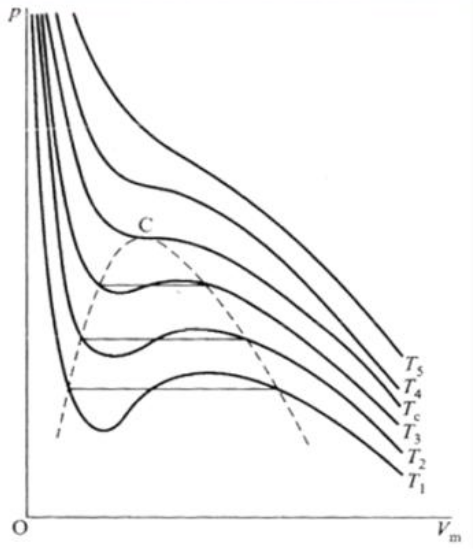
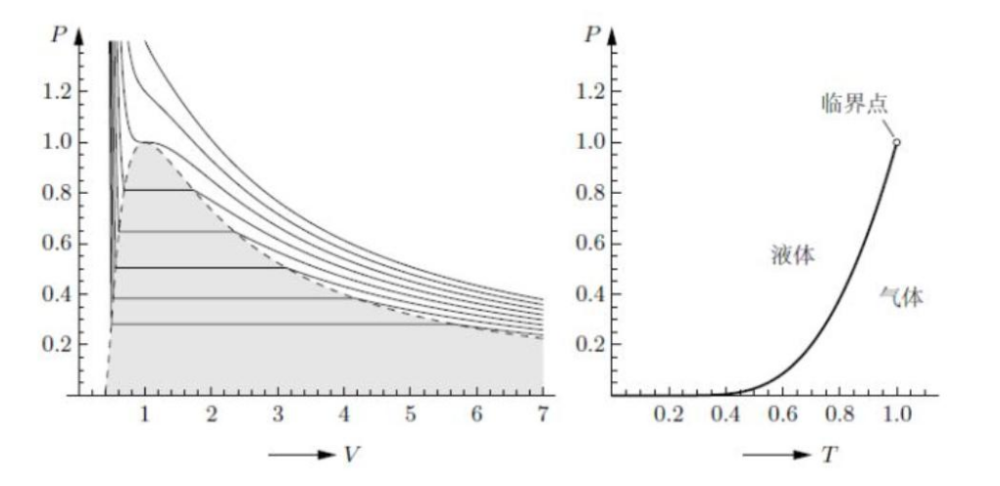

# 热力学与统计物理

## 热力学

### 基本概念

1. 热力学系统；绝热壁，导热壁，刚性壁；孤立系，闭系，开系
2. 平衡态：在没有外界影响的条件下，物体各部分的性质长时间内不发生任何变化的状态。

    弛豫时间
3. 状态变量（几何、力学、电磁、化学），温度，态函数；广延量，强度量
4. 热平衡定律（热力学第零定律）：引入温度
5. 物态方程：

    - 三个力学响应函数
        - 等压膨胀系数
        $$
        \alpha\equiv\frac{1}{V}\left(\frac{\partial V}{\partial T}\right)_p
        $$
    
        - 压强系数
        $$
        \beta\equiv\frac{1}{p}\left(\frac{\partial p}{\partial T}\right)_V
        $$
    
        - 等温压缩系数
        $$
        \kappa_T\equiv-\frac{1}{V}\left(\frac{\partial V}{\partial p}\right)_T
        $$
    
    ::: info 系数关系
    $$
    \left(\frac{\partial p}{\partial T}\right)_V\left(\frac{\partial T}{\partial V}\right)_p\left(\frac{\partial V}{\partial p}\right)_T=-1
    $$
    $$
    \Rightarrow \left(\frac{\partial p}{\partial T}\right)_V=-\frac{1}{\left(\dfrac{\partial T}{\partial V}\right)_p\left(\dfrac{\partial V}{\partial p}\right)_T}=-\frac{\left(\dfrac{\partial V}{\partial T}\right)_p}{\left(\dfrac{\partial V}{\partial p}\right)_T}=\frac{\alpha}{\kappa}
    $$
    $$
    \Rightarrow \alpha=\kappa\beta p
    $$
    :::

    - 理想气体（实际气体压强趋于零的极限）
    $$
    pV=NRT
    $$
    ::: info 理想气体的响应函数
    $$
    \alpha=\frac{1}{T},\quad \beta=\frac{1}{T},\quad \kappa_T=\frac{1}{p}
    $$
    :::
    ::: info 适用条件
    1. 理想气体
    2. 不考虑重力
    3. 平衡态
    :::
    ::: info 理想气体假设
    - 微观上：（1）忽略分子体积；（2）忽略分子间作用力
    - 宏观上：低压、低密
    :::

    - 范德瓦耳斯气体（考虑分子之间相互作用） $\left(p+\dfrac{N^2a}{V^2}\right)(V-Nb)=NRT$
    - 昂尼斯 (Onnes) 方程（低压展开，压强幂级数） $pV=NRT(1+A_2p+A_3p^2+\cdots)$
    - 顺磁固体，居里 (Curie) 定律

### 热力学第一定律/内能

1. 热力学第一定律（能量守恒） $\Delta U=W+Q$

    $$
    \mathrm{d}U=\delta W+\delta Q
    $$

    其中 $W$ 为外界对系统做功， $Q$ 是系统吸收热量。

2. 内能（态函数） $U$
    
    焓（态函数） $H=U+pV$ （等压过程系统吸热等于焓变）
    ::: info 理想气体内能只是温度函数的实验证明
    1. 盖吕萨克-焦耳“绝热自由膨胀”实验

        $$
        U=U(T,V)
        $$

        等内能过程

        $$
        \left(\frac{\partial U}{\partial V}\right)_T=-\left(\frac{\partial U}{\partial T}\right)_V\left(\frac{\partial T}{\partial V}\right)_U=-C_V\left(\frac{\partial T}{\partial V}\right)_U=0
        $$
        $$
        \left(\frac{\partial U}{\partial V}\right)_T=0\Rightarrow U=U(T)
        $$

    2. 焦耳-汤姆孙“多孔塞节流”实验

        $$
        H=U+pV=U(T,p)+NRT=H(T,p)
        $$

        等焓过程 $p_2V_2-p_1V_1=U_1-U_2$

        $$
        \left(\frac{\partial H}{\partial p}\right)_T=-\left(\frac{\partial H}{\partial T}\right)_p\left(\frac{\partial T}{\partial p}\right)_H=-C_p\left(\frac{\partial T}{\partial p}\right)_H=0
        $$
        $$
        \left(\frac{\partial H}{\partial p}\right)_T=0\Rightarrow H=H(T)
        $$
    :::

    ::: tip 注
    只有理想气体的内能只与温度有关，实际气体还与体积/压强有关。
    :::

3. 绝热过程、准静态过程（一直平衡态）
4. 等容热容量
    $$
    C_V=\lim_{\Delta T\rightarrow 0}\left(\frac{\Delta Q}{\Delta T}\right)_V=\left(\frac{\partial U}{\partial T}\right)_V
    $$

    等压热容量
    $$
    \begin{align}
    C_p&=\lim_{\Delta T\rightarrow 0}\left(\frac{\Delta U+p\Delta V}{\Delta T}\right)_p=\left(\frac{\partial U}{\partial T}\right)_p+p\left(\frac{\partial V}{\partial T}\right)_p \\
    &=\left(\frac{\partial H}{\partial T}\right)_p
    \end{align}
    $$

5. 迈耶 (Mayer) 方程
    $$
    C_p-C_V=\left[p+\left(\frac{\partial U}{\partial V}\right)_T\right]\left(\frac{\partial V}{\partial T}\right)_p
    $$
    对于理想气体
    $$
    C_p-C_V=NR
    $$
    ::: info derivation
    $$
    \begin{align}
    U(T,V)&=\left(\frac{\partial U}{\partial T}\right)_V\mathrm{d}T+\left(\frac{\partial U}{\partial V}\right)_T\mathrm{d}V \\
    &=\left(\frac{\partial U}{\partial T}\right)_V\mathrm{d}T+\left(\frac{\partial U}{\partial V}\right)_T\left(\frac{\partial V}{\partial T}\right)_p\mathrm{d}T\quad(\text{using  }\mathrm{d}p=0)
    \end{align}
    $$
    $$
    \Rightarrow \left(\frac{\partial U}{\partial T}\right)_p=\left(\frac{\partial U}{\partial T}\right)_V+\left(\frac{\partial U}{\partial V}\right)_T\left(\frac{\partial V}{\partial T}\right)_p
    $$
    $$
    \begin{align}
    C_p-C_V&=\left(\frac{\partial H}{\partial T}\right)_p-\left(\frac{\partial U}{\partial T}\right)_V \\
    &=\left(\frac{\partial(U+pV)}{\partial T}\right)_p-\left(\frac{\partial U}{\partial T}\right)_V \\
    &=\left(\frac{\partial U}{\partial T}\right)_p+p\left(\frac{\partial V}{\partial T}\right)_p-\left(\frac{\partial U}{\partial T}\right)_V \\
    &=\left[p+\left(\frac{\partial U}{\partial V}\right)_T\right]\left(\frac{\partial V}{\partial T}\right)_p
    \end{align}
    $$
    对于理想气体 $pV=NRT$
    $$
    \left\{\begin{array}{l}
    \left(\dfrac{\partial U}{\partial V}\right)_T=0 \\
    \left(\dfrac{\partial V}{\partial T}\right)_p=\dfrac{NR}{p}
    \end{array}\right.
    \Rightarrow C_p-C_V=p\frac{NR}{p}=NR
    $$
    :::

6. 过程方程 $pV^\gamma=C$

    | | | |
    |:--:|:--:|:--:|
    |$\gamma=0$| $p=\text{const}$| 等压|
    |$\gamma=1$| $pV=\text{const}$| 等温|
    |$\gamma=C_p/C_V$| $pV^\gamma=\text{const}$| 绝热|
    |$\gamma=\infty$| $V=\text{const}$| 等容|

    绝热方程 $pV^\gamma=\text{const}$, $TV^{\gamma-1}=\text{const}$, $\dfrac{T^\gamma}{p^{\gamma-1}}=\text{const}$

    ::: info 推导绝热过程方程
    $$
    \delta Q=0
    $$
    $$
    \Leftrightarrow\mathrm{d}U+p\mathrm{d}V=0
    $$
    $$
    \Leftrightarrow C_V\mathrm{d}T+p\mathrm{d}V=0
    $$
    $$
    pV=NRT
    $$
    $$
    \Rightarrow p\mathrm{d}V+V\mathrm{d}p=NR\mathrm{d}T
    $$
    $$
    \Rightarrow p\mathrm{d}V+V\mathrm{d}p=C_V(\gamma-1)\mathrm{d}T
    $$
    联立消 $\mathrm{d}T$ 得
    $$
    V\mathrm{d}p+\gamma p\mathrm{d}V=0
    $$
    $$
    \Rightarrow \frac{\mathrm{d}p}{p}+\gamma\frac{\mathrm{d}V}{V}=0
    $$
    $$
    \Rightarrow pV^\gamma=\text{const}
    $$
    :::

### 热力学第二定律/熵与熵变

1. 热机，通常以气体作为工质（气体体积变化大）

2. 可逆过程、不可逆过程 （外界变化）

    无摩擦的准静态过程为可逆过程

    ::: tip 理解
    可逆过程保证了过程量 $(\delta Q,\delta W)$ 可以用状态函数微分 $(T\mathrm{d}S,p\mathrm{d}V)$ 表示。
    :::

3. 热力学第二定律：（自发过程不可逆）

    - Clausius 不可能把热量从低温物体传递到高温物体而不引起其他变化
    - Kelvin-Planck 不可能从单一热源吸热使之完全变成功而不引起其他变化

4. 卡诺定理：

    工作在两个一定温度间的热机，可逆机效率最高
    $$
    \eta=\frac{Q_1-Q_2}{Q_1}\le\frac{T_1-T_2}{T_1}
    $$

5. 熵（态函数） Entropy
    $$
    S_1-S_0=\int_0^1\frac{\delta Q}{T}
    $$
    - 积分沿可逆过程
    - 广延量
    - 差值才有意义
    - 对于任意过程：
        $$
        S_1-S_0\ge\int_0^1\frac{\delta Q}{T},\quad \mathrm{d}S\ge\frac{\delta Q}{T}
        $$

6. 热力学基本方程
    $$
    \mathrm{d}U=T\mathrm{d}S-p\mathrm{d}V
    $$
    $$
    \mathrm{d}U=T\mathrm{d}S+\sum Y_i\mathrm{d}y_i
    $$
    ::: info derivation
    热力学第一定律 $\mathrm{d}U=\delta Q+\delta W$

    对可逆过程有 $\delta W=-p\mathrm{d}V$

    结合熵的微分式 $\delta Q=T\mathrm{d}S$
    $$
    \mathrm{d}U=T\mathrm{d}S-p\mathrm{d}V
    $$

    广义形式，外界对系统做功为 $\delta W=\sum Y_i\mathrm{d}y_i$
    :::
    ::: tip 理解
    热力学基本方程从可逆过程中推导出来，但是结果只与状态量有关，与过程量无关，所以适用于不可逆过程。

    对于不可逆过程，$T\mathrm{d}S>\delta Q$, $\sum Y_i\mathrm{d}y_i<\delta W$, $T\mathrm{d}S+\sum Y_i\mathrm{d}y_i=\delta Q+\delta W=\mathrm{d}U$
    :::

7. 熵增原理：

    系统经过绝热过程， $\mathrm{d}S\ge 0$

    孤立系统自发过程朝着熵增加的方向进行，平衡时熵最大。

::: tip 注
热源默认足够大，温度不变。

物体则温度会变。
:::

8. 理想气体的熵 （理想气体的 $T\mathrm{d}S$ 方程）：

    - $(T,V)$:
        $$
        \mathrm{d}S=\frac{C_V}{T}\mathrm{d}T+\frac{nR}{V}\mathrm{d}V
        $$
        $$
        S=\int\frac{C_V}{T}\mathrm{d}T+nR\ln V+S_0
        $$
        ::: info derivation
        $$
        \left.\begin{array}{l}
        \mathrm{d}U=C_V\mathrm{d}T \\
        \mathrm{d}U=T\mathrm{d}S-p\mathrm{d}V \\
        pV=nRT
        \end{array}\right\}\Rightarrow
        \mathrm{d}S=\frac{\mathrm{d}U+p\mathrm{d}V}{T}=\frac{C_V}{T}\mathrm{d}T+\frac{nR}{V}\mathrm{d}V
        $$
        :::
    - $(T,p)$:
        $$
        \mathrm{d}S=\frac{C_p}{T}\mathrm{d}T-nR\frac{\mathrm{d}p}{p}
        $$
        $$
        S=\int\frac{C_p}{T}\mathrm{d}T-nR\ln p+S_0
        $$
        ::: info derivation
        $$
        pV=nRT \Rightarrow \frac{\mathrm{d}p}{p}+\frac{\mathrm{d}V}{V}=\frac{\mathrm{d}T}{T}
        $$
        $$
        \begin{align}
        \mathrm{d}S&=\frac{C_V}{T}\mathrm{d}T+\frac{nR}{V}\mathrm{d}V \\
        &=\frac{C_V}{T}\mathrm{d}T+\frac{nR}{T}\mathrm{d}T-\frac{nR}{p}\mathrm{d}p \\
        &=\frac{C_p}{T}\mathrm{d}T-\frac{nR}{p}\mathrm{d}p
        \end{align}
        $$
        :::

9. $T\mathrm{d}S$ 方程（一般气体）：
    $$
    T\mathrm{d}S=C_V\mathrm{d}T+T\left(\frac{\partial p}{\partial T}\right)_V\mathrm{d}V=C_V\mathrm{d}T+\frac{T\alpha}{\kappa}\mathrm{d}V
    $$
    $$
    T\mathrm{d}S=C_p\mathrm{d}T-T\left(\frac{\partial V}{\partial T}\right)_p\mathrm{d}p=C_p\mathrm{d}T-TV\alpha\mathrm{d}p
    $$
    $$
    T\mathrm{d}S=C_p\left(\frac{\partial T}{\partial V}\right)_p\mathrm{d}V+C_V\left(\frac{\partial T}{\partial p}\right)_V\mathrm{d}p=\frac{C_p}{\alpha V}\mathrm{d}V+\frac{C_V\kappa}{\alpha}\mathrm{d}p
    $$

    ::: info derivation
    1. 热力学基本方程+内能全微分
    $$
    \left\{\begin{array}{l}
        \displaystyle \mathrm{d}S=\frac{1}{T}(\mathrm{d}U+p\mathrm{d}V) \\
        \displaystyle \mathrm{d}U=\left(\frac{\partial U}{\partial T}\right)_V\mathrm{d}T+\left(\frac{\partial U}{\partial V}\right)_T\mathrm{d}V
    \end{array}\right.
    $$
    $$
    \Rightarrow \mathrm{d}S=\frac{1}{T}\left(\frac{\partial U}{\partial T}\right)_V\mathrm{d}T+\frac{1}{T}[\left(\frac{\partial U}{\partial V}\right)_T+p]\mathrm{d}V
    $$
    2. +熵全微分
    $$
    \left\{\begin{array}{l}
        \displaystyle \mathrm{d}S=\frac{1}{T}\left(\frac{\partial U}{\partial T}\right)_V\mathrm{d}T+\frac{1}{T}[\left(\frac{\partial U}{\partial V}\right)_T+p]\mathrm{d}V \\
        \displaystyle \mathrm{d}S=\left(\frac{\partial S}{\partial T}\right)_V\mathrm{d}T+\left(\frac{\partial S}{\partial V}\right)_T\mathrm{d}V
    \end{array}\right.
    $$
    $$
    \Rightarrow \left\{\begin{array}{l}
        \left(\dfrac{\partial S}{\partial T}\right)_V=\dfrac{1}{T}\left(\dfrac{\partial U}{\partial T}\right)_V \\
        \left(\dfrac{\partial S}{\partial V}\right)_T=\dfrac{1}{T}[\left(\dfrac{\partial U}{\partial V}\right)_T+p]
    \end{array}\right.
    $$
    3. 二阶混合偏导
    $$
    \left[\frac{\partial}{\partial V}\left(\frac{\partial S}{\partial T}\right)_V\right]_T=\left[\frac{\partial}{\partial T}\left(\frac{\partial S}{\partial V}\right)_T\right]_V
    $$
    $$
    \Rightarrow 0=-\frac{1}{T^2}[\left(\frac{\partial U}{\partial V}\right)_T+p]+\frac{1}{T}[0+\left(\frac{\partial p}{\partial T}\right)_V]
    $$
    $$
    \Rightarrow \left(\frac{\partial U}{\partial V}\right)_T=T\left(\frac{\partial p}{\partial T}\right)_V-p
    $$
    4. 代回熵全微分
    $$
    T\mathrm{d}S=C_V\mathrm{d}T+T\left(\frac{\partial p}{\partial T}\right)_V\mathrm{d}V=C_V\mathrm{d}T+\frac{T\alpha}{\kappa}\mathrm{d}V
    $$
    这就是第一个 $T\mathrm{d}S$ 方程 $S(T,V)$

    通过变换得到第二个 $T\mathrm{d}S$ 方程 $S(T,p)$ ：

    1. 由迈耶 (Mayer) 方程
        $$
        \begin{align}
        C_p-C_V&=\left[p+\left(\frac{\partial U}{\partial V}\right)_T\right]\left(\frac{\partial V}{\partial T}\right)_p \\
        &=T\left(\frac{\partial p}{\partial T}\right)_V\left(\frac{\partial V}{\partial T}\right)_p
        \end{align}
        $$
    2. 变量代换
        $$
        \mathrm{d}V=\left(\frac{\partial V}{\partial T}\right)_p\mathrm{d}T+\left(\frac{\partial V}{\partial p}\right)_T\mathrm{d}p
        $$
        $$
        \begin{align}
        T\mathrm{d}S&=C_V\mathrm{d}T+T\left(\frac{\partial p}{\partial T}\right)_V\mathrm{d}V \\
        &=C_V\mathrm{d}T+T\left(\frac{\partial p}{\partial T}\right)_V\left(\frac{\partial V}{\partial T}\right)_p\mathrm{d}T+T\left(\frac{\partial p}{\partial T}\right)_V\left(\frac{\partial V}{\partial p}\right)_T\mathrm{d}p \\
        &=C_p\mathrm{d}T-T\left(\frac{\partial V}{\partial T}\right)_p\mathrm{d}p=C_p\mathrm{d}T-TV\alpha\mathrm{d}p
        \end{align}
        $$

    同理可以得到第三 $T\mathrm{d}S$ 方程
    :::

    一般气体的内能微分
    $$
    \mathrm{d}U=C_V\mathrm{d}T+\left[T\left(\frac{\partial p}{\partial T}\right)_V-p\right]\mathrm{d}V
    $$

10. 气体经过节流绝热膨胀由 $(V_i,p_i)$ 变为 $(V_f,p_f)$ ，对于小压强差 $\Delta p=p_f-p_i$ ，温差为
    $$
    \Delta T=\frac{V}{C_p}(T\alpha-1)\Delta p
    $$
    ::: info derivation
    气体节流绝热过程为等焓过程
    $$
    H=U+pV\Rightarrow \mathrm{d}H=\mathrm{d}U+p\mathrm{d}V+V\mathrm{d}p=T\mathrm{d}S+V\mathrm{d}p=0
    $$
    需要得到温度和压强的关系，考虑第二 $T\mathrm{d}S$ 方程 $S(T,p)$
    $$
    T\mathrm{d}S=C_p\mathrm{d}T-TV\alpha\mathrm{d}p
    $$
    $$
    \mathrm{d}H=C_p\mathrm{d}T+(V-TV\alpha)\mathrm{d}p=0
    $$
    $$
    \Delta T=\frac{V}{C_p}(T\alpha-1)\Delta p
    $$
    :::
    其中焦耳-汤姆孙系数
    $$
    \mu_\text{JT}\equiv \left(\frac{\partial T}{\partial p}\right)_H=\frac{V}{C_p}(T\alpha-1)
    $$
    当 $\mu_\text{JT}$ 为正数，气体节流绝热膨胀降温，称为“正效应”，反之则气体变热，称为“负效应”。

11. 理想气体的绝热线是等熵线（绝热线特指可逆绝热）

    ::: info derivation
    $$
    S_2-S_1=\int_{T_1}^{T_2}C_V\frac{\mathrm{d}T}{T}+NR\ln\left(\frac{V_2}{V_1}\right)
    $$
    绝热过程视 $C_V$ 为常数
    $$
    \begin{align}
    S_2-S_1&=C_V\ln\frac{T_2}{T_1}+NR\ln\frac{V_2}{V_1} \\
    &=C_V\ln\frac{p_2V_2}{p_1V_1}+NR\ln\frac{V_2}{V_1} \\
    &=C_V\ln\frac{p_2}{p_1}+(C_V+NR)\ln\frac{V_2}{V_1} \\
    &=C_V\ln\frac{p_2}{p_1}+C_p\ln\frac{V_2}{V_1} \\
    &=C_V\ln\frac{p_2}{p_1}+\gamma C_V\ln\frac{V_2}{V_1} \\
    &=C_V\ln\frac{p_2V_2^\gamma}{p_1V_1^\gamma}
    \end{align}
    $$
    绝热过程有 $pV^\gamma=\text{const}$ ，于是有 $\Delta S=0$ ，绝热过程为等熵过程。
    :::

12. 
| 过程 | 热力学特征 | 不变的状态函数 | 熵变 ($\Delta S$) | 温度变化 （理想气体） |
| :---: | :---: | :---: | :---: | :---: |
| **绝热自由膨胀** | 向真空膨胀，$Q=0, W=0$ | **内能 $U$** | 增加 ($>0$) | 不变 |
| **绝热节流膨胀** | 稳流通过多孔塞，$Q=0$ | **焓 $H$** | 增加 ($>0$) | 不变 |
| **绝热可逆膨胀** | 准静态，无摩擦，$Q=0$ | **熵 $S$** | 不变 ($=0$) | 降低 |

13. 计算熵变：

    选定系统，确定初末状态，构造可逆过程，按可逆过程的 $\Delta S=\int\dfrac{\delta Q}{T}$ 计算

### 热力学势与麦克斯韦关系

1. 热力学函数

    - 内能作为热力学函数：

        $$
        \mathrm{d}U=T\mathrm{d}S-p\mathrm{d}V
        $$
    
    - 熵作为热力学函数：

        $$
        \mathrm{d}S=\frac{1}{T}\mathrm{d}U+\frac{p}{T}\mathrm{d}V
        $$

    - 自由能作为热力学函数：

        $$
        F=U-TS
        $$
        $$
        \mathrm{d}F=-S\mathrm{d}T-p\mathrm{d}V
        $$

        最大功定理：系统在等温过程中，自由能的减少是系统对外做功的最大值
        ::: info derivation
        热力学第二定律
        $$
        T\mathrm{d}S\ge \mathrm{d}U-\delta W
        $$
        等温过程
        $$
        \mathrm{d}(TS)\ge \mathrm{d}U-\delta W
        $$
        $$
        -\delta W\le -\mathrm{d}(U-TS) = -\mathrm{d}F
        $$
        即系统对外做功 $-\delta W$ 最大取自由能的减少值 $-\mathrm{d}F$
        :::
    
    - 焓作为热力学函数：

        $$
        H=U+pV
        $$
        $$
        \mathrm{d}H=T\mathrm{d}S+V\mathrm{d}p
        $$
    
    - 吉布斯自由能作为热力学函数：

        $$
        G=U+pV-TS
        $$
        $$
        \mathrm{d}G=-S\mathrm{d}T+V\mathrm{d}p
        $$

        跟自由能类似：对于等温等压过程，吉布斯自由能的减少是系统对外做功（除了体积变化做功）的最大值
        ::: info derivation
        热二
        $$
        T\mathrm{d}\ge\mathrm{d}U-\delta W=\mathrm{d}U-p\mathrm{d}(-V)-\delta W_1
        $$
        $$
        -\delta W_1\le-\mathrm{d}(U-TS+pV)
        $$
        :::

2. 热力学势与热力学基本方程组：

    - 热力学势：（特性函数，知道其中之一可以得到其他热力学函数）

        - $U=U(S,V)$ 等熵等容过程，系统的不可逆/自发过程 $\mathrm{d}U<0$
        - $H=H(S,p)$ 等熵等压过程，系统的不可逆/自发过程 $\mathrm{d}H<0$
        - $F=F(T,V)$ 等温等容过程，系统的不可逆/自发过程 $\mathrm{d}F<0$
        - $G=G(T,p)$ 等温等压过程，系统的不可逆/自发过程 $\mathrm{d}G<0$

    - 热力学基本方程组

    | 热力学势 | 全微分 | 平衡态信息 |
    |:---:|:---:|:---:|
    | $U=U(S,V)$ | $\mathrm{d}U=T\mathrm{d}S-p\mathrm{d}V$ | $T=\left(\dfrac{\partial U}{\partial S}\right)_V,p=-\left(\dfrac{\partial U}{\partial V}\right)_S$ |
    | $H=H(S,p)$ | $\mathrm{d}H=T\mathrm{d}S+V\mathrm{d}p$ | $T=\left(\dfrac{\partial H}{\partial S}\right)_p,V=\left(\dfrac{\partial H}{\partial p}\right)_S$ |
    | $F=F(T,V)$ | $\mathrm{d}F=-S\mathrm{d}T-p\mathrm{d}V$ | $S=-\left(\dfrac{\partial F}{\partial T}\right)_V,p=-\left(\dfrac{\partial F}{\partial V}\right)_T$ |
    | $G=G(T,p)$ | $\mathrm{d}G=-S\mathrm{d}T+V\mathrm{d}p$ | $S=-\left(\dfrac{\partial G}{\partial T}\right)_p,V=\left(\dfrac{\partial G}{\partial p}\right)_T$ |

3. 麦克斯韦关系（混合二阶偏导相等）：

    - $\left(\dfrac{\partial T}{\partial V}\right)_S=-\left(\dfrac{\partial p}{\partial S}\right)_V$
    - $\left(\dfrac{\partial T}{\partial p}\right)_S=\left(\dfrac{\partial V}{\partial S}\right)_p$
    - $\left(\dfrac{\partial S}{\partial V}\right)_T=\left(\dfrac{\partial p}{\partial T}\right)_V$
    - $-\left(\dfrac{\partial S}{\partial p}\right)_T=\left(\dfrac{\partial V}{\partial T}\right)_p$

4. 麦克斯韦关系应用：

    - 能态方程
        $$
        \left(\frac{\partial U}{\partial V}\right)_T=T\left(\frac{\partial p}{\partial T}\right)_V-p
        $$
        $$
        \mathrm{d}U=\left(\frac{\partial U}{\partial T}\right)_V\mathrm{d}T+\left(\frac{\partial U}{\partial V}\right)_T\mathrm{d}V=C_V\mathrm{d}T+\left[T\left(\frac{\partial p}{\partial T}\right)_V-p\right]\mathrm{d}V
        $$
        ::: info derivation
        $$
        \left\{\begin{array}{l}
        S=S(T,V) \\
        \mathrm{d}U=T\mathrm{d}S-p\mathrm{d}V
        \end{array}\right.
        \Rightarrow
        \mathrm{d}U=T\left(\frac{\partial S}{\partial T}\right)_V\mathrm{d}T+\left[T\left(\frac{\partial S}{\partial V}\right)_T-p\right]\mathrm{d}V
        $$
        $$
        \left(\frac{\partial U}{\partial V}\right)_T=T\left(\frac{\partial S}{\partial V}\right)_T-p=T\left(\frac{\partial p}{\partial T}\right)_V-p
        $$
        :::

    - 焓态方程
        $$
        \left(\frac{\partial H}{\partial p}\right)_T=-T\left(\frac{\partial V}{\partial T}\right)_p+V
        $$
        $$
        \mathrm{d}H=\left(\frac{\partial H}{\partial T}\right)_p\mathrm{d}T+\left(\frac{\partial H}{\partial p}\right)_T\mathrm{d}p=C_p\mathrm{d}T+\left[V-T\left(\frac{\partial V}{\partial T}\right)_p\right]\mathrm{d}p
        $$
        ::: info derivation
        $$
        \left\{\begin{array}{l}
        S=S(T,p) \\
        \mathrm{d}H=T\mathrm{d}S+V\mathrm{d}p
        \end{array}\right.
        \Rightarrow
        \mathrm{d}H=T\left(\frac{\partial S}{\partial T}\right)_p\mathrm{d}T+\left[T\left(\frac{\partial S}{\partial p}\right)_T+V\right]\mathrm{d}p
        $$
        $$
        \left(\frac{\partial H}{\partial p}\right)_T=T\left(\frac{\partial S}{\partial p}\right)_T+V=-T\left(\frac{\partial V}{\partial T}\right)_p+V
        $$
        :::

    - 熵
        $$
        \mathrm{d}S=\frac{C_V}{T}\mathrm{d}T+\left(\frac{\partial p}{\partial T}\right)_V\mathrm{d}V
        $$
        与第一 $T\mathrm{d}S$ 方程一致

    - 热容
        $$
        C_p=T\left(\frac{\partial S}{\partial T}\right)_p,\quad C_V=T\left(\frac{\partial S}{\partial T}\right)_V
        $$
        $$
        C_p-C_V=T\left(\frac{\partial p}{\partial T}\right)_V\left(\frac{\partial V}{\partial T}\right)_p
        $$

::: tip some tricks
1. 自变量 $p,V,T,S$

    势 $U,H,F,G$

2. 偏导数倒数关系
    $$
    \left(\frac{\partial p}{\partial S}\right)_V=\frac{1}{\left(\dfrac{\partial S}{\partial p}\right)_V}
    $$
    proof.
    $$
    \mathrm{d}S=\left(\frac{\partial S}{\partial p}\right)_V\mathrm{d}p+\left(\frac{\partial S}{\partial V}\right)_p\mathrm{d}V
    $$
    $$
    \mathrm{d}p=\frac{1}{\left(\dfrac{\partial S}{\partial p}\right)_V}\mathrm{d}S-\frac{\left(\dfrac{\partial S}{\partial V}\right)_p}{\left(\dfrac{\partial S}{\partial p}\right)_V}\mathrm{d}V
    $$

3. 偏导数循环关系
    $$
    \left(\frac{\partial p}{\partial V}\right)_T\left(\frac{\partial V}{\partial T}\right)_p\left(\frac{\partial T}{\partial p}\right)_V=-1
    $$
    $$
    \left(\frac{\partial p}{\partial V}\right)_T=-\left(\frac{\partial p}{\partial T}\right)_V\left(\frac{\partial T}{\partial V}\right)_p
    $$
    proof.
    $$
    \mathrm{d}T=\left(\frac{\partial T}{\partial p}\right)_V\mathrm{d}p+\left(\frac{\partial T}{\partial V}\right)_p\mathrm{d}V=0
    $$
    $$
    \left(\frac{\partial p}{\partial V}\right)_T=-\frac{\left(\dfrac{\partial T}{\partial V}\right)_p}{\left(\dfrac{\partial T}{\partial p}\right)_V}
    $$
:::

5. 辐射理论：

    - 辐射压强与能量密度
        $$
        p=\frac{1}{3}u
        $$
    - 能量密度
        $$
        u=aT^4
        $$
        ::: info derivation
        $$
        U(T,V)=u(T)V
        $$
        $$
        \left(\frac{\partial U}{\partial V}\right)_T=T\left(\frac{\partial p}{\partial T}\right)_V-p
        $$
        $$
        u(T)=\frac{T}{3}\frac{\partial u}{\partial T}-\frac{u}{3}
        $$
        $$
        T\frac{\mathrm{d}u}{\mathrm{d}T}=4u
        $$
        $$
        u=aT^4
        $$
        :::
    - 熵
        $$
        S=\frac{4}{3}aVT^3
        $$
        ::: info derivation
        $$
        \left\{\begin{array}{l}
        U=aT^4V \\
        p=\dfrac{1}{3}aT^4
        \end{array}\right.
        $$
        $$
        \begin{align}
        \mathrm{d}S&=\frac{\mathrm{d}U+p\mathrm{d}V}{T} \\
        &=\frac{1}{T}\mathrm{d}(aT^4V)+\frac{1}{3T}aT^4\mathrm{d}V \\
        &=\frac{1}{T}4aT^3V\mathrm{d}T+\frac{1}{T}aT^4\mathrm{d}V+\frac{1}{3}aT^3\mathrm{d}V \\
        &=4aT^2V\mathrm{d}T+\frac{4a}{3}T^3\mathrm{d}V \\
        &=\frac{4a}{3}\mathrm{d}(T^3V)
        \end{align}
        $$
        当 $V=0$ 有 $S=0$
        $$
        S=\frac{4}{3}aVT^3
        $$
        :::
    - 吉布斯函数 $G=U+pV-TS=0$

### 相变

1. 单元系/多元系，单相系（均匀系）/复相系

2. 热力学平衡条件： 力学平衡，热平衡，相平衡，化学平衡

    - (亚)稳定平衡态时，

        $(U,V)$ 不变 $S$ 最大

        $(T,V)$ 不变 $F$ 最小

        $(T,p)$ 不变 $G$ 最小

        $(V,S)$ 不变 $U$ 最小

        $(p,S)$ 不变 $H$ 最小
    
    - 均匀系，热动平衡条件
        $$
        \delta S+\delta S_0=0\Rightarrow
        \left\{\begin{array}{l}
            T=T_0 \\
            p=p_0
        \end{array}\right.
        $$
        稳定平衡条件
        $$
        \delta^2S+\delta^2S_0<0\Rightarrow
        \left\{\begin{array}{l}
            C_V>0 \\
            \kappa_T>0
        \end{array}\right.
        $$

3. 化学势

    - 开系的热力学基本方程

        | 热力学势 | 全微分 |
        |:---:|:---:|
        | $G=G(T,p,n)$ | $\mathrm{d}G=-S\mathrm{d}T+V\mathrm{d}p+\mu\mathrm{d}n$ |
        | $U=U(S,V,n)$ | $\mathrm{d}U=T\mathrm{d}S-p\mathrm{d}V+\mu\mathrm{d}n$ |
        | $H=H(S,p,n)$ | $\mathrm{d}H=T\mathrm{d}S+V\mathrm{d}p+\mu\mathrm{d}n$ |
        | $F=F(T,V,n)$ | $\mathrm{d}F=-S\mathrm{d}T-p\mathrm{d}V+\mu\mathrm{d}n$ |

        $\mu=\left(\dfrac{\partial G}{\partial n}\right)_{T,p}$ 为化学势，等于摩尔吉布斯函数 $g(T,p)\equiv G(T,p,n)/n$

        巨热力学势 $J=F-\mu n$

        | 巨热力学势 | 全微分 |
        |:---:|:---:|
        | $J=J(T,V,\mu)$ | $\mathrm{d}J=-S\mathrm{d}T-p\mathrm{d}V-n\mathrm{d}\mu$ |

        3 组共轭的变量对 $(S,T),(-p,V),(\mu,n)$ 从吉布斯函数出发 $G(T,p,n)$ 通过勒让德变换可以得到其他热力学函数

4. 单元系的复相平衡条件

    $$
    \begin{align}
    \delta S&=\delta S^\alpha+\delta S^\beta \\
    &=\frac{1}{T^\alpha}[\delta U^\alpha+p^\alpha\delta V^\alpha-\mu^\alpha\mathrm{d}n^\alpha]+\frac{1}{T^\beta}[\delta U^\beta+p^\beta\delta V^\beta-\mu^\beta\mathrm{d}n^\beta] \\
    &=\delta U^\alpha\left(\frac{1}{T^\alpha}-\frac{1}{T^\beta}\right)+\delta V^\alpha\left(\frac{p^\alpha}{T^\alpha}-\frac{p^\beta}{T^\beta}\right)-\delta n^\alpha\left(\frac{\mu^\alpha}{T^\alpha}-\frac{\mu^\beta}{T^\beta}\right) \\
    &=0
    \end{align}
    $$

    $T^\alpha=T^\beta$ 热平衡条件。若 $T^\alpha>T^\beta$ ，由 $\delta S>0\Rightarrow\delta U^\alpha<0$ 即 $\alpha$ 相放热；

    $p^\alpha=p^\beta$ 力学平衡条件。若 $p^\alpha>p^\beta$ ，由 $\delta S>0\Rightarrow\delta V^\alpha>0$ 即 $\alpha$ 相体积变大；

    $\mu^\alpha=\mu^\beta$ 相平衡条件。若 $\mu^\alpha>\mu^\beta$ ，由 $\delta S>0\Rightarrow\delta n^\alpha<0$ 物质从 $\alpha$ 相转移到 $\beta$ 相。

5. 单元系的复相平衡性质

    - 相图

    - 克拉伯龙 (Clapeyron) 方程（相变曲线斜率）：

        $$
        \frac{\mathrm{d}p}{\mathrm{d}T}=\frac{L}{T(V_m^\beta-V_m^\alpha)}
        $$
        相变潜热 $L=T(S_m^\beta-S_m^\alpha)$

        ::: info derivation
        从 $(T,p)\rightarrow(T+\mathrm{d}T,p+\mathrm{d}p)$

        由于化学势 $\mu$ 相当于摩尔吉布斯函数，全微分为
        $$
        \mathrm{d}\mu=-S_m\mathrm{d}T+V_m\mathrm{d}p
        $$
        $$
        \mathrm{d}\mu^\alpha=-S_m^\alpha\mathrm{d}T+V_m^\alpha\mathrm{d}p=-S_m^\beta\mathrm{d}T+V_m^\beta\mathrm{d}p=\mathrm{d}\mu^\beta
        $$
        $$
        \frac{\mathrm{d}p}{\mathrm{d}T}=\frac{S_m^\beta-S_m^\alpha}{V_m^\beta-V_m^\alpha}=\frac{T(S_m^\beta-S_m^\alpha)}{T(V_m^\beta-V_m^\alpha)}=\frac{L}{T(V_m^\beta-V_m^\alpha)}
        $$
        :::

6. 气液两相转变

    - 范德瓦耳斯等温线
        $$
        \left(p+\frac{a}{V^2}\right)(V-b)=RT
        $$

    - 麦克斯韦等面积法则

    
    

    - 临界点
        $$
        \left\{\begin{array}{l}
        \left(\dfrac{\partial p}{\partial V_m}\right)_{T_c}=0 \\
        \left(\dfrac{\partial^2 p}{\partial V_m^2}\right)_{T_c}=0
        \end{array}\right.\Rightarrow \left\{\begin{array}{l}
        V_{mc}=3b \\
        T_c=\dfrac{8a}{27Rb} \\
        p_c=\dfrac{a}{27b^2}
        \end{array}\right.
        $$

7. 表面相对相变的影响

    液相：$\alpha$ ，气相：$\beta$ ，表面：$\gamma$

    - 相平衡条件

        $$
        \begin{align}
        \delta F&=\delta F^\alpha+\delta F^\beta+\delta F^\gamma \\
        &=-p^\alpha\delta V^\alpha+\mu^\alpha\delta n^\alpha-p^\beta\delta V^\beta+\mu^\beta\delta n^\beta+\sigma\delta A \\
        &=-(p^\alpha-p^\beta)\delta V^\alpha+(\mu^\alpha-\mu^\beta)\delta n^\alpha+\sigma\delta A \\
        \end{align}
        $$
        假设液滴为球形，半径为 $r$
        $$
        \left\{\begin{array}{l}
        V^\alpha=\dfrac{4\pi}{3}r^3 \\
        A=4\pi r^2
        \end{array}\right.\Rightarrow\left\{\begin{array}{l}
        \delta V^\alpha=4\pi r^2\delta r \\
        \delta A=8\pi r\delta r=\dfrac{2}{r}\delta V^\alpha
        \end{array}\right.
        $$
        $$
        \begin{align}
        \delta F&=-(p^\alpha-p^\beta)\delta V^\alpha+(\mu^\alpha-\mu^\beta)\delta n^\alpha+\sigma\delta A \\
        &=-\left(p^\alpha-p^\beta-\frac{2\sigma}{r}\right)\delta V^\alpha+(\mu^\alpha-\mu^\beta)\delta n^\alpha
        \end{align}
        $$

        $T^\alpha=T^\beta=T^\gamma$ 热平衡条件

        $p^\alpha=p^\beta+\dfrac{2\sigma}{r}$ 力学平衡条件

        $\mu^\alpha=\mu^\beta$ 相变平衡条件
    
    - 气体中液滴的形成与平衡条件

        $$
        \ln\frac{p'}{p}=\frac{2\sigma V_m^\alpha}{RTr}
        $$

        中肯半径
        $$
        r_C=\frac{2\sigma V_m^\alpha}{RT\ln\dfrac{p'}{p}}
        $$

        这里 $p$ 代表平液面时气液平衡的饱和蒸汽压， $p'$ 是弯曲液面时气液平衡的蒸汽压。

        ::: info derivation
        气液分界面为曲面时： $\mu^\alpha(p'+\frac{2\sigma}{r},T)=\mu^\beta(p',T)$

        气液分界面为平面时： $\mu^\alpha(p,T)=\mu^\beta(p,T)$

        - 对于液滴，对 $\mu^\alpha$ 在 $p$ 处展开：
        $$
        \begin{align}
        \mu^\alpha\left(p'+\frac{2\sigma}{r},T\right)&=\mu^\alpha(p,T)+\left(p'-p+\frac{2\sigma}{r}\right)\frac{\partial\mu^\alpha}{\partial p} \\
        &=\mu^\alpha(p,T)+\left(p'-p+\frac{2\sigma}{r}\right)V_m^\alpha
        \end{align}
        $$

        - 对于气体，理想气体满足 $pV_m=RT$

            等温过程 $\mathrm{d}\mu=V_m\mathrm{d}p$
            $$
            \mu^\beta(p,T)=\int V\mathrm{d}p=RT\int\frac{\mathrm{d}p}{p}=RT\ln p+\varphi(T)
            $$
            $$
            \mu^\beta(p',T)=\mu^\beta(p,T)+RT\ln\frac{p'}{p}
            $$
        
        代入平衡条件得
        $$
        \left(p'+\frac{2\sigma}{r}-p\right)V_m^\alpha=RT\ln \frac{p'}{p}
        $$
        一般情况下 $p'-p\ll\dfrac{2\sigma}{r}$
        $$
        \ln\frac{p'}{p}=\frac{2\sigma V_m^\alpha}{RTr}
        $$
        :::
    
    - 液体中气泡的形成与平衡条件 （将上面的 $r$ 由 $-r$ 代替）

        $p^\beta=p^\alpha+\dfrac{2\sigma}{r}$ 力学平衡条件

        $\ln\dfrac{p}{p'}=\dfrac{2\sigma V_m^\alpha}{RTr}$ 相变平衡条件
    
    - 相变分类：

        化学势在第 $n$ 级偏导存在突变，称为 $n$ 级相变。二级及以上为连续相变。

        - 一级相变：

            - $S_{m1}\neq S_{m2}$ 相变潜热 $L=T(S_2-S_1)$
            - $V_{m1}\neq V_{m2}$ 体积突变
        
        - 二级相变：

            在相变点 $C_p,\alpha,\kappa_T$ 突变，系统宏观态不突变

8. 多元系的热力学函数与基本方程

    - 多元单相系

        - 状态参量
            $$
            \left\{\begin{array}{l}
            T,p \\
            V,p \\
            T,V
            \end{array}\right.,n_1,n_2,\cdots,n_k,\quad (n_1+n_2+\cdots+n_k=n)
            $$

        ::: info 齐次函数的 Euler 定理
        若有齐次函数
        $$
        f(\lambda x_1,\lambda x_2,\cdots,\lambda x_k)=\lambda^m f(x_1,x_2,\cdots,x_k)
        $$
        则
        $$
        \sum_{i=1}^k x_i\frac{\partial f}{\partial x_i}=mf
        $$
        e.g., $f(x,y)=x^2+3y^2$ 有 $f(\lambda x,\lambda y)=\lambda^2 f(x,y)$
        $$
        x\frac{\partial f}{\partial x}+y\frac{\partial f}{\partial y}=x\cdot2x+y\cdot6y=2(x^2+3y^2)=2f(x,y)
        $$
        :::

        - 偏摩尔量函数

            $v_i=\left(\dfrac{\partial V}{\partial n_i}\right)_{T,p,n_{j\neq i}}\quad V=\sum_{i=1}^k n_iv_i$

            $u_i=\left(\dfrac{\partial U}{\partial n_i}\right)_{T,p,n_{j\neq i}}\quad U=\sum_{i=1}^k n_iu_i$

            $s_i=\left(\dfrac{\partial S}{\partial n_i}\right)_{T,p,n_{j\neq i}}\quad S=\sum_{i=1}^k n_is_i$

            $\mu_i=\left(\dfrac{\partial G}{\partial n_i}\right)_{T,p,n_{j\neq i}}\quad G=\sum_{i=1}^k n_i\mu_i$

        - 热力学基本方程

            $$
            \mathrm{d}G=-S\mathrm{d}T+V\mathrm{d}p+\sum_{i=1}^k \mu_i\mathrm{d}n_i
            $$
            $$
            \mathrm{d}U=T\mathrm{d}S-p\mathrm{d}V+\sum_{i=1}^k \mu_i\mathrm{d}n_i
            $$
            $$
            \mathrm{d}H=T\mathrm{d}S+V\mathrm{d}p+\sum_{i=1}^k \mu_i\mathrm{d}n_i
            $$
            $$
            \mathrm{d}F=-S\mathrm{d}T-p\mathrm{d}V+\sum_{i=1}^k \mu_i\mathrm{d}n_i
            $$
        
        - 吉布斯关系
            $$
            S\mathrm{d}T-V\mathrm{d}p+\sum_{i=1}^k n_i\mathrm{d}\mu_i=0
            $$
            $k+2$ 个强度量 $T,p,\mu_i$ 之间存在一个关系，只有 $k+1$ 个自由度
            ::: info derivation
            $$
            \left.\begin{array}{r}
            \displaystyle\mathrm{d}G=-S\mathrm{d}T+V\mathrm{d}p+\sum_{i=1}^k\mu_i\mathrm{d}n_i \\
            \displaystyle G=\sum_{i=1}^k n_i\mu_i\Rightarrow\mathrm{d}G=\sum_{i=1}^k \mu_i\mathrm{d}n_1+\sum_{i=1}^k n_i\mathrm{d}\mu_i
            \end{array}\right\}
            $$
            $$
            \Rightarrow S\mathrm{d}T-V\mathrm{d}p+\sum_{i=1}^k n_i\mathrm{d}\mu_i=0
            $$
            :::
    
    - 多元复相系

        - 当各相达到热平衡和力学平衡，才有热力学方程
            $$
            \mathrm{d}U=T\mathrm{d}S-p\mathrm{d}V+\sum_{i=1}^k\sum_{\alpha}\mu_i^\alpha\mathrm{d}n_i^\alpha
            $$

        - 平衡条件（同一组元在各相的化学势相等）
            $$
            \left\{\begin{array}{l}
                \mu_1^\alpha=\mu_1^\beta=\cdots=\mu_1^\varphi=\lambda_1, \\
                \mu_2^\alpha=\mu_2^\beta=\cdots=\mu_2^\varphi=\lambda_2, \\
                \cdots, \\
                \mu_k^\alpha=\mu_k^\beta=\cdots=\mu_k^\varphi=\lambda_k,
            \end{array}\right.
            $$
        
        - 吉布斯相律

            - 平衡条件：

                热平衡 $T^\alpha=T^\beta=\cdots=T^\varphi=T$

                力学平衡 $p^\alpha=p^\beta=\cdots=p^\varphi=p$

                相平衡 $\mu_i^\alpha=\mu_i^\beta=\cdots=\mu_i^\varphi=\lambda_i$

            - 对 $\alpha$ 相，独立变量有 $k+1$ 个：

                $k+2$ 个强度量 $(T,p,x_1,x_2,\cdots,x_k)$ 加上一个约束条件 $\sum_{i=1}^k x_i^\alpha=1$

            - 对于多元复相系（ $k$ 个组元， $\varphi$ 个相），体系独立强度量个数 $k-\varphi+2$ ：

                $(k+1)\varphi$ 个强度量，加上上面平衡条件，相当于 $(k+2)(\varphi-1)$ 个约束条件

                独立强度量个数 $f=(k+1)\varphi-(k+2)(\varphi-1)=k-\varphi+2$
            ::: info e.g.
            - 对于单元系 $k=1$
                - $\varphi=1$, $f=2$, 独立变量 $(T,p)$
                - $\varphi=2$, $f=1$, $(T,p)$ 满足克拉伯龙方程
                - $\varphi=3$, $f=0$, 三相点，无独立变量
            - 对于二元系 $k=2$ （例如盐的水溶液）
                - $\varphi=1$, $f=3$, 独立变量 $(T,p,x)$
                - $\varphi=2$ （有蒸汽相）, $f=2$, 两个独立变量
                - $\varphi=3$ （水蒸气、冰、溶液）, $f=1$, 一个独立变量 $x$
                - $\varphi=4$ （水蒸气、冰、溶液、盐）, $f=0$, 无独立变量
            :::

9. 化学平衡条件

    - 化学反应式
        $$
        2H_2O-2H_2-O_2=0
        $$
        $$
        \sum_i \nu_i A_i=0
        $$
        式中 $A_i$ 是 $i$ 组元的化学式， $\nu_i$ 是 $i$ 组元的系数。

    - 赫斯 (Hess) 定律：同一反应不同过程反应热相同（焓变相同）

    - 化学平衡条件
        $$
        \sum_i \nu_i\mu_i=0
        $$
        $\nu_i$ 为各组分物质的量
    
    - 反应度 $\varepsilon$

        初态 $n_1^0,n_2^0,\cdots,n_k^0$

        终态 $n_i=n_i^0+\nu_i\Delta n\quad (i=1,2,\cdots,k)$

        任何组元 $n_i\ge 0$ 给出 $\Delta n$ 的上下限 $\Delta n_a$, $\Delta n_b$ 即 $\Delta n_b\le\Delta n\le \Delta n_a$

        反应度
        $$
        \varepsilon=\frac{\Delta n-\Delta n_b}{\Delta n_a-\Delta n_b}
        $$

        由化学平衡条件给出的 $\Delta n$ 如果超过上述范围，反应因组元的耗尽而停止，反应度为 $0$ 或 $1$
    
    - 理想气体化学平衡

        化学势 $\mu_i=RT(\varphi_i+\ln p_i)$ 代入化学平衡条件
        $$
        RT\sum_i \nu_i[\varphi_i+\ln p_i]=0
        $$
        定义定压平衡常量 $K_p$
        $$
        \ln K_p=-\sum_i \nu_i\varphi_i
        $$
        化学平衡条件写为
        $$
        K_p=\prod_i p_i^{\nu_i}
        $$
        给出了平衡时各组元的分压关系，称为质量作用定律
    
    - 萨哈公式
        $$
        \varepsilon=\frac{1}{\sqrt{1+bpT^{-\frac{5}{2}}e^{\frac{\Delta H_0}{RT}}}}
        $$
        电离度 $\varepsilon$ 与电离能 $\Delta H_0$ 及温度和压强的关系

::: info 介质声速
流体力学导出声速 $c^2=\dfrac{\mathrm{d}p}{\mathrm{d}\rho}$

绝热压缩系数 $\kappa_S=-\dfrac{1}{V}\left(\dfrac{\partial V}{\partial p}\right)_S$

推导出 声速 $c=\sqrt{\dfrac{1}{\rho\kappa_S}}$
:::

::: tip 道尔顿分压
压强为强度量，对于两组分气体 $(n_1,p_1,V_1),(n_2,p_2,V_2)$

混合后 $n=n_1+n_2,V=V_1+V_2$ ，总压强为 $p$

分压为 $p_1=\dfrac{n_1}{n}p,p_2=\dfrac{n_2}{n}p$

若两组气体为同一成分，那分压都为总压 $p_1=p_2=p$
:::

::: info 能斯特定理
热力学第三定律：

系统的熵在等温过程中的改变量随绝对温度趋于零，即
$$
\lim_{T\rightarrow 0}(\Delta S)_T=0
$$
:::

## 统计物理

### 近独立粒子的描述

1. 涨落
2. 等概率原理：宏观孤立、平衡系统中各种微观状态出现的几率相同。
3. 粒子运动的经典描述

    $\mu$ 空间/相空间

4. 粒子运动的量子描述

    - 量子相格：

        自由度为 $1$ 粒子 $\Delta q\Delta p\approx h$

        自由度为 $r$ 粒子 $\Delta q_1\cdots\Delta q_r\Delta p_1\cdots\Delta p_r\approx h^r$
    
    - 粒子可达相体积 $\Omega$

    - 粒子微观状态数 $W=\dfrac{\Omega}{h^r}$

    - 态密度 $D(\varepsilon)$

        1. 等能面围相体积 $\Omega(\varepsilon)$
        2. 能量间隔 $\varepsilon-\varepsilon+\mathrm{d}\varepsilon$ 的相体积 $\mathrm{d}\Omega(\varepsilon)$
        3. 能量间隔 $\varepsilon-\varepsilon+\mathrm{d}\varepsilon$ 内微观状态数 $\mathrm{d}W$
            $$
            \mathrm{d}W=g\frac{\mathrm{d}\Omega(\varepsilon)}{h^r}=D(\varepsilon)\mathrm{d}\varepsilon
            $$
            其中 $g$ 是粒子内部自由度带来的简并度。

5. 系统微观状态的描述

    - 全同粒子 vs 近独立粒子

    - 费米子（自旋半整数），玻色子（自旋整数），复合粒子

    - 费米子遵循泡利不相容原理

    - 粒子系统：
        - 波尔兹曼系统：可分辨的全同粒子，个体量子态上粒子数不受限制
        - 玻色系统：不可分辨的全同粒子，个体量子态上粒子数不受限制
        - 费米系统：不可分辨的全同粒子，个体量子态上粒子数最多只能为 1 个粒子

6. 等概率原理：处于平衡态的孤立系统，系统的各个可能的微观状态出现的概率是相等的。

7. 分布与微观状态数

    - 分布：
        
        能级 $\varepsilon_1,\varepsilon_2,\cdots,\varepsilon_l$

        相应能级的简并度 $\omega_1,\omega_2,\cdots,\omega_l$

        每个能级上粒子数 $a_1,a_2,\cdots,a_l$

        （约束条件： $\sum_l a_l=N,\quad\sum_l a_l\varepsilon_l=E$）

    - 不同系统的微观状态数

        - 波尔兹曼系统：
            $$
            \Omega_{M.B.}=\frac{N!}{\prod_l a_l!}\prod_l \omega_l^{a_l}
            $$
        - 玻色系统：
            $$
            \Omega_{B.E.}=\prod_l \frac{(\omega_l+a_l-1)!}{a_l!(\omega_l-1)!}
            $$
        - 费米系统：
            $$
            \Omega_{F.D.}=\prod_l\frac{\omega_l!}{a_l!(\omega_l-a_l)!}
            $$
        - 经典系统：
            $$
            \Omega_{cl}=\frac{N!}{\prod_l a_l!}\prod_l \left(\frac{\Delta \omega_l}{h_0^r}\right)^{a_l}
            $$

### 波尔兹曼分布

1. 最概然分布：

    - 最概然分布（最可几分布）：系统微观状态数目取极大值的分布

    - 波尔兹曼分布：波尔兹曼系统的最概然分布
    $$
    a_l=\omega_l e^{-\alpha-\beta\varepsilon_l}
    $$
    其中
    $$
    N=\sum_l\omega_l e^{-\alpha-\beta\varepsilon_l},\quad E=\sum_l\varepsilon_l\omega_l e^{-\alpha-\beta\varepsilon_l}
    $$

    ::: info Stirling 公式
    $$
    \ln m!=m(\ln m-1)+\frac{1}{2}\ln(2\pi m)
    $$
    :::

    经典统计的波尔兹曼分布：
    $$
    a_l=\frac{\Delta\omega_l}{h_0^r} e^{-\alpha-\beta\varepsilon_l}
    $$
    $$
    N=\sum_l\frac{\Delta\omega_l}{h_0^r} e^{-\alpha-\beta\varepsilon_l},\quad E=\sum_l\varepsilon_l\frac{\Delta\omega_l}{h_0^r} e^{-\alpha-\beta\varepsilon_l}
    $$

    - 玻色分布：
        $$
        a_l=\frac{\omega_l}{e^{\alpha+\beta\varepsilon_l}-1}
        $$
        $$
        N=\sum_l\frac{\omega_l}{e^{\alpha+\beta\varepsilon_l}-1},\quad E=\sum_l\frac{\varepsilon_l\omega_l}{e^{\alpha+\beta\varepsilon_l}-1}
        $$
    - 费米分布：
        $$
        a_l=\frac{\omega_l}{e^{\alpha+\beta\varepsilon_l}+1}
        $$
        $$
        N=\sum_l\frac{\omega_l}{e^{\alpha+\beta\varepsilon_l}+1},\quad E=\sum_l\frac{\varepsilon_l\omega_l}{e^{\alpha+\beta\varepsilon_l}+1}
        $$
    
    - 定域：束缚在一定范围内

        定域粒子：被限制在一定范围内，可由位置来区别的粒子

        定域系统：由定域粒子组成的系统

2. 宏观热力学量的表达

    以波尔兹曼统计分布为例

    - 单粒子配分函数 $Z_1$
        $$
        N=\sum_l a_l=e^{-\alpha}\sum_l \omega_l e^{-\beta\varepsilon_l}\equiv e^{-\alpha}Z_1
        $$
    - 内能 $U$
        $$
        U=-N\frac{\partial}{\partial \beta}\ln Z_1
        $$

    - 广义力 $Y=\sum_l a_lf_l$
        $$
        Y=-\frac{N}{\beta}\frac{\partial}{\partial y}\ln Z_1
        $$
    - 做功 $\delta W$
        $$
        \delta W=\sum_l a_l\mathrm{d}\varepsilon_l
        $$
        热传递 $\delta Q$
        $$
        \delta Q=\sum_l \epsilon_l\mathrm{d}a_l
        $$
    - 熵的全微分
        $$
        \mathrm{d}S=\frac{\delta Q}{T}=\frac{1}{T}(\mathrm{d}U-Y\mathrm{d}y)
        $$
        $$
        S=Nk\left(\ln Z_1-\beta\frac{\partial \ln Z_1}{\partial \beta}\right)
        $$
        $\beta$ 的物理含义
        $$
        \beta(\mathrm{d}U-Y\mathrm{d}y)=N\mathrm{d}\left(\ln Z_1-\beta\frac{\partial\ln Z_1}{\partial \beta}\right)
        $$
        $$
        \beta=\frac{1}{\kappa T}
        $$
    - 熵的统计意义
        $$
        S=k\ln\Omega_{M.B.}
        $$
        $$
        S_{B.E.}=S_{F.D.}=k\ln\Omega_{M.B.}-k\ln N!
        $$
    - 自由能 $F$
        $$
        F=-NkT\ln Z_1
        $$

3. 经典统计中热力学函数的表达式

    $$
    \omega_l\rightarrow\frac{\Delta\omega_l}{h_0^r}
    $$
    $$
    \sum_l\Delta\omega_l\rightarrow\int\mathrm{d}\omega
    $$

4. 理想气体物态方程

    $$
    U=\frac{3}{2}NkT
    $$

5. 麦克斯韦速度分布律

    $$
    f_\bar{v}(v_x,v_y,v_z)=\left(\frac{m}{2\pi kT}\right)^{3/2}e^{-\frac{m}{2kT}(v_x^2+v_y^2+v_z^2)}
    $$

    - 最概然速率 $v_m$
        $$
        v_m=\sqrt{\frac{2kT}{m}}
        $$
    - 平均速率 $\bar{v}$
        $$
        \bar{v}=\sqrt{\frac{8kT}{\pi m}}
        $$
    - 方均根速率 $v_s$
        $$
        v_s=\sqrt{\bar{v^2}}=\sqrt{\frac{3kT}{m}}
        $$

6. 能量均分定理

    对于处在温度 $T$ 的平衡状态的经典系统粒子能量中每一个平方项的平均值等于 $\dfrac{1}{2}kT$

7. 理想气体的内能，热容与化学势

    - 常温下，振动自由度对热容的贡献趋于零
    - 单原子理想气体的熵
        $$
        S=\frac{3}{2}Nk\ln T+Nk\ln\frac{V}{N}+\frac{3}{2}Nk\left[\frac{5}{3}+\ln\frac{2\pi mk}{h^2}\right]
        $$
    - 化学势
        $$
        \mu=kT\ln\left[\frac{N}{V}\left(\frac{h^2}{2\pi mkT}\right)^{3/2}\right]
        $$

- 负温度
    $$
    \frac{1}{T}=\left(\frac{\partial S}{\partial U}\right)_y
    $$
    负温状态内能高于正温状态

### 玻色统计与费米统计

1. 热力学量的统计表达式

    (a) 玻色 Bose 系统
    
    1. 平均总粒子数 $\bar{N}$
        $$
        \bar{N}=\sum_l\frac{\omega_l}{e^{\alpha+\beta\varepsilon_l}-1}=-\frac{\partial}{\partial\alpha}\ln\Xi
        $$
        巨配分函数 $\Xi$
        $$
        \Xi=\prod_l\Xi_l=\prod_l\left[1-e^{-\alpha-\beta\varepsilon_l}\right]^{-\omega_l}
        $$
        $$
        \ln\Xi=-\sum_l\omega_l\ln(1-e^{-\alpha-\beta\varepsilon_l})
        $$
    
    2. 内能 $U$
        $$
        U=\sum_l\frac{\varepsilon_l\omega_l}{e^{\alpha+\beta\varepsilon_l}-1}=-\frac{\partial}{\partial\beta}\ln\Xi
        $$
    
    3. 广义力 $Y$
        $$
        Y=-\frac{1}{\beta}\frac{\partial}{\partial y}\ln\Xi
        $$
        $$
        p=-\frac{1}{\beta}\frac{\partial}{\partial -V}\ln\Xi
        $$
    
    4. 熵 $S$

        经典热力学
        $$
        \mathrm{d}S=\frac{1}{T}\left(\mathrm{d}U-Y\mathrm{d}y-\mu\mathrm{d}\bar{N}\right)
        $$
        玻色统计
        $$
        S=k\left(\ln\Xi+\alpha\bar{N}+\beta U\right)=k\ln\Omega_{B.E.}
        $$

        并且有
        $$
        \beta=\frac{1}{kT},\quad \alpha=-\mu\beta=\frac{-\mu}{kT}
        $$
    
    (b) 费米 Fermi 系统

    $$
    \bar{N}=\sum_l\frac{\omega_l}{e^{\alpha+\beta\varepsilon_l}+1}
    $$
    $$
    \Xi=\prod_l\left[1+e^{-\alpha-\beta\varepsilon_l}\right]^{\omega_l}
    $$
    $$
    \bar{N}=-\frac{\partial}{\partial\alpha}\ln\Xi
    $$
    $$
    U=-\frac{\partial}{\partial\beta}\ln\Xi
    $$
    $$
    Y=-\frac{1}{\beta}\frac{\partial}{\partial y}\ln\Xi
    $$
    $$
    p=\frac{1}{\beta}\frac{\partial}{\partial V}\ln\Xi
    $$
    $$
    S=k\left(\ln\Xi-\beta\frac{\partial\ln\Xi}{\partial\beta}-\alpha\frac{\partial\ln\Xi}{\partial\alpha}\right)=k\ln\Omega_{F.D.}
    $$

    巨热力势 $J=U-TS-\mu\bar{N}=-kT\ln\Xi$

2. 弱简并理想玻色气体与费米气体

    物态方程
    $$
    pV=NkT\left[1\pm\frac{1}{4\sqrt{2}g}n\lambda^3\right]
    $$
    其中 $g$ 为粒子自旋简并度

    $$
    n=\frac{N}{V},\quad\lambda=\sqrt{\frac{h^2}{2\pi mkT}}
    $$

    费米气体的附加内能为正，玻色气体的附加内能为负

3. 玻色-爱因斯坦凝聚

    1. 理想玻色气体化学势必须低于粒子最低能级的能量
        $$
        \mu<\varepsilon_0
        $$
        化学势随温度的降低而升高
    
    2. 粒子数
        $$
        n=n_{\varepsilon=0}(T)+\frac{2\pi}{h^3}(2m)^{3/2}\int_0^\infty\frac{\sqrt{\varepsilon}\mathrm{d}\varepsilon}{e^{{(\varepsilon-\mu)/kT}}-1}
        $$
        当温度低于临界温度
        $$
        T_c=\frac{2\pi}{(2.612)^{2/3}}\frac{\hbar^2}{mk}n^{2/3}
        $$
        有宏观量级的粒子在能级 $\varepsilon=0$ 凝聚
        $$
        n_{\varepsilon=0}(T)=n\left[1-\left(\frac{T}{T_c}\right)^{3/2}\right]
        $$

4. 光子气体 （平衡辐射）

    1. 宏观热力学

        - 平衡热辐射只取决于温度
        - $p=u/3$
        - $u=aT^4$
        - $S=(4/3)aVT^3$
        - $G=H-TS=U+pV-TS=0$
        - $\mu=0$
        - $J=(1/4)cu$
    
    2. 统计物理理论

        - 玻色-爱因斯坦统计
        - 极化简并度为 $2$
        - 普朗克公式
            $$
            U(\omega,T)=\frac{V}{\pi^2 c^3}\frac{\hbar\omega^3}{e^{\hbar\omega/kT}-1}
            $$
    
    3. 平衡辐射经典公式

        - 红外极限 瑞利-金斯公式
            $$
            U(\omega,T)\mathrm{d}\omega=\frac{V}{\pi^2 c^3}\frac{\hbar\omega^3}{e^{\hbar\omega/kT}-1}\mathrm{d}\omega
            $$
        - 紫外极限 维恩公式
            $$
            U(\omega,T)\mathrm{d}\omega=\frac{V}{\pi^2c^3}\frac{\hbar\omega^3\mathrm{d}\omega}{e^{\hbar\omega/kT}}
            $$
        - 斯特藩-波尔兹曼公式
            $$
            U=\frac{\pi^2 k^4}{15 c^3\hbar^3}VT^4
            $$
        - 维恩位移定律
            $$
            \frac{1}{\lambda_m T}=\frac{k}{ch}2.882=b=\text{const}
            $$

    4. 光子气体的热力学函数
        $$
        \ln\Xi=\frac{\pi^2 V}{45 c^3}\left(\frac{1}{\beta\hbar}\right)^3
        $$
        $$
        p=\frac{1}{3}\frac{U}{V}
        $$
        $$
        S=\frac{4}{45}\frac{\pi^2k^4V}{c^3\hbar^3}T^3V
        $$

5. 声子气体

    - 声子：描述固体中原子核的运动，只是格波激发的量子

    - Dulong-Petit 定律：

        常温下，固体的摩尔热容 $C_V\approx 25$ J/mol K

        能量均分定理 $\Rightarrow C_V=3N_Ak_B$
    
    - Einstein 模型：

        能量量子化，晶体所有原子以同一频率 $\omega_E$ 振动

        Einstein 温度 $T_E=\dfrac{\hbar\omega_E}{k_B}$
        $$
        C_V=3Nk_B\left(\frac{T_E}{T}\right)^2\frac{e^{T_E/T}}{(e^{T_E/T}-1)^2}=3Nk_Bf_E\left(\frac{T_E}{T}\right)
        $$

        低温下， $C_V=3Nk_B\left(\frac{T_E}{T}\right)^2e^{-T_E/T}$

    - Debye 模型：

        假设晶体为连续弹性介质，原子热运动为弹性波，频率上限 $\omega_D$ 为德拜频率

        德拜温度 $T_D=\dfrac{\hbar\omega_D}{k_B}$

        $$
        C_V=9Nk_B\left(\frac{T}{T_D}\right)^3\int_0^{T_D/T}\frac{x^4e^x}{(e^x-1)^2}\mathrm{d}x
        $$

        低温下， $C_V=\frac{12}{5}\pi^4 Nk_B\left(\frac{T}{T_D}\right)^3$

6. 自由电子气体

    - $0K$ 时平均粒子数
        $$
        f=\left\{\begin{array}{l}
        1\quad \varepsilon<\mu(0) \\
        0\quad \varepsilon>\mu(0)
        \end{array}\right.
        $$
        $$
        N=\frac{8\pi V}{3h^3}(2m)^{3/2}(\mu(0))^{3/2}
        $$

        费米能级
        $$
        \varepsilon_F=\mu(0)=\frac{h^2}{2m}\left(\frac{3N}{8\pi V}\right)^{2/3}=\frac{\hbar^2}{2m}\left(3\pi^2\frac{N}{V}\right)^{2/3}
        $$

        费米动量
        $$
        p_F=\sqrt{2m_e\mu(0)}=\sqrt[3]{3\pi^2\frac{N}{V}}\hbar
        $$

        费米温度
        $$
        kT_F=\mu(0)
        $$

        电子气体内能
        $$
        U(0)=\frac{3N}{5}\mu(0)
        $$
        费米简并压
        $$
        p(0)=\frac{2}{5}\frac{N}{V}\mu(0)
        $$

    - $>0K$ 时
        $$
        f=\frac{1}{e^{(\varepsilon-\mu)/kT}+1}
        $$
        $$
        \left.\frac{\partial f}{\partial\varepsilon}\right|_{\varepsilon=\mu}=-\frac{1}{4kT}\ll -1
        $$

        电子气体的定容热容
        $$
        C_V=Nk\frac{\pi^2}{2}\frac{kT}{\mu(0)}\equiv r_0 T
        $$

    低温下，金属的总定容热容
    $$
    C_V=rT+AT^3
    $$

::: tip 极端相对论
- 非相对论 $\varepsilon=\dfrac{p^2}{2m}$
- 相对论 $\varepsilon=\sqrt{p^2c^2+m_0^2c^4}$
- 极端相对论 $\varepsilon=cp$
:::

### 系综理论

- 系综：宏观状态、微观结构相同，但微观状态不同的系统的集合

| 类别       | 子类别     | 物理量           | 符号     |
|:---:|:---:|:---:|:---:|
| 宏观状态   | 广延量     | 能量             | $E$                |
|            |            | 粒子数           | $N$                |
|            |            | 体积             | $V$                |
|            | 强度量     | 温度             | $T$                |
|            |            | 化学势           | $\mu$    |
| 微观状态   | 微观结构   | 能级（若有）             |  $\varepsilon_l$                |
|            |            |  能级简并度（若有）        |       $\omega_l$           |
|            |  微观分布   | 具体粒子数分布   | $a_l$                |

- 微正则系综： $E,N,V$ 参量完备，与外界无能量交换、无粒子交换（孤立系）

    正则系综： $N,V,T$ 参量完备，与外界有能量交换、无粒子交换（封闭系）

    巨正则系综： $V,T,\mu$ 参量完备，与外界有能量交换、有粒子交换（开放系）

- 理想模型：

    粒子源：化学势 $\mu$ 不变，能够提供、接纳任意多粒子

    热源：温度 $T$ 不变，能够输出任意多能量

- 经典理论：

    $\rho(q,p,t)=\mathrm{d}N/N$
    
    $\int\rho(q,p,t)\mathrm{d}\Omega=1$

    $\bar{B}(t)=\int B(q,p)\rho(q,p,t)\mathrm{d}\Omega$

    量子理论：

    $\rho_s(t)$
    
    $\sum_s\rho_s(t)=1$

    $\bar{B}(t)=\sum_s\rho_s(t)B_s$

1. 微正则系综

    - 等概率原理（微正则分布）：在 $E\rightarrow E+\Delta E$ 内所有可能微观态概率密度都相等

    - 表达式：

        经典
        $$
        \left\{\begin{array}{l}
        \rho(q,p)=\text{const}\qquad E\le H(q,p)\le E+\Delta E \\
        \rho(q,p)=0\qquad H(q,p)>E+\Delta E\text{ or } H(q,p)<E
        \end{array}\right.
        $$
        量子
        $$
        \rho_s=\frac{1}{\Omega}
        $$
        其中 $\Omega$ 是 $E\rightarrow E+\Delta E$ 内系统可能的微观状态数
    
    - 热力学公式：

        - 平衡条件：内部有微弱相互作用的一个孤立系统 $A^{(0)}=A_1+A_2$

            $$
            \beta=\left(\frac{\partial \ln \Omega(N,E,V)}{\partial E}\right)_{N,V}
            $$
            统计热平衡条件 $\beta_1=\beta_2$

            波尔兹曼关系 $S=k\ln\Omega$

            力学平衡 $\gamma_1=\gamma_2$
            $$
            \gamma=\left(\frac{\partial \ln\Omega(N,E,V)}{\partial V}\right)_{N,E}
            $$
            化学平衡 $\alpha_1=\alpha_2$
            $$
            \alpha=\left(\frac{\partial \ln\Omega(N,E,V)}{\partial N}\right)_{E,V}
            $$

            $$
            \left\{\begin{array}{l}
            \beta=1/kT \\
            \gamma=p/kT \\
            \alpha=-\mu/kT
            \end{array}\right.
            $$
    
    - 应用：

        - 波尔兹曼常量
            $$
            k=\frac{R}{N_A}
            $$
        
        - 求热力学函数程序

            1. 求微观状态数 $\Omega(N,E,V)$

            2. 求熵 $S(N,E,V)=k\Omega(N,E,V)$

            3. $S=S(N,E,V)\Rightarrow E=E(S,N,V)$

            4. 由 $\mathrm{d}E=T\mathrm{d}S-p\mathrm{d}V$
                $$
                \Rightarrow T=\left(\frac{\partial E}{\partial S}\right)_{V,N}=T(S,V,N)
                $$
                $$
                p=-\left(\frac{\partial E}{\partial V}\right)_{S,N}
                $$
            
            5. $T=T(S,V,N)\Rightarrow S=S(T,V,N)$
                $$
                \left\{\begin{array}{l}
                p=p(S,V,N) \\
                E=E(S,V,N)
                \end{array}\right.
                \Rightarrow
                \left\{\begin{array}{l}
                p=p(T,V,N) \\
                E=E(T,V,N)
                \end{array}\right.
                $$

2. 正则系综

    确定 $N,V,T$ 的系统，引入复合系统 $E^{(0)}$ 由 $E_s,\Omega_s$ 和热源 $E_r,\Omega_r$ 组成

    - 表达式：

        量子
        $$
        \rho_l=\frac{1}{Z}W_le^{-\beta E_l}
        $$
        $$
        Z=\sum_l W_le^{-\beta E_l}
        $$

        经典
        $$
        \rho(q,p)\mathrm{d}\Omega=\frac{1}{Z}\frac{\mathrm{d}\Omega}{N!h^{Nr}}e^{-\beta E(q,p)}
        $$
        $$
        Z=\frac{1}{N!h^{Nr}}\int\mathrm{d}\Omega e^{-\beta E(q,p)}
        $$
    
    - 热力学公式

        内能 $U$
        $$
        U=-\frac{\partial}{\partial\beta}\ln Z
        $$

        广义力 $Y$
        $$
        Y=-\frac{1}{\beta}\frac{\partial}{\partial y}\ln Z
        $$
        $$
        p=\frac{1}{\beta}\frac{\partial}{\partial V}\ln Z
        $$

        熵 $S$
        $$
        S=k(\ln Z-\beta\frac{\partial}{\partial \beta}\ln Z)
        $$

        能量涨落
        $$
        \overline{(E-\bar{E})^2}=kT^2C_V
        $$
        能量相对涨落
        $$
        \frac{\overline{(E-\bar{E})^2}}{(\bar{E})^2}\propto\frac{1}{N}
        $$

3. 巨正则系综

    确定 $V,T,\mu$ 的系统，引入复合系统 $E^{(0)},N^{(0)}$ 由 $E_s,N_s$ 和 热源+粒子源 $E_r,N_r,\Omega$ 组成

    - 表达式：

        量子
        $$
        \rho_s=\frac{1}{\Xi}e^{-\alpha N_s-\beta E_s}
        $$
        $$
        \sum_s\rho_s=\sum_{N,l}\rho(N,E_l)=1
        $$
        $$
        \Xi=\sum_N\sum_s e^{-\alpha N-\beta E_s}=\sum_N\sum_l \omega_l e^{-\alpha N-\beta E_l}
        $$

        经典
        $$
        \rho(q,p)\mathrm{d}\Omega=\frac{1}{\Xi}\frac{\mathrm{d}\Omega}{N!h^{Nr}}e^{-\alpha N-\beta E(q,p)}
        $$
        $$
        \Xi=\sum_N\frac{e^{-\alpha N}}{{N!h^{Nr}}}\int e^{-\beta E(q,p)}\mathrm{d}\Omega
        $$
    
    - 热力学函数

        平均粒子数 $\bar{N}$
        $$
        \bar{N}=-\frac{\partial}{\partial\alpha}\ln\Xi
        $$

        内能 $U$
        $$
        U=-\frac{\partial}{\partial \beta}\ln \Xi
        $$

        广义力 $Y$
        $$
        Y=-\frac{1}{\beta}\frac{\partial}{\partial y}\ln \Xi
        $$
        $$
        p=\frac{1}{\beta}\frac{\partial}{\partial V}\ln \Xi
        $$

        熵 $S$
        $$
        S=k(\ln \Xi-\alpha\frac{\partial\ln\Xi}{\partial\alpha}-\beta\frac{\partial\ln\Xi}{\partial\beta})
        $$

        粒子数涨落
        $$
        \overline{(N-\bar{N})^2}=kT\left(\frac{\partial\bar{N}}{\partial\mu}\right)_{T,V}
        $$
        粒子数相对涨落
        $$
        \frac{\overline{(N-\bar{N})^2}}{(\bar{N})^2}=\frac{kT}{V}\kappa_T\propto\frac{1}{N}
        $$

- 三种系综关系

    微正则 $\rho_\text{微}=C=\dfrac{1}{\Omega}$

    正则 $\rho_\text{正}=\dfrac{1}{Z}e^{-\beta E}$ 令 $E=$ 常数 -> 微正则

    巨正则 $\rho_\text{巨}=\dfrac{1}{\Xi}e^{-\beta E-\alpha N}$ 令 $N=$ 常数 -> 正则
