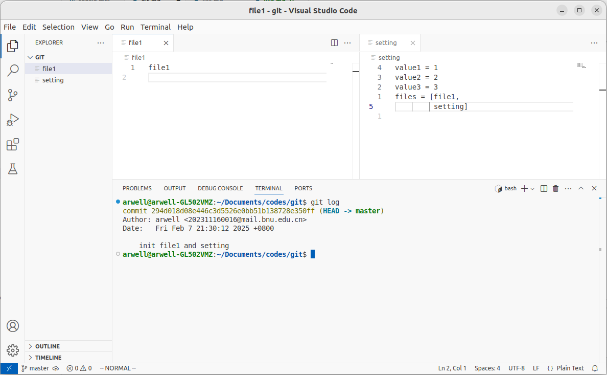
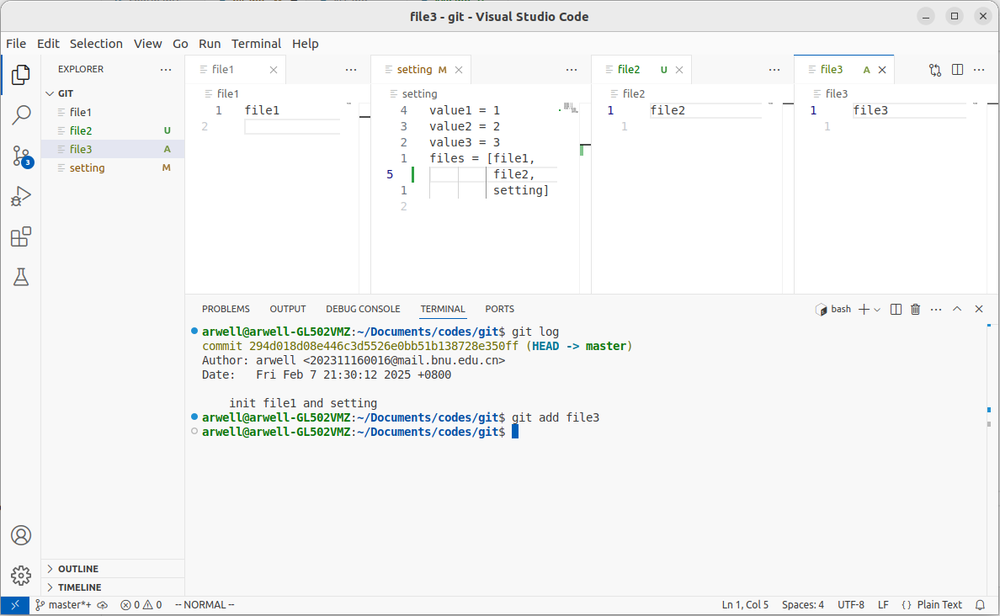
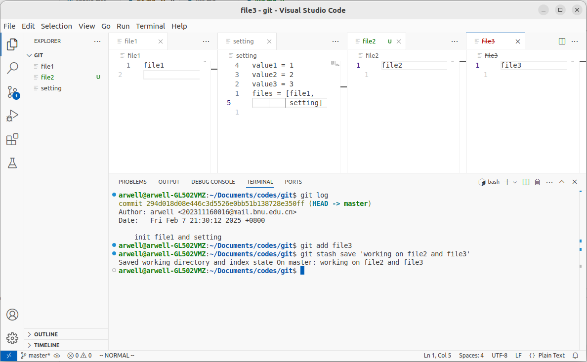
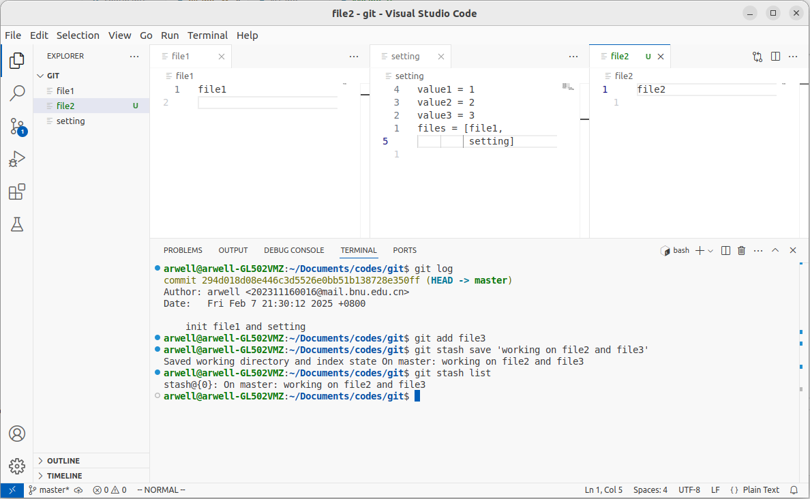
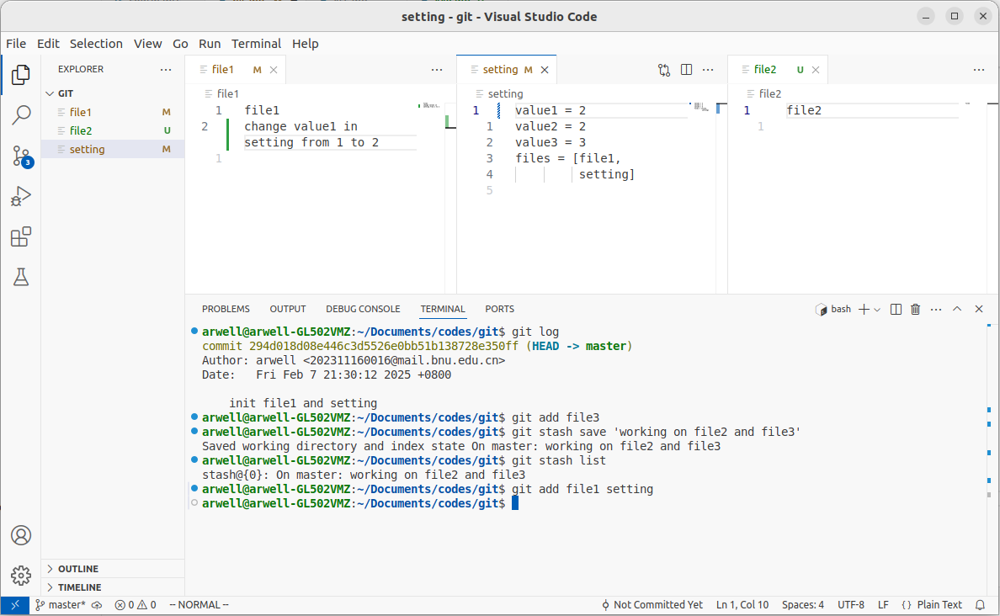
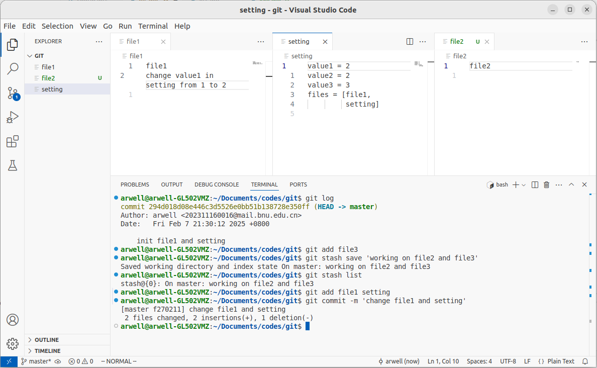
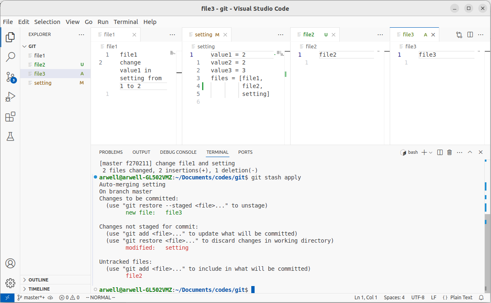

# git命令

记录一下`git`常用的命令

## 基础命令

```sh
git init
git add [file]
git commit -m 'messages'
git status

git branch
git branch <branch-name>
git checkout <branch-name>
git branch -d <branch-name>
git merge <branch-name>
```

版本控制详见[reset三种模式](https://zhuanlan.zhihu.com/p/647893961)
```sh
git reset --hard HEAD^
git reset --soft HEAD~100
git reset commit_id
```

## 连接github

先进行`ssh`与github.com建立连接（[ssh连接](https://www.cnblogs.com/woider/p/6533709.html)）
用如下命令检查是否已经连接：
```sh
ssh -T git@github.com
```

```sh
git remote add origin git@github.com:<username>/<reponame>.git
git remote remove <name>

git push origin main/master
```

## 临时保存工作

可以使用 `git stash` 系列命令实现临时保存工作的功能，具体如下例：

::: warning 注意
`git` 命令操作不当易造成文件内容损失，建议测试后确认命令用途再应用。
:::

在工作文件夹初始状态下有 `file1` 和 `setting` 两个文件



当前正在新建 `file2` 和 `file3` 工作，并把 `file3` 提交到暂存区



通过命令 `git stash save 'working on file2 and file3'` 将当前工作区和暂存区的更改暂存在 `stash@{0}` 中



可以通过命令 `git stash list` 进行查看



然后可以进行别的工作并提交 `commit`




然后使用 `git stash pop` 将 `stash` 列表中的第一个弹出，同时删除列表中对应内容

::: info 更保险的做法
如果想要保留列表中对应的内容，使用 `git stash apply` ，之后再使用 `git stash drop` 进行删除。
:::



则工作区内容恢复到原先的状态。

::: info 总结
先 `git stash [save 'message']` 保存当前工作区和暂存区状态，
完成其他工作并 `commit` 之后通过 `git stash pop` 恢复。
:::
