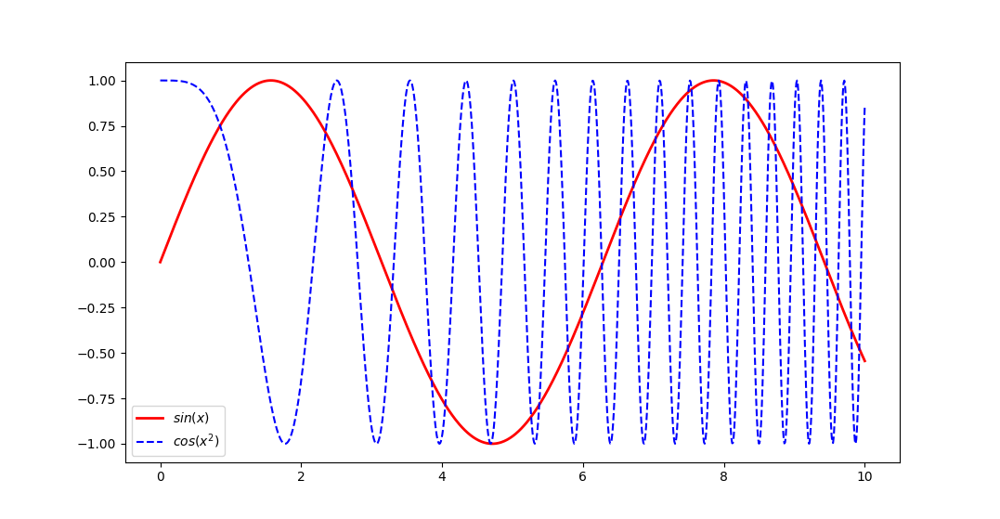

# Python数据处理

本文记录一些常用以及易忘的`python`字符串方法、文件操作和`random`、`numpy`、`matplotlib`和`pandas`模块的函数。

## 字符串

### 基础的处理（定义、合并、重复和索引）
```py
>>> a = 'hello'
>>> a + 'world'
'helloworld'
>>> a * 2
'hellohello'
>>> a[0]
'h'
>>> a[-1]
'o'
>>> a[1:4]
'ell'
>>> a[0:5:2]
'hlo'
>>> len(a)
5
```
:::tip
`python`字符串的索引可以接受1，2，3个参数。

当只有一个参数，得到对于位置上的单个字符，可以正向索引 $(0,1,...,len-1)$ ，也可以逆向索引 $(-len,...,-2,-1)$。

当有两个参数时，用冒号`:`隔开，例如`str[a:b]`得到字符串从索引`a`到索引`b-1`的子字符串，可以理解为左闭右开区间$[a,b)$，同样支持正向和逆向索引，
其中参数`a`和参数`b`都可以省略，其默认值分别为$0$和$len$。

当有三个参数时，第三个参数代表步长，其值可以为正负整数但不能为$0$。
:::

### 字符串方法

- `a.strip(chars = None)` 去除首尾的字符（由`chars`指定，默认为空格）

```py
>>> a = ' good job'
>>> a.strip()
'good job'
>>> a.strip('b')
' good jo'
>>> a.strip('o g')
'd job'
```

- `a.split(sep = None, maxsplit = -1)` 分割字符串（根据`sep`分割，默认为空格，参数`maxsplit`是最大分割次数，默认无限制）

```py
>>> a = ' good job'
>>> a.split()
['good', 'job']
>>> a.split('o')
[' g', '', 'd j', 'b']
>>> a.split('o',2)
[' g', '', 'd job']
```

- `a.replace(old, new, count = -1)` 替换字符（把`old`替换成`new`，参数`count`代表最大替换次数，默认无限制）

```py
>>> a = ' good job'
>>> a.replace('o','0')
' g00d j0b'
>>> a.replace('o','0',2)
' g00d job'
>>> a.replace('oo','0')
' g0d job'
```

- `a.find(sub[, start[, end]])` 查找字符（在`a[start:end]`查找`sub`，返回第一次出现的索引，没找到返回$-1$）

```py
>>> a = ' good job'
>>> a.find('o')
2
>>> a.find('ob')
7
>>> a.find('o',3)
3
>>> a.find('o',4,7)
-1
```

- `a.count(sub[, start[, end]])` 字符统计（在`a[start:end]`查找`sub`，统计出现的次数）

```py
>>> a = ' good job'
>>> a.count('o')
3
>>> a.count('x')
0
>>> a.count('od')
1
```

- `a.upper()`/`a.lower()` 转大小写

```py
>>> a = 'Good Job!'
>>> a.upper()
'GOOD JOB!'
>>> a.lower()
'good job!'
```

- `a.ljust(width, fillchar=' ')`/`a.rjust(width, fillchar=' ')`/`a.zfill(width)` 指定宽度

```py
>>> a
'Good Job!'
>>> len(a)
9
>>> a.ljust(12)
'Good Job!   '
>>> a.rjust(15)
'      Good Job!'
>>> a.rjust(15,'6')
'666666Good Job!'
>>> a.zfill(14)
'00000Good Job!'
```

- `a.isalpha()`/`a.isdigit()`/`a.isalnum()` 判断字符串是否是纯字母/纯数字/纯字母数字

```py
>>> a = 'good'
>>> b = 'good job'
>>> c = '123'
>>> d = 'good 123'
>>> e = 'good123'
>>> f = '123.45'
>>> a.isalpha()
True
>>> b.isalpha()
False
>>> c.isdigit()
True
>>> d.isdigit()
False
>>> f.isdigit()
False
>>> e.isalnum()
True
>>> d.isalnum()
False
>>> f.isalnum()
False
```
- `a.join(iterable)` 拼接字符串（参数`iterable`为字符串列表）

```py
>>> '+'.join(['a','b','cd'])
'a+b+cd'
```

- `a.rfind(sub[, start[, end]])` 从右侧查找字符（在`a[start:end]`查找`sub`，返回最后一次出现的索引，没找到返回$-1$）

```py
>>> a = ' good job'
>>> a.rfind('o')
7
>>> a.rfind('o',1,3)
2
```

:::tip
在定义了字符串`a`后，可以通过`dir(a)`得到字符串的所有方法。通过`help(a.replace)`可以查看该方法的参数以及返回值。
:::

:::details
通过`help(a.replace)`注意到方法`replace()`的函数原型是`replace(old, new, count=-1, /)`，
参数列表最后的`/`是指该函数的某些参数只能通过位置传送，不能通过关键字传送。
相比于方法`split(sep=None, maxsplit=-1)`，没有`/`，说明可以通过`a.split(maxsplit=2, sep=' ')`这种关键字的方式进行传参。
:::

### 格式化输出

进行格式化输出有两种方式如下：
```py
>>> age = 20
>>> name = 'Tom'
>>> print(f'{name:^5} was {age:.1f} years old.')
 Tom  was 20.0 years old.
>>> print('{0:^5} was {1:.1f} years old.'.format(name, age))
 Tom  was 20.0 years old.
```

在冒号`:`后为格式控制命令，具体如下：

| 原数值       | 命令      | 显示字符串      | 解释              |
|:----------:|:-------:|:----------:|:---------------:|
| `3.1415926`  | `{:.2f}`  | `3.14`       | 保留小数点后两位        |
| `3.1415926`  | `{:+.2f}` | `+3.14`      | 带符号保留小数点后两位     |
| `-1`         | `{:+.2f}` | `-1.00`      | 带符号保留小数点后两位     |
| `2.71828`    | `{:.0f}`  | `3`          | 不带小数            |
| `5`          | `{:0>2d}` | `05`         | 数字补零（填充左边，宽度为2） |
| `5`          | `{:x<4d}` | `5xxx`       | 数字补x（填充右边，宽度为4） |
| `10`         | `{:y<4d}` | `10yy`       | 数字补x（填充右边，宽度为4） |
| `1000000`    | `{:,}`    | `1,000,000`  | 以逗号分隔的数字格式      |
| `0.25`       | `{:.2%}`  | `25.00%`     | 百分比格式           |
| `1000000000` | `{:.2e}`  | `1.00e+09`   | 指数格式            |
| `13`         | `{:>10d}` | `--------13` | 右对齐（宽度为10）      |
| `13`         | `{:<10d}` | `13--------` | 左对齐（宽度为10）      |
| `13`         | `{:^10d}` | `----13----` | 中间对齐（宽度为10）     |

:::info
上表最后三行显示结果的`-`代指空格。
:::

验证程序：
```py
a = 3.1415926
print(str(a) + ' {:.2f} -> ' + f'"{a:.2f}"')
print(str(a) + ' {:+.2f} -> ' + f'"{a:+.2f}"')
a = -1
print(str(a) + ' {:+.2f} -> ' + f'"{a:+.2f}"')
a = 2.71828
print(str(a) + ' {:.0f} -> ' + f'"{a:.0f}"')
a = 5
print(str(a) + ' {:0>2d} -> ' + f'"{a:0>2d}"')
print(str(a) + ' {:x<4d} -> ' + f'"{a:x<4d}"')
a = 10
print(str(a) + ' {:y<4d} -> ' + f'"{a:y<4d}"')
a = 1000000
print(str(a) + ' {:,} -> ' + f'"{a:,}"')
a = 0.25
print(str(a) + ' {:.2%} -> ' + f'"{a:.2%}"')
a = 1000000000
print(str(a) + ' {:.2e} -> ' + f'"{a:.2e}"')
a = 13
print(str(a) + ' {:>10d} -> ' + f'"{a:>10d}"')
print(str(a) + ' {:<10d} -> ' + f'"{a:<10d}"')
print(str(a) + ' {:^10d} -> ' + f'"{a:^10d}"')
```

## 文件操作

文件的操作主要用到的三个方法：
- `file.open(filename, mode='r', encoding='utf-8')` 打开文件（参数`mode`指定打开的模式）
- `file.read()` 返回文件内容（字符串）
- `file.close()` 关闭文件

其中参数`mode`的值如下表：
| 值 | 含义 |
|:--:|:------:|
|'r' | 读取模式 |
|'w' | 写入模式 |
|'a' | 增写模式 |

示例程序：
```py
odds = []
for i in range(1, 100, 2):
    odds.append(i)

# 写入文件1
file = open('data.txt', 'w')
for item in odds:
    file.write(str(item) + '\n')
file.close()

# 写入文件2
context = '\n'.join([str(i) for i in odds])
file = open('data1.txt', 'w')
file.write(context)
file.close()

# 读取文件1
data = open('data.txt', 'r')
sum = 0
for line in data:
    sum += int(line)
data.close()
print('The sum of number in data.txt is', sum)

# 读取文件2
data = open('data1.txt', 'r')
context = data.read()
data.close()
numbers = context.split('\n')
sum = 0
for n in numbers:
    sum += int(n)
print('The sum of number in data1.txt is', sum)
```

## `random`模块

```py
>>> import random
>>> random.randint(0, 99)
32                                  # [0, 99] 的随机整数
>>> random.randrange(0, 101, 2)
6                                   # [0, 101) 的随机偶数
>>> random.random()
0.0568923977458502                  # [0, 1) 的随机数
>>> random.uniform(1, 10)
2.780557626410386                   # [1, 10) 均匀分布的随机数
>>> random.choice('!123abc$%^')
'1'                                 # 随机字符
>>> items = [1, 2, 3, '4', 5, 6]
>>> random.shuffle(items)           # 乱序
>>> items
[5, 6, 1, '4', 3, 2]
```

## `numpy`模块

### 数组创建

```py
>>> import numpy as np
>>> np.array([1,2,3,4], dtype='int32')
array([1, 2, 3, 4], dtype=int32)
>>> np.array([[3,4,5],[3,6,7]])
array([[3, 4, 5],
       [3, 6, 7]])
>>> np.arange(0,1,0.1)
array([0. , 0.1, 0.2, 0.3, 0.4, 0.5, 0.6, 0.7, 0.8, 0.9])
>>> np.zeros([2,3])
array([[0., 0., 0.],
       [0., 0., 0.]])
>>> np.ones(5)
array([1., 1., 1., 1., 1.])
>>> np.linspace(0,1,12)
array([0.        , 0.09090909, 0.18181818, 0.27272727, 0.36363636,
       0.45454545, 0.54545455, 0.63636364, 0.72727273, 0.81818182,
       0.90909091, 1.        ])
>>> np.logspace(0,2,20)
array([  1.        ,   1.27427499,   1.62377674,   2.06913808,
         2.6366509 ,   3.35981829,   4.2813324 ,   5.45559478,
         6.95192796,   8.8586679 ,  11.28837892,  14.38449888,
        18.32980711,  23.35721469,  29.76351442,  37.92690191,
        48.32930239,  61.58482111,  78.47599704, 100.        ])
>>> def func(i,j):
...     return (i+1)*(j+1)
... 
>>> np.fromfunction(func, (9,9))
array([[ 1.,  2.,  3.,  4.,  5.,  6.,  7.,  8.,  9.],
       [ 2.,  4.,  6.,  8., 10., 12., 14., 16., 18.],
       [ 3.,  6.,  9., 12., 15., 18., 21., 24., 27.],
       [ 4.,  8., 12., 16., 20., 24., 28., 32., 36.],
       [ 5., 10., 15., 20., 25., 30., 35., 40., 45.],
       [ 6., 12., 18., 24., 30., 36., 42., 48., 54.],
       [ 7., 14., 21., 28., 35., 42., 49., 56., 63.],
       [ 8., 16., 24., 32., 40., 48., 56., 64., 72.],
       [ 9., 18., 27., 36., 45., 54., 63., 72., 81.]])
```

### 数组取样

一维数组取样，索引方式跟字符串一致。
```py
>>> a = np.arange(10)
>>> a
array([0, 1, 2, 3, 4, 5, 6, 7, 8, 9])
>>> a[5]
5
>>> a[3:5]
array([3, 4])
>>> a[:5]
array([0, 1, 2, 3, 4])
>>> a[:-1]
array([0, 1, 2, 3, 4, 5, 6, 7, 8])
>>> a[2:4] = 100, 101
>>> a
array([  0,   1, 100, 101,   4,   5,   6,   7,   8,   9])
>>> a[1:-1:2]
array([  1, 101,   5,   7])
```

二维数组取样，索引方式跟一维的一致，两个轴的索引用逗号分隔。
```py
>>> a = np.arange(10).reshape(2,-1)
>>> a
array([[0, 1, 2, 3, 4],
       [5, 6, 7, 8, 9]])
>>> a[1,1]
6
>>> a[1]
array([5, 6, 7, 8, 9])
>>> a[:,2]
array([2, 7])
>>> a[0][::2]
array([0, 2, 4])
```

:::details
注意`a[:,2]`跟`a[:][2]`并不一致，
在上例中`a[:,2]`是数组`a`的所有行的第3列，
而`a[:][2]`是先计算`a[:]`之后第3个元素，
但是`a[:]`就是数组`a`自身，只有2个一维数组作为元素，
也就是说`a[:][2]`跟`a[2]`是等价的，
所以`a[:][2]`会出现`IndexError: index 2 is out of bounds for axis 0 with size 2`的报错。
:::

条件取样，在方括号`[]`内填入筛选条件即可。
```py
>>> a = np.arange(15).reshape(-1,3)
>>> a
array([[ 0,  1,  2],
       [ 3,  4,  5],
       [ 6,  7,  8],
       [ 9, 10, 11],
       [12, 13, 14]])
>>> a[a[:,1]>9]
array([[ 9, 10, 11],
       [12, 13, 14]])
>>> a[a[:,1]%2==0]
array([[ 3,  4,  5],
       [ 9, 10, 11]])
>>> a[(a[:,1]>9)*(a[:,1]%2==0)]     # 相当于 and
array([[ 9, 10, 11]])
>>> a[(a[:,1]>9)+(a[:,1]%2==0)]     # 相当于 or
array([[ 3,  4,  5],
       [ 9, 10, 11],
       [12, 13, 14]])
```

:::tip
数组还可以用数组作为下标进行索引，例如：
```py
>>> i = np.array([3,1,0])
>>> n = np.array([11,22,33,44,55,66])
>>> n[i]
array([44, 22, 11])
```
:::

### 数组排序

使用`argsort`函数返回数组值从大到小的索引。
```py
>>> x = np.array([33,11,22])
>>> np.argsort(x)
array([1, 2, 0])
>>> x[np.argsort(x)]
array([11, 22, 33])
>>> 
>>> x = np.array([[5,3,1],[4,2,3]])
>>> np.argsort(x, axis=1)           # 每行进行排序
array([[2, 1, 0],
       [1, 2, 0]])
>>> x[x[:,1].argsort()]             # 按第二列排序
array([[4, 2, 3],
       [5, 3, 1]])
```

### 数组方法

- `a.reshape(shape)` 改变数组形状
```py
>>> a = np.arange(12)
>>> a
array([ 0,  1,  2,  3,  4,  5,  6,  7,  8,  9, 10, 11])
>>> a.reshape(2,2,3)
array([[[ 0,  1,  2],
        [ 3,  4,  5]],

       [[ 6,  7,  8],
        [ 9, 10, 11]]])
>>> a.reshape(-1,6)
array([[ 0,  1,  2,  3,  4,  5],
       [ 6,  7,  8,  9, 10, 11]])
```

- `a.shape` 数组形状
- `a.dtype` 数组元素类型
- `a.sum()` 数组元素和
- `a.min()`/`a.max()`/`a.mean()` 数组元素最小值/最大值/均值
- `a.T` 矩阵转置
- `a.ravel()` 展开数组
- `a.repeat()` 复制元素
```py
>>> a = np.arange(6).reshape(2,3)
>>> a.shape
(2, 3)
>>> a.dtype
dtype('int64')
>>> a.sum()
15
>>> a.sum(axis=0)
array([3, 5, 7])
>>> a.min()
0
>>> a.max()
5
>>> a.mean()
2.5
>>> a.mean(axis=0)
array([1.5, 2.5, 3.5])
>>> a.T
array([[0, 3],
       [1, 4],
       [2, 5]])
>>> a.ravel()
array([0, 1, 2, 3, 4, 5])
>>> a.repeat(2,axis=0)
array([[0, 1, 2],
       [0, 1, 2],
       [3, 4, 5],
       [3, 4, 5]])
>>> a.repeat(3,axis=1)
array([[0, 0, 0, 1, 1, 1, 2, 2, 2],
       [3, 3, 3, 4, 4, 4, 5, 5, 5]])
```

### 数组合并

数组拼接函数在一维、二维数组情况的行为如下：
| 函数 | 函数 | 拼接方向 | 拼接效果 |
| :---: | :---: | ---- | :---: |
| `np.r_[a,b]` | `np.vstack((a,b))` | 行方向(`axis=0`) | $\begin{equation}\left[\begin{array}{c} a \\ b\end{array} \right]\end{equation}$ |
| `np.c_[a,b]` | `np.hstack((a,b))` | 列方向(`axis=1`) | [a b] |

但是`np.r_[a.b]`和`np.c_[a,b]`在一维数组的情况下行为出现特殊结果，具体查看下面验证程序：
```py
import numpy as np
 
a = np.array([[1, 2],
              [3, 4]])
b = np.array([[5, 6],
              [7, 8]])
print('第一个数组：\n', a)
print('第二个数组：\n', b)
 
print('np.r_[a, b]=\n', np.r_[a, b])
print('np.vstack((a, b))=\n', np.vstack((a, b)))
print('np.c_[a, b]=\n', np.c_[a, b])
print('np.hstack((a, b))=\n', np.hstack((a, b)))
 
print('\n当a,b取一维数组时：')
a = a.ravel()
b = b.ravel()
print('第一个数组：\n', a)
print('第二个数组：\n', b)
print('np.r_[a, b]=\n', np.r_[a, b])
print('np.vstack((a, b))=\n', np.vstack((a, b)))
print('np.c_[a, b]=\n', np.c_[a, b])
print('np.hstack((a, b))=\n', np.hstack((a, b)))
```
运行结果：
```sh
第一个数组：
 [[1 2]
 [3 4]]
第二个数组：
 [[5 6]
 [7 8]]
np.r_[a, b]=
 [[1 2]
 [3 4]
 [5 6]
 [7 8]]
np.vstack((a, b))=
 [[1 2]
 [3 4]
 [5 6]
 [7 8]]
np.c_[a, b]=
 [[1 2 5 6]
 [3 4 7 8]]
np.hstack((a, b))=
 [[1 2 5 6]
 [3 4 7 8]]

当a,b取一维数组时：
第一个数组：
 [1 2 3 4]
第二个数组：
 [5 6 7 8]
np.r_[a, b]=                # 特殊情况
 [1 2 3 4 5 6 7 8]          
np.vstack((a, b))=
 [[1 2 3 4]
 [5 6 7 8]]
np.c_[a, b]=                # 特殊情况
 [[1 5]
 [2 6]
 [3 7]
 [4 8]]
np.hstack((a, b))=
 [1 2 3 4 5 6 7 8]
```

### 数据拟合

- `np.polyfit(x, y, deg)` 多项式拟合，参数`deg`指多项式的次数。
返回各项系数组成的数组。
- `np.poly1d(an)` 由各项系数组成多项式函数。
```py
>>> x = range(5)
>>> y = [1.1, -0.08, 0.98, 4.09, 8.96]
>>> an = np.polyfit(x, y, 2)
>>> an
array([ 1.01071429, -2.05385714,  1.05342857])
>>> p = np.poly1d(an)
>>> p
poly1d([ 1.01071429, -2.05385714,  1.05342857])
>>> print(p)
       2
1.011 x - 2.054 x + 1.053
>>> p(x)
array([1.05342857, 0.01028571, 0.98857143, 3.98828571, 9.00942857])
```

通过使用`scipy.optimize`模块，可以实现自定义函数拟合。
- `curve_fit(func, x, y)` 返回参数数组和协方差。
```py
>>> from scipy.optimize import curve_fit
>>> x = range(5)
>>> y = [2, 19, 129, 937, 2220]
>>> def func(x, a, b):
...     return a*np.exp(b*x)
... 
>>> curve_fit(func, x, y)
(array([35.02162011,  1.04040528]), array([[ 3.39337176e+02, -2.48483423e+00],
                                           [-2.48483423e+00,  1.83938286e-02]]))
>>> popt, pcov = curve_fit(func, x, y)
>>> print(popt)
[35.02162011  1.04040528]
>>> y_fit = func(x, popt[0], popt[1])
>>> y_fit
array([  35.02162011,   99.12392816,  280.55678472,  794.07778639, 2247.52907498])
```

### `np.random`方法
- `np.random.rand(shape)` $[0,1)$ 均匀分布随机浮点值
- `np.random.randn(shape)` 标准正态分布

输出`shape`形状的数组。
```py
>>> np.random.rand(2,3)
array([[0.02091664, 0.10860645, 0.99984676],
       [0.19742929, 0.83246915, 0.52071977]])
>>> np.random.randn(5,3)
array([[-0.6027537 , -1.41548243, -1.00354529],
       [ 0.40065497,  1.04722031, -1.03729103],
       [-0.59072599,  1.07572819,  0.80372283],
       [-0.02655067, -1.86793122, -0.65659361],
       [ 0.14712546, -0.56336056, -0.10542148]])
```
:::tip
更多方法和具体用法通过`dir(np.random)`和`help(np.random.方法名)`查看。
:::

## `matplotlib`模块

### 绘制函数

使用`plot`函数进行绘制，如下：
```py
import numpy as np
import matplotlib.pyplot as plt

x = np.linspace(0, 10, 1000)
y = np.sin(x) ; z = np.cos(x ** 2)

plt.figure()                                                   # 生成画布
plt.plot(x, y, label='$sin(x)$', color='red', linewidth=2)     # 绘制 y-x 图像
plt.plot(x, z, 'b--', label='$cos(x^2)$')                      # 绘制 z-x 图像
plt.legend(loc=3)                                              # 生成图注
plt.show()                                                     # 在画布上显示
plt.close()                                                    # 关闭画布
```
绘制结果如下：


`plot()`的更多参数如下：
| 参数 | 值 |
|:---:|:----:|
|`alpha`| 透明度，$[0,1]$浮点数 |
|`color`/`c`| 'r'/'g'/'b'/... |
|`label`| 图注名字，字符串 |
|`linestyle`/`ls`| '-'/'--'/'-.'/':'/... |
|`linewidth`/`lw`| 浮点值 |
|`marker`| '+'/','/'.'/'1'/'2'/'3'/'4'/... |
|`markersize`/`ms`| 浮点值 |

### 细节定制函数

- `plt.title(str)` 图标题
- `plt.xlabel(str)` 横轴标题
- `plt.ylabel(str)` 竖轴标题
- `plt.xlim([minx, maxx])` 横轴坐标范围
- `plt.ylim([miny, maxy])` 竖轴坐标范围
- `plt.grid('on')` 添加网格
- `plt.text(x, y, str)` 添加文本
- `plt.axis('equal')` 等比例坐标轴
- `plt.axvline(x=0)` 竖直参考线
- `plt.axhline(y=0, color='k')` 水平参考线

### 多子图排版

注意画布`fig`和子图`ax`的区别，如下图：

生成子图的方式：
```py
# 方式一
fig = plt.figure()
ax = fig.add_subplot(111)
# 方式二
ax1 = plt.subplot(211)
ax2 = plt.subplot(212)
```

子图函数 `plt.subplot(numRows, numCols, plotNum)` 可以定义子图的位置，
如下例：
```py
import numpy as np
import matplotlib.pyplot as plt

x = np.linspace(0,10,1000)
y1 = np.sin(x)
y2 = np.cos(x**2)
y3 = np.exp(x)

ax1 = plt.subplot(211)
ax1.plot(x,y1)
ax2 = plt.subplot(223)
ax2.plot(x,y2)
ax3 = plt.subplot(224)
ax3.plot(x,y3)
plt.show()
```


### 极坐标图

极坐标图通过子图的`polar`参数指定。
```py
import numpy as np
import matplotlib.pyplot as plt

r = np.arange(0, 3.0, 0.01)
theta = 2 * np.pi * r

ax = plt.subplot(111, polar=True)
ax.plot(theta, r, c='r', lw=3)
ax.set_rmax(2.0)
ax.grid(True)
ax.set_title('polar plot')
plt.show()
```


:::details
注意对于子图`ax`，其细节定制函数有所变换，
例如`plt.title()`换成了`ax.set_title()`，
`plt.xlim()`换成了`ax.set_xlim()`，
更多的可以通过`dir(ax)`进行查看。
:::

### 直方图

`plt.hist(x, num_bins[, edgecolor])`用于根据`x`绘制直方图，
其中参数`num_bins`代表箱数，可选参数`edgecolor`代表边框颜色。
```py
import numpy as np
import matplotlib.pyplot as plt

num_bins = 50
x = np.random.randn(10000)

n, bins, patches = plt.hist(x, num_bins, edgecolor='k')
plt.show()
```
函数`plt.hist()`的返回值`n`是各个箱内的频数，
`bins`是各个箱的边界。


### 散点图
`plt.scatter(x, y[, s=, alpha=, color=])`用于根据坐标`(x,y)`绘制散点图，
可选参数`s`代表点的大小，`alpha`代表透明度，`color`代表颜色。
```py
import numpy as np
import matplotlib.pyplot as plt

n = 150
x = np.random.rand(n, 3)
c = np.random.rand(n, 3)

plt.scatter(x[:,0], x[:,1], s=x[:,2]*500, alpha=0.5, color=c)
plt.show()
```


### 三维曲面
三维曲面图由子图的`projection`指定。
用函数`ax.plot_surface(X, Y, Z[, cmap='jet'])`绘制，
其中可选参数`cmap`是曲面颜色映射。
```py
import numpy as np
import matplotlib.pyplot as plt

def bbfunc(lam, T):
    h=6.626e-34; c=2.99792e+8; k=1.3806e-23
    lam = lam * 1e-9
    return 2*h*c**2/lam**5 / (np.exp(h*c/lam/k/T)-1)

n = 100
lam = np.arange(1, n+1)*2000/n
T = np.arange(n)/(n-1)*2000+4000
X, Y = np.meshgrid(lam, T)
Z = bbfunc(X, Y)

fig = plt.figure()
ax = fig.add_subplot(111, projection='3d')
ax.plot_surface(X, Y, Z, cmap='jet')
plt.show()
```
:::tip
程序用函数`np.meshgrid()`由两个一维数组`lam`、`T`作为两边，
生成一个二维网格点坐标`X`、`Y`。
:::


### 等高线图
用函数`plt.contour(X, Y, Z)`绘制等高线图。
```py
import numpy as np
import matplotlib.pyplot as plt

def bbfunc(lam, T):
    h=6.626e-34; c=2.99792e+8; k=1.3806e-23
    lam = lam * 1e-9
    return 2*h*c**2/lam**5 / (np.exp(h*c/lam/k/T)-1)

n = 100
lam = np.linspace(0, 2000, n)
T = np.linspace(4000, 6000, n)
X, Y = np.meshgrid(lam, T)
Z = bbfunc(X, Y)

cs = plt.contour(X, Y, Z)
plt.xlabel('Wavelength(nm)')
plt.ylabel('T(K)')
plt.show()
```


### 热力图
用函数`plt.imshow(Z)`绘制热力图。
```py
import numpy as np
import matplotlib.pyplot as plt

def bbfunc(lam, T):
    h=6.626e-34; c=2.99792e+8; k=1.3806e-23
    lam = lam * 1e-9
    return 2*h*c**2/lam**5 / (np.exp(h*c/lam/k/T)-1)

n = 100
lam = np.linspace(0, 2000, n)
T = np.linspace(4000, 6000, n)
X, Y = np.meshgrid(lam, T)
Z = bbfunc(X, Y)

plt.imshow(Z[::-1], cmap='jet', extent=[0,2000,4000,6000])
plt.colorbar()
plt.xlabel('Wavelength(nm)')
plt.ylabel('T(K)')
plt.show()
```
:::tip
由于`plt.imshow()`函数默认坐标是数组`Z`的下标，
可以通过可选参数`extent`来设置坐标值，
具体方式为`extent=[X[0],X[-1],Y[0],Y[-1]]`。
:::


## `pandas`模块

### 一维数据表(Series)

使用列表创建一维数据表如下：
```py
>>> import pandas as pd
>>> people = [3.3, 1.3, 14, 13.5]
>>> a = pd.Series(people)                 # 默认数字索引
>>> a
0     3.3
1     1.3
2    14.0
3    13.5
dtype: float64
>>> a.values
array([ 3.3,  1.3, 14. , 13.5])
>>> a.index
RangeIndex(start=0, stop=4, step=1)
>>> a[1]
1.3
>>> a[:2]
0    3.3
1    1.3
dtype: float64
>>> 
>>> country = ['USA', 'JP', 'CHN', 'IND']
>>> b = pd.Series(people, country)        # 自定义索引
>>> b
USA     3.3
JP      1.3
CHN    14.0
IND    13.5
dtype: float64
>>> b[1]
1.3
>>> b['USA']
3.3
>>> b[:'CHN']
USA     3.3
JP      1.3
CHN    14.0
dtype: float64
```

使用字典创建一维数据表如下：
```py
>>> data = {'USA':3.3, 'JP':1.3, 'CH':14, 'IN':13.5}
>>> c = pd.Series(data)
>>> c
USA     3.3
JP      1.3
CH     14.0
IN     13.5
dtype: float64
>>> c['CH']
14.0
>>> d = pd.Series(data, index=['USA', 'CH'])
>>> d
USA     3.3
CH     14.0
dtype: float64
```

可以使用不连续的数字索引：
```py
>>> import pandas as pd
>>> people = [3.3, 1.3, 14, 13.5]
>>> test = pd.Series(people, index=[5,3,10,6])
>>> test
5      3.3
3      1.3
10    14.0
6     13.5
dtype: float64
>>> test[5]
3.3
>>> test[:2]
5    3.3
3    1.3
dtype: float64
```

一维数据表有两种索引器，
`.loc[]`使用显式索引（标签），
`.iloc[]`使用隐式索引（位置）。
```py
>>> test.loc[3]
1.3
>>> test.loc[:3]
5    3.3
3    1.3
dtype: float64
>>> test.iloc[3]
13.5
>>> test.iloc[:3]
5      3.3
3      1.3
10    14.0
dtype: float64
```

### 二维数据表(DataFrame)

二维数据表的创建如下：
```py
>>> s = pd.Series([1,2,3,4,5])
>>> s
0    1
1    2
2    3
3    4
4    5
dtype: int64
>>> df = pd.DataFrame(s, columns=['digits'])            # 用一维数据表创建
>>> df
   digits
0       1
1       2
2       3
3       4
4       5
>>> 
>>> people = [3.3, 1.3, 14, 13.5]
>>> country = ['USA', 'JP', 'CHN', 'IND']
>>> df = pd.DataFrame({'COU': country, 'PEO': people})  # 用字典创建
>>> df
   COU   PEO
0  USA   3.3
1   JP   1.3
2  CHN  14.0
3  IND  13.5
>>> 
>>> dl = [{'a':1, 'b':1}, {'b':2, 'c':2}, {'c':3, 'd':3}]
>>> df = pd.DataFrame(dl)             # 用字典创建时，不存在的值自动填充为NaN
>>> df
     a    b    c    d
0  1.0  1.0  NaN  NaN
1  NaN  2.0  2.0  NaN
2  NaN  NaN  3.0  3.0
>>> 
>>> import numpy as np                                  
>>> df = pd.DataFrame(np.zeros([5,3]),
...                   columns=['A','B','C'],
...                   index=['a','b','c','d','e'])      # 用二维数组创建
>>> df
     A    B    C
a  0.0  0.0  0.0
b  0.0  0.0  0.0
c  0.0  0.0  0.0
d  0.0  0.0  0.0
e  0.0  0.0  0.0
```
二维数据表的方法和索引如下：
```py
>>> data = {
...     'CHN': { 'COUNTRY': 'China',
...              'POP': 1398,
...              'AREA': 9597,
...              'IND_DAY': '1949-10-01' },
...     'IND': { 'COUNTRY': 'India',
...              'POP': 1351,
...              'AREA': 3287 },
...     'USA': { 'COUNTRY': 'US',
...              'POP': 329,
...              'AREA': 9833,
...              'IND_DAY': '1776-07-04' } }
>>> df = pd.DataFrame(data)
>>> df
                CHN    IND         USA
COUNTRY       China  India          US
POP            1398   1351         329
AREA           9597   3287        9833
IND_DAY  1949-10-01    NaN  1776-07-04
>>> df.dtypes                             # 表格元素类型
CHN    object
IND    object
USA    object
dtype: object
>>> df.columns                            # 表格列名
Index(['CHN', 'IND', 'USA'], dtype='object')
>>> df.index                              # 表格行名
Index(['COUNTRY', 'POP', 'AREA', 'IND_DAY'], dtype='object')
>>> df['CHN']
COUNTRY         China
POP              1398
AREA             9597
IND_DAY    1949-10-01
Name: CHN, dtype: object
>>> df.loc['POP']
CHN    1398
IND    1351
USA     329
Name: POP, dtype: object
>>> df.iloc[1:3,::2]
       CHN   USA
POP   1398   329
AREA  9597  9833
```
:::tip
二维数据表的索引跟二维数组的索引规则时一致的，
只是多加一个`.iloc[]`的格式区别。
:::


