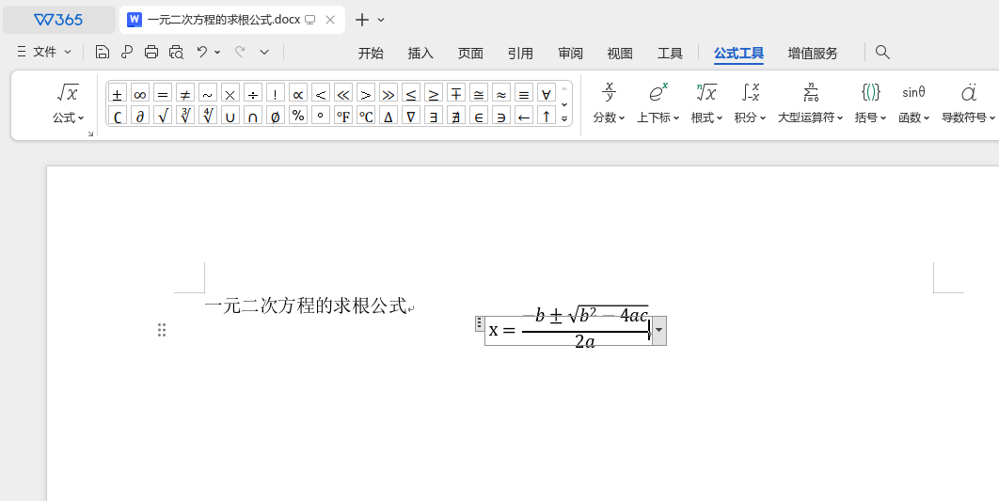
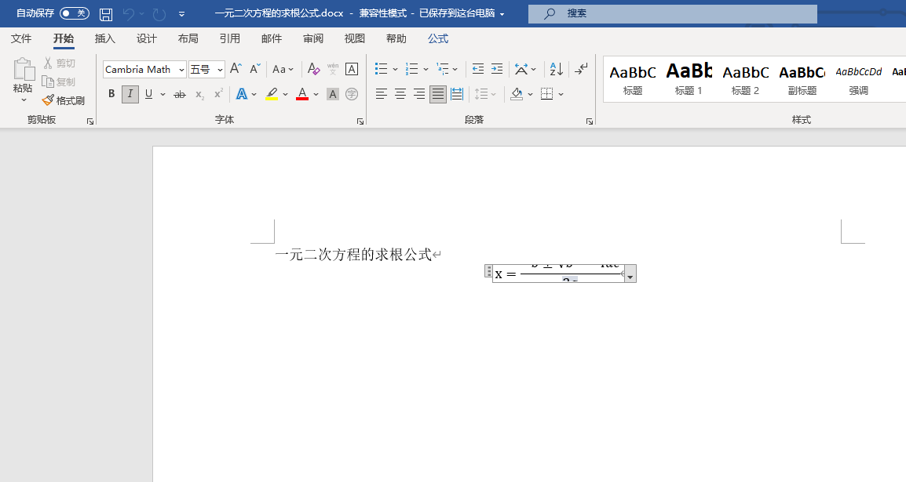

# WPS使用问题解决方法

本文记录一些自己在使用wps办公软件时遇到的问题以及解决方法。

## Ubuntu 设置 WPS 中文编辑界面

由于我的 Ubuntu22.04 使用的英文版，从 wps 官网安装的 wps for linux 12.1.0.17900 默认是英文界面，使用起来不太方便，下面记录如何将 wps 改回中文，具体参考[解决英文版 Ubuntu24.04 安装的中文版 WPS 语言修改为中文的问题](https://blog.csdn.net/2301_80873495/article/details/143656941)

在终端运行 
```sh
sudo mv /opt/kingsoft/wps-office/office6/mui/en_US /opt/kingsoft/wps-office/office6/mui/en_US_backup
sudo cp -r /opt/kingsoft/wps-office/office6/mui/zh_CN /opt/kingsoft/wps-office/office6/mui/en_US
```

## Word插入公式显示不全

在wps插入公式发现公式框比公式的范围小，
并且用Microsoft Office Word打开公式显示不全，
如下图所示。




解决方案：

在公式框内右键选择`段落`，
然后把行间距改为`单倍行距`即可正常显示。


