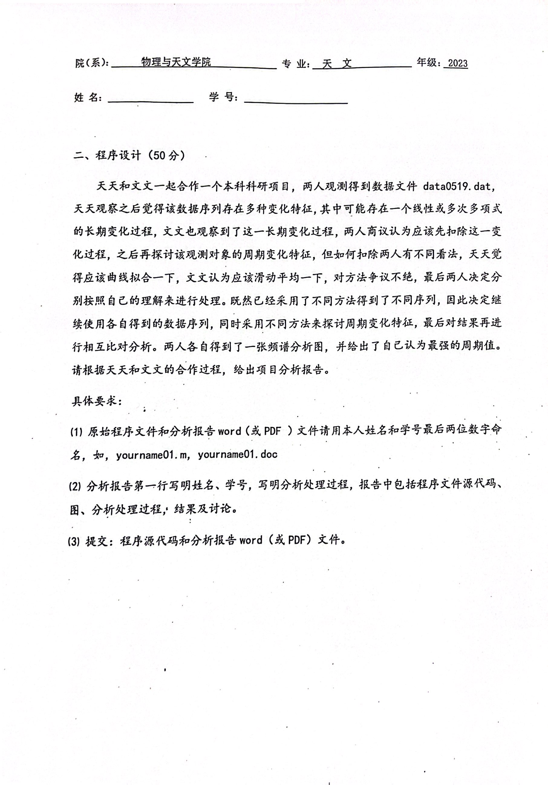
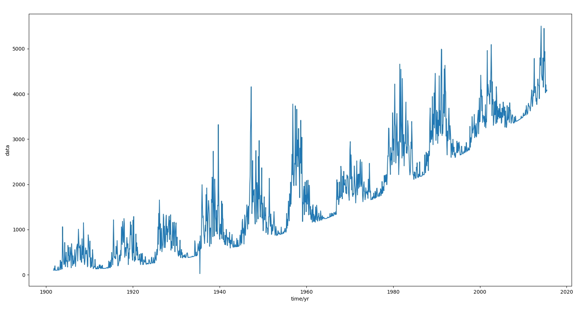
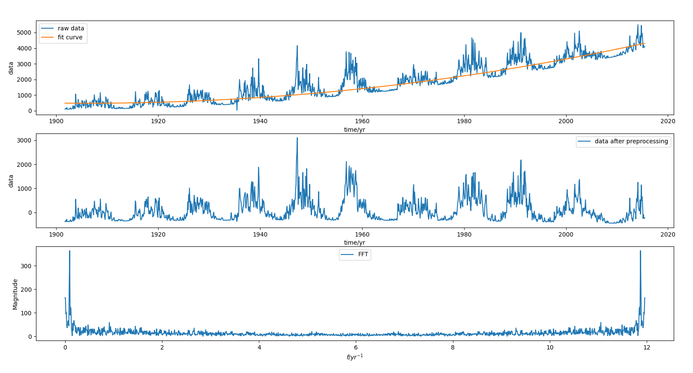
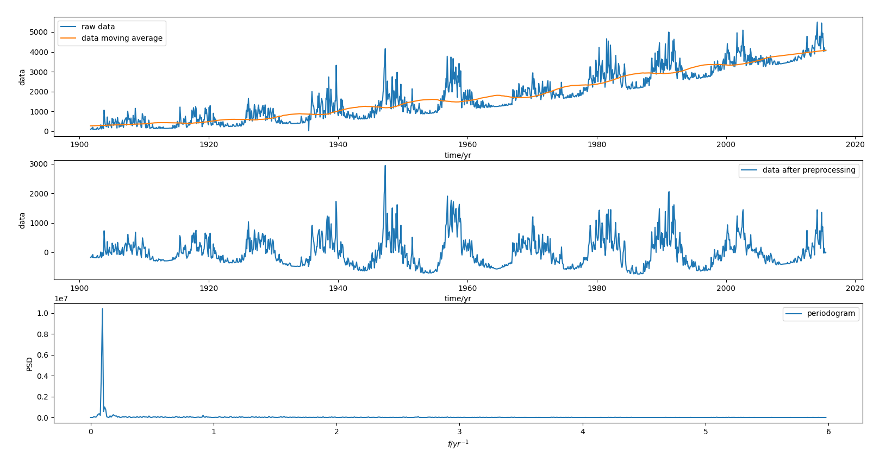

# 天文数据处理 期末考试报告

姓名：韦境量

学号：202311160016

::: details 题目

:::

## 读取数据

先读取数据并绘图观察，读取时去除表头和缺少值 `NaN`，编写 `read.py`：
```py
import numpy as np
import matplotlib.pyplot as plt

# read time and data from file
time, data = [], []
file = open('data0519.dat', 'r')
istitle = True
for line in file:
    line = line.split()
    if istitle:
        istitle = False
        continue
    if line[3] == 'NaN':
        continue
    time.append(float(line[2]))
    data.append(float(line[3]))
file.close()
time = np.array(time)
data = np.array(data)

# draw the data-time
plt.plot(time, data)
plt.xlabel('time/yr')
plt.ylabel('data')
plt.show()
```


可以看到数据有一个二次多项式增长的趋势。

## 天天的处理

通过曲线拟合扣除趋势项，然后使用傅里叶变换进行频谱分析。

::: info `tt.py` 代码逻辑
1. 读取原始数据 `time,data`
2. 选取部分数据（每100个）进行二次多项式拟合得到多项式函数 `f`
3. 对原数据 `data` 进行线性插值，转成时间间隔固定的时间序列（并且扣除趋势项 `f`）得到 `time_uniform,data_uniform`
4. 进行傅里叶变换 FFT 得到 `fre,fft_abs`
5. 绘图（原始数据和拟合曲线、预处理过的数据、傅里叶频谱图）
:::

```py
import numpy as np
import matplotlib.pyplot as plt
from scipy.interpolate import interp1d
from scipy.fftpack import fft

# read time and data from file
time, data = [], []
file = open('data0519.dat', 'r')
istitle = True
for line in file:
    line = line.split()
    if istitle:
        istitle = False
        continue
    if line[3] == 'NaN':
        continue
    time.append(float(line[2]))
    data.append(float(line[3]))
file.close()
time = np.array(time)
data = np.array(data)

# curve fit
time_fit = time[0:-1:100]
data_fit = data[0:-1:100]
an = np.polyfit(time_fit, data_fit, 2)
f = np.poly1d(an)

# remove trend and keep delta-t fixed by interpolate
time_uniform = np.linspace(time[0], time[-1], len(time))
data_interp = interp1d(time, data, kind='linear')
data_uniform = data_interp(time_uniform) - f(time_uniform)

# fft
N = len(time_uniform)
T = time_uniform[-1] - time_uniform[0]
fft_y = 2 * fft(data_uniform) / N
fft_abs = np.abs(fft_y)
fre = np.arange(N) / T

# draw the data-time
ax1 = plt.subplot(311)
ax2 = plt.subplot(312)
ax3 = plt.subplot(313)
ax1.plot(time, data, label='raw data')
ax1.plot(time, f(time), label='fit curve')
ax1.set_xlabel('time/yr')
ax1.set_ylabel('data')
ax1.legend()
ax2.plot(time_uniform, data_uniform, label='data after preprocessing')
ax2.set_xlabel('time/yr')
ax2.set_ylabel('data')
ax2.legend()
ax3.plot(fre, fft_abs, label='FFT')
ax3.set_xlabel(r'$f/yr^{-1}$')
ax3.set_ylabel('Magnitude')
ax3.legend()
plt.show()
```


从频谱图中可以得到，最强的周期项频率为 $f_1=0.0964 yr^{-1}$ 即周期为 $T_1=\dfrac{1}{f_1}=10.373443983 yr$

## 文文的处理

通过滑动平均扣除趋势项，然后使用周期图法进行频谱分析。

::: info `ww.py` 代码逻辑
1. 读取原始数据 `time,data`
2. 进行窗长度为200的滑动平均 `data_movavg`
3. 对原数据 `data` 和滑动平均数据 `data_movavg` 进行线性插值，转成时间间隔固定的时间序列（扣除趋势项 `data_movavg`）得到 `time_uniform,data_uniform`
4. 使用周期图法(periodogram)进行功率谱估计得到 `fre,Pxx`
5. 绘图（原始数据和滑动平均数据、预处理过的数据、功率谱图）
:::

```py
import numpy as np
import matplotlib.pyplot as plt
from scipy.signal import savgol_filter
from scipy.interpolate import interp1d
from scipy.signal import periodogram

# read time and data from file
time, data = [], []
file = open('data0519.dat', 'r')
istitle = True
for line in file:
    line = line.split()
    if istitle:
        istitle = False
        continue
    if line[3] == 'NaN':
        continue
    time.append(float(line[2]))
    data.append(float(line[3]))
file.close()
time = np.array(time)
data = np.array(data)

# moving average
win_len = 200
data_movavg = savgol_filter(data, win_len, 1)

# remove trend and keep delta-t fixed
time_uniform = np.linspace(time[0], time[-1], len(time))
data_interp = interp1d(time, data, kind='linear')
data_movavg_interp = interp1d(time, data_movavg, kind='linear')
data_uniform = data_interp(time_uniform) - data_movavg_interp(time_uniform)

# periodogram
N = len(time_uniform)
T = time_uniform[-1] - time_uniform[0]
fs = N / T
fre, Pxx = periodogram(data_uniform, fs)

# draw the data-time
ax1 = plt.subplot(311)
ax2 = plt.subplot(312)
ax3 = plt.subplot(313)
ax1.plot(time, data, label='raw data')
ax1.plot(time, data_movavg, label='data moving average')
ax1.set_xlabel('time/yr')
ax1.set_ylabel('data')
ax1.legend()
ax2.plot(time_uniform, data_uniform, label='data after preprocessing')
ax2.set_xlabel('time/yr')
ax2.set_ylabel('data')
ax2.legend()
ax3.plot(fre, Pxx, label='periodogram')
ax3.set_xlabel(r'$f/yr^{-1}$')
ax3.set_ylabel('PSD')
ax3.legend()
plt.show()
```


从功率谱图中可以看到，最强的周期项频率为 $f_2=0.0966 yr^{-1}$ 即周期为 $T_2=\dfrac{1}{f_2}=10.351966874 yr$

## 对比分析

天天通过二次曲线拟合扣除趋势项，然后傅里叶变换得到数据的最强周期项是 $T_1=10.373443983 yr$；而文文通过滑动平均扣除趋势项，然后用周期图法功率谱估计得到数据的最强周期项是 $T_2=10.351966874 yr$ 。可以看到结果基本一致。
