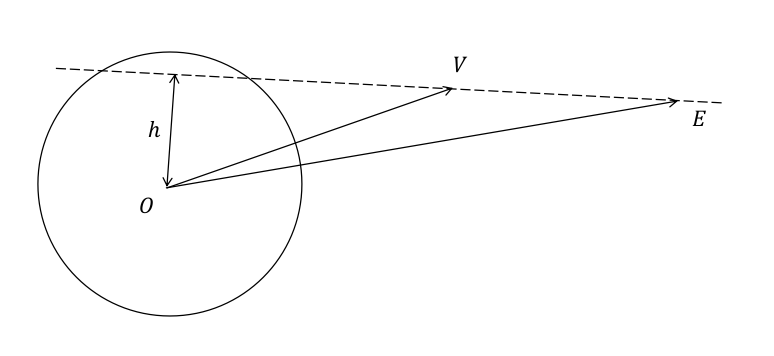
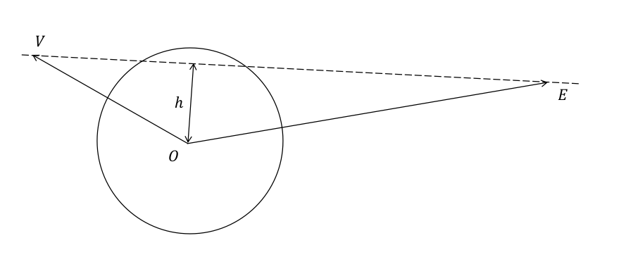

# 作业一

韦境量

通过本次实践练习JPL星表的使用。

::: warning 系统环境
本实践练习在 `Ubuntu22.04` 操作系统上完成。
:::

## 历表读取

制作历表和测试部分详见[JPL星表](/blog/astronomy/jpl)

### 制作历表

工作目录文件分布如下表：

|目录|备注|
|:--:|:--:|
|`de405/`|来自`ftp://ssd.jpl.nasa.gov/pub/eph/planets/ascii/de405`的文件|
|`fortran/`|来自`ftp://ssd.jpl.nasa.gov/pub/eph/planets/fortran`的代码|
|`bin/`|保存编译生成的可执行程序|
|`script/`|存放自己编写的脚本|
|`data/`|存放读取出来的数据|

::: info 一键部署工作目录
```sh:no-line-numbers
git clone https://github.com/jingliangwei/jpl-fortran.git
```
```sh:no-line-numbers
mkdir bin script data
```
:::

下面制作历表文件：

```sh:no-line-numbers
cat de405/header.405 de405/ascp2000.405 de405/ascp2020.405 > de405/jpleph00-40
```

设置 `fortran/asc2eph.f` 中 `NRECL = 4` ，然后编译制作历表（二进制文件）
```sh:no-line-numbers
gfortran fortran/asc2eph.f -o bin/asc2eph
```
```sh:no-line-numbers
./bin/asc2eph < de405/jpleph00-40
```

在工作目录下生成历表文件 `JPLEPH` （二进制文件）

### 测试读取子程序

1. 配置 `testeph.f` ：
- 填写251、316、388行处的 `NRECL` 参数（推荐与前面 `asc2eph.f` 保持一致）
- 417行处根据不同星表填写参数（对于DE405填写2036）
- 在939-941行选择调用子程序（Linux使用2，windows使用3）

2. 将原 `testeph.f` 第219行之后的所有代码（用于读取`JPLEPH`的子程序）剪切保存到新文件 `jplsubs.f`

3. 编译运行测试程序：
```sh:no-line-numbers
gfortran fortran/testeph.f fortran/jplsubs.f -o bin/test
```
```sh:no-line-numbers
./bin/test < de405/testpo.405
```

### 自编脚本读取数据

从文件 `fortran/userguide.txt` 中对子程序 `PLEPH` 的说明查看其用法：
```txt
**  PLEPH  ********  subroutine pleph( tdb, npl, nctr, pv)  **********

    Input
    -----
          tdb [d.p.]  : julian ephemeris date
          npl [int.]  : planet number
          nctr [int.] : center number

             identifications for "npl" and "nctr"
             ------------------------------------
              1 = mercury           8 = neptune
              2 = venus             9 = pluto
              3 = earth            10 = moon
              4 = mars             11 = sun
              5 = jupiter          12 = solar-system barycenter
              6 = saturn           13 = earth-moon barycenter
              7 = uranus           14 = nutations in longitude and obliquity
                                   15 = librations (if they exist on the file)
                 (for nutations and librations, nctr=0)
    Output
    ------
          pv(6) [d.p.]  : x,y,z,x-dot,y-dot,z-dot [au, au/day]
                  for nutations, d(psi), d(eps), d(psi)-dot, d(eps)-dot
                                  [rads, rads/day]
                  for librations, (Euler angles and rates, w.r.t. the ephemeris
                                  reference frame)   [rads, rads/day]
```

可以编写`fortran`程序调用`PLEPH`读取天体的位置和速度，新建脚本`script/usage.f90`：
```f90
! read data from JPLEPH using pleph(tdb,npl,nctr,pv) in jplsubs.f
program usage
	double precision jd
	double precision pv(6)
    character(len=10) planets(8)

    jd = 2451544.5          ! the Julian day of 2000-1-1
    planets(1) = 'Mercury'
    planets(2) = 'Venus'
    planets(3) = 'Earth'
    planets(4) = 'Mars'
    planets(5) = 'Jupiter'
    planets(6) = 'Saturn'
    planets(7) = 'Uranus'
    planets(8) = 'Neptune'

    write(*, 100) 'planet', 'x(au)', 'y(au)', 'z(au)', &
    'v_x(au/day)', 'v_y(au/day)', 'v_z(au/day)'
100 format(A7,6A12)
    do i = 1, 8
        call pleph(jd, i, 11, pv)
        write(*, 200) planets(i), pv
200 format(A7,6E12.2)
    end do
end program
```

```sh:no-line-numbers
$ gfortran script/usage.f90 fortran/jplsubs.f -o bin/usage
$ ./bin/usage
 planet       x(au)       y(au)       z(au) v_x(au/day) v_y(au/day) v_z(au/day)
Mercury   -0.14E+00   -0.40E+00   -0.20E+00    0.21E-01   -0.55E-02   -0.51E-02
Venus     -0.72E+00   -0.37E-01    0.29E-01    0.51E-03   -0.19E-01   -0.84E-02
Earth     -0.17E+00    0.89E+00    0.39E+00   -0.17E-01   -0.28E-02   -0.12E-02
Mars       0.14E+01   -0.55E-02   -0.40E-01    0.75E-03    0.14E-01    0.63E-02
Jupiter    0.40E+01    0.27E+01    0.11E+01   -0.46E-02    0.59E-02    0.26E-02
Saturn     0.64E+01    0.62E+01    0.23E+01   -0.43E-02    0.35E-02    0.16E-02
Uranus     0.14E+02   -0.13E+02   -0.57E+01    0.27E-02    0.25E-02    0.10E-02
Neptune    0.17E+02   -0.23E+02   -0.98E+01    0.26E-02    0.17E-02    0.62E-03
```

## 计算金星凌日

### 理论原理

计算出金星-地球连线 $VE$ 到坐标原点 $O$ 的距离 $h$ ，当 $h<R_\odot$ 且金星 $V$ 与地球 $E$ 在原点 $O$ 同侧时，在地球上出现金星凌日现象。

$$
\begin{align}
h = \sqrt{|\overrightarrow{OV}|^2-\left(\frac{\overrightarrow{OV}\cdot\overrightarrow{VE}}{|\overrightarrow{VE}|}\right)^2} \\
= \sqrt{\overrightarrow{OV}\cdot\overrightarrow{OV}-\frac{\left(\overrightarrow{OV}\cdot\overrightarrow{VE}\right)^2}{\overrightarrow{VE}\cdot\overrightarrow{VE}}}
\end{align}
$$




可以用条件 $|\overrightarrow{VE}|<|\overrightarrow{OV}|$ 来排除金星在太阳背面的情况。

### 大范围排查

先对 `de405` 所包含的 1600-2200 年的所有数据进行排查，确定会发生金星凌日的日期，然后再进行小范围的确定金星凌日的开始，结束时刻。

先用 `fortran` 程序把需用用到的数据（金星位置，地球位置）读取出来保存在文件中，然后再用 `python` 对数据进行排查。

#### 制作历表

需要重新制作合并所有数据的历表。

使用 `python` 脚本对 `de405` 中的文件进行连接，新建脚本 `script/cat.py` ：
```py
import os

start = 1600
end = 2200
base_path = './de405/'
newfile = f'{base_path}jpleph{start}-{end}'
cmd = f'cat {base_path}header.405'
y = start
while y <= end:
    cmd = cmd + f' {base_path}ascp{y}.405'
    y += 20
cmd = cmd + ' > ' + newfile

os.system(cmd)
```

```sh:no-line-numbers
python script/cat.py
```
```sh:no-line-numbers
rm JPLEPH
```
::: info 备注
在运行 `bin/asc2eph` 前需要先删除原来的 `JPLEPH` ，否则会报错：

`Fortran runtime error: Cannot open file 'JPLEPH': File exists`
:::
```sh:no-line-numbers
./bin/asc2eph < de405/jpleph1600-2200
```
现在工作目录下的 `JPLEPH` 历表文件则包含了所有数据。

#### 读取数据

编写 `fortran` 程序 `script/readeph.f90` ：
```f90
! read data from JPLEPH using pleph(tdb,npl,nctr,pv) in jplsubs.f
! and save data into file 'data' for other program to use.
program readeph
	double precision jd_start, jd_end, jd_dis
	parameter (jd_start = 2305424.5, jd_end = 2525008.5, jd_dis = 0.1)
	double precision jd_now
	double precision pv1(6),pv2(6)
	integer sun, venus, earth
	parameter (sun = 11, venus = 2, earth = 3)

	jd_now = jd_start
	open(10, file='./data/data')
	do while (jd_now <= jd_end)
	    call pleph(jd_now, venus, sun, pv1)
	    call pleph(jd_now, earth, sun, pv2)
	    write(10, *) jd_now, (pv1(i), i=1,3), (pv2(i), i=1,3)
        jd_now = jd_now + jd_dis
	end do
	close(10)
end program
```

编译运行
```sh:no-line-numbers
gfortran script/readeph.f90 fortran/jplsubs.f -o bin/readeph
```
```sh:no-line-numbers
./bin/readeph
```
运行后在文件夹 `data/` 下会生成文件 `data` ，其中包含从儒略日 2305424.5 到 2525008.5 每隔 0.1 天金星和地球的坐标。

#### 计算排查

编写 `python` 脚本 `script/transit.py` ：
```py
import numpy as np
from jd import jd2ymd

# read data from data/data
jds = []
xs_venus, ys_venus, zs_venus = [], [], []
xs_earth, ys_earth, zs_earth = [], [], []
data = open('./data/data', 'r')
for line in data:
    jd, x_v, y_v, z_v, x_e, y_e, z_e = line.split()
    jds.append(float(jd))
    xs_venus.append(float(x_v))
    ys_venus.append(float(y_v))
    zs_venus.append(float(z_v))
    xs_earth.append(float(x_e))
    ys_earth.append(float(y_e))
    zs_earth.append(float(z_e))
data.close()

# some const
r_sun = 695500 #km
au = 1.49597870691e8 #km
r = r_sun / au

# calculate the transit of Venus
n = len(jds)
jd_transit = []
for i in range(n):
    OV = np.array([xs_venus[i], ys_venus[i], zs_venus[i]])
    OE = np.array([xs_earth[i], ys_earth[i], zs_earth[i]])
    VE = OE - OV
    h = np.sqrt( OV@OV - ( OV@VE / np.sqrt(VE@VE) )**2)
    if (h <= r) and (VE@VE < OV@OV):
        jd_transit.append(jds[i])

print(f'all transit of venus from {jd2ymd(jds[0])} to {jd2ymd(jds[-1])}:')
for d in jd_transit:
    print(jd2ymd(d),d)
```

::: info 儒略日转公历
其中把儒略日转公历的函数 `jd2ymd` 如下：`jd.py`
```py
import math

def jd2ymd(jd):
	re, jd = math.modf(jd + 0.5)
	if jd >= 2299161:  # 大于1582年10月15日
		jd = jd + 10
		a = int((jd - 2268993) / 36524.25)  # 2268993为1500年3月1日的儒略日+0.5
		jd = jd + a - int((a+3) / 4)
	y = int(jd / 365.25) - 4712
	Y = y
	while True:
		muYD = jd - int((y + 4712) * 365.25) - 1  # 除去年积日
		if muYD >= 59:
			m = int((muYD + 1 + 63) / 30.61) - 1
			M = m - 12 if m > 12 else m
			break
		else:
			y = y - 1
	D = muYD - int(30.61 * (m + 1)) + 63 + 1
	return Y, M, D + re
```
详见[儒略日和公历](/blog/astronomy/jd)
:::

```sh:no-line-numbers
$ python script/transit.py
all transit of venus from (1599, 12, 9.0) to (2201, 2, 19.903272055089474):
(1631, 12, 7.2001741379499435) 2317110.700174138
(1639, 12, 4.700217641890049) 2320030.200217642
(1639, 12, 4.800217643380165) 2320030.3002176434
(1639, 12, 4.900217644870281) 2320030.400217645
(1761, 6, 6.100878931581974) 2364408.6008789316
(1761, 6, 6.20087893307209) 2364408.700878933
(1761, 6, 6.300878934562206) 2364408.8008789346
(1769, 6, 3.900922439992428) 2367328.40092244
(1769, 6, 4.000922441482544) 2367328.5009224415
(1874, 12, 9.101496703922749) 2405866.601496704
(1874, 12, 9.201496705412865) 2405866.7014967054
(1882, 12, 6.601540207862854) 2408786.101540208
(1882, 12, 6.70154020935297) 2408786.2015402094
(1882, 12, 6.801540210843086) 2408786.301540211
(2004, 6, 8.302201502025127) 2453164.802201502
(2004, 6, 8.402201503515244) 2453164.9022015035
(2012, 6, 6.002245008945465) 2456084.502245009
(2012, 6, 6.102245010435581) 2456084.6022450104
(2117, 12, 11.10281927138567) 2494622.6028192714
(2117, 12, 11.202819272875786) 2494622.702819273
(2125, 12, 8.602862775325775) 2497542.1028627753
(2125, 12, 8.702862776815891) 2497542.202862777
```

故确定金星凌日发生的日期有：

| 金星凌日 |
|:---:|
|1631-12-7|
|1639-12-4|
|1761-6-6|
|1769-6-3,4|
|1874-12-9|
|1882-12-6|
|2004-6-8|
|2012-6-6|
|2117-12-11|
|2125-12-8|

### 小范围确定

分别对上面每个日期进行小范围排查，以 1631-12-7 为例

#### 读取数据

修改读取历表的起止时间和时间间隔，编写脚本 `script/readeph_detail.f90` ：
```f90{5,12}
! read data from JPLEPH using pleph(tdb,npl,nctr,pv) in jplsubs.f
! and save data into file 'data.detail' for other program to use.
program readeph
	double precision jd_start, jd_end, jd_dis
	parameter (jd_start = 2317109.5, jd_end = 2317111.5, jd_dis = 0.00001)
	double precision jd_now
	double precision pv1(6),pv2(6)
	integer sun, venus, earth
	parameter (sun = 11, venus = 2, earth = 3)

	jd_now = jd_start
	open(10, file='./data/data_detail')
	do while (jd_now <= jd_end)
	    call pleph(jd_now, venus, sun, pv1)
	    call pleph(jd_now, earth, sun, pv2)
	    write(10, *) jd_now, (pv1(i), i=1,3), (pv2(i), i=1,3)
        jd_now = jd_now + jd_dis
	end do
	close(10)
end program
```
```sh:no-line-numbers
gfortran script/readeph_detail.f90 fortran/jplsubs.f -o bin/readeph_detail
```
```sh:no-line-numbers
./bin/readeph_detail
```
运行后在文件夹 `data/` 下会生成文件 `data_detail` ，其中包含从儒略日 2317109.5 到 2317111.5 每隔 0.00001 天（约0.8秒）金星和地球的坐标

#### 计算排查

编写脚本计算金星凌日的起止时间（以具体时刻格式输出）`script/transit_detail` ：
```py{8,36-60}
import numpy as np
from jd import jd2ymd

# read data from data/data_detail
jds = []
xs_venus, ys_venus, zs_venus = [], [], []
xs_earth, ys_earth, zs_earth = [], [], []
data = open('./data/data_detail', 'r')
for line in data:
    jd, x_v, y_v, z_v, x_e, y_e, z_e = line.split()
    jds.append(float(jd))
    xs_venus.append(float(x_v))
    ys_venus.append(float(y_v))
    zs_venus.append(float(z_v))
    xs_earth.append(float(x_e))
    ys_earth.append(float(y_e))
    zs_earth.append(float(z_e))
data.close()

# some const
r_sun = 695500 #km
au = 1.49597870691e8 #km
r = r_sun / au

# calculate the transit of Venus
n = len(jds)
jd_transit = []
for i in range(n):
    OV = np.array([xs_venus[i], ys_venus[i], zs_venus[i]])
    OE = np.array([xs_earth[i], ys_earth[i], zs_earth[i]])
    VE = OE - OV
    h = np.sqrt( OV@OV - ( OV@VE / np.sqrt(VE@VE) )**2)
    if (h <= r) and (VE@VE < OV@OV):
        jd_transit.append(jds[i])

# save the result into file data/transit_detail
# and output the first and last time
file = open('./data/transit_detail', 'w')
file.write(f'all transit of venus from {jd2ymd(jds[0])}' +
           f' to {jd2ymd(jds[-1])}:\n')
for d in jd_transit:
    file.write(str(jd2ymd(d))+' '+str(d)+'\n')
## output the exact time of transit
def day2hms(days):
    d, ds = int(days), days - int(days)
    hours = 24 * ds
    h, hs = int(hours), hours - int(hours)
    minutes = 60 * hs
    m, ms = int(minutes), minutes - int(minutes)
    seconds = 60 * ms
    return d, h, m, seconds
print(f'all transit of venus from {jd2ymd(jds[0])} to {jd2ymd(jds[-1])}:')
year_start, month_start, days_start = jd2ymd(jd_transit[0])
day_start, hour_start, minute_start, seconds_start = day2hms(days_start)
year_end, month_end, days_end = jd2ymd(jd_transit[-1])
day_end, hour_end, minute_end, seconds_end = day2hms(days_end)
print(f'start of transit: {year_start}-{month_start}-{day_start}' +
      f' {hour_start}:{minute_start}:{seconds_start}')
print(f'end of transit: {year_end}-{month_end}-{day_end}' +
      f' {hour_end}:{minute_end}:{seconds_end}')
```
```sh:no-line-numbers
$ python script/transit_detail.py
all transit of venus from (1631, 12, 6.0) to (1631, 12, 7.99999522883445):
start of transit: 1631-12-7 4:10:1.540115475654602
end of transit: 1631-12-7 6:19:48.83141130208969
```

故金星凌日在 1631-12-7 的具体起止时刻为 4:10:1.54 - 6:19:48.83

### 结果

对 [大范围排查-计算排查](#计算排查) 中得到的每个日期都进行一次小范围确定（只需要修改 [小范围确定-读取数据](#读取数据-1) 中 `script/readeph_detail` 的 `jd_start` 和 `jd_end` 然后再次编译运行即可）

得到金星凌日的具体时间如下：
（世界时，开始时刻和结束时刻是以金星视中心点进入和离开太阳视圆盘为标志）
|金星凌日日期|开始时刻|结束时刻|
|:---:|:---:|:---:|
|1631-12-7|4:10:1.54|6:19:48.83|
|1639-12-4|15:1:41.50|21:40:5.11|
|1761-6-6|2:4:58.51|8:22:0.79|
|1769-6-3,4|19:19:41.91|1:19:29.97|
|1874-12-9|1:56:37.38|6:6:24.44|
|1882-12-6|14:1:28.22|19:58:37.32|
|2004-6-8|5:17:57.92|11:11:43.97|
|2012-6-5,6|22:14:15.39|4:35:14.42|
|2117-12-11|0:7:22.17|5:25:12.52|
|2125-12-8|13:25:53.26|18:34:2.14|

### 分析

上面得到的具体时刻与上网查到的金星凌日开始（金星与太阳外切）具体时刻存在十分钟左右的差异，这是在判断金星凌日的条件时没有考虑金星的视直径造成的误差。

