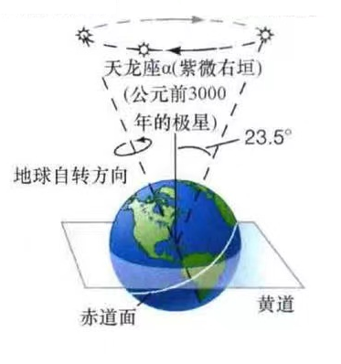

# 作业二

韦境量

::: info 题目
估算春分点何时移动到狮子座，以及此时“北极星”应该位于哪个星座。
:::

## 春分点的移动

由于地球岁差的周期为 $25800$ 年，故春分点每 $2150$ 年换一宫。

而黄道十二宫自西向东分别为：白羊，金牛，双子，巨蟹，狮子，室女，天秤，天蝎，人马，摩羯，宝瓶，双鱼。

约公元前300年，埃及天文学家将黄道分为十二等份，当时春分点位于白羊座中。

白羊座向西数 $8$ 个宫才到狮子座，故要再过 $2150\times8=17200$ 年，即公元16900年春分点移动到狮子座。

## "北极星"位置

由于地球岁差是北天极自东向西进动，如下图所示

由于岁差周期是 $25800$ 年，故北天极每 $71.67$ 年绕北黄极自东向西转 $1^\circ$

所以从公元2025年到公元16900年，北天极绕北黄极转了 $360^\circ\times\dfrac{16900-2025}{25800}=207.56^\circ$

已知当前北极星（小熊座$\alpha$）的黄经/黄纬（J2000.0）为 $(+88^\circ33'49.6'',+66^\circ06'22.1'')$

故公元16900年北天极的黄道坐标（J2000.0）为 $(+241^\circ00'13.6'',+66^\circ34'00'')$

该点附近没有特别亮的恒星，但是该点大致位于武仙座$\sigma$和天龙座$\beta$的连线中点。

