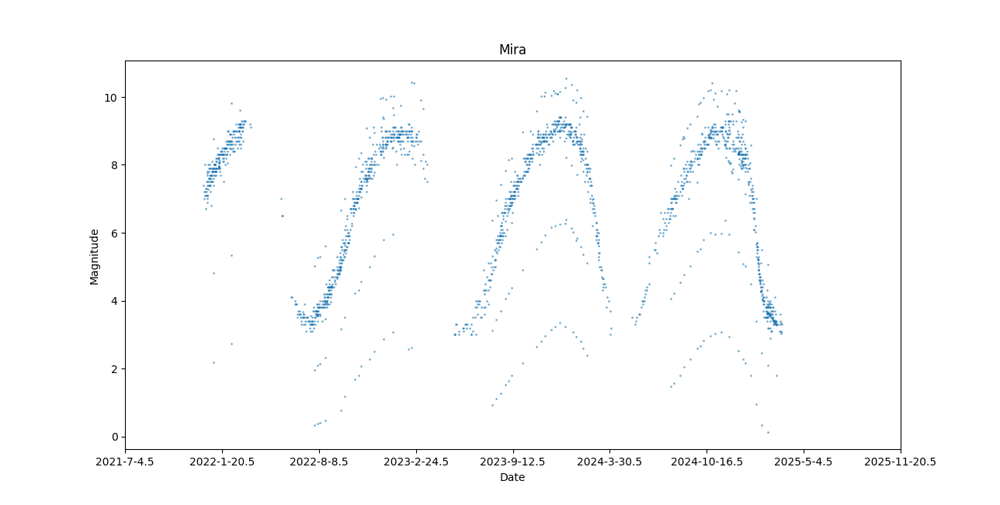
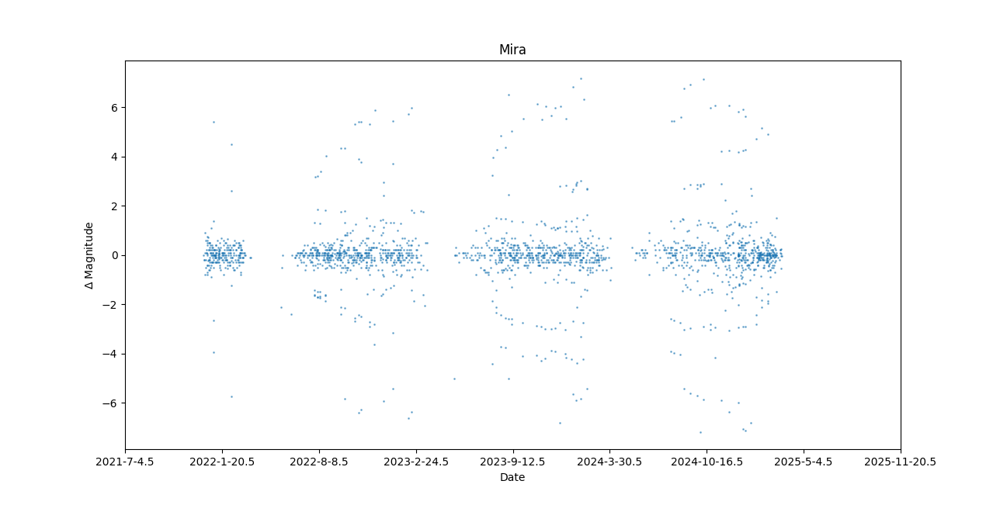
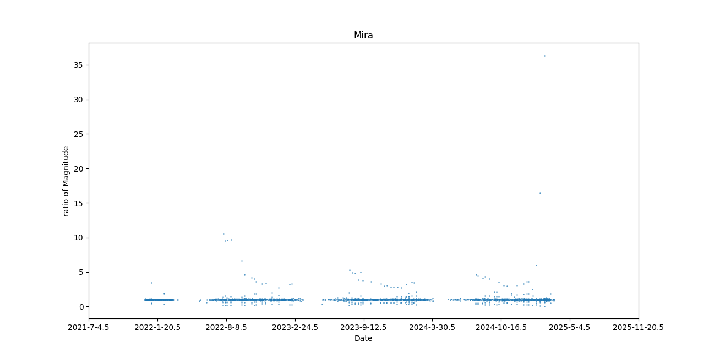
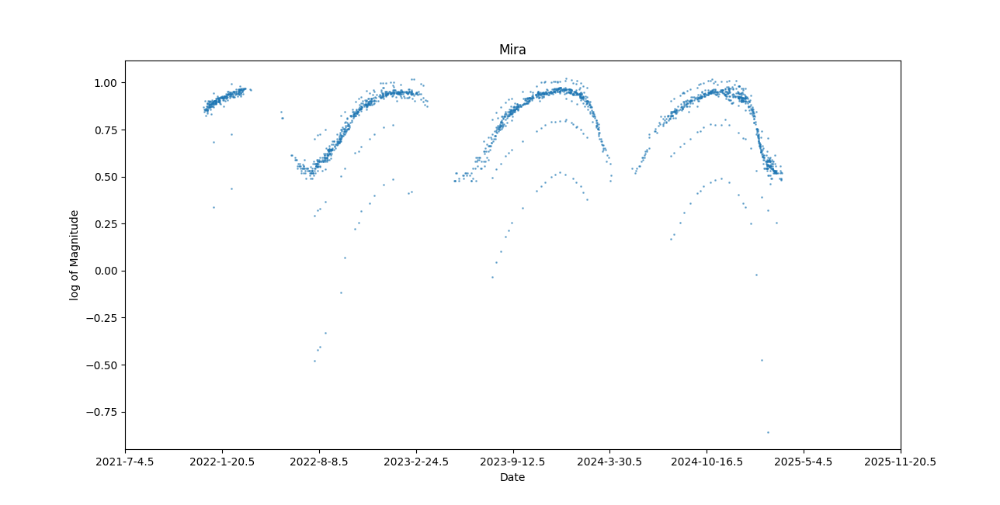
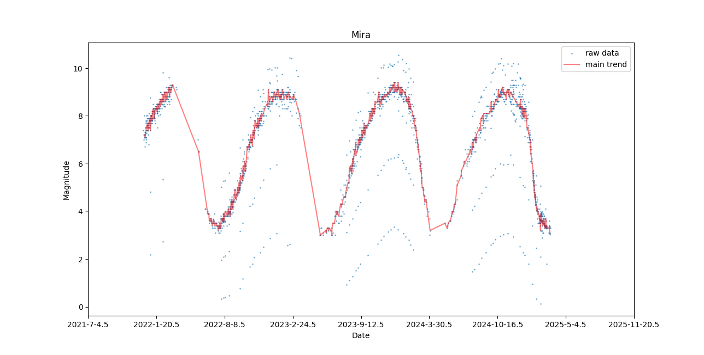
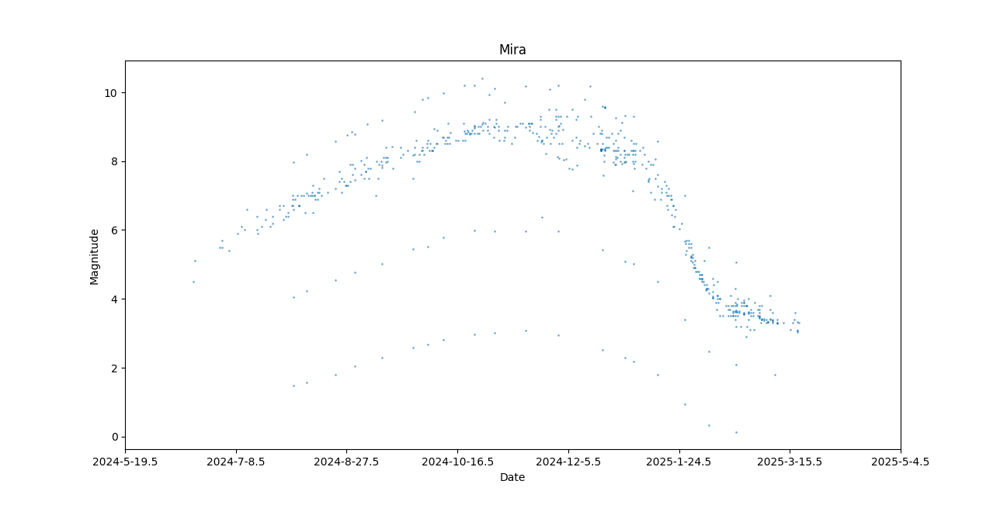

# 作业一

韦境量

对一个绝对数序列转成3种相对数序列，并分析至少5条特征。

## 下载数据预处理

从 [aavso](https://www.aavso.org/data-download) 下载第一颗已知的周期变星 Mira 的数据`aavsodata_67e13c77f382d.txt`。

- [数据格式信息](https://www.aavso.org/format-data-file)

我们所需要的只有第一列（儒略日时间）和第二列（星等）

编写脚本读取时间 `jds` 和星等 `mags` ，并进行预处理：
1. 去除不确定星等值 `<8.0`
2. 将同一时间记录的多个星等取平均
3. 截取最近2000个数据点

然后把处理后的数据保存到 `data.txt`

`read_preprocessing.py`
```py
import numpy as np
from jd import jd2ymd

# read data from aavsodata_67e13c77f382d.txt
data = open('aavsodata_67e13c77f382d.txt', 'r')
## pass the title
istitle = True
jds, mags = [], []
for line in data:
    if istitle:
        istitle = False
        continue
    datas = line.split(',')
    ## pass the magnitude '<8.0'
    if '<' in datas[1]:
        continue
    jd, mag = float(datas[0]), float(datas[1])
    jds.append(jd)
    mags.append(mag)
data.close()

# pre processing
## replace the same jd data with their average
i = 0
while i < len(jds)-1:
    samen = 1
    while jds[i+samen] == jds[i]:
        samen += 1
    samen -= 1
    if samen != 0:
        sum = 0
        for j in range(samen+1):
            sum += mags[i+j]
        average = sum/(samen+1)
        mags[i] = float(average)
        for j in range(1, samen+1):
            jds = np.delete(jds, i+1)
            mags = np.delete(mags, i+1)
    i += 1

# save the data after processing into data.txt
## len(jds) = 79010
file = open('data.txt', 'w')
start, end = 77000, 79009
for i in range(start, end+1):
    file.write(str(jds[i])+','+str(mags[i])+'\n')
file.close()

print(f'already save data from {jd2ymd(jds[start])} to {jd2ymd(jds[end])}')
```

其中把儒略日转公历的函数`jd2ymd`具体查看[儒略日和公历](/blog/astronomy/jd#转换代码)

## 读取绝对数序列

读取预处理后的数据`data.txt`并绘制散点图：
`draw.py`

```py
import numpy as np
import matplotlib.pyplot as plt
from jd import jd2ymd

# read data from data.txt
data = open('data.txt', 'r')
jds, mags = [], []
for line in data:
    datas = line.split(',')
    jd, mag = float(datas[0]), float(datas[1])
    jds.append(jd)
    mags.append(mag)

# draw scatter of data
plt.scatter(jds[:], mags[:], s=1, alpha=0.5)
## change the xticks from jd to date
xticks = plt.gca().get_xticks()
def change_ticks(val):
    y, m, d = jd2ymd(val)
    return f'{y}-{m}-{d}'
plt.xticks(xticks, [change_ticks(i) for i in xticks])
plt.title('Mira')
plt.xlabel('Date')
plt.ylabel('Magnitude')
plt.show()
```




## 相对数序列分析

下面把绝对数序列转成相对数序列。

### 差分

对绝对数序列做差分处理（首项补0），即
$$
\Delta m(t_2) = m(t_2)-m(t_1)
$$
然后绘制 $\Delta m-t$ 图像。

代码如下：`diff_draw.py`
```py
import numpy as np
import matplotlib.pyplot as plt
from jd import jd2ymd

# read data from data.txt
data = open('data.txt', 'r')
jds, mags = [], []
for line in data:
    datas = line.split(',')
    jd, mag = float(datas[0]), float(datas[1])
    jds.append(jd)
    mags.append(mag)

# diff 
dis_mags = [0]
for i in range(len(mags)-1):
    dis_mags.append(mags[i+1]-mags[i])

# draw
plt.scatter(jds[:], dis_mags[:], s=1, alpha=0.5)
## change the xticks from jd to date
xticks = plt.gca().get_xticks()
def change_ticks(val):
    y, m, d = jd2ymd(val)
    return f'{y}-{m}-{d}'
plt.xticks(xticks, [change_ticks(i) for i in xticks])
plt.title('Mira')
plt.xlabel('Date')
plt.ylabel(r'$\Delta$ Magnitude')
plt.show()
```


### 比值

对绝对数序列做比值处理（首项补1），即
$$
\mathrm{ratio\ m}(t_2)=\frac{m(t_2)}{m(t_1)}
$$
然后绘制 $\mathrm{ratio\ m}-t$ 图像。

代码如下：`ratio_draw.py`
```py
import numpy as np
import matplotlib.pyplot as plt
from jd import jd2ymd

# read data from data.txt
data = open('data.txt', 'r')
jds, mags = [], []
for line in data:
    datas = line.split(',')
    jd, mag = float(datas[0]), float(datas[1])
    jds.append(jd)
    mags.append(mag)

# ratio
ratio_mags = [1]
for i in range(len(mags)-1):
    ratio_mags.append(mags[i+1]/mags[i])

# draw
plt.scatter(jds[:], ratio_mags[:], s=1, alpha=0.5)
## change the xticks from jd to date
xticks = plt.gca().get_xticks()
def change_ticks(val):
    y, m, d = jd2ymd(val)
    return f'{y}-{m}-{d}'
plt.xticks(xticks, [change_ticks(i) for i in xticks])
plt.title('Mira')
plt.xlabel('Date')
plt.ylabel('ratio of Magnitude')
plt.show()
```


### 对数

对绝对数序列取对数（小于0项补-1），即
$$
log m(t)=\log_{10}m(t)
$$
然后绘制 $log m-t$ 图像。

代码如下：`log_draw.py`
```py
import numpy as np
import matplotlib.pyplot as plt
from jd import jd2ymd
from math import log10

# read data from data.txt
data = open('data.txt', 'r')
jds, mags = [], []
for line in data:
    datas = line.split(',')
    jd, mag = float(datas[0]), float(datas[1])
    jds.append(jd)
    mags.append(mag)

# log
log_mags = []
for i in range(len(mags)):
    log_mags.append(log10(mags[i]))

# draw
plt.scatter(jds[:], log_mags[:], s=1, alpha=0.5)
## change the xticks from jd to date
xticks = plt.gca().get_xticks()
def change_ticks(val):
    y, m, d = jd2ymd(val)
    return f'{y}-{m}-{d}'
plt.xticks(xticks, [change_ticks(i) for i in xticks])
plt.title('Mira')
plt.xlabel('Date')
plt.ylabel('log of Magnitude')
plt.show()
```


## 特征分析

该观测数据并不是在固定时间观测的，所以数据点分布不均匀，而且有数据缺失。

### 总趋势

对绝对数序列进行5阶滑动平均，即
$$
avg(t_i)=\frac{\sum_{j=i-2}^{i+2}m(t_j)}{5}
$$
然后只保留所有与`avg`相差小于`dis=0.15`的数据作为总趋势。

代码如下：`main_trend.py`
```py
import numpy as np
import matplotlib.pyplot as plt
from jd import jd2ymd

# read data from data.txt
data = open('data.txt', 'r')
jds, mags = [], []
for line in data:
    datas = line.split(',')
    jd, mag = float(datas[0]), float(datas[1])
    jds.append(jd)
    mags.append(mag)

jds = np.array(jds)
mags = np.array(mags)

# main trend
def avg_5(i):
    return (mags[i-2]+mags[i-1]+mags[i]+mags[i+1]+mags[i+2])/5
def abs(val):
    if val < 0:
        return -val
    else:
        return val
main_jds, main_mags = [], []
dis = 0.15
for i in range(2, len(mags)-2):
    avg = avg_5(i)
    if abs(mags[i]-avg) <= dis:
        main_jds.append(jds[i])
        main_mags.append(mags[i])

# draw figure
plt.scatter(jds[:], mags[:], s=1, alpha=0.5, label='raw data')
plt.plot(main_jds[:], main_mags[:], c='r', alpha=0.5, label='main trend')
xticks = plt.gca().get_xticks()
def change_ticks(val):
    y, m, d = jd2ymd(val)
    return f'{y}-{m}-{d}'
plt.xticks(xticks, [change_ticks(i) for i in xticks])
plt.title('Mira')
plt.xlabel('Date')
plt.ylabel('Magnitude')
plt.legend()
plt.show()
```



1. 可以发现变星 Mira 的星等总趋势有一个大约330天的长周期。
2. 而且还存在3条大致与总趋势线平行的线，1条在总趋势线上方，2条在总趋势线下方

说明变星的星等存在短周期的变化，下面绘制一个长周期内的数据进行分析。

### 短期数据

修改 `read_preprocessing.py` 中的 `start` 参数和保存文件名为 `data_short.txt`：

```py :line-numbers=41
# save the data after processing into data.txt
## len(jds) = 79010
file = open('data_short.txt', 'w')
start, end = 78410, 79009
for i in range(start, end+1):
    file.write(str(jds[i])+','+str(mags[i])+'\n')
file.close()
```

修改 `draw.py` 中读取的文件名改为 `data_short.txt` ：
```py :line-numbers=5
# read data from data.txt
data = open('data_short.txt', 'r')
jds, mags = [], []
for line in data:
    datas = line.split(',')
    jd, mag = float(datas[0]), float(datas[1])
    jds.append(jd)
    mags.append(mag)
```

绘制图像如下：


可以发现如下特征：
1. 存在一个大约10天的小周期
2. 在这个小周期内，星等 $m$ 会先突变为 $\overline{m}+1$ 左右（记总趋势下此时平均星等为 $\overline{m}$），再变为 $\overline{m}-2$ ，然后变为 $\overline{m}-4$ ，最后回到 $\overline{m}$

## 总结

对变星 Mira 从 2021年12月13日 到 2025年3月19日 的星等数据分析如下：

- 相对数分析：
1. 差分

2. 比值

3. 对数


- 特征：
1. 数据分布不均匀，$\Delta t$ 不固定；
2. 数据总趋势存在大约330天的长周期；
3. 存在3条大致与总趋势线平行的线，1条在总趋势线上方，2条在总趋势线下方；

4. 存在一个大约10天的小周期
5. 在这个小周期内，星等 $m$ 会先突变为 $\overline{m}+1$ 左右（记总趋势下此时平均星等为 $\overline{m}$），再变为 $\overline{m}-2$ ，然后变为 $\overline{m}-4$ ，最后回到 $\overline{m}$


