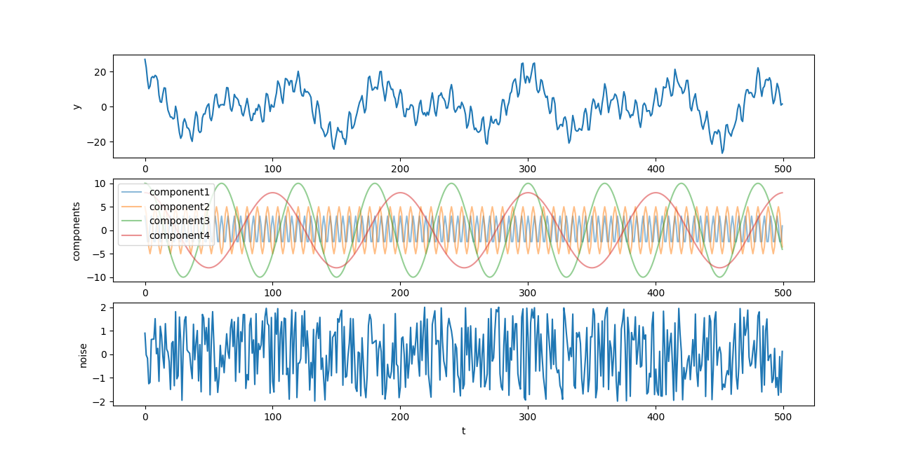

# 作业二

韦境量

## T1：构造时间序列

构造时间序列，至少包含五种成分和噪声，要求至少含有四个周期项$T1$、$T2$、$T3$和$T4$，要求$T1$和$T2$周期在同一尺度，$T3$大一个量级。

编写`python`代码如下：
```py
import numpy as np
import matplotlib.pyplot as plt

# create data
T1 = 5
T2 = 8
T3 = 60
T4 = 100
x = np.arange(0, 500, 1)

def create_data(x):
    component1 = 3 * np.cos(2 * np.pi / T1 * x)
    component2 = 5 * np.cos(2 * np.pi / T2 * x)
    component3 = 10 * np.cos(2 * np.pi / T3 * x)
    component4 = 8 * np.cos(2 * np.pi / T4 * x)
    noise = np.random.uniform(-2, 2, len(x))
    all = component1 + component2 + component3 + component4 + noise
    return all, component1, component2, component3, component4, noise

y, y1, y2, y3, y4, noise = create_data(x)

# draw
ax1 = plt.subplot(311)
ax2 = plt.subplot(312)
ax3 = plt.subplot(313)
ax1.plot(x, y)
ax1.set_ylabel('y')
ax2.plot(x, y1, alpha=0.5, label='component1')
ax2.plot(x, y2, alpha=0.5, label='component2')
ax2.plot(x, y3, alpha=0.5, label='component3')
ax2.plot(x, y4, alpha=0.5, label='component4')
ax2.set_ylabel('components')
ax2.legend()
ax3.plot(x, noise)
ax3.set_ylabel('noise')
ax3.set_xlabel('t')
plt.show()
```

创建4个周期成分和一个均匀随机分布在 $[-2,2]$ 的噪声，并绘图得到



## T2：最小二乘法拟合数据

用最小二乘法以 $y=a+bx^2$ 对数据进行拟合。

### 理论推导

待拟合数据 $(x_i, y_i), i=1,2, ...,n$

要得到能使残差平方和 $\displaystyle\Delta=\sum_{i=1}^n\left[y_i-(a+bx_i^2)\right]^2$ 最小的参数 $a,b$ 

将上式分别对参数 $a,b$ 求偏导：

$$
\left\{
\begin{array}{l}
\displaystyle\frac{\partial\Delta}{\partial a}=-2\sum_{i=1}^n\left[y_i-(a+bx_i^2)\right]=0 \\
\displaystyle\frac{\partial\Delta}{\partial b}=-2\sum_{i=1}^n\left[y_i-(a+bx_i^2)\right]x_i^2=0
\end{array}
\right.
$$

当 $a,b$ 满足上面偏导为零时，残差平方和 $\Delta$ 取极小值，此时的 $a,b$ 记为最佳参数 $\hat{a},\hat{b}$ 。

上面二式化简为
$$
\left\{
\begin{array}{l}
\hat{a}n+\hat{b}\sum x_i^2=\sum y_i \\
\hat{a}\sum x_i^2+\hat{b}\sum x_i^4=\sum x_i^2y_i
\end{array}
\right.
$$

解得
$$
\left\{
\begin{array}{l}
\displaystyle\hat{a}=\frac{\sum x_i^4\sum y_i - \sum x_i^2\sum x_i^2y_i}{n\sum x_i^4 - (\sum x_i^2)^2} \\
\displaystyle\hat{b}=\frac{n\sum x_i^2y_i - \sum x_i^2\sum y_i}{n\sum x_i^4 - (\sum x_i^2)^2}
\end{array}
\right.
$$

### 编写程序

编写`python`代码如下：

```py
import numpy as np
import matplotlib.pyplot as plt

# raw data
xi = np.array([19, 25, 31, 38, 44])
yi = np.array([19.0, 32.3, 49.0, 73.3, 97.8])

# find the least squares best fit line of the form y = a + bx^2
sum_x2 = 0
sum_x4 = 0
sum_y = 0
sum_x2y = 0
n = len(xi)
for i in range(n):
    sum_x2 += xi[i]**2
    sum_x4 += xi[i]**4
    sum_y += yi[i]
    sum_x2y += xi[i]**2 * yi[i]

a = (sum_x4 * sum_y - sum_x2y * sum_x2) / (n * sum_x4 - sum_x2**2)
b = (n * sum_x2y - sum_x2 * sum_y) / (n * sum_x4 - sum_x2**2)

x_fit = np.arange(10, 50, 1)
y_fit_manual = a + b * x_fit**2

# use polyfit to confirm
xi2 = xi**2
an = np.polyfit(xi2, yi, 1)
p = np.poly1d(an)
y_fit_polyfit = p(x_fit**2)

# draw
plt.scatter(xi, yi, label='raw data')
plt.plot(x_fit, y_fit_manual, 'r-.', alpha=0.6, label='manual fit')
plt.plot(x_fit, y_fit_polyfit, 'g:', alpha=0.6, label='polyfit fit')
plt.xlabel('x')
plt.ylabel('y')
plt.legend()
plt.show()
```

先使用[理论推导](#理论推导)中得到的参数公式进行计算，然后再用`numpy`模块自带的`polyfit`进行验证，绘图如下


## T3：曲线拟合并绘制对数图

用 $y=ax^c$ 进行拟合，并分别用线性尺度和对数尺度绘制拟合曲线图像。

编写`python`代码如下：
```py
import numpy as np
import matplotlib.pyplot as plt
from scipy.optimize import curve_fit

# raw data
xi = np.array([0.0129, 0.0247, 0.053, 0.155, 0.301,
               0.471, 0.802, 1.27, 1.43, 2.46])
yi = np.array([9.56, 8.1845, 5.2616, 2.7917, 2.2611,
               1.734, 1.237, 1.0674, 1.1171, 0.762])

# use curve_fit to fit
def func(x, a, c):
    return a * x ** c

popt, pcov = curve_fit(func, xi, yi)
x_fit = np.arange(0, 3, 0.01)
y_fit = func(x_fit, popt[0], popt[1])

# draw
ax1 = plt.subplot(211)
ax1.scatter(xi, yi, label='raw data')
ax1.plot(x_fit, y_fit, label='fit curve')
ax1.set_xlabel('x')
ax1.set_ylabel('y')
ax1.legend()
ax2 = plt.subplot(212)
ax2.scatter(xi, yi, label='raw data')
ax2.plot(x_fit, y_fit, label='fit curve')
ax2.set_xscale('log')
ax2.set_yscale('log')
ax2.set_xlabel('log(x)')
ax2.set_ylabel('log(y)')
ax2.legend()
plt.show()
```

使用`scipy`模块中的`curve_fit`函数进行拟合，绘图如下


