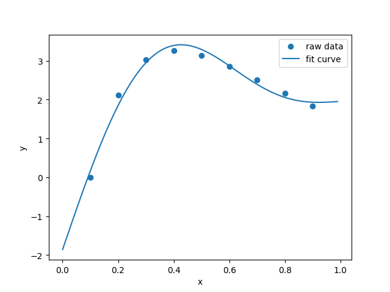
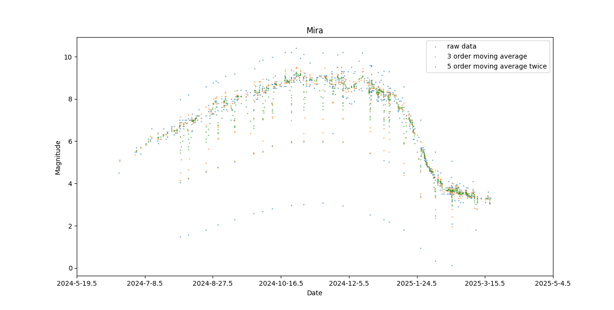

# 作业三

## T1: 曲线拟合

::: info 题目
使用曲线模型 $g(x)=c_1+c_2x+c_3\sin(\pi x)+c_4\sin(2\pi x)$ 对下面数据进行拟合：

$x_i=[0.1, 0.2, 0.3, 0.4, 0.5, 0.6, 0.7, 0.8, 0.9]$

$y_i=[0, 2.122, 3.0244, 3.2568, 3.1399, 2.8579, 2.514, 2.1639, 1.8358]$
:::

使用`scipy`模块中的`curve_fit`函数进行拟合，代码如下：

```py
import numpy as np
import matplotlib.pyplot as plt
from scipy.optimize import curve_fit

# raw data
xi = np.array([0.1, 0.2, 0.3, 0.4, 0.5,
               0.6, 0.7, 0.8, 0.9])
yi = np.array([0, 2.122, 3.0244, 3.2568, 3.1399,
               2.8579, 2.514, 2.1639, 1.8358])

# use g(x)=c1+c2x+c3sin(pi*x)+c4sin(2pi*x) to fit
def func(x, c1, c2, c3, c4):
    return c1 + c2*x + c3*np.sin(np.pi*x) + c4*np.sin(2*np.pi*x)

popt, pcov = curve_fit(func, xi, yi)
x_fit = np.arange(0, 1, 0.01)
y_fit = func(x_fit, popt[0], popt[1], popt[2], popt[3])

# draw
plt.scatter(xi, yi, label='raw data')
plt.plot(x_fit, y_fit, label='fit curve')
plt.xlabel('x')
plt.ylabel('y')
plt.legend()
plt.show()
```

绘图结果如下：



## T2: 滑动平均

::: info 题目
对 [hw1](/hw/data_process/hw1) 数据分别进行3阶滑动平均和5阶2次滑动平均，并讨论那种方式能更好地抑制主波动。
:::

这里使用 [hw1中的短期数据](/hw/data_process/hw1#短期数据) 进行分析

先对数组 `mags` 进行3阶滑动平均，即
$$
\mathrm{mags_3}[i]=\frac{\mathrm{mags}[i-1]+\mathrm{mags}[i]+\mathrm{mags}[i+1]}{3},\quad i=2,...,n-1
$$

再对数据 `mags` 进行5阶2次滑动平均，即
$$
\mathrm{mags_{51}}[i]=\frac{\displaystyle\sum_{j=i-2}^{i+2}\mathrm{mags}[j]}{5},\quad i=3,...,n-2
$$
$$
\mathrm{mags_{52}}[i]=\frac{\displaystyle\sum_{j=i-2}^{i+2}\mathrm{mags_{51}}[j]}{5},\quad i=3,...,n-2
$$

编写代码如下：
```py
import numpy as np
import matplotlib.pyplot as plt
from jd import jd2ymd

# read data from data_short.txt
data = open('data_short.txt', 'r')
jds, mags = [], []
for line in data:
    datas = line.split(',')
    jd, mag = float(datas[0]), float(datas[1])
    jds.append(jd)
    mags.append(mag)

# 3 order moving average
n = len(mags)
mags_3 = []
for i in range(1, n-1):
    now_mags_3 = (mags[i-1] + mags[i] + mags[i+1]) / 3
    mags_3.append(now_mags_3)

# 5 order moving average twice
mags_5_1 = []
for i in range(2, n-2):
    now_mags_5 = (mags[i-2] + mags[i-1] + mags[i]
                  + mags[i+1] + mags[i+2]) / 5
    mags_5_1.append(now_mags_5)
mags_5_2 = []
m = len(mags_5_1)
for i in range(2, m-2):
    now_mags_5 = (mags_5_1[i-2] + mags_5_1[i-1] + mags_5_1[i]
                  + mags_5_1[i+1] + mags_5_1[i+2]) / 5
    mags_5_2.append(now_mags_5)

# draw scatter of data
plt.scatter(jds[:], mags[:], s=1, alpha=0.5, label='raw data')
plt.scatter(jds[1:-1], mags_3[:], s=1, alpha=0.5, label='3 order moving average')
plt.scatter(jds[4:-4], mags_5_2[:], s=1, alpha=0.5, label='5 order moving average twice')
# change the xticks from jd to date
xticks = plt.gca().get_xticks()
def change_ticks(val):
    y, m, d = jd2ymd(val)
    return f'{y}-{m}-{d}'
plt.xticks(xticks, [change_ticks(i) for i in xticks])
plt.title('Mira')
plt.xlabel('Date')
plt.ylabel('Magnitude')
plt.legend()
plt.show()
```

绘图结果如下：



