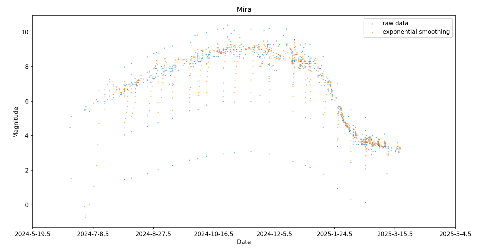
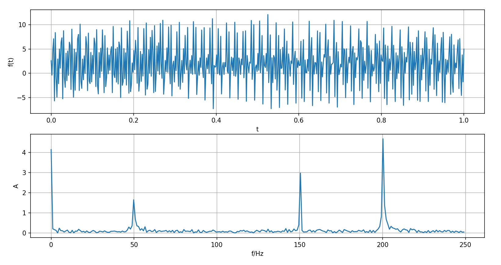

# 作业四

## T1: 指数平滑

::: info 题目
对 [hw1](/hw/data_process/hw1) 数据进行[指数平滑分析](/blog/astronomy/data_processing#理论)
:::

由于我选取的数据具有总趋势，所以采用线性指数平滑法：

选取平滑系数 $A=0.3,B=0.3$ ，平滑递推式如下
$$
S_t=Ay_t+(1-A)(S_{t-1}+b_{t-1})
$$
$$
b_t=B(S_t-S_{t-1})+(1-B)b_{t-1}
$$

编写代码如下：
```py
import numpy as np
import matplotlib.pyplot as plt
from jd import jd2ymd

# read data from data_short.txt
data = open('data_short.txt', 'r')
jds, mags = [], []
for line in data:
    datas = line.split(',')
    jd, mag = float(datas[0]), float(datas[1])
    jds.append(jd)
    mags.append(mag)

# exponential smoothing
n = len(mags)
mags_exp = []
b = []
A, B = 0.3, 0.3
mags_exp.append(mags[0])
b.append(-mags[0])
for i in range(1,n):
    St = A*mags[i]+(1-A)*(mags_exp[i-1]+b[i-1])
    mags_exp.append(St)
    bt = B*(mags_exp[i]-mags_exp[i-1])+(1-B)*b[i-1]
    b.append(bt)

# draw scatter of data
plt.scatter(jds[:], mags[:], s=1, alpha=0.5, label='raw data')
plt.scatter(jds[:], mags_exp[:], s=1, alpha=0.5, label='exponential smoothing')
# change the xticks from jd to date
xticks = plt.gca().get_xticks()
def change_ticks(val):
    y, m, d = jd2ymd(val)
    return f'{y}-{m}-{d}'
plt.xticks(xticks, [change_ticks(i) for i in xticks])
plt.title('Mira')
plt.xlabel('Date')
plt.ylabel('Magnitude')
plt.legend()
plt.show()
```

绘图结果如下：


## T2: 傅里叶变换

::: info 题目
自行构造周期数据通过傅里叶变换进行频谱分析
:::

构造周期信号 $f(t)=2+2\sin(2\pi\cdot500t)+5\sin(2\pi\cdot200t)+3\sin(2\pi\cdot150t)$

并加入服从正态分布 $N(0,1)$ 的噪声，采样时长 $1s$ ，采样频率 $fs=500Hz$

使用`scipy.fftpack.fft`进行傅里叶变换，并自行编写程序转成频谱图：

```py
import numpy as np
import matplotlib.pyplot as plt
from scipy.fftpack import fft

# change the complex after fft to spectrogram
def FFT(data):
    L = len(data)
    N = int(np.power(2, np.ceil(np.log2(L))))
    FFT_y = np.abs(fft(data, N)) / L * 2
    Fre = np.arange(int(N/2)) * L / N
    FFT_y = FFT_y[range(int(N/2))]
    return Fre, FFT_y

# setting f
fs = 500
f1 = 50
f2 = 200
f3 = 150

# generate signal and analyze
t = np.linspace(0, 1, fs)
base = 2 + np.random.normal(0, 1, fs)
component1 = 2*np.sin(2*np.pi*f1*t)
component2 = 5*np.sin(2*np.pi*f2*t+1)
component3 = 3*np.sin(2*np.pi*f3*t+4)
y = base+component1+component2+component3
fre, fft_y = FFT(y)

# draw
ax1 = plt.subplot(211)
ax2 = plt.subplot(212)
ax1.plot(t, y)
ax1.set_xlabel('t')
ax1.set_ylabel('f(t)')
ax1.grid()
ax2.plot(fre, fft_y)
ax2.set_xlabel('f/Hz')
ax2.set_ylabel('A')
ax2.grid()
plt.show()
```

绘图结果如下：


