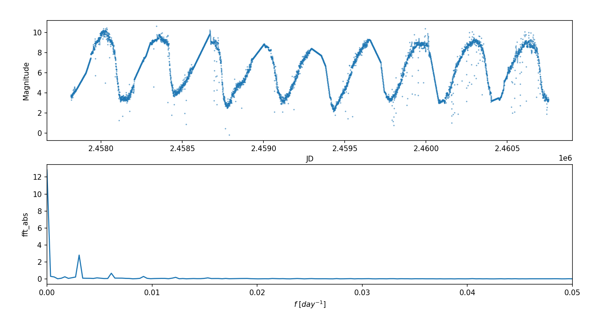
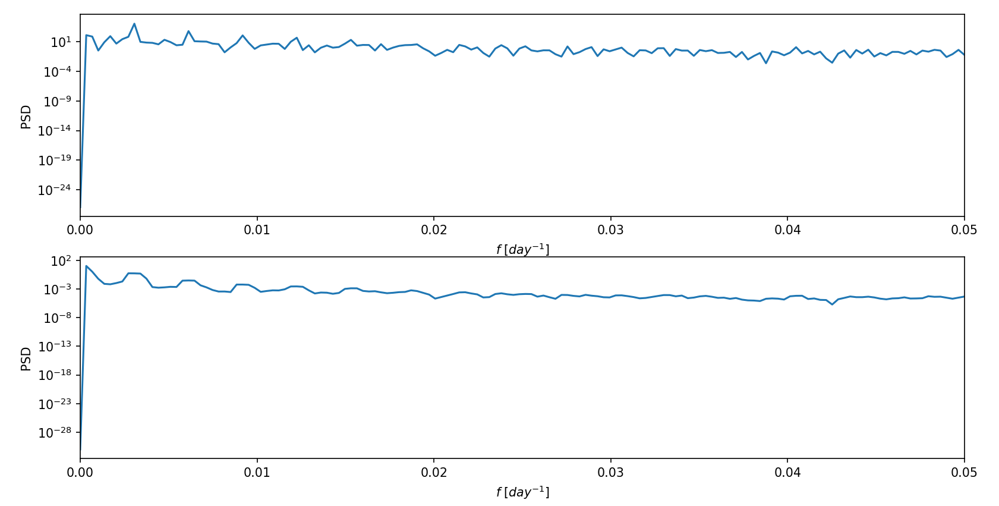
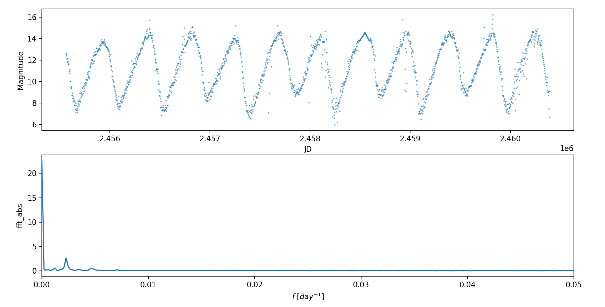
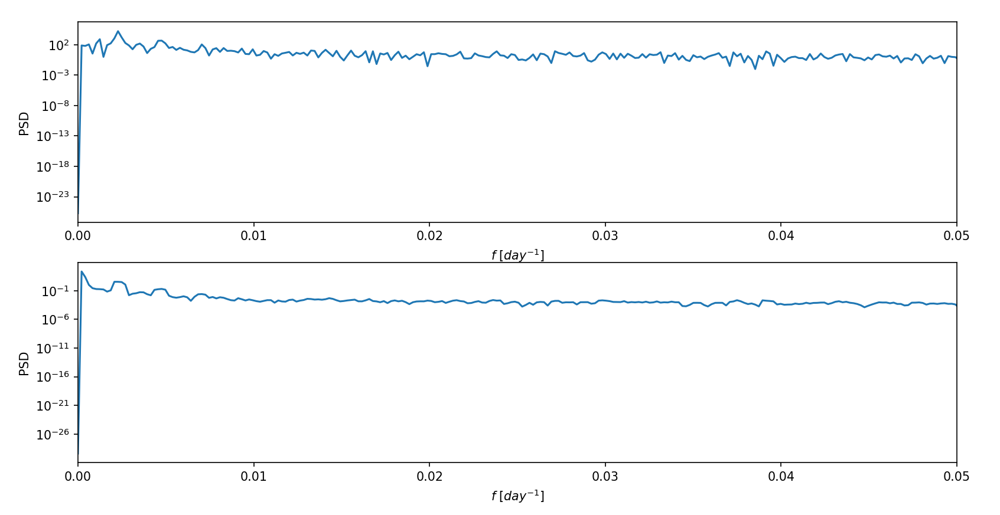

# 作业五

## T1: 频谱分析

::: info 题目
对自己选取的数据序列通过傅里叶变化进行频谱分析，并结合第一次作业讨论
:::

在 [作业一](/hw/data_process/hw1) 中，我
从 [aavso](https://www.aavso.org/data-download) 下载第一颗已知的周期变星 Mira(OMI CET) 的数据`aavsodata_67e13c77f382d.txt`。

并编写了脚本 `read_preprocessing.py` 进行读取数据，预处理：
```py{43,44}
import numpy as np
from jd import jd2ymd

# read data from aavsodata_67e13c77f382d.txt
data = open('aavsodata_67e13c77f382d.txt', 'r')
## pass the title
istitle = True
jds, mags = [], []
for line in data:
    if istitle:
        istitle = False
        continue
    datas = line.split(',')
    ## pass the magnitude '<8.0'
    if '<' in datas[1]:
        continue
    jd, mag = float(datas[0]), float(datas[1])
    jds.append(jd)
    mags.append(mag)
data.close()

# pre processing
## replace the same jd data with their average
i = 0
while i < len(jds)-1:
    samen = 1
    while jds[i+samen] == jds[i]:
        samen += 1
    samen -= 1
    if samen != 0:
        sum = 0
        for j in range(samen+1):
            sum += mags[i+j]
        average = sum/(samen+1)
        mags[i] = float(average)
        for j in range(1, samen+1):
            jds = np.delete(jds, i+1)
            mags = np.delete(mags, i+1)
    i += 1

# save the data after processing into data.txt
## len(jds) = 79010
file = open('data_long.txt', 'w')
start, end = 72000, 79009
for i in range(start, end+1):
    file.write(str(jds[i])+','+str(mags[i])+'\n')
file.close()

print(f'already save data from {jd2ymd(jds[start])} to {jd2ymd(jds[end])}')
```

修改变量 `start,end` 读取更大范围的数据保存进文件 `data_long.txt` 。

由于原始数据序列的时间间隔不恒定，所以先进行线性插值，然后再进行傅里叶变化，编写脚本 `t1.py`
```py
import numpy as np
import matplotlib.pyplot as plt
from scipy import interpolate
from scipy.fftpack import fft

# read data from data.txt
data = open('data_long.txt', 'r')
jds, mags = [], []
for line in data:
    datas = line.split(',')
    jd, mag = float(datas[0]), float(datas[1])
    jds.append(jd)
    mags.append(mag)

# linear interpolate
f = interpolate.interp1d(jds, mags, kind='linear')
N = len(jds)
t_new = np.linspace(jds[0], jds[-1], N)
mags_new = f(t_new)

# fft
T = jds[-1] - jds[0]
fft_y = 2 * fft(mags_new) / N
fft_abs = np.abs(fft_y)
fre = np.arange(N) / T

# draw the result
ax1, ax2 = plt.subplot(211), plt.subplot(212)
ax1.scatter(t_new[:], mags_new[:], s=1, alpha=0.5)
ax1.set_xlabel('JD')
ax1.set_ylabel('Magnitude')
ax2.plot(fre, fft_abs)
ax2.set_xlabel(r'$f$ $[day^{-1}]$')
ax2.set_ylabel('fft_abs')
ax2.set_xlim(0, 0.05)
plt.show()
```

绘图结果如下：


可以看到除了直流部分，该变星的光变曲线的主频率为 $f_1=0.003060\mathrm{day}^{-1}$ 即主周期为 $T_1=1/f_1=326.797385621\mathrm{day}$ ，除此之外，还有小幅度的 $f_2=0.006119\mathrm{day}^{-1},f_3=0.009180\mathrm{day}^{-1}$ 周期分别为 $T_2=163.425396307\mathrm{day},T_3=108.932461874\mathrm{day}$

## T2: 功率谱估计

::: info 题目
对自己选取的数据序列，通过两种功率谱估计方法进行频谱分析
:::

这里采用周期图法 (periodogram) 和多窗口法 (Multitaper Method) 进行功率谱估计，编写脚本 `t2.py`
```py
import numpy as np
import matplotlib.pyplot as plt
from scipy import interpolate
from scipy.signal import periodogram, windows, csd

# read data from data.txt
data = open('data_long.txt', 'r')
jds, mags = [], []
for line in data:
    datas = line.split(',')
    jd, mag = float(datas[0]), float(datas[1])
    jds.append(jd)
    mags.append(mag)

# linear interpolate
f = interpolate.interp1d(jds, mags, kind='linear')
N = len(jds)
t_new = np.linspace(jds[0], jds[-1], N)
mags_new = f(t_new)

# periodogram
fs = N / (jds[-1] - jds[0])
f1, Pxx1 = periodogram(mags_new, fs)

# Multitaper Method
NW = 2
Kmax = 2 * NW - 1
tapers = windows.dpss(N, NW, Kmax)
Pxx2 = 0
for taper in tapers:
    f2, Pxx_seg = periodogram(mags_new * taper, fs)
    Pxx2 += Pxx_seg
Pxx2 /= len(tapers)

# draw the result
ax1, ax2 = plt.subplot(211), plt.subplot(212)
ax1.semilogy(f1, Pxx1)
ax1.set_xlabel(r'$f$ $[day^{-1}]$')
ax1.set_ylabel('PSD')
ax1.set_xlim(0, 0.05)
ax2.semilogy(f2, Pxx2)
ax2.set_xlabel(r'$f$ $[day^{-1}]$')
ax2.set_ylabel('PSD')
ax2.set_xlim(0, 0.05)
plt.show()
```

绘图结果如下：


可以看到高功率部分的频率与前面得到的频谱图保持一致。

## T3: 使用他人数据分析

::: info 题目
使用别人的数据重复前2题的分析
:::

这里使用同学在网站 [aavso](https://www.aavso.org/data-download) 下载的变星 R CYG 的数据。

由于与我使用的数据结构相同，直接修改原读取预处理脚本 `read_preprocessing_friend.py`
```py{5,43,44}
import numpy as np
from jd import jd2ymd

# read data from aavsodata_67f352892c7d7.txt
data = open('aavsodata_67f352892c7d7.txt', 'r')
## pass the title
istitle = True
jds, mags = [], []
for line in data:
    if istitle:
        istitle = False
        continue
    datas = line.split(',')
    ## pass the magnitude '<8.0'
    if '<' in datas[1]:
        continue
    jd, mag = float(datas[0]), float(datas[1])
    jds.append(jd)
    mags.append(mag)
data.close()

# pre processing
## replace the same jd data with their average
i = 0
while i < len(jds)-1:
    samen = 1
    while jds[i+samen] == jds[i]:
        samen += 1
    samen -= 1
    if samen != 0:
        sum = 0
        for j in range(samen+1):
            sum += mags[i+j]
        average = sum/(samen+1)
        mags[i] = float(average)
        for j in range(1, samen+1):
            jds = np.delete(jds, i+1)
            mags = np.delete(mags, i+1)
    i += 1

# save the data after processing into data.txt
## len(jds) = 49214
file = open('data_long_friend.txt', 'w')
start, end = 42000, 49000
for i in range(start, end+1):
    file.write(str(jds[i])+','+str(mags[i])+'\n')
file.close()

print(f'already save data from {jd2ymd(jds[start])} to {jd2ymd(jds[end])}')
```

进行线性插值和傅里叶变化 `t1_friend.py`
```py{7,17}
import numpy as np
import matplotlib.pyplot as plt
from scipy import interpolate
from scipy.fftpack import fft

# read data from data.txt
data = open('data_long_friend.txt', 'r')
jds, mags = [], []
for line in data:
    datas = line.split(',')
    jd, mag = float(datas[0]), float(datas[1])
    jds.append(jd)
    mags.append(mag)

# linear interpolate
f = interpolate.interp1d(jds, mags, kind='linear')
N = int(len(jds) / 4)
t_new = np.linspace(jds[0], jds[-1], N)
mags_new = f(t_new)

# fft
T = jds[-1] - jds[0]
fft_y = 2 * fft(mags_new) / N
fft_abs = np.abs(fft_y)
fre = np.arange(N) / T

# draw the result
ax1, ax2 = plt.subplot(211), plt.subplot(212)
ax1.scatter(t_new[:], mags_new[:], s=1, alpha=0.5)
ax1.set_xlabel('JD')
ax1.set_ylabel('Magnitude')
ax2.plot(fre, fft_abs)
ax2.set_xlabel(r'$f$ $[day^{-1}]$')
ax2.set_ylabel('fft_abs')
ax2.set_xlim(0, 0.05)
plt.show()
```

绘图结果如下：


然后使用周期图法 (periodogram) 和多窗口法 (Multitaper Method) 进行功率谱估计 `t2_friend.py`
```py{7}
import numpy as np
import matplotlib.pyplot as plt
from scipy import interpolate
from scipy.signal import periodogram, windows, csd

# read data from data.txt
data = open('data_long_friend.txt', 'r')
jds, mags = [], []
for line in data:
    datas = line.split(',')
    jd, mag = float(datas[0]), float(datas[1])
    jds.append(jd)
    mags.append(mag)

# linear interpolate
f = interpolate.interp1d(jds, mags, kind='linear')
N = int(len(jds) / 4)
t_new = np.linspace(jds[0], jds[-1], N)
mags_new = f(t_new)

# periodogram
fs = N / (jds[-1] - jds[0])
f1, Pxx1 = periodogram(mags_new, fs)

# Multitaper Method
NW = 2
Kmax = 2 * NW - 1
tapers = windows.dpss(N, NW, Kmax)
Pxx2 = 0
for taper in tapers:
    f2, Pxx_seg = periodogram(mags_new * taper, fs)
    Pxx2 += Pxx_seg
Pxx2 /= len(tapers)

# draw the result
ax1, ax2 = plt.subplot(211), plt.subplot(212)
ax1.semilogy(f1, Pxx1)
ax1.set_xlabel(r'$f$ $[day^{-1}]$')
ax1.set_ylabel('PSD')
ax1.set_xlim(0, 0.05)
ax2.semilogy(f2, Pxx2)
ax2.set_xlabel(r'$f$ $[day^{-1}]$')
ax2.set_ylabel('PSD')
ax2.set_xlim(0, 0.05)
plt.show()
```

绘图结果如下：


可以看到主频率 $f=0.00232\mathrm{day}^{-1}$ 主周期 $T=1/f=431.034482759\mathrm{day}$ 保持一致。

