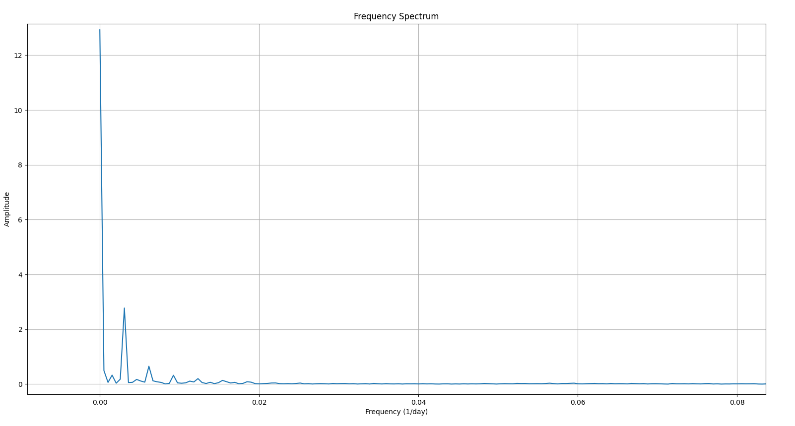
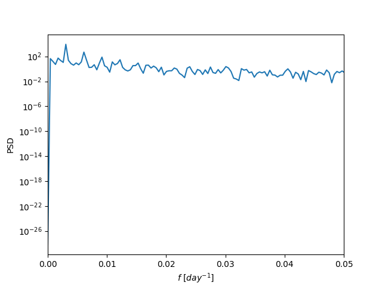

# 作业六

组员：韦境量、阙佳

::: info 题目
合作项目，两人一组，数据自选，要求A同学前3/4数据，B同学后3/4数据，频谱分析，两人方法不同，并讨论
:::

我们采用我在[作业5 T1](/hw/data_process/hw5#t1-频谱分析)使用的数据 `data_long.txt`，这是变星 Mira(OMI CET) 从 2017 年 3 月 1 日到 2025 年 3 月 19 日的星等值数据。

## 前3/4部分

阙佳对数据的前3/4部分使用傅里叶变换 (FFT) 进行频谱分析，编写脚本如下：
```py
import numpy as np
import matplotlib.pyplot as plt
from scipy.interpolate import interp1d
from scipy.fft import fft, fftfreq

# 读取文件的前3/4部分
file_path = "data_long.txt"
with open(file_path, 'r') as file:
    lines = file.readlines()

# 计算前3/4部分的行数
num_lines = len(lines)
cutoff = int(num_lines * 3 / 4)

# 提取儒略日和星等值
julian_dates = []
magnitudes = []
for line in lines[:cutoff]:
    jd, mag = map(float, line.strip().split(','))
    julian_dates.append(jd)
    magnitudes.append(mag)

julian_dates = np.array(julian_dates)
magnitudes = np.array(magnitudes)

# 创建等间隔的时间序列
uniform_time = np.linspace(julian_dates.min(), julian_dates.max(), len(julian_dates))

# 线性插值
interpolator = interp1d(julian_dates, magnitudes, kind='linear')
interpolated_magnitudes = interpolator(uniform_time)

# 计算傅里叶变换
N = len(uniform_time)
T = (uniform_time.max() - uniform_time.min()) / (N - 1)  # 计算采样间隔
yf = fft(interpolated_magnitudes)
xf = fftfreq(N, T)[:N//2]  # 频率

# 绘制频谱图
plt.figure(figsize=(10, 6))
plt.plot(xf, 2.0/N * np.abs(yf[:N//2]))
plt.title('Frequency Spectrum')
plt.xlabel('Frequency (1/day)')
plt.ylabel('Amplitude')
plt.grid()
plt.show()
```

绘图结果如下：


发现主要的频率及其幅度为：
|频率 $(\mathrm{day}^{-1})$ |幅度|
|:--:|:--:|
|$0.00310$|$2.75$|
|$0.00616$|$0.64$|
|$0.00927$|$0.30$|

## 后3/4部分

我负责对数据的后3/4部分使用周期图法 (periodogram) 进行频谱分析，编写脚本如下：
```py
import numpy as np
import matplotlib.pyplot as plt
from scipy import interpolate
from scipy.signal import periodogram

# read the last 3/4 data from data.txt
data = open('data_long.txt', 'r')
jds, mags = [], []
for line in data:
    datas = line.split(',')
    jd, mag = float(datas[0]), float(datas[1])
    jds.append(jd)
    mags.append(mag)
N = len(jds)
jds = jds[int(N / 4):]
mags = mags[int(N / 4):]

# linear interpolate
f = interpolate.interp1d(jds, mags, kind='linear')
N = len(jds)
t_new = np.linspace(jds[0], jds[-1], N)
mags_new = f(t_new)

# periodogram
fs = N / (jds[-1] - jds[0])
f1, Pxx1 = periodogram(mags_new, fs)

# draw the result
plt.semilogy(f1, Pxx1)
plt.xlabel(r'$f$ $[day^{-1}]$')
plt.ylabel('PSD')
plt.xlim(0, 0.05)
plt.show()
```

绘图结果如下：


可以看到除了直流部分，该变星的光变曲线的主频率为 $f_1=0.00306\mathrm{day}^{-1},f_2=0.00612\mathrm{day}^{-1},f_3=0.00921\mathrm{day}^{-1}$ 即主周期为 $T_1=326.8\mathrm{day},T_2=163.4\mathrm{day},T_3=108.6\mathrm{day}$

## 讨论

对前3/4部分进行傅里叶变换得到的频率为 $0.00310\mathrm{day}^{-1},0.00616\mathrm{day}^{-1},0.00927\mathrm{day}^{-1}$ ，对后3/4部分进行周期图法功率谱分析得到的频率为 $0.00306\mathrm{day}^{-1},0.00612\mathrm{day}^{-1},0.00921\mathrm{day}^{-1}$ ，可以看到两种方法得到的结果基本一致，都反映了原数据的周期分量。
