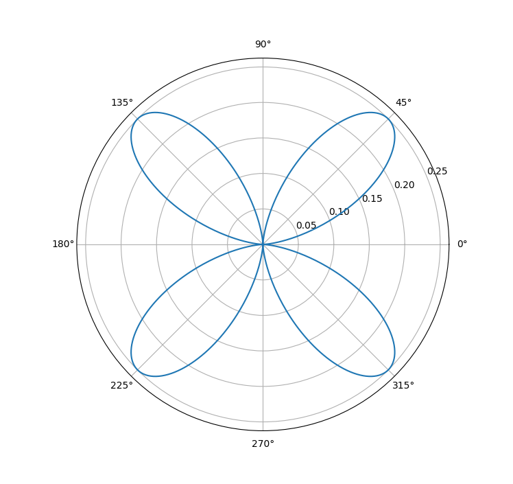
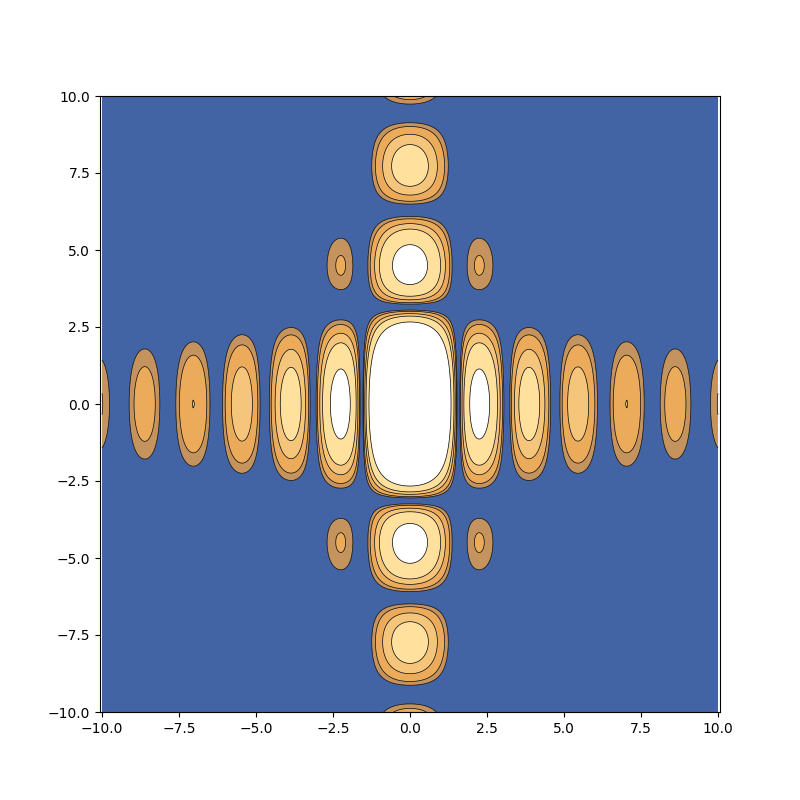

# 电动作业

::: info 作业
1. 推导绘制电偶极子的辐射场
2. 绘制电四极子辐射功率角分布
3. 绘制矩形孔的夫朗禾费衍射图样
:::

## 1. 电偶极子辐射场

### 求电偶极子电场线方程

从矢势出发
$$
\boldsymbol{A}(\boldsymbol{x})=\frac{\mu_0}{4\pi}\int_V\frac{\boldsymbol{J}(\boldsymbol{x}')e^{-ikr}}{r}\mathrm{d}V'
$$
$$
\boldsymbol{B}=\nabla\times\boldsymbol{A}
$$
$$
\begin{align}
\boldsymbol{E}&=-\frac{\partial \boldsymbol{A}}{\partial t}-\nabla\varphi \\
&=-i\omega\boldsymbol{A}+\frac{c^2\nabla(\nabla\cdot\boldsymbol{A})}{i\omega}
\end{align}
$$
对电偶极子有
$$
\boldsymbol{A}=\frac{\mu_0\dot{p}}{4\pi r}e^{ikr}\ \boldsymbol{e}_z
$$
$$
\boldsymbol{B}=\nabla\times\boldsymbol{A}=\frac{\mu_0\dot{p}}{4\pi r^2}e^{-ikr}(1+ikr)\sin\theta\ \boldsymbol{e}_\phi
$$
$$
\Rightarrow\left\{\begin{array}{l}
E_r=\sqrt{\frac{\mu_0}{\varepsilon_0}}\frac{\dot{p}}{2\pi r^2}e^{-ikr}(1-\frac{i}{kr})\cos\theta \\
E_\theta=\sqrt{\frac{\mu_0}{\varepsilon_0}}\frac{\dot{p}}{4\pi r^2}e^{-ikr}(1+ikr-\frac{i}{kr})\sin\theta \\
E_\phi=0
\end{array}\right.
$$

由电场线方程
$$
\frac{\mathrm{d}r}{E_r}=\frac{r\mathrm{d}\theta}{E_\phi}=\frac{r\sin\theta\mathrm{d}\phi}{E_\phi}
$$
$$
\Rightarrow \frac{\sin^2\theta}{r}[kr\cos(\omega t-kr)+\sin(\omega t-kr)]=C
$$
其中 $C$ 为积分常数，每一个 $C$ 对应一条电场线，取一组 $C$ 即为一族电场线。

### 绘制电场线

使用 `python` 绘制电场线并根据磁场方向填色
```py
import numpy as np
import matplotlib.pyplot as plt
from matplotlib.animation import FuncAnimation

# set up the grid, parameters and colors
x = np.linspace(-30, 30, 601)
y = np.linspace(-30, 30, 601)
X, Y = np.meshgrid(x, y)
t_values = np.linspace(0, 20, 100)
C = [-0.9, -0.4, -0.1, 0, 0.1, 0.4, 0.9]
levels = [-2, -0.9, -0.4, -0.1, 0, 0.1, 0.4, 0.9, 2]
fill_colors_r = ['#ffffff', '#ffe09d', '#f5c57b', '#ebab5a', '#c5935d', '#847c83', '#4264a5', '#ffffff']
fill_colors_l = fill_colors_r[::-1]

# turn (x,y) into (R,Theta) and calculate E's equation
X = np.where(X == 0, 1e-6, X) # avoid division by zero
R = np.sqrt(X**2 + Y**2)
Theta = np.arctan2(Y, X) - np.pi / 2
def calc_E(t):
    E = np.sin(Theta)**2 / R * (R * np.cos(t - R) + np.sin(t - R))
    return E

# draw the curves E=C at each time t
fig, ax = plt.subplots(figsize=(8, 8))
def update(frame):
    ax.clear()
    t = t_values[frame]
    E = calc_E(t)
    ax.set_xlabel('x')
    ax.set_ylabel('y')
    ax.set_xlim(-30, 30)
    ax.set_ylim(-30, 30)
    ax.axis('equal')
    # draw the curves E=C
    ax.contour(X, Y, E, levels=C, colors='black', linewidths=0.5)
    # using colors to distinguish B's direction
    E_r = np.ma.masked_where(X >= 0, E)
    E_l = np.ma.masked_where(X < 0, E)
    ax.contourf(X, Y, E_r, levels=levels, colors=fill_colors_r, extend='both', antialiased=True)
    ax.contourf(X, Y, E_l, levels=levels, colors=fill_colors_l, extend='both', antialiased=True)
    return
update(0)
ani = FuncAnimation(fig, update, frames=len(t_values), interval=100, blit=False)
# ani.save('hw1_ed_animation.gif', writer='pillow')
plt.show()
```

绘图结果如下


## 2. 电四极子辐射功率角分布

### 辐射功率角分布

辐射功率角分布因子
$$
|\dddot{\vec{\mathscr{D}}}\times\boldsymbol{e}_R|^2=36Q^2l^4\omega^6\cos^2\theta\sin^2\theta
$$

### 绘制角分布图

用 `python` 绘制极坐标下 $\cos^2\theta\sin^2\theta$ 曲线
```py
import numpy as np
import matplotlib.pyplot as plt

theta = np.linspace(0, 2 * np.pi, 1000)
r = np.cos(theta)**2 * np.sin(theta)**2

ax = plt.subplot(111, projection='polar')
ax.plot(theta, r)
plt.show()
```

结果如下


## 3. 矩形孔的夫朗禾费衍射

### 矩形孔的夫朗禾费衍射光强分布

光强分布
$$
I=I_0\left(\frac{\sin ka\alpha}{ka\alpha}\right)^2\left(\frac{\sin kb\beta}{kb\beta}\right)^2
$$
其中 $\alpha=\arcsin\frac{x}{d}\approx\frac{x}{d},\beta=\arcsin\frac{y}{d}\approx\frac{y}{d}$

### 绘制光强分布图

用 `python` 绘制 $I$ 的等高线图并填色
```py
import numpy as np
import matplotlib.pyplot as plt

x = np.linspace(-10, 10, 400)
y = np.linspace(-10, 10, 400)
X, Y = np.meshgrid(x, y)

a, b = 2, 1
d = 100
k = 100
alpha = X / d
beta = Y / d
Z = (np.sin(k*a*alpha)/(k*a*alpha))**2 * (np.sin(k*b*beta)/(k*b*beta))**2

levels = [0.001, 0.002, 0.005, 0.01, 0.03]
fill_colors = ['#4264a5', '#c5935d', '#ebab5a', '#f5c57b', '#ffe09d', '#ffffff']

plt.figure(figsize=(8, 8))
plt.contour(X, Y, Z, levels=levels, colors='black', linewidths=0.5)
plt.contourf(X, Y, Z, levels=levels, colors=fill_colors, extend='both', antialiased=True)
plt.axis('equal')
plt.show()
```

绘图结果如下

