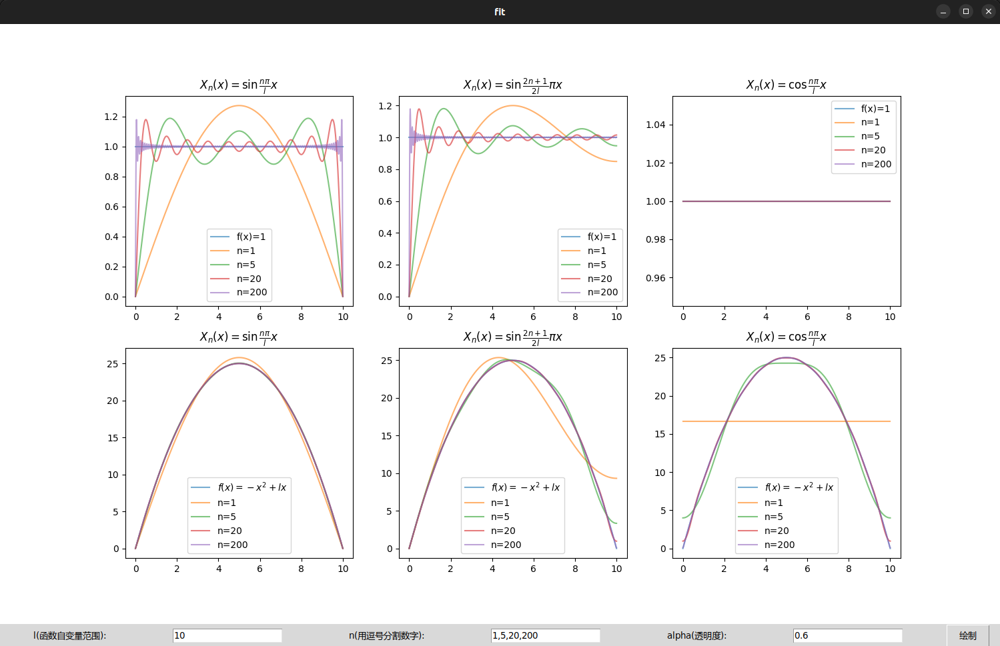

# 用python绘制本征函数系拟合图

来自数理方法作业12附加题5。

## 用本征函数系拟合两个特定函数

这里仅列出最终计算结果。

### 本征函数系1

对于本征函数系 
$$X_n(x)=\sin\frac{n\pi}{l}x, 0<x<l, n=1,2,3,...$$
其正交归一性：
$$\int_0^l X_n(x)X_m(x)dx = \frac{l}{2} \delta_{nm}$$
令 $f(x)=\sum_{n=1}^\infty C_nX_n(x)$，
则系数
$$C_n=\frac{2}{l} \int_0^l f(x)\sin(\frac{n\pi x}{l})dx$$

- 当 $f(x)=1$ ，有
$$ f(x)=\sum_{n=1}^\infty \frac{2}{n\pi} (1-(-1)^n) \sin(\frac{n\pi x}{l}) $$

- 当 $f(x)=-x^2+lx$ ，有
$$ f(x)=\sum_{n=1}^\infty \frac{4l^2}{n^3\pi^3} (1-(-1)^n) \sin(\frac{n\pi x}{l}) $$

### 本征函数系2

对于本征函数系 
$$X_n(x)=\sin\frac{2n+1}{2l}\pi x, 0<x<l, n=0,1,2,3,...$$
其正交归一性：
$$\int_0^l X_n(x)X_m(x)dx = \frac{l}{2} \delta_{nm}$$
令 $f(x)=\sum_{n=1}^\infty C_nX_n(x)$，
则系数
$$C_n=\frac{2}{l} \int_0^l f(x)\sin(\frac{2n+1}{2l}\pi x)dx$$

- 当 $f(x)=1$ ，有
$$ f(x)=\sum_{n=0}^\infty \frac{4}{(2n+1)\pi}\sin(\frac{2n+1}{2l}\pi x) $$

- 当 $f(x)=-x^2+lx$ ，有
$$ f(x)=\sum_{n=0}^\infty \frac{8l^2}{(2n+1)^2\pi^2}\left(\frac{4}{(2n+1)\pi}-(-1)^n\right)\sin(\frac{2n+1}{2l}\pi x) $$

### 本征函数系3

对于本征函数系 
$$X_n(x)=\cos\frac{n\pi}{l}x, 0<x<l, n=0,1,2,3,...$$
其正交归一性：
$$\int_0^l X_n(x)X_m(x)dx = \frac{l}{2} \delta_{nm} (1+\delta_{n0})$$
令 $f(x)=\sum_{n=1}^\infty C_nX_n(x)$，
则系数
$$C_n=\frac{2}{l} \int_0^l f(x)\cos(\frac{n\pi x}{l})dx$$

- 当 $f(x)=1$ ，有
$$ f(x)= \sum_{n=0}^\infty C_nX_n(x) = 1$$

- 当 $f(x)=-x^2+lx$ ，有
$$ f(x)=\frac{l^2}{6} + \sum_{n=1}^\infty \frac{-2l^2}{n^2\pi^2}\left(1+(-1)^n\right)\cos(\frac{n\pi x}{l})$$

## 用python绘制拟合图

### 编写程序

用`python`脚本根据参数`l`、`n`绘制出 $f(x)=\sum_n C_nX_n(x)$ 的前n项和，
观察级数如何收敛于 $f(x)$ 。

:::info
运行该脚本除了安装`python`运行环境之外，
还需要安装`python`的`numpy`、`matplotlib`和`tkinter`模块才能运行。

如果不想自己折腾，
也可以在线体验一下：[在线体验](https://jingliangwei.github.io/func_fit/)
:::

```py
import numpy as np
import matplotlib.pyplot as plt
from matplotlib.backends.backend_tkagg import FigureCanvasTkAgg
import tkinter as Tk

# ---------------------------------------------------
# 参数
l = 10              # 函数f自变量范围
ns = [1,5,20,200]    # 分别用前ns[0],ns[1],...项进行拟合
alpha = 0.6         # 绘图曲线透明度

# ---------------------------------------------------
# 待拟合函数及其字符串
## 待拟合函数1
def fx1(x, l):
    return 0 * x + 1
str_fx1 = 'f(x)=1'
## 待拟合函数2
def fx2(x, l):
    return - x * x + l * x
str_fx2 = r'$f(x)=-x^2+lx$'

# ---------------------------------------------------
# 本征函数系字符串
str_base1 = r'$X_n(x)=\sin\frac{n\pi}{l}x$'
str_base2 = r'$X_n(x)=\sin\frac{2n+1}{2l}\pi x$'
str_base3 = r'$X_n(x)=\cos\frac{n\pi}{l}x$'

# ---------------------------------------------------
# 用前n项进行拟合
## 用本征函数系1拟合函数1
def fit11(n, x, l):
    y = x * 0
    for i in range(1, n+1):
        y += 2 / (i * np.pi) * (1 - (-1)**i) * np.sin(i * np.pi * x / l)
    return y
## 用本征函数系1拟合函数2
def fit12(n, x, l):
    y = x * 0
    for i in range(1, n+1):
        y += 4 * l**2 / (i**3 * np.pi**3) * (1 - (-1)**i) * np.sin(i * np.pi * x / l)
    return y
## 用本征函数系2拟合函数1
def fit21(n, x, l):
    y = x * 0
    for i in range(0, n+1):
        y += 4 / ((2 * i + 1) * np.pi) * np.sin((2 * i + 1) / (2 * l) * np.pi * x)
    return y
## 用本征函数系2拟合函数2
def fit22(n, x, l):
    y = x * 0
    for i in range(0, n+1):
        y += 8 * l**2 / ((2 * i + 1)**2 * np.pi**2) * (4 / ((2 * i + 1) * np.pi) - (-1)**i) * np.sin((2 * i + 1) / (2 * l) * np.pi * x)
    return y
## 用本征函数系3拟合函数1
def fit31(n, x, l):
    y = x * 0
    for i in range(0, n+1):
        if i == 0:
            y += 1
        else:
            y += 0
    return y
## 用本征函数系3拟合函数2
def fit32(n, x, l):
    y = x * 0
    for i in range(0, n+1):
        if i == 0:
            y += l**2 / 6
        else:
            y += -2 * l**2 / (i**2 * np.pi**2) * (1 + (-1)**i) * np.cos(i * np.pi / l * x)
    return y

# ---------------------------------------------------
# 绘制用前ns=[n1,n2,...]项拟合函数f，拟合公式为fit
#   ax: 绘制图像的子图（位置）
#   l: 函数自变量范围
#   ns: 列表[n1,n2,...]分别用前n1项、前n2项拟合
#   fx: 待拟合的函数
#   str_fx: 待拟合函数字符串
#   fit: 用前n项进行拟合的函数
#   alpha: 透明度
#   str_base: 用于拟合的本征函数系字符串
def ax_fit(ax, l, ns, fx, str_fx, fit, alpha, str_base):
    x = np.linspace(0, l, 1000)
    # 绘制待拟合的函数
    f1 = fx(x, l)
    ax.plot(x, f1, label=str_fx, alpha=alpha)
    # 绘制分别用前n1项、前n2项、...拟合的函数
    for n in ns:
        f2 = fit(n, x, l)
        ax.plot(x, f2, label=f'n={n}', alpha=alpha)
    # 绘制图注
    ax.set_title(str_base)
    ax.legend()

def rplot():
    # ---------------------------------------------------
    # 接受参数
    l = float(l_input.get())
    str_n = str(n_input.get()).split(',')
    ns = []
    for n in str_n:
        ns.append(int(n))
    alpha = float(alpha_input.get())
    # ---------------------------------------------------
    # 初始化画布和子图
    fig.clf()
    ax1 = fig.add_subplot(231)
    ax2 = fig.add_subplot(234)
    ax3 = fig.add_subplot(232)
    ax4 = fig.add_subplot(235)
    ax5 = fig.add_subplot(233)
    ax6 = fig.add_subplot(236)
    # ---------------------------------------------------
    # 利用绘制函数进行绘制
    ax_fit(ax1, l, ns, fx1, str_fx1, fit11, alpha, str_base1)
    ax_fit(ax2, l, ns, fx2, str_fx2, fit12, alpha, str_base1)
    ax_fit(ax3, l, ns, fx1, str_fx1, fit21, alpha, str_base2)
    ax_fit(ax4, l, ns, fx2, str_fx2, fit22, alpha, str_base2)
    ax_fit(ax5, l, ns, fx1, str_fx1, fit31, alpha, str_base3)
    ax_fit(ax6, l, ns, fx2, str_fx2, fit32, alpha, str_base3)
    canvas.draw()

# ---------------------------------------------------
# 绘制gui界面
root = Tk.Tk()
root.title('fit')
# 绘制三个参数输入框
Tk.Label(root,text='l(函数自变量范围):').grid(row=1,column=0)
l_input=Tk.Entry(root)
l_input.grid(row=1,column=1)
l_input.insert(0,'10')
Tk.Label(root,text='n(用逗号分割数字):').grid(row=1,column=2)
n_input=Tk.Entry(root)
n_input.grid(row=1,column=3)
n_input.insert(0,'1,5,20,200')
Tk.Label(root,text='alpha(透明度):').grid(row=1,column=4)
alpha_input=Tk.Entry(root)
alpha_input.grid(row=1,column=5)
alpha_input.insert(0,'0.6')
Tk.Button(root,text='绘制',command=rplot).grid(row=1,column=6,columnspan=7)
# 设置画布
fig = plt.figure(figsize=(15, 9))
canvas = FigureCanvasTkAgg(fig, master=root)
canvas.draw()
rplot()
canvas.get_tk_widget().grid(row=0, columnspan=7)    

Tk.mainloop()
```

:::info
运行程序后图像底部有三个参数可以设置，
其中参数`l`是函数自变量的范围，即 $0<x<l$ ，默认为`10`；
参数`n`是取本征函数系的前n项并分别绘制，默认为`1,5,20,200`；
参数`alpha`是绘制函数曲线的透明度，接受的数值大小 $0<alpha\le1$，默认为`0.6` 。

修改参数后点击`绘制`按键即可根据新参数重新绘图。
:::

运行结果如下：


### 结论

通过设定不同的参数`n`，可以观察到分别用本征函数系的前$n_0$，$n_1$，...项组成的函数与待拟合函数$f(x)$的图像。

随着选取的项数`n`的增加，本征函数系函数级数 $\sum_{n} C_nX_n(x)$ 的图像与待拟合函数$f(x)$的误差越小，
拟合的效果越好。

