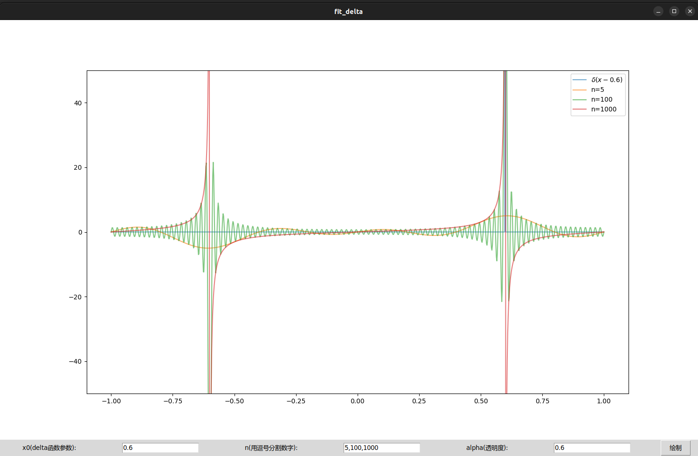

# $\delta$ 函数展开

数理方法作业15第一题

## 用本征函数组展开

用正交完备归一化的本征函数组 $\left\{\sqrt{2}\sin(n\pi x), 0<x<1, n=1,2,3\right\}$ 对 $\delta$ 函数展开有：

$$
\delta(x-x_0)=2\sum_{n=1}^\infty\sin(x_0n\pi)\sin(n\pi x), 0<x<1
$$

## 使用python绘制动态图

下图演示了级数项数 $n=1,5,10,20,50,100,200,500,1000$ 和 $\delta(x-0.6)$ 的图像。


该动画使用`python`和[`manim`](https://docs.manim.community/en/stable/index.html#)绘制

绘制代码如下：
```py
from manim import *

class Plot(Scene):
    def construct(self):
        # draw axes
        ax = Axes(
            x_range=[-1, 1, 0.2],
            y_range=[-50, 50, 10],
            axis_config={'color': BLUE},
            x_axis_config={
                'numbers_to_include': np.arange(-1, 1.01, 0.2),
            },
            y_axis_config={
                'numbers_to_include': np.arange(-50, 50.01, 100),
            },
            tips=False,
        )
        ax_label = ax.get_axis_labels()

        # draw delta(x-x0)
        x0 = 0.6
        x_vals = [-1, x0, x0, x0, 1]
        y_vals = [0, 0, 1000, 0, 0]
        delta_curve = ax.plot_line_graph(x_vals, y_vals, vertex_dot_radius=0)
        delta_label = MathTex('\\delta(x)', color=YELLOW).move_to(RIGHT*4.3+UP*3)

        # fit(x)
        def fit(x, n):
            y = x * 0
            for i in range(n):
                k = i + 1
                y += 2 * np.sin(x0 * k * np.pi) * np.sin(k * np.pi * x)
            return y

        # draw fit_curve
        n = [1, 5, 10, 20, 50, 100, 200, 500, 1000]
        def draw_fit(n):
            fit_curve_n = ax.plot(lambda x: fit(x, n), color=GREEN)
            fit_label_n = ax.get_graph_label(
                fit_curve_n, 'n='+str(n), x_val=0.2, direction=UP
            )
            self.play(Create(fit_curve_n), run_time=1)
            self.play(Create(fit_label_n), run_time=0.5)
            self.wait(2)
            self.play(FadeOut(fit_curve_n), FadeOut(fit_label_n), run_time=0.5)

        # the order of animation
        self.play(Create(ax))
        self.play(Create(ax_label), run_time=0.5)
        self.play(Create(delta_curve))
        self.play(Create(delta_label), run_time=0.5)
        for i in n:
            draw_fit(i)
        self.wait(1)
```

::: info 运行
配置好[`manim`运行环境](https://docs.manim.community/en/stable/installation.html)后，
将上面脚本命名为`scene.py`，然后在终端运行
```sh
manim -pql --format gif scene.py Plot
```
会生成该`.gif`动画。
:::

## 用python绘图(GUI交互界面)

利用`python`程序作图，脚本如下：
::: info 运行环境
运行该脚本除了安装`python`运行环境之外，
还需要安装`python`的`numpy`、`matplotlib`和`tkinter`模块才能运行。
:::
::: info 程序使用
运行程序后图像底部有三个参数可以设置，
其中参数`x0`是 $\delta$ 函数中 $x_0$ 的值，即 $\delta(x-x_0)$ ，接受数值大小 $-1<x_0<1$ ，默认为`0.6`；
参数`n`是取本征函数组的前n项并分别绘制，默认为`5,100,1000`；
参数`alpha`是绘制函数曲线的透明度，接受的数值大小 $0<alpha\le1$，默认为`0.6` 。

修改参数后点击`绘制`按键即可根据新参数重新绘图。
:::

```py
import numpy as np
import matplotlib.pyplot as plt
from matplotlib.backends.backend_tkagg import FigureCanvasTkAgg
import tkinter as Tk

# 相关参数
x0 = 0.6
l = 1
n = [5, 100, 1000]
alpha = 0.5

# 待拟合的delta函数
def delta(x, x0, l):
    err = l / 1000
    judge = np.abs(x[:]-x0)<err
    return judge * 10000

# 拟合函数
def fit(x, x0, n):
    y = x * 0
    for i in range(n):
        k = i + 1
        y += 2 * np.sin(x0 * k * np.pi) * np.sin(k* np.pi * x)
    return y

# 绘制图像
def draw(ax, x0, l, ns, alpha):
    x = np.linspace(-l, l, 1000)
    ax.plot(x, delta(x, x0, l), alpha=alpha, label='$\delta(x-$' + f'{x0:.1f}' + '$)$')
    for n in ns:
        ax.plot(x, fit(x, x0, n), alpha=alpha, label='n=' + f'{n}')
    ax.legend()
    ax.set_ylim(-50, 50)

# 接受参数重新绘图
def rplot():
    # 接受参数
    x0 = float(x0_input.get())
    str_n = str(n_input.get()).split(',')
    ns = []
    for n in str_n:
        ns.append(int(n))
    alpha = float(alpha_input.get())
    # 重置画布并绘图
    fig.clf()
    ax = fig.add_subplot(111)
    draw(ax, x0, l, ns, alpha)
    canvas.draw()

# 绘制gui界面
root = Tk.Tk()
root.title('fit_delta')
# 绘制三个参数输入框
Tk.Label(root,text='x0(delta函数参数):').grid(row=1,column=0)
x0_input=Tk.Entry(root)
x0_input.grid(row=1,column=1)
x0_input.insert(0,'0.6')
Tk.Label(root,text='n(用逗号分割数字):').grid(row=1,column=2)
n_input=Tk.Entry(root)
n_input.grid(row=1,column=3)
n_input.insert(0,'5,100,1000')
Tk.Label(root,text='alpha(透明度):').grid(row=1,column=4)
alpha_input=Tk.Entry(root)
alpha_input.grid(row=1,column=5)
alpha_input.insert(0,'0.6')
Tk.Button(root,text='绘制',command=rplot).grid(row=1,column=6,columnspan=7)
# 设置画布
fig = plt.figure(figsize=(15, 9))
canvas = FigureCanvasTkAgg(fig, master=root)
canvas.draw()
rplot()
canvas.get_tk_widget().grid(row=0, columnspan=7)    

Tk.mainloop()
```

程序运行结果如下图所示：



## 结论

1. 随着拟合项数`n`的增加，级数 $2\sum_{n=1}^\infty\sin(x_0n\pi)\sin(n\pi x)$ 在点 $x=x_0$ 附近的行为逐渐向 $\delta(x-x_0)$ 靠近。
（即当 $x\rightarrow x_0$ 时函数值趋于 $\infty$ ，当 $x$ 取其他值时函数值趋于0）

2. 但是由于本征函数组 $\left\{\sqrt{2}\sin(n\pi x), 0<x<1, n=1,2,3\right\}$ 本身的奇函数性质，
级数会在 $x=-x_0$ 处表现出跟在 $x=x_0$ 处一致的行为。

