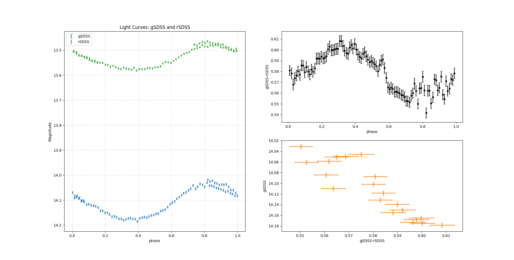

## variables

object: ZTF J210509.99+662506.8

https://simbad.cds.unistra.fr/simbad/sim-coo?Coord=21+05+10.00+%2B66+25+06.0&CooFrame=FK5&CooEpoch=2000&CooEqui=2000&CooDefinedFrames=none&Radius=10&Radius.unit=arcmin&submit=submit+query&CoordList=

- Otype: Delta Scuti Variables

### light curve

we get lightcurve_g.dat and lightcurve_r.dat using AstroImageJ.

using python to convert flux to apparent magnitude and calculating the phase, we get the magnitude-phase diagram.

then we interpolate the magnitude-phase data and apply a fixed-delta phase to obtain new mag-phase data which has a fixed phase interval.

also we can obtain gSDSS versus (gSDSS-rSDSS) diagram.



::: details `draw.py`
```py
import numpy as np
import matplotlib.pyplot as plt
from scipy import interpolate

# File paths
file_g = "codes/lightcurve_g.dat"
file_r = "codes/lightcurve_r.dat"

# the period of the variable star
P = 0.0575814
T0 = 2457000.0  # Reference time in Julian Date

def load_lightcurve(filename):
    data = np.loadtxt(filename, comments="#")
    jd = data[:, 0]
    E = (jd - T0) / P
    phase = E - np.floor(E)
    rel_flux_T1 = data[:, 1]
    err_T1 = data[:, 2]
    sky_T1 = data[:, 3]
    err_C2 = data[:, 4]
    sky_C2 = data[:, 5]
    err_C3 = data[:, 6]
    sky_C3 = data[:, 7]
    return phase, rel_flux_T1, err_T1, sky_T1, err_C2, sky_C2, err_C3, sky_C3

# Load data
phase_g, rel_flux_T1_g, err_T1_g, sky_T1_g, err_C2_g, sky_C2_g, err_C3_g, sky_C3_g = load_lightcurve(file_g)
phase_r, rel_flux_T1_r, err_T1_r, sky_T1_r, err_C2_r, sky_C2_r, err_C3_r, sky_C3_r = load_lightcurve(file_r)

# the magnitude of the compasion stars
mag_C1_g = 14.04419994354248
mag_C2_g = 15.072400093078613
mag_C1_r = 13.343000411987305
mag_C2_r = 13.482000350952148

# convert flux to magnitude
def convert_flux_to_magnitude(flux, mag_C1, mag_C2):
    a = -np.log(2.512**(-mag_C1)+2.512**(-mag_C2))/np.log(2.512)
    return a-2.5*np.log10(flux)

mag_g = convert_flux_to_magnitude(rel_flux_T1_g, mag_C1_g, mag_C2_g)
mag_r = convert_flux_to_magnitude(rel_flux_T1_r, mag_C1_r, mag_C2_r)

# calculate the error of magnitude
def cal_err_mag(err_T1, sky_T1, err_C2, sky_C2, err_C3, sky_C3):
    err_mag = 2.5 * np.log10( 1 + np.sqrt( err_T1**2/sky_T1**2 + (err_C2**2+err_C3**2)/(sky_C2+sky_C3)**2 ) )
    return err_mag

err_g = cal_err_mag(err_T1_g, sky_T1_g, err_C2_g, sky_C2_g, err_C3_g, sky_C3_g)
err_r = cal_err_mag(err_T1_r, sky_T1_r, err_C2_r, sky_C2_r, err_C3_r, sky_C3_r)

# sort the (phase, mag, err) arrays according to phase
def sort_arrays(phase, mag, err):
    combined = np.vstack((phase, mag, err))
    sorted_indices = np.argsort(combined[0])
    return combined[:, sorted_indices]

data_g = sort_arrays(phase_g, mag_g, err_g)
data_r = sort_arrays(phase_r, mag_r, err_r)

# interpolate the data
phase_fixed = np.linspace(0.01, 0.99, 100)
def interpolate_data(data):
    func = interpolate.interp1d(data[0], data[1], kind='linear')
    func_err = interpolate.interp1d(data[0], data[2], kind='linear')
    return func(phase_fixed), func_err(phase_fixed)

mag_g_fixed, err_g_fixed = interpolate_data(data_g)
mag_r_fixed, err_r_fixed = interpolate_data(data_r)

# calculate the difference between two filters
dis_fixed = mag_g_fixed - mag_r_fixed
err_dis_fixed = err_g_fixed + err_r_fixed

# Plot
## the two light curves
ax1 = plt.subplot(121)
ax1.errorbar(phase_g, mag_g, yerr=err_g, fmt='o', label='gSDSS', color='tab:blue', markersize=2, capsize=2)
ax1.errorbar(phase_r, mag_r, yerr=err_r, fmt='o', label='rSDSS', color='tab:green', markersize=2, capsize=2)
ax1.invert_yaxis()
ax1.set_xlabel("phase")
ax1.set_ylabel("Magnitude")
ax1.set_title("Light Curves: gSDSS and rSDSS")
ax1.legend()
ax1.grid(True, linestyle='--', alpha=0.5)
## the difference between two filters
ax2 = plt.subplot(222)
ax2.errorbar(phase_fixed, dis_fixed, yerr=err_dis_fixed, fmt='o', color='k', markersize=4, capsize=2)
ax2.set_xlabel("phase")
ax2.set_ylabel("gSDSS-rSDSS")
## the H-R diagram
ax3 = plt.subplot(224)
ax3.errorbar(dis_fixed[::5], mag_g_fixed[::5], xerr=err_dis_fixed[::5], yerr=err_g_fixed[::5], fmt='*', color='tab:orange', markersize=4, capsize=2)
# ax3.errorbar(dis_fixed, mag_g_fixed, xerr=err_dis_fixed, yerr=err_g_fixed, fmt='*', color='tab:orange', markersize=4, capsize=2)
ax3.invert_yaxis()
ax3.set_xlabel("gSDSS-rSDSS")
ax3.set_ylabel("gSDSS")

plt.show()
```
:::

### H-R diagram

get star data from [https://catalogs.mast.stsci.edu/panstarrs/](https://catalogs.mast.stsci.edu/panstarrs/)

download the magnitude in g and r filter

plot the g versus (g-r) diagram as the H-R diagram of this area


::: details `H-R.py`
```py
import numpy as np
import matplotlib.pyplot as plt

file = open('H-R/PS-7_25_2025.dat', 'r')
mag_g, mag_r = [], []
for line in file:
    parts = line.split(',')
    if parts[3] == '-999.0' or parts[4] == '-999.0\n':
        continue
    mag_g.append(float(parts[3]))
    mag_r.append(float(parts[4]))
file.close()
mag_g = np.array(mag_g)
mag_r = np.array(mag_r)

g_r = mag_g - mag_r

plt.scatter(g_r, mag_g, color='orange', marker='*', s=10)
plt.gca().invert_yaxis()  # Invert y-axis for magnitude
plt.xlabel('g-r')
plt.ylabel('g')
plt.title('Hertzsprung-Russell Diagram')
plt.grid(True, linestyle='--', alpha=0.5)
plt.show()
```
:::
