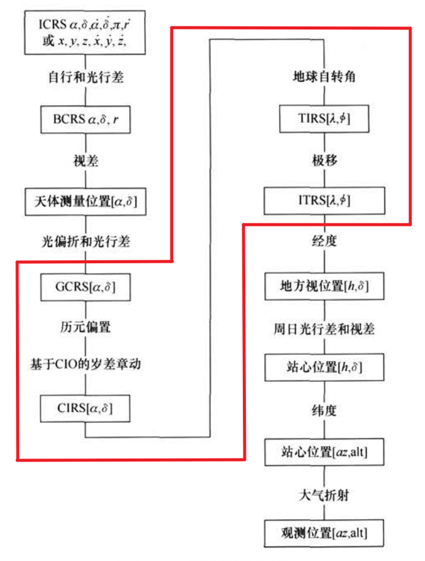
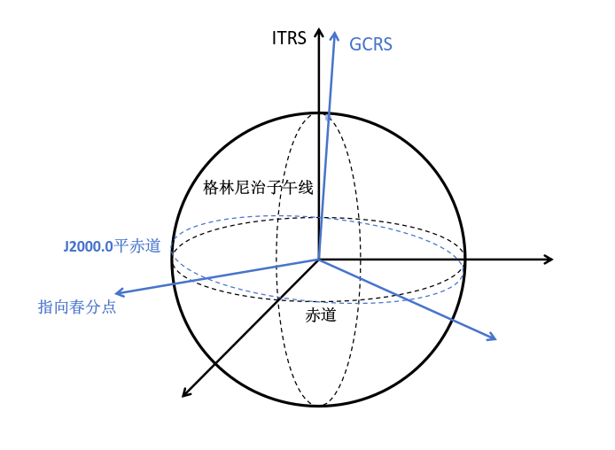
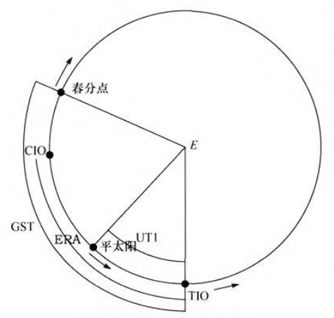
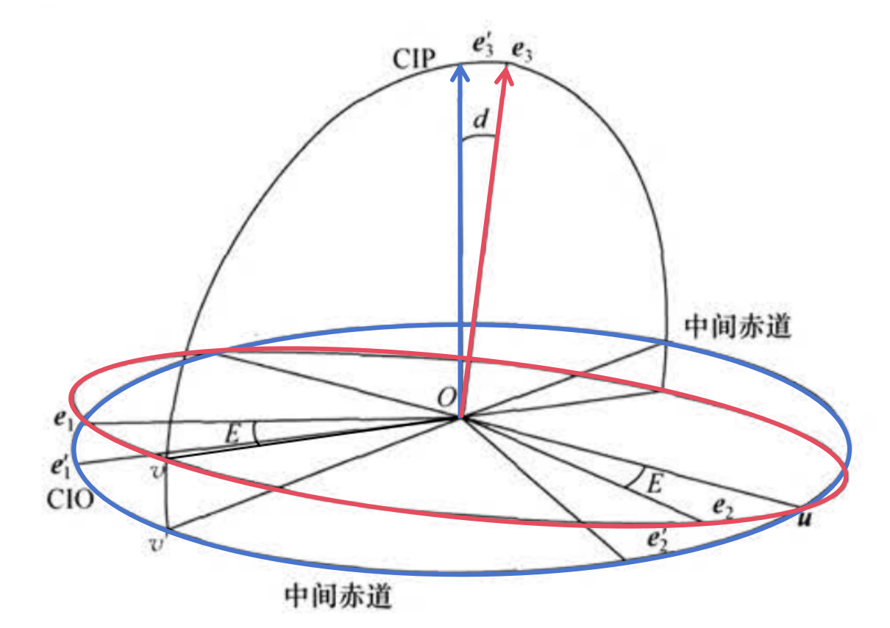
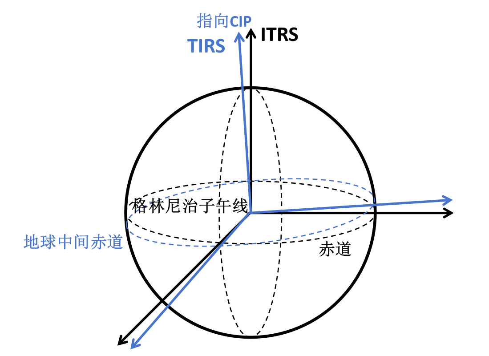
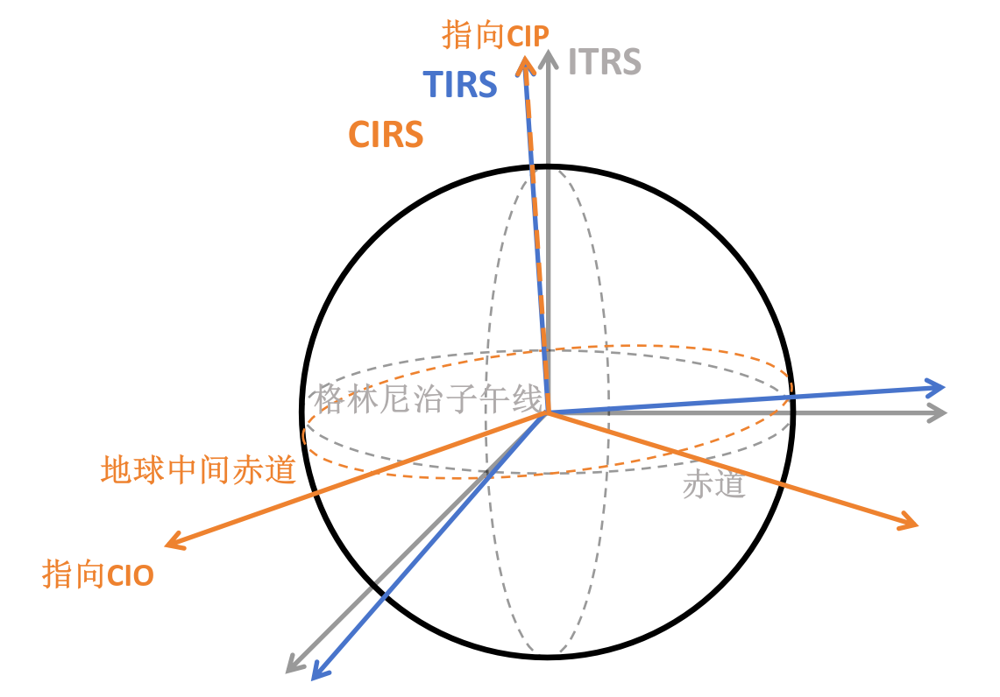
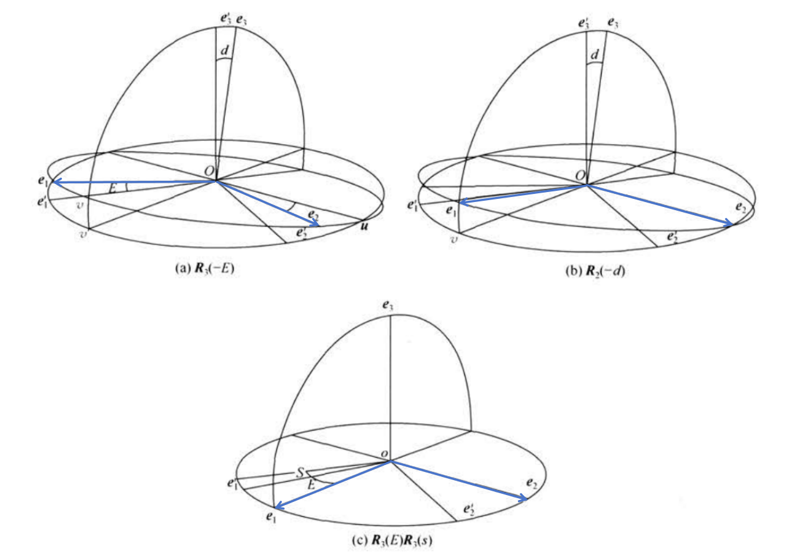
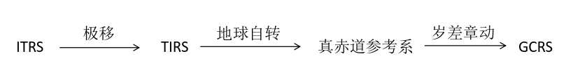

# 利用 CIO 进行 ITRS-GCRS 变换

## 总览

天体测量变换链：

## 参考系

确定一个三维空间参考系需要三个要素：
1. 原点
2. 基本平面（$xy$平面）
3. 基本方向（$x$方向）

### 两个目标参考系

- 地心天球参考系 (geocentric celestial reference system, GCRS)
- 国际地球参考系 (international terrestial reference system, ITRS)

### “中间参考系”

由于地球进动，地球自转轴在天球参考系 CRS 中具有瞬时性，天极和天赤道也一样。《IERS规范2003》称具有瞬时性的天极和天赤道为：
- 中间赤道
- 天球中间极 (celestial intermediate pole, CIP)

- 天球中间零点 (celestial intermediate origin, CIO) ：相对天球参考系没有转动
- 地球中间零点 (terrestrial intermediate origin, TIO) ：相对地球参考系没有转动

在天球参考系中观察，中间赤道与 CIO 固结，称为天球中间赤道，TIO 沿着赤道逆时针方向运动，周期为一恒星日。反之，在地球参考系中观察时，中间赤道与 TIO 固结，称为地球中间赤道，CIO 以同样周期沿赤道顺时针方向运动。
- 地球自转角 (earth rotating angle, ERA) ：CIO 和 TIO 之间的夹角。
- 格林尼治恒星时 (Greenwich sidereal time, GST) ：春分点和 TIO 之间的夹角。

- 真赤道系： 以真春分点为基本方向，与之一同转动的赤道就是真赤道
- 天球中间参考系 (celestial intermediate reference system, CIRS) ：以 CIO 为基本方向
- 地球中间参考系 (terrestrial intermediate reference system, TIRS) ：以 TIO 为基本方向
- 平赤道系： 只考虑岁差不考虑章动的情况，相当于真赤道坐标系在一段时期内的平均位置，相应的基本平面和基本点为平赤道和平春分点

### 确定 CIO

通过分析中间极和中间赤道在 GCRS 中的运动来确定天球无转动零点 CIO 

图中 $(\boldsymbol{e}_1,\boldsymbol{e}_2,\boldsymbol{e}_3)$ 为 GCRS， $(\boldsymbol{e}_1',\boldsymbol{e}_2',\boldsymbol{e}_3')$ 为 CIRS 。$\boldsymbol{u},\boldsymbol{v},\boldsymbol{v}'$ 分别为交线和投影线向量， CIP 向量 $\boldsymbol{e}_3'$ 的空间位置由经角 $E=<\boldsymbol{e}_1,\boldsymbol{v}>$ 和余纬角 $d=<\boldsymbol{e}_3,\boldsymbol{e}_3'>$ 确定，有
$$
\boldsymbol{e}_3=\cos d\boldsymbol{e}_3'-\sin d\boldsymbol{v}'
$$

故中间系绕原点的转动总角速度向量为
$$
\boldsymbol{\omega}=\dot{E}\boldsymbol{e}_3+\dot{d}\boldsymbol{u}
$$
可以分解为
$$
\boldsymbol{\omega}=\dot{E}\cos d\boldsymbol{e}_3'+(-\dot{E}\sin d\boldsymbol{v}'+\dot{d}\boldsymbol{u})
$$

可以看出此时 $\boldsymbol{e}_1'$ 随天球中间参考系一同运动，此即我们要找的无转动零点 CIO 。

在历元 $t_0$ 时，$\boldsymbol{v}'$ 与 $\boldsymbol{e}_1',\boldsymbol{e}_1$ 重合，随后以角速度 $\dot{E}\cos d$ 沿中间赤道运动。故
$$
<\boldsymbol{e}_1',\boldsymbol{v}'>=\int_{t_0}^t\cos d\dot{E}\mathrm{d}t=E+\int_{t_0}^t(\cos d-1)\dot{E}\mathrm{d}t
$$
记天球中间零点定位角
$$
s=\int_{t_0}^t(\cos d-1)\dot{E}\mathrm{d}t+s_0
$$
则 $<\boldsymbol{e}_1',\boldsymbol{v}'>=E+s$ 

式中，常数 $s_0$ 取决于初值，如果忽略历元偏置和章动则为零。

## 参考系变换

### ITRS-TIRS

$$
[\mathrm{TIRS}]=\boldsymbol{W}(t)[\mathrm{ITRS}]
$$

### TIRS-CIRS

$$
[\mathrm{CIRS}]=\boldsymbol{R}_z(-ERA)[\mathrm{TIRS}] 
$$

### CIRS-GCRS

CIO 变换：
$$
\boldsymbol{Q}(t)=\boldsymbol{R}_3(-E)\boldsymbol{R}_2(-d)\boldsymbol{R}_3(E)\boldsymbol{R}_3(s)
$$
$$
[\mathrm{GCRS}]=\boldsymbol{Q}(t)[\mathrm{CIRS}]
$$

### 综合

$$
[\mathrm{GCRS}]=\boldsymbol{Q}(t)\boldsymbol{R}_z(-ERA)\boldsymbol{W}(t)[\mathrm{ITRS}]
$$

## 总结

对比利用春分点和 CIO 两种变换方法：

- 春分点：

$$
[\mathrm{GCRS}]=\boldsymbol{Q}_e(t)\boldsymbol{R}_z(-GST)\boldsymbol{W}(t)[\mathrm{ITRS}]
$$

- CIO：

$$
[\mathrm{GCRS}]=\boldsymbol{Q}(t)\boldsymbol{R}_z(-ERA)\boldsymbol{W}(t)[\mathrm{ITRS}]
$$

---

参考：

[1] 李广宇. 天体测量和天体力学基础[M]. 北京: 科学出版社, 2015. 

链接：

[演示slide](/lecture/cio/slide.html#/)
::: info 注
点击链接后若出现404刷新一下即可。
:::

