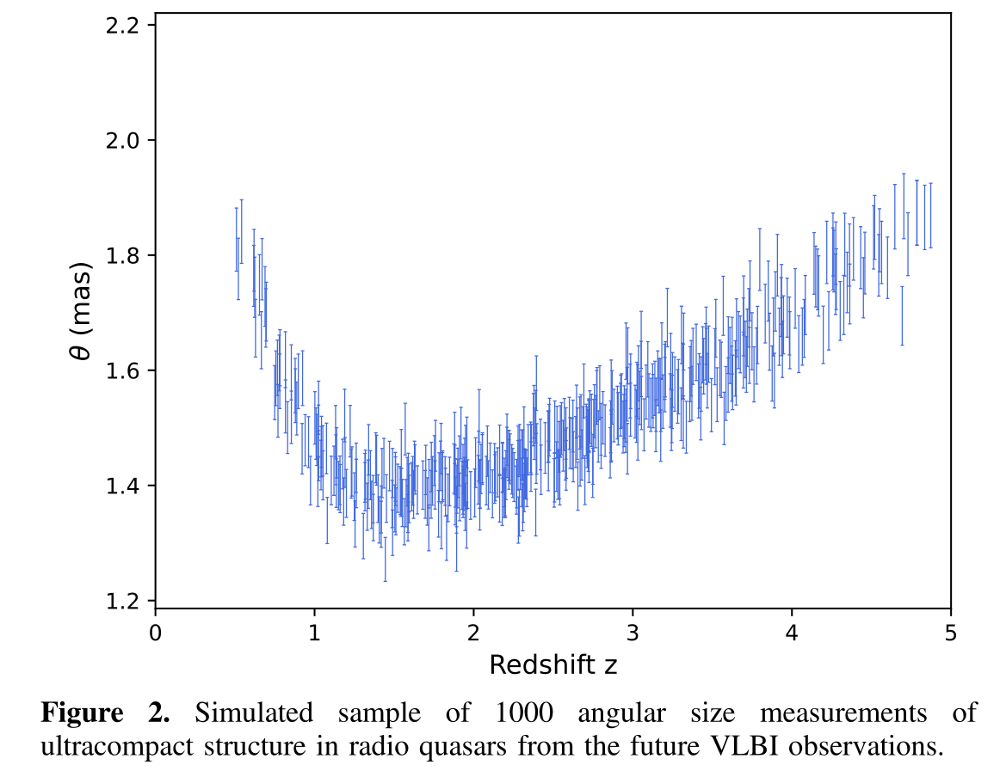
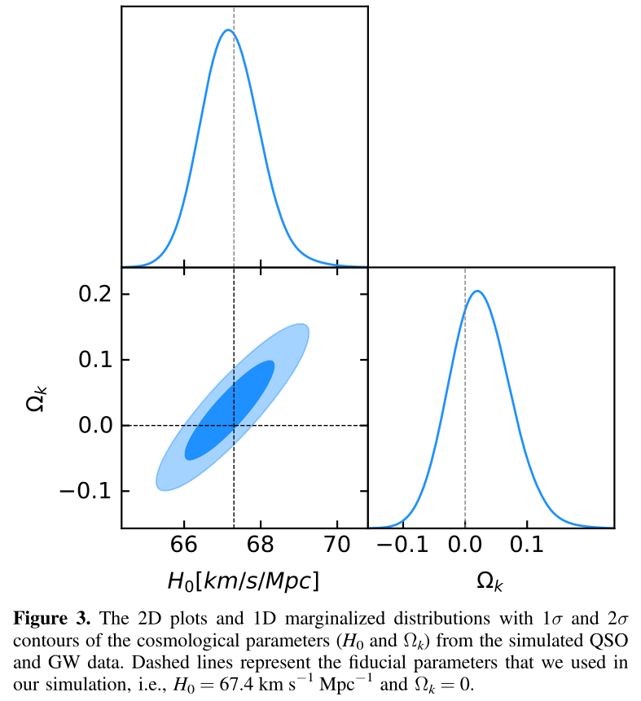
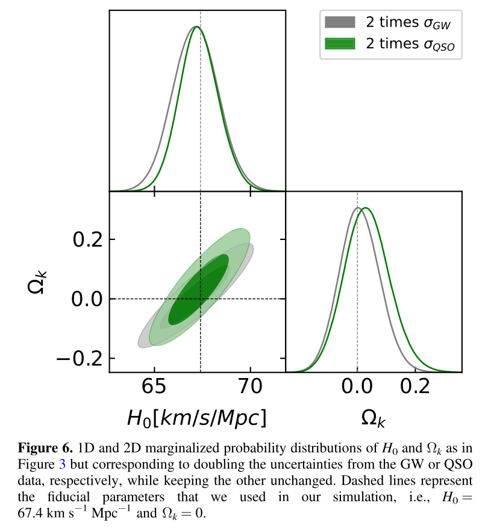

# Model-independent Way to Determine the Hubble Constant and the Curvature from the Phase Shift of Gravitational Waves with DECIGO

This is a note on paper:
[https://doi.org/10.3847/2041-8213/ad3553](https://doi.org/10.3847/2041-8213/ad3553)

## Introduction

- Hubble Tension:

CMB v.s. Supernova

- the spatial curvature of the Universe:

  1. pure CMB data: closed Universe $\Omega_k=-0.044^{+0.018}_{-0.015}$
  2. combination of Planck lensing data and low redshift baryon acoustic oscillations (BAOs): flat Universe $\Omega_k=0.0007\pm0.0019$

## Methodology

1. traditionally:
   
   model -> Friedman equation
   $$
   E(z)\equiv\left(\frac{H(z)}{H_0}\right)^2=\Omega_{m}(1+z)^3+\Omega_{k}(1+z)^2+\Omega_{\Lambda}
   $$
   -> theoretical angular diameter distance $D_A^{\text{th}}(z;\boldsymbol{p})$
   $$
   D_A^{\text{th}}(z;\boldsymbol{p})=\left\{\begin{array}{ll}
        \displaystyle\frac{D_H}{(1+z)\sqrt{|\Omega_k}|}\sinh^{-1}\left(\sqrt{|\Omega_k|}\int_0^z\frac{\mathrm{d}z'}{E(z')^{1/2}}\right) & \text{for}\ \Omega_k>0 \\
        \displaystyle\frac{D_H}{(1+z)}\int\frac{\mathrm{d}z'}{E(z')^{1/2}} & \text{for}\ \Omega_k=0 \\
        \displaystyle\frac{D_H}{(1+z)\sqrt{|\Omega_k}|}\sin^{-1}\left(\sqrt{|\Omega_k|}\int_0^z\frac{\mathrm{d}z'}{E(z')^{1/2}}\right) & \text{for}\ \Omega_k<0 \\
   \end{array}\right.
   $$
   here $\boldsymbol{p}=(\Omega_m,\Omega_k,\Omega_\Lambda)$
   -> get observed distance $D_A^{\text{obs}}(z)$
   -> obtain cosmological parameters $\boldsymbol{p}$ by chi-square-minimized (Markov Chain Monte Carlo method)

2. this work:

   gravitational wave (GW)'s phase shift
   -> acceleration parameter $X(z)$($H(z)$)
   $$
   X(z)\equiv\frac{H_0}{2}\left(1-\frac{H(z)}{(1+z)H_0}\right)
   $$
   -> using artificial neural network (ANN) to get function ($z\rightarrow X(z)$)
   -> theoretical angular diameter distance $D_A^{\text{th}}(z;\boldsymbol{p})$
   $$
   D_A^{\text{th}}(z;\boldsymbol{p})=\left\{\begin{array}{ll}
        \displaystyle\frac{D_H}{(1+z)\sqrt{|\Omega_k}|}\sinh^{-1}\left(\sqrt{|\Omega_k|}\frac{H_0}{1+z}\int_0^z\frac{\mathrm{d}z'}{H_0-2X(z')}\right) & \text{for}\ \Omega_k>0 \\
        \displaystyle\frac{c}{(1+z)^2}\int\frac{\mathrm{d}z'}{H_0-2X(z')} & \text{for}\ \Omega_k=0 \\
        \displaystyle\frac{D_H}{(1+z)\sqrt{|\Omega_k}|}\sin^{-1}\left(\sqrt{|\Omega_k|}\frac{H_0}{1+z}\int_0^z\frac{\mathrm{d}z'}{H_0-2X(z')}\right) & \text{for}\ \Omega_k>0 \\
   \end{array}\right.
   $$
   here $\boldsymbol{p}=(H_0,\Omega_k)$

### GW

- The gravitational waveform without cosmic acceleration reads
  $$
  \tilde{h}(f)=\frac{\sqrt{3}}{2}\mathcal{A}f^{-7/6}e^{i\Psi(f)}\left[\frac{5}{4}A_{\text{pol},\alpha}(t(f))\right]e^{-i(\varphi_{\text{pol},\alpha}+\varphi_D)}
  $$

- gravitational waveform including the effects of the cosmic acceleration reads
  $$
  \tilde{h}(f)_{\text{acc}}=\tilde{h}(f)e^{i\Psi_{\text{acc}}(f)}
  $$
  where
  $$
  \Psi_{\text{acc}}(f)=-\Psi_N(f)\frac{25}{768}X(z)\mathcal{M}_z x^{-4}
  $$
  The acceleration parameter $X(z)$ is defined as
  $$
  X(z)\equiv\frac{H_0}{2}\left(1-\frac{H(z)}{(1+z)H_0}\right)
  $$
  $$
  \Rightarrow E(z)^{1/2}=\frac{H(z)}{H_0}=(H_0-2X(z))(1+z)
  $$

- the waveform $\tilde{h}(f)_{\text{acc}}$ depends on 11 parameters:
  $$
  \theta^i=(\ln\mathcal{M}_z,\ln\eta,\beta,t_c,\phi_c,\bar{\theta}_S,\bar{\phi}_S,\bar{\theta}_L,\bar{\phi}_L,D_L,X)
  $$

- set $m_1=m_2=1.4M_\odot$ and take $t_c=\phi_c=\beta=0$ for each fiducial redshift $z$, randomly generate $10^4$ sets of $(\bar{\theta}_S,\bar{\phi}_S,\bar{\theta}_L,\bar{\phi}_L)$

  using a flat $\Lambda$CDM model with the cosmological parameters derived by Planck 2018 measurements to generate datas

- divide sample into 50 bins,

  train the ANN on the simulated $X(z)$ data and predicte the $X(z)$ at other redshifts.

- ANN: input redshift $z$,

  output corresponding cosmic acceleration parameter $X(z)$ and its respective uncertainty $\sigma_X$ at that redshift.

### QSOs

quasi-stellar objects (QSOs)

- the characteristic angular size of a distant radio quasar is
  $$
  \theta=\frac{2\sqrt{-\ln\Gamma\ln 2}}{\pi B}
  $$
  $B$: the interferometer baseline

  $\Gamma=S_c/S_t$: the ratio between the total and correlated flux densities

  The angular size of the compact structure in radio QSOs is
  $$
  \theta(z)=\frac{l_m}{D_A(z;\boldsymbol{p})}
  $$
  $l_m$: the linear size scaling factor describing the apparent distribution of radio brightness within the core

- Taking $l_m=11.03\pm0.25\text{pc}$ and following the redshift distribution of QSOs from Palanque-Delabrouille et al.([2016](https://doi.org/10.1051/0004-6361/201527392e))
  
  simulate 1000 "angular size-redshift" data, assume the "measured" angular sizes follow a Gaussian distribution $\theta_{\text{means}}=N(\theta_\text{fid},\sigma_\theta)$, $\theta_{\text{fid}}$ is obtained from equation above under same model in GW.

## Results and Discussion

1. the best-fit values of $H_0$ and $\Omega_k$

- using the Markov Chain Monte Carlo method to minimize the $\chi^2$ objective function:
  $$
  \chi^2=\sum_{i=1}^{1000} \frac{[D_{A,i}^{\text{th}}(z;\boldsymbol{p})-D_{A,i}^{\text{obs}}(z)]^2}{\sigma_{D_{A,i}^{\text{th}}}^2+\sigma_{D_{A,i}^{\text{obs}}}^2}
  $$
  here GW -> $X(z)$ -> $D_{A,i}^{\text{th}}(z;\boldsymbol{p})$

  QSOs -> $D_{A,i}^{\text{obs}}(z)$

- result:
  $$
  H_0=67.19_{-0.74}^{+0.77}\  \text{km}\ \text{s}^{-1}\ \text{Mpc}^{-1},\quad \Omega_k=0.022_{-0.046}^{+0.051}
  $$
  at $68.3\%$ confidence level.

  compare to used model $H_0=67.4\ \text{km}\ \text{s}^{-1}\ \text{Mpc}^{-1}$ and $\Omega_k=0$

2. the uncertainties of the best-fit parameters as a function of QSO sample size $N$

3. the uncertainties related to GW signals and QSOs

## Conclusion

1. a cosmological model-independent method to determine the Hubble constant and curvature parameter simultaneously based on GW from DECIGO and QSOs from VLBI

DECIGO -> GW -> phase shift -> $H(z)$ -> $D_{A,i}^{\text{th}}(z;\boldsymbol{p})$

VLBI -> QSOs -> "angular size-distance" -> $D_{A,i}^{\text{obs}}(z)$

2. assume a fiducial cosmology to simulate GW and QSOs datas:
   
$N=1000$ QSOs -> $\sigma_{H_0}=0.75\ \text{km}\ \text{s}^{-1}\ \text{Mpc}^{-1}$ and $\sigma_{\Omega_k}=0.048$ achieve $1\%$ precision

the precision of $H_0$ with a fixed prior on $\Omega_k$ can reach $0.5\%$

the performance of the method on QSO samples of different sizes (from $N=50$ to $N=1000$): not a simple $1/\sqrt{N}$ but saturate at $N=500$ (unsolved)

3. potential ways to improve results:

higher angular resolution and lower statistical and systematic uncertainty from QSOs from VLBI

datas from other astronomical probes such SNe Ia and BAOs
