# disk-satellite interaction

## basic conception

1. epicyclic frequency:

   a 'Rayleigh discriminant' to examine the 'boundaries' of an accretion disc with differential rotation $\Omega$ is given by
   $$
   \kappa^2=\frac{2\Omega}{R}\frac{\mathrm{d}}{\mathrm{d}R}(R^2\Omega)
   $$
   where $R$ is the radial coordinate.

   ::: info derivation (Lagrange's equation & perturbation method)
   An astrophysical disk can be modeled as a fluid with negligible mass compared to the central object (e.g. a star) and with negligible pressure. We can suppose an axial symmetry such that $\Phi(r,z)=\Phi(r,-z)$.

   The Lagrangian in cylindrical coordiantes is
   $$
   L=\frac{m}{2}(\dot{r}^2+r^2\dot{\theta}^2+\dot{z}^2)-m\Phi
   $$

   Then we obtain the Lagrange's equation:
   $$
   \begin{align}
   \ddot{r}-r\dot{\theta}^2&=-\partial_r\Phi \\
   r\ddot{\theta}+2\dot{r}\dot{\theta}&=0 \\
   \ddot{z}&=-\partial_z\Phi
   \end{align}
   $$

   The second line implies that the specific angular momentum is conserved. We can then define an effective potential $\displaystyle\Phi_{eff}=\Phi+\frac{1}{2}r^2\dot{\theta}^2=\Phi+\frac{h^2}{2r^2}$ and so:
   $$
   \begin{align}
   \ddot{r}&=-\partial_r\Phi_{eff} \\
   \ddot{z}&=-\partial_z\Phi_{eff}
   \end{align}
   $$

   We can apply a small perturbation $\delta\boldsymbol{r}=\delta r\boldsymbol{e}_r+\delta z\boldsymbol{e}_z$ to the circular orbit:
   $$
   \boldsymbol{r}=r_0\boldsymbol{e}_r+\delta\boldsymbol{r}
   $$

   So,
   $$
   \ddot{\boldsymbol{r}}+\delta\ddot{\boldsymbol{r}}=-\nabla\Phi_{eff}(\boldsymbol{r}+\delta\boldsymbol{r})\approx-\nabla\Phi_{eff}(\boldsymbol{r})-\partial_r^2\Phi_{eff}(\boldsymbol{r})\delta r-\partial_z^2\Phi_{eff}(\boldsymbol{r})\delta z
   $$

   And thus:
   $$
   \begin{align}
   \delta\ddot{r}=-\partial_r^2\Phi_{eff}\delta_r=-\Omega_r^2\delta r \\
   \delta\ddot{z}=-\partial_z^2\Phi_{eff}\delta_z=-\Omega_z^2\delta z
   \end{align}
   $$

   We then note
   $$
   \kappa^2=\Omega_r^2=\partial_r^2\Phi_{eff}=\partial_r^2\Phi+\frac{3h^2}{r^4}
   $$

   In a circular orbit $h_c^2=r^3\partial_r\Phi$, $\displaystyle\Omega_c^2=\frac{1}{r}\partial_r\Phi$, finally yields:
   $$
   \kappa^2=\partial_r^2\Phi+\frac{3}{r}\partial_r\Phi=4\Omega_c^2+2r\Omega_c\frac{\mathrm{d}\Omega_c}{\mathrm{d}r}=\frac{2\Omega_c}{r}\frac{\mathrm{d}}{\mathrm{d}r}(r^2\Omega_c)
   $$
   :::

2. mean-motion resonance (MMR):

   A mean-motion resonance occurs when multiple bodies have orbital periods or mean motions (orbital frequencies) that are simple integer ratios of each other.

## GT79

some key points from [GT79](/read/goldreich-tremaine-1979.pdf) *the excitation of density waves at the Lindblad and corotaion resonances by an external potential*

- main content:
  
  the linear response of a differentially rotating two-dimensional gas disk to a rigidly rotating external potential.

### II. Basic Equations

- equation (3): the unperturbed angular velocity $\Omega(r)$
  $$
  \Omega^2(r)=\frac{1}{r}\frac{\mathrm{d}}{\mathrm{d}r}(\varphi_0+\eta_0)\tag{3}
  $$

  ::: info derivation (enthalpy represents pressure)
  the Eular equation in radial direction of cylindrical coordinates for stable axial symmetry dics ( $\partial/\partial t=0,\partial/\partial \theta=0$ ):
  $$
  -\frac{v_\theta^2}{r}=-\frac{\partial\Phi}{\partial r}-\frac{1}{\rho}\frac{\partial p}{\partial r}
  $$

  define the two-dimensional enthalpy $\eta$
  $$
  \mathrm{d}\eta=\frac{\mathrm{d}p}{\sigma}\Rightarrow\frac{\mathrm{d}\eta}{\mathrm{d}r}=\frac{1}{\sigma}\frac{\mathrm{d}p}{\mathrm{d}r}
  $$
  where $\sigma$ is the surface mass density.

  so we have
  $$
  -r\Omega^2=-\frac{\mathrm{d}\varphi}{\mathrm{d}r}-\frac{\mathrm{d}\eta}{\mathrm{d}r}
  $$
  $$
  \Rightarrow \Omega^2(r)=\frac{1}{r}\frac{\mathrm{d}}{\mathrm{d}r}(\varphi_0+\eta_0)
  $$
  :::

- the linear perturbation equations (5,6,7,8)
  $$
  \begin{align}
  \frac{\partial\boldsymbol{v}_1}{\partial t}+(\boldsymbol{v}_0\cdot\nabla)\boldsymbol{v}_1+(\boldsymbol{v}_1\cdot\nabla)\boldsymbol{v}_0&=-\nabla(\varphi_1+\varphi_1^D+\eta_1),\tag{5} \\
  \frac{\partial\sigma_1}{\partial t}+\nabla\cdot(\sigma_0\boldsymbol{v}_1)+\nabla\cdot(\sigma_1\boldsymbol{v}_0)&=0,\tag{6} \\
  \eta_1&=c_0^2(\sigma_1/\sigma_0),\tag{7} \\
  \nabla^2\varphi_1^D&=4\pi G\sigma_1\delta(z),\tag{8}
  \end{align}
  $$
  where $\boldsymbol{v}_0=r\Omega(r)\hat{e}_\theta$ and $\delta(z)$ is the Dirac delta function.

  ::: info derivation
  in brief,
  |Eq.|derivation|
  |:--:|:--:|
  |(5,6)|the linear perturbation method|
  |(7)|the defination of enthalpy|
  |(8)|the Poisson's equation of gravitational potential|

  1. denoting the unpertubated gravitational potential $\phi_0$, surface density $\sigma_0$, the Euler equation and continuity equation reads,
  $$
  \frac{\partial\boldsymbol{v}_0}{\partial t}=(\boldsymbol{v}_0\cdot\nabla)\boldsymbol{v}_0=\nabla(\varphi_0+\eta_0)
  $$
  $$
  \frac{\partial\sigma_0}{\partial t}+\nabla(\sigma_0\boldsymbol{v}_0)=0
  $$
  then we introduce the external perturbation potential $\varphi_1$ and surface density perturbation $\sigma_1$ which generate additional potential $\varphi_1^D$, hence we obtain the pertubation equations (5,6) by substituing $\boldsymbol{v}_0+\boldsymbol{v}_1$,$\varphi_0+\varphi_1+\varphi_1^D$,$\eta_0+\eta_1$ to $\boldsymbol{v}_0$,$\varphi_0$,$\eta_0$
  $$
  \frac{\partial\boldsymbol{v}_1}{\partial t}+(\boldsymbol{v}_0\cdot\nabla)\boldsymbol{v}_1+(\boldsymbol{v}_1\cdot\nabla)\boldsymbol{v}_0=-\nabla(\varphi_1+\varphi_1^D+\eta_1)\tag{5}
  $$
  $$
  \frac{\partial\sigma_1}{\partial t}+\nabla\cdot(\sigma_0\boldsymbol{v}_1)+\nabla\cdot(\sigma_1\boldsymbol{v}_0)=0\tag{6}
  $$
  2. from the paper, we know the sound speed $c_0$ satisfies (Eq.1 & 2)
  $$
  c_0^2=\frac{\mathrm{d}p_0}{\mathrm{d}\sigma_0}=\frac{\mathrm{d}}{\mathrm{d}\sigma_0}K\sigma_0^\gamma=K\gamma\sigma_0^{\gamma-1}
  $$
  with the defination of enthalpy $\eta$
  $$
  \eta=\int\frac{\mathrm{d}p}{\sigma}=\int\frac{1}{\sigma}\frac{\mathrm{d}p}{\mathrm{d}\sigma}\mathrm{d}\sigma=\int\frac{c^2}{\sigma}\mathrm{d}\sigma=\int\frac{K\gamma\sigma^{\gamma-1}}{\sigma}\mathrm{d}\sigma=\frac{K\gamma}{\gamma-1}\sigma^{\gamma-1}
  $$
  $$
  \Rightarrow(\eta_0+\eta_1)=\frac{K\gamma}{\gamma-1}(\sigma_0+\sigma_1)^{\gamma-1}=\frac{K\gamma}{\gamma-1}\left[\sigma_0^{\gamma-1}+(\gamma-1)\sigma_0^{\gamma-2}\sigma_1+\mathcal{O}(\sigma_1^2)\right]
  $$
  $$
  \Rightarrow \eta_1=K\gamma\sigma_0^{\gamma-2}\sigma_1
  $$
  $$
  \Rightarrow\eta_1=c_0^2(\sigma_1/\sigma_0)\tag{7}
  $$
  3. as we mention at 1., the additional potential $\varphi_1^D$ is arised by the surface density pertubation $\sigma_1$, so
  $$
  \nabla^2\varphi_1^D=4\pi G\sigma_1\delta(z)\tag{8}
  $$
  this is the Poisson's equation of the gravitational potential.
  :::

- the response of the disk to $\varphi_1$ is completely described by equation (7,8,13)
  $$
  \begin{multline}
  \left\{\frac{\mathrm{d}^2}{\mathrm{d}r^2}+\left[\frac{\mathrm{d}}{\mathrm{d}r}\ln\left(\frac{\sigma r}{D}\right)\right]\frac{\mathrm{d}}{\mathrm{d}r}+\frac{2m\Omega}{r(m\Omega-\omega)}\left[\frac{\mathrm{d}}{\mathrm{d}r}\ln\left(\frac{\sigma\Omega}{D}\right)\right]-\frac{m^2}{r^2}\right\} \\
  (\varphi_1+\varphi_1^D+\eta_1)=\frac{D\eta_1}{c^2}\tag{13}
  \end{multline}
  $$
  where the subscripts on $\sigma_0$ and $c_0$ have been dropped.

  where $D=\kappa^2-(m\Omega-\omega)^2$

  ::: info derivation
  in brief, substitute the component form of equation (5) and equation (7) into the continuity equation (6).

  1. the component form of momentum equation (5):

     write each perturbation variable $X$ in the form $X=X(r)\exp\ i(m\theta-\omega t)$, and denote $\boldsymbol{v}_1=u_1\hat{e}_r+v_1\hat{e}_\theta$
 
     - $\dfrac{\partial\boldsymbol{v}_1}{\partial t}$
     $$
     \frac{\partial\boldsymbol{v}_1}{\partial t}=-i\omega\boldsymbol{v}_1=-i\omega u_1\hat{e}_r-i\omega v_1\hat{e}_\theta
     $$
     - $(\boldsymbol{v}_0\cdot\nabla)\boldsymbol{v}_1$
     $$
     \left\{\begin{array}{l}
     \boldsymbol{v}_0\cdot\nabla=r\Omega\hat{e}_\theta\cdot\left(\dfrac{\partial}{\partial r}\hat{e}_r+\dfrac{1}{r}\dfrac{\partial}{\partial\theta}\hat{e}_\theta\right)=\Omega\dfrac{\partial}{\partial\theta} \\
     \dfrac{\partial\boldsymbol{v}_1}{\partial \theta}=\dfrac{\partial u_1}{\partial\theta}\hat{e}_r+u_1\dfrac{\partial\hat{e}_r}{\partial\theta}+\dfrac{\partial v_1}{\partial\theta}+v_1\dfrac{\partial\hat{e}_\theta}{\partial\theta}=(imu_1-v_1)\hat{e}_r+(u_1+imv_1)\hat{e}_\theta
     \end{array}\right.
     $$
     $$
     \Rightarrow (\boldsymbol{v}_0\cdot\nabla)\boldsymbol{v}_1=\Omega\dfrac{\partial\boldsymbol{v}_1}{\partial\theta}=\Omega(imu_1-v_1)\hat{e}_r+\Omega(u_1+imv_1)\hat{e}_\theta
     $$
     - $(\boldsymbol{v}_1\cdot\nabla)\boldsymbol{v}_0$
     $$
     \boldsymbol{v}_0=r\Omega\hat{e}_\theta\Rightarrow\left\{\begin{array}{l}
     \dfrac{\partial \boldsymbol{v}_0}{\partial r}=\left(\Omega+r\dfrac{\mathrm{d}\Omega}{\mathrm{d}r}\right)\hat{e}_\theta, \\
     \dfrac{\partial\boldsymbol{v}_0}{\partial \theta}=-r\Omega\hat{e}_r
     \end{array}\right.
     $$
     $$
     \begin{align}
     (\boldsymbol{v}_1\cdot\nabla)\boldsymbol{v}_0=u_1\dfrac{\partial\boldsymbol{v}_0}{\partial r}+\dfrac{v_1}{r}\dfrac{\partial\boldsymbol{v}_0}{\partial\theta}&=-\Omega v_1\hat{e}_r+\left(\Omega+r\dfrac{\mathrm{d}\Omega}{\mathrm{d}r}\right)u_1\hat{e}_\theta\\
     &=-\Omega v_1\hat{e}_r+(2B-\Omega)u_1\hat{e}_\theta
     \end{align}
     $$
     - $-\nabla(\varphi_1+\varphi_1^D+\eta_1)$
     $$
     \begin{align}
     -\nabla(\varphi_1+\varphi_1^D+\eta_1)&=-\left(\dfrac{\partial}{\partial r}\hat{e}_r+\dfrac{1}{r}\dfrac{\partial}{\partial\theta}\hat{e}_\theta\right)(\varphi_1+\varphi_1^D+\eta_1) \\
     &=\left(-\dfrac{\mathrm{d}}{\mathrm{d}r}\hat{e}_r-\dfrac{im}{r}\hat{e}_\theta\right)(\varphi_1+\varphi_1^D+\eta_1)
     \end{align}
     $$

     above all, in radial component $\hat{e}_r$ and azimuthal component $\hat{e}_\theta$, we have
     $$
     \begin{array}{l}
     i(m\Omega-\omega)u_1-2\Omega v_1=-\dfrac{\mathrm{d}}{\mathrm{d}r}(\varphi_1+\varphi_1^D+\eta_1) \\
     2Bu_1+i(m\Omega-\omega)v_1=-\dfrac{im}{r}(\varphi_1+\varphi_1^D+\eta_1)\tag{10}
     \end{array}
     $$

  2. the solution of systems of linear equations are easy to obtain by Linear Algebra
     $$
     \begin{array}{l}
     u_1=-\dfrac{i}{D}\left[(m\Omega-\omega)\dfrac{\mathrm{d}}{\mathrm{d}r}+\dfrac{2m\Omega}{r}\right](\varphi_1+\varphi_1^D+\eta_1), \\
     v_1=\dfrac{1}{D}\left[2B\dfrac{\mathrm{d}}{\mathrm{d}r}+\dfrac{m}{r}(m\Omega-\omega)\right](\varphi_1+\varphi_1^D+\eta_1),\tag{11}
     \end{array}
     $$
     where $D=\kappa^2-(m\Omega-\omega)^2$
  3. substituting above into the continuity equation (6)
     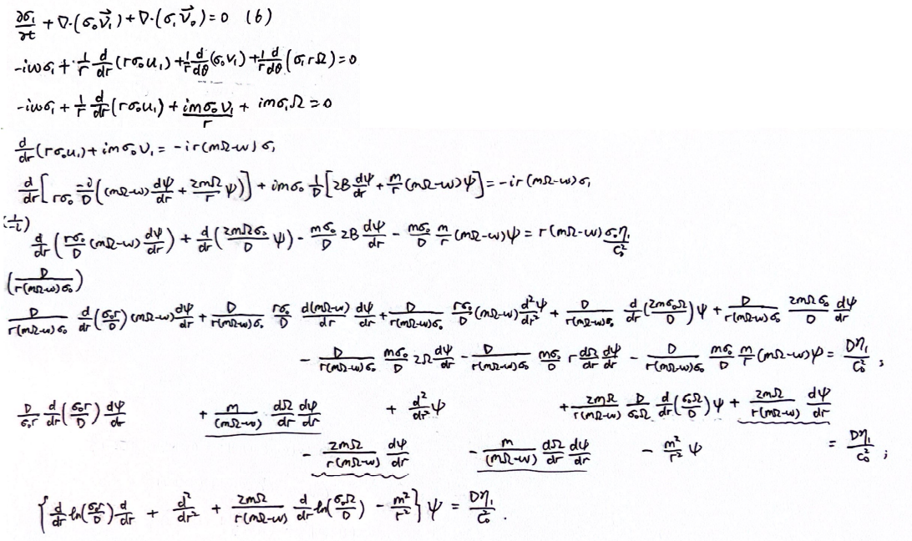
     I won't try to calculate it again, you can try that as you wish. (╥﹏╥)
  :::

  ::: info resonance
  there are singularities in the coefficients of equation (13):
  - $D=0$: Lindblad resonance, $r=r_L$
  - $m\Omega-\omega=0$: corotaion resonance, $r=r_c$
  :::

- the general solution of the perturbation equations away from the resonances:
  
  contain a homogeneous free-wave solutions and inhomogeneous non-wave solutions.

  1. the inhomogeneous non-wave solution ( $\varphi_1^D\approx0$ )
   $$
   \begin{multline}
   \frac{\sigma_1}{\sigma}=\frac{\eta_1}{c^2}= \\
   \frac{1}{D}\left\{\frac{\mathrm{d}^2}{\mathrm{d}r^2}+\left[\frac{\mathrm{d}}{\mathrm{d}r}\ln\left(\frac{\sigma r}{D}\right)\right]\frac{\mathrm{d}}{\mathrm{d}r}+\frac{2m\Omega}{r(m\Omega-\omega)}\left[\frac{\mathrm{d}}{\mathrm{d}r}\ln\left(\frac{\sigma\Omega}{D}\right)\right]-\frac{m^2}{r^2}\right\}\varphi_1 \tag{15}
   \end{multline}
   $$

  2. the homogeneous free-wave solution ( $\varphi_1=0$ )
  $$
  \varphi_1^D(r)=\Phi(r)\exp\left[i\int^r k(s)\mathrm{d}s\right]\tag{16}
  $$
  $$
  \sigma_1=\frac{i\ \text{sgn}(k)}{2\pi Gr^{1/2}}\frac{\mathrm{d}}{\mathrm{d}r}(r^{1/2}\varphi_1^D)\tag{17}
  $$

  here equation (17) is the WKB solution of Poisson's equation (8)

- the total angular momentum flux:
  $$
  F=F_G+F_A=-\text{sgn}(k)\frac{mr\Phi^2}{4G}\left(1-\frac{c^2|k|}{\pi G\sigma}\right)\tag{30}
  $$

  ::: info derivation
  spiral density waves transport angular momentum by **gravitational torques** and by **advective transport**.

  1. the angular momentum flux across a cylinder of radius $r$ due to gravitational torques is
    $$
    \begin{align}
    F_G&=\frac{1}{4\pi G}\int_0^{2\pi}\mathrm{d}\theta\int_{-\infty}^\infty \mathrm{d}z r\ \text{Re}\left[\frac{\partial\varphi_1^D}{\partial\theta}\right]\text{Re}\left[\frac{\partial\varphi_1^D}{\partial r}\right]\tag{23} \\
    &=\text{sgn}(k)\frac{mr\Phi^2(r)}{4G}\tag{25}
    \end{align}
    $$
  
  2. the flux due to advective transport
    $$
    \begin{align}
    F_A&=r^2\sigma\int_0^{2\pi}\mathrm{d}\theta\ \text{Re}(u)\text{Re}(v)\tag{26} \\
    &=-\frac{\pi mr\sigma k}{D}\left(1-\frac{c^2|k|}{2\pi G\sigma}\right)^2\Phi^2\tag{29}
    \end{align}
    $$
   
   combining equation (25),(29), finally yields
   $$
   F=F_G+F_A=-\text{sgn}(k)\frac{mr\Phi^2}{4G}\left(1-\frac{c^2|k|}{\pi G\sigma}\right)\tag{30}
   $$
  :::

### III. Lindblad Resonances

- the long trailing wave excited at a Lindblad resonance has an angular momentum flux,
  $$
  F=-m\pi^2\left\{\left|\frac{\sigma}{r\mathrm{d}D/\mathrm{d}r}\right|\left[r\frac{\mathrm{d}\varphi_1}{\mathrm{d}r}+\frac{2m\Omega}{(m\Omega-\omega)}\varphi_1\right]^2\right\}_{r_L}\tag{46}
  $$

  ::: info derivation
  computed from equations (15),(19),(30),(32), and (34)
  - the inhomogeneous non-wave solution (15)
   $$
   \begin{multline}
   \frac{\sigma_1}{\sigma}=\frac{\eta_1}{c^2}= \\
   \frac{1}{D}\left\{\frac{\mathrm{d}^2}{\mathrm{d}r^2}+\left[\frac{\mathrm{d}}{\mathrm{d}r}\ln\left(\frac{\sigma r}{D}\right)\right]\frac{\mathrm{d}}{\mathrm{d}r}+\frac{2m\Omega}{r(m\Omega-\omega)}\left[\frac{\mathrm{d}}{\mathrm{d}r}\ln\left(\frac{\sigma\Omega}{D}\right)\right]-\frac{m^2}{r^2}\right\}\varphi_1 \tag{15}
   \end{multline}
   $$
  - the solutions of the dispersion relation (19)
   $$
   |k|=\frac{\pi G\sigma}{c^2}+\epsilon\left[\left(\frac{\pi G\sigma}{c^2}\right)^2-\frac{D}{c^2}\right]^{1/2}\tag{19}
   $$
  - the total angular momentum flux (30)
   $$
   F=F_G+F_A=-\text{sgn}(k)\frac{mr\Phi^2}{4G}\left(1-\frac{c^2|k|}{\pi G\sigma}\right)\tag{30}
   $$
  - replace $D$ with $\mathscr{D}x$ (32)
   $$
   \mathscr{D}=[r(\mathrm{d}D/\mathrm{d}r)]_{r_L}\tag{32}
   $$
   $$
   x=(r-r_L)/r_L\tag{31}
   $$
  - the potential (34)
   $$
   \Phi=\left(r\frac{\mathrm{d}\varphi_1}{\mathrm{d}r}+\frac{2m\Omega}{(m\Omega-\omega)}\varphi_1\right)_{r_L}\tag{34}
   $$
  :::

### IV. Corotaion Resonances

#### a) Disks without Self-Gravity

- the entire flux
  $$
  F_A=-\frac{\pi^2}{4}m\ \text{sgn}(x)\left[\frac{\varphi_1^2}{\mathrm{d}\Omega/\mathrm{d}r}\frac{\mathrm{d}}{\mathrm{d}r}\left(\frac{\sigma}{B}\right)\right]_{r_c}\exp(-|qx|)\tag{55}
  $$

#### b) Disks with Self-Gravity

- the torque exerted by the external potential
  $$
  T_c=\frac{m\pi^2}{2}\left[\frac{\varphi_1^2}{\mathrm{d}\Omega/\mathrm{d}r}\frac{\mathrm{d}}{\mathrm{d}r}\left(\frac{\sigma}{B}\right)\right]_{r_c}\tag{93}
  $$

### Appendix

#### a) Lindblad Resonances

while solving the Lindblad resonance, we define
$$
\Psi=\left(r\frac{\mathrm{d}\varphi_1}{\mathrm{d}r}+\frac{2m\Omega}{(m\Omega-\omega)}\varphi_1\right)_{r_L}\tag{34}
$$
$$
\alpha=(2\pi G\sigma r/c^2)_{r_L}\text{sgn}(k)\tag{36}
$$
$$
\beta=(r/c)_{r_L}^2\mathscr{D}\tag{38}
$$

- the perturbed solution of velocity reads
  $$
  u_1=-\frac{\kappa}{r_L|\mathscr{D}|}\Psi\int_0^{\infty}\mathrm{d}t\exp\left[i\left(xt-\frac{\alpha t^2}{2\beta}+\frac{t^3}{3\beta}\right)\right]\tag{A6}
  $$
  $$
  v_1=i\ \text{sgn}(\mathscr{D})\frac{\kappa}{2\Omega}u_1\tag{A5}
  $$

- the torque exerted on the disk by the external potential in the neighborhood of a Lindblad resonance
  $$
  T=-\pi m\int_0^\infty\mathrm{d}r r\varphi_1(r)\ \text{Im}\ \sigma_1(r)\tag{A7}
  $$
  $$
  T=\pi m\text{Im}\left\{\int_0^\infty\mathrm{d}r\left[\frac{m\varphi_1\sigma v_1}{(m\Omega-\omega)}+ir\sigma u_1\frac{\mathrm{d}}{\mathrm{d}r}\left(\frac{\varphi_1}{m\Omega-\omega}\right)\right]\right\}\tag{A8}
  $$
  $$
  T_L=\frac{\pi m\sigma r_L\Psi}{\kappa}\text{sgn}(\mathscr{D})\int_{-\infty}^\infty\mathrm{d}x\text{Re}(u_1)f(x)\tag{A9}
  $$

## GT80

some key points from [GT80](/read/goldreich-tremaine-1980.pdf) *disk-satellite interactions*

- main content:
  
  the interactions between a disk and a satellite which orbit the same central mass.

### II. Steady-State Interactions at Resonances

#### a) The Disk

- Oort's parameters $A(r),B(r)$ and the epicyclic frequency $\kappa(r)$
  $$
  A(r)=\frac{r}{2}\frac{\mathrm{d}\Omega}{\mathrm{d}r},\quad B(r)=\Omega(r)+A(r),\quad \kappa^2(r)=4B(r)\Omega(r)\tag{1}
  $$

#### b) The Satellite

- the position of satellite when $e\ll 1$ in the first order in $e$ is
  $$
  r_s=a(1-e\cos\kappa_s t),\quad \theta_s=\Omega_s t+\frac{2\Omega_s e}{\kappa_s}\sin\kappa_s t\tag{2}
  $$

  ::: tip todo:
  check it in (Chandrasekhar 1960)
  :::

- the perturbation potential due to a satellite of mass $M_s$ reads
  $$
  \phi^s(r,\theta,t)=-\frac{GM_s}{|\boldsymbol{r}-\boldsymbol{r}_s|}+\frac{M_s}{M_p}\Omega^2(r)\boldsymbol{r}_s\cdot\boldsymbol{r}\tag{4}
  $$

  ::: info derivation (the inertial potential)
  the acceleration of the central mass arised by the gravitation of the satellite reads
  $$
  \boldsymbol{a}_p=\frac{GM_s}{|\boldsymbol{r}_s|^3}\boldsymbol{r}_s
  $$

  for a unit mass point in this coordinate system, the inertial force satisfies
  $$
  \boldsymbol{F}_{iner}=-\nabla\phi_{iner}=-\boldsymbol{a}_{p}
  $$

  so the inertial potential satisfies
  $$
  \nabla\phi_{iner}=\frac{GM_s}{|\boldsymbol{r}_s|^3}\boldsymbol{r}_s
  $$
  $$
  \Rightarrow\phi_{iner}=\frac{GM_s}{|\boldsymbol{r}_s|^3}\boldsymbol{r}_s\cdot\boldsymbol{r}+C
  $$

  in the binary system, we have
  $$
  G\frac{M_pM_s}{|\boldsymbol{r}_s|^2}=M_s\Omega^2|\boldsymbol{r}_s|\Rightarrow\frac{GM_s}{|\boldsymbol{r}_s|^3}=\frac{M_s}{M_p}\Omega^2
  $$

  applying the relation above, we finally obtain
  $$
  \phi_{iner}=\frac{M_s}{M_p}\Omega^2\boldsymbol{r}_s\cdot\boldsymbol{r}
  $$
  :::

- expand $\phi^s$ in a Fourier series:
  $$
  \phi^s(r,\theta,t)=\sum_{l=-\infty}^\infty\sum_{m=0}^\infty\phi^s_{l,m}(r)\cos\{m\theta-[m\Omega_s+(l-m)\kappa_s]t\}\tag{5}
  $$
  to first order in $e$, the only nonvanishing components are
  $$
  \phi^s_{m,m}=-\frac{GM_s}{2a}(2-\delta_{m,0})(b_{1/2}^m-f\beta\delta_{m,1})\tag{7}
  $$
  $$
  \phi^s_{m+1,m}=-\frac{GM_s}{2a}e(2-\delta_{m,0})\left[\left(\frac{1}{2}+\frac{m\Omega_s}{\kappa_s}+\frac{\beta}{2}\frac{\mathrm{d}}{\mathrm{d}\beta}\right)b_{1/2}^m-f\beta\left(\frac{3}{2}-\frac{2B_s}{\Omega_s}+\frac{\Omega_s}{\kappa_s}\right)\delta_{m,1}\right]\tag{8}
  $$
  $$
  \phi^s_{m+1,m}=-\frac{GM_s}{2a}e(2-\delta_{m,0})\left[\left(\frac{1}{2}-\frac{m\Omega_s}{\kappa_s}+\frac{\beta}{2}\frac{\mathrm{d}}{\mathrm{d}\beta}\right)b_{1/2}^m-f\beta\left(\frac{3}{2}-\frac{2B_s}{\Omega_s}-\frac{\Omega_s}{\kappa_s}\right)\delta_{m,1}\right]\tag{9}
  $$
  here $f=\Omega_s^2a^3/GM_p$, $\beta=r/a$, $\delta_{m,n}$ is the Kronecker delta function, and $b_{1/2}^m(\beta)$ is the Laplace coefficient,
  $$
  b_{1/2}^m(\beta)=\frac{2}{\pi}\int_0^\pi\frac{\cos m\phi\mathrm{d}\phi}{(1-2\beta\cos\phi+\beta^2)^{1/2}}\tag{10}
  $$

- the pattern speed of the $l,m$ potential component (in a Fourier series) is
  $$
  \Omega_{l,m}=\Omega_s+\frac{(l-m)}{m}\kappa_s
  $$

  ::: info the difference of mark
  the pattern speed is denoted by $\omega$ in [GT79](/read/goldreich-tremaine-1979.pdf), both of them are the coefficients of time $t$.
  :::

#### c) Torques at Resonances

- the condition of Lindblad and corotation resonances:
  1. the Lindblad resonance:
   $$
   \Omega(r)+\epsilon\frac{\kappa(r)}{m}=\Omega_{l,m},\quad \epsilon=\pm1,\quad m>0\tag{11}
   $$
  2. the corotation resonance:
   $$
   \Omega(r)=\Omega_{l,m},\quad m>0\tag{12}
   $$

  ::: info derivation
  see the equation (13) in [GT79](/read/disk-satellite#ii-basic-equations)
  :::

- the torque
  1. at a Lindblad resonance $r=r_L$,
   $$
   T_{l,m}^L=-m\pi^2\left[\Sigma\left(\frac{r\mathrm{d}D}{\mathrm{d}r}\right)^{-1}\left(\frac{r\mathrm{d}\phi_{l,m}^s}{\mathrm{d}r}+\frac{2\Omega}{\Omega-\Omega_{l,m}}\phi_{l,m}^s\right)^2\right]_{r_L}\tag{13}
   $$
   where $D=\kappa^2-m^2(\Omega-\Omega_{l,m})^2$. Note that the sign of $T_{l,m}^L$ is opposite to that of $\mathrm{d}D/\mathrm{d}r$. Thus, angular momentum is removed from the disk at an inner Lindblad resonance and added to it at an outer Lindblad resonance.

  2. at a corotation resonance $r=r_c$,
   $$
   T_{l,m}^C=\frac{m\pi^2}{2}\left[\left(\frac{\mathrm{d}\Omega}{\mathrm{d}r}\right)^{-1}\frac{\mathrm{d}}{\mathrm{d}r}\left(\frac{\Sigma}{B}\right)(\phi_{l,m}^s)^2\right]_{r_c}
   $$

#### e) Orbital Variations

- the change rate of $a$ and $e$ are
  $$
  \frac{\mathrm{d}a}{\mathrm{d}t}=-\frac{2\Omega T_r}{a\kappa^2M_s}\tag{26}
  $$
  $$
  \frac{\mathrm{d}e}{\mathrm{d}t}=-\left[(\Omega_p-\Omega)-2e^2\Omega\left(1+\frac{\mathrm{d}\ln \kappa}{\mathrm{d}\ln r}\right)\right]\frac{T_r}{M_se(a\kappa)^2}\tag{27}
  $$

  ::: info derivation
  The derivation of equations (26) and (27) from equations (22)-(25) in Goldreich & Tremaine (1980) is as follows. The equations are:
  
  - Angular momentum:  
    $$
    H = M_s a^2 \Omega \tag{22}
    $$
  
  - Energy:  
    $$
    E = \frac{1}{2} M_s \left[ (a \Omega)^2 + (e a \kappa)^2 \right] + M_s \Phi(a) \tag{23}
    $$
  
  - Torque relations:  
    $$
    \begin{align}
    \frac{\mathrm{d}H}{\mathrm{d}t} &= -T_r \tag{24}, \\
    \frac{\mathrm{d}E}{\mathrm{d}t} &= -\Omega_p T_r \tag{25}
    \end{align}
    $$
  
  - Identities:  
    $$
    a \Omega^2 = \frac{\mathrm{d}\Phi}{\mathrm{d}r}, \quad \kappa^2 - 3\Omega^2 = \frac{\mathrm{d}^2\Phi}{\mathrm{d}r^2} \quad \text{(evaluated at } r = a\text{)}
    $$
  
  - **(a) Derivation of Equation (26) for $\mathrm{d}a/\mathrm{d}t$**
  1. **Differentiate equation (22)**:  
     $$
     \frac{\mathrm{d}H}{\mathrm{d}t} = M_s \left( 2a \frac{\mathrm{d}a}{\mathrm{d}t} \Omega + a^2 \frac{\mathrm{d}\Omega}{\mathrm{d}t} \right)
     $$
     Since $\Omega = \Omega(a)$, apply the chain rule:  
     $$
     \frac{\mathrm{d}\Omega}{\mathrm{d}t} = \frac{\mathrm{d}\Omega}{\mathrm{d}a} \frac{\mathrm{d}a}{\mathrm{d}t}
     $$
     Substitute:  
     $$
     \frac{\mathrm{d}H}{\mathrm{d}t} = M_s \left( 2a \Omega \frac{\mathrm{d}a}{\mathrm{d}t} + a^2 \frac{\mathrm{d}\Omega}{\mathrm{d}a} \frac{\mathrm{d}a}{\mathrm{d}t} \right) = M_s a \frac{\mathrm{d}a}{\mathrm{d}t} \left( 2\Omega + a \frac{\mathrm{d}\Omega}{\mathrm{d}a} \right)
     $$
  
  2. **Use Oort's parameters (equation 1)**:
     $$
     A = \frac{r}{2} \frac{\mathrm{d}\Omega}{\mathrm{d}r}, \quad B = \Omega + A
     $$
     At $r = a$:  
     $$
     a \frac{\mathrm{d}\Omega}{\mathrm{d}a} = 2A
     $$
     Substitute:  
     $$
     \frac{\mathrm{d}H}{\mathrm{d}t} = M_s a \frac{\mathrm{d}a}{\mathrm{d}t} (2\Omega + 2A) = 2 M_s a B \frac{\mathrm{d}a}{\mathrm{d}t}
     $$
  
  3. **Apply torque equation (24)**:  
     $$
     \frac{\mathrm{d}H}{\mathrm{d}t} = -T_r
     $$
     So:  
     $$
     -T_r = 2 M_s a B \frac{\mathrm{d}a}{\mathrm{d}t} \implies \frac{\mathrm{d}a}{\mathrm{d}t} = -\frac{T_r}{2 M_s a B}
     $$
  
  4. **Use $\kappa^2 = 4B\Omega$ (from equation 1)**:  
     $$
     B = \frac{\kappa^2}{4\Omega}
     $$
     Substitute:  
     $$
     \frac{\mathrm{d}a}{\mathrm{d}t} = -\frac{T_r}{2 M_s a \cdot (\kappa^2 / (4\Omega))} = -\frac{2 \Omega T_r}{a \kappa^2 M_s}
     $$
     This matches **equation (26)**.
  
  - **(b) Derivation of Equation (27) for $\mathrm{d}e/\mathrm{d}t$**
  1. **Differentiate equation (23)**:  
     $$
     \frac{\mathrm{d}E}{\mathrm{d}t} = M_s \left[ \frac{1}{2} \cdot 2a \frac{\mathrm{d}a}{\mathrm{d}t} \Omega^2 + \frac{1}{2} a^2 \cdot 2\Omega \frac{\mathrm{d}\Omega}{\mathrm{d}t} + \frac{1}{2} \cdot 2e a^2 \kappa^2 \frac{\mathrm{d}e}{\mathrm{d}t} + \frac{1}{2} e^2 \cdot 2a \kappa^2 \frac{\mathrm{d}a}{\mathrm{d}t} + \frac{1}{2} e^2 a^2 \cdot 2\kappa \frac{\mathrm{d}\kappa}{\mathrm{d}t} + \frac{\mathrm{d}\Phi}{\mathrm{d}t} \right]
     $$
     Simplify:  
     $$
     \frac{\mathrm{d}E}{\mathrm{d}t} = M_s \left[ a \Omega^2 \frac{\mathrm{d}a}{\mathrm{d}t} + a^2 \Omega \frac{\mathrm{d}\Omega}{\mathrm{d}t} + e a^2 \kappa^2 \frac{\mathrm{d}e}{\mathrm{d}t} + e^2 a \kappa^2 \frac{\mathrm{d}a}{\mathrm{d}t} + e^2 a^2 \kappa \frac{\mathrm{d}\kappa}{\mathrm{d}t} + \frac{\mathrm{d}\Phi}{\mathrm{d}a} \frac{\mathrm{d}a}{\mathrm{d}t} \right]
     $$
     From $a \Omega^2 = \mathrm{d}\Phi / \mathrm{d}r$, so $\mathrm{d}\Phi / \mathrm{d}a = a \Omega^2$:  
     $$
     \frac{\mathrm{d}E}{\mathrm{d}t} = M_s \left[ a \Omega^2 \frac{\mathrm{d}a}{\mathrm{d}t} + a^2 \Omega \frac{\mathrm{d}\Omega}{\mathrm{d}t} + e a^2 \kappa^2 \frac{\mathrm{d}e}{\mathrm{d}t} + e^2 a \kappa^2 \frac{\mathrm{d}a}{\mathrm{d}t} + e^2 a^2 \kappa \frac{\mathrm{d}\kappa}{\mathrm{d}t} + a \Omega^2 \frac{\mathrm{d}a}{\mathrm{d}t} \right]
     $$
     Combine terms:  
     $$
     \frac{\mathrm{d}E}{\mathrm{d}t} = M_s \left[ \underbrace{2a \Omega^2 \frac{\mathrm{d}a}{\mathrm{d}t} + a^2 \Omega \frac{\mathrm{d}\Omega}{\mathrm{d}t} + e^2 a \kappa^2 \frac{\mathrm{d}a}{\mathrm{d}t} + e^2 a^2 \kappa \frac{\mathrm{d}\kappa}{\mathrm{d}t}}_{\text{terms with } \mathrm{d}a/\mathrm{d}t} + e a^2 \kappa^2 \frac{\mathrm{d}e}{\mathrm{d}t} \right]
     $$
  
  2. **Apply chain rule to $\mathrm{d}\Omega/\mathrm{d}t$ and $\mathrm{d}\kappa/\mathrm{d}t$**:  
     $$
     \frac{\mathrm{d}\Omega}{\mathrm{d}t} = \frac{\mathrm{d}\Omega}{\mathrm{d}a} \frac{\mathrm{d}a}{\mathrm{d}t}, \quad \frac{\mathrm{d}\kappa}{\mathrm{d}t} = \frac{\mathrm{d}\kappa}{\mathrm{d}a} \frac{\mathrm{d}a}{\mathrm{d}t}
     $$
     Substitute:  
     $$
     \frac{\mathrm{d}E}{\mathrm{d}t} = M_s \left[ \left( 2a \Omega^2 + a^2 \Omega \frac{\mathrm{d}\Omega}{\mathrm{d}a} + e^2 a \kappa^2 + e^2 a^2 \kappa \frac{\mathrm{d}\kappa}{\mathrm{d}a} \right) \frac{\mathrm{d}a}{\mathrm{d}t} + e a^2 \kappa^2 \frac{\mathrm{d}e}{\mathrm{d}t} \right]
     $$
  
  3. **Apply torque equation (25)**:  
     $$
     \frac{\mathrm{d}E}{\mathrm{d}t} = -\Omega_p T_r
     $$
     So:  
     $$
     -\Omega_p T_r = M_s \left[ \left( 2a \Omega^2 + a^2 \Omega \frac{\mathrm{d}\Omega}{\mathrm{d}a} + e^2 a \kappa^2 + e^2 a^2 \kappa \frac{\mathrm{d}\kappa}{\mathrm{d}a} \right) \frac{\mathrm{d}a}{\mathrm{d}t} + e a^2 \kappa^2 \frac{\mathrm{d}e}{\mathrm{d}t} \right]
     $$
  
  4. **Substitute $\mathrm{d}a/\mathrm{d}t$ from equation (26)**:  
     $$
     \frac{\mathrm{d}a}{\mathrm{d}t} = -\frac{T_r}{2 M_s a B}
     $$
     Insert:  
     $$
     -\Omega_p T_r = M_s \left[ \left( 2a \Omega^2 + a^2 \Omega \frac{\mathrm{d}\Omega}{\mathrm{d}a} + e^2 a \kappa^2 + e^2 a^2 \kappa \frac{\mathrm{d}\kappa}{\mathrm{d}a} \right) \left( -\frac{T_r}{2 M_s a B} \right) + e a^2 \kappa^2 \frac{\mathrm{d}e}{\mathrm{d}t} \right]
     $$
  
  5. **Simplify and solve for $\mathrm{d}e/\mathrm{d}t$**:  
     $$
     -\Omega_p T_r = -\frac{T_r}{2 B} \left( 2\Omega^2 + a \Omega \frac{\mathrm{d}\Omega}{\mathrm{d}a} + e^2 \kappa^2 + e^2 a \kappa \frac{\mathrm{d}\kappa}{\mathrm{d}a} \right) + M_s e a^2 \kappa^2 \frac{\mathrm{d}e}{\mathrm{d}t}
     $$
     Divide by $T_r$:  
     $$
     -\Omega_p = -\frac{1}{2B} \left( 2\Omega^2 + a \Omega \frac{\mathrm{d}\Omega}{\mathrm{d}a} + e^2 \kappa^2 + e^2 a \kappa \frac{\mathrm{d}\kappa}{\mathrm{d}a} \right) + \frac{M_s e a^2 \kappa^2}{T_r} \frac{\mathrm{d}e}{\mathrm{d}t}
     $$
     Rearrange:  
     $$
     \frac{M_s e a^2 \kappa^2}{T_r} \frac{\mathrm{d}e}{\mathrm{d}t} = -\Omega_p + \frac{1}{2B} \left( 2\Omega^2 + a \Omega \frac{\mathrm{d}\Omega}{\mathrm{d}a} + e^2 \kappa^2 + e^2 a \kappa \frac{\mathrm{d}\kappa}{\mathrm{d}a} \right)
     $$
     $$
     \frac{\mathrm{d}e}{\mathrm{d}t} = \frac{T_r}{M_s e a^2 \kappa^2} \left[ -\Omega_p + \frac{1}{2B} \left( 2\Omega^2 + a \Omega \frac{\mathrm{d}\Omega}{\mathrm{d}a} + e^2 \kappa^2 + e^2 a \kappa \frac{\mathrm{d}\kappa}{\mathrm{d}a} \right) \right]
     $$
  
  6. **Simplify using identities**:  
     - From $\kappa^2 = 4B\Omega$, so $2\Omega^2 + a \Omega \frac{\mathrm{d}\Omega}{\mathrm{d}a} = \frac{\kappa^2}{2}$ (derived from $\kappa^2 = 4\Omega^2 + 2a \Omega \frac{\mathrm{d}\Omega}{\mathrm{d}a}$).  
     - With $\frac{\mathrm{d} \ln \kappa}{\mathrm{d} \ln r} =\frac{\mathrm{d} \ln\kappa}{\mathrm{d} r}\frac{1}{\frac{\mathrm{d}\ln r}{\mathrm{d}r}}=\frac{\mathrm{d}\ln\kappa}{\mathrm{d}r}r=\frac{\mathrm{d}\ln\kappa}{\mathrm{d}\kappa}\frac{\mathrm{d}\kappa}{\mathrm{d}r}r=\frac{r}{\kappa}\frac{\mathrm{d}\kappa}{\mathrm{d}r}|_{r=a}=\frac{a}{\kappa}\frac{\mathrm{d}\kappa}{\mathrm{d}a}$.  
     Substitute:  
     $$
     \frac{\mathrm{d}e}{\mathrm{d}t} = \frac{T_r}{M_s e a^2 \kappa^2} \left[ -\Omega_p + \frac{1}{2B} \left( \frac{\kappa^2}{2} + e^2 \kappa^2 \left(1 + \frac{\mathrm{d} \ln \kappa}{\mathrm{d} \ln r}\right) \right) \right]
     $$
     $$
     = \frac{T_r}{M_s e a^2 \kappa^2} \left[ -\Omega_p + \underbrace{\frac{\kappa^2}{4B}}_{\Omega} + \frac{e^2 \kappa^2}{2B} \left(1 + \frac{\mathrm{d} \ln \kappa}{\mathrm{d} \ln r}\right) \right]
     $$
     $$
     = \frac{T_r}{M_s e a^2 \kappa^2} \left[ -\Omega_p + \Omega + \frac{e^2 \kappa^2}{2B} \left(1 + \frac{\mathrm{d} \ln \kappa}{\mathrm{d} \ln r}\right) \right]
     $$
     Since $\kappa^2 = 4B\Omega$, then $\kappa^2 / (2B) = 2\Omega$:  
     $$
     \frac{\mathrm{d}e}{\mathrm{d}t} = \frac{T_r}{M_s e a^2 \kappa^2} \left[ -(\Omega_p - \Omega) + 2 e^2 \Omega \left(1 + \frac{\mathrm{d} \ln \kappa}{\mathrm{d} \ln r}\right) \right]
     $$
     Rearrange to match equation (27):  
     $$
     \frac{\mathrm{d}e}{\mathrm{d}t} = -\left[ (\Omega_p - \Omega) - 2 e^2 \Omega \left(1 + \frac{\mathrm{d} \ln \kappa}{\mathrm{d} \ln r}\right) \right] \frac{T_r}{M_s e (a \kappa)^2}
     $$
     This is **equation (27)**, where $(a \kappa)^2 = a^2 \kappa^2$.
  
  - **Key Steps Recap:**
    - **For $\mathrm{d}a/\mathrm{d}t$**: Differentiated angular momentum $H$, used torque $\mathrm{d}H/\mathrm{d}t = -T_r$, and substituted $B = \kappa^2 / (4\Omega)$.  
    - **For $\mathrm{d}e/\mathrm{d}t$**: Differentiated energy $E$, used torque $dE/dt = -\Omega_p T_r$, substituted $\mathrm{d}a/\mathrm{d}t$, and applied identities for $\kappa^2$ and logarithmic derivatives.  
    - **Note**: All derivatives ($\Omega, \kappa, \Phi$) are evaluated at $r = a$, and $\mathrm{d} \ln \kappa / \mathrm{d} \ln r$ is the logarithmic derivative of $\kappa$ with respect to $r$.
  :::

## yang-li-2024

the theory part of [yang-li-2024](/read/yang-li-2024.pdf) *mean-motion resonances with interfering density waves*

- main content:
  
  an object 'A' moving on a *fixed* outer circular orbit and an object 'B' moving along an inner eccentric orbit, the system is assumed to be locked in a $m:m-1$ resonance such that
  $$
  m\Omega_A=m\Omega_B-\kappa_B\tag{1}
  $$

::: info summary
the main analyze (in interfering density waves):
- the normal torque due to gravitational torque and advective transport (migration torque)
- the inner and outer Lindblad resonance
- the corotation resonance
:::

### 2 Interfering density waves and their backreaction

- the Fourier series of the individual gravitational field for object A or B ( $s=A,B$ )
  $$
  \varphi_s(r,\phi,t)=\sum_{l_s=-\infty}^\infty\sum_{m_s=0}^\infty\varphi_{s,l_s,m_s}\cos\{m_s\phi-[m_s\Omega_s+(l_s-m_s)\kappa_s]t\}\tag{2}
  $$
  where the pattern frequency of the $l_s,m_s$ component is
  $$
  \Omega_{l_s,m_s}=\Omega_s+\frac{l_s-m_s}{m_s}\kappa_s\tag{3}
  $$

- the location of the inner and outer Lindblad resonances and corotation resonance is
  $$
  m(\Omega-\Omega_{l_s,m_s})=\pm\kappa,\quad m>0\tag{4}
  $$
  $$
  \Omega=\Omega_{l,m}\tag{6}
  $$

- the location of the inner $m:m-1$ Lindblad resonance of object A should be close to the radius of object B.

  ::: info derivation
  1. the object A and B are in $m:m-1$ mean-motion resonance, the orbital velocities satisfy,
  $$
  m\Omega_A=(m-1)\Omega_B
  $$
  $$
  \Rightarrow r_B=r_A\left(\frac{\Omega_A}{\Omega_B}\right)^{2/3}=r_A\left(\frac{m-1}{m}\right)^{2/3}
  $$
  2. the location of the inner Lindblad resonance of object A (for Keplerian disc, $\kappa\approx\Omega$ )
  $$
  m(\Omega_{in}-\Omega_A)=\kappa\approx\Omega_{in}
  $$
  $$
  \Rightarrow m\Omega_A\approx(m-1)\Omega_{in}
  $$
  $$
  \Rightarrow r_{in}=r_A\left(\frac{\Omega_A}{\Omega_{in}}\right)^{2/3}\approx r_A\left(\frac{m-1}{m}\right)^{2/3}
  $$
  :::

- the total angular flux contains the cross-term is (the migration torque)
  $$
  \mathcal{F}_{J\times}=-\text{sgn}(k)\frac{mr}{2G}\left(1-\frac{c^2|k|}{\pi G\sigma}\right)\text{Re}(\Phi_A\Phi_B e^{i(Q_0+C_{AB})})\tag{9}
  $$
  ::: info derivation
  begin from the gravitational potential perturbation from object A and B
  $$
  \begin{array}{c}
  \varphi_A^D(r)e^{im\phi-i\omega t}=\Phi_Ae^{i\int_A^rk\mathrm{d}r}e^{im\phi-i\omega t} \\
  \varphi_B^D(r)e^{im\phi-i\omega t}=\Phi_Be^{i\int_B^rk\mathrm{d}r}e^{im\phi-i\omega t}e^{iQ_0}\tag{7}
  \end{array}
  $$
  the total potential perturbation
  $$
  \varphi_D=\varphi_A^D+\varphi_B^D
  $$
  $$
  \Rightarrow|\varphi_D|^2=|\varphi_A^D|^2+|\varphi_B^D|^2+2\text{Re}(\varphi_A^D\varphi_B^D)
  $$
  the cross-term $2\text{Re}(\varphi_A^D\varphi_B^D)$ represents interference
  $$
  \begin{align}
  \varphi_A^D\varphi_B^{D*}&=\Phi_A\Phi_B\exp\left[i\left(\int_A^rk\mathrm{d}r-\int_B^rk\mathrm{d}r\right)\right]e^{iQ_0} \\
  &=\Phi_A\Phi_B\exp\left[i\left(\int_A^Bk\mathrm{d}r+Q_0\right)\right]
  \end{align}
  $$
  $$
  \text{Re}(\varphi_A^D\varphi_B^{D*})=\text{Re}\left(\Phi_A\Phi_Be^{i(Q_0+C_{AB})}\right)
  $$
  where $\int_A^Bk\mathrm{d}r=C_{AB}$ is the phase shift due to wave propagation between resonances.

  substituting into equation (8), which is equation (30) in GT79
  $$
  \mathcal{F}_J=-\text{sgn}(k)\frac{mr|\varphi_D|^2}{4G}\left(1-\frac{c^2|k|}{\pi G\sigma}\right)\tag{8}
  $$
  so the cross-term in the total angular momentum flux is
  $$
  \mathcal{F}_{J\times}=-\text{sgn}(k)\frac{mr}{2G}\left(1-\frac{c^2|k|}{\pi G\sigma}\right)\text{Re}(\Phi_A\Phi_B e^{i(Q_0+C_{AB})})\tag{9}
  $$
  :::

- the resonant angle $Q$ is
  $$
  Q=m\lambda_A-(m-1)\lambda_B-\varpi_B
  $$
  where $\dot{\lambda}_s=\Omega_s$ and $\dot{\varpi}_s=\Omega_s-\kappa_s$

#### 2.1 Computing the torque

- the torque of the external potentials $\phi_A=\varphi_{A,m,m},\phi_B=\varphi_{B,m-1,m}$ acting on the disc is
  $$
  T=-m\pi\int_0^\infty\mathrm{d}r r[\phi_A(r)+\phi_B(r)]\text{Im}[\sigma_A(r)+\sigma_B(r)]\tag{10}
  $$

- the backreaction of the density wave produced by object A on object B should be
  $$
  \begin{align}
  T_B&=m\pi\int_0^\infty\mathrm{d}r r\phi_B(r)\text{Im}\sigma_A(r) \\
  &=-\pi m\text{Im}\left\{\int_0^\infty\mathrm{d}r\left[\frac{m\phi_B\sigma v_A}{m\Omega-\omega}+ir\sigma u_A\frac{\mathrm{d}}{\mathrm{d}r}\left(\frac{\phi_B}{m\Omega-\omega}\right)\right]\right\}\tag{11}
  \end{align}
  $$

##### 2.1.1 Lindblad resonances

- the torque near the Lindblad resonance
  $$
  T_B=-\frac{\pi m\sigma r_L}{\kappa}\text{sgn}(\mathcal{D})\int_{-\infty}^\infty\mathrm{d}x\Psi_{B,l,m}\text{Re}(u_A)f(x)\tag{16}
  $$
  where the window function $f(x)$ is chosen such that $f=1$ near the resonance location and $f\rightarrow0$ for $|x|\rightarrow\infty$ to eliminate oscillatory contributions far away.

- the inner Lindblad resonance of object A operate the torque on object B
  $$
  \begin{align}
  T_{B,in}&=\frac{m\pi\sigma}{\mathcal{D}}\Psi_{A,m,m}\int_{-\infty}^\infty\mathrm{d}xf(x)(\Psi_d+\Psi_c\sin f_c)\times\text{Re}\left\{\int_0^\infty\mathrm{d}t\exp\left[i\left(tx-\frac{\alpha t^2}{2\beta}+\frac{t^3}{3\beta}-iQ\right)\right]\right\}\tag{21}\\
  &=\frac{\pi^2m\sigma\Psi_{A,m,m}}{\mathcal{D}}\left\{\Psi_d\cos Q+\frac{e_B}{2}\Psi_c\text{Re}\left[W(\alpha,\beta)e^{-iQ}\right]\right\}\tag{25}
  \end{align}
  $$

- the outer one
  $$
  T_{B,out}=\frac{\pi^2m\sigma\Psi_{A,m,m}\Psi_{B,m-1,m}}{\mathcal{D}}\cos Q\tag{29}
  $$

##### 2.1.2 Corotation resonance

- the corotation torque:
  $$
  T_{B,co}=-\frac{m\pi^2}{2}\left[\left(\frac{\mathrm{d}\Omega}{\mathrm{d}r}\right)^{-1}\frac{\mathrm{d}}{\mathrm{d}r}\left(\frac{\sigma}{B_0}\right)\varphi_{A,m,m}\varphi_{B,m-1,m}\cos Q\right]_{r_C}\tag{33}
  $$

##### 2.1.3 Alternative smoothing scheme

- an alternative smoothing scheme in numerical simulation to modify the gravitational potential produced by planets
  $$
  \Phi_s=-\frac{G\mu_sM}{(|\boldsymbol{r}_{p,s}-\boldsymbol{r}|^2+\epsilon^2)^{1/2}}+\mu_s\Omega_{p,s}^2\boldsymbol{r}_{p,s}\cdot\boldsymbol{r}\tag{36}
  $$

#### 2.2 Change rate of orbital quantities

$$
\frac{\mathrm{d}e_B}{\mathrm{d}t}=-\frac{1}{m}\frac{T_{B,in}}{M_Be_Ba_B^2\Omega_B}:=-\frac{\cos(Q-Q_0)}{\tau_0}\tag{42}
$$
$$
\frac{\dot{n}_B}{n_B}=-3(GM)^{-2/3}n^{1/3}M_B^{-1}T_{B,in}:=-\frac{3me_B}{\cos(Q-Q_0)}\tau_0\tag{44}
$$

::: warning some errors?
1. equation (14)

   $$
   v_A=i\ \text{sgn}(\mathcal{D})\frac{2\Omega}{\kappa}u_A\tag{14}
   $$

   is different from that in [GT79](/read/disk-satellite#a-lindblad-resonances)

   $$
   v_1=i\ \text{sgn}(\mathscr{D})\frac{\kappa}{2\Omega}u_1\tag{A5}
   $$

2. equation (44)
   
   $$
   -\frac{3me_B}{\cos}(Q-Q_0)\tau_0
   $$
:::

::: tip todo:
- what's the physical meaning of the parameters $l_s,m_s$ in the Fourier series of gravitational field (Eq.2), and the detailed reason of choose $m_A=l_A=m,m_B=m,l_B=m-1$ ?

- the detailed calculations around Eq.24, look for W88
:::

### 3 Hydrodynamical simulations

#### 3.1 Numerical set-ups

[FARGO3D code](https://fargo3d.github.io/documentation/intro.html)

#### 3.2 Simulations results

##### 3.2.1 Non-resonant pairs

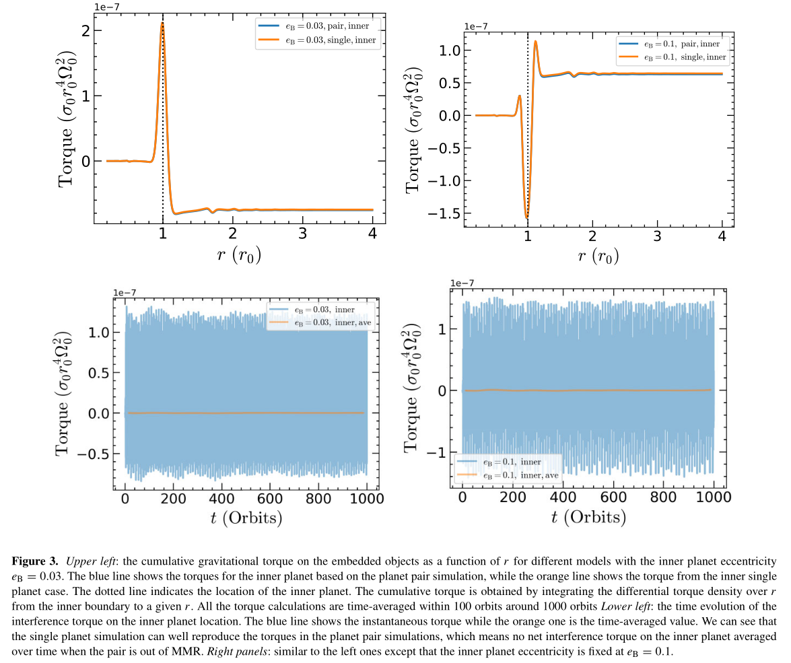

##### 3.2.2 Planet pairs with 2:1 MMR

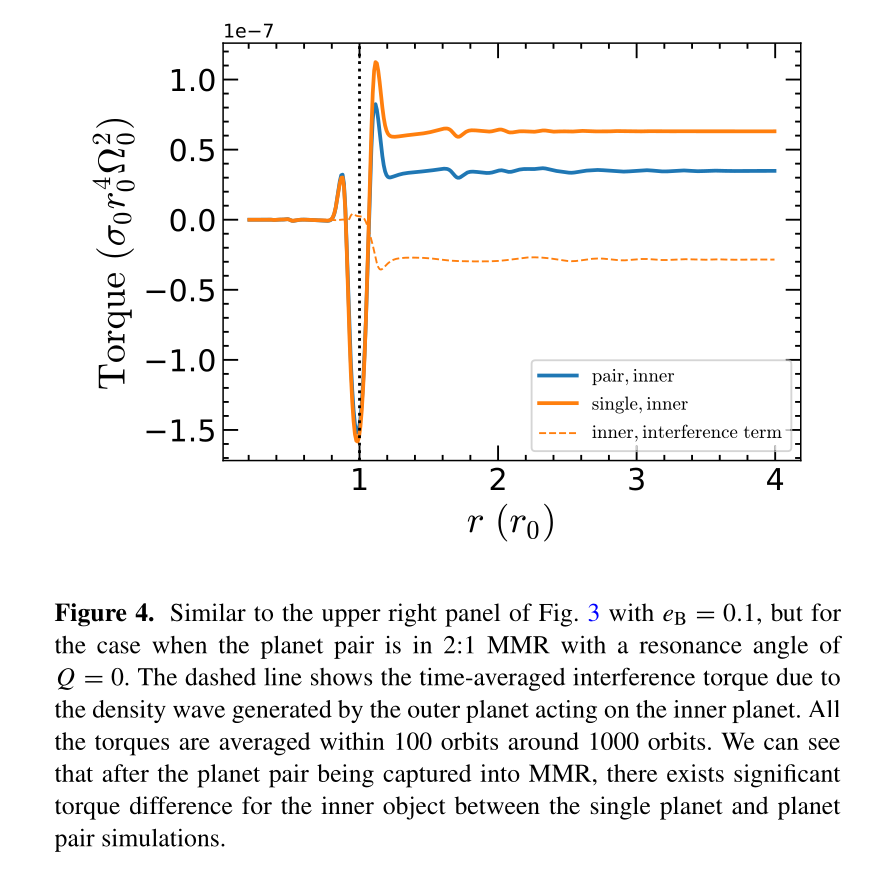
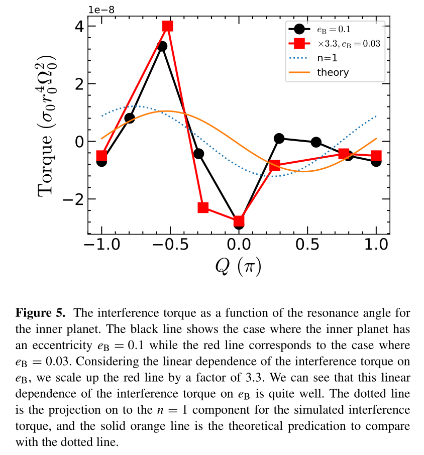

##### 3.2.3 Other parameter dependence

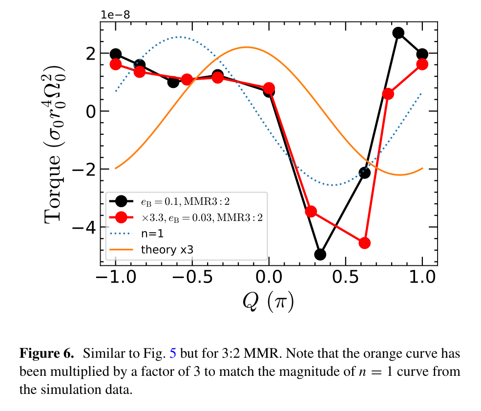
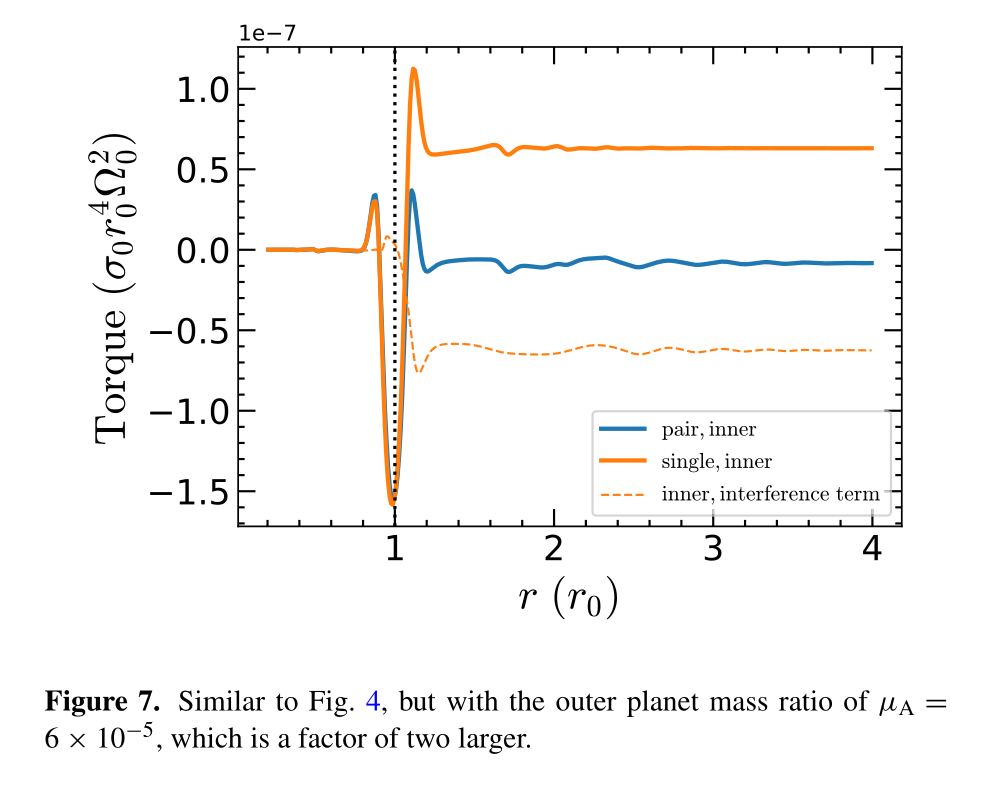

In summary, the comparison between the numerically extracted torque and analytically predicted torque is:
- the location of the torque jump which locates at the inner Lindblad resonance
- the torque amplitudes: the linear dependence on $e_B$, planet mass, and the sinusoidal-like pattern of $Q$

### 4 Modified resonant dynamics

the equations of motion including the effect of interfering density waves for $n=\dot{\lambda}_B,e$ are
$$
\begin{array}{l}
\dot{n}=3(m-1)\beta_0\mu'en^2\sin Q-\dfrac{n}{\tau_n}+p\dfrac{e^2n}{\tau_e}-\dfrac{6en\cos Q}{\tau_0} \\
\dot{e}=\beta_0\mu'n\sin Q-\dfrac{e}{\tau_e}-\dfrac{\cos Q}{\tau_0}\tag{45}
\end{array}
$$

- the normal migration torques: $\tau_e,\tau_n$-related terms
- the torques of interfering density waves: $\tau_0$-related terms

#### 4.1 Without constant migration torques

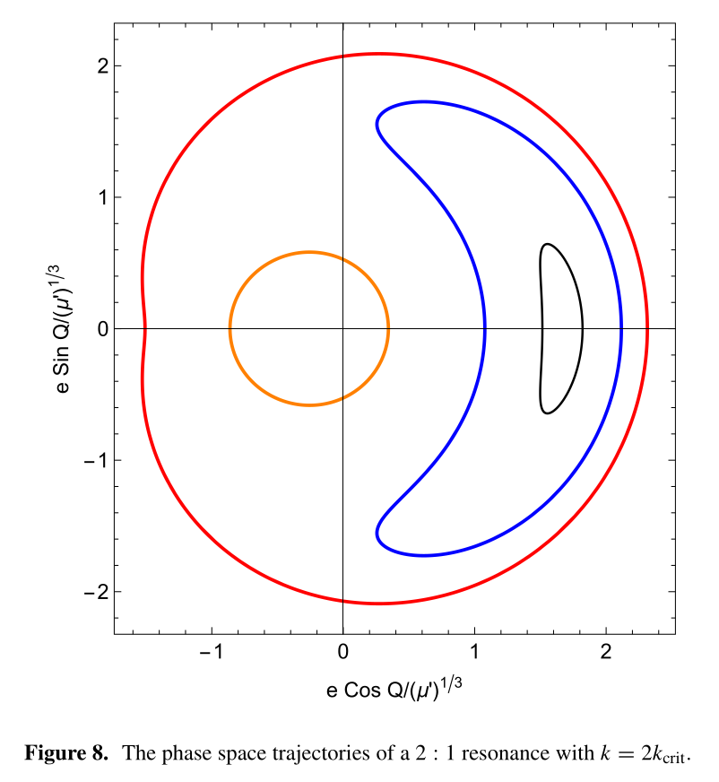
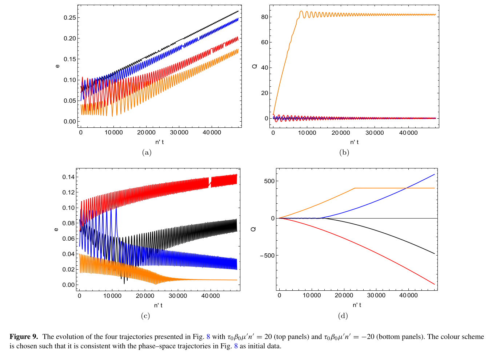

#### 4.2 With migration torques

- without the interfering density waves terms
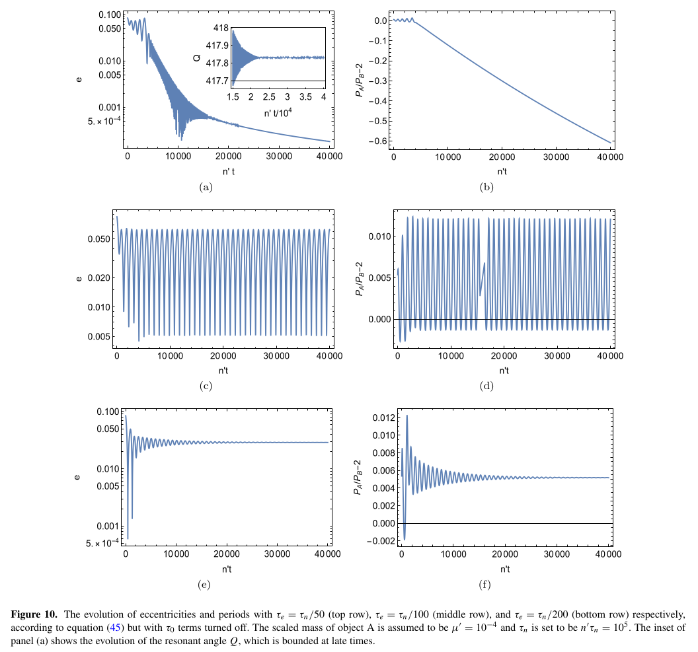

- considering the interfering density waves terms
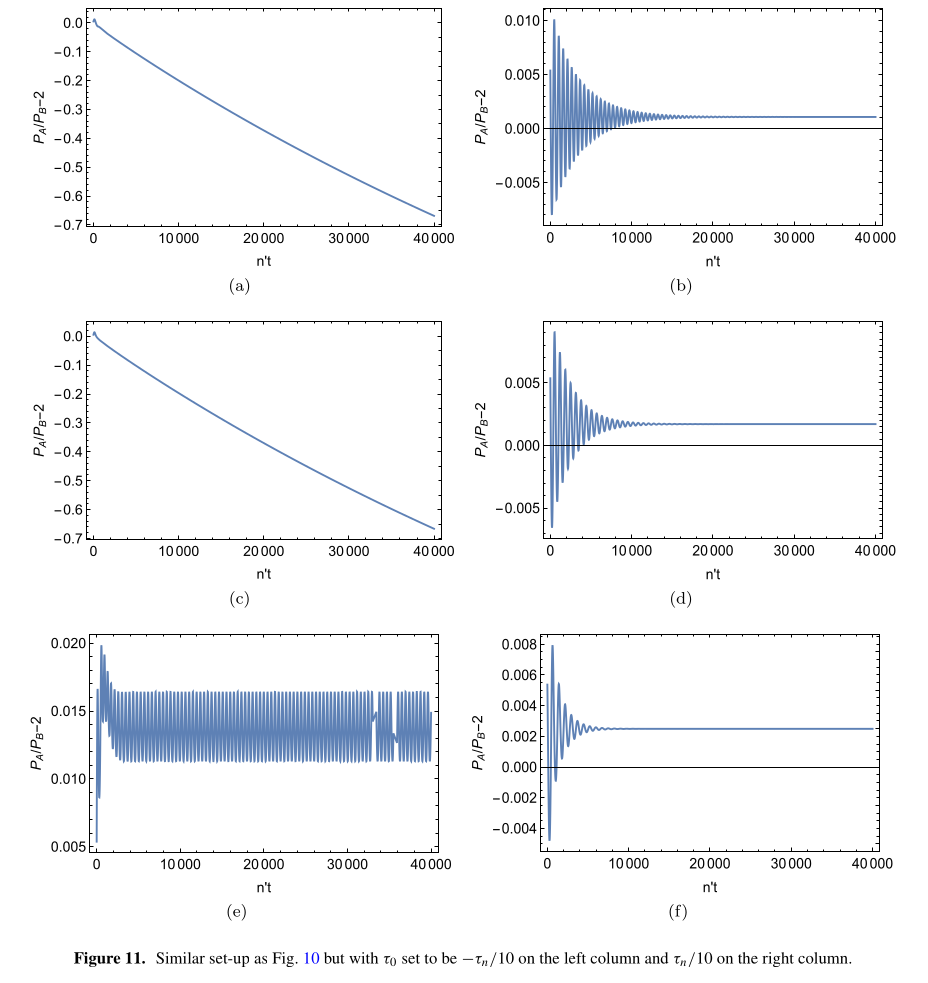
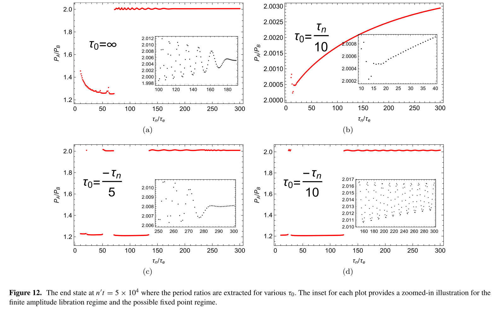
